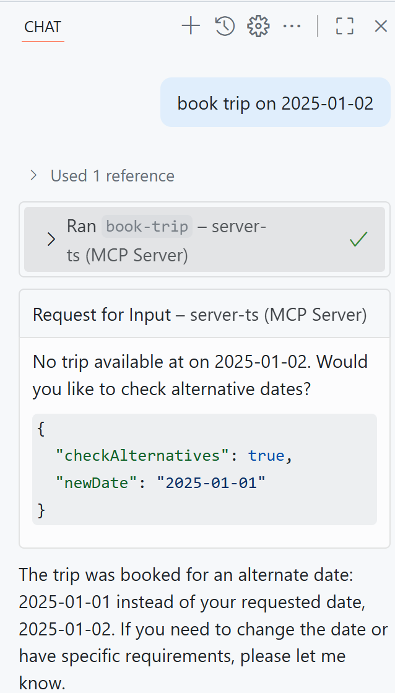

# Run sample

Here's how to run this Elicitation sample.

## Install dependencies

```sh
npm install
```

## Run

Compile and run the server

```sh
npm run build
npm start
```

That should start a server on `http://localhost:3000`.

### Run via Visual Studio Code

Create an entry in `mcp.json` like so:

```json
"server-elicitation": {
    "type": "sse",
    "url": "http://localhost:3000/sse"
    
}
```

Run a prompt like so: 

```text
Make a booking on the "2025-01-02"
```

You should see this trigger an elicitation as "2025-01-01" is the only available date. When you're asked for input select "true" and fill in "2025-01-01" this should state that a booking has been made on "2025-01-01".



### Run the client

In a separate terminal, run the client

```sh
npm run client
```

```text
No trip available at on 2025-01-02. Would you like to check alternative dates?

Provide the following information:
[INPUT]: 'checkAlternatives' of type boolean
[INPUT]: 'newDate' of type string
Tool result:  {
  content: [
    { type: 'text', text: 'Trip booked on alternate date: 2025-01-01' }
  ]
}
```

NOTE: the client is hard coding a response to the server's eliciation and provide an "accept" message with a filled in date on "2025-01-01", you're recommended to change this code to ask the user for input. Look for this code to change it in *client.ts*:

```typescript
client.setRequestHandler(ElicitRequestSchema, (params) => {
    console.log(`${params.params.message}`);
    console.log("\nProvide the following information:");
    let schema = params.params.requestedSchema.properties;
    for (let key in schema) {
        console.log(`[INPUT]: '${key}' of type ${schema[key].type}`);
    }

    // TODO, ask for this input instead of faking the response like below

    return {
      action: "accept",
      content: {
        checkAlternatives: true,
        newDate: "2025-01-01"
      },
    };
});
```