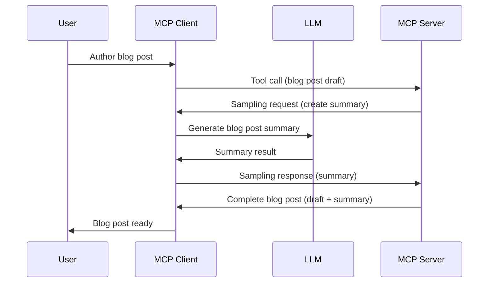

# Sampling - delegate features to the Client

Sometimes, you need the MCP Client and the MCP Server to collaborate to achieve a common goal. You might have a case where the Server requires the help of an LLM that sits on the client. For this situation, sampling is what you should use.

Let's explore some use cases and how to build a solution involving sampling.

## Overview

In this lesson, we focus on explaining when and where to use Sampling and how to configure it.

## Learning Objectives

In this chapter, we will:

- Explain what Sampling is and when to use it.
- Show how to configure Sampling in MCP.
- Provide examples of Sampling in action.

## What is Sampling and why use it?

Sampling is an davanced features that works in the following way:



### Sampling request

Ok, now we have a mile high view of a credible scenario, let's talk about the sampling request the server sends back to the client. Here's what such a request can look like in JSON-RPC format:

```json
{
  "jsonrpc": "2.0",
  "id": 1,
  "method": "sampling/createMessage",
  "params": {
    "messages": [
      {
        "role": "user",
        "content": {
          "type": "text",
          "text": "Create a blog post summary of the following blog post: <BLOG POST>"
        }
      }
    ],
    "modelPreferences": {
      "hints": [
        {
          "name": "claude-3-sonnet"
        }
      ],
      "intelligencePriority": 0.8,
      "speedPriority": 0.5
    },
    "systemPrompt": "You are a helpful assistant.",
    "maxTokens": 100
  }
}
```

There's a few things here worth calling out:

- Prompt, under content -> text, is our prompt that is an instruction for the LLM to summarize blog post content.

- **modelPreferences**. This section is just that, a preference, a recommendation of what configuration to use with the LLM. The user can choose whether to go with these recommendations or change them. In this case there are recommendations on model to use and speed and intelligence priority.
- **systemPrompt**, this is your normal system prompt that gives your LLM a personaly and contains guidance instructions.
- **maxTokens**, this is another property that's used to say how many tokens is recommended to use for this task.

### Sampling response

This response is what the MCP Client ends up sending back to the the MCP Server and is the result of the client calling the LLM, wait for that response and then construct this message. Here's what it can look like in JSON-RPC:

```json
{
  "jsonrpc": "2.0",
  "id": 1,
  "result": {
    "role": "assistant",
    "content": {
      "type": "text",
      "text": "Here's your abstract <ABSTRACT>"
    },
    "model": "gpt-5",
    "stopReason": "endTurn"
  }
}
```

Note how the response is an abstract of the blog post just like we asked for. Also note how the used `model` isn't what we asked for but "gpt-5" over "claude-3-sonnet". This is to illustrate that the user can change their mind on what to use and that your sampling request is a recommendation.

Ok, now that we understand the main flow, and useful task to use it for "blog post creation + abstract", let's see what we need to do to get it to work.

## How to Configure Sampling

## Examples of Sampling in Action

## Assesment

## Solution

## Key Takeaways

## What's Next


