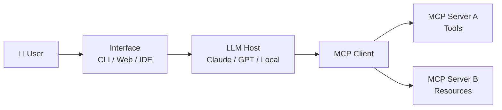

# Building MCP Apps

Building an MCP app means combining what you've learned throughout this module — servers, clients, transports, LLM integration, and hosting — into a cohesive application. This lesson shows you how to assemble those parts into a working, end-to-end MCP-powered application, covering the architecture, patterns, and practical code you'll need to get there.

## Overview

This lesson explores how to design and build complete MCP applications. You'll learn the typical architecture of an MCP app, how the different components interact, and how to apply that knowledge to build a real application from scratch.

## Learning Objectives

By the end of this lesson, you will be able to:

- Describe the typical architecture of a complete MCP application.
- Identify the roles of the server, client, and host in an end-to-end MCP app.
- Build a simple but complete MCP application combining tools, resources, and LLM integration.
- Choose appropriate transport types and deployment strategies for your use case.

## Prerequisites

- Completion of lessons 1–13 in this module (or equivalent experience with MCP servers, clients, and hosting).
- An API key for an LLM provider (for example, OpenAI or Azure OpenAI).
- Python 3.10+ or Node.js 18+ installed on your machine.

---

## What Is an MCP App?

An **MCP App** is a complete, end-to-end application built around the Model Context Protocol. It brings together:

| Component | Role |
|-----------|------|
| **MCP Server** | Exposes tools, resources, and prompts |
| **MCP Client** | Connects to servers and calls their features |
| **LLM / Host** | Uses the client to reason over tools and produce responses |
| **User Interface** | A CLI, web UI, or IDE integration that a person interacts with |



The key insight is that the LLM **decides** which tools to call; it does not hard-code any logic. The MCP server simply advertises capabilities, and the model picks the right ones at runtime.

---

## Building a Complete MCP App

The example below walks you through a minimal but complete MCP application in Python. It includes:

1. An MCP server that exposes a `get_weather` tool.
2. An MCP client that connects to the server.
3. A host loop that passes user questions to an LLM and executes any tool calls the model requests.

### 1. MCP Server (`server.py`)

```python
from mcp.server.fastmcp import FastMCP

mcp = FastMCP("Weather App")

@mcp.tool()
def get_weather(city: str) -> str:
    """Return a mock weather report for the given city."""
    # In a real app, call a weather API here.
    return f"The weather in {city} is 22 °C and sunny."

if __name__ == "__main__":
    mcp.run()
```

Start the server in one terminal:

```bash
python server.py
```

### 2. MCP Client and Host Loop (`app.py`)

```python
import asyncio
import json
import os
from mcp import ClientSession, StdioServerParameters
from mcp.client.stdio import stdio_client
from openai import AsyncOpenAI

SERVER_SCRIPT = "server.py"

async def run():
    openai = AsyncOpenAI(api_key=os.environ["OPENAI_API_KEY"])

    server_params = StdioServerParameters(
        command="python",
        args=[SERVER_SCRIPT],
    )

    async with stdio_client(server_params) as (read, write):
        async with ClientSession(read, write) as session:
            await session.initialize()

            # Fetch tools and convert to OpenAI function format
            tools_result = await session.list_tools()
            tools = [
                {
                    "type": "function",
                    "function": {
                        "name": t.name,
                        "description": t.description,
                        "parameters": t.inputSchema,
                    },
                }
                for t in tools_result.tools
            ]

            messages = [
                {
                    "role": "user",
                    "content": "What's the weather like in London?",
                }
            ]

            # Agentic loop
            while True:
                response = await openai.chat.completions.create(
                    model="gpt-4o-mini",
                    messages=messages,
                    tools=tools,
                )
                choice = response.choices[0]

                if choice.finish_reason == "tool_calls":
                    messages.append(choice.message)
                    for call in choice.message.tool_calls:
                        args = json.loads(call.function.arguments)
                        result = await session.call_tool(call.function.name, args)
                        messages.append(
                            {
                                "role": "tool",
                                "tool_call_id": call.id,
                                "content": result.content[0].text,
                            }
                        )
                else:
                    print("Assistant:", choice.message.content)
                    break

asyncio.run(run())
```

Run the app:

```bash
export OPENAI_API_KEY=your-api-key
python app.py
```

You should see output similar to:

```
Assistant: The weather in London is 22 °C and sunny.
```

---

## Key Patterns

### Tool-Call Loop

Most MCP apps implement an **agentic loop**:

1. Send the user's message to the LLM together with the list of available tools.
2. If the model returns a `tool_calls` response, execute each tool via the MCP client.
3. Append the tool results to the conversation and call the LLM again.
4. Repeat until the model produces a final text response with no further tool calls.

### Multiple Servers

A client can connect to more than one server at the same time, each exposing different tools or resources:

```python
# Connect to several servers and merge their tool lists
weather_tools   = await weather_session.list_tools()
database_tools  = await database_session.list_tools()
all_tools = weather_tools.tools + database_tools.tools
```

### Resources as Context

Use MCP **resources** to inject background knowledge into the conversation before asking the model anything:

```python
# Read a resource and prepend it to the message list
resource = await session.read_resource("file:///docs/manual.md")
messages.insert(0, {"role": "system", "content": resource.contents[0].text})
```

### Prompts as Templates

Retrieve a pre-defined **prompt** from the server to give users a consistent starting point:

```python
prompt = await session.get_prompt("summarise", {"style": "bullet-points"})
messages = [{"role": m.role, "content": m.content.text} for m in prompt.messages]
```

---

## Transport Considerations

| Scenario | Recommended transport |
|----------|-----------------------|
| Single-user desktop app or script | `stdio` |
| Web app with a remote server | Streamable HTTP (SSE) |
| Multiple clients sharing one server | Streamable HTTP (SSE) |
| Development / testing | `stdio` or MCP Inspector |

See [Lesson 6 – HTTP Streaming](../06-http-streaming/README.md) for guidance on setting up Streamable HTTP transport.

---

## Deployment Checklist

When you're ready to deploy your MCP app:

1. **Harden the server** – Validate inputs, handle errors gracefully, add authentication (see [Lesson 11](../11-simple-auth/README.md)).
2. **Choose a transport** – Use `stdio` for local apps; use Streamable HTTP for remote or shared servers.
3. **Manage secrets** – Keep API keys out of source code; use environment variables or a secrets manager.
4. **Containerise (optional)** – Package the server in a Docker image for consistent deployment (see [Lesson 9](../09-deployment/README.md)).
5. **Monitor** – Add logging so you can trace tool calls and diagnose failures in production.

---

## What's Next

You've completed Module 3: Getting Started! Continue your learning:

- [Module 4: Practical Implementation](../../04-PracticalImplementation/README.md) – Deeper dives into multi-language samples and advanced patterns.
- [Module 5: Advanced Topics](../../05-AdvancedTopics/README.md) – Sampling, elicitation, federation, and more.

---

## Additional Resources

- [MCP Python SDK](https://github.com/modelcontextprotocol/python-sdk)
- [MCP TypeScript SDK](https://github.com/modelcontextprotocol/typescript-sdk)
- [MCP Specification – 2025-11-25](https://spec.modelcontextprotocol.io/specification/2025-11-25/)
- [Building Agents with MCP on Azure](https://learn.microsoft.com/azure/developer/ai/intro-agents-mcp)
