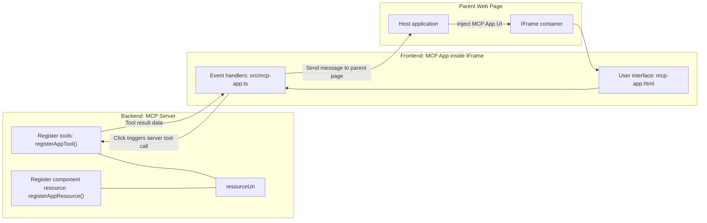
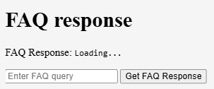
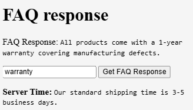
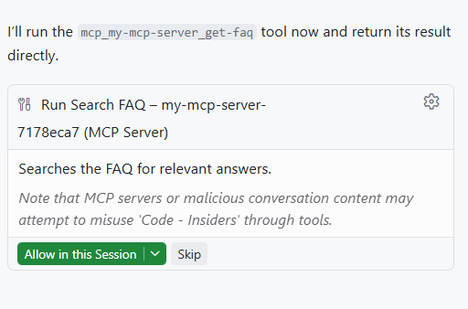
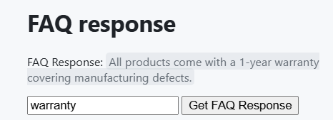

# MCP Apps

MCP Apps is a new paradigm in MCP. The idea is that not only do you respond with data back from a tool call, you also provide information on how this information should be interacted with. That means tool results now can contain UI information. Why would we want that though? Well, consider how you do things today. You're likely consuming the results of an MCP Server by putting some type of frontend in front of it, that's code you need to write and maintain. Sometimes that's what you want, but sometimes it would be great if you could just bring in a snippet of information that is self-contained that has it all from data to user interface.

## Overview

This lesson provides practical guidance on MCP Apps, how to get started with it and how to integrate it in your existing Web Apps. MCP Apps is a very new addition to the MCP Standard.

## Learning Objectives

By the end of this lesson, you will be able to:

- Explain what MCP Apps are.
- When to use MCP Apps.
- Build and integrate your own MCP Apps.

## MCP Apps - how does it work

The idea with MCP Apps is to provide a response that essentially is a component to be rendered. Such a component can have both visuals and interactivity, e.g button clicks, user input and more. Let's start with the server side and our MCP Server. To create an MCP App component you need two create a tool but also the application resource. These two halves are connected by a resourceUri. 

Here's an example. Let's try to visualize what's involved and what parts does what:

```text
server.ts -- responsible for registering tools and the component as a UI component
src/
  mcp-app.ts -- wiring up event handlers
mcp-app.html -- the user interface
```

This visual describes the architecture for create a component and it's logic.



Let's try to describe the responsibilities next for backend and frontend respectively.

### The backend

There's two things we need to accomplish here:

- Registering the tools we want to interact with.
- Define the component. 

**Registering the tool**

```typescript
registerAppTool(
    server,
    "get-time",
    {
      title: "Get Time",
      description: "Returns the current server time.",
      inputSchema: {},
      _meta: { ui: { resourceUri } }, // Links this tool to its UI resource
    },
    async () => {
      const time = new Date().toISOString();
      return { content: [{ type: "text", text: time }] };
    },
  );

```

The preceding code describe the behavior, where it exposes a tool called `get-time`. It takes no inputs but ends up producing the current time. We do have the ability to define an `inputSchema` for tools where we need to be able to accept user input. 

**Registering the component**

In the same file, we also need to register the component:

```typescript
const resourceUri = "ui://get-time/mcp-app.html";

// Register the resource, which returns the bundled HTML/JavaScript for the UI.
registerAppResource(
  server,
  resourceUri,
  resourceUri,
  { mimeType: RESOURCE_MIME_TYPE },
  async () => {
    const html = await fs.readFile(path.join(DIST_DIR, "mcp-app.html"), "utf-8");

    return {
    contents: [
        { uri: resourceUri, mimeType: RESOURCE_MIME_TYPE, text: html },
    ],
    };
  },
);
```

Note how we mention `resourceUri` to connect the component with its tools. Of interest is also the callback where we load the UI file and return the component.

### The component frontend

Just like the backend, there's two pieces here:

- A frontend written in pure HTML.
- Code that handles events and what to do, e.g calling tools or messaging the parent window.

**User interface**

Let's have a look at the user interface.

```html
<!-- mcp-app.html -->
<!DOCTYPE html>
<html lang="en">
  <head>
    <meta charset="UTF-8" />
    <title>Get Time App</title>
  </head>
  <body>
    <p>
      <strong>Server Time:</strong> <code id="server-time">Loading...</code>
    </p>
    <button id="get-time-btn">Get Server Time</button>
    <script type="module" src="/src/mcp-app.ts"></script>
  </body>
</html>
```

**Event wireup**

The last piece is the event wireup. That means we identifying which part in our UI needs event handlers and what to do if events are raised:

```typescript
// mcp-app.ts

import { App } from "@modelcontextprotocol/ext-apps";

// Get element references
const serverTimeEl = document.getElementById("server-time")!;
const getTimeBtn = document.getElementById("get-time-btn")!;

// Create app instance
const app = new App({ name: "Get Time App", version: "1.0.0" });

// Handle tool results from the server. Set before `app.connect()` to avoid
// missing the initial tool result.
app.ontoolresult = (result) => {
  const time = result.content?.find((c) => c.type === "text")?.text;
  serverTimeEl.textContent = time ?? "[ERROR]";
};

// Wire up button click
getTimeBtn.addEventListener("click", async () => {
  // `app.callServerTool()` lets the UI request fresh data from the server
  const result = await app.callServerTool({ name: "get-time", arguments: {} });
  const time = result.content?.find((c) => c.type === "text")?.text;
  serverTimeEl.textContent = time ?? "[ERROR]";
});

// Connect to host
app.connect();
```

As you can see from the above, this is normal code for hooking up DOM elements to events. Worth calling out is the call to `callServerTool` that ends up calling a tool on the backend.

## Dealing with user input

So far, we've seen a component that has a button that when clicked calls a tool. Let's see if we can add more UI elements like an input field and see if we can send arguments to a tool. Let's implement an FAQ functionality. Here's how it should work:

- There should be a button and an input element where the user types a keyword to search for for example "Shipping". This should call a tool on the backend that does a search in the FAQ data.
- A tool that supports the mentioned FAQ search.

Let's add the needed support to the backend first:

```typescript
const faq: { [key: string]: string } = {
    "shipping": "Our standard shipping time is 3-5 business days.",
    "return policy": "You can return any item within 30 days of purchase.",
    "warranty": "All products come with a 1-year warranty covering manufacturing defects.",
  }

registerAppTool(
    server,
    "get-faq",
    {
      title: "Search FAQ",
      description: "Searches the FAQ for relevant answers.",
      inputSchema: zod.object({
        query: zod.string().default("shipping"),
      }),
      _meta: { ui: { resourceUri: faqResourceUri } }, // Links this tool to its UI resource
    },
    async ({ query }) => {
      const answer: string = faq[query.toLowerCase()] || "Sorry, I don't have an answer for that.";
      return { content: [{ type: "text", text: answer }] };
    },
  );
```

What we're seing here is how we populate `inputSchema` and give it a `zod` schema like so:

```typescript
inputSchema: zod.object({
  query: zod.string().default("shipping"),
})
```

In above schema we declare we have an input parameter called `query` and that it's optional with a default value of "shipping". 

Ok, let's move on to *mcp-app.html* to see what UI we need to create for this:

```html
<div class="faq">
    <h1>FAQ response</h1>
    <p>FAQ Response: <code id="faq-response">Loading...</code></p>
    <input type="text" id="faq-query" placeholder="Enter FAQ query" />
    <button id="get-faq-btn">Get FAQ Response</button>
  </div>
```

Great, now we have an input element and button. Let's go to *mcp-app.ts* next to wire up these events:

```typescript
const getFaqBtn = document.getElementById("get-faq-btn")!;
const faqQueryInput = document.getElementById("faq-query") as HTMLInputElement;

getFaqBtn.addEventListener("click", async () => {
  const query = faqQueryInput.value;
  const result = await app.callServerTool({ name: "get-faq", arguments: { query } });
  const faq = result.content?.find((c) => c.type === "text")?.text;
  faqResponseEl.textContent = faq ?? "[ERROR]";
});
```

In the code above we:

- Create references to the interesting UI elements.
- Handle a button click to parse out the input element value and we also call `app.callServerTool()` with `name` and `arguments` where the latter is passing `query` as value. 

What actually happens whwn you call `callServerTool` is that it sends a message to the parent window and that window ends up calling the MCP Server.

### Try it out

Trying this out we should now see the following:



and here's where we try it with input like "warranty"



To run this code, head over to [Code section](./code/README.md)

## Testing in Visual Studio Code

Visual Studio Code have great support for MVP Apps and is probably one of the easiest ways of testing your MCP Apps. To use Visual Studio Code, add a server entry to *mcp.json* like so:

```json
"my-mcp-server-7178eca7": {
    "url": "http://localhost:3001/mcp",
    "type": "http"
  }
```

Then start the server, you should be able to communicate with your MVP App through the Chat Window providing you have GitHub Copilot installed. 

with by triggering via prompt, for example "#get-faq":



and just like when you ran it through a web browser, it renders the same way like so:



## Assignment

Create a rock paper scissor game. It should consist of the following:

UI:

- a drop down list with options
- a button to submit a choice
- a label showing who picked what and who won

Server:

- should have a tool rock paper scissor tool that takes "choice" as input. It should also render a computer choice and determine winner

## Solution

[Solution](./assignment/README.md)

## Summary

We learned about this new paradigm MCP Apps. It's a new paradigm that allows MCP Servers to have an opinion about not only the data but also how this data should be presented. 

Additionally, we learned that these MCP Apps are hosted into an IFrame and to communicate with MCP Servers they would need to send messages to the parent web app. There are several libraries out there for both plain JavaScript and React and more that makes this communication easier. 

## Key Takeaways

Here's what you learned:

- MCP Apps is a new standard that can be useful when you want to ship both data and UI features.
- These types of apps run in an IFrame for security reasons.


## What's Next

- [Chapter 4](../../04-PracticalImplementation/README.md)
