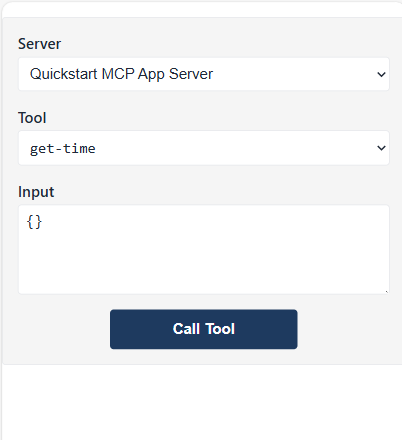
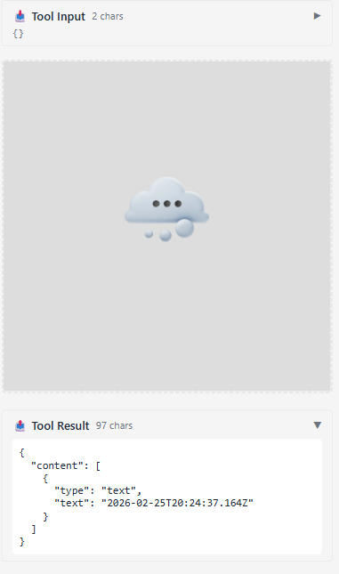

Here's a sample demonstrating MCP App

## Install 

1. Navigate to *mcp-app* folder
1. Run `npm install`, this should install frontend and backend dependencies

Verify the backend compiles by running:

```sh
npx tsc --noEmit
```

There should be no output if everything is fine.

## Run backend

This app has two parts, a backend part and a host part.

Start the backend by calling:

```sh
npm start
```

This should shart the backend on `http://localhost:3001/mcp`. 

> Note, if you're in a Codespace, you may need to set port visibility to public. Check you can reach endpoint in the browser through https://<name of Codespace>.app.github.dev/mcp

## Start the host


- In a separate terminal window, navigate to *ext-apps/examples/basic-host*

    > if you Codespace, you need to navigate to serve.ts and line 27 and replace http://localhost:3001/mcp with your Codespace URL for the backend, so for example https://psychic-xylophone-657rpjgvxpc5g64-3001.app.github.dev/mcp

- Install dependencies

   ```sh
   npm install
   ```

- Run the host:

    ```sh
    npm start
    ```

    This should connect the host with backend and you should see the app running like so:

    

## Test out the app

Try the app in the following way:

- Select "Call Tool" button and you should see the results like so:

    

Great, it's all working.