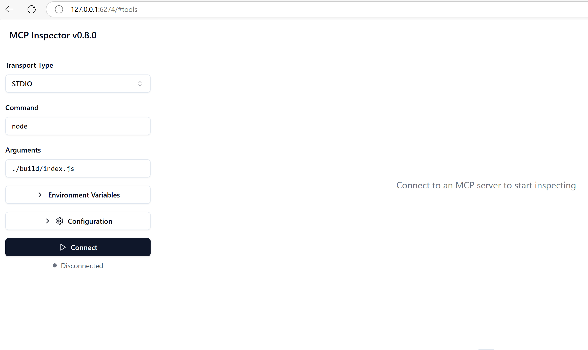

# Practical Implementation

Practical implementation is where the power of the Model Context Protocol (MCP) becomes tangible. While understanding the theory and architecture behind MCP is important, the real value emerges when you apply these concepts to build, test, and deploy solutions that solve real-world problems. This chapter bridges the gap between conceptual knowledge and hands-on development, guiding you through the process of bringing MCP-based applications to life.

Whether you are developing intelligent assistants, integrating AI into business workflows, or building custom tools for data processing, MCP provides a flexible foundation. Its language-agnostic design and official SDKs for popular programming languages make it accessible to a wide range of developers. By leveraging these SDKs, you can quickly prototype, iterate, and scale your solutions across different platforms and environments.

In the following sections, you'll find practical examples, sample code, and deployment strategies that demonstrate how to implement MCP in C#, Java, TypeScript, JavaScript, and Python. You'll also learn how to debug and test your MCP servers, manage APIs, and deploy solutions to the cloud using Azure. These hands-on resources are designed to accelerate your learning and help you confidently build robust, production-ready MCP applications.

## Overview

This lesson focuses on the practical aspects of MCP implementation across multiple programming languages. We'll explore how to use MCP SDKs in C#, Java, TypeScript, JavaScript, and Python to build robust applications, debug and test MCP servers, and create reusable resources, prompts, and tools.

## Learning Objectives

By the end of this lesson, you will be able to:

- Implement MCP solutions using official SDKs in various programming languages.
- Debug and test MCP servers systematically.
- Create and use server features (Resources, Prompts, and Tools).
- Design effective MCP workflows for complex tasks.
- Optimize MCP implementations for performance and reliability.

## Official SDK Resources

The Model Context Protocol offers official SDKs for multiple languages:

- [C# SDK](https://github.com/modelcontextprotocol/csharp-sdk)
- [Java SDK](https://github.com/modelcontextprotocol/java-sdk)
- [TypeScript SDK](https://github.com/modelcontextprotocol/typescript-sdk)
- [Python SDK](https://github.com/modelcontextprotocol/python-sdk)
- [Kotlin SDK](https://github.com/modelcontextprotocol/kotlin-sdk)

## Working with MCP SDKs

This section provides practical examples of implementing MCP across multiple programming languages. You can find sample code in the `samples` directory, organized by language.

### Available Samples

The repository includes sample implementations in the following languages:

- C#
- Java
- TypeScript
- JavaScript
- Python

Each sample demonstrates key MCP concepts and implementation patterns for that specific language and ecosystem.

## Core Server Features

MCP servers can implement any combination of these features:

### Resources
Resources provide context and data for the user or AI model to use:
- Document repositories
- Knowledge bases
- Structured data sources
- File systems

### Prompts
Prompts are templated messages and workflows for users:
- Pre-defined conversation templates
- Guided interaction patterns
- Specialised dialogue structures

### Tools
Tools are functions for the AI model to execute:
- Data processing utilities
- External API integrations
- Computational capabilities
- Search functionality

## Sample Implementations: C#

The official C# SDK repository contains several sample implementations demonstrating different aspects of MCP:

- **Basic MCP Client**: Simple example showing how to create an MCP client and call tools.
- **Basic MCP Server**: Minimal server implementation with basic tool registration.
- **Advanced MCP Server**: Full-featured server with tool registration, authentication, and error handling.
- **ASP.NET Integration**: Examples demonstrating integration with ASP.NET Core.
- **Tool Implementation Patterns**: Various patterns for implementing tools with different complexity levels.

The MCP C# SDK is in preview and APIs may change. We will continuously update this documentation as the SDK evolves.

### Key Features 
- [C# MCP NuGet ModelContextProtocol](https://www.nuget.org/packages/ModelContextProtocol)
- Building your [first MCP Server](https://devblogs.microsoft.com/dotnet/build-a-model-context-protocol-mcp-server-in-csharp/).

For complete C# implementation samples, visit the [official C# SDK samples repository](https://github.com/modelcontextprotocol/csharp-sdk).

## Sample Implementation: Java

The Java SDK offers robust MCP implementation options with enterprise-grade features.

### Key Features

- Spring Framework integration
- Strong type safety
- Reactive programming support
- Comprehensive error handling

For a complete Java implementation sample, see [MCPSample.java](samples/java/MCPSample.java) in the samples directory.

## Sample Implementation: JavaScript

The JavaScript SDK provides a lightweight and flexible approach to MCP implementation.

### Key Features

- Node.js and browser support
- Promise-based API
- Easy integration with Express and other frameworks
- WebSocket support for streaming

For a complete JavaScript implementation sample, see [mcp_sample.js](samples/javascript/mcp_sample.js) in the samples directory.

## Sample Implementation: Python

The Python SDK offers a Pythonic approach to MCP implementation with excellent ML framework integrations.

### Key Features

- Async/await support with asyncio
- Flask and FastAPI integration
- Simple tool registration
- Native integration with popular ML libraries

For a complete Python implementation sample, see [mcp_sample.py](samples/python/mcp_sample.py) in the samples directory.

## API Management

Azure API Management is a great answer to how we can secure MCP Servers. The idea is to put an Azure API Management instance in front of your MCP Server and let it handle features you're likely to want, such as:

- Rate limiting
- Token management
- Monitoring
- Load balancing
- Security

### Azure Sample

Here's an Azure sample doing exactly that—[creating an MCP Server and securing it with Azure API Management](https://github.com/Azure-Samples/remote-mcp-apim-functions-python).

See how the authorization flow happens in the image below:

 

In the preceding image, the following takes place:

- Authentication/Authorization takes place using Microsoft Entra.
- Azure API Management acts as a gateway and uses policies to direct and manage traffic.
- Azure Monitor logs all requests for further analysis.

#### Authorization Flow

Let's have a look at the authorization flow in more detail:


#### MCP Authorization Specification

Learn more about the [MCP Authorization specification](https://modelcontextprotocol.io/specification/2025-03-26/basic/authorization#2-10-third-party-authorization-flow).

## Deploy Remote MCP Server to Azure

Let's see if we can deploy the sample mentioned earlier:

1. Clone the repo:

    ```bash
    git clone https://github.com/Azure-Samples/remote-mcp-apim-functions-python.git
    cd remote-mcp-apim-functions-python
    ```

2. Register the `Microsoft.App` resource provider.
    - If you are using Azure CLI, run:
      ```sh
      az provider register --namespace Microsoft.App --wait
      ```
    - If you are using Azure PowerShell, run:
      ```powershell
      Register-AzResourceProvider -ProviderNamespace Microsoft.App
      ```
      Then run:
      ```powershell
      (Get-AzResourceProvider -ProviderNamespace Microsoft.App).RegistrationState
      ```
      After some time to check if the registration is complete.

3. Run this [azd](https://aka.ms/azd) command to provision the API Management service, function app (with code), and all other required Azure resources:

    ```sh
    azd up
    ```

    This command should deploy all the cloud resources on Azure.

### Testing Your Server with MCP Inspector

1. In a **new terminal window**, install and run MCP Inspector:

    ```sh
    npx @modelcontextprotocol/inspector
    ```

    You should see an interface similar to:

    

2. CTRL+Click to load the MCP Inspector web app from the URL displayed by the app (e.g., http://127.0.0.1:6274/#resources).
3. Set the transport type to `SSE`.
4. Set the URL to your running API Management SSE endpoint displayed after `azd up` and **Connect**:

    ```
    https://<apim-servicename-from-azd-output>.azure-api.net/mcp/sse
    ```

5. **List Tools**. Click on a tool and **Run Tool**.

If all the steps have worked, you should now be connected to the MCP server and able to call a tool.

## MCP Servers for Azure

[Remote-mcp-functions](https://github.com/Azure-Samples/remote-mcp-functions-dotnet): This set of repositories is a quickstart template for building and deploying custom remote MCP (Model Context Protocol) servers using Azure Functions with Python, C# .NET, or Node/TypeScript.

The samples provide a complete solution that allows developers to:

- Build and run locally: Develop and debug an MCP server on a local machine.
- Deploy to Azure: Easily deploy to the cloud with a simple `azd up` command.
- Connect from clients: Connect to the MCP server from various clients, including VS Code's Copilot agent mode and the MCP Inspector tool.

### Key Features

- Security by design: The MCP server is secured using keys and HTTPS.
- Authentication options: Supports OAuth using built-in auth and/or API Management.
- Network isolation: Allows network isolation using Azure Virtual Networks (VNET).
- Serverless architecture: Leverages Azure Functions for scalable, event-driven execution.
- Local development: Comprehensive local development and debugging support.
- Simple deployment: Streamlined deployment process to Azure.

The repository includes all necessary configuration files, source code, and infrastructure definitions to quickly get started with a production-ready MCP server implementation.

- [Azure Remote MCP Functions Python](https://github.com/Azure-Samples/remote-mcp-functions-python) - Sample implementation of MCP using Azure Functions with Python.
- [Azure Remote MCP Functions .NET](https://github.com/Azure-Samples/remote-mcp-functions-dotnet) - Sample implementation of MCP using Azure Functions with C# .NET.
- [Azure Remote MCP Functions Node/Typescript](https://github.com/Azure-Samples/remote-mcp-functions-typescript) - Sample implementation of MCP using Azure Functions with Node/TypeScript.

## Key Takeaways

- MCP SDKs provide language-specific tools for implementing robust MCP solutions.
- The debugging and testing process is critical for reliable MCP applications.
- Reusable prompt templates enable consistent AI interactions.
- Well-designed workflows can orchestrate complex tasks using multiple tools.
- Implementing MCP solutions requires consideration of security, performance, and error handling.

## Exercise

Design a practical MCP workflow that addresses a real-world problem in your domain:

1. Identify 3-4 tools that would be useful for solving this problem.
2. Create a workflow diagram showing how these tools interact.
3. Implement a basic version of one of the tools using your preferred language.
4. Create a prompt template that would help the model effectively use your tool.

## Additional Resources

---

Next: [Advanced Topics](../05-AdvancedTopics/README.md)
