# MCP Root Contexts 

Imagine you're having a complex technical discussion with a colleague that spans several days. Without taking notes, you'd lose track of important details and have to restart the conversation from scratch each time. This same challenge exists in AI interactions - how do we maintain continuity across multiple requests and sessions?

Root contexts are a fundamental concept in the Model Context Protocol that solve this exact problem. They provide a persistent layer for maintaining conversation history and shared state across multiple requests and sessions, enabling AI systems to have true memory and continuity.

Consider Sarah, a financial analyst who needs to examine quarterly reports with an AI assistant. In her first interaction, she asks about revenue trends. Later, she wants to understand cost drivers. Without root contexts, the AI would treat each question as isolated, missing the opportunity to connect insights across the analysis. With root contexts, the AI remembers the entire analytical journey, building sophisticated insights that span multiple interactions.

## Table of Contents

1. [Introduction](#introduction)
2. [Learning Objectives](#learning-objectives)
3. [Understanding Root Contexts](#understanding-root-contexts)
4. [Root Context Lifecycle](#root-context-lifecycle)
5. [Working with Root Contexts](#working-with-root-contexts)
   - [C# Implementation](#c-implementation)
   - [Java Implementation](#java-implementation)
   - [JavaScript Implementation](#javascript-implementation)
   - [Python Implementation](#python-implementation)
6. [Root Context Best Practices](#root-context-best-practices)
7. [What's Next](#whats-next)

## Introduction

Think of **root contexts** like having a personal notebook that remembers everything you've discussed with an AI assistant. Just as you might keep notes during a long meeting to remember what was said earlier, root contexts help AI systems remember previous conversations and maintain continuity across multiple interactions.

In this lesson, we will explore how to create, manage, and utilize root contexts in MCP. 

## Learning Objectives

By the end of this lesson, you will be able to:

- Understand the purpose and structure of root contexts
- Create and manage root contexts using MCP client libraries
- Implement root contexts in .NET, Java, JavaScript, and Python applications
- Utilize root contexts for multi-turn conversations and state management
- Implement best practices for root context management

## Understanding Root Contexts

**Root contexts** serve as containers that hold the history and state for a series of related interactions. Think of them as a digital conversation journal that remembers everything.

### Why Root Contexts Matter

| Feature | Benefit | Real-World Example |
|---------|---------|--------------------|
| **Conversation Persistence** | Maintaining coherent multi-turn conversations | Customer support chat that remembers previous issues |
| **Memory Management** | Storing and retrieving information across interactions | Personal assistant that recalls your preferences |
| **State Management** | Tracking progress in complex workflows | Project planning tool that tracks task completion |
| **Context Sharing** | Allowing multiple clients to access the same conversation state | Team collaboration where multiple users share context |

### Key Characteristics

In MCP, **root contexts** have these important features:

- ✅ **Unique Identifier**: Each root context has a specific `context_id` for tracking
- 📚 **Rich Content**: They store conversation history, user preferences, and `metadata`
- 🔄 **Lifecycle Management**: Can be created, accessed, and archived using `create()`, `get()`, and `archive()` methods
- 🔐 **Access Control**: Support fine-grained permissions and security via `access_policies`

## Root Context Lifecycle

To understand how root contexts work in practice, let's examine their complete lifecycle from creation to archival. The following diagram shows the typical flow of operations:


Now that we understand the lifecycle, let's see how this works in practice across different programming languages.

## Working with Root Contexts

The best way to understand root contexts is through hands-on examples. Let's learn how to create and manage root contexts step by step, starting with a customer support scenario that demonstrates the full workflow.

### C# Implementation

Our C# example will walk through building a complete customer support system using root contexts. We'll break this down into manageable steps to show how each piece fits together.

#### Step 1: Setting Up the Context Manager

Before we can work with root contexts, we need to establish our basic infrastructure. First, let's set up our basic structure:

```csharp
// .NET Example: Root Context Management Setup
using Microsoft.Mcp.Client;
using System;
using System.Threading.Tasks;
using System.Collections.Generic;

public class RootContextExample
{
    private readonly IMcpClient _client;
    private readonly IRootContextManager _contextManager;
    
    public RootContextExample(IMcpClient client, IRootContextManager contextManager)
    {
        _client = client;
        _contextManager = contextManager;
    }
```

This foundation code:
- Establishes a `RootContextExample` class for managing MCP contexts
- Injects `IMcpClient` for server communication
- Provides `IRootContextManager` for context lifecycle operations
- Demonstrates dependency injection patterns for clean architecture

#### Step 2: Creating a Root Context

With our infrastructure in place, we can now create root contexts that will persist our conversations. Next, let's create a new root context with meaningful metadata:

```csharp
    public async Task<string> CreateSupportContextAsync()
    {
        // Create a new root context for customer support
        var contextResult = await _contextManager.CreateRootContextAsync(new RootContextCreateOptions
        {
            Name = "Customer Support Session",
            Metadata = new Dictionary<string, string>
            {
                ["CustomerName"] = "Acme Corporation",
                ["PriorityLevel"] = "High",
                ["Domain"] = "Cloud Services"
            }
        });
        
        string contextId = contextResult.ContextId;
        Console.WriteLine($"✅ Created root context with ID: {contextId}");
        return contextId;
    }
```

The context creation method:
- Creates a `RootContextCreateOptions` object with descriptive metadata
- Stores customer details in the `Metadata` dictionary
- Returns a unique `contextId` for subsequent operations
- Logs confirmation of successful context creation using `Console.WriteLine()`

#### Step 3: Having Conversations with Context

The real power of root contexts becomes apparent when we start having conversations. Now we can send messages that maintain conversation history:

```csharp
    public async Task ConductConversationAsync(string contextId)
    {
        // First interaction using the context
        var response1 = await _client.SendPromptAsync(
            "I'm having issues scaling my web service deployment in the cloud.", 
            new SendPromptOptions { RootContextId = contextId }
        );
        Console.WriteLine($"🤖 AI Response: {response1.GeneratedText}");
        
        // Second interaction - AI remembers the previous conversation
        var response2 = await _client.SendPromptAsync(
            "Yes, we're using containerized deployments with Kubernetes.", 
            new SendPromptOptions { RootContextId = contextId }
        );
        Console.WriteLine($"🤖 AI Response: {response2.GeneratedText}");
    }
```

In this conversation handling code, we:
- Send the first message using `SendPromptAsync()` with context
- Pass the same `contextId` in `SendPromptOptions` for continuity
- Enable the AI to reference previous conversation history
- Show how `"Yes, we're using containerized deployments"` connects to the earlier scaling question

#### Step 4: Updating Context Metadata

As conversations evolve, we often discover important information that should be preserved. As the conversation progresses, we can add important information:

```csharp
    public async Task UpdateContextInfoAsync(string contextId)
    {
        // Add metadata based on what we learned from the conversation
        await _contextManager.UpdateContextMetadataAsync(contextId, new Dictionary<string, string>
        {
            ["TechnicalEnvironment"] = "Kubernetes",
            ["IssueType"] = "Scaling",
            ["Status"] = "In Progress"
        });
        
        Console.WriteLine("📝 Updated context metadata with conversation insights");
    }
```

This metadata update code:
- Calls `UpdateContextMetadataAsync()` to add new key-value pairs
- Captures technical environment details (`"Kubernetes"`)
- Records issue classification (`"Scaling"`)
- Preserves conversation insights for future reference and analytics

#### Step 5: Retrieving Context Information

At any point, we can inspect our context to understand its current state and history. Let's see how to get detailed information about our conversation:

```csharp
    public async Task DisplayContextInfoAsync(string contextId)
    {
        var contextInfo = await _contextManager.GetRootContextInfoAsync(contextId);
        
        Console.WriteLine("📊 Context Information:");
        Console.WriteLine($"   • Name: {contextInfo.Name}");
        Console.WriteLine($"   • Created: {contextInfo.CreatedAt}");
        Console.WriteLine($"   • Messages: {contextInfo.MessageCount}");
    }
```

The information retrieval method:
- Calls `GetRootContextInfoAsync()` to access conversation state
- Returns metadata like `CreatedAt` and `MessageCount`
- Enables operational monitoring of conversation patterns
- Supports debugging and analytics for support teams

#### Step 6: Archiving the Context

When our support session is complete, proper cleanup is essential for resource management. Finally, let's properly archive our completed conversation:

```csharp
    public async Task ArchiveContextAsync(string contextId)
    {
        // When the conversation is complete, archive the context
        await _contextManager.ArchiveRootContextAsync(contextId);
        Console.WriteLine($"🗄️ Archived context {contextId}");
    }
}
```

#### Complete Workflow

Now let's see how all these steps work together in a single, cohesive method:

```csharp
public async Task DemonstrateRootContextAsync()
{
    var contextId = await CreateSupportContextAsync();
    await ConductConversationAsync(contextId);
    await UpdateContextInfoAsync(contextId);
    await DisplayContextInfoAsync(contextId);
    await ArchiveContextAsync(contextId);
}
```

This complete workflow:
- Orchestrates all context operations in logical sequence
- Shows how `contextId` maintains continuity across method calls
- Illustrates the full lifecycle from `CreateSupportContextAsync()` to `ArchiveContextAsync()`
- Provides a template for production customer support implementations

**Progressive Learning Note**: We started with basic context creation and gradually built up to a complete workflow. This step-by-step approach helps you understand how each piece contributes to the overall system.

#### What We Accomplished

In the preceding code, we built a complete root context workflow:

| Step | Action | Why It Matters |
|------|--------|----------------|
| 1️⃣ | Created a support context | Establishes a persistent conversation space |
| 2️⃣ | Conducted multi-turn conversation | AI remembers previous messages and context |
| 3️⃣ | Updated metadata dynamically | Captures important insights for future reference |
| 4️⃣ | Retrieved context information | Provides visibility into conversation state |
| 5️⃣ | Archived when complete | Properly manages resources and preserves history |

> 💡 **Key Insight**: Notice how the AI's second response can reference the first message about "scaling issues" - this is the power of root contexts!

**Code Pattern Observation**: The C# implementation uses `async`/`await` with strongly-typed objects, demonstrating enterprise-grade patterns. Notice how the `RootContextCreateOptions` provides compile-time safety, while the `Dictionary<string, string>` offers flexible metadata storage.

With our C# foundation established, let's explore how the same concepts apply in a different business context using Java.

## Example: Financial Analysis with Root Contexts

Moving beyond customer support, let's explore a **financial analysis scenario** where an analyst needs to examine quarterly data and maintain context across multiple questions. This example will show how root contexts enable complex analytical workflows.

Imagine David, a senior financial analyst at a tech company, preparing for the quarterly board meeting. He needs to analyze revenue trends, understand cost drivers, and provide actionable recommendations. Without root contexts, he'd have to repeatedly provide background information to the AI. With root contexts, each question builds upon previous analysis, creating increasingly sophisticated insights that tell a complete financial story.

### Java Implementation

Our Java implementation demonstrates how to build sophisticated business intelligence tools with persistent context. We'll create a system that can conduct multi-step financial analysis while maintaining full conversation history.

#### Step 1: Setting Up the Financial Analysis Context

Business applications require robust infrastructure and clear separation of concerns. Let's start by building our financial analysis framework:

```java
// Java Example: Financial Analysis Context Setup
package com.example.mcp.contexts;

import com.mcp.client.McpClient;
import com.mcp.client.ContextManager;
import com.mcp.models.RootContext;
import com.mcp.models.McpResponse;
import java.util.HashMap;
import java.util.Map;

public class FinancialAnalysisContext {
    private final McpClient client;
    private final ContextManager contextManager;
    
    public FinancialAnalysisContext(String serverUrl) {
        this.client = new McpClient.Builder()
            .setServerUrl(serverUrl)
            .build();
        this.contextManager = new ContextManager(client);
    }
```

The Java setup code:
- Uses the builder pattern with `McpClient.Builder()` for flexible configuration
- Creates a `ContextManager` instance for encapsulating context operations
- Provides a clean API for financial analysis workflows
- Demonstrates enterprise Java patterns with `setServerUrl()` for MCP integration

#### Step 2: Creating a Financial Analysis Session

With our framework ready, we can now create specialized contexts for financial analysis work. Let's establish a dedicated session for our quarterly review:

```java
    public String createAnalysisSession() throws Exception {
        // Prepare metadata for our financial analysis
        Map<String, String> metadata = new HashMap<>();
        metadata.put("projectName", "Q1 2025 Financial Analysis");
        metadata.put("userRole", "Senior Financial Analyst");
        metadata.put("dataSource", "Q1 2025 Financial Reports");
        metadata.put("analysisType", "Technology Division Review");
        
        // Create the root context
        RootContext context = contextManager.createRootContext(
            "Financial Analysis Session", metadata);
        String contextId = context.getId();
        
        System.out.println("📊 Created financial analysis context: " + contextId);
        return contextId;
    }
```

In this session creation method, we:
- Build a `HashMap` with business-relevant metadata fields like `"projectName"` and `"userRole"`
- Call `createRootContext()` with structured analysis information
- Return a unique `contextId` from `context.getId()` for subsequent analytical operations
- Establish professional context that the AI can reference throughout analysis

#### Step 3: Initial Analysis Query

Now we're ready to begin our financial analysis with broad, exploratory questions. Let's start with our first analytical question:

```java
    public void performInitialAnalysis(String contextId) throws Exception {
        // Ask the first analytical question
        McpResponse response1 = client.sendPrompt(
            "Analyze the trends in Q1 financial data for our technology division. " +
            "Focus on revenue growth and major cost drivers.",
            contextId
        );
        
        System.out.println("📈 Initial Analysis:");
        System.out.println(response1.getGeneratedText());
        
        // Store key findings in context metadata
        contextManager.addContextMetadata(contextId, 
            Map.of("initialFinding", "Technology division showing strong revenue growth"));
    }
```

The initial analysis code:
- Sends a broad analytical question using `sendPrompt()` with the `contextId`
- Establishes the analytical framework for subsequent questions
- Calls `addContextMetadata()` with `"initialFinding"` to capture key insights
- Creates a searchable record of analysis progress for future reference

#### Step 4: Follow-up Deep Dive

Building on our initial findings, we can now ask more targeted questions that reference our earlier analysis. Let's drill down into specific trends we discovered:

```java
    public void performDeepDive(String contextId) throws Exception {
        // Update context with discovered trend
        contextManager.addContextMetadata(contextId, 
            Map.of("identifiedTrend", "Increasing cloud infrastructure costs"));
        
        // Follow-up question that builds on previous analysis
        McpResponse response2 = client.sendPrompt(
            "What's driving the increase in cloud infrastructure costs? " +
            "How does this compare to industry benchmarks?",
            contextId
        );
        
        System.out.println("🔍 Deep Dive Analysis:");
        System.out.println(response2.getGeneratedText());
    }
```

This deep dive code:
- References the trend identified in previous interactions through `"identifiedTrend"`
- Shows how the AI understands contextual connections via `Map.of()`
- Enables sophisticated analysis that builds on earlier findings
- Illustrates the power of conversational context over isolated questions

#### Step 5: Generating Executive Summary

After conducting our detailed analysis, we need to synthesize our findings for leadership. Let's create a comprehensive summary that draws from our entire conversation:

```java
    public void generateExecutiveSummary(String contextId) throws Exception {
        // Generate a comprehensive summary
        McpResponse summaryResponse = client.sendPrompt(
            "Based on our entire analysis, create an executive summary " +
            "with 3-5 key findings and actionable recommendations.",
            contextId
        );
        
        // Store the summary for future reference
        contextManager.addContextMetadata(contextId, Map.of(
            "executiveSummary", summaryResponse.getGeneratedText(),
            "analysisComplete", "true"
        ));
        
        System.out.println("📋 Executive Summary:");
        System.out.println(summaryResponse.getGeneratedText());
    }
```

The executive summary method:
- Leverages the entire conversation history with `"Based on our entire analysis"`
- Synthesizes insights from multiple conversation turns using `sendPrompt()`
- Generates actionable recommendations stored in `"executiveSummary"`
- Demonstrates how context enables sophisticated business intelligence

#### Step 6: Context Information and Archival

As we conclude our analysis, it's important to capture metadata and properly archive our work for future reference. Let's finalize our analysis session:

```java
    public void finalizeAnalysis(String contextId) throws Exception {
        // Get comprehensive context information
        RootContext updatedContext = contextManager.getRootContext(contextId);
        
        System.out.println("\n📊 Final Context Information:");
        System.out.println("├─ Created: " + updatedContext.getCreatedAt());
        System.out.println("├─ Last Updated: " + updatedContext.getLastUpdatedAt());
        System.out.println("└─ Status: Analysis Complete");
        
        // Archive the completed analysis
        contextManager.archiveContext(contextId);
        System.out.println("\n🗄️ Financial analysis context archived successfully");
    }
```

In this finalization process, we:
- Call `getRootContext()` to retrieve updated metadata with `getCreatedAt()` and `getLastUpdatedAt()`
- Use `archiveContext()` to properly close the analysis session
- Preserve completed analysis for future reference
- Demonstrate proper context lifecycle management patterns

#### Complete Analysis Workflow

Finally, let's see how all these analytical steps come together in one seamless process:

```java
    public void runCompleteAnalysis() throws Exception {
        String contextId = createAnalysisSession();
        performInitialAnalysis(contextId);
        performDeepDive(contextId);
        generateExecutiveSummary(contextId);
        finalizeAnalysis(contextId);
    }
}
```

The complete workflow:
- Sequences each method call from `createAnalysisSession()` to `finalizeAnalysis()`
- Maintains continuity through the shared `contextId` parameter
- Demonstrates end-to-end financial analysis capabilities
- Provides a template for enterprise business intelligence workflows

#### Financial Analysis Workflow Summary

Our Java implementation demonstrates a sophisticated financial analysis workflow:

```mermaid
flowchart LR
    A[📊 Create Session] --> B[📈 Initial Analysis]
    B --> C[🔍 Deep Dive]
    C --> D[📋 Executive Summary]
    D --> E[🗄️ Archive Context]
    
    style A fill:#e1f5fe
    style B fill:#f3e5f5
    style C fill:#fff3e0
    style D fill:#e8f5e8
    style E fill:#fce4ec
```



| Phase | What Happened | Context Benefit |
|-------|---------------|----------------|
| 🏗️ **Setup** | Created analysis session with metadata | Establishes professional context |
| 📊 **Initial Query** | Asked broad analysis question | AI understands the analytical framework |
| 🔍 **Deep Dive** | Follow-up questions reference previous findings | AI builds on earlier analysis |
| 📝 **Summary** | Generated executive summary of entire analysis | AI synthesizes all previous discussion |
| 🗄️ **Archive** | Stored complete analysis for future reference | Preserves institutional knowledge |

> 💼 **Business Value**: Each question builds on the previous one, creating a comprehensive analysis that wouldn't be possible without root contexts!

## Root Context Management in JavaScript

Let's explore how to build a **customer support system** that maintains conversation state across multiple interactions. We'll create a complete context management solution.

### JavaScript Implementation

#### Building a Context Session Manager

#### Step 1: Setting Up the Context Session Class

Modern customer support requires sophisticated state management and error handling. Let's create our core session management class:

```javascript
// JavaScript Example: Context Session Manager Setup
const { McpClient, RootContextManager } = require('@mcp/client');

class ContextSession {
  constructor(serverUrl, apiKey = null) {
    // Initialize the MCP client
    this.client = new McpClient({ serverUrl, apiKey });
    // Initialize context manager
    this.contextManager = new RootContextManager(this.client);
  }
```

The JavaScript constructor:
- Creates a `ContextSession` class using object-oriented patterns
- Accepts optional `apiKey` parameters for flexible authentication
- Encapsulates both `McpClient` and `RootContextManager` instances
- Provides a clean interface for customer support operations with `require('@mcp/client')`

#### Step 2: Creating Conversation Contexts

Every customer interaction should start with a properly configured context that captures relevant metadata. Now let's implement the ability to create rich, metadata-driven conversation contexts:

```javascript
  /**
   * Create a new conversation context
   * @param {string} sessionName - Name of the conversation session
   * @param {Object} metadata - Additional metadata for the context
   * @returns {Promise<string>} - Context ID
   */
  async createConversationContext(sessionName, metadata = {}) {
    try {
      const contextResult = await this.contextManager.createRootContext({
        name: sessionName,
        metadata: {
          ...metadata,
          createdAt: new Date().toISOString(),
          status: 'active'
        }
      });
      
      console.log(`✅ Created '${sessionName}' with ID: ${contextResult.id}`);
      return contextResult.id;
    } catch (error) {
      console.error('❌ Error creating context:', error);
      throw error;
    }
  }
```

This context creation method:
- Uses the spread operator (`...metadata`) to merge user data with defaults
- Implements robust error handling with `try-catch` blocks
- Returns the `contextResult.id` for subsequent operations
- Demonstrates graceful failure handling with `console.error()` for production systems

#### Step 3: Sending Messages with Context

The heart of our system is the ability to send contextual messages that build on previous interactions. Let's implement intelligent message handling with optional insight storage:

```javascript
  /**
   * Send a message in an existing context
   * @param {string} contextId - The root context ID
   * @param {string} message - The user's message
   * @param {Object} options - Additional options
   */
  async sendMessage(contextId, message, options = {}) {
    try {
      const response = await this.client.sendPrompt(message, {
        rootContextId: contextId,
        temperature: options.temperature || 0.7,
        allowedTools: options.allowedTools || []
      });
      
      // Store insights if requested
      if (options.storeInsights) {
        await this.storeConversationInsights(contextId, message, response.generatedText);
      }
      
      return {
        message: response.generatedText,
        toolCalls: response.toolCalls || [],
        contextId
      };
    } catch (error) {
      console.error(`❌ Error in context ${contextId}:`, error);
      throw error;
    }
  }
```

The message handling code:
- Implements conditional insight storage via `options.storeInsights` flag
- Returns an object containing both `response.generatedText` and `response.toolCalls`
- Uses `rootContextId` parameter in the options to ensure message continuity
- Demonstrates feature toggling patterns for production flexibility

#### Step 4: Intelligent Insight Storage

Automating the capture of important conversation points helps build institutional knowledge. Next, let's add automated insight detection and storage:

```javascript
  /**
   * Store important insights from a conversation
   * @param {string} contextId - The root context ID
   * @param {string} userMessage - User's message
   * @param {string} aiResponse - AI's response
   */
  async storeConversationInsights(contextId, userMessage, aiResponse) {
    try {
      const combinedText = userMessage + "\n" + aiResponse;
      const insightWords = ["important", "key point", "remember", "significant", "crucial"];
      
      const potentialInsights = combinedText
        .split(".")
        .filter(sentence => 
          insightWords.some(word => sentence.toLowerCase().includes(word))
        )
        .map(sentence => sentence.trim())
        .filter(sentence => sentence.length > 10);
      
      if (potentialInsights.length > 0) {
        const insights = {};
        potentialInsights.forEach((insight, index) => {
          insights[`insight_${Date.now()}_${index}`] = insight;
        });
        
        await this.contextManager.updateContextMetadata(contextId, insights);
        console.log(`💡 Stored ${potentialInsights.length} insights`);
      }
    } catch (error) {
      console.warn('⚠️  Could not store insights:', error);
    }
  }
```

In this insight storage mechanism, we:
- Scan for keywords like `"important"` and `"crucial"` in conversations
- Use `filter()` and `map()` chains to process sentences intelligently
- Create unique metadata keys with `Date.now()` timestamps
- Automatically capture significant conversation moments with `updateContextMetadata()` for future reference

#### Step 5: Context Information and Monitoring

```javascript
  /**
   * Get comprehensive context information
   * @param {string} contextId - The root context ID
   * @returns {Promise<Object>} - Formatted context information
   */
  async getContextInfo(contextId) {
    try {
      const contextInfo = await this.contextManager.getContextInfo(contextId);
      
      return {
        id: contextInfo.id,
        name: contextInfo.name,
        created: new Date(contextInfo.createdAt).toLocaleString(),
        lastUpdated: new Date(contextInfo.lastUpdatedAt).toLocaleString(),
        messageCount: contextInfo.messageCount,
        metadata: contextInfo.metadata,
        status: contextInfo.status
      };
    } catch (error) {
      console.error(`❌ Error getting context info:`, error);
      throw error;
    }
  }
```

The context monitoring method:
- Transforms raw context data using `new Date().toLocaleString()` for readability
- Returns both technical details (`contextInfo.id`, `contextInfo.messageCount`) and business context
- Enables operational visibility into conversation patterns
- Supports debugging and analytics for customer support teams

#### Step 6: Smart Summary Generation

Before closing any customer interaction, we should capture the essence of what was discussed. Let's implement intelligent conversation summarization:

```javascript
  /**
   * Generate an intelligent conversation summary
   * @param {string} contextId - The root context ID
   * @returns {Promise<string>} - Generated summary
   */
  async generateContextSummary(contextId) {
    try {
      const response = await this.client.sendPrompt(
        "Please summarize our conversation in 3-4 sentences, " +
        "highlighting key points and any decisions made.",
        { rootContextId: contextId, temperature: 0.3 }
      );
      
      // Store summary with timestamp
      await this.contextManager.updateContextMetadata(contextId, {
        conversationSummary: response.generatedText,
        summarizedAt: new Date().toISOString()
      });
      
      return response.generatedText;
    } catch (error) {
      console.error(`❌ Error generating summary:`, error);
      throw error;
    }
  }
```

This summary generation:
- Uses low `temperature` setting (0.3) for consistent, factual summaries
- References `"our conversation"` in the prompt to leverage full context history
- Stores summaries with `summarizedAt` timestamps for audit trails
- Creates comprehensive conversation documentation automatically with `updateContextMetadata()`

#### Step 7: Context Archival

Proper cleanup with preservation of important information is essential for system health. Finally, let's implement graceful context archival with summary preservation:

```javascript
  /**
   * Archive a context with final summary
   * @param {string} contextId - The root context ID
   * @returns {Promise<Object>} - Archive operation result
   */
  async archiveContext(contextId) {
    try {
      // Generate final summary before archiving
      const summary = await this.generateContextSummary(contextId);
      
      // Archive the context
      await this.contextManager.archiveContext(contextId);
      
      return {
        status: "archived",
        contextId,
        summary
      };
    } catch (error) {
      console.error(`❌ Error archiving context:`, error);
      throw error;
    }
  }
}
```

The archival process:
- Generates a final summary before archiving using `generateContextSummary()` to preserve insights
- Calls `archiveContext()` to properly close the conversation
- Returns both operation confirmation and preserved summary
- Ensures important information isn't lost during cleanup

#### Putting It All Together: Complete Demo

Now let's see our entire customer support system in action with a realistic support scenario:

```javascript
// Complete demonstration of context session management
async function demonstrateContextSession() {
  console.log('🚀 Starting Context Session Demo\n');
  const session = new ContextSession('https://mcp-server-example.com');
  
  try {
    // 1. Create customer support context
    const contextId = await session.createConversationContext(
      'Product Support - Database Performance',
      {
        customer: 'Globex Corporation',
        product: 'Enterprise Database',
        severity: 'Medium',
        supportAgent: 'AI Assistant'
      }
    );
    
    console.log('\n📞 Starting customer support conversation...');
    
    // 2. Initial support request
    const response1 = await session.sendMessage(
      contextId,
      "I'm experiencing slow query performance after the latest update.",
      { storeInsights: true }
    );
    console.log('🤖 AI:', response1.message.substring(0, 100) + '...');
    
    // 3. Follow-up with more context
    const response2 = await session.sendMessage(
      contextId,
      "We've checked indexes and they're properly configured.",
      { storeInsights: true }
    );
    console.log('🤖 AI:', response2.message.substring(0, 100) + '...');
    
    // 4. Review context information
    const contextInfo = await session.getContextInfo(contextId);
    console.log('\n📊 Context Summary:', {
      name: contextInfo.name,
      messages: contextInfo.messageCount,
      created: contextInfo.created
    });
    
    // 5. Generate final summary
    const summary = await session.generateContextSummary(contextId);
    console.log('\n📝 Final Summary:', summary);
    
    // 6. Archive completed session
    await session.archiveContext(contextId);
    console.log('\n✅ Support session completed and archived!');
    
  } catch (error) {
    console.error('❌ Demo failed:', error);
  }
}

// Run the demonstration
demonstrateContextSession();
```

The complete demo:
- Follows a progressive interaction pattern from `createConversationContext()` to `archiveContext()`
- Uses `substring(0, 100)` calls to prevent console overflow
- Demonstrates realistic customer support workflow scenarios with metadata like `"customer": "Globex Corporation"`
- Shows how context enables sophisticated multi-turn conversations

#### JavaScript Implementation Features

Our JavaScript solution provides enterprise-grade context management:

| Feature | Implementation | Business Benefit |
|---------|---------------|------------------|
| 🏗️ **Smart Context Creation** | Automatic metadata enrichment | Better conversation tracking |
| 💬 **Contextual Messaging** | State-aware conversations | Consistent customer experience |
| 🧠 **Insight Extraction** | Automatic key point detection | Captures important information |
| 📊 **Context Monitoring** | Real-time session information | Operational visibility |
| 📝 **Smart Summaries** | AI-generated conversation summaries | Knowledge preservation |
| 🗄️ **Graceful Archival** | Automated cleanup with summaries | Resource management |

#### Key JavaScript Advantages

- **Asynchronous by Design**: Perfect for real-time customer support
- **Error Resilience**: Graceful handling of network and API issues
- **Insight Automation**: Automatically captures important conversation points
- **Modular Architecture**: Easy to integrate into existing systems

> 🎯 **Real-World Impact**: This pattern enables customer support agents to maintain context across multiple interactions, leading to faster resolution times and better customer satisfaction.

From web-based customer support, let's explore how Python's powerful async capabilities can enhance technical support scenarios.

## Multi-Turn Technical Assistance with Python

Let's build a **technical support assistant** that can help users troubleshoot complex issues across multiple interactions, maintaining full context throughout the conversation. Python's async/await syntax makes it ideal for handling concurrent support sessions.

Think about Alex, a DevOps engineer troubleshooting a complex auto-scaling issue at 2 AM. The problem involves multiple systems, configuration files, and deployment histories. Without conversational context, Alex would need to re-explain the entire setup for each new question. With Python-powered root contexts, the AI assistant remembers every detail of the infrastructure, previous troubleshooting steps, and failed attempts, enabling truly intelligent technical guidance.

### Python Implementation

Python excels at building intelligent assistants that can handle complex technical workflows. Our implementation will demonstrate how to create a sophisticated support system that learns and adapts throughout each conversation.

#### Building an Intelligent Assistant Session

Technical support often involves complex, multi-step troubleshooting processes that benefit greatly from conversation persistence. Let's create a system that can guide users through technical challenges while maintaining full context.

#### Step 1: Assistant Session Setup

Every effective technical support system starts with proper initialization and configuration. Let's begin by setting up our technical assistant framework:

```python
# Python Example: Technical Support Assistant
import asyncio
from datetime import datetime
from mcp_client import McpClient, RootContextManager

class TechnicalAssistant:
    def __init__(self, server_url, api_key=None):
        self.client = McpClient(server_url=server_url, api_key=api_key)
        self.context_manager = RootContextManager(self.client)
        print("🤖 Technical Assistant initialized")
```

The Python initialization:
- Demonstrates clean async application syntax with `__init__()`
- Provides immediate feedback about system readiness using `print()`
- Builds confidence for users needing technical support
- Establishes foundation for sophisticated support workflows

The `TechnicalAssistant` class initialization demonstrates Python's clean syntax for async applications. The print statement provides immediate feedback about system readiness, which is important for technical support scenarios where users need confidence that help is available.

#### Step 2: Creating Personalized Support Sessions

Personalization is key to effective technical support, as different users have varying skill levels and needs. Next, let's implement personalized session creation that adapts to user characteristics:

```python
    async def create_support_session(self, session_name, user_info=None):
        """Create a personalized technical support session"""
        metadata = {
            "session_type": "technical_support",
            "created_at": datetime.now().isoformat(),
            "status": "active"
        }
        
        # Personalize with user information
        if user_info:
            metadata.update({f"user_{k}": v for k, v in user_info.items()})
            
        # Create the support context
        context = await self.context_manager.create_root_context(session_name, metadata)
        print(f"📞 Created support session '{session_name}' (ID: {context.id})")
        return context.id
```

In this session creation code, we:
- Use dictionary comprehension with `{f"user_{k}": v for k, v in user_info.items()}`
- Create flexible user profiles containing any relevant information
- Employ `f-string` formatting with `f"Created support session '{session_name}'"` for immediate user feedback
- Establish confidence crucial for technical support scenarios

#### Step 3: Intelligent Message Handling

Technical support often requires access to specialized tools and diagnostic capabilities. Let's implement smart message handling with tool integration:

```python
    async def send_support_message(self, context_id, message, tools=None):
        """Send a message with optional tool access"""
        options = {"root_context_id": context_id}
        
        # Add specialized tools for technical support
        if tools:
            options["allowed_tools"] = tools
        
        # Send message within the support context
        response = await self.client.send_prompt(message, options)
        
        # Track conversation progress
        await self._update_session_progress(context_id, message)
        
        return response
    
    async def _update_session_progress(self, context_id, message):
        """Update session metadata with conversation progress"""
        timestamp = datetime.now().timestamp()
        await self.context_manager.update_context_metadata(context_id, {
            f"interaction_{int(timestamp)}": message[:30] + "...",
            "last_interaction": datetime.now().isoformat(),
            "total_messages": await self._count_messages(context_id)
        })
```

The message handling code:
- Uses Python's elegant async syntax with flexible parameter handling in `send_support_message()`
- Implements `options` dictionary pattern for optional tool specification with `"allowed_tools"`
- Demonstrates private method conventions with `_update_session_progress()`
- Creates unique keys with `timestamp()` and truncates messages with `[:30]`

#### Step 4: Session Information and History

Monitoring session progress helps both users and support teams understand the troubleshooting journey. Now let's add comprehensive session tracking and history management:

```python
    async def get_session_info(self, context_id):
        """Get comprehensive session information"""
        context_info = await self.context_manager.get_context_info(context_id)
        messages = await self.client.get_context_messages(context_id)
        
        return {
            "session_info": {
                "id": context_info.id,
                "name": context_info.name,
                "created": context_info.created_at,
                "status": context_info.metadata.get("status", "unknown")
            },
            "conversation": {
                "message_count": len(messages),
                "messages": messages
            }
        }
    
    async def _count_messages(self, context_id):
        """Count total messages in the session"""
        messages = await self.client.get_context_messages(context_id)
        return len(messages)
```

This session tracking:
- Structures return values with nested dictionaries (`"session_info"` and `"conversation"`)
- Creates clear data separation for different information types
- Encapsulates common operations in the `_count_messages()` helper method
- Enables comprehensive monitoring of troubleshooting journeys

#### Step 5: Intelligent Session Closure

Proper session closure with comprehensive documentation helps build a knowledge base for future issues. Finally, let's implement intelligent session closure with automatic documentation:

```python
    async def end_support_session(self, context_id):
        """End support session with summary and resolution status"""
        # Generate comprehensive session summary
        summary_response = await self.client.send_prompt(
            "Please provide a technical summary of our troubleshooting session, "
            "including the problem, steps taken, and final resolution.",
            {"root_context_id": context_id}
        )
        
        # Store final session data
        final_metadata = {
            "technical_summary": summary_response.generated_text,
            "session_ended": datetime.now().isoformat(),
            "status": "resolved",
            "resolution_provided": "yes"
        }
        
        await self.context_manager.update_context_metadata(context_id, final_metadata)
        
        # Archive the completed session
        await self.context_manager.archive_context(context_id)
        
        return {
            "status": "session_completed",
            "summary": summary_response.generated_text,
            "context_id": context_id
        }
```

The session closure code:
- Captures resolution status in the `final_metadata` dictionary with `"status": "resolved"`
- Calls `archive_context()` to properly close the session
- Returns both confirmation and generated summary using `summary_response.generated_text`
- Builds a knowledge base for future technical issues

#### Complete Technical Support Demo

```python
# Demonstration: Complete technical support workflow
async def demo_technical_support():
    print("🛠️  Starting Technical Support Demo\n")
    assistant = TechnicalAssistant("https://mcp-server-example.com")
    
    try:
        # 1. Create personalized support session
        context_id = await assistant.create_support_session(
            "Cloud Auto-Scaling Support",
            {
                "name": "Alex Chen", 
                "technical_level": "advanced", 
                "product": "Cloud Platform",
                "department": "DevOps"
            }
        )
        
        print("\n🔧 Starting troubleshooting...")
        
        # 2. Initial problem report
        response1 = await assistant.send_support_message(
            context_id, 
            "I'm having trouble with auto-scaling. Instances aren't scaling up during traffic spikes.",
            ["documentation_search", "diagnostic_tool", "log_analyzer"]
        )
        print(f"🤖 Assistant: {response1.generated_text[:80]}...")
        
        # 3. Follow-up with more details
        response2 = await assistant.send_support_message(
            context_id,
            "I've checked the scaling policies and thresholds. CPU is hitting 85% but no new instances launch."
        )
        print(f"🤖 Assistant: {response2.generated_text[:80]}...")
        
        # 4. Get session information
        session_info = await assistant.get_session_info(context_id)
        print(f"\n📊 Session Status: {session_info['conversation']['message_count']} messages exchanged")
        
        # 5. Resolve and close session
        resolution = await assistant.end_support_session(context_id)
        print(f"\n✅ Session resolved!")
        print(f"📝 Summary: {resolution['summary'][:100]}...")
        
    except Exception as error:
        print(f"❌ Support session failed: {error}")

# Run the technical support demonstration
if __name__ == "__main__":
    asyncio.run(demo_technical_support())
```

The technical support demo:
- Shows realistic troubleshooting workflow with auto-scaling issues
- Demonstrates contextual tool availability with `["documentation_search", "diagnostic_tool", "log_analyzer"]`
- Uses `[:80]...` string slicing to prevent console overflow
- Provides a complete template for production technical support systems

#### Python Implementation Highlights

Our Python technical support solution demonstrates professional-grade context management:

```mermaid
flowchart TD
    A[👤 User Reports Issue] --> B[🤖 Create Support Session]
    B --> C[🔧 Troubleshooting Conversation]
    C --> D[📊 Track Progress]
    D --> E{Issue Resolved?}
    E -->|No| C
    E -->|Yes| F[📝 Generate Summary]
    F --> G[🗄️ Archive Session]
    
    style A fill:#ffebee
    style B fill:#e3f2fd
    style C fill:#fff3e0
    style D fill:#f3e5f5
    style E fill:#e8f5e8
    style F fill:#fce4ec
    style G fill:#f1f8e9
```



| Python Feature | Technical Benefit | Business Impact |
|----------------|------------------|------------------|
| 🔧 **Async/Await** | Non-blocking operations | Better user experience |
| 📊 **Progress Tracking** | Real-time conversation monitoring | Operational insights |
| 🧠 **Smart Metadata** | Automatic session enrichment | Better support analytics |
| 📝 **Technical Summaries** | AI-generated resolution reports | Knowledge base creation |
| 🛡️ **Error Handling** | Graceful failure recovery | System reliability |

> 🎯 **Technical Excellence**: This Python implementation showcases how root contexts enable sophisticated technical support workflows with full conversation continuity.

Now that we've seen root contexts in action across multiple languages and scenarios, let's consolidate our learning with essential best practices for production deployment.

## Root Context Best Practices

Successful implementation of root contexts requires careful attention to design patterns, operational concerns, and user experience. Master these essential practices for production-ready root context management:

### 🏗️ Design Principles

Effective root context design starts with clear architectural decisions that will serve your application as it scales. These foundational principles will guide your implementation:

| Practice | Implementation | Why It Matters |
|----------|----------------|----------------|
| **🎯 Focused Contexts** | One context per conversation topic | Maintains clarity and relevance |
| **⏰ Expiration Policies** | Auto-archive after 30 days of inactivity | Manages storage costs and compliance |
| **📊 Rich Metadata** | Store user info, preferences, session type | Enables analytics and personalization |
| **🔑 Consistent IDs** | Use the same context ID throughout | Ensures conversation continuity |

### 🔧 Technical Implementation

Beyond design principles, specific technical considerations will ensure your root context system performs reliably at scale:

- **📝 Generate Summaries**: When conversations grow long (>50 messages), create summaries using `context.generateSummary()` to maintain context efficiency
- **🔐 Access Control**: Implement user-based permissions for sensitive conversations using `user_permissions` and `context_access_policies`
- **📏 Handle Limitations**: Plan for context size limits with pagination or compression strategies via `context.paginate()` or `context.compress()`
- **🗄️ Archive Properly**: Always archive completed contexts using `context.archive(preserve_summary=True)` to free resources while preserving history

### 🚨 Common Pitfalls to Avoid

Learning from common mistakes can save significant development time and prevent production issues:

- ❌ **Don't** create new contexts for every message - use `existing_context_id` instead of `create_new_context()`
- ❌ **Don't** forget to clean up archived contexts - implement `cleanup_archived_contexts()` policies
- ❌ **Don't** store sensitive data in metadata without encryption - use `encrypt_metadata()` for PII
- ❌ **Don't** ignore context size limitations in long conversations - monitor `context.size()` and implement `context.summarize()` when needed

### ✅ Production Checklist

Before deploying your root context implementation, ensure you've addressed these critical requirements:

- [ ] Context creation includes meaningful `metadata` with business-relevant fields
- [ ] Error handling covers network failures and API limits with `try-catch` blocks
- [ ] Automatic archival policies are configured via `context.auto_archive_after(days=30)`
- [ ] User permissions and privacy controls are implemented using `context.set_permissions(user_id, permissions)`
- [ ] Context size monitoring and management is in place with `context.monitor_size()` alerts
- [ ] Conversation summaries are generated for long sessions using `context.generate_summary()` when `message_count > 50`

With a solid understanding of root contexts and their best practices, you're ready to explore how MCP handles complex request routing scenarios.

## What's next

- [5.5 Routing](../mcp-routing/README.md)
