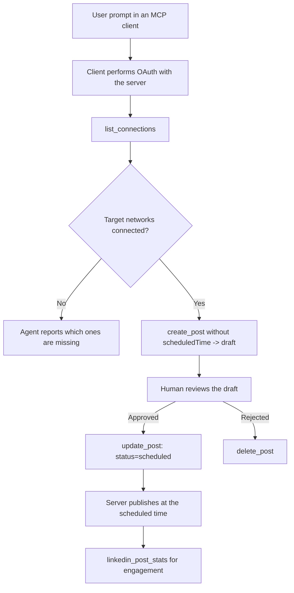

# Case Study: Publishing to Social Networks from an Agent with a Remote MCP Server

> **Disclaimer:** Several services and open-source projects can publish to social networks, and a team could also integrate each network's API directly. The scenario below is provided as one worked example of how a **write-capable remote MCP server** can be designed and consumed. Publora is a commercial service with a free tier; the patterns described here apply to any MCP server that performs irreversible actions on a user's behalf.

## Overview

Agents are good at drafting content and poor at delivering it. A model can write a release announcement in seconds, and then the work stops: publishing it means an API per network, an OAuth app per network, and a different set of media rules for each. Most teams solve this by copying the text into a browser by hand.

This case study looks at how that last step is closed with a single remote MCP server, and — more usefully for anyone building one — at the design decisions a **write-capable** server has to get right. Reading data is forgiving. Publishing is not: a wrong tool call is visible to an audience and cannot be undone.

## Scenario

A small developer-relations team drafts posts inside an agent (Claude, VS Code, Cursor — the client does not matter). They want the agent to:

- see which social accounts the team has connected,
- draft a post and keep it as a draft for a human to approve,
- attach an image,
- schedule it to several networks at a chosen time,
- and later report how it performed.

Crucially, they want the agent to be *unable* to publish accidentally while they are still experimenting.

## Tools Used

- [Publora MCP Server](https://github.com/publora/mcp-server) — a remote MCP server (`streamable-http`) exposing publishing, scheduling, media and LinkedIn analytics tools. Registered in the official MCP registry as `com.publora/mcp-server`.

## Step-by-Step Workflow

1. **Connect the server.** Clients that speak OAuth complete the authorization-code flow with PKCE against the server's own consent screen; clients that do not, such as headless CLIs, use a Publora API key in a header. Both paths are supported, and which one you get depends on the client, not on the server.
2. **List connections.** The agent calls `list_connections` and receives the connected accounts with their identifiers.
3. **Draft.** The agent calls `create_post` *without* a scheduled time. The post is stored as a draft — nothing is published.
4. **Attach media.** Public image URLs are passed in the same call; the server downloads and validates them.
5. **Schedule.** After a human approves, `update_post` sets the status to scheduled with an ISO 8601 time.
6. **Measure.** For LinkedIn, `linkedin_post_stats` returns engagement once the post is live.

## Example Prompt

```text
Which social accounts do I have connected?
Draft a post announcing our new changelog page, attach the screenshot at
https://example.com/changelog.png, and keep it as a draft — do not publish it.
Once I approve, schedule it to LinkedIn and Bluesky for tomorrow at 09:00 UTC.
```

## Mermaid Flowchart



## Technical Implementation

The lessons below are the transferable part of this case study.

### Open discovery, authenticated execution

`tools/list` is served without credentials; every `tools/call` requires a token and otherwise returns `401` with a `WWW-Authenticate` header pointing at the protected-resource metadata. (The server also answers an unauthenticated `initialize`, which matters only for clients on protocol versions before `2026-07-28`; that revision removed the handshake entirely.)

This split matters in practice. Registries, catalogues and clients can introspect the tool surface — names, schemas, annotations — without holding a secret, while nothing can be *executed* anonymously. A server that demands a token for `initialize` is effectively invisible to tooling; a server that allows anonymous `tools/call` is a liability.

### Registration: dynamic client registration, and what replaces it

The server advertises `/.well-known/oauth-protected-resource` and `/.well-known/oauth-authorization-server`, and supports the authorization-code flow with PKCE (`S256`), refresh tokens, and **dynamic client registration**.

Dynamic registration removes the manual step: without it every client needs a pre-issued `client_id`, which means an out-of-band request to the vendor for each new client.

Treat this as compatibility behaviour rather than as the design to copy. The `2026-07-28` revision of the specification deprecates dynamic client registration in favour of Client ID Metadata Documents, where the client hosts a metadata document at a stable HTTPS URL and that URL *is* the `client_id`. DCR keeps working for now, but a server being built today should plan for CIMD and keep DCR only for older clients.

### Tool annotations are not decoration

Every tool carries a `title` and the applicable hints: `readOnlyHint`, `destructiveHint`, `idempotentHint`, `openWorldHint`.

Two reasons to invest in them. First, clients use the hints to decide what to confirm with the user — a client can auto-run a read-only lookup and stop for approval before a delete. The specification is explicit that annotations are untrusted hints, not an authorization mechanism: they shape what a client offers to do, they do not stop anything on the server, and a server must still enforce its own rules. Second, the major connector directories now *require* them for review; a server whose tools lack titles and hints will be sent back regardless of how well it works.

### Make identifiers un-inventable

Platform identifiers are opaque strings returned by `list_connections`, and the schema description says explicitly that they must be copied verbatim and never guessed. The server rejects anything else.

Models are fluent guessers. Any write-capable server should assume an identifier will eventually be hallucinated and make that path fail loudly and early, rather than act on a plausible-looking value.

### Fail before publishing, with an actionable message

Some networks refuse text-only posts and require an image or video. That is validated when the post is scheduled, and the error names the platform and the missing requirement.

An agent can recover from "Instagram requires media — attach an image or video" without another round trip. It cannot recover from a generic `400`.

### Make retries safe

The two tools that create content, `create_post` and `update_post`, accept an idempotency key: reusing it with an identical request replays the original response instead of creating a second post. Agent runtimes retry on timeouts; without idempotency, a slow response becomes a duplicate publication. The other write tools — deletions, media steps, LinkedIn reactions and comments — do not take one, so a retry there is not automatically safe. Worth knowing which of your own mutations are protected and which are not.

### Provide a way to test that publishes nothing

The server accepts a reserved target, `publora-playground`, which is validated and acknowledged like a real destination and then discarded — nothing reaches a live account. It is described in the tool schema itself, which any client can read without credentials: the `platforms` field of `create_post` documents it as "a connection-test target that requires no real connection — the post is acknowledged and discarded, nothing is published". Invoke it by passing it as the only entry: `platforms: ["publora-playground"]`.

This turned out to be one of the most useful details of the whole surface. Reviewers of connector directories, contributors and CI can exercise the full write path end to end with no risk to a real audience. Any MCP server with irreversible actions benefits from a documented no-op target.

## Results and Impact

- The publishing step moved from a browser to the same conversation where the content is written, and a draft-first habit keeps a human in the loop. Be precise about what that is: a draft is a convention, not a boundary. The same credential can schedule or publish, so anyone who needs a real approval gate has to enforce it outside the tool surface — separate credentials, or a policy layer in front of the server.
- Per-network differences — media requirements, threading, reply controls — are handled once in the server instead of in every agent that talks to it.
- The same server backs several MCP clients without per-client work, because discovery is open and registration is dynamic.
- The design constraints above were shaped by connector-directory reviews as much as by users: annotations, OAuth and a safe test target were each required by at least one of them.

## References

- [Publora MCP Server (source)](https://github.com/publora/mcp-server)
- [Publora API and MCP documentation](https://docs.publora.com)
- [MCP Registry entry: `com.publora/mcp-server`](https://registry.modelcontextprotocol.io/v0/servers?search=com.publora/mcp-server)
- [MCP specification — Authorization](https://modelcontextprotocol.io/specification/draft/basic/authorization)
- [MCP specification — Tool annotations](https://modelcontextprotocol.io/docs/concepts/tools)

## What's Next

- Take an MCP server you are building and check the three cheapest wins here: annotations on every tool, an idempotency key on every write, and a documented no-op target.
- Try the open-discovery split: call `tools/list` against a public remote server with no credentials, then call a tool and inspect the `401` challenge.
- Consider what "undo" means for your domain. Publishing has drafts and deletion; if your actions have no equivalent, confirmation belongs in the tool design, not in the prompt.
