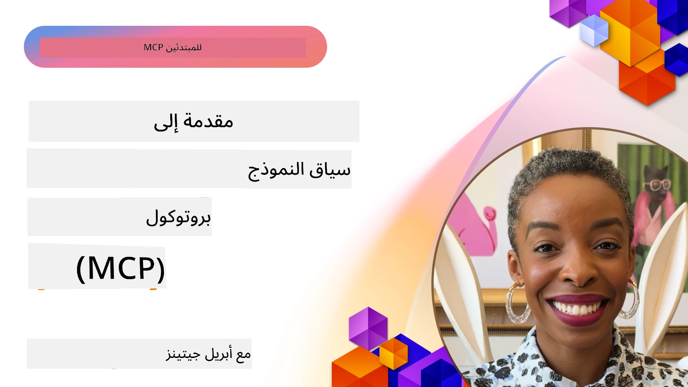
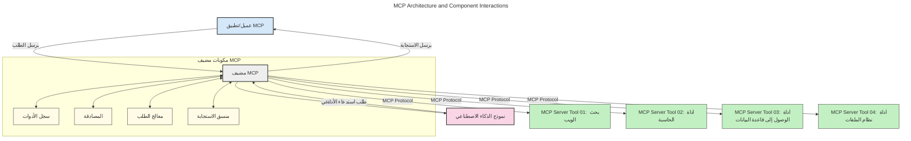
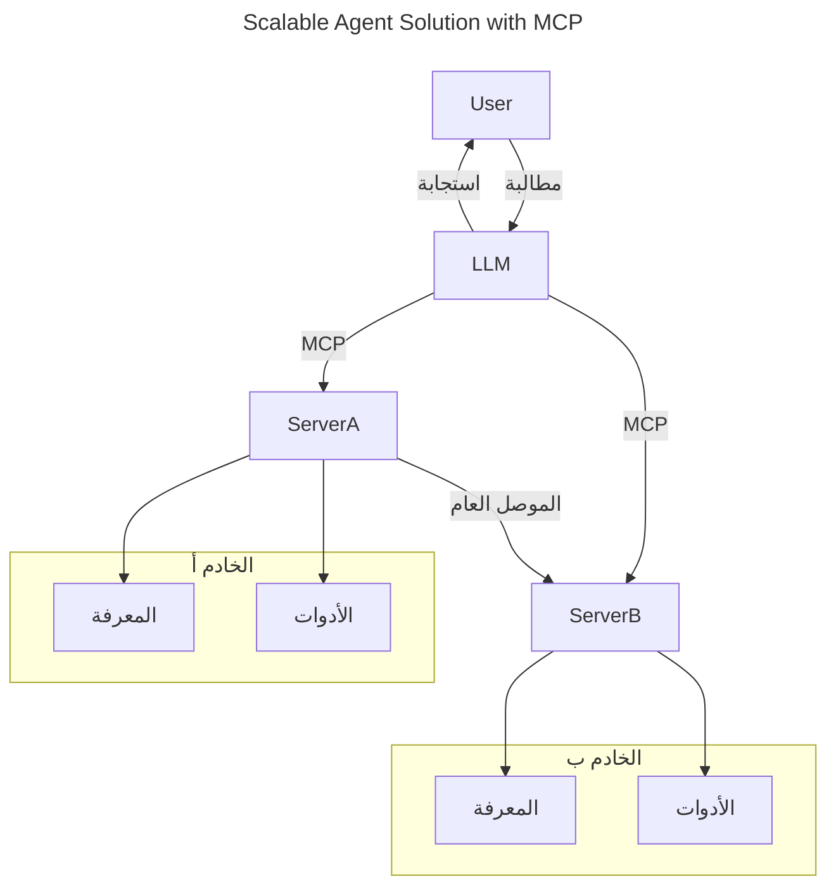
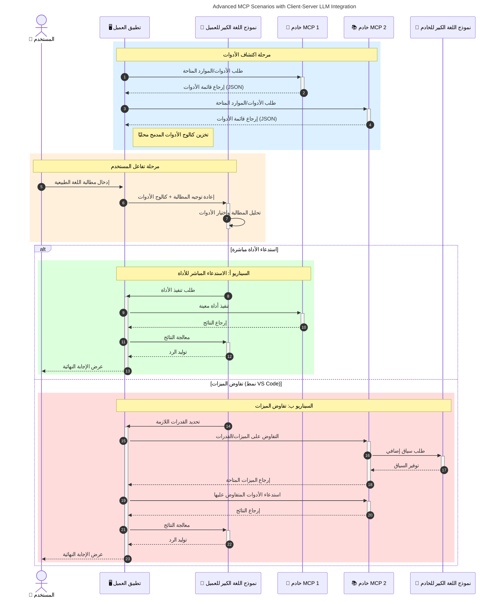

# مقدمة في بروتوكول سياق النموذج (MCP): لماذا هو مهم لتطبيقات الذكاء الاصطناعي القابلة للتوسع

_(انقر على الصورة أعلاه لمشاهدة فيديو هذا الدرس)_

تُعتبر تطبيقات الذكاء الاصطناعي التوليدية خطوة كبيرة للأمام لأنها تتيح غالبًا للمستخدم التفاعل مع التطبيق باستخدام مطالبات اللغة الطبيعية. ومع ذلك، مع استثمار المزيد من الوقت والموارد في مثل هذه التطبيقات، سترغب في التأكد من أنه يمكنك دمج الوظائف والموارد بسهولة بطريقة تجعل من السهل التوسع، بحيث يمكن لتطبيقك دعم أكثر من نموذج واحد مستخدم، والتعامل مع تعقيدات النماذج المختلفة. باختصار، بناء تطبيقات الذكاء الاصطناعي التوليدية سهل في البداية، ولكن مع نموها وتعقيدها، تحتاج إلى البدء في تحديد بنية ومن المرجح أن تعتمد على معيار لضمان بناء تطبيقاتك بطريقة متسقة. هذا هو المكان الذي يدخل فيه بروتوكول سياق النموذج لتنظيم الأمور وتوفير معيار.

---

## **🔍 ما هو بروتوكول سياق النموذج (MCP)؟**

**بروتوكول سياق النموذج (MCP)** هو **واجهة مفتوحة ومعيارية** تسمح لنماذج اللغة الكبيرة (LLMs) بالتفاعل بسلاسة مع الأدوات الخارجية وواجهات برمجة التطبيقات ومصادر البيانات. فهو يوفر بنية متسقة لتعزيز وظائف نموذج الذكاء الاصطناعي خارج بيانات التدريب، مما يمكّن أنظمة ذكاء اصطناعي أكثر ذكاءً وقابلية للتوسع واستجابة.

---

## **🎯 لماذا التوحيد القياسي مهم في الذكاء الاصطناعي**

مع تصاعد تعقيد تطبيقات الذكاء الاصطناعي التوليدية، من الضروري اعتماد معايير تضمن **القابلية للتوسع، والقدرة على التوسيع، وقابلية الصيانة،** و**تجنب الاحتكار من قبل البائعين**. يعالج MCP هذه الاحتياجات من خلال:

- توحيد تكاملات النموذج مع الأدوات
- تقليل الحلول المخصصة الهشة والمحدودة
- السماح بتعايش نماذج متعددة من بائعين مختلفين ضمن نظام بيئي واحد

**ملاحظة:** رغم أن MCP يصف نفسه كمعيار مفتوح، لا توجد خطط لتوحيد MCP عبر أي هيئات معايير حالية مثل IEEE، IETF، W3C، ISO أو أي هيئة معايير أخرى.

---

## **📚 أهداف التعلم**

بحلول نهاية هذه المقالة، ستتمكن من:

- تعريف **بروتوكول سياق النموذج (MCP)** وحالات استخدامه
- فهم كيف يقوم MCP بتوحيد التواصل بين النموذج والأداة
- تحديد المكونات الأساسية لبنية MCP
- استكشاف تطبيقات MCP الحقيقية في سياقات المؤسسات والتطوير

---

## **💡 لماذا يعتبر بروتوكول سياق النموذج (MCP) محوريًا**

### **🔗 MCP يحل مشكلة التجزئة في تفاعلات الذكاء الاصطناعي**

قبل MCP، كان تكامل النماذج مع الأدوات يتطلب:

- رمز مخصص لكل زوج أداة-نموذج
- واجهات برمجة تطبيقات غير معيارية لكل بائع
- انقطاعات متكررة بسبب التحديثات
- ضعف قابلية التوسع مع المزيد من الأدوات

### **✅ فوائد توحيد MCP**

| **الفائدة**              | **الوصف**                                                                 |
|--------------------------|-----------------------------------------------------------------------------|
| التشغيل البيني           | تعمل نماذج اللغة الكبيرة بسلاسة مع الأدوات عبر بائعين مختلفين               |
| الاتساق                  | سلوك موحد عبر المنصات والأدوات                                             |
| إعادة الاستخدام          | تُستخدم الأدوات المبنية مرة واحدة عبر مشاريع وأنظمة متعددة                 |
| تسريع التطوير            | تقليل وقت التطوير باستخدام واجهات معيارية قابلة للتوصيل والتشغيل          |

---

## **🧱 نظرة عامة على بنية MCP على مستوى عالي**

يتبع MCP **نموذج العميل-الخادم**، حيث:

- **مضيفي MCP** يشغلون نماذج الذكاء الاصطناعي
- **عملاء MCP** يبدأون الطلبات
- **خوادم MCP** تقدم السياق والأدوات والقدرات

### **المكونات الرئيسية:**

- **الموارد** – بيانات ثابتة أو ديناميكية للنماذج  
- **المطالبات** – سير عمل معرف مسبقًا لتوليد موجه  
- **الأدوات** – وظائف قابلة للتنفيذ مثل البحث، الحسابات  
- **العينات** – سلوك وكيل عبر تفاعلات متكررة (تم إهماله في
    MCP `2026-07-28`; يجب على التنفيذات الجديدة أن تدمج مباشرة مع مزود LLM)

- **الإستنهاض** – طلبات تبدأها الخادم للحصول على إدخال المستخدم
- **الجذور** – مواقع نظام الملفات الإعلامية ذات الصلة بخادم
    (تم إهماله في MCP `2026-07-28`; يفضل معلمات الأدوات، URI الموارد، أو
    إعدادات الخادم)

### **بنية البروتوكول:**

يستخدم MCP بنية من مستويين:
- **طبقة البيانات**: رسائل JSON-RPC 2.0، بيانات وصفية لكل طلب، الاكتشاف،
    والأساسات البروتوكولية
- **طبقة النقل**: stdio للعمليات الفرعية المحلية وStreamable HTTP للخوادم
    البعيدة. يمكن لـ Streamable HTTP استخدام تأطير SSE للردود المتدفقة،
    لكن النقل القديم HTTP+SSE مهجور.

---

## كيف تعمل خوادم MCP

تعمل خوادم MCP بالطريقة التالية:

- **تدفق الطلب**:
    1. يتم بدء الطلب بواسطة مستخدم نهائي أو برنامج يعمل نيابة عنه.
    2. يرسل **عميل MCP** الطلب إلى **مضيف MCP**، الذي يدير وقت تشغيل نموذج الذكاء الاصطناعي.
    3. يستقبل **نموذج الذكاء الاصطناعي** مطالبة المستخدم وقد يطلب الوصول إلى أدوات أو بيانات خارجية من خلال استدعاء واحدة أو أكثر للأدوات.
    4. **مضيف MCP**، وليس النموذج مباشرة، يتواصل مع **خادم(ات) MCP** المناسبة باستخدام البروتوكول الموحد.
- **وظائف مضيف MCP**:
    - **سجل الأدوات**: يحتفظ بفهرس للأدوات المتاحة وقدراتها.
    - **المصادقة**: يتحقق من الأذونات للوصول إلى الأدوات.
    - **معالج الطلبات**: يعالج طلبات الأدوات الواردة من النموذج.
    - **منسق الردود**: ينظم مخرجات الأدوات بصيغة مفهومة للنموذج.
- **تنفيذ خادم MCP**:
    - يوجه **مضيف MCP** استدعاءات الأدوات إلى واحد أو أكثر من **خوادم MCP**، كل منها يكشف عن وظائف متخصصة (مثل البحث، الحسابات، استعلامات قواعد البيانات).
    - تنفذ **خوادم MCP** عملياتها المعنية وتعيد النتائج إلى **مضيف MCP** بصيغة ثابتة.
    - يقوم **مضيف MCP** بتنسيق هذه النتائج وإيصالها إلى **نموذج الذكاء الاصطناعي**.
- **اكتمال الرد**:
    - يدمج **نموذج الذكاء الاصطناعي** مخرجات الأدوات في رد نهائي.
    - يرسل **مضيف MCP** هذا الرد إلى **عميل MCP**، الذي يوصله إلى المستخدم النهائي أو البرنامج الذي طلبه.
    

## 👨‍💻 كيفية بناء خادم MCP (مع أمثلة)

تتيح خوادم MCP توسيع قدرات نماذج اللغة الكبيرة عن طريق توفير البيانات والوظائف. 

هل أنت مستعد لتجربتها؟ فيما يلي مجموعات SDK محددة للغة و/أو بيئة التطوير وأمثلة لإنشاء خوادم MCP بسيطة بلغات/أطر مختلفة:

- **Python SDK**: https://github.com/modelcontextprotocol/python-sdk

- **TypeScript SDK**: https://github.com/modelcontextprotocol/typescript-sdk

- **Java SDK**: https://github.com/modelcontextprotocol/java-sdk

- **C#/.NET SDK**: https://github.com/modelcontextprotocol/csharp-sdk

## 🌍 حالات استخدام MCP في العالم الحقيقي

يتيح MCP مجموعة واسعة من التطبيقات من خلال توسيع قدرات الذكاء الاصطناعي:

| **التطبيق**                 | **الوصف**                                                                     |
|------------------------------|------------------------------------------------------------------------------|
| تكامل بيانات المؤسسات      | ربط نماذج اللغة الكبيرة (LLMs) بقواعد البيانات أو نظم إدارة علاقات العملاء أو الأدوات الداخلية |
| أنظمة الذكاء الاصطناعي الوكيلة | تمكين الوكلاء المستقلين من الوصول إلى الأدوات وتنفيذ تدفقات العمل الخاصة باتخاذ القرار |
| التطبيقات متعددة الوسائط    | دمج أدوات النص والصورة والصوت داخل تطبيق ذكاء اصطناعي موحد واحد                 |
| تكامل البيانات في الوقت الحقيقي | إدخال البيانات الحية في تفاعلات الذكاء الاصطناعي للحصول على مخرجات أكثر دقة وحداثة  |

### 🧠 MCP = معيار عالمي لتفاعلات الذكاء الاصطناعي

يعمل بروتوكول سياق النموذج (MCP) كمعيار عالمي لتفاعلات الذكاء الاصطناعي، مثلما وفر USB-C معيارًا للاتصالات الفيزيائية للأجهزة. في عالم الذكاء الاصطناعي، يوفر MCP واجهة موحدة تسمح للنماذج (العملاء) بالاندماج بسلاسة مع الأدوات ومزودي البيانات الخارجيين (الخوادم). هذا يلغي الحاجة إلى بروتوكولات مخصصة ومتنوعة لكل واجهة برمجة تطبيقات أو مصدر بيانات.

وفقًا لـ MCP، يتبع الأداة المتوافقة مع MCP (المشار إليها كخادم MCP) معيارًا موحدًا. يمكن لهذه الخوادم سرد الأدوات أو الإجراءات التي تقدمها وتنفيذ تلك الإجراءات عندما يطلب وكيل الذكاء الاصطناعي ذلك. منصات وكلاء الذكاء الاصطناعي التي تدعم MCP قادرة على اكتشاف الأدوات المتوفرة من الخوادم واستدعائها من خلال هذا البروتوكول الموحد.

### 💡 يسهل الوصول إلى المعرفة

إلى جانب توفير الأدوات، يسهل MCP أيضًا الوصول إلى المعرفة. يمكّن التطبيقات من توفير سياق لنماذج اللغة الكبيرة (LLMs) من خلال ربطها بمصادر بيانات متنوعة. على سبيل المثال، قد يمثل خادم MCP مستودع مستندات شركة ما، مما يسمح للوكلاء باسترجاع المعلومات ذات الصلة حسب الطلب. يمكن أن يتولى خادم آخر مهام محددة مثل إرسال البريد الإلكتروني أو تحديث السجلات. من منظور الوكيل، هذه مجرد أدوات يمكنه استخدامها — بعض الأدوات تعيد بيانات (سياق المعرفة)، في حين أن البعض الآخر ينفذ إجراءات. يدير MCP كلاهما بكفاءة.

يكتسب الوكيل المتصل بخادم MCP تلقائيًا معرفة بالقدرات المتاحة والبيانات التي يمكن الوصول إليها عبر صيغة معيارية. تتيح هذه المعيارية توفر الأدوات بشكل ديناميكي. على سبيل المثال، إضافة خادم MCP جديد إلى نظام الوكيل يجعل وظائفه قابلة للاستخدام فورًا دون الحاجة إلى تخصيص تعليمات الوكيل.

يتماشى هذا التكامل المُبسط مع التدفق الموضح في الرسم البياني التالي، حيث توفر الخوادم كلًا من الأدوات والمعرفة، مما يضمن التعاون السلس عبر الأنظمة.

### 👉 مثال: حل وكيل قابل للتوسع

يمكن للموصل العالمي أن يمكن خوادم MCP من التواصل ومشاركة القدرات مع بعضها البعض، مما يسمح لـ ServerA بتفويض المهام إلى ServerB أو الوصول إلى أدواته ومعرفته. هذا يوسع أدوات وبيانات عبر الخوادم، داعمًا بنى وكلاء قابلة للتوسع والنمذجة. وبما أن MCP يوحّد عرض الأدوات، يمكن للوكلاء اكتشاف وتوجيه الطلبات بين الخوادم ديناميكيًا دون دمج ثابت مُسبق.

توسيع أدوات المعرفة: يمكن الوصول إلى الأدوات والبيانات عبر الخوادم، مما يمكّن بنى وكلاء أكثر قابلية للتوسع والنمذجة.

### 🔄 سيناريوهات MCP المتقدمة مع دمج نماذج اللغة الكبيرة على جانب العميل

بجانب بنية MCP الأساسية، هناك سيناريوهات متقدمة حيث يحتوي كلا العميل والخادم على نماذج لغة كبيرة، مما يمكن من تفاعلات أكثر تعقيدًا. في الرسم البياني التالي، يمكن أن يكون **تطبيق العميل** بيئة تطوير متكاملة مع عدد من أدوات MCP متاحة للاستخدام بواسطة نموذج اللغة الكبير:

## 🔐 فوائد عملية لـ MCP

فيما يلي الفوائد العملية لاستخدام MCP:

- **التحديث المستمر**: يمكن للنماذج الوصول إلى معلومات محدثة تتجاوز بيانات تدريبها
- **تمديد القدرات**: يمكن للنماذج الاستفادة من أدوات متخصصة لمهام لم يتم تدريبها عليها
- **تقليل الهلوسة**: تزود مصادر البيانات الخارجية الأساسيات الواقعية
- **الخصوصية**: يمكن للبيانات الحساسة البقاء ضمن بيئات آمنة بدلاً من تضمينها ضمن الموجهات

## 📌 النقاط الرئيسية

فيما يلي النقاط الرئيسية لاستخدام MCP:

- **MCP** يوحّد طريقة تفاعل نماذج الذكاء الاصطناعي مع الأدوات والبيانات
- يروّج لـ **قابلية التوسع، والاتساق، والتشغيل البيني**
- يساعد MCP على **تقليل زمن التطوير، وتحسين الاعتمادية، وتوسيع قدرات النماذج**
- تتيح بنية العميل-الخادم **تطبيقات ذكاء اصطناعي مرنة وقابلة للتوسع**

## 🧠 تمرين

فكر في تطبيق ذكاء اصطناعي ترغب في بنائه.

- ما هي **الأدوات الخارجية أو البيانات** التي يمكن أن تعزز قدراته؟
- كيف يمكن لـ MCP أن يجعل الدمج **أبسط وأكثر موثوقية؟**

## موارد إضافية

- [مستودع MCP على GitHub](https://github.com/modelcontextprotocol)

## ما التالي

التالي: [الفصل 1: المفاهيم الأساسية](../01-CoreConcepts/README.md)

---

<!-- CO-OP TRANSLATOR DISCLAIMER START -->
**تنويه**:
تمت ترجمة هذا المستند باستخدام خدمة الترجمة بالذكاء الاصطناعي [Co-op Translator](https://github.com/Azure/co-op-translator). بينما نسعى للدقة، يرجى العلم أن الترجمات الآلية قد تحتوي على أخطاء أو عدم دقة. يجب اعتبار المستند الأصلي بلغته الأصلية المصدر الرسمي والمعتمد. للمعلومات الهامة، يُنصح بالاستعانة بترجمة بشرية محترفة. نحن غير مسؤولين عن أي سوء فهم أو تفسير ناتج عن استخدام هذه الترجمة.
<!-- CO-OP TRANSLATOR DISCLAIMER END -->