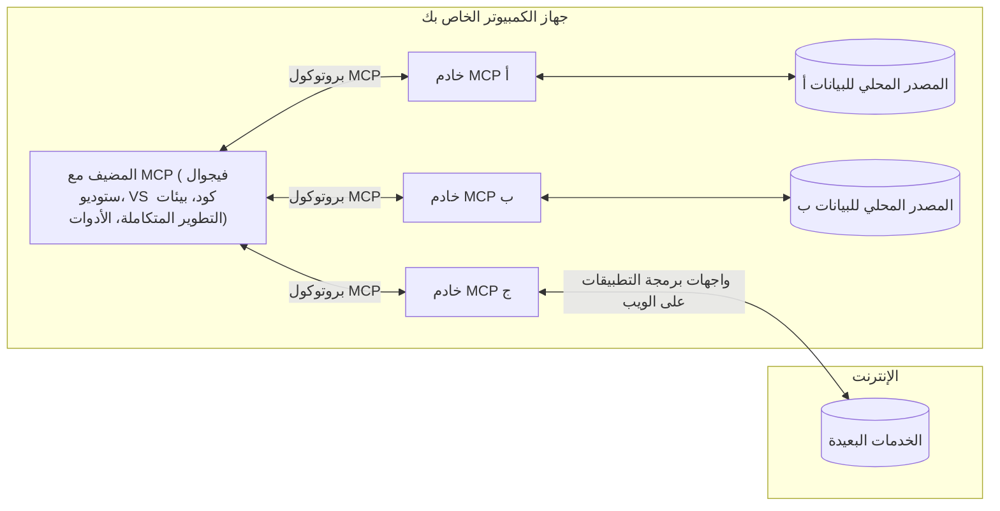

# مفاهيم أساسية في MCP: إتقان بروتوكول سياق النموذج لتكامل الذكاء الاصطناعي

[](https://youtu.be/earDzWGtE84)

_(انقر على الصورة أعلاه لمشاهدة فيديو هذا الدرس)_

يُعد [بروتوكول سياق النموذج (MCP)](https://github.com/modelcontextprotocol) إطارًا قويًا وموحدًا يعمل على تحسين التواصل بين نماذج اللغة الكبيرة (LLMs) والأدوات الخارجية والتطبيقات ومصادر البيانات.  
سيرشدك هذا الدليل عبر المفاهيم الأساسية لـ MCP. ستتعلم عن هيكلية العميل-الخادم، المكونات الأساسية، آليات الاتصال، وأفضل ممارسات التنفيذ.

- **موافقة المستخدم الصريحة**: تتطلب جميع عمليات الوصول إلى البيانات والتنفيذ موافقة صريحة من المستخدم قبل التنفيذ. يجب أن يفهم المستخدمون بوضوح البيانات التي سيتم الوصول إليها والإجراءات التي ستتم، مع تحكم دقيق في الأذونات والتفويضات.

- **حماية خصوصية البيانات**: تُعرض بيانات المستخدم فقط بموافقة صريحة ويجب حمايتها بواسطة ضوابط وصول قوية طوال دورة التفاعل بأكملها. يجب على التنفيذات منع نقل البيانات غير المصرح به والحفاظ على حدود خصوصية صارمة.

- **سلامة تنفيذ الأدوات**: يتطلب كل استدعاء أداة موافقة صريحة من المستخدم مع فهم واضح لوظيفة الأداة، معلماتها، وتأثيرها المحتمل. يجب أن تمنع الحدود الأمنية القوية تنفيذ الأدوات غير المقصود أو غير الآمن أو الخبيث.

- **أمان طبقة النقل**: يجب أن تستخدم جميع قنوات الاتصال آليات تشفير ومصادقة مناسبة. يجب أن تنفذ الاتصالات البعيدة بروتوكولات نقل آمنة وإدارة بيانات اعتماد صحيحة.

#### إرشادات التنفيذ:

- **إدارة الأذونات**: تنفيذ أنظمة أذونات دقيقة تسمح للمستخدمين بالتحكم في الخوادم، الأدوات، والموارد التي يمكن الوصول إليها  
- **المصادقة والتفويض**: استخدام طرق مصادقة آمنة (OAuth، مفاتيح API) مع إدارة صحيحة للرموز وانتهائها  
- **التحقق من المدخلات**: التحقق من جميع المعلمات وبيانات الإدخال وفقًا للمخططات المعرفة لمنع هجمات الحقن  
- **تسجيل التدقيق**: الحفاظ على سجلات شاملة لجميع العمليات لمراقبة الأمان والامتثال

## نظرة عامة

يستكشف هذا الدرس الهيكلية الأساسية والمكونات التي تشكل نظام بروتوكول سياق النموذج (MCP). ستتعرف على هيكلية العميل-الخادم، المكونات الرئيسية، وآليات الاتصال التي تدعم تفاعلات MCP.

## الأهداف التعليمية الرئيسية

بنهاية هذا الدرس، ستتمكن من:

- فهم هيكلية العميل-الخادم في MCP.  
- تحديد أدوار ومسؤوليات المضيفين، العملاء، والخوادم.  
- تحليل الميزات الأساسية التي تجعل MCP طبقة تكامل مرنة.  
- تعلم كيفية تدفق المعلومات داخل نظام MCP.  
- اكتساب رؤى عملية من خلال أمثلة برمجية في .NET، Java، Python، وJavaScript.

## هيكلية MCP: نظرة أعمق

يُبنى نظام MCP على نموذج عميل-خادم. تسمح هذه البنية المعيارية لتطبيقات الذكاء الاصطناعي بالتفاعل مع الأدوات، قواعد البيانات، واجهات برمجة التطبيقات، والموارد السياقية بكفاءة. دعونا نفصل هذه الهيكلية إلى مكوناتها الأساسية.

في جوهره، يتبع MCP هيكلية عميل-خادم حيث يمكن لتطبيق مضيف الاتصال بعدة خوادم:


- **مضيفو MCP**: برامج مثل VSCode، Claude Desktop، بيئات التطوير المتكاملة، أو أدوات الذكاء الاصطناعي التي ترغب في الوصول إلى البيانات عبر MCP  
- **عملاء MCP**: عملاء البروتوكول الذين يحافظون على اتصالات 1:1 مع الخوادم  
- **خوادم MCP**: برامج خفيفة الوزن تعرض كل منها قدرات محددة عبر بروتوكول سياق النموذج الموحد  
- **مصادر البيانات المحلية**: ملفات الكمبيوتر، قواعد البيانات، والخدمات التي يمكن لخوادم MCP الوصول إليها بأمان  
- **الخدمات البعيدة**: أنظمة خارجية متاحة عبر الإنترنت يمكن لخوادم MCP الاتصال بها عبر واجهات برمجة التطبيقات.

بروتوكول MCP هو معيار متطور يستخدم ترقيمًا يعتمد على التاريخ (بتنسيق YYYY-MM-DD). الإصدار الحالي من البروتوكول هو **2025-11-25**. يمكنك الاطلاع على أحدث التحديثات في [مواصفات البروتوكول](https://modelcontextprotocol.io/specification/2025-11-25/)

### 1. المضيفون

في بروتوكول سياق النموذج (MCP)، **المضيفون** هم تطبيقات الذكاء الاصطناعي التي تعمل كواجهة رئيسية يتفاعل من خلالها المستخدمون مع البروتوكول. يقوم المضيفون بتنسيق وإدارة الاتصالات مع عدة خوادم MCP من خلال إنشاء عملاء MCP مخصصين لكل اتصال خادم. أمثلة على المضيفين تشمل:

- **تطبيقات الذكاء الاصطناعي**: Claude Desktop، Visual Studio Code، Claude Code  
- **بيئات التطوير**: بيئات التطوير المتكاملة ومحررات الشيفرة مع تكامل MCP  
- **التطبيقات المخصصة**: وكلاء وأدوات ذكاء اصطناعي مخصصة

**المضيفون** هم تطبيقات تنسق تفاعلات نماذج الذكاء الاصطناعي. هم:

- **تنسيق نماذج الذكاء الاصطناعي**: تنفيذ أو التفاعل مع نماذج اللغة الكبيرة لتوليد الردود وتنسيق سير العمل  
- **إدارة اتصالات العملاء**: إنشاء والحفاظ على عميل MCP واحد لكل اتصال خادم MCP  
- **التحكم في واجهة المستخدم**: إدارة تدفق المحادثة، تفاعلات المستخدم، وعرض الردود  
- **فرض الأمان**: التحكم في الأذونات، القيود الأمنية، والمصادقة  
- **إدارة موافقة المستخدم**: إدارة موافقة المستخدم على مشاركة البيانات وتنفيذ الأدوات

### 2. العملاء

**العملاء** هم مكونات أساسية تحافظ على اتصالات مخصصة من نوع واحد إلى واحد بين المضيفين وخوادم MCP. يتم إنشاء كل عميل MCP بواسطة المضيف للاتصال بخادم MCP محدد، مما يضمن قنوات اتصال منظمة وآمنة. تتيح تعدد العملاء للمضيفين الاتصال بعدة خوادم في نفس الوقت.

**العملاء** هم مكونات الربط داخل تطبيق المضيف. هم:

- **الاتصال بالبروتوكول**: إرسال طلبات JSON-RPC 2.0 إلى الخوادم مع المطالبات والتعليمات  
- **التفاوض على القدرات**: التفاوض على الميزات المدعومة وإصدارات البروتوكول مع الخوادم أثناء التهيئة  
- **تنفيذ الأدوات**: إدارة طلبات تنفيذ الأدوات من النماذج ومعالجة الردود  
- **التحديثات في الوقت الحقيقي**: التعامل مع الإشعارات والتحديثات الحية من الخوادم  
- **معالجة الردود**: معالجة وتنسيق ردود الخادم للعرض على المستخدمين

### 3. الخوادم

**الخوادم** هي برامج توفر السياق، الأدوات، والقدرات لعملاء MCP. يمكن تشغيلها محليًا (على نفس جهاز المضيف) أو عن بُعد (على منصات خارجية)، وهي مسؤولة عن معالجة طلبات العملاء وتقديم ردود منظمة. تعرض الخوادم وظائف محددة عبر بروتوكول سياق النموذج الموحد.

**الخوادم** هي خدمات توفر السياق والقدرات. هي:

- **تسجيل الميزات**: تسجيل وعرض البدائيات المتاحة (الموارد، المطالبات، الأدوات) للعملاء  
- **معالجة الطلبات**: استقبال وتنفيذ استدعاءات الأدوات، طلبات الموارد، وطلبات المطالبات من العملاء  
- **توفير السياق**: تقديم معلومات سياقية وبيانات لتعزيز ردود النموذج  
- **إدارة الحالة**: الحفاظ على حالة الجلسة والتعامل مع التفاعلات الحالة عند الحاجة  
- **الإشعارات في الوقت الحقيقي**: إرسال إشعارات حول تغييرات القدرات والتحديثات للعملاء المتصلين

يمكن لأي شخص تطوير خوادم لتوسيع قدرات النموذج بوظائف متخصصة، وتدعم سيناريوهات النشر المحلية والبعيدة.

### 4. بدائيات الخادم

توفر خوادم بروتوكول سياق النموذج (MCP) ثلاث **بدائيات** أساسية تحدد اللبنات الأساسية للتفاعلات الغنية بين العملاء، المضيفين، ونماذج اللغة. تحدد هذه البدائيات أنواع المعلومات السياقية والإجراءات المتاحة عبر البروتوكول.

يمكن لخوادم MCP عرض أي تركيبة من البدائيات الأساسية الثلاث التالية:

#### الموارد

**الموارد** هي مصادر بيانات توفر معلومات سياقية لتطبيقات الذكاء الاصطناعي. تمثل محتوى ثابتًا أو ديناميكيًا يمكنه تعزيز فهم النموذج واتخاذ القرار:

- **البيانات السياقية**: معلومات منظمة وسياق لاستهلاك نموذج الذكاء الاصطناعي  
- **قواعد المعرفة**: مستودعات الوثائق، المقالات، الكتيبات، والأوراق البحثية  
- **مصادر البيانات المحلية**: الملفات، قواعد البيانات، ومعلومات النظام المحلية  
- **البيانات الخارجية**: ردود واجهات برمجة التطبيقات، خدمات الويب، وبيانات الأنظمة البعيدة  
- **المحتوى الديناميكي**: بيانات في الوقت الحقيقي تتحدث بناءً على الظروف الخارجية

يتم تحديد الموارد بواسطة معرفات URI وتدعم الاكتشاف عبر طرق `resources/list` والاسترجاع عبر `resources/read`:

```text
file://documents/project-spec.md
database://production/users/schema
api://weather/current
```

#### المطالبات

**المطالبات** هي قوالب قابلة لإعادة الاستخدام تساعد في هيكلة التفاعلات مع نماذج اللغة. توفر أنماط تفاعل موحدة وسير عمل قالبية:

- **تفاعلات قائمة على القوالب**: رسائل مهيكلة مسبقًا وبدايات محادثة  
- **قوالب سير العمل**: تسلسلات موحدة للمهام والتفاعلات الشائعة  
- **أمثلة قليلة اللقطات**: قوالب قائمة على الأمثلة لتعليم النموذج  
- **مطالبات النظام**: مطالبات أساسية تحدد سلوك النموذج والسياق  
- **قوالب ديناميكية**: مطالبات معلمة تتكيف مع السياقات المحددة

تدعم المطالبات استبدال المتغيرات ويمكن اكتشافها عبر `prompts/list` واسترجاعها باستخدام `prompts/get`:

```markdown
Generate a {{task_type}} for {{product}} targeting {{audience}} with the following requirements: {{requirements}}
```

#### الأدوات

**الأدوات** هي وظائف قابلة للتنفيذ يمكن لنماذج الذكاء الاصطناعي استدعاؤها لأداء إجراءات محددة. تمثل "الأفعال" في نظام MCP، مما يمكّن النماذج من التفاعل مع الأنظمة الخارجية:

- **وظائف قابلة للتنفيذ**: عمليات منفصلة يمكن للنماذج استدعاؤها بمعلمات محددة  
- **تكامل الأنظمة الخارجية**: استدعاءات API، استعلامات قواعد البيانات، عمليات الملفات، الحسابات  
- **هوية فريدة**: لكل أداة اسم ووصف ومخطط معلمات مميز  
- **إدخال/إخراج منظم**: تقبل الأدوات معلمات تم التحقق منها وتعيد ردودًا منظمة ومصنفة  
- **قدرات العمل**: تمكّن النماذج من أداء إجراءات واقعية واسترجاع بيانات حية

تعرف الأدوات باستخدام JSON Schema للتحقق من المعلمات وتُكتشف عبر `tools/list` وتُنفذ عبر `tools/call`:

```typescript
server.tool(
  "search_products", 
  {
    query: z.string().describe("Search query for products"),
    category: z.string().optional().describe("Product category filter"),
    max_results: z.number().default(10).describe("Maximum results to return")
  }, 
  async (params) => {
    // تنفيذ البحث وإرجاع النتائج المنظمة
    return await productService.search(params);
  }
);
```

## بدائيات العميل

في بروتوكول سياق النموذج (MCP)، يمكن للعملاء عرض بدائيات تتيح للخوادم طلب قدرات إضافية من تطبيق المضيف. تسمح هذه البدائيات على جانب العميل بتنفيذات خادم أكثر تفاعلية وغنية يمكنها الوصول إلى قدرات نموذج الذكاء الاصطناعي وتفاعلات المستخدم.

### التوليد (Sampling)

تتيح **التوليد** للخوادم طلب إكمالات نموذج اللغة من تطبيق الذكاء الاصطناعي الخاص بالعميل. تمكّن هذه البدائية الخوادم من الوصول إلى قدرات LLM دون تضمين تبعيات النموذج الخاصة بها:

- **وصول مستقل عن النموذج**: يمكن للخوادم طلب الإكمالات دون تضمين SDK لنماذج اللغة أو إدارة الوصول للنموذج  
- **الذكاء الاصطناعي المبادر من الخادم**: تمكّن الخوادم من توليد المحتوى بشكل مستقل باستخدام نموذج الذكاء الاصطناعي الخاص بالعميل  
- **تفاعلات LLM متكررة**: تدعم السيناريوهات المعقدة حيث تحتاج الخوادم إلى مساعدة الذكاء الاصطناعي للمعالجة  
- **توليد محتوى ديناميكي**: تسمح للخوادم بإنشاء ردود سياقية باستخدام نموذج المضيف

يتم بدء التوليد عبر طريقة `sampling/complete`، حيث ترسل الخوادم طلبات الإكمال إلى العملاء.

### الاستيضاح (Elicitation)

تمكّن **الاستيضاح** الخوادم من طلب معلومات إضافية أو تأكيد من المستخدمين عبر واجهة العميل:

- **طلبات إدخال المستخدم**: يمكن للخوادم طلب معلومات إضافية عند الحاجة لتنفيذ الأدوات  
- **حوارات التأكيد**: طلب موافقة المستخدم على عمليات حساسة أو ذات تأثير  
- **سير عمل تفاعلي**: تمكين الخوادم من إنشاء تفاعلات مستخدم خطوة بخطوة  
- **جمع المعلمات الديناميكي**: جمع المعلمات المفقودة أو الاختيارية أثناء تنفيذ الأدوات

تتم طلبات الاستيضاح باستخدام طريقة `elicitation/request` لجمع مدخلات المستخدم عبر واجهة العميل.

### التسجيل (Logging)

يتيح **التسجيل** للخوادم إرسال رسائل سجل منظمة إلى العملاء لأغراض التصحيح، المراقبة، ورؤية العمليات:

- **دعم التصحيح**: تمكين الخوادم من توفير سجلات تنفيذ مفصلة لاستكشاف الأخطاء  
- **مراقبة العمليات**: إرسال تحديثات الحالة ومقاييس الأداء إلى العملاء  
- **الإبلاغ عن الأخطاء**: توفير سياق خطأ مفصل ومعلومات تشخيصية  
- **سجلات التدقيق**: إنشاء سجلات شاملة لعمليات وقرارات الخادم

يتم إرسال رسائل التسجيل إلى العملاء لتوفير شفافية في عمليات الخادم وتسهيل التصحيح.

## تدفق المعلومات في MCP

يحدد بروتوكول سياق النموذج (MCP) تدفقًا منظمًا للمعلومات بين المضيفين، العملاء، الخوادم، والنماذج. يساعد فهم هذا التدفق في توضيح كيفية معالجة طلبات المستخدم وكيفية دمج الأدوات والبيانات الخارجية في ردود النموذج.

- **المضيف يبدأ الاتصال**  
  يقوم تطبيق المضيف (مثل بيئة تطوير متكاملة أو واجهة دردشة) بإنشاء اتصال مع خادم MCP، عادة عبر STDIO، WebSocket، أو وسيلة نقل مدعومة أخرى.

- **التفاوض على القدرات**  
  يتبادل العميل (المضمن في المضيف) والخادم معلومات حول الميزات المدعومة، الأدوات، الموارد، وإصدارات البروتوكول. يضمن هذا فهم الطرفين للقدرات المتاحة للجلسة.

- **طلب المستخدم**  
  يتفاعل المستخدم مع المضيف (مثل إدخال مطالبة أو أمر). يجمع المضيف هذا الإدخال ويمرره إلى العميل للمعالجة.

- **استخدام الموارد أو الأدوات**  
  - قد يطلب العميل سياقًا إضافيًا أو موارد من الخادم (مثل ملفات، إدخالات قاعدة بيانات، أو مقالات قاعدة المعرفة) لتعزيز فهم النموذج.  
  - إذا قرر النموذج أن أداة مطلوبة (مثل جلب بيانات، إجراء حساب، أو استدعاء API)، يرسل العميل طلب استدعاء الأداة إلى الخادم، محددًا اسم الأداة والمعلمات.

- **تنفيذ الخادم**  
  يستقبل الخادم طلب المورد أو الأداة، ينفذ العمليات اللازمة (مثل تشغيل وظيفة، استعلام قاعدة بيانات، أو استرجاع ملف)، ويعيد النتائج إلى العميل بصيغة منظمة.

- **توليد الرد**  
  يدمج العميل ردود الخادم (بيانات الموارد، مخرجات الأدوات، إلخ) في التفاعل الجاري مع النموذج. يستخدم النموذج هذه المعلومات لتوليد رد شامل وذو صلة سياقية.

- **عرض النتيجة**  
  يستلم المضيف المخرجات النهائية من العميل ويعرضها للمستخدم، غالبًا متضمنة نص النموذج المولد وأي نتائج من تنفيذ الأدوات أو البحث في الموارد.

يمكن هذا التدفق MCP من دعم تطبيقات ذكاء اصطناعي متقدمة، تفاعلية، وواعية للسياق من خلال ربط النماذج بسلاسة مع الأدوات والبيانات الخارجية.

## هيكلية البروتوكول والطبقات

يتكون MCP من طبقتين هيكليتين مميزتين تعملان معًا لتوفير إطار اتصال كامل:

### طبقة البيانات

تنفذ **طبقة البيانات** بروتوكول MCP الأساسي باستخدام **JSON-RPC 2.0** كأساس لها. تعرف هذه الطبقة هيكل الرسائل، الدلالات، وأنماط التفاعل:

#### المكونات الأساسية:

- **بروتوكول JSON-RPC 2.0**: تستخدم جميع الاتصالات تنسيق رسائل JSON-RPC 2.0 الموحد لاستدعاءات الطرق، الردود، والإشعارات
- **إدارة دورة الحياة**: تتولى تهيئة الاتصال، التفاوض على القدرات، وإنهاء الجلسة بين العملاء والخوادم  
- **الأساسيات الخدمية**: تمكّن الخوادم من توفير الوظائف الأساسية من خلال الأدوات، الموارد، والمطالبات  
- **الأساسيات العميلية**: تمكّن الخوادم من طلب أخذ عينات من نماذج اللغة الكبيرة، استدعاء إدخال المستخدم، وإرسال رسائل السجل  
- **الإشعارات في الوقت الحقيقي**: تدعم الإشعارات غير المتزامنة للتحديثات الديناميكية دون الحاجة للاستطلاع  

#### الميزات الرئيسية:

- **التفاوض على إصدار البروتوكول**: يستخدم إصدارًا معتمدًا على التاريخ (YYYY-MM-DD) لضمان التوافق  
- **اكتشاف القدرات**: يتبادل العملاء والخوادم معلومات الميزات المدعومة أثناء التهيئة  
- **الجلسات ذات الحالة**: يحافظ على حالة الاتصال عبر تفاعلات متعددة لاستمرارية السياق  

### طبقة النقل

تدير **طبقة النقل** قنوات الاتصال، تأطير الرسائل، والمصادقة بين المشاركين في MCP:

#### آليات النقل المدعومة:

1. **نقل STDIO**:  
   - يستخدم تدفقات الإدخال/الإخراج القياسية للتواصل المباشر بين العمليات  
   - مثالي للعمليات المحلية على نفس الجهاز بدون حمل شبكة  
   - يُستخدم عادة في تطبيقات خوادم MCP المحلية  

2. **نقل HTTP القابل للبث**:  
   - يستخدم HTTP POST لرسائل العميل إلى الخادم  
   - أحداث مرسلة من الخادم (SSE) اختيارية للبث من الخادم إلى العميل  
   - يتيح التواصل مع الخوادم البعيدة عبر الشبكات  
   - يدعم المصادقة HTTP القياسية (رموز الحامل، مفاتيح API، رؤوس مخصصة)  
   - توصي MCP باستخدام OAuth للمصادقة الآمنة القائمة على الرموز  

#### تجريد النقل:

تجرد طبقة النقل تفاصيل الاتصال عن طبقة البيانات، مما يتيح استخدام نفس تنسيق رسالة JSON-RPC 2.0 عبر جميع آليات النقل. يسمح هذا التجريد للتطبيقات بالتبديل بسلاسة بين الخوادم المحلية والبعيدة.

### اعتبارات الأمان

يجب على تطبيقات MCP الالتزام بعدة مبادئ أمنية حاسمة لضمان تفاعلات آمنة وموثوقة عبر جميع عمليات البروتوكول:

- **موافقة المستخدم والتحكم**: يجب أن يقدم المستخدمون موافقة صريحة قبل الوصول إلى أي بيانات أو تنفيذ أي عمليات. يجب أن يكون لديهم تحكم واضح فيما يتم مشاركته من بيانات وما هي الإجراءات المصرح بها، مدعومًا بواجهات مستخدم بديهية لمراجعة والموافقة على الأنشطة.

- **خصوصية البيانات**: يجب أن تُكشف بيانات المستخدم فقط بموافقة صريحة ويجب حمايتها بواسطة ضوابط وصول مناسبة. يجب على تطبيقات MCP حماية البيانات من النقل غير المصرح به وضمان الحفاظ على الخصوصية طوال جميع التفاعلات.

- **سلامة الأدوات**: قبل استدعاء أي أداة، يجب الحصول على موافقة صريحة من المستخدم. يجب أن يكون لدى المستخدمين فهم واضح لوظائف كل أداة، ويجب فرض حدود أمان قوية لمنع تنفيذ الأدوات غير المقصود أو غير الآمن.

باتباع هذه المبادئ الأمنية، تضمن MCP الحفاظ على ثقة المستخدم وخصوصيته وسلامته عبر جميع تفاعلات البروتوكول مع تمكين تكاملات الذكاء الاصطناعي القوية.

## أمثلة على الشيفرة: المكونات الرئيسية

فيما يلي أمثلة على الشيفرة بعدة لغات برمجة شائعة توضح كيفية تنفيذ مكونات وأدوات خادم MCP الرئيسية.

### مثال .NET: إنشاء خادم MCP بسيط مع أدوات

هنا مثال عملي على شيفرة .NET يوضح كيفية تنفيذ خادم MCP بسيط مع أدوات مخصصة. يعرض هذا المثال كيفية تعريف الأدوات وتسجيلها، معالجة الطلبات، وربط الخادم باستخدام بروتوكول سياق النموذج.

```csharp
using System;
using System.Threading.Tasks;
using ModelContextProtocol.Server;
using ModelContextProtocol.Server.Transport;
using ModelContextProtocol.Server.Tools;

public class WeatherServer
{
    public static async Task Main(string[] args)
    {
        // Create an MCP server
        var server = new McpServer(
            name: "Weather MCP Server",
            version: "1.0.0"
        );
        
        // Register our custom weather tool
        server.AddTool<string, WeatherData>("weatherTool", 
            description: "Gets current weather for a location",
            execute: async (location) => {
                // Call weather API (simplified)
                var weatherData = await GetWeatherDataAsync(location);
                return weatherData;
            });
        
        // Connect the server using stdio transport
        var transport = new StdioServerTransport();
        await server.ConnectAsync(transport);
        
        Console.WriteLine("Weather MCP Server started");
        
        // Keep the server running until process is terminated
        await Task.Delay(-1);
    }
    
    private static async Task<WeatherData> GetWeatherDataAsync(string location)
    {
        // This would normally call a weather API
        // Simplified for demonstration
        await Task.Delay(100); // Simulate API call
        return new WeatherData { 
            Temperature = 72.5,
            Conditions = "Sunny",
            Location = location
        };
    }
}

public class WeatherData
{
    public double Temperature { get; set; }
    public string Conditions { get; set; }
    public string Location { get; set; }
}
```

### مثال Java: مكونات خادم MCP

يوضح هذا المثال نفس خادم MCP وتسجيل الأدوات كما في مثال .NET أعلاه، لكنه منفذ بلغة Java.

```java
import io.modelcontextprotocol.server.McpServer;
import io.modelcontextprotocol.server.McpToolDefinition;
import io.modelcontextprotocol.server.transport.StdioServerTransport;
import io.modelcontextprotocol.server.tool.ToolExecutionContext;
import io.modelcontextprotocol.server.tool.ToolResponse;

public class WeatherMcpServer {
    public static void main(String[] args) throws Exception {
        // إنشاء خادم MCP
        McpServer server = McpServer.builder()
            .name("Weather MCP Server")
            .version("1.0.0")
            .build();
            
        // تسجيل أداة الطقس
        server.registerTool(McpToolDefinition.builder("weatherTool")
            .description("Gets current weather for a location")
            .parameter("location", String.class)
            .execute((ToolExecutionContext ctx) -> {
                String location = ctx.getParameter("location", String.class);
                
                // الحصول على بيانات الطقس (مبسطة)
                WeatherData data = getWeatherData(location);
                
                // إرجاع استجابة منسقة
                return ToolResponse.content(
                    String.format("Temperature: %.1f°F, Conditions: %s, Location: %s", 
                    data.getTemperature(), 
                    data.getConditions(), 
                    data.getLocation())
                );
            })
            .build());
        
        // ربط الخادم باستخدام نقل stdio
        try (StdioServerTransport transport = new StdioServerTransport()) {
            server.connect(transport);
            System.out.println("Weather MCP Server started");
            // إبقاء الخادم قيد التشغيل حتى يتم إنهاء العملية
            Thread.currentThread().join();
        }
    }
    
    private static WeatherData getWeatherData(String location) {
        // التنفيذ سيستدعي واجهة برمجة تطبيقات الطقس
        // مبسط لأغراض المثال
        return new WeatherData(72.5, "Sunny", location);
    }
}

class WeatherData {
    private double temperature;
    private String conditions;
    private String location;
    
    public WeatherData(double temperature, String conditions, String location) {
        this.temperature = temperature;
        this.conditions = conditions;
        this.location = location;
    }
    
    public double getTemperature() {
        return temperature;
    }
    
    public String getConditions() {
        return conditions;
    }
    
    public String getLocation() {
        return location;
    }
}
```

### مثال Python: بناء خادم MCP

يستخدم هذا المثال fastmcp، لذا يرجى التأكد من تثبيته أولاً:

```python
pip install fastmcp
```
مثال على الشيفرة:

```python
#!/usr/bin/env python3
import asyncio
from fastmcp import FastMCP
from fastmcp.transports.stdio import serve_stdio

# إنشاء خادم FastMCP
mcp = FastMCP(
    name="Weather MCP Server",
    version="1.0.0"
)

@mcp.tool()
def get_weather(location: str) -> dict:
    """Gets current weather for a location."""
    return {
        "temperature": 72.5,
        "conditions": "Sunny",
        "location": location
    }

# نهج بديل باستخدام فئة
class WeatherTools:
    @mcp.tool()
    def forecast(self, location: str, days: int = 1) -> dict:
        """Gets weather forecast for a location for the specified number of days."""
        return {
            "location": location,
            "forecast": [
                {"day": i+1, "temperature": 70 + i, "conditions": "Partly Cloudy"}
                for i in range(days)
            ]
        }

# تسجيل أدوات الفئة
weather_tools = WeatherTools()

# بدء الخادم
if __name__ == "__main__":
    asyncio.run(serve_stdio(mcp))
```

### مثال JavaScript: إنشاء خادم MCP

يعرض هذا المثال إنشاء خادم MCP في JavaScript وكيفية تسجيل أداتين متعلقتين بالطقس.

```javascript
// استخدام مجموعة تطوير البرمجيات الرسمية لبروتوكول سياق النموذج
import { McpServer } from "@modelcontextprotocol/sdk/server/mcp.js";
import { StdioServerTransport } from "@modelcontextprotocol/sdk/server/stdio.js";
import { z } from "zod"; // للتحقق من صحة المعلمات

// إنشاء خادم MCP
const server = new McpServer({
  name: "Weather MCP Server",
  version: "1.0.0"
});

// تعريف أداة الطقس
server.tool(
  "weatherTool",
  {
    location: z.string().describe("The location to get weather for")
  },
  async ({ location }) => {
    // عادةً ما يستدعي هذا واجهة برمجة تطبيقات الطقس
    // مبسط للعرض التوضيحي
    const weatherData = await getWeatherData(location);
    
    return {
      content: [
        { 
          type: "text", 
          text: `Temperature: ${weatherData.temperature}°F, Conditions: ${weatherData.conditions}, Location: ${weatherData.location}` 
        }
      ]
    };
  }
);

// تعريف أداة التنبؤ
server.tool(
  "forecastTool",
  {
    location: z.string(),
    days: z.number().default(3).describe("Number of days for forecast")
  },
  async ({ location, days }) => {
    // عادةً ما يستدعي هذا واجهة برمجة تطبيقات الطقس
    // مبسط للعرض التوضيحي
    const forecast = await getForecastData(location, days);
    
    return {
      content: [
        { 
          type: "text", 
          text: `${days}-day forecast for ${location}: ${JSON.stringify(forecast)}` 
        }
      ]
    };
  }
);

// دوال مساعدة
async function getWeatherData(location) {
  // محاكاة استدعاء واجهة برمجة التطبيقات
  return {
    temperature: 72.5,
    conditions: "Sunny",
    location: location
  };
}

async function getForecastData(location, days) {
  // محاكاة استدعاء واجهة برمجة التطبيقات
  return Array.from({ length: days }, (_, i) => ({
    day: i + 1,
    temperature: 70 + Math.floor(Math.random() * 10),
    conditions: i % 2 === 0 ? "Sunny" : "Partly Cloudy"
  }));
}

// ربط الخادم باستخدام نقل stdio
const transport = new StdioServerTransport();
server.connect(transport).catch(console.error);

console.log("Weather MCP Server started");
```

يوضح هذا المثال في JavaScript كيفية إنشاء عميل MCP يتصل بخادم، يرسل مطالبة، ويعالج الاستجابة بما في ذلك أي استدعاءات أدوات تم تنفيذها.

## الأمان والتفويض

يتضمن MCP عدة مفاهيم وآليات مدمجة لإدارة الأمان والتفويض عبر البروتوكول:

1. **التحكم في أذونات الأدوات**:  
   يمكن للعملاء تحديد الأدوات التي يُسمح للنموذج باستخدامها خلال الجلسة. يضمن هذا أن الأدوات المصرح بها فقط هي المتاحة، مما يقلل من مخاطر العمليات غير المقصودة أو غير الآمنة. يمكن تكوين الأذونات ديناميكيًا بناءً على تفضيلات المستخدم، سياسات المؤسسة، أو سياق التفاعل.

2. **المصادقة**:  
   يمكن للخوادم طلب المصادقة قبل منح الوصول إلى الأدوات، الموارد، أو العمليات الحساسة. قد يشمل ذلك مفاتيح API، رموز OAuth، أو مخططات مصادقة أخرى. تضمن المصادقة الصحيحة أن العملاء والمستخدمين الموثوقين فقط يمكنهم استدعاء القدرات الخدمية.

3. **التحقق**:  
   يتم فرض التحقق من المعلمات لجميع استدعاءات الأدوات. تعرف كل أداة الأنواع، الصيغ، والقيود المتوقعة لمعلماتها، ويقوم الخادم بالتحقق من الطلبات الواردة وفقًا لذلك. يمنع هذا الإدخال المشوه أو الخبيث من الوصول إلى تنفيذ الأدوات ويساعد في الحفاظ على سلامة العمليات.

4. **تحديد المعدل**:  
   لمنع الإساءة وضمان الاستخدام العادل لموارد الخادم، يمكن لخوادم MCP تنفيذ تحديد معدل لاستدعاءات الأدوات والوصول إلى الموارد. يمكن تطبيق حدود المعدل لكل مستخدم، لكل جلسة، أو بشكل عام، وتساعد في الحماية من هجمات الحرمان من الخدمة أو الاستهلاك المفرط للموارد.

من خلال دمج هذه الآليات، يوفر MCP أساسًا آمنًا لدمج نماذج اللغة مع الأدوات والمصادر الخارجية، مع منح المستخدمين والمطورين تحكمًا دقيقًا في الوصول والاستخدام.

## رسائل البروتوكول وتدفق الاتصال

يستخدم MCP رسائل **JSON-RPC 2.0** منظمة لتسهيل تفاعلات واضحة وموثوقة بين المضيفين، العملاء، والخوادم. يحدد البروتوكول أنماط رسائل محددة لأنواع مختلفة من العمليات:

### أنواع الرسائل الأساسية:

#### **رسائل التهيئة**
- طلب **`initialize`**: يؤسس الاتصال ويتفاوض على إصدار البروتوكول والقدرات  
- استجابة **`initialize`**: تؤكد الميزات المدعومة ومعلومات الخادم  
- **`notifications/initialized`**: تشير إلى اكتمال التهيئة وجاهزية الجلسة  

#### **رسائل الاكتشاف**
- طلب **`tools/list`**: يكتشف الأدوات المتاحة من الخادم  
- طلب **`resources/list`**: يسرد الموارد المتاحة (مصادر البيانات)  
- طلب **`prompts/list`**: يسترجع قوالب المطالبات المتاحة  

#### **رسائل التنفيذ**  
- طلب **`tools/call`**: ينفذ أداة محددة بالمعلمات المقدمة  
- طلب **`resources/read`**: يسترجع محتوى من مورد محدد  
- طلب **`prompts/get`**: يجلب قالب مطالبة مع معلمات اختيارية  

#### **رسائل جانب العميل**
- طلب **`sampling/complete`**: يطلب الخادم إكمال نموذج اللغة من العميل  
- **`elicitation/request`**: يطلب الخادم إدخال المستخدم عبر واجهة العميل  
- رسائل التسجيل: يرسل الخادم رسائل سجل منظمة إلى العميل  

#### **رسائل الإشعارات**
- **`notifications/tools/list_changed`**: يخطر الخادم العميل بتغييرات الأدوات  
- **`notifications/resources/list_changed`**: يخطر الخادم العميل بتغييرات الموارد  
- **`notifications/prompts/list_changed`**: يخطر الخادم العميل بتغييرات المطالبات  

### هيكل الرسالة:

تتبع جميع رسائل MCP تنسيق JSON-RPC 2.0 مع:  
- **رسائل الطلب**: تتضمن `id`، `method`، و`params` اختيارية  
- **رسائل الاستجابة**: تتضمن `id` و`result` أو `error`  
- **رسائل الإشعار**: تتضمن `method` و`params` اختيارية (لا تتضمن `id` ولا تتطلب استجابة)  

يضمن هذا الاتصال المنظم تفاعلات موثوقة، قابلة للتتبع، وقابلة للتوسيع تدعم سيناريوهات متقدمة مثل التحديثات في الوقت الحقيقي، تسلسل الأدوات، والتعامل القوي مع الأخطاء.

## النقاط الرئيسية

- **الهيكلية**: يستخدم MCP هيكلية عميل-خادم حيث يدير المضيفون اتصالات متعددة للعملاء مع الخوادم  
- **المشاركون**: يشمل النظام البيئي المضيفين (تطبيقات الذكاء الاصطناعي)، العملاء (موصلات البروتوكول)، والخوادم (مزودو القدرات)  
- **آليات النقل**: يدعم الاتصال STDIO (محلي) وHTTP القابل للبث مع SSE اختيارية (بعيد)  
- **الأساسيات الجوهرية**: تكشف الخوادم عن أدوات (دوال قابلة للتنفيذ)، موارد (مصادر بيانات)، ومطالبات (قوالب)  
- **الأساسيات العميلية**: يمكن للخوادم طلب أخذ عينات (إكمالات LLM)، استدعاء (إدخال المستخدم)، وتسجيل من العملاء  
- **أساس البروتوكول**: مبني على JSON-RPC 2.0 مع إصدار معتمد على التاريخ (الحالي: 2025-11-25)  
- **القدرات في الوقت الحقيقي**: يدعم الإشعارات للتحديثات الديناميكية والمزامنة في الوقت الحقيقي  
- **الأمان أولاً**: موافقة صريحة من المستخدم، حماية خصوصية البيانات، ونقل آمن هي متطلبات أساسية  

## تمرين

صمم أداة MCP بسيطة تكون مفيدة في مجالك. عرّف:  
1. اسم الأداة  
2. المعلمات التي ستقبلها  
3. المخرجات التي ستعيدها  
4. كيف يمكن للنموذج استخدام هذه الأداة لحل مشاكل المستخدمين  

---

## ما التالي

التالي: [الفصل 2: الأمان](../02-Security/README.md)

---

<!-- CO-OP TRANSLATOR DISCLAIMER START -->
**إخلاء المسؤولية**:  
تمت ترجمة هذا المستند باستخدام خدمة الترجمة الآلية [Co-op Translator](https://github.com/Azure/co-op-translator). بينما نسعى لتحقيق الدقة، يرجى العلم أن الترجمات الآلية قد تحتوي على أخطاء أو عدم دقة. يجب اعتبار المستند الأصلي بلغته الأصلية المصدر الموثوق به. للمعلومات الهامة، يُنصح بالاعتماد على الترجمة البشرية المهنية. نحن غير مسؤولين عن أي سوء فهم أو تفسير ناتج عن استخدام هذه الترجمة.
<!-- CO-OP TRANSLATOR DISCLAIMER END -->