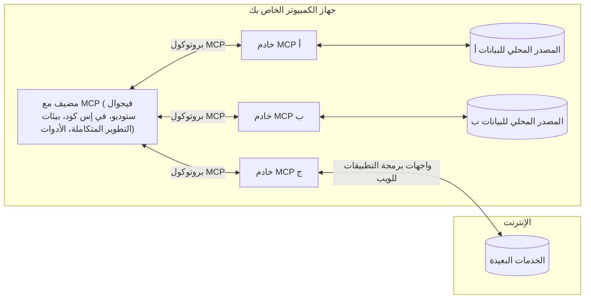

# المفاهيم الأساسية لـ MCP: إتقان بروتوكول سياق النموذج لتكامل الذكاء الاصطناعي

[](https://youtu.be/earDzWGtE84)

_(انقر على الصورة أعلاه لمشاهدة فيديو هذا الدرس)_

بروتوكول سياق النموذج [Model Context Protocol (MCP)](https://github.com/modelcontextprotocol) هو إطار عمل قوي وموحد يحسن الاتصال بين نماذج اللغة الكبيرة (LLMs) والأدوات والتطبيقات ومصادر البيانات الخارجية. 
سيأخذك هذا الدليل عبر المفاهيم الأساسية لـ MCP. سوف تتعلم عن هندسته المعمارية المعتمدة على نموذج العميل-الخادم، المكونات الأساسية، آليات الاتصال، وأفضل ممارسات التنفيذ.

- **موافقة المستخدم الصريحة**: تتطلب جميع عمليات الوصول إلى البيانات والتنفيذ موافقة صريحة من المستخدم قبل التنفيذ. يجب أن يفهم المستخدمون بوضوح البيانات التي سيتم الوصول إليها وما هي الإجراءات التي ستتم، مع تحكم دقيق في الأذونات والتفويضات.

- **حماية خصوصية البيانات**: تُعرض بيانات المستخدم فقط بموافقته الصريحة ويجب حمايتها من خلال ضوابط وصول قوية طوال دورة التفاعل. يجب على التنفيذات منع نقل البيانات غير المصرح به والمحافظة على حدود خصوصية صارمة.

- **أمان تنفيذ الأدوات**: يتطلب كل استدعاء أداة موافقة صريحة من المستخدم مع فهم واضح لوظائف الأداة، معلماتها، وتأثيراتها المحتملة. يجب أن تمنع الحدود الأمنية القوية التنفيذ غير المقصود، غير الآمن، أو الخبيث للأدوات.

- **أمان طبقة النقل**: يجب أن تستخدم جميع قنوات الاتصال آليات تشفير ومصادقة مناسبة. يجب تنفيذ بروتوكولات نقل آمنة وإدارة بيانات اعتماد ملائمة للاتصالات البعيدة.

#### إرشادات التنفيذ:

- **إدارة الأذونات**: تنفيذ أنظمة أذونات دقيقة تسمح للمستخدمين بالتحكم في الخوادم، الأدوات، والموارد التي يمكن الوصول إليها  
- **المصادقة والتفويض**: استخدام طرق مصادقة آمنة (OAuth، مفاتيح API) مع إدارة صحيحة للتوكنات وانتهائها  
- **التحقق من المدخلات**: التحقق من جميع المعلمات والمدخلات وفقًا للمخططات المحددة لمنع هجمات الحقن  
- **تسجيل التدقيق**: الاحتفاظ بسجلات شاملة لجميع العمليات للمراقبة الأمنية والامتثال

## نظرة عامة

يستكشف هذا الدرس الهندسة المعمارية الأساسية والمكونات التي تشكل نظام بروتوكول سياق النموذج (MCP). ستتعلم عن هيكلية العميل-الخادم، المكونات الرئيسية، وآليات الاتصال التي تمكّن التفاعلات في MCP.

## أهداف التعلم الرئيسية

بنهاية هذا الدرس، سوف:

- تفهم نموذج العميل-الخادم في MCP.
- تحدد أدوار ومسؤوليات المضيفين، العملاء، والخوادم.
- تحلل الميزات الأساسية التي تجعل MCP طبقة تكامل مرنة.
- تتعلم كيفية تدفق المعلومات داخل نظام MCP البيئي.
- تحصل على رؤى عملية من خلال أمثلة شفرة في .NET، Java، Python، و JavaScript.

## هندسة MCP: نظرة متعمقة

يبنى نظام MCP على نموذج العميل-الخادم. تسمح هذه البنية المعيارية لتطبيقات الذكاء الاصطناعي بالتفاعل مع الأدوات، قواعد البيانات، واجهات برمجة التطبيقات، والموارد السياقية بكفاءة. دعونا نفصل هذه الهندسة إلى مكوناتها الأساسية.

في جوهرها، يتبع MCP هندسة العميل-الخادم حيث يمكن لتطبيق مضيف الاتصال بعدة خوادم:


```mermaid
flowchart LR
    subgraph "جهاز الكمبيوتر الخاص بك"
        Host["مضيف مع MCP (فيجوال ستوديو، في إس كود، بيئات التطوير المتكاملة، الأدوات)"]
        S1["خادم MCP أ"]
        S2["خادم MCP ب"]
        S3["خادم MCP ج"]
        Host <-->|"بروتوكول MCP"| S1
        Host <-->|"بروتوكول MCP"| S2
        Host <-->|"بروتوكول MCP"| S3
        S1 <--> D1[("المصدر المحلي للبيانات أ")]
        S2 <--> D2[("المصدر المحلي للبيانات ب")]
    end
    subgraph "الإنترنت"
        S3 <-->|"واجهات برمجة التطبيقات للويب"| D3[("الخدمات البعيدة")]
    end
```

- **مضيفو MCP**: برامج مثل VSCode، Claude Desktop، بيئات التطوير المتكاملة (IDEs)، أو أدوات الذكاء الاصطناعي التي تريد الوصول إلى البيانات عبر MCP  
- **عملاء MCP**: عملاء البروتوكول الذين يحافظون على اتصالات 1:1 مع الخوادم  
- **خوادم MCP**: برامج خفيفة الوزن تعرض قدرات محددة من خلال بروتوكول سياق النموذج الموحد  
- **مصادر البيانات المحلية**: ملفات الكمبيوتر، قواعد البيانات، والخدمات التي يمكن لخوادم MCP الوصول إليها بأمان  
- **الخدمات البعيدة**: أنظمة خارجية متاحة عبر الإنترنت يمكن لخوادم MCP الاتصال بها عبر واجهات برمجة التطبيقات.

بروتوكول MCP هو معيار متطور يستخدم ترقيم إصدارات مستند إلى التاريخ (صيغة YYYY-MM-DD). الإصدار الحالي للبروتوكول هو **2025-11-25**. يمكنك الاطلاع على آخر التحديثات لـ [مواصفات البروتوكول](https://modelcontextprotocol.io/specification/2025-11-25/)

> **نظرة مستقبلية:** تم الإعلان عن مرشح الإصدار للإصدار التالي للمواصفات، **2026-07-28**، في مايو 2026، ومن المقرر إصداره في 28 يوليو 2026. يجعل البروتوكول بدون حالة في طبقة النقل (حذف مصافحة `initialize` ومعرفات الجلسة)، يصادق على إطار عمل الإضافات، ويهمش جذر/عينة/السجلات لصالح أنماط أحدث. انظر [ما الذي يتغير في MCP: مرشح إصدار 2026-07-28](./mcp-2026-07-28-release-candidate.md) للحصول على شرح كامل.

### 1. المضيفون

في بروتوكول سياق النموذج (MCP)، **المضيفون** هم تطبيقات الذكاء الاصطناعي التي تعمل كواجهة رئيسية يتفاعل من خلالها المستخدمون مع البروتوكول. ينسق المضيفون ويديرون الاتصالات مع خوادم MCP متعددة عبر إنشاء عملاء MCP مخصصين لكل اتصال خادم. أمثلة المضيفين تشمل:

- **تطبيقات الذكاء الاصطناعي**: Claude Desktop، Visual Studio Code، Claude Code  
- **بيئات التطوير**: بيئات التطوير المتكاملة ومحررات الشفرة مع تكامل MCP  
- **التطبيقات المخصصة**: وكلاء وأدوات ذكاء اصطناعي مصممة خصيصًا

المضيفون هم تطبيقات تنسق تفاعلات نماذج الذكاء الاصطناعي. هم:

- **تنسيق نماذج الذكاء الاصطناعي**: تنفيذ أو التفاعل مع LLMs لتوليد الردود وتنظيم سير العمل للذكاء الاصطناعي  
- **إدارة اتصالات العملاء**: إنشاء والحفاظ على عميل MCP واحد لكل اتصال بخادم MCP  
- **التحكم في واجهة المستخدم**: إدارة تدفق المحادثة، تفاعلات المستخدم، وعرض الردود  
- **فرض الأمان**: التحكم في الأذونات، القيود الأمنية، والمصادقة  
- **التعامل مع موافقة المستخدم**: إدارة موافقة المستخدم على مشاركة البيانات وتنفيذ الأدوات

### 2. العملاء

**العملاء** هم مكونات أساسية تحافظ على اتصالات مخصصة من نوع واحد لواحد بين المضيفين وخوادم MCP. يتم إنشاء كل عميل MCP من قبل المضيف للاتصال بخادم MCP محدد، مما يضمن قنوات اتصال منظمة وآمنة. تمكّن العملاء المتعددين المضيف من الاتصال بعدة خوادم في نفس الوقت.

العملاء هم مكونات موصلة داخل تطبيق المضيف. هم:

- **الاتصال بالبروتوكول**: إرسال طلبات JSON-RPC 2.0 إلى الخوادم مع المطالبات والتعليمات  
- **التفاوض على القدرات**: التفاوض مع الخوادم حول الميزات المدعومة وإصدارات البروتوكول أثناء التهيئة  
- **تنفيذ الأدوات**: إدارة طلبات تنفيذ الأدوات من النماذج ومعالجة الردود  
- **التحديثات في الوقت الحقيقي**: التعامل مع الإشعارات والتحديثات الحية من الخوادم  
- **معالجة الردود**: معالجة وتنسيق ردود الخادم لعرضها على المستخدمين

### 3. الخوادم

**الخوادم** هي برامج توفر السياق، الأدوات، والقدرات لعملاء MCP. يمكن تشغيلها محليًا (على نفس جهاز المضيف) أو عن بعد (على منصات خارجية)، وهي مسؤولة عن معالجة طلبات العملاء وتقديم ردود منظمة. تعرض الخوادم وظائف محددة من خلال بروتوكول سياق النموذج الموحد.

الخوادم هي خدمات توفر السياق والوظائف. هي:

- **تسجيل الميزات**: تسجيل وإتاحة البديهيات المتاحة (الموارد، المطالبات، الأدوات) للعملاء  
- **معالجة الطلبات**: استقبال وتنفيذ استدعاءات الأدوات، طلبات الموارد، وطلبات المطالبات من العملاء  
- **توفير السياق**: تقديم المعلومات والسياق لتحسين استجابات النموذج  
- **إدارة الحالة**: الحفاظ على حالة الجلسة والتعامل مع التفاعلات الحالة عند الحاجة  
- **الإشعارات في الوقت الحقيقي**: إرسال إشعارات عن تغييرات القدرات والتحديثات إلى العملاء المتصلين

يمكن لأي شخص تطوير خوادم لتوسيع قدرات النماذج بوظائف متخصصة، وتدعم سيناريوهات النشر المحلية والبعيدة.

### 4. بدائيات الخادم

تقدم خوادم بروتوكول سياق النموذج (MCP) ثلاث **بدائيات** أساسية تُعرف اللبنات الأساسية للتفاعلات الغنية بين العملاء، المضيفين، ونماذج اللغة. تحدد هذه البدائيات أنواع المعلومات السياقية والإجراءات المتوفرة عبر البروتوكول.

يمكن لخوادم MCP الكشف عن أي توليفة من البدائيات الثلاث الأساسية التالية:

#### الموارد

**الموارد** هي مصادر بيانات توفر معلومات سياقية لتطبيقات الذكاء الاصطناعي. تمثل محتوى ثابتًا أو ديناميكيًا يمكنه تعزيز فهم النموذج واتخاذ القرار:

- **بيانات سياقية**: معلومات منظمة وسياق لاستهلاك نموذج الذكاء الاصطناعي  
- **قواعد المعرفة**: مستودعات الوثائق، المقالات، الكتيبات، والأبحاث  
- **مصادر بيانات محلية**: ملفات، قواعد بيانات، ومعلومات النظام المحلي  
- **بيانات خارجية**: ردود واجهات برمجة التطبيقات، خدمات الويب، وبيانات النظام البعيد  
- **محتوى ديناميكي**: بيانات في الوقت الحقيقي تتحدث استنادًا إلى الظروف الخارجية

يتم تحديد الموارد بواسطة معرفات URI وتدعم الاكتشاف عبر طرق `resources/list` والاسترجاع عبر `resources/read`:

```text
file://documents/project-spec.md
database://production/users/schema
api://weather/current
```

#### المطالبات

**المطالبات** هي قوالب قابلة لإعادة الاستخدام تساعد في هيكلة التفاعلات مع نماذج اللغة. توفر أنماط تفاعل موحدة وسير عمل معتمد على القوالب:

- **تفاعلات قائمة على القوالب**: رسائل ومنشئات محادثة مُعدة مسبقًا  
- **قوالب سير العمل**: تسلسلات موحدة للمهام والتفاعلات الشائعة  
- **أمثلة قليلة اللقطات**: قوالب بناءً على الأمثلة لتوجيه النموذج  
- **مطالبات النظام**: مطالبات أساسية تعرف سلوك والسياق الخاص بالنموذج  
- **قوالب ديناميكية**: مطالبات معلماتية تتكيف مع السياقات المحددة

تدعم المطالبات الاستبدال المتغير ويمكن اكتشافها عبر `prompts/list` واسترجاعها عبر `prompts/get`:

```markdown
Generate a {{task_type}} for {{product}} targeting {{audience}} with the following requirements: {{requirements}}
```

#### الأدوات

**الأدوات** هي وظائف تنفيذية يمكن لنماذج الذكاء الاصطناعي استدعاؤها لأداء إجراءات محددة. تمثل "الأفعال" في نظام MCP البيئي، مما يمكّن النماذج من التفاعل مع أنظمة خارجية:

- **وظائف تنفيذية**: عمليات منفصلة يمكن للنماذج استدعاؤها بمعلمات محددة  
- **تكامل أنظمة خارجية**: استدعاءات API، استعلامات قواعد البيانات، عمليات الملفات، الحسابات  
- **هوية فريدة**: كل أداة لها اسم ووصف وهيكل معلمات مميز  
- **تدفق إدخال/إخراج منظم**: الأدوات تقبل معلمات مُحققة وتعيد ردودًا منظمة ومكتنزة  
- **قدرات العمل**: تمكّن النماذج من القيام بأفعال واقعية واسترجاع بيانات حية

يتم تعريف الأدوات باستخدام JSON Schema للتحقق من المعلمات ويمكن اكتشافها عبر `tools/list` وتنفيذها عبر `tools/call`. كما يمكن للأدوات أن تتضمن **أيقونات** كبيانات وصفية إضافية لعرض واجهة مستخدم أفضل.

**تعليقات الأدوات**: تدعم الأدوات تعليقات سلوكية (مثل `readOnlyHint`، `destructiveHint`) تصف ما إذا كانت الأداة للقراءة فقط أو تدميرية، مما يساعد العملاء على اتخاذ قرارات مستنيرة بشأن تنفيذ الأدوات.

تعريف مثال لأداة:

```typescript
server.tool(
  "search_products", 
  {
    query: z.string().describe("Search query for products"),
    category: z.string().optional().describe("Product category filter"),
    max_results: z.number().default(10).describe("Maximum results to return")
  }, 
  async (params) => {
    // نفذ البحث وأعد النتائج بشكل منظم
    return await productService.search(params);
  }
);
```

## بدائيات العميل

في بروتوكول سياق النموذج (MCP)، يمكن **للعملاء** كشف بدائيات تسمح للخوادم بطلب قدرات إضافية من تطبيق المضيف. تمكن هذه البدائيات على جانب العميل خوادم أكثر ثراءً وتفاعلية يمكنها الوصول إلى قدرات نموذج الذكاء الاصطناعي وتفاعلات المستخدم.

### العينة

> **إشعار الإيقاف:** يمثل مرشح الإصدار `2026-07-28` إيقاف استخدام العينة لصالح التكامل المباشر مع واجهات برمجة التطبيقات لمزودي نماذج اللغة. تستمر في العمل في الإصدار `2025-11-25` ولمدة عام على الأقل بعد الإيقاف، لكن التصاميم الجديدة يجب أن تفضل نمط الاستبدال. انظر [ما الذي يتغير في MCP: مرشح إصدار 2026-07-28](./mcp-2026-07-28-release-candidate.md).

تتيح **العينة** للخوادم طلب إكمالات نموذج اللغة من تطبيق الذكاء الاصطناعي الخاص بالعميل. تمكّن هذه البدائية الخوادم من الوصول إلى قدرات LLM دون تضمين تبعيات النموذج الخاصة بها:

- **الوصول المستقل عن النموذج**: يمكن للخوادم طلب الإكمالات دون الحاجة إلى تضمين SDK لنموذج اللغة أو إدارة وصول النموذج  
- **ذكاء اصطناعي يبدأ من الخادم**: يمكن للخوادم توليد المحتوى بشكل مستقل باستخدام نموذج الذكاء الاصطناعي الخاص بالعميل  
- **تفاعلات متكررة مع LLM**: تدعم السيناريوهات المعقدة حيث تحتاج الخوادم إلى مساعدة الذكاء الاصطناعي للمعالجة  
- **توليد محتوى ديناميكي**: تتيح للخوادم إنشاء ردود سياقية باستخدام نموذج المضيف  
- **دعم استدعاء الأدوات**: يمكن للخوادم تضمين `tools` و `toolChoice` لتمكين نموذج العميل من استدعاء الأدوات أثناء العينة

تبدأ العينة عبر طريقة `sampling/complete`، حيث ترسل الخوادم طلبات إكمالات إلى العملاء.

### الجذور

> **إشعار الإيقاف:** يمثل مرشح الإصدار `2026-07-28` إيقاف استخدام الجذور لصالح معلمات الأدوات، معرفات URI للموارد، أو تكوين الخادم. تستمر في العمل في الإصدار `2025-11-25` ولمدة عام على الأقل بعد الإيقاف. انظر [ما الذي يتغير في MCP: مرشح إصدار 2026-07-28](./mcp-2026-07-28-release-candidate.md).

توفر **الجذور** طريقة موحدة للعملاء لكشف حدود نظام الملفات للخوادم، مما يساعد الخوادم على فهم الأدلة والملفات التي يمكن الوصول إليها:

- **حدود نظام الملفات**: تحديد حدود مكان عمل الخوادم ضمن نظام الملفات  
- **التحكم في الوصول**: مساعدة الخوادم على فهم الأدلة والملفات التي يحق لها الوصول إليها  
- **تحديثات ديناميكية**: يمكن للعملاء إخطار الخوادم عند تغيّر قائمة الجذور  
- **التعريف باستخدام URI**: تستخدم الجذور معرفات `file://` لتحديد الأدلة والملفات المتاحة

يتم اكتشاف الجذور عبر طريقة `roots/list`، ويرسل العملاء `notifications/roots/list_changed` عند تغير الجذور.

### الاستنباط

تمكن **الاستنباط** الخوادم من طلب معلومات إضافية أو تأكيدات من المستخدمين عبر واجهة العميل:

- **طلبات إدخال المستخدم**: يمكن للخوادم طلب معلومات إضافية عند الحاجة لتنفيذ الأداة  
- **حوارات التأكيد**: طلب موافقة المستخدم على العمليات الحساسة أو المؤثرة  
- **سير عمل تفاعلي**: تمكين الخوادم من إنشاء تفاعلات مستخدم خطوة بخطوة  
- **جمع المعلمات الديناميكي**: جمع المعلمات المفقودة أو الاختيارية أثناء تنفيذ الأدوات

تُجرى طلبات الاستنباط باستخدام طريقة `elicitation/request` لجمع إدخال المستخدم عبر واجهة العميل.

**استنباط وضع URL**: يمكن للخوادم أيضًا طلب تفاعلات المستخدم عبر URL، مما يسمح لهم بتوجيه المستخدمين إلى صفحات ويب خارجية للمصادقة، التأكيد، أو إدخال البيانات.

### التسجيل
> **إشعار الإيقاف:** إصدار المرشح `2026-07-28` يعلّن إيقاف استخدام التسجيل Logging ويفضل بدلاً منه استخدام `stderr` لنقل stdio وOpenTelemetry للرصد البنيوي. لا يزال يعمل في `2025-11-25` ولمدة سنة على الأقل بعد أي إيقاف. راجع [ما الذي يتغير في MCP: إصدار المرشح 2026-07-28](./mcp-2026-07-28-release-candidate.md).

**التسجيل Logging** يسمح للخوادم بإرسال رسائل سجل هيكلية إلى العملاء لأغراض التصحيح، والمراقبة، والرؤية التشغيلية:

- **دعم التصحيح**: تمكين الخوادم من توفير سجلات تنفيذ مفصلة لاستكشاف الأخطاء وإصلاحها  
- **المراقبة التشغيلية**: إرسال تحديثات الحالة ومقاييس الأداء إلى العملاء  
- **إبلاغ الأخطاء**: توفير سياق خطأ مفصل ومعلومات تشخيصية  
- **مسارات التدقيق**: إنشاء سجلات شاملة لعمليات وقرارات الخادم

يتم إرسال رسائل التسجيل إلى العملاء لتوفير الشفافية في عمليات الخادم وتسهيل التصحيح.

## تدفق المعلومات في MCP

بروتوكول سياق النموذج (MCP) يحدد تدفقًا هيكليًا للمعلومات بين المضيفين والعملاء والخوادم والنماذج. فهم هذا التدفق يساعد في توضيح كيفية معالجة طلبات المستخدم وكيفية دمج الأدوات والبيانات الخارجية في استجابات النموذج.

- **المضيف يبدأ الاتصال**  
  تطبيق المضيف (مثل بيئة تطوير متكاملة أو واجهة دردشة) يقيم اتصالًا مع خادم MCP، عادةً عبر STDIO أو WebSocket أو أي نقل مدعوم آخر.

- **تفاوض القدرات**  
  العميل (المضمّن في المضيف) والخادم يتبادلان معلومات حول الميزات المدعومة، الأدوات، الموارد، وإصدارات البروتوكول. هذا يضمن أن كلا الطرفين يفهمان القدرات المتاحة للجلسة.

- **طلب المستخدم**  
  المستخدم يتفاعل مع المضيف (مثل إدخال موجه أو أمر). المضيف يجمع هذا الإدخال ويمرره إلى العميل للمعالجة.

- **استخدام الموارد أو الأدوات**  
  - قد يطلب العميل سياقًا إضافيًا أو موارد من الخادم (مثل ملفات، مدخلات قواعد بيانات، أو مقالات قاعدة معرفة) لتعزيز فهم النموذج.  
  - إذا قرر النموذج أن أداة مطلوبة (مثل لجلب بيانات، إجراء حساب، أو استدعاء API)، يرسل العميل طلب استدعاء الأداة إلى الخادم، محددًا اسم الأداة والمعاملات.

- **تنفيذ الخادم**  
  الخادم يستلم طلب المورد أو الأداة، ينفذ العمليات اللازمة (مثل تشغيل دالة، استعلام قاعدة بيانات، أو استرجاع ملف)، ويرسل النتائج إلى العميل بتنسيق هيكلي.

- **توليد الاستجابة**  
  العميل يدمج ردود الخادم (بيانات الموارد، مخرجات الأدوات، إلخ) في التفاعل المستمر مع النموذج. يستخدم النموذج هذه المعلومات لتوليد استجابة شاملة وذات صلة سياقية.

- **عرض النتائج**  
  المضيف يتلقى المخرجات النهائية من العميل ويعرضها للمستخدم، غالبًا بما في ذلك النص الذي ولده النموذج وأي نتائج من تنفيذ الأدوات أو البحث في الموارد.

يُتيح هذا التدفق لـ MCP دعم تطبيقات الذكاء الاصطناعي المتقدمة، التفاعلية، والواعية بالسياق من خلال ربط النماذج بسلاسة مع الأدوات والبيانات الخارجية.

## بنية البروتوكول والطبقات

يتألف MCP من طبقتين معماريتين متميزتين تعملان معًا لتوفير إطار اتصال متكامل:

### طبقة البيانات

تنفذ **طبقة البيانات** بروتوكول MCP الأساسي باستخدام **JSON-RPC 2.0** كأساس لها. هذه الطبقة تحدد هيكل الرسائل ودلالاتها وأنماط التفاعل:

#### المكونات الأساسية:

- **بروتوكول JSON-RPC 2.0**: كل الاتصالات تستخدم تنسيق JSON-RPC 2.0 القياسي للمكالمات، الردود، والإشعارات  
- **إدارة دورة الحياة**: يتعامل مع تهيئة الاتصال، تفاوض القدرات، وإنهاء الجلسة بين العملاء والخوادم  
- **المكونات الأصلية للخادم**: تمكّن الخوادم من توفير وظائف أساسية عبر الأدوات، الموارد، والمطالبات  
- **المكونات الأصلية للعميل**: تمكّن الخوادم من طلب العينات من نماذج اللغة الكبيرة، استدعاء مدخلات المستخدم، وإرسال رسائل تسجيل  
- **الإشعارات في الوقت الحقيقي**: تدعم الإشعارات غير المتزامنة للتحديثات الديناميكية دون استدعاء متكرر

#### الميزات الأساسية:

- **تفاوض إصدار البروتوكول**: يستخدم إصدارًا معتمدًا على التاريخ (YYYY-MM-DD) لضمان التوافق  
- **اكتشاف القدرات**: يتبادل العملاء والخوادم معلومات الميزات المدعومة أثناء التهيئة  
- **جلسات ذات حالة**: تحافظ على حالة الاتصال عبر عدة تفاعلات لاستمرارية السياق

### طبقة النقل

تدير **طبقة النقل** قنوات الاتصال، تأطير الرسائل، والمصادقة بين مشاركي MCP:

#### آليات النقل المدعومة:

1. **نقل STDIO**:  
   - يستخدم تدفقات الإدخال/الإخراج القياسية للاتصال المباشر بين العمليات  
   - مثالي للعمليات المحلية على نفس الجهاز بدون حمل شبكة إضافي  
   - يستخدم شائعًا لتنفيذات خادم MCP المحلية

2. **نقل HTTP قابل للبث**:  
   - يستخدم HTTP POST لرسائل العميل إلى الخادم  
   - اختياريًا يستخدم أحداث المرسل من الخادم SSE للبث من الخادم إلى العميل  
   - يتيح التواصل مع خوادم بعيدة عبر الشبكات  
   - يدعم المصادقة القياسية HTTP (رموز التحمل، مفاتيح API، رؤوس مخصصة)  
   - ينصح MCP باستخدام OAuth للمصادقة الآمنة المعتمدة على الرموز

#### تجريد النقل:

طبقة النقل تجرد تفاصيل الاتصال من طبقة البيانات، مُمكِنة استخدام نفس تنسيق رسالة JSON-RPC 2.0 عبر كل آليات النقل. هذا التجريد يتيح للتطبيقات التبديل بسلاسة بين الخوادم المحلية والبعيدة.

### اعتبارات الأمان

يجب أن تلتزم تطبيقات MCP بعدة مبادئ أمان حرجة لضمان تفاعلات آمنة وموثوقة عبر جميع عمليات البروتوكول:

- **موافقة المستخدم والتحكم**: يجب أن يقدم المستخدمون موافقة صريحة قبل الوصول إلى أي بيانات أو تنفيذ أي عمليات. يجب أن يكون لديهم تحكم واضح فيما يتم مشاركته من بيانات وما هي الإجراءات المصرح بها، مدعومًا بواجهات مستخدم بديهية لمراجعة والموافقة على الأنشطة.

- **خصوصية البيانات**: يجب الكشف عن بيانات المستخدم فقط بموافقة صريحة ويجب حمايتها بضوابط وصول مناسبة. يجب على تنفيذات MCP حماية البيانات من النقل غير المصرح به وضمان الحفاظ على الخصوصية في جميع التفاعلات.

- **أمان الأدوات**: قبل استدعاء أي أداة يجب الحصول على موافقة صريحة من المستخدم. يجب أن يكون لدى المستخدمين فهم واضح لوظيفة كل أداة، ويجب تطبيق حدود أمان صارمة لمنع تنفيذ أدوات غير مقصود أو غير آمن.

باتباع هذه المبادئ الأمنية، يضمن MCP الحفاظ على ثقة المستخدم، الخصوصية، والسلامة عبر كل التفاعلات مع البروتوكول مع تمكين تكاملات ذكاء اصطناعي قوية.

## أمثلة الكود: المكونات الأساسية

فيما يلي أمثلة كود بلغات برمجة شائعة توضح كيفية تنفيذ مكونات خادم MCP الرئيسية والأدوات.

### مثال .NET: إنشاء خادم MCP بسيط مع أدوات

هذا مثال عملي بلغة .NET يوضح كيفية تنفيذ خادم MCP بسيط باستخدام أدوات مخصصة. يعرض المثال كيفية تعريف الأدوات وتسجيلها، معالجة الطلبات، والاتصال بالخادم باستخدام بروتوكول سياق النموذج.

```csharp
using System;
using System.Threading.Tasks;
using ModelContextProtocol.Server;
using ModelContextProtocol.Server.Transport;
using ModelContextProtocol.Server.Tools;

public class WeatherServer
{
    public static async Task Main(string[] args)
    {
        // Create an MCP server
        var server = new McpServer(
            name: "Weather MCP Server",
            version: "1.0.0"
        );
        
        // Register our custom weather tool
        server.AddTool<string, WeatherData>("weatherTool", 
            description: "Gets current weather for a location",
            execute: async (location) => {
                // Call weather API (simplified)
                var weatherData = await GetWeatherDataAsync(location);
                return weatherData;
            });
        
        // Connect the server using stdio transport
        var transport = new StdioServerTransport();
        await server.ConnectAsync(transport);
        
        Console.WriteLine("Weather MCP Server started");
        
        // Keep the server running until process is terminated
        await Task.Delay(-1);
    }
    
    private static async Task<WeatherData> GetWeatherDataAsync(string location)
    {
        // This would normally call a weather API
        // Simplified for demonstration
        await Task.Delay(100); // Simulate API call
        return new WeatherData { 
            Temperature = 72.5,
            Conditions = "Sunny",
            Location = location
        };
    }
}

public class WeatherData
{
    public double Temperature { get; set; }
    public string Conditions { get; set; }
    public string Location { get; set; }
}
```

### مثال Java: مكونات خادم MCP

يعرض هذا المثال نفس خادم MCP وتسجيل الأدوات كما في مثال .NET أعلاه، لكن منفذ بلغة Java.

```java
import io.modelcontextprotocol.server.McpServer;
import io.modelcontextprotocol.server.McpToolDefinition;
import io.modelcontextprotocol.server.transport.StdioServerTransport;
import io.modelcontextprotocol.server.tool.ToolExecutionContext;
import io.modelcontextprotocol.server.tool.ToolResponse;

public class WeatherMcpServer {
    public static void main(String[] args) throws Exception {
        // إنشاء خادم MCP
        McpServer server = McpServer.builder()
            .name("Weather MCP Server")
            .version("1.0.0")
            .build();
            
        // تسجيل أداة الطقس
        server.registerTool(McpToolDefinition.builder("weatherTool")
            .description("Gets current weather for a location")
            .parameter("location", String.class)
            .execute((ToolExecutionContext ctx) -> {
                String location = ctx.getParameter("location", String.class);
                
                // الحصول على بيانات الطقس (مبسطة)
                WeatherData data = getWeatherData(location);
                
                // إرجاع استجابة منسقة
                return ToolResponse.content(
                    String.format("Temperature: %.1f°F, Conditions: %s, Location: %s", 
                    data.getTemperature(), 
                    data.getConditions(), 
                    data.getLocation())
                );
            })
            .build());
        
        // ربط الخادم باستخدام نقل stdio
        try (StdioServerTransport transport = new StdioServerTransport()) {
            server.connect(transport);
            System.out.println("Weather MCP Server started");
            // إبقاء الخادم قيد التشغيل حتى يتم إنهاء العملية
            Thread.currentThread().join();
        }
    }
    
    private static WeatherData getWeatherData(String location) {
        // التنفيذ سيستدعي واجهة برمجة تطبيقات الطقس
        // مبسط لأغراض المثال
        return new WeatherData(72.5, "Sunny", location);
    }
}

class WeatherData {
    private double temperature;
    private String conditions;
    private String location;
    
    public WeatherData(double temperature, String conditions, String location) {
        this.temperature = temperature;
        this.conditions = conditions;
        this.location = location;
    }
    
    public double getTemperature() {
        return temperature;
    }
    
    public String getConditions() {
        return conditions;
    }
    
    public String getLocation() {
        return location;
    }
}
```

### مثال Python: بناء خادم MCP

يستخدم هذا المثال مكتبة fastmcp، يرجى التأكد من تثبيتها أولًا:

```python
pip install fastmcp
```
نموذج الكود:

```python
#!/usr/bin/env python3
import asyncio
from fastmcp import FastMCP
from fastmcp.transports.stdio import serve_stdio

# إنشاء خادم FastMCP
mcp = FastMCP(
    name="Weather MCP Server",
    version="1.0.0"
)

@mcp.tool()
def get_weather(location: str) -> dict:
    """Gets current weather for a location."""
    return {
        "temperature": 72.5,
        "conditions": "Sunny",
        "location": location
    }

# نهج بديل باستخدام فئة
class WeatherTools:
    @mcp.tool()
    def forecast(self, location: str, days: int = 1) -> dict:
        """Gets weather forecast for a location for the specified number of days."""
        return {
            "location": location,
            "forecast": [
                {"day": i+1, "temperature": 70 + i, "conditions": "Partly Cloudy"}
                for i in range(days)
            ]
        }

# تسجيل أدوات الفئة
weather_tools = WeatherTools()

# بدء الخادم
if __name__ == "__main__":
    asyncio.run(serve_stdio(mcp))
```

### مثال JavaScript: إنشاء خادم MCP

يعرض هذا المثال إنشاء خادم MCP بلغة JavaScript وكيفية تسجيل أداتين تتعلقان بالطقس.

```javascript
// استخدام مجموعة أدوات بروتوكول سياق النموذج الرسمية
import { McpServer } from "@modelcontextprotocol/sdk/server/mcp.js";
import { StdioServerTransport } from "@modelcontextprotocol/sdk/server/stdio.js";
import { z } from "zod"; // للتحقق من صحة المعاملات

// إنشاء خادم MCP
const server = new McpServer({
  name: "Weather MCP Server",
  version: "1.0.0"
});

// تعريف أداة الطقس
server.tool(
  "weatherTool",
  {
    location: z.string().describe("The location to get weather for")
  },
  async ({ location }) => {
    // عادةً ما يستدعي هذا واجهة برمجة تطبيقات الطقس
    // مبسط للعرض التوضيحي
    const weatherData = await getWeatherData(location);
    
    return {
      content: [
        { 
          type: "text", 
          text: `Temperature: ${weatherData.temperature}°F, Conditions: ${weatherData.conditions}, Location: ${weatherData.location}` 
        }
      ]
    };
  }
);

// تعريف أداة التنبؤ
server.tool(
  "forecastTool",
  {
    location: z.string(),
    days: z.number().default(3).describe("Number of days for forecast")
  },
  async ({ location, days }) => {
    // عادةً ما يستدعي هذا واجهة برمجة تطبيقات الطقس
    // مبسط للعرض التوضيحي
    const forecast = await getForecastData(location, days);
    
    return {
      content: [
        { 
          type: "text", 
          text: `${days}-day forecast for ${location}: ${JSON.stringify(forecast)}` 
        }
      ]
    };
  }
);

// دوال مساعدة
async function getWeatherData(location) {
  // محاكاة استدعاء واجهة برمجة التطبيقات
  return {
    temperature: 72.5,
    conditions: "Sunny",
    location: location
  };
}

async function getForecastData(location, days) {
  // محاكاة استدعاء واجهة برمجة التطبيقات
  return Array.from({ length: days }, (_, i) => ({
    day: i + 1,
    temperature: 70 + Math.floor(Math.random() * 10),
    conditions: i % 2 === 0 ? "Sunny" : "Partly Cloudy"
  }));
}

// ربط الخادم باستخدام نقل stdio
const transport = new StdioServerTransport();
server.connect(transport).catch(console.error);

console.log("Weather MCP Server started");
```

يوضح هذا المثال بلغة JavaScript كيفية إنشاء خادم MCP باستخدام SDK بروتوكول سياق النموذج. يوضح كيفية تسجيل أداتين باسم `weatherTool` و`forecastTool` وجعلهما متاحتين لعملاء MCP عبر `StdioServerTransport`.

## الأمن والتفويض

يتضمن MCP عدة مفاهيم وآليات مدمجة لإدارة الأمان والتفويض عبر البروتوكول بالكامل:

1. **التحكم في صلاحية الأدوات**:  
  يمكن للعملاء تحديد الأدوات التي يُسمح للنموذج باستخدامها خلال الجلسة. هذا يضمن إمكانية الوصول فقط إلى الأدوات المصرح بها صراحة، مما يقلل مخاطر العمليات غير المقصودة أو غير الآمنة. يمكن تكوين الأذونات ديناميكيًا بناءً على تفضيلات المستخدم، سياسات المؤسسة، أو سياق التفاعل.

2. **المصادقة**:  
  يمكن للخوادم طلب المصادقة قبل منح الوصول إلى الأدوات، الموارد، أو العمليات الحساسة. قد يشمل ذلك مفاتيح API، رموز OAuth، أو مخططات مصادقة أخرى. المصادقة السليمة تضمن أن العملاء والمستخدمين الموثوقين فقط هم من يمكنهم استدعاء قدرات الخادم.

3. **التحقق**:  
  يتم فرض التحقق من المعاملات لكل استدعاء أداة. تعرّف كل أداة الأنواع المتوقعة، التنسيقات، والقيود لمعاملاتها، ويقوم الخادم بالتحقق من الطلبات الواردة وفقًا لذلك. هذا يمنع إدخال مدخلات خاطئة أو خبيثة تصل إلى تنفيذ الأدوات ويساعد على الحفاظ على سلامة العمليات.

4. **تقييد المعدل**:  
  لمنع الاستغلال وضمان استخدام عادل لموارد الخادم، يمكن لخوادم MCP تنفيذ تقييد معدل لاستدعاءات الأدوات والوصول إلى الموارد. يمكن تطبيق حدود المعدل لكل مستخدم، لكل جلسة، أو على مستوى عام، وتساعد في الحماية من هجمات تعطيل الخدمة أو استهلاك الموارد المفرط.

باستخدام هذه الآليات، يوفر MCP أساسًا آمنًا لدمج نماذج اللغة مع الأدوات والبيانات الخارجية، مع إعطاء المستخدمين والمطورين تحكمًا دقيقًا في الوصول والاستخدام.

## رسائل البروتوكول وتدفق الاتصال

يستخدم MCP رسائل **JSON-RPC 2.0** هيكلية لتسهيل التفاعلات الواضحة والموثوقة بين المضيفين، والعملاء، والخوادم. يحدد البروتوكول أنماط رسائل محددة لأنواع مختلفة من العمليات:

### أنواع الرسائل الأساسية:

#### **رسائل التهيئة**
- طلب **`initialize`**: يقيم الاتصال ويتفاوض حول إصدار البروتوكول والقدرات  
- رد **`initialize`**: يؤكد الميزات المدعومة ومعلومات الخادم  
- **`notifications/initialized`**: إشارة إلى اكتمال التهيئة واستعداد الجلسة

#### **رسائل الاكتشاف**
- طلب **`tools/list`**: اكتشاف الأدوات المتاحة من الخادم  
- طلب **`resources/list`**: قائمة الموارد (مصادر البيانات) المتاحة  
- طلب **`prompts/list`**: استرجاع قوالب المطالبات المتاحة

#### **رسائل التنفيذ**  
- طلب **`tools/call`**: تنفيذ أداة محددة مع المعاملات المقدمة  
- طلب **`resources/read`**: استرجاع محتوى من مورد معين  
- طلب **`prompts/get`**: جلب قالب مطالبة مع معاملات اختيارية

#### **رسائل جانب العميل**
- طلب **`sampling/complete`**: يطلب الخادم استكمال نموذج لغة كبير من العميل  
- طلب **`elicitation/request`**: يطلب الخادم إدخال المستخدم عبر واجهة العميل  
- رسائل تسجيل: يرسل الخادم رسائل سجل هيكلية إلى العميل

#### **رسائل الإشعارات**
- **`notifications/tools/list_changed`**: يبلغ الخادم العميل بتغييرات في قائمة الأدوات  
- **`notifications/resources/list_changed`**: يبلغ الخادم العميل بتغييرات في قائمة الموارد  
- **`notifications/prompts/list_changed`**: يبلغ الخادم العميل بتغييرات في قائمة المطالبات

### هيكل الرسائل:

كل رسائل MCP تتبع تنسيق JSON-RPC 2.0 مع:  
- رسائل الطلب: تشمل `id`، `method`، و`params` اختيارية  
- رسائل الرد: تشمل `id` و`result` أو `error`  
- رسائل الإشعار: تشمل `method` و`params` اختيارية (بدون `id` ولا متوقع رد)

يضمن هذا التواصل الهيكلي تفاعلات موثوقة، قابلة للتتبع، وقابلة للتوسعة تدعم سيناريوهات متقدمة مثل التحديثات في الوقت الحقيقي، ترابط الأدوات، والتعامل الصلب مع الأخطاء.

### المهام (تجريبي)

> **نظرة مستقبلية:** إصدار المرشح `2026-07-28` يخرج المهام Tasks من المواصفة الأساسية التجريبية ضمن امتداد مخصص للمهام مع دورة حياة معاد تصميمها (`tasks/get`, `tasks/update`, `tasks/cancel`; تمت إزالة `tasks/list`). إذا قمت بالبناء على واجهة برمجة التطبيقات التجريبية الموضحة أدناه، خطط للترحيل. راجع [ما الذي يتغير في MCP: إصدار المرشح 2026-07-28](./mcp-2026-07-28-release-candidate.md).

**المهام** هي ميزة تجريبية توفر أغلفة تنفيذ متينة تُمكّن من استرجاع النتائج مؤجلًا وتتبع الحالة لطلبات MCP:

- **عمليات طويلة الأمد**: تتبع الحسابات المكلفة، أتمتة سير العمل، والمعالجة الدُفعية  
- **نتائج مؤجلة**: الاستعلام عن حالة المهمة واسترجاع النتائج عند اكتمال العمليات  
- **تتبع الحالة**: مراقبة تقدم المهمة عبر حالات دورة حياة محددة  
- **عمليات متعددة الخطوات**: دعم سير عمل معقد يمتد عبر تفاعلات متعددة

تغلف المهام طلبات MCP القياسية لتمكين أنماط التنفيذ غير المتزامن للعمليات التي لا يمكن إكمالها على الفور.

## النتائج الرئيسية

- **العمارة**: MCP يستخدم بنية عميل-خادم حيث يدير المضيفون اتصالات متعددة للعملاء مع الخوادم  
- **المشاركون**: النظام يشمل المضيفين (تطبيقات الذكاء الاصطناعي)، العملاء (موصلات البروتوكول)، والخوادم (مزودات القدرات)  
- **آليات النقل**: يدعم الاتصال STDIO (محلي) وHTTP قابل للبث مع SSE اختياري (عن بُعد)  
- **المكونات الأساسية**: الخوادم تعرض أدوات (دوال قابلة للتنفيذ)، موارد (مصادر بيانات)، ومطالبات (قوالب)  
- **مكونات العميل**: يمكن للخوادم طلب عينات (اكتمالات LLM مع دعم استدعاء الأدوات)، استخلاص (إدخال المستخدم بما في ذلك وضع URL)، جذر (حدود نظام الملفات)، وتسجيل من العملاء  
- **ميزات تجريبية**: المهام توفر أغلفة تنفيذ متينة للعمليات طويلة الأمد  
- **أساس البروتوكول**: مبني على JSON-RPC 2.0 مع ترقيم قائم على التاريخ (الحالي: 2025-11-25)  
- **القدرات في الوقت الحقيقي**: يدعم الإشعارات للتحديثات الديناميكية والمزامنة اللحظية  
- **الأمان أولاً**: موافقة صريحة للمستخدم، حماية خصوصية البيانات، ونقل آمن هي متطلبات أساسية

## تمرين

صمم أداة MCP بسيطة ستكون مفيدة في مجالك. حدد:  
1. ما اسم الأداة  
2. المعاملات التي ستقبلها  
3. إخراجها الذي سترجعه  
4. كيف قد يستخدم النموذج هذه الأداة لحل مشاكل المستخدمين


---

## التالي

التالي: [الفصل 2: الأمان](../02-Security/README.md)
هل أنت فضولي بشأن ما سيأتي بعد `2025-11-25`؟ اقرأ [ما الجديد في MCP: النسخة المرشحة للإصدار 2026-07-28](./mcp-2026-07-28-release-candidate.md).

---

<!-- CO-OP TRANSLATOR DISCLAIMER START -->
**تنويه**:
تمت ترجمة هذا المستند باستخدام خدمة الترجمة بالذكاء الاصطناعي [Co-op Translator](https://github.com/Azure/co-op-translator). بينما نسعى للدقة، يرجى العلم أن الترجمات الآلية قد تحتوي على أخطاء أو عدم دقة. يجب اعتبار المستند الأصلي بلغته الأصلية المصدر الرسمي والمعتمد. للمعلومات الهامة، يُنصح بالاستعانة بترجمة بشرية محترفة. نحن غير مسؤولين عن أي سوء فهم أو تفسير ناتج عن استخدام هذه الترجمة.
<!-- CO-OP TRANSLATOR DISCLAIMER END -->