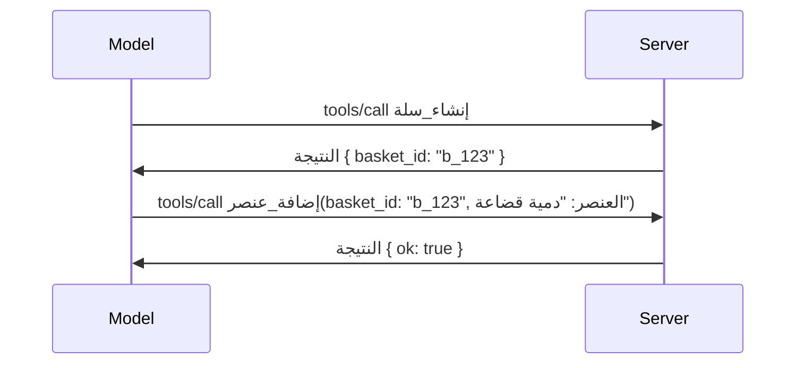

# ماذا يتغير في MCP: مرشح الإصدار 2026-07-28

> **الحالة:** مرشح الإصدار. مواصفة `2026-07-28` ليست نهائية في وقت كتابة هذا النص. تم الإعلان عنها في 21 مايو 2026، ومن المقرر إصدارها في 28 يوليو 2026. كل ما في هذا الدرس يصف مرشح الإصدار؛ تحقق من [مسودة المواصفة](https://modelcontextprotocol.io/specification/draft) و[سجل التغييرات](https://modelcontextprotocol.io/specification/draft/changelog) الخاص بها لأحدث الحالة قبل أن تبني بناءً عليه. بقية هذا المنهج مكتوبة وفقًا للإصدار المستقر الحالي، **مواصفة MCP 2025-11-25**، وسيتم تحديثها بمجرد إصدار `2026-07-28`.

## نظرة عامة

`2026-07-28` هو أكبر مراجعة لـ MCP منذ إطلاقه. ستة مقترحات تحسين للمواصفات (SEP) تزيل جلسات مستوى البروتوكول وتجعل MCP بلا حالة في طبقة النقل، وتصبح الإضافات آلية رئيسية من الدرجة الأولى ومُعتمدة بالإصدار، ويتم وضع علامات على عدة ميزات تعلمتها سابقًا في هذا المنهج (الجذور، العينة، التسجيل) على أنها مهجورة بموجب سياسة دورة حياة جديدة. يلخص هذا الدرس ما يتغير، ولماذا هو مهم، وماذا يعني ذلك للكود الذي كتبته بالفعل مقابل `2025-11-25`.

المصدر: [مرشح إصدار مواصفة MCP 2026-07-28](https://blog.modelcontextprotocol.io/posts/2026-07-28-release-candidate/) (مدونة نموذج بروتوكول السياق، ديفيد سوريا بارا ودين ديلمارسكي).

## أهداف التعلم

بنهاية هذا الدرس، ستكون قادرًا على:

- شرح سبب انتقال MCP إلى نواة بروتوكول بلا حالة وما المشكلة التي يحلها لنشرات التوسع الأفقي.
- وصف كيفية استبدال مصافحة `initialize`/`initialized` ورأس `Mcp-Session-Id`.
- التعرف على رؤوس `Mcp-Method` و`Mcp-Name` الجديدة وبيانات التخزين المؤقت `ttlMs`/`cacheScope`.
- التعرف على إطار عمل الإضافات والإضافتين اللتين تُشحنان مع هذا الإصدار: تطبيقات MCP والمهام.
- تعداد ست مقترحات تحسين للتفويض تعزز توافق OAuth 2.0 / OIDC.
- تحديد الميزات الأساسية (الجذور، العينة، التسجيل) التي أصبحت مهجورة الآن، وماذا يعني ذلك عمليًا.
- شرح التغيير في مخطط JSON الكامل 2020-12 لأدوات `inputSchema`/`outputSchema`.

## بروتوكول بلا حالة

التغيير الرئيسي: يصبح MCP بلا حالة على مستوى البروتوكول.

### قبل (2025-11-25): الجلسات تقيدك بمثيل خادم واحد

يبدأ استدعاء أداة عبر بروتوكول HTTP القابل للبث بمصافحة `initialize`. يستجيب الخادم برأس `Mcp-Session-Id` الذي يجب أن تحمله كل الطلبات اللاحقة:

```http
POST /mcp HTTP/1.1
Mcp-Session-Id: 1868a90c-3a3f-4f5b
Content-Type: application/json

{"jsonrpc":"2.0","id":2,"method":"tools/call",
 "params":{"name":"search","arguments":{"q":"otters"}}}
```

نظرًا لأن الجلسة مرتبطة بأي مثيل خادم أصدرها، فإن النشر الأفقي الموسع يحتاج إلى **توجيه لاصق** في موزع التحميل و**مخزن جلسات مشترك** عبر المثيلات.

### بعد (2026-07-28): كل طلب يحتوي كافة بياناته ذاتيًا

```http
POST /mcp HTTP/1.1
MCP-Protocol-Version: 2026-07-28
Mcp-Method: tools/call
Mcp-Name: search
Content-Type: application/json

{"jsonrpc":"2.0","id":1,"method":"tools/call",
 "params":{"name":"search","arguments":{"q":"otters"},
           "_meta":{"io.modelcontextprotocol/clientInfo":{"name":"my-app","version":"1.0"}}}}
```

يمكن لأي مثيل خادم التعامل مع هذا الطلب. التغييرات الرئيسية:

- **تمت إزالة مصافحة `initialize`/`initialized`** ([SEP-2575](https://github.com/modelcontextprotocol/modelcontextprotocol/pull/2575)). تنتقل نسخة البروتوكول، ومعلومات العميل، وإمكانيات العميل إلى `_meta` في كل طلب. طريقة جديدة `server/discover` تتيح للعميل جلب إمكانيات الخادم مقدمًا عند الحاجة.
- **تمت إزالة رأس `Mcp-Session-Id` وجلسة مستوى البروتوكول** ([SEP-2567](https://github.com/modelcontextprotocol/modelcontextprotocol/pull/2567)). لم تعد التوجيهات اللاصقة ومخازن الجلسات المشتركة مطلوبة على مستوى البروتوكول.

### بروتوكول بلا حالة، تطبيقات بحالة

إزالة جلسة مستوى البروتوكول لا تعني أن خادمك لا يمكن أن يحتفظ بحالة. النمط الموصى به هو نفس النمط الذي تستخدمه APIs HTTP دائمًا: إنشاء مقبض صريح (مثل `basket_id`، `browser_id`) من استدعاء أداة واحدة، وجعل النموذج يعيد هذا المقبض كوسيط عادي في الاستدعاءات اللاحقة.



هذا يجعل الحالة مرئية ومعقولة للنموذج بدلًا من إخفائها في بيانات النقل، ويسمح لأي مثيل خادم بالتعامل مع أي استدعاء.

### طلبات الخادم إلى العميل، معاد هيكلتها

بروتوكول بلا حالة لا يزال يحتاج إلى طريقة حتى يطلب الخادم شيئًا من العميل أثناء الاستدعاء (مثل مطالبة استيضاح):

- **يمكن فقط إصدار طلبات يبدأها الخادم أثناء معالجة الخادم النشطة لطلب العميل** ([SEP-2260](https://github.com/modelcontextprotocol/modelcontextprotocol/pull/2260)) — كان ذلك مُوصى به سابقًا، وأصبح الآن مطلوبًا. لا يتم مطالبة المستخدم فجأة ودون سابق إنذار.
- **الطلبات متعددة الجولات** ([SEP-2322](https://github.com/modelcontextprotocol/modelcontextprotocol/pull/2322)) تحل محل إبقاء تدفق SSE مفتوحًا. بدلاً من ذلك، يعيد الخادم `InputRequiredResult`:

  ```json
  {
    "resultType": "inputRequired",
    "inputRequests": {
      "confirm": {
        "type": "elicitation",
        "message": "Delete 3 files?",
        "schema": { "type": "boolean" }
      }
    },
    "requestState": "eyJzdGVwIjoxLCJmaWxlcyI6WyJhIiwiYiIsImMiXX0="
  }
  ```

يجمع العميل الإجابات ويعيد إصدار الطلب الأصلي مع `inputResponses` بالإضافة إلى `requestState` المكرر. يمكن لأي مثيل خادم استئناف المحاولة لأن كل ما يحتاجه موجود في الحمولة.

### قابلة للتوجيه، التخزين المؤقت، والتتبع

ثلاث تغييرات أصغر تجعل حركة المرور بلا حالة أسهل في التشغيل:

- **رؤوس `Mcp-Method` و`Mcp-Name` مطلوبة على HTTP القابل للبث** ([SEP-2243](https://github.com/modelcontextprotocol/modelcontextprotocol/pull/2243))، حتى يتمكن موزعو التحميل والبوابات ومحددو المعدلات من التوجيه بناءً على العملية دون فحص جسم JSON. ترفض الخوادم الطلبات التي تتعارض بين الرؤوس والجسم.
- **`tools/list` ونتائج قراءة الموارد تحمل `ttlMs` و`cacheScope`** ([SEP-2549](https://github.com/modelcontextprotocol/modelcontextprotocol/pull/2549))، مستمدة من `Cache-Control` في HTTP. يعرف العملاء مدة صلاحية النتيجة وما إذا كان يمكن مشاركتها بين المستخدمين بأمان، دون الحاجة إلى حفظ تدفق SSE طويل الأمد لمعرفة التغييرات.
- **تم توثيق انتشار سياق التتبع W3C في `_meta`** ([SEP-414](https://github.com/modelcontextprotocol/modelcontextprotocol/pull/414))، مع تصحيح أسماء المفاتيح `traceparent` و`tracestate` و`baggage` حتى يمكن تتبع طلب موزع عبر SDK العميل، وخادم MCP، والأنظمة اللاحقة في خلفية متوافقة مع [OpenTelemetry](https://opentelemetry.io/).

## الإضافات تصبح من الدرجة الأولى

كانت الإضافات موجودة بشكل غير رسمي في `2025-11-25`. [SEP-2133](https://github.com/modelcontextprotocol/modelcontextprotocol/pull/2133) يصيغها رسميًا:

- يتم تحديد الإضافات بمعرفات عكس DNS.
- يتم التفاوض عليها عبر خريطة `extensions` على إمكانيات العميل والخادم.
- تعيش في مستودعات منفصلة `ext-*` مع صيانة مفوضة وتصدر إصدارات مستقلة عن المواصفة الأساسية.
- مسار إضافات جديد في عملية SEP يمنحها مسارًا من تجريبي إلى رسمي.

يشحن هذا الإصدار إضافتين رسميتين.

### تطبيقات MCP: واجهات المستخدم المقدمة من الخادم

[تطبيقات MCP](https://blog.modelcontextprotocol.io/posts/2026-01-26-mcp-apps/) ([SEP-1865](https://github.com/modelcontextprotocol/modelcontextprotocol/pull/1865)) تتيح للخوادم شحن واجهات HTML تفاعلية يقدمها المضيفون داخل iframe معزول محمي. تعلن الأدوات عن قوالب الواجهة مقدماً حتى يتمكن المضيفون من التحميل المسبق، والتخزين المؤقت، ومراجعة الأمان قبل تشغيل أي شيء. لقد غطيت أساسيات هذا في [الدرس 15: تطبيقات MCP](../03-GettingStarted/15-mcp-apps/README.md) — تحت إطار الإضافات، تطبيقات MCP أصبحت الآن رسمية كإضافة بدلاً من ميزة جزء أساسي تجريبية.

### تخرج المهام إلى إضافة

شُحنت المهام كميزة أساسية تجريبية في `2025-11-25`. أظهرت استخدامات الإنتاج إعادة تصميم كافية تجعل المكان المناسب لها إضافة: [إضافة المهام](https://github.com/modelcontextprotocol/modelcontextprotocol/pull/2663) تعيد تشكيل دورة الحياة حول النموذج بلا حالة — يمكن للخادم الرد على `tools/call` بمقبض مهمة، والعميل يوجهها قدمًا بـ `tasks/get` و`tasks/update` و`tasks/cancel`. يتم توجيه إنشاء المهمة من الخادم: يعلن العميل عن الإضافة، ويقرر الخادم متى يجب أن يُشغل الاستدعاء كمهمة. تُزال `tasks/list` بالكامل لأنها لا يمكن تعيينها بأمان بدون جلسات.

> **ملاحظة الهجرة:** إذا نفذت API المهام التجريبية في `2025-11-25`، ستحتاج إلى الانتقال إلى دورة حياة الإضافة الجديدة — فهي غير متوافقة مع الإصدارات السابقة.

## تعزيز التفويض

ستة SEP تعزز [مواصفة التفويض](https://modelcontextprotocol.io/specification/draft/basic/authorization) لتتوافق بشكل أوثق مع عمليات النشر الواقعية لـ OAuth 2.0 / OpenID Connect:

| SEP | التغيير |
|---|---|
| [SEP-2468](https://github.com/modelcontextprotocol/modelcontextprotocol/pull/2468) | يجب على العملاء التحقق من معامل `iss` في استجابات التفويض وفقًا لـ [RFC 9207](https://www.rfc-editor.org/rfc/rfc9207)، للتخفيف من هجمات الخلط الشائعة في نمط MCP الذي يستخدم عميلًا واحدًا وخوادم متعددة. نسخة مستقبلية ستتطلب رفض الاستجابات المفقودة قيمة `iss`. |
| [SEP-837](https://github.com/modelcontextprotocol/modelcontextprotocol/pull/837) | يعلن العملاء عن `application_type` الخاص بـ OpenID Connect أثناء التسجيل الديناميكي للعميل، لتجنب خوادم التفويض من اعتبار العميل المكتبي/CLI افتراضيًا كـ `"web"` ورفض عنوان إعادة التوجيه الخاص بـ localhost. |
| [SEP-2352](https://github.com/modelcontextprotocol/modelcontextprotocol/pull/2352) | يربط العملاء بيانات الاعتماد المسجلة بخادم التفويض الذي أصدرها (`issuer`) ويعيدون التسجيل عند انتقال مورد بين خوادم التفويض. |
| [SEP-2207](https://github.com/modelcontextprotocol/modelcontextprotocol/pull/2207) | توثيق كيفية طلب رموز تحديث من خوادم التفويض بنمط OpenID Connect. |
| [SEP-2350](https://github.com/modelcontextprotocol/modelcontextprotocol/pull/2350) | توضيح تراكم الصلاحيات أثناء التفويض المتقدم. |
| [SEP-2351](https://github.com/modelcontextprotocol/modelcontextprotocol/pull/2351) | توضيح لاحقة الاكتشاف `.well-known`. |

إذا كنت تبني خادم تفويض لـ MCP اليوم، ابدأ بتوفير `iss` في استجابات التفويض الآن — انظر [02-Security](../02-Security/README.md) للتوجيه الأمني الحالي الذي ستبني عليه.

## الجذور والعينة والتسجيل مهجورة

بموجب [سياسة دورة حياة الميزة الجديدة](https://github.com/modelcontextprotocol/modelcontextprotocol/pull/2577) ([SEP-2577](https://github.com/modelcontextprotocol/modelcontextprotocol/pull/2577))، تنتقل ثلاث بنيات أساسية تعلمتها في [المفاهيم الأساسية](./README.md#roots) إلى حالة **مهجورة**:

| الميزة | البديل الموصى به |
|---|---|
| الجذور | معلمات الأداة، عناوين موارد، أو تكوين الخادم |
| العينة | التكامل المباشر مع واجهات برمجة تطبيقات مزود LLM |
| التسجيل | `stderr` لوسائط stdio؛ OpenTelemetry للرصد المهيكل |

هذه **تحذيرات تعليقية فقط**: الطرق، الأنواع، وأعلام الإمكانيات ستستمر في العمل في هذا الإصدار وكل إصدار من المواصفة يتم نشره خلال سنة من هذا الإصدار. إزالة أي منها تمامًا ستتطلب SEP منفصل ضمن سياسة دورة الحياة — لذلك لن ينكسر شيء في عينات [العينة](../03-GettingStarted/14-sampling/README.md) الحالية لديك، لكن يجب على الخوادم الجديدة تفضيل الأنماط البديلة المشار إليها أعلاه.

## مخطط JSON الكامل 2020-12 للأدوات

تم رفع `inputSchema` و`outputSchema` للأداة إلى [مخطط JSON 2020-12 الكامل](https://json-schema.org/draft/2020-12) ([SEP-2106](https://github.com/modelcontextprotocol/modelcontextprotocol/pull/2106)):

- تحافظ مخططات الإدخال على قيد الجذر `type: "object"` لكنها تسمح الآن بالتأليف (`oneOf`, `anyOf`, `allOf`)، الشرطيات، والمراجع (`$ref`, `$defs`).
- مخططات الإخراج غير مقيدة، و`structuredContent` يمكن أن يكون أي قيمة JSON بدلاً من كونه كائنًا فقط.
- يجب على التنفيذات عدم حل مراجع URI الخارجية `$ref` تلقائيًا ويجب تقييد عمق المخطط ووقت التحقق (اعتبار لمنع هجمات الخدمة المرفوضة عند التحقق من المخططات على الخادم).

من ناحية أخرى، يتغير رمز الخطأ للموارد المفقودة من رمز MCP المخصص `-32002` إلى الرمز القياسي لـ JSON-RPC `-32602` (وسائط غير صالحة) ([SEP-2164](https://github.com/modelcontextprotocol/modelcontextprotocol/pull/2164)). إذا كان عميلك يطابق القيمة الحرفية `-32002`، ستحتاج إلى تحديثه.

## كيف يتطور البروتوكول من هنا

يحتوي هذا الإصدار على تغييرات كسر توافق، والتي لا يقصد صناع MCP أن تكون القاعدة مستقبلاً. ثلاثة مقترحات حوكمة تهدف لمنع تكرار ذلك:

- **سياسة دورة حياة الميزة** تعطي كل ميزة مسارًا من نشط → مهجور → مرفوع مع ما لا يقل عن اثني عشر شهرًا بين التهجير وأقرب إزالة ممكنة.
- **إطار الإضافات** يسمح بإطلاق إمكانيات جديدة كإضافات اختيارية وتثبيتها هناك قبل (إن حدث) نقلها إلى المواصفة الأساسية.
- لا يمكن لمواصفة معيارية على مسار المعايير أن تصل إلى الحالة النهائية حتى يتم تضمين سيناريو مطابق في [مجموعة التوافق](https://github.com/modelcontextprotocol/conformance) ([SEP-2484](https://github.com/modelcontextprotocol/modelcontextprotocol/pull/2484)) — نفس المجموعة التي يقيس عليها [نظام طبقات SDK](https://github.com/modelcontextprotocol/modelcontextprotocol/pull/1777) SDKs الرسمية.

## الجدول الزمني للإصدار والتحقق

- تم إغلاق النسخة المرشحة للإصدار في 21 مايو 2026.
- من المقرر إصدار المواصفة النهائية في 28 يوليو 2026.
- تسمح فترة العشرة أسابيع بينهما لمطوري SDK والمطورين العميلين بالتحقق من التغييرات مقابل أحمال عمل حقيقية؛ ومن المتوقع أن تقوم SDKs من الطبقة 1 بدعم هذه التغييرات خلال هذه الفترة تحت نظام طبقات [SDK](https://modelcontextprotocol.io/docs/sdk).
- تابع مجموعة التغييرات الكاملة في [مسودة المواصفة](https://modelcontextprotocol.io/specification/draft) و[سجل التغييرات](https://modelcontextprotocol.io/specification/draft/changelog) الخاص بها.

## ماذا يعني هذا لهذا المنهج

كل ما تعلمته حتى الآن في هذه الدورة يستهدف **2025-11-25**، والتي تظل المواصفة المستقرة الحالية حتى يتم إصدار `2026-07-28`. بشكل ملموس:

- **الجلسات وإجراء المصافحة `initialize`** (المغطى في [المفاهيم الأساسية](./README.md) و[الدرس 6: البث عبر HTTP](../03-GettingStarted/06-http-streaming/README.md)) لا تزال تعمل كما هو موثق اليوم، لكن من المتوقع استبدالهما بنموذج الطلبات بدون حالة أعلاه بمجرد الترقية إلى SDKs المتوافقة مع `2026-07-28`.
- **العينات والجذور** (أيضًا مغطاة في [المفاهيم الأساسية](./README.md)) تظل تعمل بالكامل لكنها مهجورة — يجب أن تُفضل التصاميم الجديدة أنماط البدائل المذكورة أعلاه.
- **ميزة المهام التجريبية**، إذا كنت قد استخدمتها، فسيتطلب الأمر ترحيلها إلى دورة حياة امتداد المهام الجديدة.
- **تطبيقات MCP** ([الدرس 15](../03-GettingStarted/15-mcp-apps/README.md)) غير متأثرة عمليًا؛ فهي ببساطة تنتقل تحت إطار عمل الامتدادات الرسمي.

## موارد إضافية

- [نسخة مرشحة لإصدار مواصفة MCP 2026-07-28 (مقال مدونة)](https://blog.modelcontextprotocol.io/posts/2026-07-28-release-candidate/)
- [مستقبل نقل MCP](https://blog.modelcontextprotocol.io/posts/2025-12-19-mcp-transport-future/)
- [مسودة مواصفة MCP](https://modelcontextprotocol.io/specification/draft)
- [سجل تغييرات مسودة MCP](https://modelcontextprotocol.io/specification/draft/changelog)
- [إرشادات SEP](https://modelcontextprotocol.io/community/sep-guidelines)
- [نظام طبقات MCP SDK](https://modelcontextprotocol.io/docs/sdk)

## الخطوات التالية

ارجع إلى [المفاهيم الأساسية](./README.md) أو تابع إلى [الأمان](../02-Security/README.md) لترى كيف تتوافق إرشادات `2025-11-25` الحالية مع القادم.

---

<!-- CO-OP TRANSLATOR DISCLAIMER START -->
**تنويه**:
تمت ترجمة هذا المستند باستخدام خدمة الترجمة بالذكاء الاصطناعي [Co-op Translator](https://github.com/Azure/co-op-translator). بينما نسعى للدقة، يرجى العلم أن الترجمات الآلية قد تحتوي على أخطاء أو عدم دقة. يجب اعتبار المستند الأصلي بلغته الأصلية المصدر الرسمي والمعتمد. للمعلومات الهامة، يُنصح بالاستعانة بترجمة بشرية محترفة. نحن غير مسؤولين عن أي سوء فهم أو تفسير ناتج عن استخدام هذه الترجمة.
<!-- CO-OP TRANSLATOR DISCLAIMER END -->