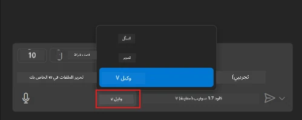
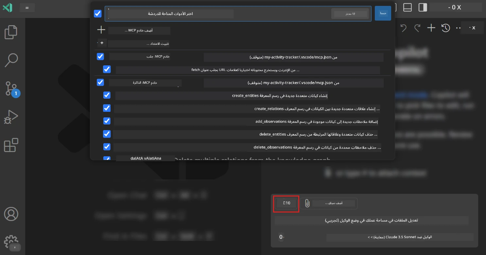
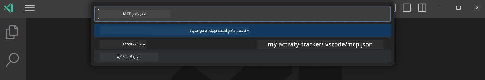
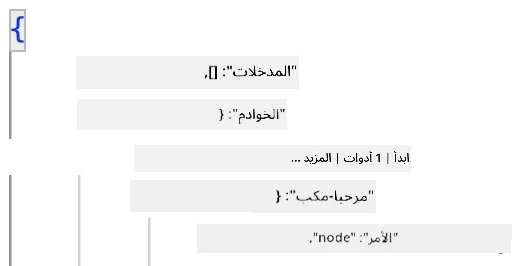
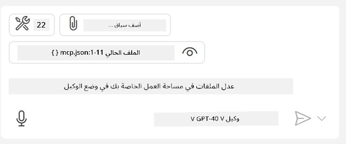

# استهلاك خادم من وضع وكيل GitHub Copilot

يمكن لـ Visual Studio Code و GitHub Copilot أن يتصرفا كعميل ويستهلكا خادم MCP. قد تسأل لماذا نرغب في فعل ذلك؟ حسنًا، هذا يعني أن أي ميزات يمتلكها خادم MCP يمكن الآن استخدامها من داخل بيئة تطويرك المتكاملة (IDE). تخيل على سبيل المثال إضافة خادم MCP الخاص بـ GitHub، هذا سيسمح لك بالتحكم في GitHub عبر المطالبات بدلاً من كتابة أوامر محددة في الطرفية. أو تخيل أي شيء بشكل عام يمكنه تحسين تجربة المطور الخاصة بك كلها يتحكم بها اللغة الطبيعية. هل بدأت ترى الفائدة الآن؟

## نظرة عامة

يغطي هذا الدرس كيفية استخدام Visual Studio Code ووضع وكيل GitHub Copilot كعميل لخادم MCP الخاص بك.

## أهداف التعلم

بحلول نهاية هذا الدرس، ستكون قادرًا على:

- استهلاك خادم MCP عبر Visual Studio Code.
- تشغيل القدرات مثل الأدوات عبر GitHub Copilot.
- تكوين Visual Studio Code لإيجاد وإدارة خادم MCP الخاص بك.

## الاستخدام

يمكنك التحكم في خادم MCP الخاص بك بطريقتين مختلفتين:

- واجهة المستخدم، سترى كيف يتم ذلك لاحقًا في هذا الفصل.
- الطرفية، من الممكن التحكم في الأشياء من الطرفية باستخدام الأمر التنفيذي `code`:

  لإضافة خادم MCP إلى ملف تعريف المستخدم، استخدم خيار السطر --add-mcp، وقدم تكوين الخادم بصيغة JSON على الشكل {\"name\":\"server-name\",\"command\":...}.

  ```
  code --add-mcp "{\"name\":\"my-server\",\"command\": \"uvx\",\"args\": [\"mcp-server-fetch\"]}"
  ```

### لقطات شاشة





دعونا نتحدث أكثر عن كيفية استخدام الواجهة البصرية في الأقسام القادمة.

## النهج

إليك كيف نحتاج إلى التعامل مع الأمر على مستوى عالٍ:

- تكوين ملف لإيجاد خادم MCP الخاص بنا.
- تشغيل/الاتصال بالخادم المذكور ليعرض قدراته.
- استخدام القدرات المذكورة من خلال واجهة GitHub Copilot Chat.

ممتاز، الآن بعد أن فهمنا التدفق، دعونا نجرب استخدام خادم MCP من خلال Visual Studio Code عبر تمرين.

## تمرين: استهلاك خادم

في هذا التمرين، سنقوم بتكوين Visual Studio Code لإيجاد خادم MCP الخاص بك حتى يمكن استخدامه من خلال واجهة GitHub Copilot Chat.

### -0- خطوة تمهيدية، تفعيل اكتشاف خادم MCP

قد تحتاج إلى تفعيل اكتشاف خوادم MCP.

1. اذهب إلى `File -> Preferences -> Settings` في Visual Studio Code.

1. ابحث عن "MCP" وفعل `chat.mcp.discovery.enabled` في ملف settings.json.

### -1- إنشاء ملف التكوين

ابدأ بإنشاء ملف تكوين في جذر مشروعك، ستحتاج إلى ملف يسمى MCP.json ووضعه في مجلد يسمى .vscode. يجب أن يبدو هكذا:

```text
.vscode
|-- mcp.json
```

بعد ذلك، دعونا نرى كيف يمكننا إضافة إدخال لخادم.

### -2- تكوين خادم

أضف المحتوى التالي إلى *mcp.json*:

```json
{
    "inputs": [],
    "servers": {
       "hello-mcp": {
           "command": "node",
           "args": [
               "build/index.js"
           ]
       }
    }
}
```

هذا مثال بسيط أعلاه لكيفية بدء خادم مكتوب بـ Node.js، بالنسبة لبيئات التشغيل الأخرى وضح الأمر الصحيح لبدء الخادم باستخدام `command` و `args`.

### -3- تشغيل الخادم

الآن بعد أن أضفت إدخالًا، دعنا نبدأ الخادم:

1. حدد موقع إدخالك في *mcp.json* وتأكد من وجود أيقونة "تشغيل":

    

1. انقر على أيقونة "تشغيل"، يجب أن ترى أيقونة الأدوات في GitHub Copilot Chat تزيد عدد الأدوات المتاحة. إذا نقرْت على أيقونة الأدوات تلك، سترى قائمة الأدوات المسجلة. يمكنك اختيار/إلغاء اختيار كل أداة حسب ما إذا كنت تريد أن يستخدمها GitHub Copilot كسياق:

  

1. لتشغيل أداة، اكتب موجهًا تعرف أنه سيطابق وصف إحدى أدواتك، على سبيل المثال موجه مثل "أضف 22 إلى 1":

  

  سترى ردًا يقول 23.

## مهمة

حاول إضافة إدخال خادم إلى ملف *mcp.json* الخاص بك وتأكد من قدرتك على بدء/إيقاف الخادم. تأكد أيضًا من قدرتك على التواصل مع الأدوات على خادمك عبر واجهة GitHub Copilot Chat.

## الحل

[الحل](./solution/README.md)

## النقاط الرئيسية المستفادة

النقاط المستفادة من هذا الفصل هي كالتالي:

- Visual Studio Code هو عميل رائع يتيح لك استهلاك عدة خوادم MCP وأدواتهم.
- واجهة GitHub Copilot Chat هي كيفية تفاعلك مع الخوادم.
- يمكنك طلب إدخال من المستخدم مثل مفاتيح API التي يمكن تمريرها إلى خادم MCP عند تكوين إدخال الخادم في ملف *mcp.json*.

## عينات

- [حاسبة جافا](../samples/java/calculator/README.md)
- [حاسبة .Net](../../../../03-GettingStarted/samples/csharp)
- [حاسبة جافا سكريبت](../samples/javascript/README.md)
- [حاسبة تايب سكريبت](../samples/typescript/README.md)
- [حاسبة بايثون](../../../../03-GettingStarted/samples/python)

## موارد إضافية

- [وثائق Visual Studio](https://code.visualstudio.com/docs/copilot/chat/mcp-servers)

## التالي

- التالي: [إنشاء خادم stdio](../05-stdio-server/README.md)

---

<!-- CO-OP TRANSLATOR DISCLAIMER START -->
**تنويه**:
تمت ترجمة هذا المستند باستخدام خدمة الترجمة بالذكاء الاصطناعي [Co-op Translator](https://github.com/Azure/co-op-translator). بينما نسعى للدقة، يرجى العلم أن الترجمات الآلية قد تحتوي على أخطاء أو عدم دقة. يجب اعتبار المستند الأصلي بلغته الأصلية المصدر الرسمي والمعتمد. للمعلومات الهامة، يُنصح بالاستعانة بترجمة بشرية محترفة. نحن غير مسؤولين عن أي سوء فهم أو تفسير ناتج عن استخدام هذه الترجمة.
<!-- CO-OP TRANSLATOR DISCLAIMER END -->