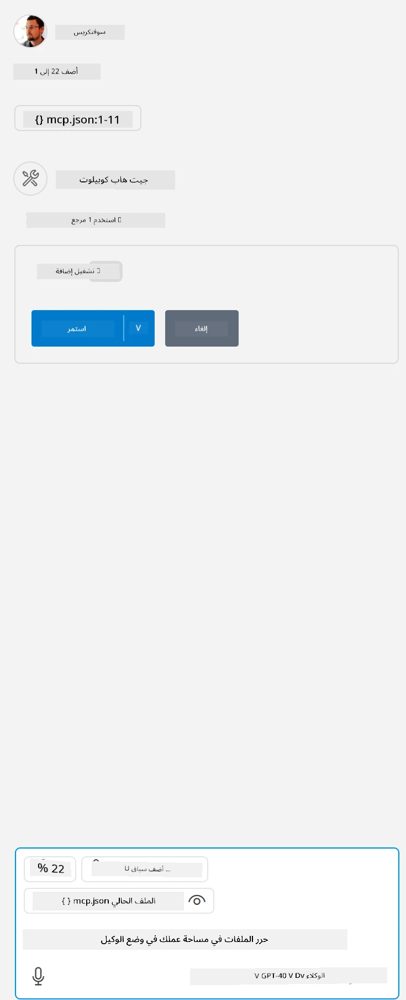

# تشغيل العينة

هنا نفترض أن لديك شفرة خادم تعمل بالفعل. يرجى العثور على خادم من أحد الفصول السابقة.

## إعداد mcp.json

إليك ملف تستخدمه كمرجع، [mcp.json](../../../../../03-GettingStarted/04-vscode/solution/mcp.json).

غيّر مدخل الخادم حسب الحاجة للإشارة إلى المسار المطلق للخادم الخاص بك متضمناً الأمر الكامل اللازم للتشغيل.

في الملف المثال المشار إليه أعلاه، يبدو مدخل الخادم هكذا:

<details>
<summary>node.js</summary>
```json
"hello-mcp": {
    "command": "node",
    "args": [
        "build/index.js"
    ]
}
```
</details>

<details>
<summary>.NET</summary>

قد تضطر إلى إدخال جذر مستودع GitHub، والذي يمكن الحصول عليه من الأمر، `git rev-parse --show-toplevel`.

```jsonc
{
  "inputs": [
    {
      "type": "promptString",
      "id": "repository-root",
      "description": "The absolute path to the repository root"
    }
  ],
  "servers": {
    "calculator-mcp-dotnet": {
      "type": "stdio",
      "command": "dotnet",
      "args": [
        "run",
        "--project",
        "${input:repository-root}/03-GettingStarted/02-client/solution/server/server.csproj"
      ]
    }
  }
}
```

</details>

هذا يتوافق مع تشغيل أمر مثل: `node build/index.js`.

- غيّر مدخل الخادم هذا ليناسب مكان وجود ملف الخادم الخاص بك أو حسب ما هو مطلوب لتشغيل الخادم بناءً على وقت التشغيل المختار وموقع الخادم.

## استهلاك الميزات في الخادم

- اضغط على أيقونة `تشغيل`، بمجرد إضافة *mcp.json* إلى مجلد *./vscode*،

    راقب تغير أيقونة الأدوات لزيادة عدد الأدوات المتاحة. تقع أيقونة الأدوات مباشرة فوق حقل الدردشة في GitHub Copilot.

## تشغيل أداة

- اكتب موجهًا في نافذة الدردشة يتطابق مع وصف أداتك. على سبيل المثال، لتشغيل الأداة `add` اكتب شيئًا مثل "add 3 to 20".

    يجب أن ترى ظهور أداة معروضة فوق مربع نص الدردشة تشير إلى اختيارك لتشغيل الأداة كما في هذه الصورة البصرية:

    

    يجب أن يؤدي اختيار الأداة إلى إنتاج نتيجة عددية تقول "23" إذا كان موجهك كما ذكرنا سابقًا.

---

<!-- CO-OP TRANSLATOR DISCLAIMER START -->
**تنويه**:
تمت ترجمة هذا المستند باستخدام خدمة الترجمة بالذكاء الاصطناعي [Co-op Translator](https://github.com/Azure/co-op-translator). بينما نسعى للدقة، يرجى العلم أن الترجمات الآلية قد تحتوي على أخطاء أو عدم دقة. يجب اعتبار المستند الأصلي بلغته الأصلية المصدر الرسمي والمعتمد. للمعلومات الهامة، يُنصح بالاستعانة بترجمة بشرية محترفة. نحن غير مسؤولين عن أي سوء فهم أو تفسير ناتج عن استخدام هذه الترجمة.
<!-- CO-OP TRANSLATOR DISCLAIMER END -->