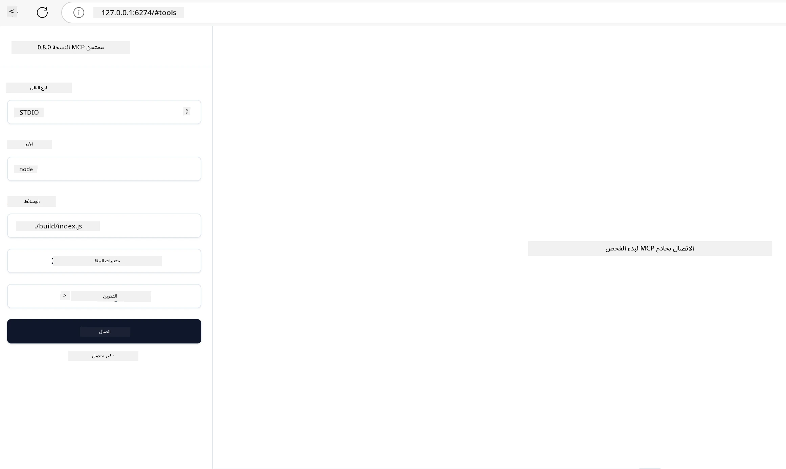

## الاختبار وتصحيح الأخطاء

قبل أن تبدأ في اختبار خادم MCP الخاص بك، من المهم أن تفهم الأدوات المتاحة وأفضل الممارسات لتصحيح الأخطاء. يضمن الاختبار الفعال أن يعمل خادمك كما هو متوقع ويساعدك على تحديد المشكلات وحلها بسرعة. يوضح القسم التالي الأساليب الموصى بها للتحقق من تنفيذ MCP الخاص بك.

## نظرة عامة

تغطي هذه الدرس كيفية اختيار النهج الصحيح للاختبار وأداة الاختبار الأكثر فعالية.

## أهداف التعلم

بنهاية هذا الدرس، ستكون قادراً على:

- وصف الأساليب المختلفة للاختبار.
- استخدام أدوات مختلفة لاختبار الكود الخاص بك بفعالية.


## اختبار خوادم MCP

يوفر MCP أدوات لمساعدتك في اختبار وتصحيح خوادمك:

- **مفتش MCP**: أداة سطر أوامر يمكن تشغيلها كأداة CLI وكتطبيق مرئي.
- **الاختبار اليدوي**: يمكنك استخدام أداة مثل curl لتشغيل طلبات الويب، ولكن أي أداة قادرة على تشغيل HTTP ستفي بالغرض.
- **اختبار الوحدة**: من الممكن استخدام إطار الاختبار المفضل لديك لاختبار ميزات كل من الخادم والعميل.

### استخدام مفتش MCP

لقد وصفنا استخدام هذه الأداة في دروس سابقة، ولكن دعنا نتحدث عنها بمستوى عالي. هي أداة مبنية على Node.js ويمكنك استخدامها عن طريق استدعاء ملف `npx` التنفيذي والذي سيقوم بتنزيل وتثبيت الأداة مؤقتًا وسيقوم بتنظيف نفسه بمجرد الانتهاء من تشغيل طلبك.

يساعدك [مفتش MCP](https://github.com/modelcontextprotocol/inspector) في:

- **اكتشاف قدرات الخادم**: اكتشاف الموارد، الأدوات، والمطالب المتاحة تلقائيًا
- **اختبار تنفيذ الأدوات**: تجربة معلمات مختلفة ورؤية الاستجابات في الوقت الحقيقي
- **عرض بيانات تعريف الخادم**: فحص معلومات الخادم، المخططات، والإعدادات

يبدو تشغيل الأداة النموذجي كما يلي:

```bash
npx @modelcontextprotocol/inspector node build/index.js
```

الأمر أعلاه يبدأ MCP وواجهته المرئية ويطلق واجهة ويب محلية في متصفحك. يمكنك أن تتوقع رؤية لوحة تحكم تعرض خوادم MCP المسجلة لديك، الأدوات، الموارد، والمطالب المتاحة لديهم. تتيح لك الواجهة اختبار تنفيذ الأدوات بشكل تفاعلي، وفحص بيانات تعريف الخادم، ورؤية الاستجابات في الوقت الحقيقي، مما يسهل التحقق وتصحيح أخطاء تنفيذات خادم MCP الخاصة بك.

إليك كيف يمكن أن يبدو: 

يمكنك أيضًا تشغيل هذه الأداة في وضع CLI حيث تضيف السمة `--cli`. إليك مثالًا على تشغيل الأداة في وضع "CLI" الذي يعرض كل الأدوات على الخادم:

```sh
npx @modelcontextprotocol/inspector --cli node build/index.js --method tools/list
```

### الاختبار اليدوي

بخلاف تشغيل أداة المفتش لاختبار قدرات الخادم، هناك نهج مماثل آخر وهو تشغيل عميل قادر على استخدام HTTP مثل curl على سبيل المثال.

مع curl، يمكنك اختبار خوادم MCP مباشرة باستخدام طلبات HTTP:

```bash
# مثال: بيانات وصفية لخادم الاختبار
curl http://localhost:3000/v1/metadata

# مثال: تنفيذ أداة
curl -X POST http://localhost:3000/v1/tools/execute \
  -H "Content-Type: application/json" \
  -d '{"name": "calculator", "parameters": {"expression": "2+2"}}'
```

كما ترى من استخدام curl أعلاه، تستخدم طلب POST لاستدعاء أداة باستخدام حمولة تتكون من اسم الأداة ومعلماتها. استخدم النهج الذي يناسبك أكثر. تميل أدوات CLI بشكل عام إلى أن تكون أسرع في الاستخدام وتسمح بأتمتة عبر السكريبتات، وهو ما يمكن أن يكون مفيدًا في بيئة CI/CD.

### اختبار الوحدة

قم بإنشاء اختبارات وحدة لأدواتك ومواردك لضمان عملها كما هو متوقع. إليك مثال على كود اختبار.

```python
import pytest

from mcp.server.fastmcp import FastMCP
from mcp.shared.memory import (
    create_connected_server_and_client_session as create_session,
)

# ضع علامة على الوحدة بالكامل لاختبارات غير متزامنة
pytestmark = pytest.mark.anyio


async def test_list_tools_cursor_parameter():
    """Test that the cursor parameter is accepted for list_tools.

    Note: FastMCP doesn't currently implement pagination, so this test
    only verifies that the cursor parameter is accepted by the client.
    """

 server = FastMCP("test")

    # أنشئ زوجًا من أدوات الاختبار
    @server.tool(name="test_tool_1")
    async def test_tool_1() -> str:
        """First test tool"""
        return "Result 1"

    @server.tool(name="test_tool_2")
    async def test_tool_2() -> str:
        """Second test tool"""
        return "Result 2"

    async with create_session(server._mcp_server) as client_session:
        # اختبار بدون معلمة المؤشر (تم حذفها)
        result1 = await client_session.list_tools()
        assert len(result1.tools) == 2

        # اختبار مع المؤشر = None
        result2 = await client_session.list_tools(cursor=None)
        assert len(result2.tools) == 2

        # اختبار مع المؤشر كسلسلة نصية
        result3 = await client_session.list_tools(cursor="some_cursor_value")
        assert len(result3.tools) == 2

        # اختبار مع مؤشِر فارغ النص
        result4 = await client_session.list_tools(cursor="")
        assert len(result4.tools) == 2
    
```

الكود السابق يفعل ما يلي:

- يستخدم إطار العمل pytest الذي يتيح لك إنشاء اختبارات كدوال واستخدام تعليمات assert.
- ينشئ خادم MCP مع أداتين مختلفتين.
- يستخدم جملة `assert` للتحقق من تحقق شروط معينة.

ألق نظرة على [الملف الكامل هنا](https://github.com/modelcontextprotocol/python-sdk/blob/main/tests/client/test_list_methods_cursor.py)

بالنظر إلى الملف أعلاه، يمكنك اختبار خادمك الخاص لضمان إنشاء القدرات كما ينبغي.

جميع SDKs الرئيسية لديها أقسام اختبار مماثلة بحيث يمكنك التكيف مع بيئة التشغيل التي تختارها.

## عينات

- [حاسبة Java](../samples/java/calculator/README.md)
- [حاسبة .Net](../../../../03-GettingStarted/samples/csharp)
- [حاسبة JavaScript](../samples/javascript/README.md)
- [حاسبة TypeScript](../samples/typescript/README.md)
- [حاسبة Python](../../../../03-GettingStarted/samples/python)

## موارد إضافية

- [Python SDK](https://github.com/modelcontextprotocol/python-sdk)

## ما التالي

- التالي: [النشر](../09-deployment/README.md)

---

<!-- CO-OP TRANSLATOR DISCLAIMER START -->
**إخلاء مسؤولية**:  
تمت ترجمة هذا الوثيقة باستخدام خدمة الترجمة الآلية [Co-op Translator](https://github.com/Azure/co-op-translator). بينما نسعى لتحقيق الدقة، يُرجى العلم أن الترجمات الآلية قد تحتوي على أخطاء أو عدم دقة. يجب اعتبار الوثيقة الأصلية بلغتها الأصلية هي المصدر الرسمي والمعتمد. بالنسبة للمعلومات الحرجة، يُوصى بالترجمة البشرية المهنية. نحن غير مسؤولين عن أي سوء فهم أو تفسيرات خاطئة ناتجة عن استخدام هذه الترجمة.
<!-- CO-OP TRANSLATOR DISCLAIMER END -->