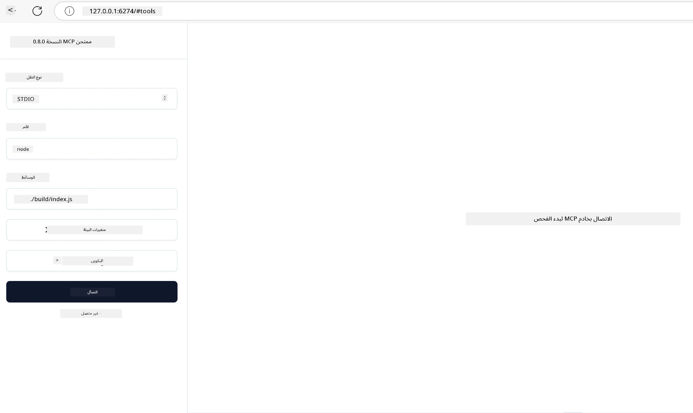

## الاختبار وتصحيح الأخطاء

قبل أن تبدأ في اختبار خادم MCP الخاص بك، من المهم فهم الأدوات المتاحة وأفضل الممارسات لتصحيح الأخطاء. يضمن الاختبار الفعال أن يعمل الخادم كما هو متوقع ويساعدك على تحديد المشكلات بسرعة وحلها. توضح القسم التالي الأساليب الموصى بها للتحقق من صحة تنفيذ MCP الخاص بك.

## نظرة عامة

تغطي هذه الدرس كيفية اختيار النهج الصحيح للاختبار وأداة الاختبار الأكثر فاعلية.

## أهداف التعلم

في نهاية هذا الدرس، ستكون قادرًا على:

- وصف الأساليب المختلفة للاختبار.
- استخدام أدوات مختلفة لاختبار الشفرة الخاصة بك بفعالية.


## اختبار خوادم MCP

يوفر MCP أدوات لمساعدتك في اختبار وتصحيح أخطاء خوادمك:

- **MCP Inspector**: أداة سطر أوامر يمكن تشغيلها كأداة CLI وأيضًا كأداة بصرية.
- **الاختبار اليدوي**: يمكنك استخدام أداة مثل curl لتنفيذ طلبات الويب، ولكن أي أداة قادرة على تشغيل HTTP يمكن استخدامها.
- **اختبار الوحدة**: من الممكن استخدام إطار الاختبار المفضل لديك لاختبار ميزات كل من الخادم والعميل.

### استخدام MCP Inspector

لقد وصفنا استخدام هذه الأداة في دروس سابقة، لكن دعونا نتحدث عنها قليلاً على مستوى عالٍ. هي أداة مبنية على Node.js ويمكنك استخدامها عن طريق استدعاء التنفيذية `npx` التي ستقوم بتنزيل وتثبيت الأداة مؤقتًا ثم تنظيف نفسها بعد الانتهاء من تنفيذ طلبك.

تساعدك [MCP Inspector](https://github.com/modelcontextprotocol/inspector) على:

- **اكتشاف قدرات الخادم**: الكشف تلقائيًا عن الموارد والأدوات والمطالبات المتاحة
- **اختبار تنفيذ الأداة**: تجربة معلمات مختلفة ورؤية الردود في الوقت الفعلي
- **عرض بيانات وصف الخادم**: فحص معلومات الخادم، المخططات، والتكوينات

يشبه تشغيل الأداة النموذجي ما يلي:

```bash
npx @modelcontextprotocol/inspector node build/index.js
```

يأمر الأمر أعلاه بتشغيل MCP وواجهته المرئية ويطلق واجهة ويب محلية في متصفحك. يمكنك توقع رؤية لوحة تحكم تعرض خوادم MCP المسجلة، الأدوات المتاحة، الموارد، والمطالبات. تتيح الواجهة اختبار تنفيذ الأداة تفاعليًا، فحص بيانات وصف الخادم، وعرض الردود في الوقت الفعلي، مما يسهل التحقق من صحة وتصحيح تنفيذات خادم MCP الخاص بك.

إليك كيف يمكن أن تبدو: 

يمكنك أيضًا تشغيل هذه الأداة في وضع CLI، حيث تضيف خاصية `--cli`. هنا مثال على تشغيل الأداة في وضع "CLI" الذي يعرض جميع الأدوات على الخادم:

```sh
npx @modelcontextprotocol/inspector --cli node build/index.js --method tools/list
```

### الاختبار اليدوي

بجانب تشغيل أداة المفتش لاختبار قدرات الخادم، هناك نهج مشابه وهو تشغيل عميل قادر على استخدام HTTP مثل curl على سبيل المثال.

باستخدام curl، يمكنك اختبار خوادم MCP مباشرة باستخدام طلبات HTTP:

```bash
# مثال: بيانات خادم الاختبار
curl http://localhost:3000/v1/metadata

# مثال: تنفيذ أداة
curl -X POST http://localhost:3000/v1/tools/execute \
  -H "Content-Type: application/json" \
  -d '{"name": "calculator", "parameters": {"expression": "2+2"}}'
```

كما ترى من الاستخدام أعلاه لـ curl، تستخدم طلب POST لاستدعاء أداة مع حمولة تتكون من اسم الأداة ومعلماتها. استخدم النهج الذي يناسبك. تميل أدوات CLI بشكل عام إلى أن تكون أسرع للاستخدام وتسمح بالتشغيل الآلي مما يمكن أن يكون مفيدًا في بيئة CI/CD.

### اختبار الوحدة

أنشئ اختبارات وحدة لأدواتك ومواردك لضمان عملها كما هو متوقع. إليك بعض كود الاختبار كمثال.

```python
import pytest

from mcp.server.fastmcp import FastMCP
from mcp.shared.memory import (
    create_connected_server_and_client_session as create_session,
)

# علامة على الوحدة بأكملها للاختبارات غير المتزامنة
pytestmark = pytest.mark.anyio


async def test_list_tools_cursor_parameter():
    """Test that the cursor parameter is accepted for list_tools.

    Note: FastMCP doesn't currently implement pagination, so this test
    only verifies that the cursor parameter is accepted by the client.
    """

 server = FastMCP("test")

    # إنشاء بعض أدوات الاختبار
    @server.tool(name="test_tool_1")
    async def test_tool_1() -> str:
        """First test tool"""
        return "Result 1"

    @server.tool(name="test_tool_2")
    async def test_tool_2() -> str:
        """Second test tool"""
        return "Result 2"

    async with create_session(server._mcp_server) as client_session:
        # اختبار بدون معامل المؤشر (تم حذفه)
        result1 = await client_session.list_tools()
        assert len(result1.tools) == 2

        # اختبار مع المؤشر = None
        result2 = await client_session.list_tools(cursor=None)
        assert len(result2.tools) == 2

        # اختبار مع المؤشر كنص
        result3 = await client_session.list_tools(cursor="some_cursor_value")
        assert len(result3.tools) == 2

        # اختبار مع مؤشر فارغ كنص
        result4 = await client_session.list_tools(cursor="")
        assert len(result4.tools) == 2
    
```

يقوم الكود السابق بما يلي:

- يستفيد من إطار عمل pytest الذي يتيح لك إنشاء اختبارات كدوال واستخدام عبارات assert.
- ينشئ خادم MCP مع أداتين مختلفتين.
- يستخدم عبارة `assert` للتحقق من تحقق شروط معينة.

ألقِ نظرة على [الملف الكامل هنا](https://github.com/modelcontextprotocol/python-sdk/blob/main/tests/client/test_list_methods_cursor.py)

بناءً على الملف أعلاه، يمكنك اختبار خادمك الخاص لضمان إنشاء القدرات كما هو متوقع.

تمتلك جميع SDKs الرئيسية أقسام اختبار مماثلة لذا يمكنك التكيف مع بيئة التشغيل التي تختارها.

## عينات

- [آلة حاسبة Java](../samples/java/calculator/README.md)
- [آلة حاسبة .Net](../../../../03-GettingStarted/samples/csharp)
- [آلة حاسبة JavaScript](../samples/javascript/README.md)
- [آلة حاسبة TypeScript](../samples/typescript/README.md)
- [آلة حاسبة Python](../../../../03-GettingStarted/samples/python) 

## موارد إضافية

- [Python SDK](https://github.com/modelcontextprotocol/python-sdk)

## ما هو التالي

- التالي: [النشر](../09-deployment/README.md)

---

<!-- CO-OP TRANSLATOR DISCLAIMER START -->
**تنويه**:
تمت ترجمة هذا المستند باستخدام خدمة الترجمة بالذكاء الاصطناعي [Co-op Translator](https://github.com/Azure/co-op-translator). بينما نسعى للدقة، يرجى العلم أن الترجمات الآلية قد تحتوي على أخطاء أو عدم دقة. يجب اعتبار المستند الأصلي بلغته الأصلية المصدر الرسمي والمعتمد. للمعلومات الهامة، يُنصح بالاستعانة بترجمة بشرية محترفة. نحن غير مسؤولين عن أي سوء فهم أو تفسير ناتج عن استخدام هذه الترجمة.
<!-- CO-OP TRANSLATOR DISCLAIMER END -->