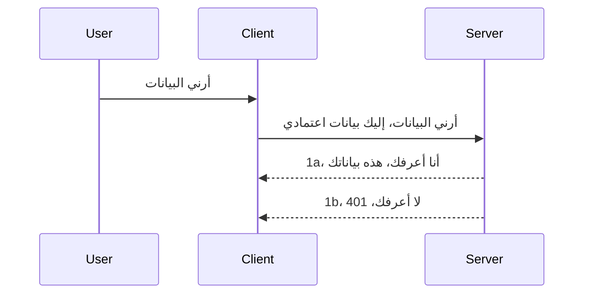

# توثيق بسيط

تدعم SDKs MCP استخدام OAuth 2.1 والذي، لنكون منصفين، هو عملية معقدة تتضمن مفاهيم مثل خادم التوثيق، خادم الموارد، إرسال بيانات الاعتماد، الحصول على رمز، استبدال الرمز برمز حامل حتى تتمكن أخيرًا من الحصول على بيانات المورد الخاصة بك. إذا لم تكن معتادًا على OAuth وهو أمر رائع للتطبيق، فمن الجيد أن تبدأ بمستوى أساسي من التوثيق ثم تبني لأمان أفضل وأفضل. لهذا السبب يوجد هذا الفصل، لبناء مستوى متقدم من التوثيق.

## التوثيق، ماذا نعني؟

التوثيق هو اختصار للمصادقة والتفويض. الفكرة هي أننا بحاجة إلى القيام بشيئين:

- **المصادقة**، وهي عملية معرفة ما إذا كنا نسمح لشخص بدخول منزلنا، أن لديه الحق في "التواجد هنا"، أي أن يكون لديه حق الوصول إلى خادم الموارد حيث توجد ميزات خادم MCP لدينا.
- **التفويض**، هو عملية معرفة ما إذا كان يجب أن يحصل المستخدم على حق الوصول إلى هذه الموارد المحددة التي يطلبها، على سبيل المثال هذه الطلبات أو هذه المنتجات أو ما إذا كان مسموحًا لهم بقراءة المحتوى ولكن ليس بحذفه كمثال آخر.

## بيانات الاعتماد: كيف نخبر النظام من نحن

حسنًا، معظم مطوري الويب هنا يبدأون بالتفكير في تقديم بيانات اعتماد إلى الخادم، عادةً سر يقول إذا كان مسموحًا لهم بالتواجد هنا "المصادقة". عادةً ما تكون هذه البيانات عبارة عن نسخة مشفرة بقاعدة 64 من اسم المستخدم وكلمة المرور أو مفتاح API يميز مستخدمًا محددًا.

يتضمن هذا إرسالها عبر رأس يسمى "Authorization" على النحو التالي:

```json
{ "Authorization": "secret123" }
```

هذا غالبًا ما يُشار إليه بالمصادقة الأساسية. كيف يعمل التدفق العام بعد ذلك هو على النحو التالي:


الآن بعد أن فهمنا كيف يعمل من وجهة نظر التدفق، كيف نطبقه؟ حسنًا، يحتوي معظم خوادم الويب على مفهوم يسمى middleware، وهو قطعة من الكود تعمل كجزء من الطلب يمكنها التحقق من بيانات الاعتماد، وإذا كانت البيانات صحيحة يمكنها السماح للطلب بالمرور. إذا لم يحتوي الطلب على بيانات اعتماد صحيحة فإنك تحصل على خطأ في المصادقة. دعونا نرى كيف يمكن تنفيذ هذا:

**بايثون**

```python
class AuthMiddleware(BaseHTTPMiddleware):
    async def dispatch(self, request, call_next):

        has_header = request.headers.get("Authorization")
        if not has_header:
            print("-> Missing Authorization header!")
            return Response(status_code=401, content="Unauthorized")

        if not valid_token(has_header):
            print("-> Invalid token!")
            return Response(status_code=403, content="Forbidden")

        print("Valid token, proceeding...")
       
        response = await call_next(request)
        # أضف أي رؤوس للعميل أو قم بتغيير الاستجابة بطريقة ما
        return response


starlette_app.add_middleware(CustomHeaderMiddleware)
```

هنا لدينا:

- أنشأنا middleware يسمى `AuthMiddleware` حيث يتم استدعاء طريقة `dispatch` الخاصة به بواسطة خادم الويب.
- أضفنا الـ middleware إلى خادم الويب:

    ```python
    starlette_app.add_middleware(AuthMiddleware)
    ```

- كتبنا منطق تحقق يتحقق مما إذا كان رأس Authorization موجودًا وإذا كان السر المرسل صالحًا:

    ```python
    has_header = request.headers.get("Authorization")
    if not has_header:
        print("-> Missing Authorization header!")
        return Response(status_code=401, content="Unauthorized")

    if not valid_token(has_header):
        print("-> Invalid token!")
        return Response(status_code=403, content="Forbidden")
    ```

    إذا كان السر موجودًا وصحيحًا فإننا نسمح للطلب بالمرور عن طريق استدعاء `call_next` وإرجاع الاستجابة.

    ```python
    response = await call_next(request)
    # أضف أي رؤوس مخصصة أو قم بتغيير الرد بطريقة ما
    return response
    ```

كيف يعمل هو أنه إذا تم إرسال طلب ويب نحو الخادم فسيتم استدعاء الـ middleware وبناءً على تنفيذه، إما أن يسمح للطلب بالمرور أو ينتهي بإرجاع خطأ يشير إلى أن العميل غير مسموح له المتابعة.

**TypeScript**

هنا ننشئ middleware باستخدام الإطار الشهير Express ونقطع الطلب قبل أن يصل إلى MCP Server. إليك الكود لذلك:

```typescript
function isValid(secret) {
    return secret === "secret123";
}

app.use((req, res, next) => {
    // 1. هل عنوان التفويض موجود؟
    if(!req.headers["Authorization"]) {
        res.status(401).send('Unauthorized');
    }
    
    let token = req.headers["Authorization"];

    // 2. تحقق من الصلاحية.
    if(!isValid(token)) {
        res.status(403).send('Forbidden');
    }

   
    console.log('Middleware executed');
    // 3. يمرر الطلب إلى الخطوة التالية في سلسلة معالجة الطلب.
    next();
});
```

في هذا الكود نحن:

1. نتحقق مما إذا كان رأس Authorization موجودًا في المقام الأول، إذا لم يكن موجودًا نرسل خطأ 401.
2. نضمن أن بيانات الاعتماد / الرمز صالح، إذا لم يكن كذلك نرسل خطأ 403.
3. أخيرًا يمرر الطلب في خط أنابيب الطلب ويعيد المورد المطلوب.

## تمرين: تنفيذ المصادقة

لنأخذ معرفتنا ونحاول تنفيذها. إليك الخطة:

الخادم

- إنشاء خادم ويب ونسخة MCP.
- تنفيذ middleware للخادم.

العميل

- إرسال طلب ويب، مع بيانات اعتماد، عبر الرأس.

### -1- إنشاء خادم ويب ونسخة MCP

في خطوتنا الأولى، نحتاج إلى إنشاء نسخة خادم ويب وخادم MCP.

**بايثون**

هنا ننشئ نسخة خادم MCP، ننشئ تطبيق ويب starlette ونستضيفه باستخدام uvicorn.

```python
# إنشاء خادم MCP

app = FastMCP(
    name="MCP Resource Server",
    instructions="Resource Server that validates tokens via Authorization Server introspection",
    host=settings["host"],
    port=settings["port"],
    debug=True
)

# إنشاء تطبيق ويب starlette
starlette_app = app.streamable_http_app()

# تقديم التطبيق عبر uvicorn
async def run(starlette_app):
    import uvicorn
    config = uvicorn.Config(
            starlette_app,
            host=app.settings.host,
            port=app.settings.port,
            log_level=app.settings.log_level.lower(),
        )
    server = uvicorn.Server(config)
    await server.serve()

run(starlette_app)
```

في هذا الرمز نحن:

- ننشئ خادم MCP.
- نبني تطبيق الويب starlette من خادم MCP، `app.streamable_http_app()`.
- نستضيف تطبيق الويب ونخدمه باستخدام uvicorn `server.serve()`.

**TypeScript**

هنا ننشئ نسخة MCP Server.

```typescript
const server = new McpServer({
      name: "example-server",
      version: "1.0.0"
    });

    // ... إعداد موارد الخادم والأدوات والتعليمات ...
```

يجب أن يحدث إنشاء خادم MCP هذا داخل تعريف المسار POST /mcp، لذا دعنا نأخذ الكود أعلاه ونقله كما يلي:

```typescript
import express from "express";
import { randomUUID } from "node:crypto";
import { McpServer } from "@modelcontextprotocol/sdk/server/mcp.js";
import { StreamableHTTPServerTransport } from "@modelcontextprotocol/sdk/server/streamableHttp.js";
import { isInitializeRequest } from "@modelcontextprotocol/sdk/types.js"

const app = express();
app.use(express.json());

// خريطة لتخزين وسائل النقل بواسطة معرف الجلسة
const transports: { [sessionId: string]: StreamableHTTPServerTransport } = {};

// التعامل مع طلبات POST للتواصل من العميل إلى الخادم
app.post('/mcp', async (req, res) => {
  // التحقق من وجود معرف جلسة حالي
  const sessionId = req.headers['mcp-session-id'] as string | undefined;
  let transport: StreamableHTTPServerTransport;

  if (sessionId && transports[sessionId]) {
    // إعادة استخدام وسائل النقل الموجودة
    transport = transports[sessionId];
  } else if (!sessionId && isInitializeRequest(req.body)) {
    // طلب تهيئة جديد
    transport = new StreamableHTTPServerTransport({
      sessionIdGenerator: () => randomUUID(),
      onsessioninitialized: (sessionId) => {
        // تخزين وسائل النقل بواسطة معرف الجلسة
        transports[sessionId] = transport;
      },
      // تم تعطيل حماية إعادة ربط DNS افتراضيًا للتوافق مع الإصدارات السابقة. إذا كنت تقوم بتشغيل هذا الخادم
      // محليًا، تأكد من تعيين:
      // enableDnsRebindingProtection: true,
      // allowedHosts: ['127.0.0.1'],
    });

    // تنظيف وسائل النقل عند الإغلاق
    transport.onclose = () => {
      if (transport.sessionId) {
        delete transports[transport.sessionId];
      }
    };
    const server = new McpServer({
      name: "example-server",
      version: "1.0.0"
    });

    // ... إعداد موارد الخادم، الأدوات، والتعليمات ...

    // الاتصال بخادم MCP
    await server.connect(transport);
  } else {
    // طلب غير صالح
    res.status(400).json({
      jsonrpc: '2.0',
      error: {
        code: -32000,
        message: 'Bad Request: No valid session ID provided',
      },
      id: null,
    });
    return;
  }

  // معالجة الطلب
  await transport.handleRequest(req, res, req.body);
});

// معالج قابل لإعادة الاستخدام لطلبات GET و DELETE
const handleSessionRequest = async (req: express.Request, res: express.Response) => {
  const sessionId = req.headers['mcp-session-id'] as string | undefined;
  if (!sessionId || !transports[sessionId]) {
    res.status(400).send('Invalid or missing session ID');
    return;
  }
  
  const transport = transports[sessionId];
  await transport.handleRequest(req, res);
};

// معالجة طلبات GET للإشعارات من الخادم إلى العميل عبر SSE
app.get('/mcp', handleSessionRequest);

// التعامل مع طلبات DELETE لإنهاء الجلسة
app.delete('/mcp', handleSessionRequest);

app.listen(3000);
```

الآن ترى كيف تم نقل إنشاء MCP Server داخل `app.post("/mcp")`.

لنتقدم إلى الخطوة التالية لإنشاء middleware حتى نتمكن من التحقق من بيانات الاعتماد الواردة.

### -2- تنفيذ middleware للخادم

لننتقل إلى جزء middleware بعد ذلك. هنا سننشئ middleware يبحث عن بيانات اعتماد في رأس `Authorization` ويتحقق من صحتها. إذا كانت مقبولة فإن الطلب سيتابع القيام بما يحتاج إليه (على سبيل المثال، سرد الأدوات، قراءة مورد أو أي وظيفة MCP يطلبها العميل).

**بايثون**

لإنشاء middleware، نحتاج إلى إنشاء فئة ترث من `BaseHTTPMiddleware`. هناك جزءان مثيران للاهتمام:

- طلب `request`، الذي نقرأ منه معلومات الرأس.
- `call_next` هو رد النداء الذي نحتاج لاستدعائه إذا قدم العميل بيانات اعتماد نقبلها.

أولًا، نحتاج إلى معالجة الحالة إذا كان رأس `Authorization` مفقودًا:

```python
has_header = request.headers.get("Authorization")

# لا يوجد رأس، فشل مع 401، وإلا استمر.
if not has_header:
    print("-> Missing Authorization header!")
    return Response(status_code=401, content="Unauthorized")
```

هنا نرسل رسالة 401 غير مُصرح بها لأن العميل يفشل في المصادقة.

بعد ذلك، إذا تم تقديم بيانات اعتماد، نحتاج إلى التحقق من صلاحيتها كما يلي:

```python
 if not valid_token(has_header):
    print("-> Invalid token!")
    return Response(status_code=403, content="Forbidden")
```

لاحظ كيف نرسل رسالة 403 ممنوع أعلاه. دعنا نرى الـ middleware الكامل أدناه الذي ينفذ كل ما ذكرناه أعلاه:

```python
class AuthMiddleware(BaseHTTPMiddleware):
    async def dispatch(self, request, call_next):

        has_header = request.headers.get("Authorization")
        if not has_header:
            print("-> Missing Authorization header!")
            return Response(status_code=401, content="Unauthorized")

        if not valid_token(has_header):
            print("-> Invalid token!")
            return Response(status_code=403, content="Forbidden")

        print("Valid token, proceeding...")
        print(f"-> Received {request.method} {request.url}")
        response = await call_next(request)
        response.headers['Custom'] = 'Example'
        return response

```

رائع، ولكن ماذا عن دالة `valid_token`؟ ها هي أدناه:

```python
# لا تستخدم للإنتاج - حسّنه !!
def valid_token(token: str) -> bool:
    # إزالة بادئة "Bearer "
    if token.startswith("Bearer "):
        token = token[7:]
        return token == "secret-token"
    return False
```

من الواضح أن هذا يحتاج للتحسين.

هام: يجب ألا تحتفظ أبدًا بأسرار مثل هذه في الكود. من المثالي أن تسترد القيمة للمقارنة من مصدر بيانات أو من مزود خدمة هوية (IDP) أو أفضل، دع مزود الهوية يقوم بالتحقق.

**TypeScript**

لتنفيذ هذا مع Express، نحتاج إلى استدعاء طريقة `use` التي تأخذ دوال middleware.

نحتاج إلى:

- التفاعل مع متغير الطلب للتحقق من بيانات الاعتماد المرسلة في خاصية `Authorization`.
- التحقق من صحة بيانات الاعتماد، وإذا كانت صحيحة دع الطلب يستمر وتؤدي طلب MCP الخاص بالعميل ما ينبغي (مثل سرد الأدوات، قراءة مورد أو أي شيء متعلق بـ MCP).

هنا، نتحقق إذا كان رأس `Authorization` موجودًا، وإذا لم يكن كذلك، نوقف الطلب من المرور:

```typescript
if(!req.headers["authorization"]) {
    res.status(401).send('Unauthorized');
    return;
}
```

إذا لم يُرسل الرأس في المقام الأول، تحصل على 401.

بعد ذلك، نتحقق من صحة بيانات الاعتماد، وإذا لم تكن صحيحة نوقف الطلب مرة أخرى ولكن برسالة مختلفة قليلاً:

```typescript
if(!isValid(token)) {
    res.status(403).send('Forbidden');
    return;
} 
```

لاحظ كيف تحصل الآن على خطأ 403.

إليك الكود الكامل:

```typescript
app.use((req, res, next) => {
    console.log('Request received:', req.method, req.url, req.headers);
    console.log('Headers:', req.headers["authorization"]);
    if(!req.headers["authorization"]) {
        res.status(401).send('Unauthorized');
        return;
    }
    
    let token = req.headers["authorization"];

    if(!isValid(token)) {
        res.status(403).send('Forbidden');
        return;
    }  

    console.log('Middleware executed');
    next();
});
```

لقد أعددنا خادم الويب ليقبل middleware للتحقق من بيانات الاعتماد التي يُفترض أن يرسلها العميل. ماذا عن العميل نفسه؟

### -3- إرسال طلب ويب مع بيانات اعتماد عبر الرأس

نحتاج إلى التأكد من أن العميل يمرر بيانات الاعتماد عبر الرأس. بما أننا سنستخدم عميل MCP للقيام بذلك، نحتاج إلى معرفة كيفية القيام بذلك.

**بايثون**

بالنسبة للعميل، نحتاج إلى تمرير رأس به بيانات اعتمادنا كالتالي:

```python
# لا تقم بتثبيت القيمة بشكل ثابت، احتفظ بها على الأقل في متغير بيئي أو في تخزين أكثر أمانًا
token = "secret-token"

async with streamablehttp_client(
        url = f"http://localhost:{port}/mcp",
        headers = {"Authorization": f"Bearer {token}"}
    ) as (
        read_stream,
        write_stream,
        session_callback,
    ):
        async with ClientSession(
            read_stream,
            write_stream
        ) as session:
            await session.initialize()
      
            # TODO، ما الذي تريد القيام به في العميل، مثل سرد الأدوات، استدعاء الأدوات، إلخ.
```

لاحظ كيف نملأ خاصية `headers` هكذا ` headers = {"Authorization": f"Bearer {token}"}`.

**TypeScript**

يمكننا حل هذا بخطوتين:

1. ملء كائن التهيئة ببيانات الاعتماد.
2. تمرير كائن التهيئة إلى الناقل.

```typescript

// لا تقم بترميز القيمة مباشرة كما هو موضح هنا. كحد أدنى، اجعلها متغيرة بيئية واستخدم شيئًا مثل dotenv (في وضع التطوير).
let token = "secret123"

// تعريف كائن خيارات نقل العميل
let options: StreamableHTTPClientTransportOptions = {
  sessionId: sessionId,
  requestInit: {
    headers: {
      "Authorization": "secret123"
    }
  }
};

// تمرير كائن الخيارات إلى النقل
async function main() {
   const transport = new StreamableHTTPClientTransport(
      new URL(serverUrl),
      options
   );
```

هنا ترى كيف اضطررنا لخلق كائن `options` ووضع رؤوسنا ضمن خاصية `requestInit`.

هام: كيف نحسنها من هنا؟ حسنًا، التنفيذ الحالي يحتوي على بعض المشاكل. أولًا، تمرير بيانات اعتماد هكذا محفوف بالمخاطر إلا إذا كان لديك على الأقل HTTPS. حتى مع ذلك، يمكن سرقة بيانات الاعتماد لذا تحتاج إلى نظام يمكنك من خلاله بسهولة إلغاء صلاحية الرمز وإضافة التحقق الإضافي مثل من أين يأتي الطلب، هل الطلب يحدث كثيرًا (مثل بوت)، باختصار، هناك مجموعة كاملة من المخاوف.

يجب القول، مع ذلك، أن هذا لأنظمة API بسيطة جدًا حيث لا تريد أن يطلب أحد API الخاص بك دون تسجيل دخول وهذا ما نملكه هنا بداية جيدة.

مع ذلك، دعنا نحاول تعزيز الأمان قليلًا باستخدام تنسيق معياري مثل JSON Web Token، المعروف أيضًا بـ JWT أو رموز "JOT".

## رموز الويب JSON، JWT

نحن نحاول تحسين الأمور من إرسال بيانات اعتماد بسيطة جدًا. ما هي التحسينات الفورية التي نحصل عليها عند اعتماد JWT؟

- **تحسينات الأمان**. في المصادقة الأساسية، ترسل اسم المستخدم وكلمة المرور مرارًا وتكرارًا كرمز مشفر بقاعدة 64 (أو ترسل مفتاح API) مما يزيد الخطر. مع JWT، ترسل اسم المستخدم وكلمة المرور وتحصل على رمز في المقابل كما أنه مرتبط بزمن يعني أنه سينتهي. يسمح JWT بسهولة باستخدام التحكم الدقيق في الوصول باستخدام الأدوار والنطاقات والصلاحيات.
- **اللامركزية وقابلية التوسع**. JWTs تحتوي على جميع معلومات المستخدم وتلغي الحاجة لتخزين جلسة على الجانب الخادم. يمكن التحقق من صلاحية التوكن محليًا.
- **التشغيل المتداخل والاتحادية**. JWT هو مركز Open ID Connect ويُستخدم مع مزودي هوية معروفين مثل Entra ID و Google Identity و Auth0. كما أنه يجعل من الممكن استخدام تسجيل الدخول الموحد والمزيد مما يجعله بمستوى المؤسسات.
- **المرونة والتنظيم**. يمكن أيضًا استخدام JWTs مع بوابات API مثل Azure API Management و NGINX والمزيد. كما يدعم سيناريوهات المصادقة والاتصالات بين الخادم والخدمة بما في ذلك التقمص والتفويض.
- **الأداء والتخزين المؤقت**. يمكن تخزين JWTs مؤقتًا بعد فك التشفير مما يقلل الحاجة إلى التحليل. هذا يساعد خصوصًا مع التطبيقات ذات المرور العالي لأنه يحسن throughput ويقلل الحمل على البنية التحتية المختارة.
- **ميزات متقدمة**. يدعم أيضًا التدقيق (التحقق من الصلاحية على الخادم) والإلغاء (جعل التوكن غير صالح).

مع كل هذه الفوائد، دعنا نرى كيف يمكننا رفع مستوى تطبيقنا إلى المستوى التالي.

## تحويل المصادقة الأساسية إلى JWT

التغييرات التي نحتاج إلى إجرائها على مستوى عالٍ هي:

- **تعلم إنشاء توكن JWT** وتجهيزه للإرسال من العميل إلى الخادم.
- **التحقق من صحة توكن JWT**، وإذا كان صالحًا، السماح للعميل بالوصول إلى مواردنا.
- **تخزين التوكن بأمان**. كيف نخزن هذا التوكن.
- **حماية المسارات**. نحتاج إلى حماية المسارات، في حالتنا، نحتاج إلى حماية المسارات وميزات MCP محددة.
- **إضافة توكنات تحديث**. التأكد من إنشاء توكنات قصيرة الأجل ولكن مع توكنات تحديث طويلة الأجل يمكن استخدامها للحصول على توكنات جديدة إذا انتهت صلاحيتها. وكذلك التأكد من وجود نقطة نهاية للتحديث واستراتيجية التدوير.

### -1- إنشاء توكن JWT

أولًا، يتكون توكن JWT من الأجزاء التالية:

- **الرأس**، الخوارزمية المستخدمة ونوع التوكن.
- **المحمول**، المطالبات، مثل sub (المستخدم أو الكيان الذي يرمز له التوكن. في سيناريو المصادقة عادةً هو معرف المستخدم)، exp (وقت الانتهاء)، role (الدور)
- **التوقيع**، موقع باستخدام سر أو مفتاح خاص.

لهذا، سنحتاج إلى بناء الرأس، المحمول، والتوكن المشفر.

**بايثون**

```python

import jwt
import jwt
from jwt.exceptions import ExpiredSignatureError, InvalidTokenError
import datetime

# المفتاح السري المستخدم لتوقيع JWT
secret_key = 'your-secret-key'

header = {
    "alg": "HS256",
    "typ": "JWT"
}

# معلومات المستخدم وادعاءاته ووقت انتهاء الصلاحية
payload = {
    "sub": "1234567890",               # الموضوع (معرف المستخدم)
    "name": "User Userson",                # ادعاء مخصص
    "admin": True,                     # ادعاء مخصص
    "iat": datetime.datetime.utcnow(),# تاريخ الإصدار
    "exp": datetime.datetime.utcnow() + datetime.timedelta(hours=1)  # تاريخ الانتهاء
}

# ترميزه
encoded_jwt = jwt.encode(payload, secret_key, algorithm="HS256", headers=header)
```

في الكود أعلاه قمنا بـ:

- تعريف رأس باستخدام HS256 كخوارزمية والنوع ليكون JWT.
- بناء الحمولة التي تحتوي على موضوع أو معرف المستخدم، اسم المستخدم، الدور، وقت الإصدار ووقت انتهاء الصلاحية، وبالتالي تنفيذ جانب الوقت المرتبط الذي ذكرناه سابقًا.

**TypeScript**

هنا سنحتاج إلى بعض التبعيات التي تساعدنا في بناء توكن JWT.

التبعيات

```sh

npm install jsonwebtoken
npm install --save-dev @types/jsonwebtoken
```

الآن بعد أن أصبح ذلك جاهزًا، دعنا ننشئ الرأس، الحمولة ومن خلالها ننشئ التوكن المشفر.

```typescript
import jwt from 'jsonwebtoken';

const secretKey = 'your-secret-key'; // استخدم متغيرات البيئة في الإنتاج

// تعيين الحمولة
const payload = {
  sub: '1234567890',
  name: 'User usersson',
  admin: true,
  iat: Math.floor(Date.now() / 1000), // وقت الإصدار
  exp: Math.floor(Date.now() / 1000) + 60 * 60 // ينتهي خلال ساعة واحدة
};

// تعيين الرأس (اختياري، jsonwebtoken يحدد القيم الافتراضية)
const header = {
  alg: 'HS256',
  typ: 'JWT'
};

// إنشاء الرمز المميز
const token = jwt.sign(payload, secretKey, {
  algorithm: 'HS256',
  header: header
});

console.log('JWT:', token);
```

هذا التوكن:

موقع باستخدام HS256  
صالح لمدة ساعة واحدة  
يحتوي على مطالبات مثل sub، name، admin، iat، و exp.

### -2- التحقق من التوكن

سنحتاج أيضًا إلى التحقق من التوكن، وهذا شيء يجب أن نقوم به على الخادم لضمان أن ما يرسله العميل هو فعلاً صالح. هناك العديد من الفحوصات التي يجب إجراؤها هنا من التحقق من هيكل التوكن إلى صلاحيته. يُشجع أيضًا على إضافة فحوصات أخرى لرؤية ما إذا كان المستخدم موجودًا في نظامك وضمان أن لديه الحقوق التي يدعيها.

للتحقق من التوكن، نحتاج إلى فك تشفيره حتى نتمكن من قراءته ثم نبدأ في التحقق من صلاحيته:

**بايثون**

```python

# فك وترميز JWT والتحقق منه
try:
    decoded = jwt.decode(token, secret_key, algorithms=["HS256"])
    print("✅ Token is valid.")
    print("Decoded claims:")
    for key, value in decoded.items():
        print(f"  {key}: {value}")
except ExpiredSignatureError:
    print("❌ Token has expired.")
except InvalidTokenError as e:
    print(f"❌ Invalid token: {e}")

```

في هذا الكود، نستدعي `jwt.decode` باستخدام التوكن، المفتاح السري والخوارزمية المختارة كمدخلات. لاحظ كيف نستخدم بناء try-catch لأن فشل التحقق يؤدي إلى رفع خطأ.

**TypeScript**

هنا نحتاج إلى استدعاء `jwt.verify` للحصول على نسخة مفكوكة من التوكن يمكننا تحليلها أكثر. إذا فشل هذا الاستدعاء، فهذا يعني أن هيكل التوكن غير صحيح أو لم يعد صالحًا.

```typescript

try {
  const decoded = jwt.verify(token, secretKey);
  console.log('Decoded Payload:', decoded);
} catch (err) {
  console.error('Token verification failed:', err);
}
```

ملاحظة: كما ذكرنا سابقًا، يجب إجراء فحوصات إضافية لضمان أن هذا التوكن يشير إلى مستخدم في نظامنا والتأكد من أن للمستخدم الحقوق التي يدعيها.

بعد ذلك، دعنا نلقي نظرة على التحكم في الوصول القائم على الأدوار، المعروف أيضًا باسم RBAC.
## إضافة التحكم في الوصول بناءً على الدور

الفكرة هي أننا نريد التعبير عن أن الأدوار المختلفة لها أذونات مختلفة. على سبيل المثال، نفترض أن المسؤول يمكنه القيام بكل شيء، وأن المستخدمين العاديين يمكنهم القراءة/الكتابة، وأن الضيف يمكنه فقط القراءة. بناءً عليه، هنا بعض مستويات الأذونات المحتملة:

- Admin.Write
- User.Read
- Guest.Read

دعونا ننظر كيف يمكننا تنفيذ مثل هذا التحكم باستخدام الميدلوير. يمكن إضافة الميدلوير لكل مسار وكذلك لجميع المسارات.

**بايثون**

```python
from starlette.middleware.base import BaseHTTPMiddleware
from starlette.responses import JSONResponse
import jwt

# لا تحفظ السر في الكود مثل هذا، هذا للعرض فقط. اقرأه من مكان آمن.
SECRET_KEY = "your-secret-key" # ضع هذا في متغير البيئة
REQUIRED_PERMISSION = "User.Read"

class JWTPermissionMiddleware(BaseHTTPMiddleware):
    async def dispatch(self, request, call_next):
        auth_header = request.headers.get("Authorization")
        if not auth_header or not auth_header.startswith("Bearer "):
            return JSONResponse({"error": "Missing or invalid Authorization header"}, status_code=401)

        token = auth_header.split(" ")[1]
        try:
            decoded = jwt.decode(token, SECRET_KEY, algorithms=["HS256"])
        except jwt.ExpiredSignatureError:
            return JSONResponse({"error": "Token expired"}, status_code=401)
        except jwt.InvalidTokenError:
            return JSONResponse({"error": "Invalid token"}, status_code=401)

        permissions = decoded.get("permissions", [])
        if REQUIRED_PERMISSION not in permissions:
            return JSONResponse({"error": "Permission denied"}, status_code=403)

        request.state.user = decoded
        return await call_next(request)


```

هناك عدة طرق مختلفة لإضافة الميدلوير كما في المثال أدناه:

```python

# البديل 1: إضافة وسيط أثناء بناء تطبيق ستارليت
middleware = [
    Middleware(JWTPermissionMiddleware)
]

app = Starlette(routes=routes, middleware=middleware)

# البديل 2: إضافة وسيط بعد أن يتم بناء تطبيق ستارليت
starlette_app.add_middleware(JWTPermissionMiddleware)

# البديل 3: إضافة وسيط لكل مسار
routes = [
    Route(
        "/mcp",
        endpoint=..., # المعالج
        middleware=[Middleware(JWTPermissionMiddleware)]
    )
]
```

**تايب سكريبت**

يمكننا استخدام `app.use` وميدلوير سيتم تشغيله لكل الطلبات.

```typescript
app.use((req, res, next) => {
    console.log('Request received:', req.method, req.url, req.headers);
    console.log('Headers:', req.headers["authorization"]);

    // 1. التحقق من إرسال رأس التفويض

    if(!req.headers["authorization"]) {
        res.status(401).send('Unauthorized');
        return;
    }
    
    let token = req.headers["authorization"];

    // 2. التحقق من صحة الرمز
    if(!isValid(token)) {
        res.status(403).send('Forbidden');
        return;
    }  

    // 3. التحقق من وجود مستخدم الرمز في نظامنا
    if(!isExistingUser(token)) {
        res.status(403).send('Forbidden');
        console.log("User does not exist");
        return;
    }
    console.log("User exists");

    // 4. التحقق من أن للرمز الأذونات الصحيحة
    if(!hasScopes(token, ["User.Read"])){
        res.status(403).send('Forbidden - insufficient scopes');
    }

    console.log("User has required scopes");

    console.log('Middleware executed');
    next();
});

```

هناك عدة أشياء يمكننا السماح لميدلويرنا بالقيام بها والتي يجب عليه القيام بها، وهي:

1. تحقق مما إذا كان رأس التفويض موجودًا
2. تحقق مما إذا كان الـ token صالحًا، نسمي `isValid` وهي طريقة كتبناها للتحقق من سلامة وصحة رمز JWT.
3. تحقق من أن المستخدم موجود في نظامنا، يجب علينا التحقق من ذلك.

   ```typescript
    // المستخدمون في قاعدة البيانات
   const users = [
     "user1",
     "User usersson",
   ]

   function isExistingUser(token) {
     let decodedToken = verifyToken(token);

     // مهمة للقيام بها، تحقق مما إذا كان المستخدم موجودًا في قاعدة البيانات
     return users.includes(decodedToken?.name || "");
   }
   ```

في الأعلى، أنشأنا قائمة `users` بسيطة جدًا، والتي من المفترض أن تكون في قاعدة بيانات بالطبع.

4. بالإضافة إلى ذلك، يجب علينا أيضًا التحقق من أن الـ token يحتوي على الأذونات الصحيحة.

   ```typescript
   if(!hasScopes(token, ["User.Read"])){
        res.status(403).send('Forbidden - insufficient scopes');
   }
   ```

في هذا الكود أعلاه في الميدلوير، نتحقق من أن الـ token يحتوي على إذن User.Read، وإذا لم يكن كذلك نرسل خطأ 403. أدناه هي طريقة المساعدة `hasScopes`.

   ```typescript
   function hasScopes(scope: string, requiredScopes: string[]) {
     let decodedToken = verifyToken(scope);
    return requiredScopes.every(scope => decodedToken?.scopes.includes(scope));
  }
   ```

Have a think which additional checks you should be doing, but these are the absolute minimum of checks you should be doing.

Using Express as a web framework is a common choice. There are helpers library when you use JWT so you can write less code.

- `express-jwt`, helper library that provides a middleware that helps decode your token.
- `express-jwt-permissions`, this provides a middleware `guard` that helps check if a certain permission is on the token.

Here's what these libraries can look like when used:

```typescript
const express = require('express');
const jwt = require('express-jwt');
const guard = require('express-jwt-permissions')();

const app = express();
const secretKey = 'your-secret-key'; // put this in env variable

// Decode JWT and attach to req.user
app.use(jwt({ secret: secretKey, algorithms: ['HS256'] }));

// Check for User.Read permission
app.use(guard.check('User.Read'));

// multiple permissions
// app.use(guard.check(['User.Read', 'Admin.Access']));

app.get('/protected', (req, res) => {
  res.json({ message: `Welcome ${req.user.name}` });
});

// Error handler
app.use((err, req, res, next) => {
  if (err.code === 'permission_denied') {
    return res.status(403).send('Forbidden');
  }
  next(err);
});

```

الآن بعد أن رأيت كيف يمكن استخدام الميدلوير لكل من التوثيق والتفويض، ماذا عن MCP؟ هل يغير كيف نقوم بعملية المصادقة؟ دعونا نكتشف ذلك في القسم التالي.

### -3- إضافة RBAC إلى MCP

لقد رأيت حتى الآن كيف يمكنك إضافة RBAC عبر الميدلوير، ولكن بالنسبة لـ MCP، لا توجد طريقة سهلة لإضافة RBAC لكل ميزة MCP، فماذا نفعل؟ حسناً، علينا فقط إضافة كود مثل هذا الذي يتحقق في هذه الحالة مما إذا كان العميل لديه الحقوق لاستدعاء أداة معينة:

لديك خيارات مختلفة لكيفية تنفيذ RBAC لكل ميزة، إليك بعضها:

- إضافة تحقق لكل أداة، مورد، أو مطالبة حيث تحتاج إلى التحقق من مستوى الإذن.

   **بايثون**

   ```python
   @tool()
   def delete_product(id: int):
      try:
          check_permissions(role="Admin.Write", request)
      catch:
        pass # فشل العميل في التفويض، ارفع خطأ التفويض
   ```

   **تايب سكريبت**

   ```typescript
   server.registerTool(
    "delete-product",
    {
      title: Delete a product",
      description: "Deletes a product",
      inputSchema: { id: z.number() }
    },
    async ({ id }) => {
      
      try {
        checkPermissions("Admin.Write", request);
        // يجب القيام به، إرسال المعرف إلى productService و remote entry
      } catch(Exception e) {
        console.log("Authorization error, you're not allowed");  
      }

      return {
        content: [{ type: "text", text: `Deletected product with id ${id}` }]
      };
    }
   );
   ```


- استخدام نهج متقدم للخادم ومعالجات الطلبات بحيث تقلل من الأماكن التي تحتاج فيها لإجراء التحقق.

   **بايثون**

   ```python
   
   tool_permission = {
      "create_product": ["User.Write", "Admin.Write"],
      "delete_product": ["Admin.Write"]
   }

   def has_permission(user_permissions, required_permissions) -> bool:
      # أذونات_المستخدم: قائمة الأذونات التي يمتلكها المستخدم
      # الأذونات_المطلوبة: قائمة الأذونات المطلوبة للأداة
      return any(perm in user_permissions for perm in required_permissions)

   @server.call_tool()
   async def handle_call_tool(
     name: str, arguments: dict[str, str] | None
   ) -> list[types.TextContent]:
    # افترض أن request.user.permissions هي قائمة الأذونات الخاصة بالمستخدم
     user_permissions = request.user.permissions
     required_permissions = tool_permission.get(name, [])
     if not has_permission(user_permissions, required_permissions):
        # ارفع خطأ "ليس لديك إذن لاستدعاء الأداة {name}"
        raise Exception(f"You don't have permission to call tool {name}")
     # استمر واستدع الأداة
     # ...
   ```   
   

   **تايب سكريبت**

   ```typescript
   function hasPermission(userPermissions: string[], requiredPermissions: string[]): boolean {
       if (!Array.isArray(userPermissions) || !Array.isArray(requiredPermissions)) return false;
       // يُرجع صحيح إذا كان لدى المستخدم إذن واحد على الأقل مطلوب
       
       return requiredPermissions.some(perm => userPermissions.includes(perm));
   }
  
   server.setRequestHandler(CallToolRequestSchema, async (request) => {
      const { params: { name } } = request;
  
      let permissions = request.user.permissions;
  
      if (!hasPermission(permissions, toolPermissions[name])) {
         return new Error(`You don't have permission to call ${name}`);
      }
  
      // استمر..
   });
   ```

ملحوظة، ستحتاج إلى التأكد من أن ميدلويرك يعين رمزاً مفككاً (decoded token) إلى خاصية user في الطلب بحيث يبسط الكود أعلاه.

### الخلاصة

الآن بعد أن ناقشنا كيفية إضافة دعم RBAC بشكل عام ولـ MCP بشكل خاص، حان الوقت لتجربة تنفيذ الأمان بنفسك لضمان فهمك للمفاهيم التي قدمت لك.

## التمرين 1: بناء خادم MCP وعميل MCP باستخدام المصادقة الأساسية

هنا ستأخذ ما تعلمته بالنسبة لإرسال بيانات الاعتماد عبر رؤوس الطلب.

## الحل 1

[الحل 1](./code/basic/README.md)

## التمرين 2: ترقية الحل من التمرين 1 لاستخدام JWT

خذ الحل الأول، ولكن هذه المرة، دعنا نحسن عليه.

بدلاً من استخدام المصادقة الأساسية، دعنا نستخدم JWT.

## الحل 2

[الحل 2](./solution/jwt-solution/README.md)

## التحدي

أضف RBAC لكل أداة كما وصفنا في القسم "إضافة RBAC إلى MCP".

## الملخص

نأمل أنك تعلمت الكثير في هذا الفصل، من عدم وجود أمان على الإطلاق، إلى الأمان الأساسي، إلى JWT وكيف يمكن إضافته إلى MCP.

لقد بنينا أساسًا متينًا باستخدام JWT المخصصة، ولكن مع التوسع، نتجه نحو نموذج هوية قائم على المعايير. استخدام مقدم هوية مثل Entra أو Keycloak يتيح لنا تفويض إصدار التوكن والتحقق وإدارة دورة الحياة إلى منصة موثوقة — مما يحررنا للتركيز على منطق التطبيق وتجربة المستخدم.

لذلك، لدينا فصل أكثر [تقدمًا عن Entra](../../05-AdvancedTopics/mcp-security-entra/README.md)

## ما هو القادم

- التالي: [إعداد مضيفي MCP](../12-mcp-hosts/README.md)

---

<!-- CO-OP TRANSLATOR DISCLAIMER START -->
**إخلاء المسؤولية**:
تمت ترجمة هذا المستند باستخدام خدمة الترجمة الآلية [Co-op Translator](https://github.com/Azure/co-op-translator). بينما نسعى لتحقيق الدقة، يرجى العلم أن الترجمات الآلية قد تحتوي على أخطاء أو عدم دقة. ينبغي اعتبار المستند الأصلي بلغته الأصلية المصدر المعتمد. بالنسبة للمعلومات الحيوية، يُنصح بالترجمة الاحترافية البشرية. نحن غير مسؤولين عن أي سوء فهم أو تفسيرات خاطئة تنشأ عن استخدام هذه الترجمة.
<!-- CO-OP TRANSLATOR DISCLAIMER END -->