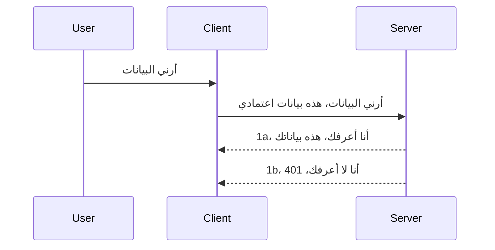

# المصادقة البسيطة

تدعم مجموعات تطوير برامج MCP استخدام OAuth 2.1 والذي ليكن من العدل القول إنه عملية معقدة تتضمن مفاهيم مثل خادم المصادقة، خادم الموارد، إرسال بيانات الاعتماد، الحصول على رمز، استبدال الرمز برمز حامل حتى تتمكن أخيرًا من الحصول على بيانات المورد الخاصة بك. إذا لم تكن معتادًا على OAuth والذي هو أمر رائع للتنفيذ، فمن الجيد أن تبدأ بمستوى أساسي من المصادقة وتبني وصولًا إلى أمان أفضل وأفضل. لهذا السبب توجد هذه الفصلة، لبناء فهمك للمصادقة المتقدمة.

## المصادقة، ماذا نعني؟

المصادقة مختصرة من المصادقة والتفويض. الفكرة هي أننا نحتاج إلى فعل شيئين:

- **المصادقة**، وهي عملية معرفة ما إذا كنا نسمح لشخص بالدخول إلى بيتنا، بأن لديه الحق في أن "يكون هنا"، أي أن يكون لديه وصول إلى خادم الموارد حيث تعيش ميزات MCP Server الخاصة بنا.
- **التفويض**، هي عملية معرفة إذا كان المستخدم يجب أن يكون لديه وصول إلى هذه الموارد المحددة التي يطلبها، على سبيل المثال هذه الطلبات أو هذه المنتجات أو إذا كان مسموحًا له بقراءة المحتوى ولكن ليس الحذف كمثال آخر.

## بيانات الاعتماد: كيف نخبر النظام من نحن

حسنًا، معظم مطوري الويب يفكرون عادةً في توفير بيانات اعتماد للخادم، عادةً سر يقول إذا كان مسموح لهم أن يكونوا هنا "المصادقة". عادةً ما تكون هذه البيانات مشفرة بتنسيق base64 لاسم المستخدم وكلمة المرور أو مفتاح API الذي يحدد مستخدمًا محددًا بشكل فريد.

يتضمن ذلك إرسالها عبر رأس يسمى "Authorization" كما يلي:

```json
{ "Authorization": "secret123" }
```

عادة ما يُشار إلى هذا بالمصادقة الأساسية. كيف يعمل التدفق بشكل عام هو بالطريقة التالية:


```mermaid
sequenceDiagram
   participant User
   participant Client
   participant Server

   User->>Client: أرني البيانات
   Client->>Server: أرني البيانات، هذه بيانات اعتمادي
   Server-->>Client: 1a، أنا أعرفك، هذه بياناتك
   Server-->>Client: 1b، أنا لا أعرفك، 401 
```

الآن بعد أن فهمنا كيف يعمل من منظور التدفق، كيف ننفذه؟ حسنًا، معظم خوادم الويب لديها مفهوم يسمى middleware، وهو قطعة من الكود يتم تشغيلها كجزء من الطلب التي يمكنها التحقق من بيانات الاعتماد، وإذا كانت البيانات صالحة يمكنها السماح بمرور الطلب. إذا لم يكن لدى الطلب بيانات اعتماد صالحة، فستحصل على خطأ مصادقة. لنر كيف يمكن تنفيذ هذا:

**بايثون**

```python
class AuthMiddleware(BaseHTTPMiddleware):
    async def dispatch(self, request, call_next):

        has_header = request.headers.get("Authorization")
        if not has_header:
            print("-> Missing Authorization header!")
            return Response(status_code=401, content="Unauthorized")

        if not valid_token(has_header):
            print("-> Invalid token!")
            return Response(status_code=403, content="Forbidden")

        print("Valid token, proceeding...")
       
        response = await call_next(request)
        # أضف أي رؤوس زبون أو غيّر الاستجابة بطريقة ما
        return response


starlette_app.add_middleware(CustomHeaderMiddleware)
```

هنا لدينا:

- أنشأنا middleware يسمى `AuthMiddleware` حيث يتم استدعاء دالته `dispatch` بواسطة خادم الويب.
- أضفنا middleware إلى خادم الويب:

    ```python
    starlette_app.add_middleware(AuthMiddleware)
    ```

- كتبنا منطق التحقق الذي يفحص إذا كان رأس Authorization موجودًا وإذا كان السر المرسل صالحًا:

    ```python
    has_header = request.headers.get("Authorization")
    if not has_header:
        print("-> Missing Authorization header!")
        return Response(status_code=401, content="Unauthorized")

    if not valid_token(has_header):
        print("-> Invalid token!")
        return Response(status_code=403, content="Forbidden")
    ```

    إذا كان السر موجودًا وصالحًا فإننا نسمح للطلب بالمرور عن طريق استدعاء `call_next` وإرجاع الاستجابة.

    ```python
    response = await call_next(request)
    # أضف أي رؤوس مخصصة أو غيّر الاستجابة بطريقة ما
    return response
    ```

كيف يعمل هو أنه إذا تم إرسال طلب ويب إلى الخادم، سيتم استدعاء middleware ونظرًا لتنفيذه إما سيترك الطلب يمر أو ينتهي بإرجاع خطأ يشير إلى أن العميل غير مسموح له بالمتابعة.

**تايب سكريبت**

هنا ننشئ middleware مع الإطار الشائع Express ونعترض الطلب قبل وصوله إلى MCP Server. هنا الكود لذلك:

```typescript
function isValid(secret) {
    return secret === "secret123";
}

app.use((req, res, next) => {
    // ١. هل رأس التفويض موجود؟
    if(!req.headers["Authorization"]) {
        res.status(401).send('Unauthorized');
    }
    
    let token = req.headers["Authorization"];

    // ٢. تحقق من الصحة.
    if(!isValid(token)) {
        res.status(403).send('Forbidden');
    }

   
    console.log('Middleware executed');
    // ٣. يمرر الطلب إلى الخطوة التالية في خط معالجة الطلب.
    next();
});
```

في هذا الكود:

1. نتحقق إذا كان رأس Authorization موجودًا في المقام الأول، إذا لم يكن موجودًا نرسل خطأ 401.
2. نضمن أن بيانات الاعتماد/الرمز صالح، إذا لم يكن كذلك، نرسل خطأ 403.
3. وأخيرًا نمرر الطلب في خط أنابيب الطلبات ونعيد المورد المطلوب.

## التمرين: تنفيذ المصادقة

لنأخذ معرفتنا ونحاول تنفيذها. هنا الخطة:

الخادم

- إنشاء خادم ويب ونسخة MCP.
- تنفيذ middleware للخادم.

العميل

- إرسال طلب ويب مع بيانات الاعتماد عبر رأس.

### -1- إنشاء خادم ويب ونسخة MCP

> **نظرة مستقبلية:** المثال في TypeScript أدناه يتتبع تحولات HTTP في خريطة `transports` موزونة بواسطة `mcp-session-id`، وفقًا لـ **مواصفة MCP 2025-11-25**. الإصدار المرشح `2026-07-28` يحذف مطابقة المصافحة `initialize` ومعرف الجلسة بالكامل، لذا تذهب خريطة النقل لكل جلسة لصالح الطلبات بدون حالة ومكتفية بذاتها. راجع [ما الذي يتغير في MCP: إصدار المرشح 2026-07-28](../../01-CoreConcepts/mcp-2026-07-28-release-candidate.md).

في خطوتنا الأولى، نحتاج إلى إنشاء مثيل لخادم الويب وخادم MCP.

**بايثون**

هنا ننشئ نسخة MCP Server، ثم ننشئ تطبيق starlette للويب ونستضيفه باستخدام uvicorn.

```python
# إنشاء خادم MCP

app = FastMCP(
    name="MCP Resource Server",
    instructions="Resource Server that validates tokens via Authorization Server introspection",
    host=settings["host"],
    port=settings["port"],
    debug=True
)

# إنشاء تطبيق ويب ستارليت
starlette_app = app.streamable_http_app()

# تقديم التطبيق عبر uvicorn
async def run(starlette_app):
    import uvicorn
    config = uvicorn.Config(
            starlette_app,
            host=app.settings.host,
            port=app.settings.port,
            log_level=app.settings.log_level.lower(),
        )
    server = uvicorn.Server(config)
    await server.serve()

run(starlette_app)
```

في هذا الكود نفعل ما يلي:

- إنشاء MCP Server.
- بناء تطبيق starlette للويب من MCP Server، `app.streamable_http_app()`.
- استضافة التطبيق وتشغيله باستخدام uvicorn `server.serve()`.

**تايب سكريبت**

هنا ننشئ نسخة من MCP Server.

```typescript
const server = new McpServer({
      name: "example-server",
      version: "1.0.0"
    });

    // ... إعداد موارد الخادم والأدوات والتعليمات البرمجية ...
```

هذا الإنشاء يجب أن يحدث داخل تعريف مسار POST /mcp، فلنأخذ الكود أعلاه ونحركه كما يلي:

```typescript
import express from "express";
import { randomUUID } from "node:crypto";
import { McpServer } from "@modelcontextprotocol/sdk/server/mcp.js";
import { StreamableHTTPServerTransport } from "@modelcontextprotocol/sdk/server/streamableHttp.js";
import { isInitializeRequest } from "@modelcontextprotocol/sdk/types.js"

const app = express();
app.use(express.json());

// خريطة لتخزين وسائل النقل حسب معرف الجلسة
const transports: { [sessionId: string]: StreamableHTTPServerTransport } = {};

// معالجة طلبات POST للاتصال من العميل إلى الخادم
app.post('/mcp', async (req, res) => {
  // التحقق من وجود معرف الجلسة
  const sessionId = req.headers['mcp-session-id'] as string | undefined;
  let transport: StreamableHTTPServerTransport;

  if (sessionId && transports[sessionId]) {
    // إعادة استخدام وسيلة النقل الحالية
    transport = transports[sessionId];
  } else if (!sessionId && isInitializeRequest(req.body)) {
    // طلب تهيئة جديد
    transport = new StreamableHTTPServerTransport({
      sessionIdGenerator: () => randomUUID(),
      onsessioninitialized: (sessionId) => {
        // تخزين وسيلة النقل حسب معرف الجلسة
        transports[sessionId] = transport;
      },
      // الحماية من إعادة ربط DNS معطلة افتراضيًا لضمان التوافق مع الإصدارات السابقة. إذا كنت تشغل هذا الخادم
      // محليًا، تأكد من تعيين:
      // enableDnsRebindingProtection: true,
      // allowedHosts: ['127.0.0.1'],
    });

    // تنظيف وسيلة النقل عند إغلاقها
    transport.onclose = () => {
      if (transport.sessionId) {
        delete transports[transport.sessionId];
      }
    };
    const server = new McpServer({
      name: "example-server",
      version: "1.0.0"
    });

    // ... إعداد موارد الخادم، الأدوات، والتنبيهات ...

    // الاتصال بخادم MCP
    await server.connect(transport);
  } else {
    // طلب غير صالح
    res.status(400).json({
      jsonrpc: '2.0',
      error: {
        code: -32000,
        message: 'Bad Request: No valid session ID provided',
      },
      id: null,
    });
    return;
  }

  // معالجة الطلب
  await transport.handleRequest(req, res, req.body);
});

// معالج قابل لإعادة الاستخدام لطلبات GET و DELETE
const handleSessionRequest = async (req: express.Request, res: express.Response) => {
  const sessionId = req.headers['mcp-session-id'] as string | undefined;
  if (!sessionId || !transports[sessionId]) {
    res.status(400).send('Invalid or missing session ID');
    return;
  }
  
  const transport = transports[sessionId];
  await transport.handleRequest(req, res);
};

// معالجة طلبات GET لإشعارات الخادم إلى العميل عبر SSE
app.get('/mcp', handleSessionRequest);

// معالجة طلبات DELETE لإنهاء الجلسة
app.delete('/mcp', handleSessionRequest);

app.listen(3000);
```

الآن ترى كيف تم نقل إنشاء MCP Server داخل `app.post("/mcp")`.

دعونا ننتقل للخطوة التالية لإنشاء middleware حتى نتمكن من التحقق من صلاحية بيانات الاعتماد الواردة.

### -2- تنفيذ middleware للخادم

دعونا ننتقل إلى جزء middleware بعد ذلك. هنا سننشئ middleware يبحث عن بيانات اعتماد في رأس `Authorization` ويتحقق من صحتها. إذا كانت مقبولة، يتم متابعة الطلب للقيام بما يحتاجه (مثل قائمة الأدوات، قراءة مورد أو أي وظيفة MCP التي طلبها العميل).

**بايثون**

لإنشاء middleware، نحتاج إلى إنشاء فئة ترث من `BaseHTTPMiddleware`. هناك جزئين مهمين:

- الطلب `request`، الذي نقرأ منه معلومات الرأس.
- الدالة `call_next` وهي رد الاتصال الذي نحتاج إلى استدعائه إذا أحضر العميل بيانات اعتماد نقبلها.

أولاً، نحتاج إلى التعامل مع الحالة إذا كان رأس `Authorization` مفقودًا:

```python
has_header = request.headers.get("Authorization")

# لا يوجد ترويسة، فشل مع 401، وإلا تابع التنفيذ.
if not has_header:
    print("-> Missing Authorization header!")
    return Response(status_code=401, content="Unauthorized")
```

هنا نرسل رسالة 401 غير مخول لأن العميل يفشل في المصادقة.

بعد ذلك، إذا تم تقديم بيانات اعتماد، نحتاج إلى التحقق من صحتها كما يلي:

```python
 if not valid_token(has_header):
    print("-> Invalid token!")
    return Response(status_code=403, content="Forbidden")
```

لاحظ كيف نرسل رسالة 403 ممنوع أعلاه. لنرى الـ middleware الكامل أدناه الذي ينفذ كل ما ذكرناه:

```python
class AuthMiddleware(BaseHTTPMiddleware):
    async def dispatch(self, request, call_next):

        has_header = request.headers.get("Authorization")
        if not has_header:
            print("-> Missing Authorization header!")
            return Response(status_code=401, content="Unauthorized")

        if not valid_token(has_header):
            print("-> Invalid token!")
            return Response(status_code=403, content="Forbidden")

        print("Valid token, proceeding...")
        print(f"-> Received {request.method} {request.url}")
        response = await call_next(request)
        response.headers['Custom'] = 'Example'
        return response

```

رائع، ولكن ماذا عن دالة `valid_token`؟ ها هي أدناه:

```python
# لا تستخدم للإنتاج - قم بتحسينه !!
def valid_token(token: str) -> bool:
    # إزالة بادئة "Bearer "
    if token.startswith("Bearer "):
        token = token[7:]
        return token == "secret-token"
    return False
```

هذا يجب بالطبع تحسينه.

مهم: يجب ألا تحتفظ بالأسرار مثل هذه في الكود. من المثالي استرجاع القيمة للمقارنة من مصدر بيانات أو من موفر هوية (IDP) أو من الأفضل أن يقوم موفر الهوية بالتحقق.

**تايب سكريبت**

لتنفيذ ذلك مع Express، نحتاج لاستدعاء دالة `use` التي تستقبل دوال middleware.

نحتاج إلى:

- التفاعل مع متغير الطلب للتحقق من بيانات الاعتماد المرسلة في خاصية `Authorization`.
- التحقق من صلاحية بيانات الاعتماد، وإذا كانت صالحة، السماح للطلب بالمتابعة وجعل طلب MCP الخاص بالعميل يفعل ما هو مطلوب (مثل قائمة الأدوات، قراءة مورد أو أي شيء متعلق بـ MCP).

هنا نتحقق مما إذا كان رأس `Authorization` موجودًا وإذا لم يكن كذلك، نوقف مرور الطلب:

```typescript
if(!req.headers["authorization"]) {
    res.status(401).send('Unauthorized');
    return;
}
```

إذا لم يتم إرسال الرأس في المقام الأول، ستحصل على خطأ 401.

بعد ذلك، نتحقق مما إذا كان بيانات الاعتماد صالحة، إذا لم تكن كذلك نوقف الطلب مرة أخرى لكن برسالة مختلفة قليلًا:

```typescript
if(!isValid(token)) {
    res.status(403).send('Forbidden');
    return;
} 
```

لاحظ كيف تحصل الآن على خطأ 403.

ها هو الكود الكامل:

```typescript
app.use((req, res, next) => {
    console.log('Request received:', req.method, req.url, req.headers);
    console.log('Headers:', req.headers["authorization"]);
    if(!req.headers["authorization"]) {
        res.status(401).send('Unauthorized');
        return;
    }
    
    let token = req.headers["authorization"];

    if(!isValid(token)) {
        res.status(403).send('Forbidden');
        return;
    }  

    console.log('Middleware executed');
    next();
});
```

لقد أعددنا خادم الويب لقبول middleware للتحقق من بيانات الاعتماد التي يأمل العميل في إرسالها لنا. ماذا عن العميل نفسه؟

### -3- إرسال طلب ويب مع بيانات الاعتماد عبر الرأس

نحتاج إلى التأكد من أن العميل يمرر بيانات الاعتماد عبر الرأس. بما أننا سنستخدم عميل MCP لذلك، نحتاج لمعرفة كيف يتم ذلك.

**بايثون**

لعميل، نحتاج إلى تمرير رأس ببيانات الاعتماد كما يلي:

```python
# لا تقم بتشفير القيمة صلباً، احتفظ بها على الأقل في متغير بيئي أو تخزين أكثر أمانًا
token = "secret-token"

async with streamablehttp_client(
        url = f"http://localhost:{port}/mcp",
        headers = {"Authorization": f"Bearer {token}"}
    ) as (
        read_stream,
        write_stream,
        session_callback,
    ):
        async with ClientSession(
            read_stream,
            write_stream
        ) as session:
            await session.initialize()
      
            # TODO، ما تريد القيام به في العميل، مثل سرد الأدوات، استدعاء الأدوات إلخ.
```

لاحظ كيف نملأ خاصية `headers` كما يلي ` headers = {"Authorization": f"Bearer {token}"}`.

**تايب سكريبت**

يمكننا حل هذا بخطوتين:

1. ملء كائن التهيئة ببيانات الاعتماد.
2. تمرير كائن التهيئة إلى النقل.

```typescript

// لا تقم بترميز القيمة بشكل ثابت كما هو موضح هنا. على الأقل اجعلها متغير بيئي واستخدم شيئًا مثل dotenv (في وضع التطوير).
let token = "secret123"

// تعريف كائن خيارات نقل العميل
let options: StreamableHTTPClientTransportOptions = {
  sessionId: sessionId,
  requestInit: {
    headers: {
      "Authorization": "secret123"
    }
  }
};

// تمرير كائن الخيارات إلى النقل
async function main() {
   const transport = new StreamableHTTPClientTransport(
      new URL(serverUrl),
      options
   );
```

هنا ترى كيف اضطررنا لإنشاء كائن `options` ووضع رؤوسنا ضمن خاصية `requestInit`.

مهم: كيف نحسنه من هنا؟ حسنًا، التنفيذ الحالي به بعض المشاكل. أولًا، إرسال بيانات اعتماد بهذه الطريقة محفوف بالمخاطر إلا إذا كان لديك HTTPS على الأقل. حتى مع ذلك، يمكن سرقة البيانات لذا تحتاج إلى نظام يمكن بسهولة إبطال الرمز وإضافة فحوصات إضافية مثل من أين يأتي في العالم، هل الطلب يحدث بشكل متكرر جدًا (سلوك يشبه الروبوت)، باختصار، هناك مجموعة كاملة من المخاوف.

يجب القول، بالنسبة لواجهات برمجة التطبيقات البسيطة جدًا حيث لا تريد أحدًا يستدعي API الخاص بك بدون مصادقة، ما لدينا هنا بداية جيدة.

مع ذلك، لنحاول تعزيز الأمان قليلًا باستخدام تنسيق معياري مثل JSON Web Token، المعروف أيضًا بـ JWT أو رموز "JOT".

## رموز الويب المعيارية JSON، JWT

نحن نحاول تحسين الأمور من إرسال بيانات اعتماد بسيطة جدًا. ما هي التحسينات الفورية التي نحصل عليها عند اعتماد JWT؟

- **تحسينات الأمان**. في المصادقة الأساسية، ترسل اسم المستخدم وكلمة المرور كرمز مشفر base64 (أو ترسل مفتاح API) مرارًا وتكرارًا مما يزيد المخاطر. مع JWT، ترسل اسم المستخدم وكلمة المرور وتحصل على رمز في المقابل وهو مرتبط بزمن حيث ينتهي صلاحيته. يسمح JWT باستخدام تحكم وصول دقيق باستخدام الأدوار والنطاقات والصلاحيات.
- **اللامركزية والقابلية للتوسع**. JWT مكتفية بذاتها، تحمل كل معلومات المستخدم وتلغي الحاجة إلى تخزين الجلسة على الخادم. يمكن أيضًا التحقق من صحة الرمز محليًا.
- **التشغيل البيني والفيدرالية**. JWT في مركز Open ID Connect ويستخدم مع موفري الهوية المعروفين مثل Entra ID وGoogle Identity وAuth0. كما تجعل من الممكن استخدام تسجيل الدخول الموحد وأكثر مما يجعلها بمستوى المؤسسات.
- **المرونة والوحدوية**. يمكن استخدام JWT مع بوابات API مثل Azure API Management وNGINX والمزيد. كما تدعم سيناريوهات المصادقة والتواصل بين الخوادم بما يشمل التمثيل والتفويض.
- **الأداء والتخزين المؤقت**. يمكن تخزين JWT مؤقتًا بعد فك التشفير مما يقلل الحاجة إلى التحليل. وهذا يساعد بشكل خاص مع التطبيقات ذات الحركة العالية لأنه يحسن الإنتاجية ويقلل الحمل على البنية التحتية المختارة.
- **ميزات متقدمة**. تدعم أيضًا الفحص (التحقق من الصحة على الخادم) والإبطال (جعل الرمز غير صالح).

مع كل هذه الفوائد، لنر كيف نأخذ تنفيذنا إلى المستوى التالي.

## تحويل المصادقة الأساسية إلى JWT

إذاً، التغييرات التي نحتاج إلى إجرائها على مستوى عال هي:

- **تعلم كيفية إنشاء رمز JWT** وتجهيزه للإرسال من العميل إلى الخادم.
- **التحقق من صحة رمز JWT**، وإذا كان صالحًا، نسمح للعميل بالحصول على مواردنا.
- **تخزين آمن للرمز**. كيف نخزن هذا الرمز.
- **حماية المسارات**. نحتاج إلى حماية المسارات، في حالتنا، حماية المسارات وميزات MCP المحددة.
- **إضافة رموز تحديث**. ضمان إنشاء رموز تكون قصيرة العمر ولكن مع رموز تحديث طويلة العمر يمكن استخدامها للحصول على رموز جديدة إذا انتهت صلاحيته. كما نضمن وجود نقطة نهاية للترطيب واستراتيجية تدوير.

### -1- بناء رمز JWT

أولًا، رمز JWT له الأجزاء التالية:

- **رأس**، الخوارزمية المستخدمة ونوع الرمز.
- **حمولة**، المطالبات، مثل sub (المستخدم أو الكيان الذي يمثل الرمز. في سيناريو المصادقة هذا عادةً معرف المستخدم)، exp (متى ينتهي)، role (الدور)
- **التوقيع**، موقع باستخدام سر أو مفتاح خاص.

لهذا، نحتاج إلى بناء الرأس، الحمولة والرمز المشفر.

**بايثون**

```python

import jwt
import jwt
from jwt.exceptions import ExpiredSignatureError, InvalidTokenError
import datetime

# المفتاح السري المستخدم لتوقيع JWT
secret_key = 'your-secret-key'

header = {
    "alg": "HS256",
    "typ": "JWT"
}

# معلومات المستخدم وادعاءاته ووقت انتهاء الصلاحية
payload = {
    "sub": "1234567890",               # الموضوع (معرف المستخدم)
    "name": "User Userson",                # ادعاء مخصص
    "admin": True,                     # ادعاء مخصص
    "iat": datetime.datetime.utcnow(),# تم الإصدار في
    "exp": datetime.datetime.utcnow() + datetime.timedelta(hours=1)  # انتهاء الصلاحية
}

# ترميزها
encoded_jwt = jwt.encode(payload, secret_key, algorithm="HS256", headers=header)
```

في الكود أعلاه قمنا بـ:

- تعريف رأس باستخدام HS256 كخوارزمية والنوع كـ JWT.
- بناء حمولة تحتوي على موضوع أو معرف المستخدم، اسم المستخدم، دور، متى أصدر ومتى ينتهي صلاحيته مما ينفذ جانب الوقت الذي أشرنا إليه سابقًا.

**تايب سكريبت**

هنا سنحتاج بعض التبعيات التي تساعدنا في بناء رمز JWT.

التبعيات

```sh

npm install jsonwebtoken
npm install --save-dev @types/jsonwebtoken
```

الآن بعد أن أصبح هذا متاحًا، لننشئ الرأس، الحمولة ومن خلالهما ننشئ الرمز المشفر.

```typescript
import jwt from 'jsonwebtoken';

const secretKey = 'your-secret-key'; // استخدم متغيرات البيئة في الإنتاج

// حدد الحمولة
const payload = {
  sub: '1234567890',
  name: 'User usersson',
  admin: true,
  iat: Math.floor(Date.now() / 1000), // صدرت في
  exp: Math.floor(Date.now() / 1000) + 60 * 60 // تنتهي خلال ساعة واحدة
};

// حدد العنوان (اختياري، jsonwebtoken يحدد القيم الافتراضية)
const header = {
  alg: 'HS256',
  typ: 'JWT'
};

// أنشئ الرمز المميز
const token = jwt.sign(payload, secretKey, {
  algorithm: 'HS256',
  header: header
});

console.log('JWT:', token);
```

هذا الرمز:

موقع باستخدام HS256
صالح لمدة ساعة واحدة
يتضمن مطالبات مثل sub، name، admin، iat، و exp.

### -2- التحقق من صحة رمز

سنحتاج أيضًا إلى التحقق من صحة رمز، هذا شيء يجب أن نفعله على الخادم لضمان أن ما يرسله العميل هو فعلاً صالح. هناك العديد من الفحوص التي يجب أن نجريها هنا من التحقق من هيكلته إلى صلاحية الرمز. كما يُنصح بإضافة فحوصات أخرى لرؤية إذا كان المستخدم في نظامك والمزيد.

للتحقق من رمز، نحتاج إلى فك تشفيره حتى نتمكن من قراءته ثم نبدأ بالتحقق من صلاحيته:

**بايثون**

```python

# فك وتشغيل تحقق JWT
try:
    decoded = jwt.decode(token, secret_key, algorithms=["HS256"])
    print("✅ Token is valid.")
    print("Decoded claims:")
    for key, value in decoded.items():
        print(f"  {key}: {value}")
except ExpiredSignatureError:
    print("❌ Token has expired.")
except InvalidTokenError as e:
    print(f"❌ Invalid token: {e}")

```

في هذا الكود، نستدعي `jwt.decode` باستخدام الرمز، المفتاح السري والخوارزمية المختارة كمدخلات. لاحظ كيف نستخدم بناء try-catch حيث يؤدي التحقق الفاشل إلى رفع خطأ.

**TypeScript**

هنا نحتاج إلى استدعاء `jwt.verify` للحصول على نسخة مفككة من الرمز يمكننا تحليلها أكثر. إذا فشل هذا الاستدعاء، فهذا يعني أن هيكل الرمز غير صحيح أو لم يعد صالحًا.

```typescript

try {
  const decoded = jwt.verify(token, secretKey);
  console.log('Decoded Payload:', decoded);
} catch (err) {
  console.error('Token verification failed:', err);
}
```

ملاحظة: كما ذكرنا سابقًا، يجب أن نقوم بفحوصات إضافية للتأكد من أن هذا الرمز يشير إلى مستخدم في نظامنا وضمان أن للمستخدم الحقوق التي يزعم أنه يمتلكها.

بعد ذلك، دعونا ننظر في التحكم في الوصول القائم على الأدوار، المعروف أيضًا باسم RBAC.

## إضافة التحكم في الوصول القائم على الأدوار

الفكرة هي أننا نريد التعبير عن أن الأدوار المختلفة لها أذونات مختلفة. على سبيل المثال، نفترض أن المسؤول يمكنه فعل كل شيء وأن المستخدم العادي يمكنه القراءة/الكتابة وأن الضيف يمكنه فقط القراءة. لذلك، فيما يلي بعض مستويات الأذونات المحتملة:

- Admin.Write  
- User.Read  
- Guest.Read  

دعونا نرى كيف يمكننا تنفيذ مثل هذا التحكم عبر middleware. يمكن إضافة middleware لكل مسار وكذلك لجميع المسارات.

**Python**

```python
from starlette.middleware.base import BaseHTTPMiddleware
from starlette.responses import JSONResponse
import jwt

# لا تحتفظ بالسر في الكود مثل هذا، هذا لأغراض العرض فقط. اقرأه من مكان آمن.
SECRET_KEY = "your-secret-key" # ضع هذا في متغير البيئة
REQUIRED_PERMISSION = "User.Read"

class JWTPermissionMiddleware(BaseHTTPMiddleware):
    async def dispatch(self, request, call_next):
        auth_header = request.headers.get("Authorization")
        if not auth_header or not auth_header.startswith("Bearer "):
            return JSONResponse({"error": "Missing or invalid Authorization header"}, status_code=401)

        token = auth_header.split(" ")[1]
        try:
            decoded = jwt.decode(token, SECRET_KEY, algorithms=["HS256"])
        except jwt.ExpiredSignatureError:
            return JSONResponse({"error": "Token expired"}, status_code=401)
        except jwt.InvalidTokenError:
            return JSONResponse({"error": "Invalid token"}, status_code=401)

        permissions = decoded.get("permissions", [])
        if REQUIRED_PERMISSION not in permissions:
            return JSONResponse({"error": "Permission denied"}, status_code=403)

        request.state.user = decoded
        return await call_next(request)


```

هناك عدة طرق مختلفة لإضافة middleware كما يلي:

```python

# الخيار 1: إضافة وسيط البرامج أثناء إنشاء تطبيق starlette
middleware = [
    Middleware(JWTPermissionMiddleware)
]

app = Starlette(routes=routes, middleware=middleware)

# الخيار 2: إضافة وسيط البرامج بعد إنشاء تطبيق starlette
starlette_app.add_middleware(JWTPermissionMiddleware)

# الخيار 3: إضافة وسيط البرامج لكل مسار
routes = [
    Route(
        "/mcp",
        endpoint=..., # المعالج
        middleware=[Middleware(JWTPermissionMiddleware)]
    )
]
```

**TypeScript**

يمكننا استخدام `app.use` و middleware سيتم تشغيله لكل الطلبات.

```typescript
app.use((req, res, next) => {
    console.log('Request received:', req.method, req.url, req.headers);
    console.log('Headers:', req.headers["authorization"]);

    // ١. التحقق مما إذا تم إرسال رأس التفويض

    if(!req.headers["authorization"]) {
        res.status(401).send('Unauthorized');
        return;
    }
    
    let token = req.headers["authorization"];

    // ٢. التحقق مما إذا كان الرمز المميز صالحًا
    if(!isValid(token)) {
        res.status(403).send('Forbidden');
        return;
    }  

    // ٣. التحقق مما إذا كان مستخدم الرمز المميز موجودًا في نظامنا
    if(!isExistingUser(token)) {
        res.status(403).send('Forbidden');
        console.log("User does not exist");
        return;
    }
    console.log("User exists");

    // ٤. التحقق من أن الرمز المميز يحتوي على الأذونات الصحيحة
    if(!hasScopes(token, ["User.Read"])){
        res.status(403).send('Forbidden - insufficient scopes');
    }

    console.log("User has required scopes");

    console.log('Middleware executed');
    next();
});

```

هناك العديد من الأمور التي يمكننا السماح لـ middleware الخاص بنا بالقيام بها والتي يجب أن يقوم بها، وهي:

1. التحقق من وجود رأس التفويض  
2. التحقق من صلاحية الرمز، نستدعي `isValid` وهي طريقة كتبناها لفحص سلامة وصلاحية رمز JWT.  
3. التحقق من وجود المستخدم في نظامنا، يجب علينا فحص ذلك.

   ```typescript
    // المستخدمون في قاعدة البيانات
   const users = [
     "user1",
     "User usersson",
   ]

   function isExistingUser(token) {
     let decodedToken = verifyToken(token);

     // يجب القيام به، التحقق مما إذا كان المستخدم موجودًا في قاعدة البيانات
     return users.includes(decodedToken?.name || "");
   }
   ```

   أعلاه، أنشأنا قائمة `users` بسيطة للغاية، والتي يجب أن تكون في قاعدة بيانات بالطبع.

4. بالإضافة إلى ذلك، يجب علينا أيضًا التحقق من أن الرمز يحمل الأذونات الصحيحة.

   ```typescript
   if(!hasScopes(token, ["User.Read"])){
        res.status(403).send('Forbidden - insufficient scopes');
   }
   ```

   في هذا الكود أعلاه من middleware، نتحقق من أن الرمز يحتوي على إذن User.Read، إذا لم يكن كذلك نرسل خطأ 403. أدناه هي طريقة المساعدة `hasScopes`.

   ```typescript
   function hasScopes(scope: string, requiredScopes: string[]) {
     let decodedToken = verifyToken(scope);
    return requiredScopes.every(scope => decodedToken?.scopes.includes(scope));
  }
   ```

Have a think which additional checks you should be doing, but these are the absolute minimum of checks you should be doing.

Using Express as a web framework is a common choice. There are helpers library when you use JWT so you can write less code.

- `express-jwt`, helper library that provides a middleware that helps decode your token.
- `express-jwt-permissions`, this provides a middleware `guard` that helps check if a certain permission is on the token.

Here's what these libraries can look like when used:

```typescript
const express = require('express');
const jwt = require('express-jwt');
const guard = require('express-jwt-permissions')();

const app = express();
const secretKey = 'your-secret-key'; // put this in env variable

// Decode JWT and attach to req.user
app.use(jwt({ secret: secretKey, algorithms: ['HS256'] }));

// Check for User.Read permission
app.use(guard.check('User.Read'));

// multiple permissions
// app.use(guard.check(['User.Read', 'Admin.Access']));

app.get('/protected', (req, res) => {
  res.json({ message: `Welcome ${req.user.name}` });
});

// Error handler
app.use((err, req, res, next) => {
  if (err.code === 'permission_denied') {
    return res.status(403).send('Forbidden');
  }
  next(err);
});

```

الآن بعد أن رأيت كيف يمكن استخدام middleware لكل من المصادقة والتفويض، ماذا عن MCP، هل يغير كيفية إجراء المصادقة؟ لنكتشف ذلك في القسم التالي.

### -3- إضافة RBAC إلى MCP

لقد رأيت حتى الآن كيف يمكنك إضافة RBAC عبر middleware، ومع ذلك، بالنسبة لـ MCP لا توجد طريقة سهلة لإضافة RBAC مخصصة لكل ميزة في MCP، فماذا نفعل؟ حسناً، علينا فقط إضافة كود كهذا الذي يتحقق في هذه الحالة مما إذا كان العميل يملك الحقوق لاستدعاء أداة محددة:

لديك عدة خيارات لتحقيق RBAC لكل ميزة، منها:

- إضافة فحص لكل أداة أو مصدر أو prompt حيث تحتاج إلى التحقق من مستوى الإذن.

   **python**

   ```python
   @tool()
   def delete_product(id: int):
      try:
          check_permissions(role="Admin.Write", request)
      catch:
        pass # فشل العميل في التفويض، ارفع خطأ التفويض
   ```

   **typescript**

   ```typescript
   server.registerTool(
    "delete-product",
    {
      title: Delete a product",
      description: "Deletes a product",
      inputSchema: { id: z.number() }
    },
    async ({ id }) => {
      
      try {
        checkPermissions("Admin.Write", request);
        // يجب القيام به، إرسال المعرف إلى productService والنقطة البعيدة
      } catch(Exception e) {
        console.log("Authorization error, you're not allowed");  
      }

      return {
        content: [{ type: "text", text: `Deletected product with id ${id}` }]
      };
    }
   );
   ```


- استخدم نهج خادم متقدم ومعالجات الطلبات بحيث تقلل عدد الأماكن التي تحتاج لإجراء الفحص فيها.

   **Python**

   ```python
   
   tool_permission = {
      "create_product": ["User.Write", "Admin.Write"],
      "delete_product": ["Admin.Write"]
   }

   def has_permission(user_permissions, required_permissions) -> bool:
      # user_permissions: قائمة الأذونات التي يمتلكها المستخدم
      # required_permissions: قائمة الأذونات المطلوبة للأداة
      return any(perm in user_permissions for perm in required_permissions)

   @server.call_tool()
   async def handle_call_tool(
     name: str, arguments: dict[str, str] | None
   ) -> list[types.TextContent]:
    # افترض أن request.user.permissions هي قائمة بالأذونات للمستخدم
     user_permissions = request.user.permissions
     required_permissions = tool_permission.get(name, [])
     if not has_permission(user_permissions, required_permissions):
        # ارفع خطأ "ليس لديك إذن لاستدعاء الأداة {name}"
        raise Exception(f"You don't have permission to call tool {name}")
     # تابع واستدعِ الأداة
     # ...
   ```   
   

   **TypeScript**

   ```typescript
   function hasPermission(userPermissions: string[], requiredPermissions: string[]): boolean {
       if (!Array.isArray(userPermissions) || !Array.isArray(requiredPermissions)) return false;
       // أرجع صحيح إذا كان لدى المستخدم إذن واحد مطلوب على الأقل
       
       return requiredPermissions.some(perm => userPermissions.includes(perm));
   }
  
   server.setRequestHandler(CallToolRequestSchema, async (request) => {
      const { params: { name } } = request;
  
      let permissions = request.user.permissions;
  
      if (!hasPermission(permissions, toolPermissions[name])) {
         return new Error(`You don't have permission to call ${name}`);
      }
  
      // تابع..
   });
   ```

   ملاحظة، ستحتاج إلى التأكد من أن middleware الخاص بك يربط رمز مفكك إلى خاصية المستخدم في الطلب بحيث يصبح الكود أعلاه بسيطًا.

### ملخص

الآن بعد أن ناقشنا كيفية إضافة دعم لـ RBAC بشكل عام ولـ MCP بشكل خاص، حان الوقت لتجربة تنفيذ الأمان بنفسك لتتأكد من فهمك للمفاهيم التي تم عرضها عليك.

## المهمة 1: بناء خادم MCP وعميل MCP باستخدام المصادقة الأساسية

هنا ستأخذ ما تعلمته من حيث إرسال بيانات الاعتماد عبر الرؤوس.

## الحل 1

[Solution 1](./code/basic/README.md)

## المهمة 2: ترقية الحل من المهمة 1 لاستخدام JWT

خذ الحل الأول لكن هذه المرة، دعنا نحسّن عليه.

بدلاً من استخدام المصادقة الأساسية، دعنا نستخدم JWT.

## الحل 2

[Solution 2](./solution/jwt-solution/README.md)

## التحدي

أضف RBAC لكل أداة كما نوضح في القسم "إضافة RBAC إلى MCP".

## الملخص

نأمل أنك تعلمت الكثير في هذا الفصل، من عدم وجود أمان على الإطلاق، إلى الأمان الأساسي، إلى JWT وكيف يمكن إضافته إلى MCP.

لقد بنينا أساسًا قويًا باستخدام JWT المخصص، ولكن مع توسعنا، نتحرك نحو نموذج هوية قائم على المعايير. اعتماد مزود هوية مثل Entra أو Keycloak يتيح لنا تفريغ إصدار الرموز، التحقق منها، وإدارة دورة حياتها إلى منصة موثوقة — مما يحررنا للتركيز على منطق التطبيق وتجربة المستخدم.

من أجل ذلك، لدينا فصل أكثر [تقدمًا عن Entra](../../05-AdvancedTopics/mcp-security-entra/README.md)

## ما التالي

- التالي: [إعداد مضيفي MCP](../12-mcp-hosts/README.md)

---

<!-- CO-OP TRANSLATOR DISCLAIMER START -->
**تنويه**:
تمت ترجمة هذا المستند باستخدام خدمة الترجمة بالذكاء الاصطناعي [Co-op Translator](https://github.com/Azure/co-op-translator). بينما نسعى للدقة، يرجى العلم أن الترجمات الآلية قد تحتوي على أخطاء أو عدم دقة. يجب اعتبار المستند الأصلي بلغته الأصلية المصدر الرسمي والمعتمد. للمعلومات الهامة، يُنصح بالاستعانة بترجمة بشرية محترفة. نحن غير مسؤولين عن أي سوء فهم أو تفسير ناتج عن استخدام هذه الترجمة.
<!-- CO-OP TRANSLATOR DISCLAIMER END -->