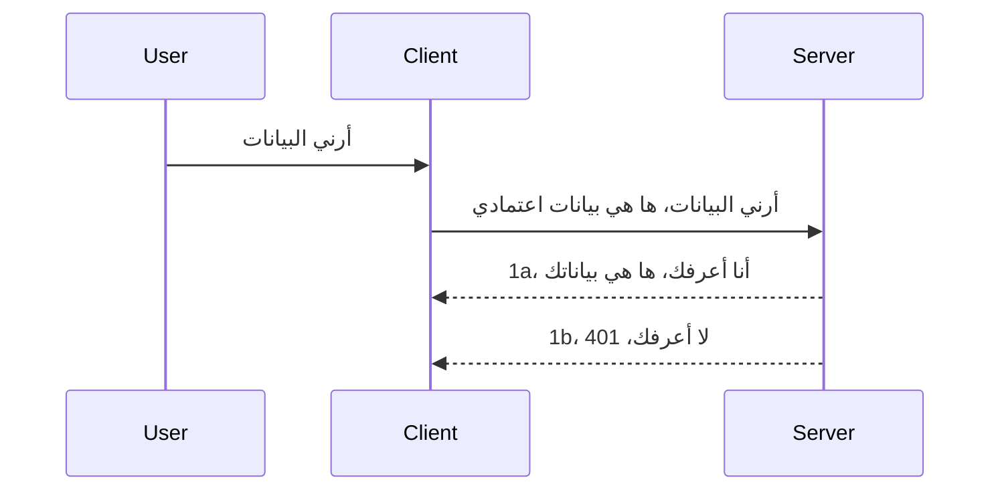

# المصادقة البسيطة

تدعم حزم تطوير MCP استخدام OAuth 2.1 والتي هي عملية معقدة إلى حد ما تشمل مفاهيم مثل خادم المصادقة، خادم الموارد، إرسال بيانات الاعتماد، الحصول على رمز، تبادل الرمز للحصول على رمز حامل حتى تتمكن أخيرًا من الوصول إلى بيانات المورد الخاص بك. إذا لم تكن معتادًا على OAuth، وهو أمر رائع لتنفيذه، فمن الجيد أن تبدأ بمستوى أساسي من المصادقة وتتدرج إلى أمان أفضل وأفضل. لهذا يوجد هذا الفصل، لبناء مستوى متقدم من المصادقة لك.

## المصادقة، ما الذي نعنيه؟

المصادقة هي اختصار للمصادقة والتفويض. الفكرة هي أننا بحاجة إلى القيام بشيئان:

- **المصادقة**، وهي عملية معرفة ما إذا كنا نسمح لشخص بدخول منزلنا، بأن لديه الحق في أن يكون "هنا" أي الوصول إلى خادم الموارد حيث توجد ميزات MCP Server الخاصة بنا.
- **التفويض**، هي عملية معرفة ما إذا كان المستخدم يجب أن يمتلك حق الوصول إلى الموارد المحددة التي يطلبها، على سبيل المثال هذه الطلبات أو هذه المنتجات أو ما إذا كان مسموحًا له بقراءة المحتوى دون الحذف كمثال آخر.

## بيانات الاعتماد: كيف نخبر النظام من نحن

حسنًا، يبدأ معظم مطوري الويب بالتفكير من حيث تقديم بيانات اعتماد إلى الخادم، عادة ما تكون سرًا يقول ما إذا كان مسموحًا له بالتواجد هنا "المصادقة". عادة ما تكون هذه البيانات مشفرة بصيغة base64 لاسم المستخدم وكلمة المرور أو مفتاح API يميز مستخدمًا معينًا بشكل فريد.

يتضمن ذلك إرسالها عبر رأس يسمى "Authorization" كما يلي:

```json
{ "Authorization": "secret123" }
```

يُشار إلى هذا عادةً باسم المصادقة الأساسية. كيفية سير العملية بشكل عام كما يلي:


```mermaid
sequenceDiagram
   participant User
   participant Client
   participant Server

   User->>Client: أرني البيانات
   Client->>Server: أرني البيانات، ها هي بيانات اعتمادي
   Server-->>Client: 1a، أنا أعرفك، ها هي بياناتك
   Server-->>Client: 1b، لا أعرفك، 401 
```

الآن بعد أن فهمنا كيفية عمله من حيث التدفق، كيف نطبقه؟ حسنًا، لدى معظم خوادم الويب مفهوم يسمى middleware، وهو قطعة من الشيفرة تعمل كجزء من الطلب يمكنها التحقق من بيانات الاعتماد، وإذا كانت البيانات صالحة، تسمح للطلب بالمرور. إذا لم يكن للطلب بيانات اعتماد صالحة، تحصل على خطأ في المصادقة. دعنا نر كيف يمكن تنفيذ ذلك:

**بايثون**

```python
class AuthMiddleware(BaseHTTPMiddleware):
    async def dispatch(self, request, call_next):

        has_header = request.headers.get("Authorization")
        if not has_header:
            print("-> Missing Authorization header!")
            return Response(status_code=401, content="Unauthorized")

        if not valid_token(has_header):
            print("-> Invalid token!")
            return Response(status_code=403, content="Forbidden")

        print("Valid token, proceeding...")
       
        response = await call_next(request)
        # أضف أي رؤوس مخصصة أو قم بتغيير الرد بطريقة ما
        return response


starlette_app.add_middleware(CustomHeaderMiddleware)
```

هنا لدينا:

- أنشأنا middleware يسمى `AuthMiddleware` حيث يتم استدعاء دالة `dispatch` الخاصة به بواسطة خادم الويب.
- أضفنا middleware إلى خادم الويب:

    ```python
    starlette_app.add_middleware(AuthMiddleware)
    ```

- كتبنا منطق التحقق الذي يتفقد ما إذا كان رأس Authorization موجودًا وإذا كان السر المرسل صحيحًا:

    ```python
    has_header = request.headers.get("Authorization")
    if not has_header:
        print("-> Missing Authorization header!")
        return Response(status_code=401, content="Unauthorized")

    if not valid_token(has_header):
        print("-> Invalid token!")
        return Response(status_code=403, content="Forbidden")
    ```

    إذا كان السر موجودًا وصحيحًا نسمح للطلب بالمرور عبر استدعاء `call_next` ونعيد الاستجابة.

    ```python
    response = await call_next(request)
    # أضف أي رؤوس مخصصة أو قم بتغيير الرد بأي طريقة
    return response
    ```

كيف يعمل هو أنه إذا تم إرسال طلب ويب نحو الخادم سيتم استدعاء middleware وبموجب تنفيذه إما يسمح للطلب بالمرور أو يعيد خطأ يشير إلى أن العميل غير مسموح له بالمتابعة.

**تايب سكريبت**

هنا ننشئ middleware مع الإطار الشهير Express ونعترض الطلب قبل أن يصل إلى MCP Server. هذا هو الكود لذلك:

```typescript
function isValid(secret) {
    return secret === "secret123";
}

app.use((req, res, next) => {
    // ١. هل رأس التفويض موجود؟
    if(!req.headers["Authorization"]) {
        res.status(401).send('Unauthorized');
    }
    
    let token = req.headers["Authorization"];

    // ٢. التحقق من الصلاحية.
    if(!isValid(token)) {
        res.status(403).send('Forbidden');
    }

   
    console.log('Middleware executed');
    // ٣. يمرر الطلب إلى الخطوة التالية في سلسلة المعالجة.
    next();
});
```

في هذا الكود:

1. نفحص إذا كان رأس Authorization موجودًا في المقام الأول، إذا لم يكن كذلك نرسل خطأ 401.
2. نتأكد من أن بيانات الاعتماد/الرمز صالح، إذا لم يكن كذلك نرسل خطأ 403.
3. أخيرًا تمرير الطلب في خط أنابيب الطلبات وإرجاع المورد المطلوب.

## تمرين: تنفيذ المصادقة

دعنا نأخذ معرفتنا ونحاول تنفيذها. هذه هي الخطة:

الخادم

- إنشئ خادم ويب وحالة MCP.
- نفذ middleware للخادم.

العميل

- أرسل طلب ويب مع بيانات الاعتماد عبر الرأس.

### -1- إنشاء خادم ويب وحالة MCP

> [!تحذير]
> المثال التالي لـ TypeScript يستهدف MCP `2025-11-25`. يتتبع النقلات بواسطة `mcp-session-id`
> وهو ليس مثالًا حاليًا لـ `2026-07-28`. MCP
> `2026-07-28` تزيل مصافحة `initialize` ومعرف جلسة البروتوكول؛
> التنفيذات الجديدة تستخدم طلبات ذاتية الاكتفاء. انظر
> [ما الذي تغير في MCP: مواصفة 2026-07-28](../../01-CoreConcepts/mcp-2026-07-28.md).

في خطوتنا الأولى، نحتاج إلى إنشاء مثيل لخادم الويب وخادم MCP.

**بايثون**

هنا ننشئ مثيل MCP server، ننشئ تطبيق ويب starlette ونستضيفه بواسطة uvicorn.

```python
# إنشاء خادم MCP

app = FastMCP(
    name="MCP Resource Server",
    instructions="Resource Server that validates tokens via Authorization Server introspection",
    host=settings["host"],
    port=settings["port"],
    debug=True
)

# إنشاء تطبيق ويب starlette
starlette_app = app.streamable_http_app()

# تقديم التطبيق عبر uvicorn
async def run(starlette_app):
    import uvicorn
    config = uvicorn.Config(
            starlette_app,
            host=app.settings.host,
            port=app.settings.port,
            log_level=app.settings.log_level.lower(),
        )
    server = uvicorn.Server(config)
    await server.serve()

run(starlette_app)
```

في هذا الكود:

- أنشأنا MCP Server.
- أنشأنا تطبيق starlette من MCP Server، `app.streamable_http_app()`.
- استضفنا وخدمنا تطبيق الويب باستخدام uvicorn `server.serve()`.

**تايب سكريبت**

هنا ننشئ مثيل MCP Server.

```typescript
const server = new McpServer({
      name: "example-server",
      version: "1.0.0"
    });

    // ... إعداد موارد الخادم والأدوات والمطالبات ...
```

يجب أن يحدث إنشاء MCP Server داخل تعريف المسار POST /mcp، لذا لننقل الكود أعلاه كالتالي:

```typescript
import express from "express";
import { randomUUID } from "node:crypto";
import { McpServer } from "@modelcontextprotocol/sdk/server/mcp.js";
import { StreamableHTTPServerTransport } from "@modelcontextprotocol/sdk/server/streamableHttp.js";
import { isInitializeRequest } from "@modelcontextprotocol/sdk/types.js"

const app = express();
app.use(express.json());

// خريطة لتخزين وسائل النقل حسب معرف الجلسة
const transports: { [sessionId: string]: StreamableHTTPServerTransport } = {};

// معالجة طلبات POST للاتصال من العميل إلى الخادم
app.post('/mcp', async (req, res) => {
  // التحقق من وجود معرف الجلسة
  const sessionId = req.headers['mcp-session-id'] as string | undefined;
  let transport: StreamableHTTPServerTransport;

  if (sessionId && transports[sessionId]) {
    // إعادة استخدام وسيلة النقل الموجودة
    transport = transports[sessionId];
  } else if (!sessionId && isInitializeRequest(req.body)) {
    // طلب تهيئة جديد
    transport = new StreamableHTTPServerTransport({
      sessionIdGenerator: () => randomUUID(),
      onsessioninitialized: (sessionId) => {
        // تخزين وسيلة النقل حسب معرف الجلسة
        transports[sessionId] = transport;
      },
      // تم تعطيل حماية إعادة ربط DNS افتراضيًا للتوافق مع الإصدارات السابقة. إذا كنت تقوم بتشغيل هذا الخادم
      // محليًا، تأكد من تعيين:
      // enableDnsRebindingProtection: true,
      // allowedHosts: ['127.0.0.1'],
    });

    // تنظيف وسيلة النقل عند الإغلاق
    transport.onclose = () => {
      if (transport.sessionId) {
        delete transports[transport.sessionId];
      }
    };
    const server = new McpServer({
      name: "example-server",
      version: "1.0.0"
    });

    // ... إعداد موارد الخادم، الأدوات، والتعليمات ...

    // الاتصال بخادم MCP
    await server.connect(transport);
  } else {
    // طلب غير صالح
    res.status(400).json({
      jsonrpc: '2.0',
      error: {
        code: -32000,
        message: 'Bad Request: No valid session ID provided',
      },
      id: null,
    });
    return;
  }

  // معالجة الطلب
  await transport.handleRequest(req, res, req.body);
});

// معالج قابل لإعادة الاستخدام لطلبات GET و DELETE
const handleSessionRequest = async (req: express.Request, res: express.Response) => {
  const sessionId = req.headers['mcp-session-id'] as string | undefined;
  if (!sessionId || !transports[sessionId]) {
    res.status(400).send('Invalid or missing session ID');
    return;
  }
  
  const transport = transports[sessionId];
  await transport.handleRequest(req, res);
};

// معالجة طلبات GET لإشعارات من الخادم إلى العميل عبر SSE
app.get('/mcp', handleSessionRequest);

// معالجة طلبات DELETE لإنهاء الجلسة
app.delete('/mcp', handleSessionRequest);

app.listen(3000);
```

الآن ترى كيف تم نقل إنشاء MCP Server داخل `app.post("/mcp")`.

لننتقل إلى الخطوة التالية بإنشاء middleware للتحقق من بيانات الاعتماد الواردة.

### -2- تنفيذ middleware للخادم

لننتقل إلى جزء middleware التالي. هنا سننشئ middleware تبحث عن بيانات اعتماد في رأس `Authorization` وتتحقق منها. إذا كانت مقبولة، ينتقل الطلب للقيام بما يلزم (مثلاً، سرد الأدوات، قراءة مورد أو أي وظيفة MCP يطلبها العميل).

**بايثون**

لإنشاء middleware، نحتاج إلى إنشاء فئة ترث من `BaseHTTPMiddleware`. هناك نقطتان مثيرتان للاهتمام:

- الطلب `request`، الذي نقرأ منه معلومات الرأس.
- `call_next` هي الدالة التي يجب استدعاؤها إذا قدم العميل بيانات اعتماد نقبلها.

أولًا، نحتاج لمعالجة حالة إذا كان رأس `Authorization` مفقودًا:

```python
has_header = request.headers.get("Authorization")

# لا يوجد رأس، فشل مع 401، وإلا انتقل إلى الأمام.
if not has_header:
    print("-> Missing Authorization header!")
    return Response(status_code=401, content="Unauthorized")
```

هنا نرسل رسالة 401 غير مصرح بها لأن العميل فشل في المصادقة.

بعد ذلك، إذا تم تقديم بيانات اعتماد، نحتاج للتحقق من صحتها كما يلي:

```python
 if not valid_token(has_header):
    print("-> Invalid token!")
    return Response(status_code=403, content="Forbidden")
```

لاحظ كيف نرسل رسالة 403 ممنوع أعلاه. دعنا نرى الـ middleware بالكامل أدناه الذي ينفذ كل ما ذكرناه أعلاه:

```python
class AuthMiddleware(BaseHTTPMiddleware):
    async def dispatch(self, request, call_next):

        has_header = request.headers.get("Authorization")
        if not has_header:
            print("-> Missing Authorization header!")
            return Response(status_code=401, content="Unauthorized")

        if not valid_token(has_header):
            print("-> Invalid token!")
            return Response(status_code=403, content="Forbidden")

        print("Valid token, proceeding...")
        print(f"-> Received {request.method} {request.url}")
        response = await call_next(request)
        response.headers['Custom'] = 'Example'
        return response

```

عظيم، ولكن ماذا عن دالة `valid_token`؟ ها هي أدناه:

```python
# لا تستخدمه في الإنتاج - حسّنه !!
def valid_token(token: str) -> bool:
    # أزل بادئة "Bearer "
    if token.startswith("Bearer "):
        token = token[7:]
        return token == "secret-token"
    return False
```

من الواضح أنه ينبغي تحسين هذا.

مهم: يجب ألا تحتفظ أبدًا بأسرار كهذه في الشيفرة. من الأفضل أن تسترجع القيمة للمقارنة من مصدر بيانات أو من مزود خدمة الهوية (IDP) أو الأفضل من ذلك، دع مزود الهوية يتحقق من صحتها.

**تايب سكريبت**

لتنفيذ هذا مع Express، نحتاج إلى استدعاء الدالة `use` التي تأخذ دوال middleware.

نحتاج إلى:

- التفاعل مع متغير الطلب للتحقق من بيانات الاعتماد المرسلة في خاصية `Authorization`.
- التحقق من صحة بيانات الاعتماد، وإذا كانت صحيحة، نسمح للطلب بالاستمرار ليقوم طلب MCP الخاص بالعميل بما يجب (مثل سرد الأدوات، قراءة المورد أو أي شيء متعلق بـ MCP).

هنا، نتحقق إذا كان رأس `Authorization` موجودًا وإذا لم يكن كذلك، نمنع مرور الطلب:

```typescript
if(!req.headers["authorization"]) {
    res.status(401).send('Unauthorized');
    return;
}
```

إذا لم يُرسل الرأس في المقام الأول، تستلم خطأ 401.

بعد ذلك، نتحقق إذا كانت بيانات الاعتماد صحيحة، إذا لم تكن كذلك، نوقف الطلب مرة أخرى ولكن برسالة مختلفة قليلاً:

```typescript
if(!isValid(token)) {
    res.status(403).send('Forbidden');
    return;
} 
```

لاحظ كيف يظهر لك الآن خطأ 403.

هذا هو الكود الكامل:

```typescript
app.use((req, res, next) => {
    console.log('Request received:', req.method, req.url, req.headers);
    console.log('Headers:', req.headers["authorization"]);
    if(!req.headers["authorization"]) {
        res.status(401).send('Unauthorized');
        return;
    }
    
    let token = req.headers["authorization"];

    if(!isValid(token)) {
        res.status(403).send('Forbidden');
        return;
    }  

    console.log('Middleware executed');
    next();
});
```

لقد جهزنا خادم الويب لقبول middleware للتحقق من بيانات الاعتماد التي يأمل العميل في إرسالها لنا. ماذا عن العميل نفسه؟

### -3- إرسال طلب ويب مع بيانات الاعتماد عبر الرأس

نحتاج إلى التأكد من أن العميل يمرر بيانات الاعتماد عبر الرأس. وبما أننا نستخدم عميل MCP لذلك، نحتاج لمعرفة كيفية القيام بذلك.

**بايثون**

للعميل، نحتاج إلى إرسال رأس به بيانات الاعتماد كما يلي:

```python
# لا تقم بتثبيت القيمة بشكل ثابت، احتفظ بها على الأقل في متغير بيئي أو تخزين أكثر أمانًا
token = "secret-token"

async with streamablehttp_client(
        url = f"http://localhost:{port}/mcp",
        headers = {"Authorization": f"Bearer {token}"}
    ) as (
        read_stream,
        write_stream,
        session_callback,
    ):
        async with ClientSession(
            read_stream,
            write_stream
        ) as session:
            await session.initialize()
      
            # TODO، ما تريد تنفيذه في العميل، مثل سرد الأدوات، استدعاء الأدوات، إلخ.
```

لاحظ كيف نعبئ خاصية `headers` كما يلي `headers = {"Authorization": f"Bearer {token}"}`.

**تايب سكريبت**

يمكننا حل ذلك في خطوتين:

1. ملء كائن التكوين ببيانات الاعتماد.
2. تمرير كائن التكوين إلى النقل.

```typescript

// لا تُدخل القيمة بشكل ثابت كما هو موضح هنا. على الأقل اجعلها متغير بيئي واستخدم شيئًا مثل dotenv (في وضع التطوير).
let token = "secret123"

// عرّف كائن خيارات نقل العميل
let options: StreamableHTTPClientTransportOptions = {
  sessionId: sessionId,
  requestInit: {
    headers: {
      "Authorization": "secret123"
    }
  }
};

// مرر كائن الخيارات إلى النقل
async function main() {
   const transport = new StreamableHTTPClientTransport(
      new URL(serverUrl),
      options
   );
```

هنا ترى أعلاه كيف اضطررنا إلى إنشاء كائن `options` ووضع رؤوسنا تحت خاصية `requestInit`.

مهم: كيف نحسن ذلك من هنا؟ حسنًا، التنفيذ الحالي به بعض المشاكل. أولاً، تمرير بيانات اعتماد بهذه الطريقة خطر إلى حد ما ما لم يكن لديك HTTPS على الأقل. وحتى مع HTTPS، يمكن سرقة بيانات الاعتماد لذلك تحتاج إلى نظام تستطيع فيه بسهولة إبطال الرمز وإضافة فحوص إضافية مثل من أين أتى الطلب جغرافيًا، هل الطلب متكرر جدًا (سلوك بوت)، باختصار هناك العديد من الاعتبارات.

يجب القول، رغم ذلك، بالنسبة لواجهات برمجة التطبيقات البسيطة جدًا حيث لا تريد لأي شخص استدعاء API الخاص بك دون مصادقة، ما نمتلكه هنا بداية جيدة.

مع ذلك، لنحاول تعزيز الأمان قليلاً باستخدام صيغة قياسية مثل JSON Web Token، والمعروفة أيضًا باسم JWT أو رموز "JOT".

## رموز الويب JSON، JWT

إذًا، نحن نحاول تحسين الأمور من مجرد إرسال بيانات اعتماد بسيطة جدًا. ما هي التحسينات الفورية التي نحصل عليها بتبني JWT؟

- **تحسينات الأمان**. في المصادقة الأساسية، ترسل اسم المستخدم وكلمة المرور مشفرين بصيغة base64 (أو ترسل مفتاح API) مرارًا وتكرارًا مما يزيد من الخطورة. مع JWT، ترسل اسم المستخدم وكلمة المرور وتتحصل على رمز في المقابل وهو مرتبط بزمن انتهاء صلاحية، حيث سينتهي بعد وقت معين. يسمح JWT باستخدام التحكم الدقيق في الوصول باستخدام الأدوار، والصلاحيات والمجالات.
- **عدم الحالة وقابلية التوسع**. JWTs تحمل كل معلومات المستخدم بداخلها وتلغي الحاجة لتخزين جلسة على جانب الخادم. يمكن التحقق من الرمز محليًا أيضًا.
- **التشغيل البيني والاتحاد**. JWTs مركزية في Open ID Connect وتستخدم مع مزودي الهوية المعروفين مثل Entra ID، Google Identity و Auth0. كما تمكن من الاستخدام الموحد لتسجيل الدخول وأكثر مما يجعلها بمستوى المؤسسات.
- **المرونة والوحدوية**. يمكن استخدام JWTs مع بوابات API مثل Azure API Management و NGINX وغيرهما. كما تدعم سيناريوهات المصادقة واستخدام الخادم إلى خادم بما في ذلك التقمص وتفويض الصلاحيات.
- **الأداء والتخزين المؤقت**. يمكن تخزين JWTs مؤقتًا بعد فك التشفير مما يقلل الحاجة إلى تحليلها. هذا يساعد خصوصًا في التطبيقات ذات الحركة العالية حيث يحسن الأداء ويخفف العبء على البنية التحتية.
- **ميزات متقدمة**. تدعم أيضًا الفحص (التحقق من الصلاحية على الخادم) والإلغاء (جعل الرمز غير صالح).

مع كل هذه الفوائد، دعنا نر كيف يمكننا تطوير تنفيذنا إلى المستوى التالي.

## تحويل المصادقة الأساسية إلى JWT

إذن، التغييرات التي نحتاج لإجرائها على المستوى العام هي:

- **تعلم إنشاء رمز JWT** وجعله جاهزًا للإرسال من العميل إلى الخادم.
- **التحقق من صحة رمز JWT**، وإذا كان صالحًا، نسمح للعميل بالوصول إلى مواردنا.
- **تخزين الرمز بأمان**. كيف نخزن هذا الرمز.
- **حماية المسارات**. نحتاج إلى حماية المسارات، في حالتنا، حماية مسارات وميزات MCP المحددة.
- **إضافة رموز التحديث**. التأكد من أن الرموز التي ننشئها قصيرة العمر، مع رموز تحديث طويلة العمر يمكن استخدامها للحصول على رموز جديدة عند انتهاء صلاحيتها. كما يجب وجود نقطة نهاية للتحديث واستراتيجية تدوير.

### -1- إنشاء رمز JWT

أولاً، رمز JWT يحتوي على الأجزاء التالية:

- **الرأس**، الخوارزمية المستخدمة ونوع الرمز.
- **الحمولة**، الادعاءات، مثل sub (المستخدم أو الكيان الذي يمثل الرمز. في سيناريو المصادقة هذا عادة هو معرف المستخدم)، exp (تاريخ انتهاء الصلاحية)، role (الدور).
- **التوقيع**، موقّع بواسطة سر أو مفتاح خاص.

لهذه العملية، سنحتاج إلى إنشاء الرأس والحمولة والرمز المشفر.

**بايثون**

```python

import jwt
import jwt
from jwt.exceptions import ExpiredSignatureError, InvalidTokenError
import datetime

# المفتاح السري المستخدم لتوقيع JWT
secret_key = 'your-secret-key'

header = {
    "alg": "HS256",
    "typ": "JWT"
}

# معلومات المستخدم وادعاءاته ووقت انتهائها
payload = {
    "sub": "1234567890",               # الموضوع (معرف المستخدم)
    "name": "User Userson",                # مطالبة مخصصة
    "admin": True,                     # مطالبة مخصصة
    "iat": datetime.datetime.utcnow(),# وقت الإصدار
    "exp": datetime.datetime.utcnow() + datetime.timedelta(hours=1)  # وقت الانتهاء
}

# ترميزها
encoded_jwt = jwt.encode(payload, secret_key, algorithm="HS256", headers=header)
```

في الكود أعلاه:

- عرفنا رأس باستخدام HS256 كخوارزمية ونوع ليكون JWT.
- أنشأنا حمولة تحتوي على subject أو معرف المستخدم، اسم المستخدم، الدور، وقت الإصدار وتاريخ الانتهاء، وبذلك طبقنا جانب الربط الزمني الذي ذكرناه سابقًا.

**تايب سكريبت**

هنا سنحتاج بعض التبعيات التي تساعدنا في إنشاء رمز JWT.

تبعيات

```sh

npm install jsonwebtoken
npm install --save-dev @types/jsonwebtoken
```

الآن بعد أن جهزنا ذلك، لننشئ الرأس، الحمولة ومن خلالهما ننشئ الرمز المشفر.

```typescript
import jwt from 'jsonwebtoken';

const secretKey = 'your-secret-key'; // استخدم متغيرات البيئة في الإنتاج

// تعريف الحمولة
const payload = {
  sub: '1234567890',
  name: 'User usersson',
  admin: true,
  iat: Math.floor(Date.now() / 1000), // صدرت في
  exp: Math.floor(Date.now() / 1000) + 60 * 60 // تنتهي بعد ساعة
};

// تعريف الرأس (اختياري، jsonwebtoken يحدد القيم الافتراضية)
const header = {
  alg: 'HS256',
  typ: 'JWT'
};

// إنشاء الرمز السري
const token = jwt.sign(payload, secretKey, {
  algorithm: 'HS256',
  header: header
});

console.log('JWT:', token);
```

هذا الرمز هو:

موقّع باستخدام HS256
صالح لمدة ساعة واحدة
يشمل ادعاءات مثل sub و name و admin و iat و exp.

### -2- التحقق من الرمز

سنحتاج أيضًا للتحقق من صحة الرمز، وهذا شيء يجب أن نقوم به على الخادم لضمان أن ما يرسله العميل صحيح فعلاً. يجب إجراء العديد من الفحوص هنا من التحقق من هيكله إلى صلاحيته. ويُشجعك أيضًا على إضافة فحوص أخرى لمعرفة إذا كان المستخدم موجودًا في نظامك والمزيد.

للتحقق من الرمز، نحتاج إلى إخراجه (فك ترميزه) لقراءته ثم نبدأ بفحص صلاحيته:

**بايثون**

```python

# فك شفرة والتحقق من JWT
try:
    decoded = jwt.decode(token, secret_key, algorithms=["HS256"])
    print("✅ Token is valid.")
    print("Decoded claims:")
    for key, value in decoded.items():
        print(f"  {key}: {value}")
except ExpiredSignatureError:
    print("❌ Token has expired.")
except InvalidTokenError as e:
    print(f"❌ Invalid token: {e}")

```


في هذا الشيفرة، نستدعي `jwt.decode` باستخدام الرمز المميز، المفتاح السري والخوارزمية المختارة كمدخلات. لاحظ كيف نستخدم تركيب try-catch لأن فشل التحقق يؤدي إلى رفع خطأ.

**TypeScript**

هنا نحتاج إلى استدعاء `jwt.verify` للحصول على نسخة مفككة من الرمز المميز يمكننا تحليلها بشكل أعمق. إذا فشل هذا الاستدعاء، فهذا يعني أن بنية الرمز المميز غير صحيحة أو لم يعد صالحًا.

```typescript

try {
  const decoded = jwt.verify(token, secretKey);
  console.log('Decoded Payload:', decoded);
} catch (err) {
  console.error('Token verification failed:', err);
}
```

ملاحظة: كما ذكرنا سابقًا، يجب علينا إجراء فحوصات إضافية لضمان أن هذا الرمز يشير إلى مستخدم في نظامنا وضمان أن المستخدم لديه الحقوق التي يدعيها.

بعد ذلك، لنلق نظرة على التحكم في الوصول بناءً على الدور، المعروف أيضًا باسم RBAC.

## إضافة التحكم في الوصول بناءً على الدور

الفكرة هي أننا نريد التعبير عن أن الأدوار المختلفة لها أذونات مختلفة. على سبيل المثال، نفترض أن المسؤول يمكنه فعل كل شيء وأن المستخدم العادي يمكنه القراءة/الكتابة وأن الضيف يمكنه فقط القراءة. لذلك، إليك بعض مستويات الأذونات المحتملة:

- Admin.Write
- User.Read
- Guest.Read

لنرَ كيف يمكننا تنفيذ مثل هذا التحكم باستخدام البرامج الوسيطة. يمكن إضافة البرامج الوسيطة لكل مسار وكذلك لجميع المسارات.

**Python**

```python
from starlette.middleware.base import BaseHTTPMiddleware
from starlette.responses import JSONResponse
import jwt

# لا تحتفظ بالسر في الكود، فهذا لغرض العرض فقط. اقرأه من مكان آمن.
SECRET_KEY = "your-secret-key" # ضع هذا في متغير البيئة
REQUIRED_PERMISSION = "User.Read"

class JWTPermissionMiddleware(BaseHTTPMiddleware):
    async def dispatch(self, request, call_next):
        auth_header = request.headers.get("Authorization")
        if not auth_header or not auth_header.startswith("Bearer "):
            return JSONResponse({"error": "Missing or invalid Authorization header"}, status_code=401)

        token = auth_header.split(" ")[1]
        try:
            decoded = jwt.decode(token, SECRET_KEY, algorithms=["HS256"])
        except jwt.ExpiredSignatureError:
            return JSONResponse({"error": "Token expired"}, status_code=401)
        except jwt.InvalidTokenError:
            return JSONResponse({"error": "Invalid token"}, status_code=401)

        permissions = decoded.get("permissions", [])
        if REQUIRED_PERMISSION not in permissions:
            return JSONResponse({"error": "Permission denied"}, status_code=403)

        request.state.user = decoded
        return await call_next(request)


```

هناك عدة طرق مختلفة لإضافة البرنامج الوسيط كما يلي:

```python

# البديل 1: إضافة وسيط برمجي أثناء إنشاء تطبيق ستارليت
middleware = [
    Middleware(JWTPermissionMiddleware)
]

app = Starlette(routes=routes, middleware=middleware)

# البديل 2: إضافة وسيط برمجي بعد إنشاء تطبيق ستارليت بالفعل
starlette_app.add_middleware(JWTPermissionMiddleware)

# البديل 3: إضافة وسيط برمجي لكل مسار
routes = [
    Route(
        "/mcp",
        endpoint=..., # المعالج
        middleware=[Middleware(JWTPermissionMiddleware)]
    )
]
```

**TypeScript**

يمكننا استخدام `app.use` وبرنامج وسيط يعمل لجميع الطلبات.

```typescript
app.use((req, res, next) => {
    console.log('Request received:', req.method, req.url, req.headers);
    console.log('Headers:', req.headers["authorization"]);

    // ١. تحقق مما إذا تم إرسال ترويسة التفويض

    if(!req.headers["authorization"]) {
        res.status(401).send('Unauthorized');
        return;
    }
    
    let token = req.headers["authorization"];

    // ٢. تحقق مما إذا كانت الرمز صالحًا
    if(!isValid(token)) {
        res.status(403).send('Forbidden');
        return;
    }  

    // ٣. تحقق مما إذا كان مستخدم الرمز موجودًا في نظامنا
    if(!isExistingUser(token)) {
        res.status(403).send('Forbidden');
        console.log("User does not exist");
        return;
    }
    console.log("User exists");

    // ٤. تحقق من أن الرمز لديه الأذونات الصحيحة
    if(!hasScopes(token, ["User.Read"])){
        res.status(403).send('Forbidden - insufficient scopes');
    }

    console.log("User has required scopes");

    console.log('Middleware executed');
    next();
});

```

هناك العديد من الأشياء التي يمكننا السماح لبرنامجنا الوسيط بالقيام بها والتي يجب عليه القيام بها، وهي:

1. التحقق من وجود ترويسة التفويض
2. التحقق من صحة الرمز المميز، نستخدم `isValid` وهي دالة كتبناها تتحقق من سلامة وصلاحية رمز JWT.
3. التحقق من وجود المستخدم في نظامنا، يجب علينا التحقق من ذلك.

   ```typescript
    // المستخدمون في قاعدة البيانات
   const users = [
     "user1",
     "User usersson",
   ]

   function isExistingUser(token) {
     let decodedToken = verifyToken(token);

     // يجب القيام، التحقق مما إذا كان المستخدم موجود في قاعدة البيانات
     return users.includes(decodedToken?.name || "");
   }
   ```

   أعلاه، أنشأنا قائمة بسيطة جدًا من `users`، والتي يجب أن تكون في قاعدة بيانات بالطبع.

4. بالإضافة إلى ذلك، يجب أيضًا التحقق من أن الرمز يحتوي على الأذونات الصحيحة.

   ```typescript
   if(!hasScopes(token, ["User.Read"])){
        res.status(403).send('Forbidden - insufficient scopes');
   }
   ```

   في هذه الشيفرة أعلاه من البرنامج الوسيط، نتحقق من أن الرمز يحتوي على إذن User.Read، وإذا لم يكن كذلك نرسل خطأ 403. أدناه هي دالة المساعدة `hasScopes`.

   ```typescript
   function hasScopes(scope: string, requiredScopes: string[]) {
     let decodedToken = verifyToken(scope);
    return requiredScopes.every(scope => decodedToken?.scopes.includes(scope));
  }
   ```

Have a think which additional checks you should be doing, but these are the absolute minimum of checks you should be doing.

Using Express as a web framework is a common choice. There are helpers library when you use JWT so you can write less code.

- `express-jwt`, helper library that provides a middleware that helps decode your token.
- `express-jwt-permissions`, this provides a middleware `guard` that helps check if a certain permission is on the token.

Here's what these libraries can look like when used:

```typescript
const express = require('express');
const jwt = require('express-jwt');
const guard = require('express-jwt-permissions')();

const app = express();
const secretKey = 'your-secret-key'; // put this in env variable

// Decode JWT and attach to req.user
app.use(jwt({ secret: secretKey, algorithms: ['HS256'] }));

// Check for User.Read permission
app.use(guard.check('User.Read'));

// multiple permissions
// app.use(guard.check(['User.Read', 'Admin.Access']));

app.get('/protected', (req, res) => {
  res.json({ message: `Welcome ${req.user.name}` });
});

// Error handler
app.use((err, req, res, next) => {
  if (err.code === 'permission_denied') {
    return res.status(403).send('Forbidden');
  }
  next(err);
});

```

الآن لقد رأيت كيف يمكن استخدام البرنامج الوسيط لكل من المصادقة والتفويض، ماذا عن MCP، هل يغير من طريقة تنفيذنا للمصادقة؟ دعونا نكتشف في القسم التالي.

### -3- إضافة RBAC إلى MCP

حتى الآن رأيت كيف يمكنك إضافة RBAC عبر البرنامج الوسيط، لكن بالنسبة لـ MCP لا توجد طريقة سهلة لإضافة RBAC لكل ميزة في MCP، إذًا ماذا نفعل؟ حسنًا، علينا فقط إضافة شيفرة مثل هذه التي تتحقق في هذه الحالة مما إذا كان العميل لديه الحقوق لاستدعاء أداة معينة:

لديك عدة خيارات مختلفة لكيفية تحقيق RBAC لكل ميزة، إليك بعضها:

- إضافة تحقق لكل أداة، مورد، أو موجه حيث تحتاج للتحقق من مستوى الإذن.

   **python**

   ```python
   @tool()
   def delete_product(id: int):
      try:
          check_permissions(role="Admin.Write", request)
      catch:
        pass # فشل العميل في التفويض، رفع خطأ في التفويض
   ```

   **typescript**

   ```typescript
   server.registerTool(
    "delete-product",
    {
      title: Delete a product",
      description: "Deletes a product",
      inputSchema: { id: z.number() }
    },
    async ({ id }) => {
      
      try {
        checkPermissions("Admin.Write", request);
        // يجب عمله، إرسال المعرف إلى خدمة المنتج والنقطة البعيدة
      } catch(Exception e) {
        console.log("Authorization error, you're not allowed");  
      }

      return {
        content: [{ type: "text", text: `Deletected product with id ${id}` }]
      };
    }
   );
   ```


- استخدم نهج الخادم المتقدم ومتعاملات الطلب لتقليل عدد الأماكن التي تحتاج للتحقق فيها.

   **Python**

   ```python
   
   tool_permission = {
      "create_product": ["User.Write", "Admin.Write"],
      "delete_product": ["Admin.Write"]
   }

   def has_permission(user_permissions, required_permissions) -> bool:
      # user_permissions: قائمة الأذونات التي يمتلكها المستخدم
      # required_permissions: قائمة الأذونات المطلوبة للأداة
      return any(perm in user_permissions for perm in required_permissions)

   @server.call_tool()
   async def handle_call_tool(
     name: str, arguments: dict[str, str] | None
   ) -> list[types.TextContent]:
    # افترض أن request.user.permissions هي قائمة بالأذونات الخاصة بالمستخدم
     user_permissions = request.user.permissions
     required_permissions = tool_permission.get(name, [])
     if not has_permission(user_permissions, required_permissions):
        # أرفع خطأ "ليس لديك إذن لاستدعاء الأداة {name}"
        raise Exception(f"You don't have permission to call tool {name}")
     # استمر واستدعي الأداة
     # ...
   ```   
   

   **TypeScript**

   ```typescript
   function hasPermission(userPermissions: string[], requiredPermissions: string[]): boolean {
       if (!Array.isArray(userPermissions) || !Array.isArray(requiredPermissions)) return false;
       // أرجع صحيح إذا كان لدى المستخدم إذن واحد على الأقل مطلوب
       
       return requiredPermissions.some(perm => userPermissions.includes(perm));
   }
  
   server.setRequestHandler(CallToolRequestSchema, async (request) => {
      const { params: { name } } = request;
  
      let permissions = request.user.permissions;
  
      if (!hasPermission(permissions, toolPermissions[name])) {
         return new Error(`You don't have permission to call ${name}`);
      }
  
      // تابع..
   });
   ```

   ملاحظة، ستحتاج إلى التأكد من أن برنامجك الوسيط يعين رمزًا مفككًا إلى خاصية المستخدم في الطلب لجعل الشيفرة أعلاه بسيطة.

### الخلاصة

الآن بعد أن ناقشنا كيفية إضافة دعم RBAC بشكل عام ولـ MCP بشكل خاص، حان الوقت لمحاولة تنفيذ الأمان بنفسك لتتأكد من فهمك للمفاهيم المقدمة لك.

## التمرين 1: بناء خادم MCP وعميل MCP باستخدام المصادقة الأساسية

هنا ستأخذ ما تعلمته فيما يتعلق بإرسال بيانات الاعتماد عبر الترويسات.

## الحل 1

[Solution 1](./code/basic/README.md)

## التمرين 2: ترقية الحل من التمرين 1 لاستخدام JWT

خذ الحل الأول ولكن هذه المرة، دعنا نحسن عليه.

بدلًا من استخدام المصادقة الأساسية، دعنا نستخدم JWT.

## الحل 2

[Solution 2](./solution/jwt-solution/README.md)

## التحدي

أضف RBAC لكل أداة كما وصفنا في قسم "إضافة RBAC إلى MCP".

## الملخص

نأمل أنك تعلمت الكثير في هذا الفصل، من دون أمان على الإطلاق، إلى الأمان الأساسي، إلى JWT وكيف يمكن إضافته إلى MCP.

لقد بنينا أساسًا قويًا باستخدام JWT مخصص، ولكن مع توسعنا، نتجه نحو نموذج هوية قائم على المعايير. اعتماد مزود هوية مثل Entra أو Keycloak يسمح لنا بإسناد إصدار الرمز المميز، التحقق منه، وإدارة دورة حياته إلى منصة موثوقة — مما يحررنا للتركيز على منطق التطبيق وتجربة المستخدم.

لهذا، لدينا فصل أكثر [تقدمًا عن Entra](../../05-AdvancedTopics/mcp-security-entra/README.md)

## ماذا بعد

- التالي: [إعداد مضيفي MCP](../12-mcp-hosts/README.md)

---

<!-- CO-OP TRANSLATOR DISCLAIMER START -->
**تنويه**:
تمت ترجمة هذا المستند باستخدام خدمة الترجمة بالذكاء الاصطناعي [Co-op Translator](https://github.com/Azure/co-op-translator). بينما نسعى للدقة، يرجى العلم أن الترجمات الآلية قد تحتوي على أخطاء أو عدم دقة. يجب اعتبار المستند الأصلي بلغته الأصلية المصدر الرسمي والمعتمد. للمعلومات الهامة، يُنصح بالاستعانة بترجمة بشرية محترفة. نحن غير مسؤولين عن أي سوء فهم أو تفسير ناتج عن استخدام هذه الترجمة.
<!-- CO-OP TRANSLATOR DISCLAIMER END -->