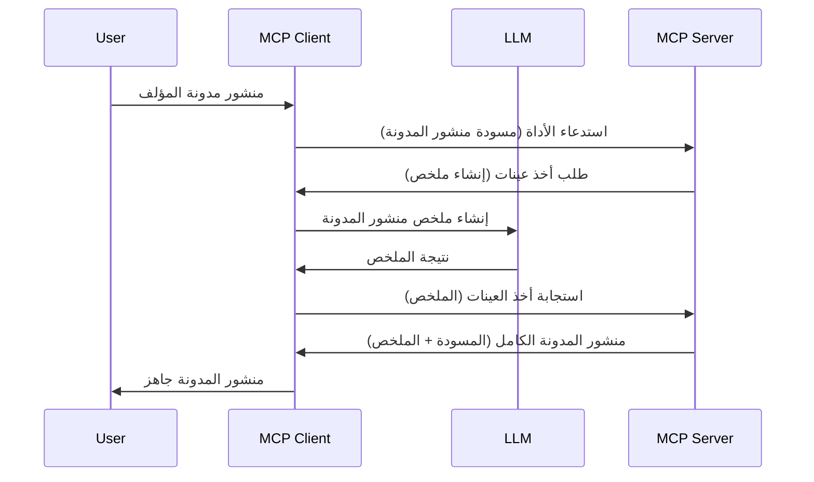

> [!تحذير]
> تم إهمال Sampling في MCP `2026-07-28`. هذا الدرس محفوظ للتطبيقات القديمة.
> يجب على الخوادم الجديدة التكامل مباشرةً مع واجهة برمجة تطبيقات مزود LLM.


# Sampling - تفويض الميزات إلى العميل

> Sampling لا يزال موجودًا في مواصفة `2026-07-28` من أجل التوافق وهو
> مؤهل للإزالة في المراجعة الأولى التي تُصدر في أو بعد 28 يوليو،
> 2027. قد تستخدم الأمثلة في هذا الدرس واجهات برمجة تطبيقات SDK التي تطبق `2025-11-25`.
> انظر [ما الذي تغير في MCP: مواصفة 2026-07-28](../../01-CoreConcepts/mcp-2026-07-28.md).

في التطبيقات القديمة، يسمح Sampling لخادم MCP بطلب المساعدة من LLM
التي يديرها العميل. للتطبيقات الجديدة، اتصل بمزود LLM المختار
مباشرةً بدلاً من ذلك.

لنستعرض بعض حالات الاستخدام وكيفية بناء حل يتضمن Sampling.

## نظرة عامة

في هذا الدرس، نركز على شرح متى وأين نستخدم Sampling وكيفية تكوينه.

## أهداف التعلم

في هذا الفصل، سوف:

- شرح ما هو Sampling ومتى نستخدمه.
- عرض كيفية تكوين Sampling في MCP.
- تقديم أمثلة على استخدام Sampling عمليًا.

## ما هو Sampling ولماذا نستخدمه؟

Sampling هي ميزة متقدمة تعمل بالطريقة التالية:



### طلب Sampling

حسنًا، الآن لدينا نظرة عامة معقولة عن سيناريو محتمل، دعونا نتحدث عن طلب Sampling الذي يرسله الخادم إلى العميل. هذا ما قد يبدو عليه هذا الطلب بصيغة JSON-RPC:

```json
{
  "jsonrpc": "2.0",
  "id": 1,
  "method": "sampling/createMessage",
  "params": {
    "messages": [
      {
        "role": "user",
        "content": {
          "type": "text",
          "text": "Create a blog post summary of the following blog post: <BLOG POST>"
        }
      }
    ],
    "modelPreferences": {
      "hints": [
        {
          "name": "claude-3-sonnet"
        }
      ],
      "intelligencePriority": 0.8,
      "speedPriority": 0.5
    },
    "systemPrompt": "You are a helpful assistant.",
    "maxTokens": 100
  }
}
```

هناك بعض الأمور الجديرة بالذكر هنا:

- المحتوى، تحت content -> text، هو مطلبنا الذي يوجه LLM لتلخيص محتوى منشور المدونة.

- **modelPreferences**. هذا القسم هو مجرد تفضيل، توصية بما يجب استخدامه من إعداد مع LLM. يمكن للمستخدم اختيار اتباع هذه التوصيات أو تغييرها. في هذه الحالة هناك توصيات حول النموذج المستخدم وأولوية السرعة والذكاء.
- **systemPrompt**، هذه هي التعليمات النظامية العادية التي تحدد شخصية LLM وتحتوي على إرشادات.
- **maxTokens**، هذه خاصية أخرى تُستخدم لتحديد عدد الرموز الموصى باستخدامها لهذه المهمة.

### استجابة Sampling

هذه الاستجابة هي ما يرسله عميل MCP مرة أخرى إلى خادم MCP وهي نتيجة استدعاء العميل لـ LLM، انتظار تلك الاستجابة ثم بناء هذه الرسالة. هذا ما قد تبدو عليه بصيغة JSON-RPC:

```json
{
  "jsonrpc": "2.0",
  "id": 1,
  "result": {
    "role": "assistant",
    "content": {
      "type": "text",
      "text": "Here's your abstract <ABSTRACT>"
    },
    "model": "gpt-5",
    "stopReason": "endTurn"
  }
}
```

لاحظ كيف الاستجابة هي ملخص لمنشور المدونة كما طلبنا. لاحظ أيضًا كيف أن النموذج المستخدم ليس ما طلبناه بل "gpt-5" بدلاً من "claude-3-sonnet". هذا لتوضيح أن المستخدم يمكنه تغيير رأيه بشأن ما يستخدم وأن طلب Sampling هو مجرد توصية.

حسنًا، الآن بعد أن فهمنا التدفق الرئيسي، والمهمة المفيدة لاستخدامه "إنشاء منشور مدونة + ملخص"، لنر ما نحتاج لفعله لجعله يعمل.

### أنواع الرسائل

رسائل Sampling ليست مقيدة بالنص فقط بل يمكن أيضًا إرسال الصور والصوت. هذا كيف تبدو JSON-RPC مختلفة:

**نص**

```json
{
  "type": "text",
  "text": "The message content"
}
```

**محتوى الصورة**


```json
{
  "type": "image",
  "data": "base64-encoded-image-data",
  "mimeType": "image/jpeg"
}
```

**المحتوى الصوتي**

```json
{
  "type": "audio",
  "data": "base64-encoded-audio-data",
  "mimeType": "audio/wav"
}
```

> ملاحظة: لحالة الحالية وإرشادات الترحيل، راجع
> [توثيق العينة المهجور](https://modelcontextprotocol.io/specification/2026-07-28/client/sampling).

## كيفية تكوين العينة في العميل

> ملاحظة: إذا كنت تبني خادمًا فقط، لا تحتاج إلى فعل الكثير هنا.

في العميل، تحتاج إلى تحديد الميزة التالية كما يلي:

```json
{
  "capabilities": {
    "sampling": {}
  }
}
```

سيتم التقاط ذلك عندما يبدأ عميلك المختار مع الخادم.

## مثال على العينة في العمل - إنشاء منشور مدونة

دعنا نبرمج خادم العينة معًا، سنحتاج إلى القيام بما يلي:

1. إنشاء أداة على الخادم.
1. يجب أن تنشئ الأداة طلب عينة
1. يجب على الأداة انتظار الرد على طلب العينة من العميل.
1. ثم يجب إنتاج نتيجة الأداة.

دعنا نرى الشيفرة خطوة بخطوة:

### -1- إنشاء الأداة

**بايثون**

```python
@mcp.tool()
async def create_blog(title: str, content: str, ctx: Context[ServerSession, None]) -> str:
    """Create a blog post and generate a summary"""

```

### -2- إنشاء طلب العينة

قم بتمديد أداتك بالشيفرة التالية:

**بايثون**

```python
post = BlogPost(
        id=len(posts) + 1,
        title=title,
        content=content,
        abstract=""
    )

prompt = f"Create an abstract of the following blog post: title: {title} and draft: {content} "

result = await ctx.session.create_message(
        messages=[
            SamplingMessage(
                role="user",
                content=TextContent(type="text", text=prompt),
            )
        ],
        max_tokens=100,
)

```

### -3- الانتظار للرد وإرجاع الرد

**بايثون**

```python
post.abstract = result.content.text

posts.append(post)

# إرجاع المنتج الكامل
return json.dumps({
    "id": post.title,
    "abstract": post.abstract
})
```

### -4- الشيفرة الكاملة

**بايثون**

```python
from starlette.applications import Starlette
from starlette.routing import Mount, Host

from mcp.server.fastmcp import Context, FastMCP

from mcp.server.session import ServerSession
from mcp.types import SamplingMessage, TextContent

import json


from uuid import uuid4
from typing import List
from pydantic import BaseModel


mcp = FastMCP("Blog post generator")

# app = FastAPI()

posts = []

class BlogPost(BaseModel):
    id: int
    title: str
    content: str
    abstract: str

posts: List[BlogPost] = []

@mcp.tool()
async def create_blog(title: str, content: str, ctx: Context[ServerSession, None]) -> str:
    """Create a blog post and generate a summary"""

    post = BlogPost(
        id=len(posts) + 1,
        title=title,
        content=content,
        abstract=""
    )

    prompt = f"Create an abstract of the following blog post: title: {title} and draft: {content} "

    result = await ctx.session.create_message(
        messages=[
            SamplingMessage(
                role="user",
                content=TextContent(type="text", text=prompt),
            )
        ],
        max_tokens=100,
    )

    post.abstract = result.content.text

    posts.append(post)

    # إرجاع منشور المدونة الكامل
    return json.dumps({
        "id": post.title,
        "abstract": post.abstract
    })

if __name__ == "__main__":
    print("Starting server...")
    # mcp.run()
    mcp.run(transport="streamable-http")

# تشغيل التطبيق باستخدام: python server.py
```

### -5- اختباره في Visual Studio Code

لاختباره في Visual Studio Code، قم بالتالي:

1. ابدأ الخادم في الطرفية
1. أضفها إلى *mcp.json* (وتأكد من أنه بدأ) مثلاً شيء مثل:

   ```json
   "servers": {
      "blog-server": {
        "type": "http",
        "url": "http://localhost:8000/mcp"
      }
   }
   ```

1. اكتب مطالبة:

   ```text
   create a blog post named "Where Python comes from", the content is "Python is actually named after Monty Python Flying Circus"
   ```

1. اسمح بحدوث العينة. في أول مرة تختبر هذا، سيظهر لك مربع حوار إضافي تحتاج للموافقة عليه، ثم سترى مربع الحوار العادي لطلب تشغيل أداة

1. استعرض النتائج. سترى النتائج تظهر بشكل جيد في GitHub Copilot Chat ويمكنك أيضًا استعراض الرد الخام بصيغة JSON.

**مكافأة**. أداوت Visual Studio Code تدعم العينة بشكل ممتاز. يمكنك تكوين الوصول للعينة على الخادم المثبت لديك من خلال التنقل إليه مثل هذا:

1. انتقل إلى قسم الإضافات.
1. اختر رمز الترس للخادم المثبت في قسم "MCP SERVERS - INSTALLED".
1 اختر "تكوين وصول النموذج"، هنا يمكنك اختيار النماذج التي يسمح لـ GitHub Copilot باستخدامها أثناء إجراء العينة. يمكنك أيضًا رؤية جميع طلبات العينة التي حدثت مؤخرًا باختيار "إظهار طلبات العينة".

## الواجب

في هذا الواجب، ستبني نوعًا مختلفًا قليلاً من العينة وهو تكامل عينة يدعم إنشاء وصف المنتج. السيناريو الخاص بك هو:

**السيناريو**: موظف المكتب الخلفي في تجارة إلكترونية يحتاج مساعدة، يستغرق وقتًا طويلاً لإنشاء أوصاف المنتج. لذلك، عليك بناء حل حيث يمكنك استدعاء أداة "create_product" مع "العنوان" و"الكلمات المفتاحية" كوسيطات، ويجب أن تنتج منتجًا كاملاً بما في ذلك حقل "الوصف" الذي يجب ملؤه بواسطة LLM الخاص بالعميل.

نصيحة: استخدم ما تعلمته سابقًا لبناء هذا الخادم وأداته باستخدام طلب العينة.

## الحل

[الحل](./solution/README.md)

## النقاط الأساسية المستفادة


التعيين هو ميزة قوية تسمح للخادم بتفويض المهام إلى العميل عندما يحتاج إلى مساعدة نموذج لغة كبير.

## ما التالي

- [الفصل 4 - التنفيذ العملي](../../04-PracticalImplementation/README.md)

---

<!-- CO-OP TRANSLATOR DISCLAIMER START -->
**تنويه**:
تمت ترجمة هذا المستند باستخدام خدمة الترجمة بالذكاء الاصطناعي [Co-op Translator](https://github.com/Azure/co-op-translator). بينما نسعى للدقة، يرجى العلم أن الترجمات الآلية قد تحتوي على أخطاء أو عدم دقة. يجب اعتبار المستند الأصلي بلغته الأصلية المصدر الرسمي والمعتمد. للمعلومات الهامة، يُنصح بالاستعانة بترجمة بشرية محترفة. نحن غير مسؤولين عن أي سوء فهم أو تفسير ناتج عن استخدام هذه الترجمة.
<!-- CO-OP TRANSLATOR DISCLAIMER END -->