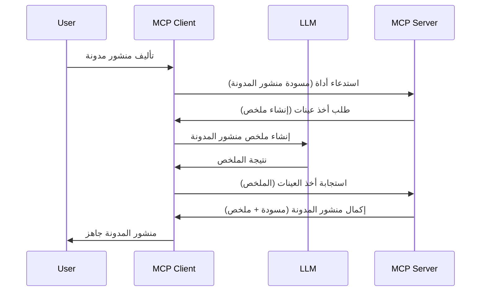

# التجميع - تفويض الميزات إلى العميل

> **إشعار الإيقاف:** تشير نسخة المرشح لمواصفة MCP بتاريخ `2026-07-28` إلى أن التجميع لم يعد مستحبًا لصالح التكامل المباشر مع واجهات برمجة تطبيقات مزودي LLM. يستمر التجميع في العمل في إصدار `2025-11-25` ولمدة عام على الأقل بعد أي إيقاف رسمي، لذا كل ما في هذا الدرس يظل صالحًا — ولكن يجب على التصاميم الجديدة للخادم تقييم نمط الاستبدال. راجع [ما الجديد في MCP: نسخة المرشح لإصدار 2026-07-28](../../01-CoreConcepts/mcp-2026-07-28-release-candidate.md).

أحيانًا، تحتاج إلى تعاون بين عميل MCP وخادم MCP لتحقيق هدف مشترك. قد تكون في حالة يتطلب فيها الخادم مساعدة LLM موجود على العميل. لهذا الوضع، ينبغي عليك استخدام التجميع.

لنتعرف على بعض حالات الاستخدام وكيفية بناء حل يشمل التجميع.

## نظرة عامة

في هذا الدرس، نركز على شرح متى وأين نستخدم التجميع وكيفية تكوينه.

## أهداف التعلم

في هذا الفصل، سوف:

- نشرح ما هو التجميع ومتى يُستخدم.
- نستعرض كيفية تكوين التجميع في MCP.
- نقدم أمثلة على التجميع في التطبيق.

## ما هو التجميع ولماذا نستخدمه؟

التجميع ميزة متقدمة تعمل بالطريقة التالية:



### طلب التجميع

حسنًا، لدينا الآن نظرة شاملة على سيناريو معقول، لنتحدث عن طلب التجميع الذي يرسله الخادم إلى العميل. هذا ما قد يبدو عليه هذا الطلب بصيغة JSON-RPC:

```json
{
  "jsonrpc": "2.0",
  "id": 1,
  "method": "sampling/createMessage",
  "params": {
    "messages": [
      {
        "role": "user",
        "content": {
          "type": "text",
          "text": "Create a blog post summary of the following blog post: <BLOG POST>"
        }
      }
    ],
    "modelPreferences": {
      "hints": [
        {
          "name": "claude-3-sonnet"
        }
      ],
      "intelligencePriority": 0.8,
      "speedPriority": 0.5
    },
    "systemPrompt": "You are a helpful assistant.",
    "maxTokens": 100
  }
}
```

هناك بعض الأمور الجديرة بالذكر هنا:

- الموجه، تحت content -> text، هو موجهنا الذي هو تعليمات لـ LLM لتلخيص محتوى منشور المدونة.

- **modelPreferences**. هذا القسم هو فقط تفضيل، توصية حول كيفية تكوين LLM. يمكن للمستخدم اختيار اتباع هذه التوصيات أو تعديلها. في هذه الحالة هناك توصيات حول النموذج المستخدم وأولوية السرعة والذكاء.
- **systemPrompt**، هذا هو موجه النظام العادي الخاص بك الذي يعطي LLM شخصية ويحتوي إرشادات توجيهية.
- **maxTokens**، هذه خاصية أخرى تستخدم لتحديد عدد الرموز الموصى باستخدامها لهذه المهمة.

### استجابة التجميع

هذه الاستجابة ما ينتهي المطاف بأن يرسله عميل MCP إلى خادم MCP وهي نتيجة استدعاء العميل لـ LLM، انتظار تلك الاستجابة ثم إنشاء هذه الرسالة. هذا ما قد تبدو عليه بصيغة JSON-RPC:

```json
{
  "jsonrpc": "2.0",
  "id": 1,
  "result": {
    "role": "assistant",
    "content": {
      "type": "text",
      "text": "Here's your abstract <ABSTRACT>"
    },
    "model": "gpt-5",
    "stopReason": "endTurn"
  }
}
```

لاحظ كيف أن الاستجابة تمثل ملخصًا لمقال المدونة كما طلبنا. ولاحظ أيضًا أن النموذج المستخدم `model` ليس ما طلبناه بل "gpt-5" بدلاً من "claude-3-sonnet". هذا لتوضيح أن المستخدم يمكنه تغيير رأيه حول ما يريد استخدامه وأن طلب التجميع هو مجرد توصية.

حسنًا، الآن بعد أن فهمنا التدفق الرئيسي، والمهمة المفيدة لاستخدامه "إنشاء منشور مدونة + ملخص"، دعنا نرى ما نحتاج لفعله لجعله يعمل.

### أنواع الرسائل

رسائل التجميع ليست مقيدة بالنص فقط، بل يمكنك أيضًا إرسال الصور والصوت. إليك كيف تبدو JSON-RPC مختلفة:

**نص**

```json
{
  "type": "text",
  "text": "The message content"
}
```

**محتوى صورة**

```json
{
  "type": "image",
  "data": "base64-encoded-image-data",
  "mimeType": "image/jpeg"
}
```

**محتوى صوت**

```json
{
  "type": "audio",
  "data": "base64-encoded-audio-data",
  "mimeType": "audio/wav"
}
```

> ملاحظة: لمزيد من المعلومات التفصيلية حول التجميع، راجع [الوثائق الرسمية](https://modelcontextprotocol.io/specification/2025-11-25/client/sampling)

## كيفية تكوين التجميع في العميل

> ملاحظة: إذا كنت تبني خادمًا فقط، فلا تحتاج إلى الكثير هنا.

في العميل، تحتاج إلى تحديد الميزة التالية هكذا:

```json
{
  "capabilities": {
    "sampling": {}
  }
}
```

سيتم بعدها التقاطها عندما يبدأ العميل المختار الاتصال بالخادم.

## مثال على التجميع في التطبيق - إنشاء منشور مدونة

لنبرمج خادم تجميع معًا، ونحن بحاجة إلى عمل التالي:

1. إنشاء أداة على الخادم.
1. يجب أن تنشئ هذه الأداة طلب تجميع
1. يجب أن تنتظر الأداة رد طلب التجميع من العميل.
1. ثم يجب أن يتم إنتاج نتيجة الأداة.

لنطلع على الكود خطوة بخطوة:

### -1- إنشاء الأداة

**python**

```python
@mcp.tool()
async def create_blog(title: str, content: str, ctx: Context[ServerSession, None]) -> str:
    """Create a blog post and generate a summary"""

```

### -2- إنشاء طلب تجميع

وسع أداتك بالكود التالي:

**python**

```python
post = BlogPost(
        id=len(posts) + 1,
        title=title,
        content=content,
        abstract=""
    )

prompt = f"Create an abstract of the following blog post: title: {title} and draft: {content} "

result = await ctx.session.create_message(
        messages=[
            SamplingMessage(
                role="user",
                content=TextContent(type="text", text=prompt),
            )
        ],
        max_tokens=100,
)

```

### -3- انتظر الرد وأعد الرد

**python**

```python
post.abstract = result.content.text

posts.append(post)

# إرجاع المنتج الكامل
return json.dumps({
    "id": post.title,
    "abstract": post.abstract
})
```

### -4- الكود الكامل

**python**

```python
from starlette.applications import Starlette
from starlette.routing import Mount, Host

from mcp.server.fastmcp import Context, FastMCP

from mcp.server.session import ServerSession
from mcp.types import SamplingMessage, TextContent

import json


from uuid import uuid4
from typing import List
from pydantic import BaseModel


mcp = FastMCP("Blog post generator")

# التطبيق = FastAPI()

posts = []

class BlogPost(BaseModel):
    id: int
    title: str
    content: str
    abstract: str

posts: List[BlogPost] = []

@mcp.tool()
async def create_blog(title: str, content: str, ctx: Context[ServerSession, None]) -> str:
    """Create a blog post and generate a summary"""

    post = BlogPost(
        id=len(posts) + 1,
        title=title,
        content=content,
        abstract=""
    )

    prompt = f"Create an abstract of the following blog post: title: {title} and draft: {content} "

    result = await ctx.session.create_message(
        messages=[
            SamplingMessage(
                role="user",
                content=TextContent(type="text", text=prompt),
            )
        ],
        max_tokens=100,
    )

    post.abstract = result.content.text

    posts.append(post)

    # إرجاع المقالة الكاملة للمدونة
    return json.dumps({
        "id": post.title,
        "abstract": post.abstract
    })

if __name__ == "__main__":
    print("Starting server...")
    # mcp.run()
    mcp.run(transport="streamable-http")

# تشغيل التطبيق بواسطة: python server.py
```

### -5- اختبار ذلك في Visual Studio Code

لاختبار هذا في Visual Studio Code، قم بالتالي:

1. شغل الخادم في الطرفية
1. أضفه إلى *mcp.json* (وتأكد من تشغيله) مثلاً مثل التالي:

   ```json
   "servers": {
      "blog-server": {
        "type": "http",
        "url": "http://localhost:8000/mcp"
      }
   }
   ```

1. اكتب موجهًا:

   ```text
   create a blog post named "Where Python comes from", the content is "Python is actually named after Monty Python Flying Circus"
   ```

1. اسمح بالتجميع أن يحدث. في الاختبار الأول ستُعرض عليك نافذة حوار إضافية تحتاج إلى قبولها، ثم سترى نافذة الحوار العادية تطلب منك تشغيل أداة.

1. تفقد النتائج. سترى النتائج معروضة بشكل جميل في GitHub Copilot Chat لكن يمكنك أيضًا تفقد استجابة JSON الخام.

**مكافأة**. أدوات Visual Studio Code تدعم التجميع بشكل ممتاز. يمكنك تكوين وصول التجميع على الخادم المثبّت لديك عن طريق التصفح كالتالي:

1. انتقل إلى قسم الإضافات.
1. حدد رمز الترس لخادمك المثبّت في قسم "MCP SERVERS - INSTALLED".
1 اختر "Configure Model Access"، هنا يمكنك اختيار النماذج التي يسمح GitHub Copilot باستخدامها عند إجراء التجميع. يمكنك أيضًا رؤية كل طلبات التجميع التي حدثت مؤخرًا عبر اختيار "Show Sampling requests".

## المهمة

في هذه المهمة، ستبني نوعًا مختلفًا قليلاً من التجميع وهو تكامل تجميع يدعم توليد وصف المنتج. هذا هو السيناريو الخاص بك:

**السيناريو**: يحتاج الموظف في المكتب الخلفي لمتجر إلكتروني إلى مساعدة، حيث يستغرق توليد أوصاف المنتجات وقتًا طويلاً جدًا. لذلك، عليك بناء حل يمكن خلاله استدعاء أداة "create_product" مع "title" و "keywords" كوسائط وينبغي أن تنتج منتجًا كاملاً يتضمن حقل "description" الذي يجب ملؤه بواسطة LLM العميل.

تلميح: استخدم ما تعلمته سابقًا لبناء هذا الخادم وأداته باستخدام طلب تجميع.

## الحل

[الحل](./solution/README.md)

## النقاط الرئيسية

التجميع ميزة قوية تسمح للخادم بتفويض المهام إلى العميل عند حاجته لمساعدة من LLM.

## ما التالي

- [الفصل 4 - التنفيذ العملي](../../04-PracticalImplementation/README.md)

---

<!-- CO-OP TRANSLATOR DISCLAIMER START -->
**تنويه**:
تمت ترجمة هذا المستند باستخدام خدمة الترجمة بالذكاء الاصطناعي [Co-op Translator](https://github.com/Azure/co-op-translator). بينما نسعى للدقة، يرجى العلم أن الترجمات الآلية قد تحتوي على أخطاء أو عدم دقة. يجب اعتبار المستند الأصلي بلغته الأصلية المصدر الرسمي والمعتمد. للمعلومات الهامة، يُنصح بالاستعانة بترجمة بشرية محترفة. نحن غير مسؤولين عن أي سوء فهم أو تفسير ناتج عن استخدام هذه الترجمة.
<!-- CO-OP TRANSLATOR DISCLAIMER END -->