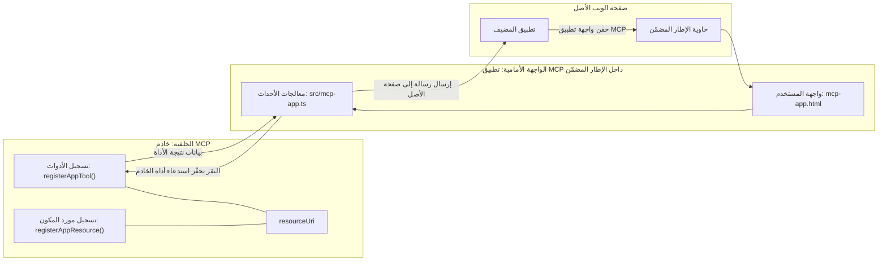
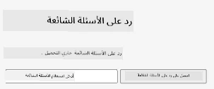
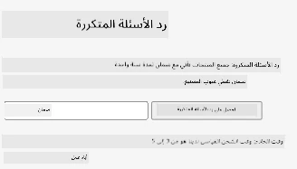
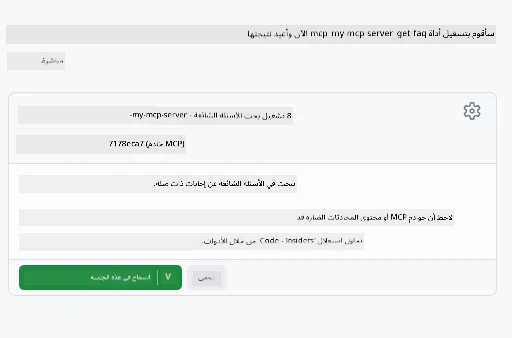
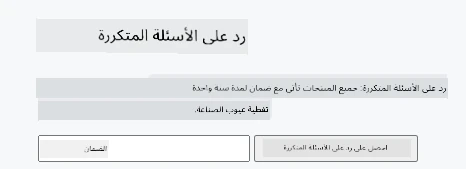

# تطبيقات MCP

تطبيقات MCP هي نموذج جديد في MCP. الفكرة هي أنه ليس فقط يمكنك الرد ببيانات من نداء أداة، بل تقدم أيضًا معلومات حول كيفية التفاعل مع هذه المعلومات. هذا يعني أن نتائج الأدوات يمكن أن تحتوي الآن على معلومات واجهة المستخدم. لكن لماذا نريد ذلك؟ حسنًا، فكر في كيف تفعل الأشياء اليوم. من المحتمل أنك تستهلك نتائج خادم MCP عن طريق وضع نوع من الواجهة الأمامية أمامه، وهذا كود تحتاج إلى كتابته وصيانته. أحيانًا يكون هذا ما تريده، ولكن أحيانًا سيكون من الرائع إذا كان بإمكانك فقط إدخال قطعة من المعلومات مكتفية ذاتيًا تحتوي على كل شيء من البيانات إلى واجهة المستخدم.

## نظرة عامة

تقدم هذه الدرس إرشادات عملية حول تطبيقات MCP، كيفية البدء بها وكيفية دمجها في تطبيقات الويب الموجودة لديك. تطبيقات MCP هي إضافة جديدة جدًا لمعيار MCP.

## أهداف التعلم

بنهاية هذا الدرس، ستكون قادرًا على:

- شرح ما هي تطبيقات MCP.
- متى تستخدم تطبيقات MCP.
- بناء ودمج تطبيقات MCP الخاصة بك.

## تطبيقات MCP - كيف تعمل

الفكرة مع تطبيقات MCP هي تقديم استجابة في الأساس هي مكون ليتم عرضه. يمكن لمثل هذا المكون أن يحتوي على كل من المرئيات والتفاعلية، مثل ضغط الأزرار، إدخال المستخدم والمزيد. لنبدأ بجانب الخادم وخادم MCP الخاص بنا. لإنشاء مكون تطبيق MCP تحتاج إلى إنشاء أداة ولكن أيضًا مورد التطبيق. هذان الجزآن متصلان بواسطة resourceUri.

إليك مثالًا. دعنا نحاول تصور ما هو متضمن وأي الأجزاء تقوم بماذا:

```text
server.ts -- responsible for registering tools and the component as a UI component
src/
  mcp-app.ts -- wiring up event handlers
mcp-app.html -- the user interface
```

تصف هذه الصورة المعمارية لإنشاء مكون ومنطقته.


دعنا نحاول وصف المسؤوليات بعد ذلك للواجهة الخلفية والواجهة الأمامية على التوالي.

### الواجهة الخلفية

هناك شيئين نحتاج إلى تحقيقهما هنا:

- تسجيل الأدوات التي نريد التفاعل معها.
- تعريف المكون.

**تسجيل الأداة**

```typescript
registerAppTool(
    server,
    "get-time",
    {
      title: "Get Time",
      description: "Returns the current server time.",
      inputSchema: {},
      _meta: { ui: { resourceUri } }, // يربط هذه الأداة بمورد واجهة المستخدم الخاصة بها
    },
    async () => {
      const time = new Date().toISOString();
      return { content: [{ type: "text", text: time }] };
    },
  );

```

يصف الكود السابق السلوك، حيث يكشف عن أداة تسمى `get-time`. لا تأخذ أي مدخلات لكنها تنتج الوقت الحالي في النهاية. لدينا القدرة على تعريف `inputSchema` للأدوات حيث نحتاج إلى قبول إدخال المستخدم.

**تسجيل المكون**

في نفس الملف، نحتاج أيضًا إلى تسجيل المكون:

```typescript
const resourceUri = "ui://get-time/mcp-app.html";

// تسجيل المورد، والذي يعيد كود HTML/JavaScript المدمج لواجهة المستخدم.
registerAppResource(
  server,
  resourceUri,
  resourceUri,
  { mimeType: RESOURCE_MIME_TYPE },
  async () => {
    const html = await fs.readFile(path.join(DIST_DIR, "mcp-app.html"), "utf-8");

    return {
    contents: [
        { uri: resourceUri, mimeType: RESOURCE_MIME_TYPE, text: html },
    ],
    };
  },
);
```

لاحظ كيف نذكر `resourceUri` لربط المكون بأدواته. وما يهم أيضًا هو رد النداء حيث نقوم بتحميل ملف واجهة المستخدم وإرجاع المكون.

### الواجهة الأمامية للمكون

تمامًا مثل الواجهة الخلفية، هناك جزأين هنا:

- واجهة أمامية مكتوبة بـ HTML نقي.
- كود يتعامل مع الأحداث وماذا يفعل، مثل استدعاء الأدوات أو مراسلة نافذة الأب.

**واجهة المستخدم**

لنلقي نظرة على واجهة المستخدم.

```html
<!-- mcp-app.html -->
<!DOCTYPE html>
<html lang="en">
  <head>
    <meta charset="UTF-8" />
    <title>Get Time App</title>
  </head>
  <body>
    <p>
      <strong>Server Time:</strong> <code id="server-time">Loading...</code>
    </p>
    <button id="get-time-btn">Get Server Time</button>
    <script type="module" src="/src/mcp-app.ts"></script>
  </body>
</html>
```

**ربط الأحداث**

الجزء الأخير هو ربط الأحداث. هذا يعني أننا نحدد أي جزء في واجهة المستخدم يحتاج إلى معالجات أحداث وماذا نفعل إذا تم رفع الأحداث:

```typescript
// mcp-app.ts

import { App } from "@modelcontextprotocol/ext-apps";

// الحصول على مراجع العناصر
const serverTimeEl = document.getElementById("server-time")!;
const getTimeBtn = document.getElementById("get-time-btn")!;

// إنشاء مثيل التطبيق
const app = new App({ name: "Get Time App", version: "1.0.0" });

// معالجة نتائج الأدوات من الخادم. ضعها قبل `app.connect()` لتجنب
// فقدان نتيجة الأداة الأولية.
app.ontoolresult = (result) => {
  const time = result.content?.find((c) => c.type === "text")?.text;
  serverTimeEl.textContent = time ?? "[ERROR]";
};

// ربط نقر الزر
getTimeBtn.addEventListener("click", async () => {
  // `app.callServerTool()` يسمح للواجهة بطلب بيانات جديدة من الخادم
  const result = await app.callServerTool({ name: "get-time", arguments: {} });
  const time = result.content?.find((c) => c.type === "text")?.text;
  serverTimeEl.textContent = time ?? "[ERROR]";
});

// الاتصال بالمضيف
app.connect();
```

كما ترى من أعلاه، هذا كود عادي لربط عناصر DOM بالأحداث. من الجدير بالذكر استدعاء `callServerTool` الذي ينتهي باستدعاء أداة في الواجهة الخلفية.

## التعامل مع إدخال المستخدم

حتى الآن، رأينا مكونًا يحتوي على زر عندما يتم النقر عليه يستدعي أداة. دعنا نرى إذا كان بإمكاننا إضافة المزيد من عناصر واجهة المستخدم مثل حقل إدخال ونرى إذا كان بإمكاننا إرسال وسيطات إلى أداة. لنقم بتنفيذ وظيفة الأسئلة المتكررة (FAQ). إليك كيف يجب أن تعمل:

- يجب أن يكون هناك زر وعنصر إدخال حيث يكتب المستخدم كلمة مفتاحية للبحث مثلًا "الشحن". يجب أن تستدعي هذه أداة في الواجهة الخلفية تقوم ببحث في بيانات الأسئلة المتكررة.
- أداة تدعم بحث الأسئلة المتكررة المذكور.

لنضف الدعم اللازم للواجهة الخلفية أولاً:

```typescript
const faq: { [key: string]: string } = {
    "shipping": "Our standard shipping time is 3-5 business days.",
    "return policy": "You can return any item within 30 days of purchase.",
    "warranty": "All products come with a 1-year warranty covering manufacturing defects.",
  }

registerAppTool(
    server,
    "get-faq",
    {
      title: "Search FAQ",
      description: "Searches the FAQ for relevant answers.",
      inputSchema: zod.object({
        query: zod.string().default("shipping"),
      }),
      _meta: { ui: { resourceUri: faqResourceUri } }, // يربط هذه الأداة بمورد واجهة المستخدم الخاصة بها
    },
    async ({ query }) => {
      const answer: string = faq[query.toLowerCase()] || "Sorry, I don't have an answer for that.";
      return { content: [{ type: "text", text: answer }] };
    },
  );
```

ما نراه هنا هو كيف نملأ `inputSchema` ونعطيه مخطط `zod` كما يلي:

```typescript
inputSchema: zod.object({
  query: zod.string().default("shipping"),
})
```

في المخطط أعلاه نعلن أن لدينا معلمة إدخال تسمى `query` وأنها اختيارية بقيمة افتراضية "shipping".

حسنًا، لننتقل إلى *mcp-app.html* لنرى واجهة المستخدم التي نحتاج لإنشائها لهذا:

```html
<div class="faq">
    <h1>FAQ response</h1>
    <p>FAQ Response: <code id="faq-response">Loading...</code></p>
    <input type="text" id="faq-query" placeholder="Enter FAQ query" />
    <button id="get-faq-btn">Get FAQ Response</button>
  </div>
```

رائع، الآن لدينا عنصر إدخال وزر. دعنا نذهب إلى *mcp-app.ts* بعد ذلك لربط هذه الأحداث:

```typescript
const getFaqBtn = document.getElementById("get-faq-btn")!;
const faqQueryInput = document.getElementById("faq-query") as HTMLInputElement;

getFaqBtn.addEventListener("click", async () => {
  const query = faqQueryInput.value;
  const result = await app.callServerTool({ name: "get-faq", arguments: { query } });
  const faq = result.content?.find((c) => c.type === "text")?.text;
  faqResponseEl.textContent = faq ?? "[ERROR]";
});
```

في الكود أعلاه قمنا بـ:

- إنشاء مراجع لعناصر واجهة المستخدم المهمة.
- التعامل مع نقر الزر لتحليل قيمة عنصر الإدخال كما نستدعي `app.callServerTool()` مع `name` و `arguments` حيث يتم تمرير `query` كقيمة.

ما يحدث فعليًا عند استدعاء `callServerTool` هو أنه يرسل رسالة إلى نافذة الأب وتقوم تلك النافذة باستدعاء خادم MCP.

### جربها

بتجربة هذا يجب أن نرى ما يلي:



وهنا نحاولها بإدخال مثل "warranty"



لتشغيل هذا الكود، توجه إلى [قسم الكود](./code/README.md)

## الاختبار في Visual Studio Code

لدى Visual Studio Code دعم رائع لـ MVP Apps وربما هو من أسهل الطرق لاختبار تطبيقات MCP الخاصة بك. لاستخدام Visual Studio Code، أضف مدخلًا للخادم إلى *mcp.json* كما يلي:

```json
"my-mcp-server-7178eca7": {
    "url": "http://localhost:3001/mcp",
    "type": "http"
  }
```

ثم ابدأ الخادم، يجب أن تكون قادرًا على التواصل مع تطبيق MVP الخاص بك من خلال نافذة الدردشة بشرط أن تكون قد ثبتت GitHub Copilot.

عن طريق التشغيل عبر الموجه، على سبيل المثال "#get-faq":



وكما فعلت عندما قمت بتشغيله عبر متصفح الويب، يعرض بنفس الطريقة كما يلي:



## المهمة

أنشئ لعبة حجر ورقة مقص. يجب أن تتكون مما يلي:

واجهة المستخدم:

- قائمة منسدلة مع خيارات
- زر لتقديم اختيار
- تسمية تعرض من اختار ماذا ومن فاز

الخادم:

- يجب أن يحتوي على أداة حجر ورقة مقص التي تأخذ "choice" كمدخل. يجب أيضًا أن تعرض خيار الكمبيوتر وتحدد الفائز

## الحل

[الحل](./assignment/README.md)

## الملخص

تعلمنا عن هذا النموذج الجديد تطبيقات MCP. إنه نموذج جديد يسمح لخوادم MCP بأن يكون لها رأي ليس فقط في البيانات بل أيضًا في كيفية تقديم هذه البيانات.

بالإضافة إلى ذلك، تعلمنا أن هذه التطبيقات تستضاف داخل IFrame وللتواصل مع خوادم MCP تحتاج إلى إرسال رسائل إلى تطبيق الويب الأب. هناك عدة مكتبات متاحة لكل من JavaScript العادي وReact والمزيد تجعل هذا التواصل أسهل.

## النقاط الرئيسية

إليك ما تعلمته:

- تطبيقات MCP هو معيار جديد يمكن أن يكون مفيدًا عندما تريد شحن البيانات وميزات واجهة المستخدم معًا.
- هذه التطبيقات تعمل داخل IFrame لأسباب تتعلق بالأمان.

## ماذا بعد

- [الفصل 4](../../04-PracticalImplementation/README.md)

---

<!-- CO-OP TRANSLATOR DISCLAIMER START -->
**إخلاء المسؤولية**:
تم ترجمة هذا المستند باستخدام خدمة الترجمة الآلية [Co-op Translator](https://github.com/Azure/co-op-translator). بينما نسعى لتحقيق الدقة، يرجى العلم أن الترجمات الآلية قد تحتوي على أخطاء أو عدم دقة. يجب اعتبار المستند الأصلي بلغته الأصلية المصدر الموثوق والمعتمد. للحصول على معلومات مهمة، يُنصح بالترجمة الاحترافية البشرية. نحن غير مسؤولين عن أي سوء فهم أو تفسير ناتج عن استخدام هذه الترجمة.
<!-- CO-OP TRANSLATOR DISCLAIMER END -->