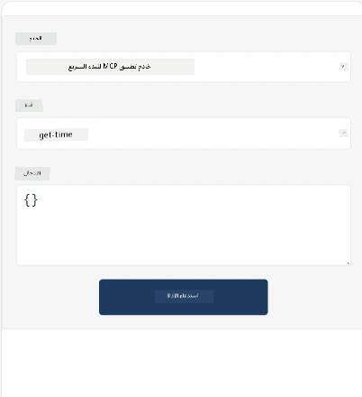
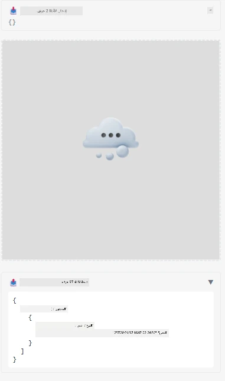

إليك نموذجًا يوضح تطبيق MCP

## التثبيت

1. انتقل إلى مجلد *mcp-app*
1. شغّل `npm install`، يجب أن يثبت هذا اعتماديات الواجهة الأمامية والخلفية

تحقق من تجميع الخلفية عن طريق تشغيل:

```sh
npx tsc --noEmit
```

يجب ألا يكون هناك أي مخرجات إذا كان كل شيء على ما يرام.

## تشغيل الخلفية

> يتطلب هذا بعض العمل الإضافي إذا كنت تستخدم جهاز ويندوز لأن حل تطبيقات MCP يستخدم مكتبة `concurrently` للتشغيل، وستحتاج إلى إيجاد بديل لها. إليك السطر المعني في *package.json* الخاص بتطبيق MCP:

    ```json
    "start": "concurrently \"cross-env NODE_ENV=development INPUT=mcp-app.html vite build --watch\" \"tsx watch main.ts\""
    ```

هذا التطبيق يتكوّن من جزئين، جزء خلفي وجزء مضيف.

ابدأ الجزء الخلفي بالنداء:

```sh
npm start
```

هذا يجب أن يشغل الخلفية على `http://localhost:3001/mcp`.

> ملاحظة، إذا كنت في Codespace، قد تحتاج إلى تعيين رؤية المنفذ إلى عام. تحقق من إمكانية الوصول إلى نقطة النهاية في المتصفح عبر https://<name of Codespace>.app.github.dev/mcp

## الخيار -1- اختبار التطبيق في Visual Studio Code

لاختبار الحل في Visual Studio Code، قم بما يلي:

- أضف إدخال خادم إلى `mcp.json` كما يلي:

    ```json
    {
        "servers": {
            "my-mcp-server-7178eca7": {
                "url": "http://localhost:3001/mcp",
                "type": "http"
            }
        },
        "inputs": []
    }
    ```

1. انقر على زر "start" في *mcp.json*
1. تأكد من فتح نافذة الدردشة واكتب `get-faq`، يجب أن ترى نتيجة مثل هذه:

    

## الخيار -2- اختبار التطبيق باستخدام مضيف

يحتوي المستودع <https://github.com/modelcontextprotocol/ext-apps> على عدة مضيفين مختلفين يمكنك استخدامهم لاختبار تطبيقات MVP الخاصة بك.

سنقدم لك خيارين مختلفين هنا:

### الجهاز المحلي

- انتقل إلى *ext-apps* بعد أن تستنسخ المستودع.

- ثبت الاعتماديات

   ```sh
   npm install
   ```

- في نافذة طرفية منفصلة، انتقل إلى *ext-apps/examples/basic-host*

    > إذا كنت في Codespace، تحتاج إلى الذهاب إلى serve.ts والسطر 27 واستبدال http://localhost:3001/mcp بعنوان URL الخاص بـ Codespace للخلفية، مثلًا https://psychic-xylophone-657rpjgvxpc5g64-3001.app.github.dev/mcp

- شغّل المضيف:

    ```sh
    npm start
    ```

    يجب أن يربط هذا المضيف بالخلفية ويجب أن ترى التطبيق يعمل كما يلي:

    

### Codespace

يتطلب الأمر بعض العمل الإضافي لجعل بيئة Codespace تعمل. لاستخدام مضيف من خلال Codespace:

- راجع دليل *ext-apps* وانتقل إلى *examples/basic-host*.
- شغّل `npm install` لتثبيت الاعتماديات
- شغّل `npm start` لبدء المضيف.

## تجربة التطبيق

جرب التطبيق بالطريقة التالية:

- اختر زر "Call Tool" ويجب أن ترى النتائج كما يلي:

    

رائع، كل شيء يعمل.

---

<!-- CO-OP TRANSLATOR DISCLAIMER START -->
**تنويه**:
تمت ترجمة هذا المستند باستخدام خدمة الترجمة الآلية [Co-op Translator](https://github.com/Azure/co-op-translator). على الرغم من سعينا للدقة، يرجى العلم أن الترجمات الآلية قد تحتوي على أخطاء أو عدم دقة. يجب اعتبار الوثيقة الأصلية بلغتها الأصلية هي المصدر الرسمي والمعتمد. للمعلومات الحساسة أو الهامة، يُنصح بالاستعانة بترجمة بشرية محترفة. نحن غير مسؤولين عن أي سوء فهم أو تفسير ناتج عن استخدام هذه الترجمة.
<!-- CO-OP TRANSLATOR DISCLAIMER END -->