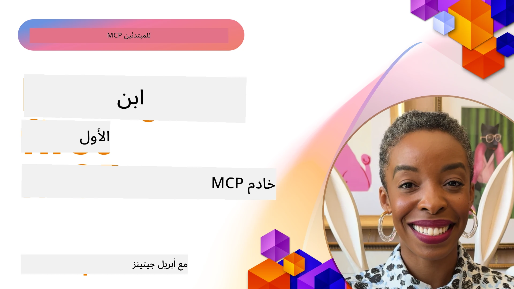

## بدء الاستخدام  

_(انقر على الصورة أعلاه لمشاهدة فيديو هذا الدرس)_

تتكون هذه القسم من عدة دروس:

- **1 خادمك الأول**، في هذا الدرس الأول، ستتعلم كيفية إنشاء خادمك الأول وفحصه باستخدام أداة المفتش، وهي طريقة قيمة لاختبار وتصحيح الخادم، [إلى الدرس](01-first-server/README.md)

- **2 العميل**، في هذا الدرس، ستتعلم كيفية كتابة عميل يمكنه الاتصال بخادمك، [إلى الدرس](02-client/README.md)

- **3 العميل مع LLM**، طريقة أفضل لكتابة عميل هي بإضافة LLM إليه بحيث يمكنه "التفاوض" مع خادمك حول ما يجب فعله، [إلى الدرس](03-llm-client/README.md)

- **4 استخدام وضع وكيل GitHub Copilot في Visual Studio Code**. هنا، ننظر إلى تشغيل خادم MCP من داخل Visual Studio Code، [إلى الدرس](04-vscode/README.md)

- **5 خادم النقل stdio** نقل stdio هو المعيار الموصى به للتواصل المحلي بين خادم MCP والعميل، ويوفر اتصال آمن قائم على العمليات الفرعية مع عزل مدمج للعمليات [إلى الدرس](05-stdio-server/README.md)

- **6 البث HTTP مع MCP (HTTP قابل للبث)**. تعلّم حول نقل بث HTTP الحديث (النهج الموصى به لخوادم MCP البعيدة وفقًا لـ [مواصفة MCP 2025-11-25](https://spec.modelcontextprotocol.io/specification/2025-11-25/basic/transports/#streamable-http))، إشعارات التقدم، وكيفية تنفيذ خوادم وعملاء MCP قابلة للتوسع في الوقت الحقيقي باستخدام HTTP القابل للبث. [إلى الدرس](06-http-streaming/README.md)

- **7 استخدام مجموعة أدوات الذكاء الاصطناعي لـ VSCode** لاستهلاك واختبار عملاء وخوادم MCP الخاصة بك [إلى الدرس](07-aitk/README.md)

- **8 الاختبار**. هنا سوف نركز بشكل خاص على كيفية اختبار خادمنا وعميلنا بطرق مختلفة، [إلى الدرس](08-testing/README.md)

- **9 النشر**. هذه الفصل سينظر في طرق مختلفة لنشر حلول MCP الخاصة بك، [إلى الدرس](09-deployment/README.md)

- **10 الاستخدام المتقدم للخادم**. يغطي هذا الفصل الاستخدام المتقدم للخادم، [إلى الدرس](./10-advanced/README.md)

- **11 المصادقة**. يتناول هذا الفصل كيفية إضافة مصادقة بسيطة، من المصادقة الأساسية إلى استخدام JWT وRBAC. يُشجع على البدء هنا ثم الاطلاع على المواضيع المتقدمة في الفصل 5 وأداء تعزيز أمني إضافي عبر التوصيات في الفصل 2، [إلى الدرس](./11-simple-auth/README.md)

- **12 مضيفو MCP**. تكوين واستخدام عملاء MCP شائعين مثل Claude Desktop وCursor وCline وWindsurf. تعلّم أنواع النقل واستكشاف الأخطاء وإصلاحها، [إلى الدرس](./12-mcp-hosts/README.md)

- **13 مفتش MCP**. تصحيح واختبار خوادم MCP الخاصة بك تفاعليًا باستخدام أداة MCP Inspector. تعلّم استكشاف الأخطاء وأدواتها ومواردها ورسائل البروتوكول، [إلى الدرس](./13-mcp-inspector/README.md)

- **14 أخذ العينات**. إنشاء خوادم MCP تتعاون مع عملاء MCP في مهام مرتبطة بـ LLM. [إلى الدرس](./14-sampling/README.md)

- **15 تطبيقات MCP**. بناء خوادم MCP التي ترد أيضًا بتعليمات واجهة المستخدم، [إلى الدرس](./15-mcp-apps/README.md)

بروتوكول سياق النموذج (MCP) هو بروتوكول مفتوح يوحّد كيفية توفير التطبيقات للسياق لنماذج اللغة الكبيرة. اعتبر MCP كمنفذ USB-C لتطبيقات الذكاء الاصطناعي - فهو يوفر طريقة موحدة لربط نماذج الذكاء الاصطناعي بمصادر بيانات مختلفة وأدوات.

## أهداف التعلم

بحلول نهاية هذا الدرس، ستكون قادرًا على:

- إعداد بيئات التطوير لـ MCP في C# وJava وPython وTypeScript وJavaScript
- بناء ونشر خوادم MCP الأساسية مع ميزات مخصصة (الموارد، المطالبات، والأدوات)
- إنشاء تطبيقات مضيفة تتصل بخوادم MCP
- اختبار وتصحيح تطبيقات MCP
- فهم التحديات الشائعة في الإعداد وحلولها
- ربط تطبيقات MCP الخاصة بك بخدمات LLM الشائعة

## إعداد بيئة MCP الخاصة بك

قبل البدء في العمل مع MCP، من المهم تحضير بيئة التطوير الخاصة بك وفهم سير العمل الأساسي. سيرشدك هذا القسم خلال خطوات الإعداد الأولية لضمان بداية سلسة مع MCP.

### المتطلبات المسبقة

قبل الغوص في تطوير MCP، تأكد من:

- **بيئة التطوير**: للغة المختارة (C# أو Java أو Python أو TypeScript أو JavaScript)
- **بيئة تطوير متكاملة/محرر**: Visual Studio أو Visual Studio Code أو IntelliJ أو Eclipse أو PyCharm أو أي محرر كود حديث
- **مديري الحزم**: NuGet، Maven/Gradle، pip، أو npm/yarn
- **مفاتيح API**: لأي خدمات ذكاء اصطناعي تخطط لاستخدامها في تطبيقات المضيف لديك

### مجموعات تطوير البرامج الرسمية

في الفصول القادمة سترى حلولًا مبنية باستخدام Python وTypeScript وJava و.NET. إليك جميع مجموعات تطوير البرامج المدعومة رسميًا.

يوفر MCP مجموعات تطوير برامج رسمية لعدة لغات (متوافقة مع [مواصفة MCP 2025-11-25](https://spec.modelcontextprotocol.io/specification/2025-11-25/)):
- [مجموعة تطوير C#](https://github.com/modelcontextprotocol/csharp-sdk) - تتم الصيانة بالتعاون مع Microsoft
- [مجموعة تطوير Java](https://github.com/modelcontextprotocol/java-sdk) - تتم الصيانة بالتعاون مع Spring AI
- [مجموعة تطوير TypeScript](https://github.com/modelcontextprotocol/typescript-sdk) - التنفيذ الرسمي لـ TypeScript
- [مجموعة تطوير Python](https://github.com/modelcontextprotocol/python-sdk) - التنفيذ الرسمي لـ Python (FastMCP)
- [مجموعة تطوير Kotlin](https://github.com/modelcontextprotocol/kotlin-sdk) - التنفيذ الرسمي لـ Kotlin
- [مجموعة تطوير Swift](https://github.com/modelcontextprotocol/swift-sdk) - تتم الصيانة بالتعاون مع Loopwork AI
- [مجموعة تطوير Rust](https://github.com/modelcontextprotocol/rust-sdk) - التنفيذ الرسمي لـ Rust
- [مجموعة تطوير Go](https://github.com/modelcontextprotocol/go-sdk) - التنفيذ الرسمي لـ Go

## النقاط الأساسية

- إعداد بيئة تطوير MCP سهل باستخدام مجموعات تطوير البرامج الخاصة بكل لغة
- بناء خوادم MCP يتضمن إنشاء وتسجيل أدوات مع مخططات واضحة
- عملاء MCP يتصلون بالخوادم والنماذج للاستفادة من القدرات الموسعة
- الاختبار والتصحيح ضروريان لتطبيقات MCP موثوقة
- خيارات النشر تتراوح بين التطوير المحلي والحلول السحابية

## الممارسة

لدينا مجموعة من العينات التي تكمل التمارين التي سترىها في جميع فصول هذا القسم. بالإضافة إلى ذلك يحتوي كل فصل على تمارينه وتكليفاته الخاصة

- [حاسبة Java](./samples/java/calculator/README.md)
- [حاسبة .Net](../../../03-GettingStarted/samples/csharp)
- [حاسبة JavaScript](./samples/javascript/README.md)
- [حاسبة TypeScript](./samples/typescript/README.md)
- [حاسبة Python](../../../03-GettingStarted/samples/python)

## موارد إضافية

- [بناء وكلاء باستخدام بروتوكول سياق النموذج على Azure](https://learn.microsoft.com/azure/developer/ai/intro-agents-mcp)
- [MCP البعيد مع تطبيقات Azure الحاوية (Node.js/TypeScript/JavaScript)](https://learn.microsoft.com/samples/azure-samples/mcp-container-ts/mcp-container-ts/)
- [وكيل MCP لـ .NET OpenAI](https://learn.microsoft.com/samples/azure-samples/openai-mcp-agent-dotnet/openai-mcp-agent-dotnet/)

## ما التالي

ابدأ بالدرس الأول: [إنشاء أول خادم MCP لك](01-first-server/README.md)

بمجرد الانتهاء من هذه الوحدة، تابع إلى: [الوحدة 4: التنفيذ العملي](../04-PracticalImplementation/README.md)

---

<!-- CO-OP TRANSLATOR DISCLAIMER START -->
**إخلاء المسؤولية**:  
تمت ترجمة هذا المستند باستخدام خدمة الترجمة الآلية [Co-op Translator](https://github.com/Azure/co-op-translator). بينما نسعى جاهدين لتحقيق الدقة، يرجى العلم أن الترجمات الآلية قد تحتوي على أخطاء أو عدم دقة. يجب اعتبار المستند الأصلي بلغته الأصلية المصدر الموثوق به. للمعلومات الهامة، يُنصح باستخدام ترجمة بشرية احترافية. نحن غير مسؤولين عن أي سوء تفاهم أو تفسيرات خاطئة ناتجة عن استخدام هذه الترجمة.
<!-- CO-OP TRANSLATOR DISCLAIMER END -->