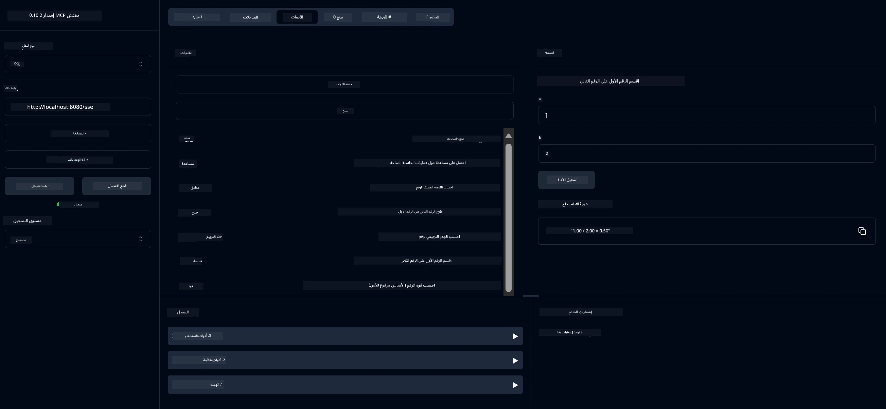

# خدمة آلة حاسبة أساسية MCP  

> [!NOTE]
> تستخدم هذه العينة النقل القديم HTTP+SSE وتهدف إلى SDK متوافق
> مع MCP `2025-11-25`. يجب على الخوادم البعيدة الجديدة استخدام دعم
> HTTP Streamable `2026-07-28`.

تقدم هذه الخدمة عمليات آلة حاسبة أساسية من خلال بروتوكول سياق النموذج (MCP) باستخدام Spring Boot مع نقل WebFlux. تم تصميمها كمثال بسيط للمبتدئين الذين يتعلمون عن تطبيقات MCP.

لمزيد من المعلومات، راجع وثائق المرجع [MCP Server Boot Starter](https://docs.spring.io/spring-ai/reference/api/mcp/mcp-server-boot-starter-docs.html).

## نظرة عامة

تعرض الخدمة:
- دعم SSE (الأحداث المرسلة من الخادم)
- التسجيل التلقائي للأدوات باستخدام تعليق `@Tool` في Spring AI
- وظائف آلة حاسبة أساسية:
  - الجمع والطرح والضرب والقسمة
  - حساب الأس والجذر التربيعي
  - حساب الباقي والقيمة المطلقة
  - وظيفة مساعدة لوصف العمليات

## الميزات

تقدم هذه الخدمة قدرات الآلة الحاسبة التالية:

1. **العمليات الحسابية الأساسية**:
   - جمع عددين
   - طرح عدد من آخر
   - ضرب عددين
   - قسمة عدد على آخر (مع التحقق من القسمة على صفر)

2. **العمليات المتقدمة**:
   - حساب الأس (رفع الأساس إلى الأس)
   - حساب الجذر التربيعي (مع التحقق من الأعداد السالبة)
   - حساب الباقي (المتبقي)
   - حساب القيمة المطلقة

3. **نظام المساعدة**:
   - وظيفة مساعدة مضمنة تشرح جميع العمليات المتاحة

## استخدام الخدمة

تعرض الخدمة نقاط نهاية API التالية عبر بروتوكول MCP:

- `add(a, b)`: جمع عددين معاً
- `subtract(a, b)`: طرح العدد الثاني من الأول
- `multiply(a, b)`: ضرب عددين
- `divide(a, b)`: قسمة العدد الأول على الثاني (مع التحقق من الصفر)
- `power(base, exponent)`: حساب قوة عدد
- `squareRoot(number)`: حساب الجذر التربيعي (مع التحقق من الأعداد السالبة)
- `modulus(a, b)`: حساب الباقي عند القسمة
- `absolute(number)`: حساب القيمة المطلقة
- `help()`: الحصول على معلومات حول العمليات المتاحة

## عميل الاختبار

يتضمن المشروع عميل اختبار بسيط في الحزمة `com.microsoft.mcp.sample.client`. توضح فئة `SampleCalculatorClient` العمليات المتاحة لخدمة الآلة الحاسبة.

## استخدام عميل LangChain4j

يشمل المشروع عميل مثال LangChain4j في `com.microsoft.mcp.sample.client.LangChain4jClient` يوضح كيفية دمج خدمة الآلة الحاسبة مع LangChain4j ونماذج GitHub:

### المتطلبات الأساسية

1. **إعداد رمز GitHub**:
   
   لاستخدام نماذج AI من GitHub (مثل phi-4)، تحتاج إلى رمز وصول شخصي من GitHub:

   أ. اذهب إلى إعدادات حساب GitHub الخاص بك: https://github.com/settings/tokens  
   
   ب. انقر على "Generate new token" → "Generate new token (classic)"
   
   ج. أعطِ رمزك اسمًا وصفياً
   
   د. اختر النطاقات التالية:
      - `repo` (التحكم الكامل بمستودعات خاصة)
      - `read:org` (قراءة عضوية المنظمة والفريق، قراءة مشاريع المنظمة)
      - `gist` (إنشاء gists)
      - `user:email` (الوصول إلى عناوين البريد الإلكتروني للمستخدم (قراءة فقط))
   
   هـ. انقر على "Generate token" ونسخ الرمز الجديد
   
   و. عيّنه كمتغير بيئي:
      
      على ويندوز:
      ```
      set GITHUB_TOKEN=your-github-token
      ```
      
      على ماك/لينكس:
      ```bash
      export GITHUB_TOKEN=your-github-token
      ```

   ز. للإعداد الدائم، أضفه إلى متغيرات البيئة عبر إعدادات النظام

2. أضف تبعية LangChain4j GitHub إلى مشروعك (مضمنة بالفعل في pom.xml):
   ```xml
   <dependency>
       <groupId>dev.langchain4j</groupId>
       <artifactId>langchain4j-github</artifactId>
       <version>${langchain4j.version}</version>
   </dependency>
   ```

3. تأكد من تشغيل خادم الآلة الحاسبة على `localhost:8080`

### تشغيل عميل LangChain4j

يوضح هذا المثال:
- الاتصال بخادم MCP الخاص بالآلة الحاسبة عبر نقل SSE
- استخدام LangChain4j لإنشاء روبوت محادثة يستفيد من عمليات الآلة الحاسبة
- التكامل مع نماذج AI من GitHub (حالياً باستخدام نموذج phi-4)

يرسل العميل استفسارات عينة للتوضيح:
1. حساب مجموع عددين
2. إيجاد الجذر التربيعي لعدد
3. الحصول على معلومات مساعدة حول عمليات الآلة الحاسبة المتاحة

شغّل المثال وراجع مخرجات الكونسول لترى كيف يستخدم نموذج AI أدوات الآلة الحاسبة للرد على الاستفسارات.

### تكوين نموذج GitHub

تم تكوين عميل LangChain4j لاستخدام نموذج phi-4 من GitHub بالإعدادات التالية:

```java
ChatLanguageModel model = GitHubChatModel.builder()
    .apiKey(System.getenv("GITHUB_TOKEN"))
    .timeout(Duration.ofSeconds(60))
    .modelName("phi-4")
    .logRequests(true)
    .logResponses(true)
    .build();
```

لاستخدام نماذج GitHub مختلفة، ببساطة غيّر معامل `modelName` إلى نموذج مدعوم آخر (مثل "claude-3-haiku-20240307"، "llama-3-70b-8192"، إلخ).

## التبعيات

يتطلب المشروع التبعيات الأساسية التالية:

```xml
<!-- For MCP Server -->
<dependency>
    <groupId>org.springframework.ai</groupId>
    <artifactId>spring-ai-starter-mcp-server-webflux</artifactId>
</dependency>

<!-- For LangChain4j integration -->
<dependency>
    <groupId>dev.langchain4j</groupId>
    <artifactId>langchain4j-mcp</artifactId>
    <version>${langchain4j.version}</version>
</dependency>

<!-- For GitHub models support -->
<dependency>
    <groupId>dev.langchain4j</groupId>
    <artifactId>langchain4j-github</artifactId>
    <version>${langchain4j.version}</version>
</dependency>
```

## بناء المشروع

ابنِ المشروع باستخدام Maven:
```bash
./mvnw clean install -DskipTests
```

## تشغيل الخادم

### باستخدام Java

```bash
java -jar target/calculator-server-0.0.1-SNAPSHOT.jar
```

### باستخدام MCP Inspector

MCP Inspector هو أداة مفيدة للتفاعل مع خدمات MCP. لاستخدامه مع خدمة الآلة الحاسبة هذه:

1. **ثبت وشغل MCP Inspector** في نافذة طرفية جديدة:
   ```bash
   npx @modelcontextprotocol/inspector
   ```

2. **ادخل واجهة الويب** بالنقر على عنوان URL الذي يعرضه التطبيق (عادة http://localhost:6274)

3. **قم بتكوين الاتصال**:
   - اضبط نوع النقل إلى "SSE"
   - اضبط URL إلى نقطة نهاية SSE في الخادم الذي يشغل التطبيق: `http://localhost:8080/sse`
   - انقر على "Connect"

4. **استخدم الأدوات**:
   - انقر على "List Tools" لرؤية العمليات المتاحة في الآلة الحاسبة
   - اختر أداة وانقر على "Run Tool" لتنفيذ عملية



### باستخدام Docker

يتضمن المشروع ملف Dockerfile للنشر في حاوية:

1. **بِنِ صورة Docker**:
   ```bash
   docker build -t calculator-mcp-service .
   ```

2. **شغّل حاوية Docker**:
   ```bash
   docker run -p 8080:8080 calculator-mcp-service
   ```

وهذا سوف:
- يبني صورة Docker متعددة المراحل باستخدام Maven 3.9.9 وEclipse Temurin 24 JDK
- ينشئ صورة حاوية محسنة
- يفتح الخدمة على المنفذ 8080
- يشغّل خدمة MCP الآلة الحاسبة داخل الحاوية

يمكنك الوصول إلى الخدمة على `http://localhost:8080` بمجرد تشغيل الحاوية.

## استكشاف الأخطاء وإصلاحها

### المشكلات الشائعة مع رمز GitHub


1. **مشكلات أذونات الرمز المميز**: إذا تلقيت خطأ 403 Forbidden، تحقق من أن الرمز المميز لديك يحتوي على الأذونات الصحيحة كما هو موضح في المتطلبات الأساسية.

2. **الرمز المميز غير موجود**: إذا تلقيت خطأ "No API key found"، تأكد من تعيين متغير البيئة GITHUB_TOKEN بشكل صحيح.

3. **تحديد المعدل**: يحتوي GitHub API على حدود سعرية. إذا واجهت خطأ حد السعر (رمز الحالة 429)، انتظر بضع دقائق قبل المحاولة مرة أخرى.

4. **انتهاء صلاحية الرمز المميز**: يمكن أن تنتهي صلاحية رموز GitHub. إذا استلمت أخطاء مصادقة بعد مرور بعض الوقت، فأنشئ رمزًا جديدًا وقم بتحديث متغير البيئة الخاص بك.

إذا كنت بحاجة إلى المزيد من المساعدة، تحقق من [توثيق LangChain4j](https://github.com/langchain4j/langchain4j) أو [توثيق GitHub API](https://docs.github.com/en/rest).

---

<!-- CO-OP TRANSLATOR DISCLAIMER START -->
**تنويه**:
تمت ترجمة هذا المستند باستخدام خدمة الترجمة بالذكاء الاصطناعي [Co-op Translator](https://github.com/Azure/co-op-translator). بينما نسعى للدقة، يرجى العلم أن الترجمات الآلية قد تحتوي على أخطاء أو عدم دقة. يجب اعتبار المستند الأصلي بلغته الأصلية المصدر الرسمي والمعتمد. للمعلومات الهامة، يُنصح بالاستعانة بترجمة بشرية محترفة. نحن غير مسؤولين عن أي سوء فهم أو تفسير ناتج عن استخدام هذه الترجمة.
<!-- CO-OP TRANSLATOR DISCLAIMER END -->