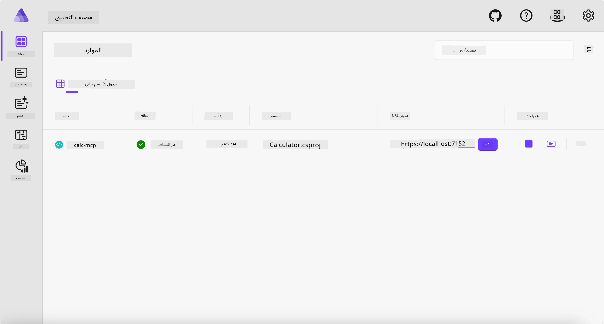
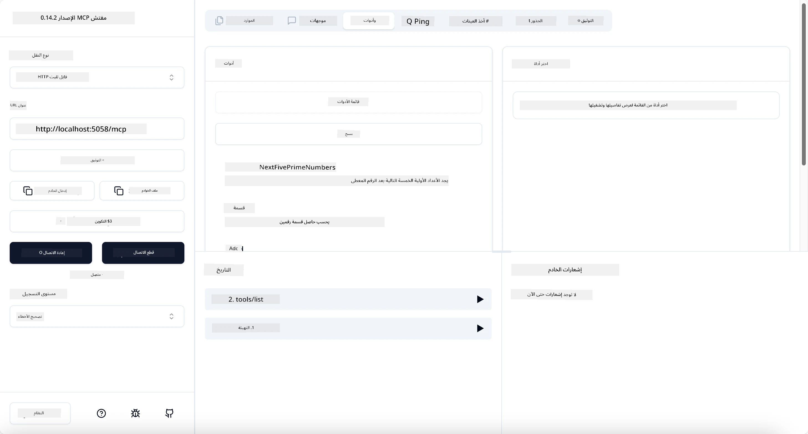
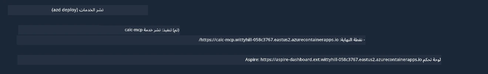

# مثال

يوضح المثال السابق كيفية استخدام مشروع .NET محلي من النوع `stdio`. وكيفية تشغيل الخادم محليًا في حاوية. هذا حل جيد في العديد من الحالات. ومع ذلك، قد يكون من المفيد أن يكون الخادم يعمل عن بُعد، مثل في بيئة سحابية. وهنا يأتي دور النوع `http`.

بالنظر إلى الحل في مجلد `04-PracticalImplementation`، قد يبدو أكثر تعقيدًا بكثير من السابق. لكن في الواقع، ليس كذلك. إذا نظرت عن كثب إلى مشروع `src/Calculator`، ستجد أنه في الغالب نفس الكود كما في المثال السابق. الاختلاف الوحيد هو أننا نستخدم مكتبة مختلفة `ModelContextProtocol.AspNetCore` للتعامل مع طلبات HTTP. ونغير طريقة `IsPrime` لجعلها خاصة، فقط لنُظهر أنه يمكنك أن يكون لديك طرق خاصة في كودك. بقية الكود هي نفسها كما من قبل.

المشاريع الأخرى من [Aspire](https://aspire.dev/get-started/what-is-aspire/). وجود Aspire في الحل سيحسن تجربة المطور أثناء التطوير والاختبار ويساعد في المراقبة. ليس من الضروري تشغيل الخادم، لكنه ممارسة جيدة أن يكون في الحل الخاص بك.

## بدء تشغيل الخادم محليًا

1. من VS Code (مع ملحق C# DevKit)، انتقل إلى دليل `04-PracticalImplementation/samples/csharp`.
1. نفّذ الأمر التالي لبدء الخادم:

   ```bash
    dotnet watch run --project ./src/AppHost
   ```

1. عند فتح متصفح الويب للوحة Aspire، لاحظ عنوان URL الخاص بـ `http`. ينبغي أن يكون شيئًا مثل `http://localhost:5058/`.

   

## اختبار Streamable HTTP باستخدام MCP Inspector

إذا كان لديك Node.js الإصدار 22.7.5 وما فوق، يمكنك استخدام MCP Inspector لاختبار الخادم الخاص بك.

ابدأ الخادم ونفذ الأمر التالي في الطرفية:

```bash
npx @modelcontextprotocol/inspector http://localhost:5058
```



- اختر نوع النقل `Streamable HTTP`.
- في حقل URL، أدخل عنوان URL للخادم الذي لاحظته سابقًا وأضف `/mcp`. يجب أن يكون `http` (وليس `https`) مثل `http://localhost:5058/mcp`.
- اختر زر الاتصال.

ميزة جميلة في Inspector أنه يوفر رؤية واضحة عن ما يحدث.

- جرب سرد الأدوات المتوفرة
- جرب بعضًا منها، يجب أن تعمل كما كان من قبل.

## اختبار خادم MCP مع GitHub Copilot Chat في VS Code

لاستخدام نوع النقل Streamable HTTP مع GitHub Copilot Chat، غير إعدادات خادم `calc-mcp` الذي تم إنشاؤه سابقًا ليبدو كالتالي:

```jsonc
// .vscode/mcp.json
{
  "servers": {
    "calc-mcp": {
      "type": "http",
      "url": "http://localhost:5058/mcp"
    }
  }
}
```

قم ببعض الاختبارات:

- اطلب "3 أعداد أولية بعد 6780". لاحظ كيف سيستخدم Copilot الأدوات الجديدة `NextFivePrimeNumbers` ويرجع أول 3 أعداد أولية فقط.
- اطلب "7 أعداد أولية بعد 111"، لترى ماذا يحدث.
- اطلب "جون لديه 24 مصاصة ويريد توزيعهم على أولاده الثلاثة. كم عدد المصاصات لكل طفل؟"، لترى ماذا يحدث.

## نشر الخادم على Azure

لننشر الخادم على Azure حتى يتمكن المزيد من الناس من استخدامه.

من الطرفية، انتقل إلى المجلد `04-PracticalImplementation/samples/csharp` وشغل الأمر التالي:

```bash
azd up
```

بمجرد انتهاء النشر، يجب أن ترى رسالة مثل هذه:



خذ عنوان URL واستخدمه في MCP Inspector وفي GitHub Copilot Chat.

```jsonc
// .vscode/mcp.json
{
  "servers": {
    "calc-mcp": {
      "type": "http",
      "url": "https://calc-mcp.gentleriver-3977fbcf.australiaeast.azurecontainerapps.io/mcp"
    }
  }
}
```

## ما التالي؟

جربنا أنواع نقل مختلفة وأدوات اختبار. كما نشرنا خادم MCP الخاص بك على Azure. لكن ماذا لو احتاج خادمنا للوصول إلى موارد خاصة؟ على سبيل المثال، قاعدة بيانات أو API خاص؟ في الفصل التالي، سنرى كيف يمكننا تحسين أمان خادمنا.

---

<!-- CO-OP TRANSLATOR DISCLAIMER START -->
**تنويه**:
تمت ترجمة هذا المستند باستخدام خدمة الترجمة بالذكاء الاصطناعي [Co-op Translator](https://github.com/Azure/co-op-translator). بينما نسعى للدقة، يرجى العلم أن الترجمات الآلية قد تحتوي على أخطاء أو عدم دقة. يجب اعتبار المستند الأصلي بلغته الأصلية المصدر الرسمي والمعتمد. للمعلومات الهامة، يُنصح بالاستعانة بترجمة بشرية محترفة. نحن غير مسؤولين عن أي سوء فهم أو تفسير ناتج عن استخدام هذه الترجمة.
<!-- CO-OP TRANSLATOR DISCLAIMER END -->