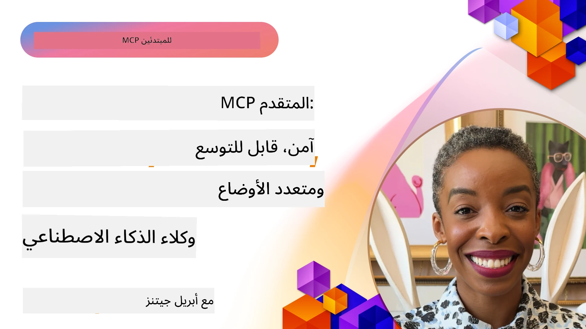

# مواضيع متقدمة في MCP

_(انقر على الصورة أعلاه لمشاهدة فيديو هذا الدرس)_

يغطي هذا الفصل سلسلة من المواضيع المتقدمة في تنفيذ بروتوكول سياق النموذج (MCP)، بما في ذلك التكامل متعدد الوسائط، القابلية للتوسع، ممارسات الأمان المثلى، وتكامل المؤسسات. هذه المواضيع حاسمة لبناء تطبيقات MCP قوية وجاهزة للإنتاج يمكنها تلبية متطلبات أنظمة الذكاء الاصطناعي الحديثة.

## نظرة عامة

يستعرض هذا الدرس مفاهيم متقدمة في تنفيذ بروتوكول سياق النموذج، مع التركيز على التكامل متعدد الوسائط، القابلية للتوسع، ممارسات الأمان المثلى، وتكامل المؤسسات. هذه المواضيع ضرورية لبناء تطبيقات MCP بمستوى الإنتاج يمكنها التعامل مع المتطلبات المعقدة في بيئات المؤسسات.

> **نظرة مستقبلية:** عدة مواضيع أدناه تتأثر بإصدار المرشح لمواصفات MCP بتاريخ `2026-07-28` — الجذور السياقية (5.4) والعينات (5.6) تبني على بدائيات قد تم تمييزها كمتقادمة في الإصدار المرشح، وميزة المهام التجريبية المشار إليها في ميزات البروتوكول (5.16) تنتقل إلى امتداد مخصص للمهام. راجع [ما الجديد في MCP: إصدار المرشح 2026-07-28](../01-CoreConcepts/mcp-2026-07-28-release-candidate.md) للمزيد من التفاصيل.

## أهداف التعلم

بنهاية هذا الدرس، ستكون قادرًا على:

- تنفيذ قدرات متعددة الوسائط داخل أُطُر عمل MCP
- تصميم هياكل MCP قابلة للتوسع لسيناريوهات الطلب العالي
- تطبيق أفضل ممارسات الأمان وفقًا لمبادئ أمان MCP
- دمج MCP مع أنظمة وأُطُر الذكاء الاصطناعي للمؤسسات
- تحسين الأداء والموثوقية في بيئات الإنتاج

## الدروس والمشاريع النموذجية

| الرابط | العنوان | الوصف |
|------|-------|-------------|
| [5.1 التكامل مع Azure](./mcp-integration/README.md) | التكامل مع Azure | تعلم كيفية دمج خادم MCP الخاص بك على Azure |
| [5.2 نموذج متعدد الوسائط](./mcp-multi-modality/README.md) | عينات MCP متعددة الوسائط | عينات للصوت والصورة والاستجابة متعددة الوسائط |
| [5.3 نموذج MCP OAuth2](../../../05-AdvancedTopics/mcp-oauth2-demo) | عرض توضيحي لـ MCP OAuth2 | تطبيق Spring Boot مصغر يعرض OAuth2 مع MCP، كخادم تفويض وموارد. يوضح إصدار الرموز الآمن، النقاط المحمية، نشر تطبيقات الحاويات على Azure، وتكامل إدارة API. |
| [5.4 الجذور السياقية](./mcp-root-contexts/README.md) | الجذور السياقية | تعرّف أكثر على الجذر السياقي وكيفية تنفيذه |
| [5.5 التوجيه](./mcp-routing/README.md) | التوجيه | تعرّف على أنواع مختلفة من التوجيه |
| [5.6 العينات](./mcp-sampling/README.md) | العينات | تعرّف كيفية العمل مع العينات |
| [5.7 التوسع](./mcp-scaling/README.md) | التوسع | تعلّم عن التوسع |
| [5.8 الأمان](./mcp-security/README.md) | الأمان | قم بتأمين خادم MCP الخاص بك |
| [5.9 نموذج بحث الويب](./web-search-mcp/README.md) | بحث الويب MCP | خادم وعميل MCP بلغة بايثون يتكامل مع SerpAPI للبحث الفوري في الويب، الأخبار، المنتجات، والأسئلة والأجوبة. يعرض تنظيم أدوات متعددة، تكامل API خارجي، ومعالجة أخطاء قوية. |
| [5.10 البث المباشر](./mcp-realtimestreaming/README.md) | البث | أصبح البث البياني الفوري ضروريًا في عالم اليوم المدفوع بالبيانات، حيث تحتاج الأعمال والتطبيقات إلى الوصول الفوري للمعلومات لاتخاذ قرارات في الوقت المناسب. |
| [5.11 بحث ويب في الزمن الحقيقي](./mcp-realtimesearch/README.md) | بحث الويب | كيف يحول MCP بحث الويب في الزمن الحقيقي من خلال تقديم نهج موحد لإدارة السياق عبر نماذج الذكاء الاصطناعي، محركات البحث، والتطبيقات. | 
| [5.12 توثيق Entra ID لخوادم بروتوكول سياق النموذج](./mcp-security-entra/README.md) | توثيق Entra ID | توفر Microsoft Entra ID حلًا قويًا لإدارة الهوية والوصول قائم على السحابة، مما يساعد على ضمان أن المستخدمين والتطبيقات المصرح لهم فقط يمكنهم التفاعل مع خادم MCP الخاص بك. |
| [5.13 تكامل وكيل Microsoft Foundry](./mcp-foundry-agent-integration/README.md) | تكامل Microsoft Foundry | تعلم كيفية دمج خوادم بروتوكول سياق النموذج مع وكلاء Microsoft Foundry، مما يتيح تنظيم أدوات قوي وقدرات الذكاء الاصطناعي في المؤسسات مع اتصال موحد لمصادر البيانات الخارجية. |
| [5.14 هندسة السياق](./mcp-contextengineering/README.md) | هندسة السياق | الفرص المستقبلية لتقنيات هندسة السياق لخوادم MCP، بما في ذلك تحسين السياق، الإدارة الديناميكية للسياق، واستراتيجيات هندسة المطالبات الفعالة داخل أُطُر MCP. |
| [5.15 النقل المخصص لم MCP](./mcp-transport/README.md) | النقل المخصص | تعلم كيفية تنفيذ آليات نقل مخصصة لسيناريوهات اتصال MCP المتخصصة. |
| [5.16 الغوص العميق في ميزات البروتوكول](./mcp-protocol-features/README.md) | ميزات البروتوكول | اتقن ميزات البروتوكول المتقدمة بما في ذلك إشعارات التقدم، إلغاء الطلبات، قوالب الموارد، وأنماط معالجة الأخطاء. |
| [5.17 التفكير المواجه متعدد الوكلاء](./mcp-adversarial-agents/README.md) | وكلاء مواجهة | استخدام وكيلين ذوي مواقف متعارضة، يشتركان في مجموعة أدوات MCP واحدة، للقبض على الهلاوس، كشف الحالات الحافة، وإنتاج مخرجات أكثر معايرة من خلال نقاش منظم. |

> **الجديد في مواصفات MCP 2025-11-25**: تتضمن المواصفات الآن دعمًا تجريبيًا لـ **المهام** (عمليات طويلة الأمد مع تتبع التقدم)، **تعليقات الأدوات** (بيانات وصفية عن سلوك الأدوات للأمان)، **استخلاص وضع URL** (طلب محتوى URL محدد من العملاء)، و**الجذور المحسنة** (لإدارة سياق مساحة العمل). راجع [سجل تغييرات مواصفات MCP](https://spec.modelcontextprotocol.io/) للحصول على التفاصيل الكاملة.

## مراجع إضافية

للحصول على أحدث المعلومات حول مواضيع MCP المتقدمة، راجع:
- [وثائق MCP](https://modelcontextprotocol.io/)
- [مواصفات MCP (2025-11-25)](https://spec.modelcontextprotocol.io/specification/2025-11-25/)
- [مستودع GitHub](https://github.com/modelcontextprotocol)
- [أفضل 10 مخاطر أمان MCP من OWASP](https://microsoft.github.io/mcp-azure-security-guide/mcp/) - المخاطر الأمنية والتدابير الوقائية
- [ورشة عمل قمة أمان MCP (Sherpa)](https://azure-samples.github.io/sherpa/) - تدريب عملي على الأمان

## النقاط الرئيسية

- توسع تطبيقات MCP متعددة الوسائط قدرات الذكاء الاصطناعي إلى ما بعد معالجة النصوص فقط
- القابلية للتوسع ضرورية للنشر في المؤسسات ويمكن التعامل معها من خلال التوسع الأفقي والعمودي
- تدابير الأمان الشاملة تحمي البيانات وتضمن التحكم المناسب في الوصول
- التكامل المؤسسي مع منصات مثل Azure OpenAI وMicrosoft AI Foundry يعزز قدرات MCP
- تستفيد تطبيقات MCP المتقدمة من هياكل محسنة وإدارة موارد دقيقة

## تمرين

صمم تطبيق MCP بمستوى مؤسسي لحالة استخدام محددة:

1. تحديد متطلبات الوسائط المتعددة لحالة الاستخدام الخاصة بك
2. رسم ضوابط الأمان اللازمة لحماية البيانات الحساسة
3. تصميم هيكل قابل للتوسع يمكنه التعامل مع أحمال متغيرة
4. تخطيط نقاط التكامل مع أنظمة AI للمؤسسات
5. توثيق الاختناقات المحتملة في الأداء واستراتيجيات التخفيف

## موارد إضافية

- [وثائق Azure OpenAI](https://learn.microsoft.com/en-us/azure/ai-services/openai/)
- [وثائق Microsoft AI Foundry](https://learn.microsoft.com/en-us/ai-services/)

---

## الخطوة التالية

استكشف الدروس في هذه الوحدة بدءًا من: [5.1 تكامل MCP](./mcp-integration/README.md)

بعد إتمام هذه الوحدة، تابع إلى: [الوحدة 6: مساهمات المجتمع](../06-CommunityContributions/README.md)

---

<!-- CO-OP TRANSLATOR DISCLAIMER START -->
**تنويه**:
تمت ترجمة هذا المستند باستخدام خدمة الترجمة بالذكاء الاصطناعي [Co-op Translator](https://github.com/Azure/co-op-translator). بينما نسعى للدقة، يرجى العلم أن الترجمات الآلية قد تحتوي على أخطاء أو عدم دقة. يجب اعتبار المستند الأصلي بلغته الأصلية المصدر الرسمي والمعتمد. للمعلومات الهامة، يُنصح بالاستعانة بترجمة بشرية محترفة. نحن غير مسؤولين عن أي سوء فهم أو تفسير ناتج عن استخدام هذه الترجمة.
<!-- CO-OP TRANSLATOR DISCLAIMER END -->