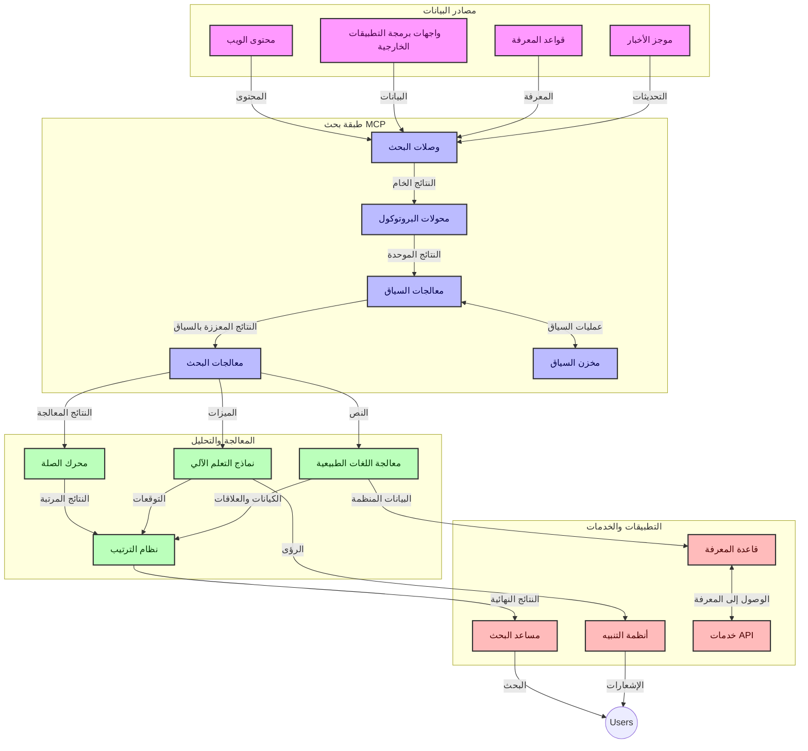
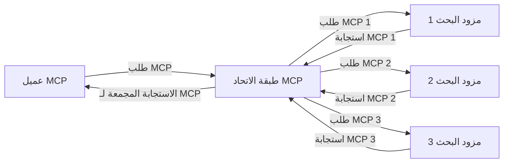
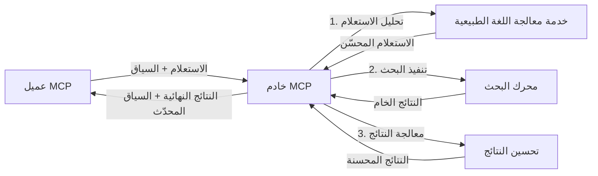

# بروتوكول نموذج السياق للبحث في الويب في الوقت الحقيقي

## نظرة عامة

أصبح البحث في الويب في الوقت الحقيقي أمرًا أساسيًا في بيئة اليوم المعتمدة على المعلومات، حيث تحتاج التطبيقات إلى الوصول الفوري إلى المعلومات المحدثة عبر الإنترنت لتقديم ردود ذات صلة وفي الوقت المناسب. يمثل بروتوكول نموذج السياق (MCP) تطورًا مهمًا في تحسين عمليات البحث في الوقت الحقيقي هذه، مما يعزز كفاءة البحث، ويحافظ على سلامة السياق، ويحسن أداء النظام بشكل عام.

تستعرض هذه الوحدة كيف يحول MCP البحث في الويب في الوقت الحقيقي من خلال توفير نهج موحد لإدارة السياق عبر نماذج الذكاء الاصطناعي ومحركات البحث والتطبيقات.

### ماذا ستتعلم

في هذا الدليل الشامل، ستكتشف:

- كيف يخلق MCP جسرًا سلسًا بين نماذج الذكاء الاصطناعي وقدرات البحث في الويب في الوقت الحقيقي
- الأنماط المعمارية لتطبيق حلول بحث فعالة وقابلة للتوسع باستخدام MCP
- تقنيات للحفاظ على سياق البحث عبر استفسارات وتفاعلات متعددة
- تطبيقات عملية للرموز البرمجية في بايثون وجافا سكريبت لسيناريوهات بحث مختلفة
- طرق لموازنة الصلة والتحديث والأداء في أنظمة البحث المدعومة بـ MCP

## مقدمة في البحث في الويب في الوقت الحقيقي

البحث في الويب في الوقت الحقيقي هو نهج تقني يمكنه الاستعلام المستمر، والمعالجة، وتحليل المعلومات المستندة إلى الويب فور نشرها أو تحديثها، مما يسمح للأنظمة بتوفير معلومات حديثة وذات صلة بأقل تأخير ممكن. وعلى عكس أنظمة البحث التقليدية التي تعمل على بيانات مفهرسة قديمة لساعات أو أيام، تتعامل عمليات البحث في الوقت الحقيقي مع بيانات حية من الويب، وتقدم رؤى ومعلومات تعكس الحالة الحالية للمحتوى على الإنترنت.

### المفاهيم الأساسية للبحث في الويب في الوقت الحقيقي:

- **معالجة الاستعلامات المستمرة**: يتم معالجة استعلامات البحث مقابل مصادر بيانات تتجدد باستمرار
- **أولوية التحديثات الجديدة**: تم تصميم الأنظمة لتُعطي أولوية للمعلومات الحديثة
- **موازنة الصلة**: الحفاظ على توازن بين الصلة والتحديث
- **هندسة قابلة للتوسع**: يجب أن تتعامل الأنظمة مع أحمال استعلامات وأحجام بيانات متغيرة
- **فهم سياقي**: من الضروري الحفاظ على سياق المستخدم عبر تكرارات البحث لكي تكون النتائج ذات معنى
- **إعادة صياغة الاستعلام بشكل ديناميكي**: تعديل الاستعلامات بشكل تكيفي بناءً على السياق والنتائج السابقة
- **تكامل متعدد المصادر**: دمج النتائج من مقدمي البحث ومصادر الويب المتعددة
- **الفهم الدلالي**: معالجة الاستعلامات والمحتوى بناءً على المعنى بدلاً من الكلمات المفتاحية فقط
- **الترتيب في الوقت الحقيقي**: ضبط ترتيب النتائج بشكل مستمر مع توفر معلومات جديدة

### بروتوكول نموذج السياق والبحث في الويب في الوقت الحقيقي

يعالج بروتوكول نموذج السياق (MCP) عدة تحديات حرجة في بيئات البحث في الويب في الوقت الحقيقي:

1. **الحفاظ على سياق البحث**: يعمل MCP على توحيد كيفية الحفاظ على السياق عبر مكونات البحث الموزعة، مما يضمن أن نماذج الذكاء الاصطناعي والعقد المعالجة لديها وصول إلى تاريخ الاستعلامات وتفضيلات المستخدم ذات الصلة.

2. **إدارة الاستعلامات بكفاءة**: من خلال توفير آليات منظمة لنقل السياق، يقلل MCP من العبء الناتج عن تكرار السياق في كل تكرار للبحث.

3. **التشغيل البيني**: يخلق MCP لغة مشتركة لمشاركة السياق بين تقنيات البحث المتنوعة ونماذج الذكاء الاصطناعي، مما يتيح معمارية أكثر مرونة وقابلية للتوسعة.

4. **سياق محسن للبحث**: يمكن لتنفيذات MCP أن تعطي أولوية للعناصر السياقية الأكثر صلة لتحقيق بحث فعال مع تحسين كل من الأداء والدقة.

5. **معالجة بحث تكيفية**: مع إدارة السياق المناسبة عبر MCP، يمكن لأنظمة البحث ضبط المعالجة ديناميكيًا بناءً على احتياجات المستخدم المتغيرة ومشاهد المعلومات.

في التطبيقات الحديثة التي تتراوح بين تجميع الأخبار إلى مساعدي البحث، يتيح دمج MCP مع تقنيات البحث في الويب بحثًا أكثر ذكاءً ووعيًا بالسياق يمكنه تقديم نتائج أكثر صلة كلما استمر تفاعل المستخدم.

## أهداف التعلم

بنهاية هذا الدرس، ستكون قادرًا على:

- فهم أساسيات البحث في الويب في الوقت الحقيقي وتحدياته في التطبيقات الحديثة
- شرح كيف يعزز بروتوكول نموذج السياق (MCP) قدرات البحث في الويب في الوقت الحقيقي
- تنفيذ حلول بحث قائمة على MCP باستخدام الأُطر والواجهات البرمجية الشائعة
- تصميم ونشر هياكل بحث قابلة للتوسع وعالية الأداء باستخدام MCP
- تطبيق مفاهيم MCP على حالات استخدام متنوعة بما في ذلك البحث الدلالي، ومساعدة البحث، والتصفح المدعوم بالذكاء الاصطناعي
- تقييم الاتجاهات الناشئة والابتكارات المستقبلية في تقنيات البحث القائمة على MCP
- تطوير أنظمة بحث واعية بالسياق تتعلم من تفاعلات المستخدم
- دمج قدرات البحث في الويب في مساعدي الذكاء الاصطناعي باستخدام بروتوكولات MCP الموحدة
- إنشاء خطوط بحث متعددة المراحل تقوم بتحسين النتائج تدريجيًا بناءً على السياق
- تحسين أداء البحث مع الحفاظ على وعي شامل بالسياق

### التعريف والأهمية

يشمل البحث في الويب في الوقت الحقيقي الاستعلام المستمر، واسترجاع، وتقديم المعلومات المستندة إلى الويب بأقل زمن تأخير ممكن. وعلى عكس محركات البحث التقليدية التي تقوم بعملية الزحف والفهرسة للويب بشكل دوري، يهدف البحث في الوقت الحقيقي إلى عرض المعلومات فور توفرها، مما يسمح بالوصول الفوري إلى أحدث المحتويات.

السمات الرئيسية للبحث في الويب في الوقت الحقيقي تشمل:

- **الجدة**: إعطاء أولوية للمحتوى والتحديثات الحديثة
- **المعالجة المستمرة**: المراقبة المستمرة للمعلومات الجديدة
- **تكيف الاستعلام**: تحسين استعلامات البحث بناءً على السياق وردود الفعل
- **التسليم الفوري**: تقديم نتائج البحث بأقل تأخير
- **الاحتفاظ بالسياق**: البناء على الاستعلامات السابقة لتحسين الصلة

### التحديات في البحث التقليدي على الويب

تواجه طرق البحث التقليدية على الويب عدة قيود عند تطبيقها على السيناريوهات في الوقت الحقيقي:

1. **تجزئة السياق**: صعوبة في الحفاظ على سياق البحث عبر استعلامات متعددة
2. **حداثة المعلومات**: تحديات في الوصول إلى المعلومات الأحدث وإعطائها أولوية
3. **تعقيد التكامل**: مشاكل في التشغيل البيني بين أنظمة البحث والتطبيقات
4. **قضايا التأخير**: موازنة البحث الشامل مع متطلبات زمن الاستجابة
5. **ضبط الصلة**: ضمان الدقة والملاءمة مع إعطاء أولوية للتحديث

## فهم بروتوكول نموذج السياق (MCP) للبحث

### ما هو MCP في سياقات البحث؟

بروتوكول نموذج السياق (MCP) هو بروتوكول اتصالات موحد مصمم لتسهيل التفاعل الفعال بين نماذج الذكاء الاصطناعي والتطبيقات. في سياق البحث في الويب في الوقت الحقيقي، يوفر MCP إطارًا لـ:

- الحفاظ على سياق البحث عبر تسلسل الاستعلامات
- توحيد تنسيقات الاستعلام والنتائج
- تحسين نقل معلمات وأسس البحث والنتائج
- تعزيز التواصل بين النماذج ومحركات البحث

### المكونات الأساسية والهندسة المعمارية

تتكون هندسة MCP للبحث في الويب في الوقت الحقيقي من عدة مكونات رئيسية:

1. **معالجات سياق الاستعلام**: إدارة والحفاظ على سياق البحث عبر استعلامات متعددة
2. **معالجات البحث**: معالجة طلبات البحث الواردة باستخدام تقنيات واعية بالسياق
3. **محولات البروتوكول**: التحويل بين واجهات برمجة تطبيقات البحث المختلفة مع الحفاظ على السياق
4. **مخزن السياق**: تخزين واسترجاع تاريخ البحث والتفضيلات بكفاءة
5. **وصلات البحث**: الاتصال بمحركات بحث مختلفة وواجهات برمجة التطبيقات الخاصة بالويب



### كيف يُحسن MCP البحث في الويب في الوقت الحقيقي

يعالج MCP تحديات البحث التقليدي على الويب من خلال:

- **استمرارية السياق**: الحفاظ على العلاقات بين الاستعلامات عبر جلسة البحث بأكملها
- **نقل محسن**: تقليل التكرار في معلمات البحث عبر إدارة سياق ذكية
- **واجهات موحدة**: توفير واجهات برمجة تطبيقات متسقة لمكونات البحث
- **تقليل التأخير**: تقليل عبء المعالجة عبر التعامل الفعال مع السياق
- **تحسين الصلة**: تحسين صلة البحث عبر الحفاظ على نية المستخدم عبر استعلامات متعددة

## التكامل والتنفيذ

تتطلب أنظمة البحث في الويب في الوقت الحقيقي تصميمًا معماريًا دقيقًا وتنفيذًا للحفاظ على كل من الأداء وسلامة السياق. يقدم بروتوكول نموذج السياق نهجًا موحدًا لتكامل نماذج الذكاء الاصطناعي وتقنيات البحث، مما يتيح إنشاء خطوط بحث أكثر تعقيدًا ووعيًا بالسياق.

### نظرة عامة على التكامل MCP في هياكل البحث

ينطوي تطبيق MCP في بيئات البحث في الويب في الوقت الحقيقي على عدة اعتبارات رئيسية:

1. **تسلسل سياق البحث**: يوفر MCP آليات فعالة لترميز المعلومات السياقية داخل طلبات البحث، مما يضمن أن يتبع السياق الأساسي الاستعلام خلال خط معالجة الطلب. يتضمن ذلك تنسيقات تسلسل موحدة ومحسنة للبيانات الوصفية المتعلقة بالبحث.

2. **معالجة بحث ذات حالة**: يمكن MCP من معالجة ذكية ذات حالة من خلال الحفاظ على تمثيل سياق متسق عبر تكرارات البحث. وهذا ذو قيمة خاصة في خطوط البحث متعددة المراحل حيث يحسن تحسين السياق النتائج.

3. **توسيع وتحسين الاستعلام**: يمكن لتنفيذات MCP في أنظمة البحث تسهيل توسيع وتحسين الاستعلامات بناءً على السياق المتراكم، مما يسمح بنتائج أكثر صلة مع تقدم جلسة البحث.

4. **تخزين مؤقت وترتيب النتائج**: من خلال توحيد التعامل مع السياق، يساعد MCP في إدارة تخزين مؤقت وترتيب النتائج، مما يمكّن المكونات من التكيف بناءً على السياق البحثي المتطور.

5. **اتحاد وتجميع البحث**: يسهل MCP اتحاد البحث الأكثر تعقيدًا عبر عدة أنظمة خلفية من خلال توفير تمثيلات منظمة للسياق البحثي، مما يمكّن تجميعًا أكثر معنوية للنتائج من مصادر متنوعة.

يؤدي تنفيذ MCP عبر تقنيات البحث المختلفة إلى نهج موحد لإدارة السياق، مما يقلل الحاجة إلى رموز تكامل مخصصة مع تعزيز قدرة النظام على الحفاظ على سياق ذي معنى مع تطور استعلامات البحث.

### MCP في تطبيقات البحث المختلفة على الويب

تتبع هذه الأمثلة مواصفة MCP الحالية التي تركز على بروتوكول JSON-RPC مع آليات نقل مميزة. يوضح الكود كيف يمكنك تنفيذ تكاملات بحث مخصصة مع الحفاظ على توافق كامل مع بروتوكول MCP.


<details>
<summary>تطبيق بايثون مع واجهة بحث عامة</summary>

```python
import asyncio
import json
import aiohttp
from typing import Dict, Any, Optional, List
from contextlib import asynccontextmanager
from collections.abc import AsyncIterator

# استيراد مكتبات MCP القياسية
from mcp.client.session import ClientSession
from mcp.client.streamable_http import streamablehttp_client
from mcp.types import TextContent, CreateMessageRequestParams, CreateMessageResult
from mcp.server.fastmcp import FastMCP

# إنشاء خادم FastMCP للبحث على الويب
search_server = FastMCP("WebSearch")

# فئة لمعالجة عمليات البحث على الويب
class WebSearchHandler:
    def __init__(self, api_endpoint: str, api_key: str):
        self.api_endpoint = api_endpoint
        self.api_key = api_key
        self.session = None
        
    async def initialize(self):
        """Initialize the HTTP session"""
        self.session = aiohttp.ClientSession(
            headers={"Authorization": f"Bearer {self.api_key}"}
        )
    
    async def close(self):
        """Close the HTTP session"""
        if self.session:
            await self.session.close()
            
    async def perform_search(self, query: str, max_results: int = 5, 
                           include_domains: List[str] = None, 
                           exclude_domains: List[str] = None,
                           time_period: str = "any") -> Dict[str, Any]:
        """Perform web search using the search API"""
        # بناء معلمات البحث
        search_params = {
            "q": query,
            "limit": max_results,
            "time": time_period
        }
        
        if include_domains:
            search_params["site"] = ",".join(include_domains)
            
        if exclude_domains:
            search_params["exclude_site"] = ",".join(exclude_domains)
        
        # تنفيذ طلب البحث
        try:
            async with self.session.get(
                self.api_endpoint,
                params=search_params
            ) as response:
                if response.status != 200:
                    error_text = await response.text()
                    raise Exception(f"Search API error: {response.status} - {error_text}")
                
                search_data = await response.json()
                
                # تحويل استجابة API الخاصة إلى تنسيق قياسي
                results = []
                for item in search_data.get("results", []):
                    results.append({
                        "title": item.get("title", ""),
                        "url": item.get("url", ""),
                        "snippet": item.get("snippet", ""),
                        "date": item.get("published_date", ""),
                        "source": item.get("source", "")
                    })
                
                return {
                    "query": query,
                    "totalResults": len(results),
                    "results": results
                }
        except Exception as e:
            print(f"Search API request error: {e}")
            raise

# تهيئة معالج البحث
search_handler = WebSearchHandler(
    api_endpoint="https://api.search-service.example/search",
    api_key="your-api-key-here"
)

# إعداد عمر الاستخدام لإدارة معالج البحث
@asyncio.asynccontextmanager
async def app_lifespan(server: FastMCP):
    """Manage application lifecycle"""
    await search_handler.initialize()
    try:
        yield {"search_handler": search_handler}
    finally:
        await search_handler.close()

# تعيين عمر الخادم
search_server = FastMCP("WebSearch", lifespan=app_lifespan)

# تسجيل أداة البحث على الويب
@search_server.tool()
async def web_search(query: str, max_results: int = 5, 
                   include_domains: List[str] = None,
                   exclude_domains: List[str] = None,
                   time_period: str = "any") -> Dict[str, Any]:
    """
    Search the web for information
    
    Args:
        query: The search query
        max_results: Maximum number of results to return (default: 5)
        include_domains: List of domains to include in search results
        exclude_domains: List of domains to exclude from search results
        time_period: Time period for results ("day", "week", "month", "any")
        
    Returns:
        Dictionary containing search results
    """
    ctx = search_server.get_context()
    search_handler = ctx.request_context.lifespan_context["search_handler"]
    
    results = await search_handler.perform_search(
        query=query,
        max_results=max_results,
        include_domains=include_domains,
        exclude_domains=exclude_domains,
        time_period=time_period
    )
    
    return results

# مثال على استخدام العميل
async def client_example():
    # الاتصال بخادم البحث باستخدام نقل HTTP قابل للبث
    async with streamablehttp_client("http://localhost:8000/mcp") as (read, write, _):
        async with ClientSession(read, write) as session:
            # تهيئة الاتصال
            await session.initialize()
            
            # استدعاء أداة web_search
            search_results = await session.call_tool(
                "web_search", 
                {
                    "query": "latest developments in AI and Model Context Protocol",
                    "max_results": 5,
                    "time_period": "day",
                    "include_domains": ["github.com", "microsoft.com"]
                }
            )
            
            print(f"Search results: {search_results}")

# مثال على تشغيل الخادم
if __name__ == "__main__":
    # تشغيل الخادم باستخدام نقل HTTP قابل للبث
    search_server.run(transport="streamable-http")
```
</details> 

<details>
<summary>تطبيق جافا سكريبت مع بحث مدمج في المتصفح</summary>


```javascript
// تنفيذ خادم MCP للبحث على الويب
import { McpServer, ResourceTemplate } from '@modelcontextprotocol/sdk/server/mcp.js';
import { StreamableHTTPServerTransport } from '@modelcontextprotocol/sdk/server/streamableHttp.js';
import { z } from 'zod';

// إنشاء خادم MCP للبحث على الويب
const searchServer = new McpServer({
    name: "BrowserSearch",
    description: "A server that provides web search capabilities"
});

// فئة خدمة البحث
class SearchService {
    constructor(searchApiUrl, apiKey) {
        this.searchApiUrl = searchApiUrl;
        this.apiKey = apiKey;
    }

    async performSearch(parameters) {
        const {
            query = '',
            maxResults = 5,
            includeDomains = [],
            excludeDomains = [],
            timePeriod = 'any'
        } = parameters;
        
        // بناء عنوان URL للبحث مع المعلمات
        const url = new URL(this.searchApiUrl);
        url.searchParams.append('q', query);
        url.searchParams.append('limit', maxResults);
        url.searchParams.append('time', timePeriod);
        
        if (includeDomains.length > 0) {
            url.searchParams.append('site', includeDomains.join(','));
        }
        
        if (excludeDomains.length > 0) {
            url.searchParams.append('exclude_site', excludeDomains.join(','));
        }
        
        try {
            const response = await fetch(url.toString(), {
                method: 'GET',
                headers: {
                    'Authorization': `Bearer ${this.apiKey}`,
                    'Content-Type': 'application/json'
                }
            });
            
            if (!response.ok) {
                const errorText = await response.text();
                throw new Error(`Search API error: ${response.status} - ${errorText}`);
            }
            
            const searchData = await response.json();
            
            // تحويل رد API المحدد إلى صيغة قياسية
            const results = searchData.results?.map(item => ({
                title: item.title || '',
                url: item.url || '',
                snippet: item.snippet || '',
                date: item.published_date || '',
                source: item.source || ''
            })) || [];
            
            return {
                query,
                totalResults: results.length,
                results
            };
        } catch (error) {
            console.error('Search API request error:', error);
            throw error;
        }
    }
}

// تهيئة خدمة البحث
const searchService = new SearchService(
    'https://api.search-service.example/search',
    'your-api-key-here'
);

// إعداد موفر السياق للخادم
searchServer.setContextProvider(() => {
    return {
        searchService
    };
});

// تسجيل أداة البحث على الويب
searchServer.tool({
    name: 'web_search',
    description: 'Search the web for information',
    parameters: {
        type: 'object',
        properties: {
            query: {
                type: 'string',
                description: 'The search query'
            },
            maxResults: {
                type: 'integer',
                description: 'Maximum number of results to return',
                default: 5
            },
            includeDomains: {
                type: 'array',
                items: { type: 'string' },
                description: 'List of domains to include in search results'
            },
            excludeDomains: {
                type: 'array',
                items: { type: 'string' },
                description: 'List of domains to exclude from search results'
            },
            timePeriod: {
                type: 'string',
                description: 'Time period for results',
                enum: ['day', 'week', 'month', 'any'],
                default: 'any'
            }
        },
        required: ['query']
    },
    handler: async (params, context) => {
        const { searchService } = context;
        return await searchService.performSearch(params);
    }
});

// مثال على كود العميل للاتصال بخادم البحث
import { Client } from '@modelcontextprotocol/sdk/client/index.js';
import { StreamableHTTPClientTransport } from '@modelcontextprotocol/sdk/client/streamableHttp.js';

async function connectToSearchServer() {
    // الاتصال بخادم البحث
    const transport = new StreamableHTTPClientTransport(
        new URL('http://localhost:8000/mcp')
    );
    
    const client = new Client({
        name: 'search-client',
        version: '1.0.0'
    });
    
    await client.connect(transport);
    
    // تنفيذ أداة البحث
    const searchResults = await client.callTool({
        name: 'web_search',
        arguments: {
            query: 'Model Context Protocol implementation examples',
            maxResults: 10,
            timePeriod: 'week',
            includeDomains: ['github.com', 'docs.microsoft.com']
        }
    });
    
    console.log('Search results:', searchResults);
    
    // التنظيف
    await client.disconnect();
}

// بدء الخادم
const transport = new StreamableHTTPServerTransport();
await searchServer.connect(transport);
console.log('Search server running at http://localhost:8000/mcp');

// في عملية منفصلة أو بعد بدء الخادم
// connectToSearchServer().catch(console.error);
```
</details> 


## إخلاء مسؤولية أمثلة الكود

> **ملاحظة مهمة**: تعرض أمثلة الكود أدناه تكامل بروتوكول نموذج السياق (MCP) مع وظائف البحث في الويب. وعلى الرغم من أنها تتبع أنماط وهياكل SDKs الرسمية لـ MCP، فقد تم تبسيطها لأغراض تعليمية.
> 
> تعرض هذه الأمثلة:
> 
> 1. **تطبيق بايثون**: تطبيق خادم FastMCP يقدم أداة بحث ويب ويتصل بواجهة برمجة تطبيقات بحث خارجية. يوضح هذا المثال إدارة فترة الحياة بشكل صحيح، وتعامل مع السياق، وتنفيذ الأدوات باتباع أنماط [SDK بايثون الرسمية لـ MCP](https://github.com/modelcontextprotocol/python-sdk). يستخدم الخادم النقل HTTP القابل للتدفق الموصى به والذي حل محل النقل القديم SSE في النشر الإنتاجي.
> 
> 2. **تطبيق جافا سكريبت**: تطبيق TypeScript/JavaScript باستخدام نمط FastMCP من [SDK TypeScript الرسمي لـ MCP](https://github.com/modelcontextprotocol/typescript-sdk) لإنشاء خادم بحث مع تعريفات أدوات واتصالات عملاء صحيحة. يتبع أحدث الأنماط الموصى بها لإدارة الجلسة والحفاظ على السياق.
> 
> ستتطلب هذه الأمثلة إضافة معالجة أخطاء، ومصادقة، ورموز تكامل API محددة للاستخدام الإنتاجي. نقاط نهاية واجهة برمجة تطبيقات البحث المعروضة (`https://api.search-service.example/search`) هي نُسَخ placeholder ويجب استبدالها بنقاط نهاية فعلية لخدمات البحث.
> 
> لمزيد من التفاصيل حول التنفيذ الكامل وأحدث الأساليب،
> ارجع إلى [مواصفة MCP الرسمية](https://modelcontextprotocol.io/specification/2026-07-28/)
> ووثائق SDK.

## المفاهيم الأساسية

### إطار بروتوكول نموذج السياق (MCP)

في جوهره، يوفر بروتوكول نموذج السياق وسيلة موحدة لنماذج الذكاء الاصطناعي والتطبيقات والخدمات لتبادل السياق. في البحث في الويب في الوقت الحقيقي، يعد هذا الإطار ضروريًا لإنشاء تجارب بحث متعددة الأدوار متماسكة. تشمل المكونات الرئيسية:

1. **معمارية عميل-خادم**: يؤسس MCP فصلًا واضحًا بين عملاء البحث (المطالبين) وخوادم البحث (الموفرين)، مما يسمح بنماذج نشر مرنة.

2. **الاتصال عبر JSON-RPC**: يستخدم البروتوكول JSON-RPC لتبادل الرسائل، مما يجعله متوافقًا مع تقنيات الويب وسهل التطبيق عبر منصات مختلفة.

3. **إدارة السياق**: يحدد MCP طرقًا منظمة للحفاظ على السياق، وتحديثه، واستغلاله عبر تفاعلات متعددة.

4. **تعريفات الأدوات**: تعرّض قدرات البحث كأدوات موحدة مع معايير محددة للوسائط والقيم المرجعة.

5. **دعم البث**: يدعم البروتوكول بث النتائج، وهو أمر أساسي للبحث في الوقت الحقيقي حيث قد تصل النتائج تدريجيًا.

### أنماط تكامل البحث على الويب

عند دمج MCP مع البحث على الويب، تظهر عدة أنماط:

#### 1. التكامل المباشر مع مزود البحث


في هذا النمط، يتفاعل خادم MCP مباشرة مع واحدة أو أكثر من واجهات برمجة تطبيقات البحث، مترجمًا طلبات MCP إلى استدعاءات API محددة وتنسيق النتائج كردود MCP.

#### 2. البحث الموحد مع الحفاظ على السياق



يوزع هذا النمط استعلامات البحث عبر عدة مزودي بحث متوافقين مع MCP، قد يتخصص كل منهم في أنواع مختلفة من المحتوى أو قدرات البحث، بينما يحافظ على سياق موحد.

#### 3. سلسلة البحث المحسنة بالسياق



في هذا النمط، يتم تقسيم عملية البحث إلى مراحل متعددة، مع إثراء السياق في كل خطوة، مما يؤدي إلى نتائج ذات صلة متزايدة تدريجيًا.

### مكونات سياق البحث

في البحث على الويب القائم على MCP، يشمل السياق عادة:

- **تاريخ الاستعلام**: الاستعلامات السابقة في الجلسة
- **تفضيلات المستخدم**: اللغة، المنطقة، إعدادات البحث الآمن
- **تاريخ التفاعل**: النتائج التي تم النقر عليها، الوقت المنقضي على النتائج
- **معلمات البحث**: الفلاتر، ترتيب النتائج، وغيرها من معدلات البحث
- **معرفة المجال**: سياق موضوعي ذي صلة بالبحث
- **السياق الزمني**: عوامل الصلة المرتبطة بالوقت
- **تفضيلات المصادر**: المصادر الموثوقة أو المفضلة للمعلومات

## حالات الاستخدام والتطبيقات

### البحث وجمع المعلومات

يعزز MCP سير عمل البحث من خلال:

- الحفاظ على سياق البحث عبر الجلسات المختلفة
- تمكين استعلامات أكثر تعقيدًا وذات صلة سياقية
- دعم اتحاد البحث متعدد المصادر
- تسهيل استخراج المعرفة من نتائج البحث

### مراقبة الأخبار والاتجاهات في الوقت الحقيقي

يقدم البحث المدعوم بـ MCP مزايا لمراقبة الأخبار:

- اكتشاف قصص الأخبار الناشئة قريبًا من الوقت الحقيقي
- تصفية سياقية للمعلومات ذات الصلة
- تتبع الموضوعات والكيانات عبر مصادر متعددة
- تنبيهات إخبارية مخصصة بناءً على سياق المستخدم

### التصفح والبحث المعزز بالذكاء الاصطناعي

يفتح MCP إمكانيات جديدة للتصفح المعزز بالذكاء الاصطناعي:

- اقتراحات بحث سياقية بناءً على نشاط المتصفح الحالي
- دمج سلس بين البحث على الويب ومساعدي الذكاء الاصطناعي المعتمدين على LLM
- تحسين البحث متعدد الأدوار مع الحفاظ على السياق
- تعزيز التحقق من الحقائق والتحقق من المعلومات

## الاتجاهات والابتكارات المستقبلية

### تطور MCP في البحث على الويب

نتوقع مستقبلاً أن يتطور MCP لمعالجة:


- **البحث متعدد الوسائط**: دمج البحث بالنص والصورة والصوت والفيديو مع الحفاظ على السياق
- **البحث اللامركزي**: دعم نظم البحث الموزعة والمنتشرة
- **خصوصية البحث**: آليات بحث تحافظ على الخصوصية مع الوعي بالسياق
- **فهم الاستعلام**: التحليل الدلالي العميق لاستعلامات البحث بلغة طبيعية

### التطورات التقنية المحتملة

التقنيات الناشئة التي ستشكل مستقبل البحث باستخدام MCP:

1. **هياكل البحث العصبي**: أنظمة بحث تعتمد على التضمينات محسنة لـ MCP
2. **السياق الشخصي للبحث**: تعلم أنماط البحث الفردية للمستخدم مع مرور الوقت
3. **دمج الرسوم المعرفية**: بحث سياقي معزز بالرسوم المعرفية الخاصة بالمجالات
4. **السياق عبر الوسائط المتعددة**: الحفاظ على السياق عبر أنماط البحث المختلفة

## تمارين تطبيقية

### التمرين 1: إعداد خط أنابيب بحث MCP أساسي

في هذا التمرين، ستتعلم كيفية:
- تكوين بيئة بحث MCP أساسية
- تنفيذ معالجات السياق للبحث على الويب
- اختبار والتحقق من الحفاظ على السياق عبر تكرارات البحث

### التمرين 2: بناء مساعد بحث باستخدام MCP

إنشاء تطبيق كامل يقوم بـ:
- معالجة أسئلة البحث بلغة طبيعية
- إجراء عمليات بحث ويب مدركة للسياق
- تركيب المعلومات من مصادر متعددة
- عرض نتائج البحث منظمة

### التمرين 3: تنفيذ اتحاد البحث متعدد المصادر باستخدام MCP

تمرين متقدم يغطي:
- توجيه الاستعلامات مع الوعي بالسياق إلى عدة محركات بحث
- ترتيب وتجميع النتائج
- إزالة التكرار السياقي لنتائج البحث
- التعامل مع بيانات وصفية خاصة بالمصدر

## موارد إضافية

- [مواصفة بروتوكول سياق النموذج](https://modelcontextprotocol.io/specification/2026-07-28/) - المواصفة الرسمية ووثائق البروتوكول التفصيلية
- [وثائق بروتوكول سياق النموذج](https://modelcontextprotocol.io/) - دروس تفصيلية وأدلة التنفيذ
- [MCP Python SDK](https://github.com/modelcontextprotocol/python-sdk) - تنفيذ رسمي لبروتوكول MCP بلغة بايثون
- [MCP TypeScript SDK](https://github.com/modelcontextprotocol/typescript-sdk) - تنفيذ رسمي لبروتوكول MCP بلغة TypeScript
- [خوادم MCP المرجعية](https://github.com/modelcontextprotocol/servers) - تطبيقات مرجعية لخوادم MCP
- [وثائق واجهة Bing Web Search API](https://learn.microsoft.com/en-us/bing/search-apis/bing-web-search/overview) - واجهة بحث الويب من مايكروسوفت
- [واجهة بحث Google مخصصة JSON API](https://developers.google.com/custom-search/v1/overview) - محرك بحث قابل للبرمجة من جوجل
- [وثائق SerpAPI](https://serpapi.com/search-api) - واجهة نتائج محرك البحث
- [وثائق Meilisearch](https://www.meilisearch.com/docs) - محرك بحث مفتوح المصدر
- [وثائق Elasticsearch](https://www.elastic.co/guide/index.html) - محرك بحث وتحليلات موزع
- [وثائق LangChain](https://python.langchain.com/docs/get_started/introduction) - بناء التطبيقات باستخدام نماذج اللغة الكبيرة

## نتائج التعلم

بعد إكمال هذه الوحدة، ستكون قادرًا على:

- فهم أساسيات البحث في الويب في الوقت الحقيقي وتحدياته
- شرح كيف يعزز بروتوكول سياق النموذج (MCP) قدرات البحث في الويب في الوقت الحقيقي
- تنفيذ حلول بحث مستقاة من MCP باستخدام الأُطُر وواجهات برمجة التطبيقات الشهيرة
- تصميم ونشر هياكل بحث قابلة للتوسع وعالية الأداء باستخدام MCP
- تطبيق مفاهيم MCP على حالات استخدام متعددة تشمل البحث الدلالي، والمساعدة البحثية، والتصفح المدعوم بالذكاء الاصطناعي
- تقييم الاتجاهات الناشئة والابتكارات المستقبلية في تقنيات البحث المستندة إلى MCP


### اعتبارات الثقة والسلامة

عند تنفيذ حلول البحث في الويب المستندة إلى MCP، تذكر هذه المبادئ الهامة من مواصفة MCP:

1. **موافقة المستخدم والسيطرة**: يجب أن يوافق المستخدمون صراحة ويفهموا كل عمليات الوصول إلى البيانات وتنفيذها. هذا مهم بشكل خاص لتطبيقات البحث على الويب التي قد تصل إلى مصادر بيانات خارجية.

2. **خصوصية البيانات**: تأكد من التعامل المناسب مع استعلامات البحث والنتائج، خصوصًا عند احتوائها على معلومات حساسة. نفذ ضوابط وصول مناسبة لحماية بيانات المستخدم.

3. **سلامة الأدوات**: طبق التفويض والتحقق المناسب لأدوات البحث، لأنها تمثل مخاطر أمنية محتملة من خلال تنفيذ أكواد عشوائية. يجب اعتبار وصف سلوك الأداة غير موثوق إلا إذا تم الحصول عليه من خادم موثوق.

4. **توثيق واضح**: قدّم توثيقًا واضحًا عن قدرات وقيود واعتبارات الأمان في تنفيذ البحث القائم على MCP، متبعًا دليل التنفيذ من مواصفة MCP.

5. **تدفقات موافقة متينة**: أنشئ تدفقات موافقة وتفويض متينة تشرح بوضوح وظيفة كل أداة قبل السماح باستخدامها، خاصة للأدوات التي تتفاعل مع موارد ويب خارجية.

للحصول على التفاصيل الكاملة حول اعتبارات الأمان والثقة في MCP، ارجع إلى
[التوثيق الرسمي](https://modelcontextprotocol.io/specification/2026-07-28/basic/security_best_practices).

## الخطوة التالية

- [5.12 مصادقة Entra ID لخوادم بروتوكول سياق النموذج](../mcp-security-entra/README.md)

---

<!-- CO-OP TRANSLATOR DISCLAIMER START -->
**تنويه**:
تمت ترجمة هذا المستند باستخدام خدمة الترجمة بالذكاء الاصطناعي [Co-op Translator](https://github.com/Azure/co-op-translator). بينما نسعى للدقة، يرجى العلم أن الترجمات الآلية قد تحتوي على أخطاء أو عدم دقة. يجب اعتبار المستند الأصلي بلغته الأصلية المصدر الرسمي والمعتمد. للمعلومات الهامة، يُنصح بالاستعانة بترجمة بشرية محترفة. نحن غير مسؤولين عن أي سوء فهم أو تفسير ناتج عن استخدام هذه الترجمة.
<!-- CO-OP TRANSLATOR DISCLAIMER END -->