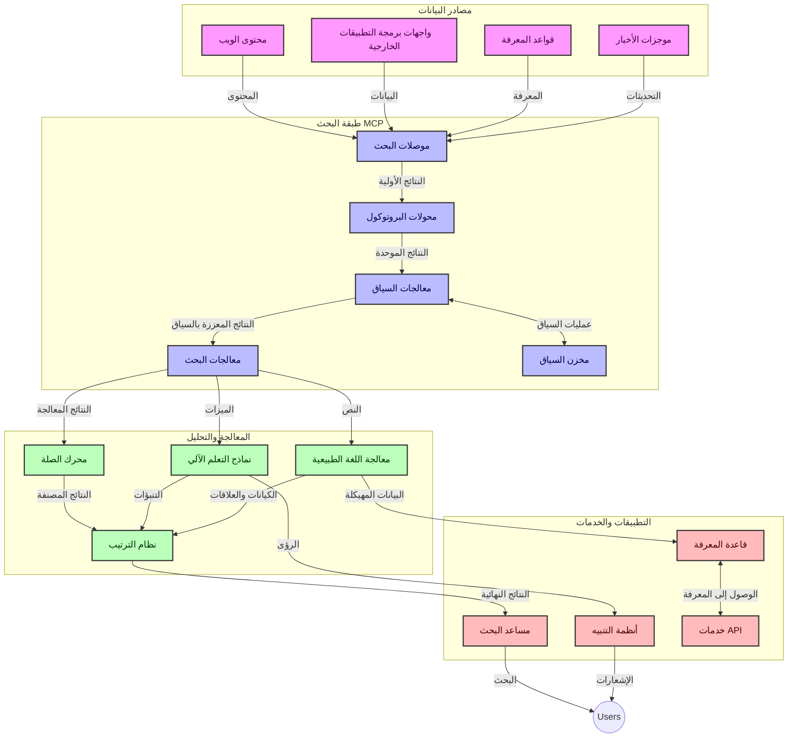
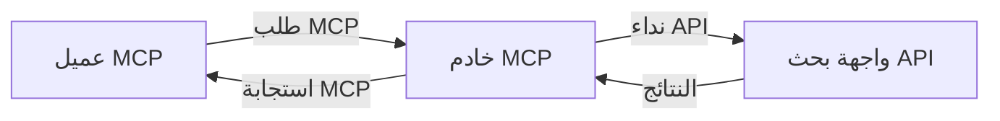
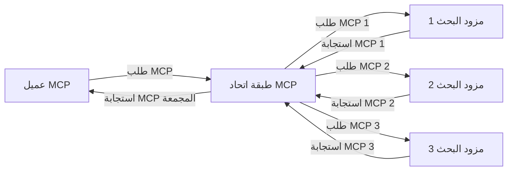

# بروتوكول سياق النموذج للبحث في الويب في الوقت الحقيقي

## نظرة عامة

أصبح البحث في الويب في الوقت الحقيقي أمرًا ضروريًا في بيئة اليوم التي تعتمد على المعلومات، حيث تحتاج التطبيقات إلى الوصول الفوري إلى المعلومات المحدثة عبر الإنترنت لتقديم استجابات ملائمة وفي الوقت المناسب. يمثل بروتوكول سياق النموذج (MCP) تقدمًا كبيرًا في تحسين عمليات البحث في الوقت الحقيقي هذه، مما يعزز كفاءة البحث، ويحافظ على سلامة السياق، ويحسن الأداء العام للنظام.

تستكشف هذه الوحدة كيف يحول MCP البحث في الويب في الوقت الحقيقي من خلال توفير نهج موحد لإدارة السياق عبر نماذج الذكاء الاصطناعي ومحركات البحث والتطبيقات.

### ما ستتعلمه

في هذا الدليل الشامل، ستكتشف:

- كيف ينشئ MCP جسرًا سلسًا بين نماذج الذكاء الاصطناعي وقدرات البحث في الويب في الوقت الحقيقي
- الأنماط المعمارية لتنفيذ حلول بحث فعالة وقابلة للتطوير باستخدام MCP
- تقنيات للحفاظ على سياق البحث عبر استفسارات وتفاعلات متعددة
- تطبيقات عملية للشفرة البرمجية بلغة Python وJavaScript لسيناريوهات بحث متنوعة
- طرق لموازنة الصلة والحداثة والأداء في أنظمة البحث المدعومة بـ MCP

## مقدمة في البحث في الويب في الوقت الحقيقي

البحث في الويب في الوقت الحقيقي هو نهج تكنولوجي يمكّن من الاستعلام المستمر، والمعالجة، وتحليل المعلومات المستندة إلى الويب أثناء نشرها أو تحديثها، مما يسمح للأنظمة بتوفير معلومات حديثة وملائمة مع حد أدنى من الزمن الكامن. على عكس أنظمة البحث التقليدية التي تعمل على بيانات مفهرسة قد تكون قديمة بالساعات أو الأيام، تعالج عمليات البحث في الوقت الحقيقي البيانات المباشرة من الويب، مما يوفر رؤى ومعلومات تعكس الحالة الحالية للمحتوى عبر الإنترنت.

### المفاهيم الأساسية للبحث في الويب في الوقت الحقيقي:

- **معالجة الاستعلام المستمر**: تتم معالجة استعلامات البحث مقابل مصادر بيانات يتم تحديثها باستمرار
- **أولوية الحداثة**: تم تصميم الأنظمة لإعطاء أولوية للمعلومات الحديثة
- **موازنة الصلة**: الحفاظ على توازن بين الصلة والحداثة
- **الهيكلية القابلة للتوسع**: يجب أن تتعامل الأنظمة مع أحجام استعلامات وبيانات متغيرة
- **الفهم السياقي**: الحفاظ على سياق المستخدم عبر تكرارات البحث أمر حاسم للحصول على نتائج ذات معنى
- **إعادة صياغة الاستعلام الديناميكية**: تعديل الاستعلامات بشكل تكيفي بناءً على السياق والنتائج السابقة
- **التكامل متعدد المصادر**: دمج النتائج من مزودات بحث ومصادر ويب متعددة
- **الفهم الدلالي**: معالجة الاستعلامات والمحتوى بناءً على المعنى وليس فقط الكلمات المفتاحية
- **الترتيب في الوقت الحقيقي**: ضبط ترتيب النتائج باستمرار مع توفر معلومات جديدة

### بروتوكول سياق النموذج والبحث في الويب في الوقت الحقيقي

يعالج بروتوكول سياق النموذج (MCP) عدة تحديات حرجة في بيئات البحث في الويب في الوقت الحقيقي:

1. **الحفاظ على سياق البحث**: يقوم MCP بتوحيد كيفية الحفاظ على السياق عبر مكونات البحث الموزعة، مما يضمن أن نماذج الذكاء الاصطناعي وعقد المعالجة لديها وصول إلى سجل الاستعلامات ذي الصلة وتفضيلات المستخدم.

2. **إدارة الاستعلام الفعالة**: من خلال توفير آليات منظمة لنقل السياق، يقلل MCP من العبء المتعلق بتكرار السياق في كل تكرار بحث.

3. **التشغيل البيني**: يخلق MCP لغة مشتركة لمشاركة السياق بين تقنيات البحث المتنوعة ونماذج الذكاء الاصطناعي، مما يتيح هندسات أكثر مرونة وقابلية للتوسع.

4. **السياق المحسّن للبحث**: يمكن لتطبيقات MCP أن تعطي أولوية لعناصر السياق الأكثر صلة من أجل بحث فعال، موازنة بين الأداء والدقة.

5. **المعالجة التكيفية للبحث**: مع إدارة سليمة للسياق عبر MCP، يمكن لأنظمة البحث تعديل المعالجة ديناميكيًا بناءً على احتياجات المستخدم المتطورة ومشهد المعلومات المتغير.

في التطبيقات الحديثة التي تتراوح من تجميع الأخبار إلى المساعدين البحثيين، يتيح دمج MCP مع تقنيات البحث على الويب بحثًا أكثر ذكاءً ووعيًا بالسياق يمكنه تقديم نتائج أكثر صلة مع استمرار تفاعلات المستخدم.

## أهداف التعلم

بحلول نهاية هذا الدرس، ستكون قادرًا على:

- فهم أساسيات البحث في الويب في الوقت الحقيقي وتحدياته في التطبيقات الحديثة
- شرح كيف يعزز بروتوكول سياق النموذج (MCP) قدرات البحث في الويب في الوقت الحقيقي
- تنفيذ حلول بحث قائمة على MCP باستخدام الأُطُر وواجهات برمجة التطبيقات الشهيرة
- تصميم ونشر هياكل بحث قابلة للتوسع وعالية الأداء باستخدام MCP
- تطبيق مفاهيم MCP على حالات استخدام متعددة بما في ذلك البحث الدلالي، ومساعدة البحث، وتصفح مدعوم بالذكاء الاصطناعي
- تقييم الاتجاهات الناشئة والابتكارات المستقبلية في تقنيات البحث القائمة على MCP
- تطوير أنظمة بحث واعية بالسياق تتعلم من تفاعلات المستخدم
- دمج قدرات البحث في الويب في مساعدي الذكاء الاصطناعي باستخدام بروتوكولات MCP الموحدة
- إنشاء خطوط أنابيب بحث متعددة المراحل تقوم بصقل النتائج تدريجيًا استنادًا إلى السياق
- تحسين أداء البحث مع الحفاظ على وعي شامل بالسياق

### التعريف والأهمية

البحث في الويب في الوقت الحقيقي ينطوي على الاستعلام المستمر، والاسترجاع، وتقديم المعلومات المستندة إلى الويب بأدنى زمن تأخير. على عكس محركات البحث التقليدية التي تقوم بدوريات جولة وفهرسة الويب بشكل دوري، يهدف البحث في الوقت الحقيقي إلى إظهار المعلومات بمجرد توفرها، مما يمكن من الوصول الفوري للمحتوى الأكثر حداثة.

تشمل الخصائص الرئيسية للبحث في الويب في الوقت الحقيقي:

- **الحداثة**: إعطاء الأولوية للمحتوى والتحديثات الحديثة
- **المعالجة المستمرة**: المراقبة الدائمة للمعلومات الجديدة
- **تكيف الاستعلام**: تحسين استعلامات البحث بناءً على السياق والتغذية الراجعة
- **التسليم الفوري**: توفير نتائج البحث بأدنى تأخير ممكن
- **الاحتفاظ بالسياق**: البناء على الاستعلامات السابقة لتحسين الصلة

### تحديات البحث التقليدي في الويب

تواجه طرق البحث التقليدية في الويب عدة قيود عند تطبيقها على السيناريوهات في الوقت الحقيقي:

1. **تجزئة السياق**: صعوبة الحفاظ على سياق البحث عبر استعلامات متعددة
2. **حداثة المعلومات**: تحديات في الوصول إلى أحدث المعلومات وإعطائها الأولوية
3. **تعقيد التكامل**: مشكلات في التشغيل البيني بين أنظمة البحث والتطبيقات
4. **مشكلات الكمون**: موازنة شمولية البحث مع متطلبات زمن الاستجابة
5. **ضبط الصلة**: ضمان الدقة والصلة مع إعطاء أولوية للحداثة

## فهم بروتوكول سياق النموذج (MCP) للبحث

### ما هو MCP في سياقات البحث؟

بروتوكول سياق النموذج (MCP) هو بروتوكول اتصال موحد مصمم لتسهيل التفاعل الفعال بين نماذج الذكاء الاصطناعي والتطبيقات. في سياق البحث في الويب في الوقت الحقيقي، يوفر MCP إطارًا من أجل:

- الحفاظ على سياق البحث طوال تسلسلات الاستعلام
- توحيد تنسيقات استعلامات البحث والنتائج
- تحسين نقل معلمات البحث والنتائج
- تعزيز التواصل بين النموذج ومحرك البحث

### المكونات الأساسية والمعمارية

تتكون معمارية MCP للبحث في الويب في الوقت الحقيقي من عدة مكونات رئيسية:

1. **معالجو سياق الاستعلام**: يديرون ويحافظون على سياق البحث عبر استعلامات متعددة
2. **معالجو البحث**: يعالجون طلبات البحث الواردة باستخدام تقنيات واعية بالسياق
3. **مهايئات البروتوكول**: تحول بين واجهات برمجة تطبيقات البحث المختلفة مع الحفاظ على السياق
4. **مخزن السياق**: يخزن ويسترجع سجل البحث والتفضيلات بكفاءة
5. **موصلات البحث**: تتصل بمحركات البحث المختلفة وواجهات برمجة تطبيقات الويب



### كيف يُحسن MCP البحث في الويب في الوقت الحقيقي

يعالج MCP تحديات البحث التقليدي في الويب من خلال:

- **استمرارية سياقية**: الحفاظ على العلاقات بين الاستعلامات عبر جلسة البحث بأكملها
- **نقل محسن**: تقليل التكرار في معلمات البحث من خلال إدارة سياق ذكية
- **واجهات موحدة**: توفير واجهات برمجة تطبيقات متسقة لمكونات البحث
- **تقليل الكمون**: تقليل عبء المعالجة عبر التعامل الفعال مع السياق
- **تحسين الصلة**: تعزيز صلة البحث من خلال الحفاظ على نية المستخدم عبر استعلامات متعددة


## التكامل والتنفيذ

تتطلب أنظمة البحث على الويب في الوقت الحقيقي تصميمًا معماريًا وتنفيذًا دقيقين للحفاظ على كل من الأداء وسلامة السياق. يقدم بروتوكول نموذج السياق نهجًا موحدًا لدمج نماذج الذكاء الاصطناعي وتقنيات البحث، مما يسمح بأنابيب بحث أكثر تطورًا ووعيًا بالسياق.

### نظرة عامة على دمج MCP في معماريات البحث

يشمل تنفيذ MCP في بيئات البحث على الويب في الوقت الحقيقي عدة اعتبارات رئيسية:

1. **تسلسل سياق البحث**: يوفر MCP آليات فعالة لترميز المعلومات السياقية داخل طلبات البحث، مما يضمن متابعة السياق الأساسي للاستعلام طوال أنابيب المعالجة. ويشمل ذلك تنسيقات تسلسل موحدة محسنة للبيانات الوصفية المتعلقة بالبحث.

2. **معالجة البحث بالحالة**: يمكن MCP من تنفيذ معالجة ذكية تعتمد على الحالة عن طريق الحفاظ على تمثيل متسق للسياق عبر تكرارات البحث. وهذا ذو قيمة خاصة في أنابيب البحث متعددة المراحل حيث تحسن تنقيح السياق النتائج.

3. **توسيع وتحسين الاستعلام**: يمكن لتطبيقات MCP في أنظمة البحث تسهيل توسيع وتحسين الاستعلامات بناءً على السياق المتراكم، مما يسمح بنتائج ذات صلة متزايدة مع تقدم جلسة البحث.

4. **التخزين المؤقت للنتائج وترتيب الأولويات**: من خلال توحيد معالجة السياق، يساعد MCP في إدارة تخزين نتائج البحث مؤقتًا وترتيب الأولويات، مما يسمح للمكونات بالتكيف بناءً على تطور سياق البحث.

5. **الاتحاد والتجميع في البحث**: يسهل MCP المزيد من الاتحاد المتقدم للبحث عبر عدة بيانات خلفية من خلال توفير تمثيلات منظمة لسياق البحث، مما يمكن من تجميع أكثر معنى للنتائج من مصادر متنوعة.

يخلق تنفيذ MCP عبر تقنيات البحث المختلفة نهجًا موحدًا لإدارة السياق، مما يقلل الحاجة لكتابة رمز تكامل مخصص ويعزز قدرة النظام على الحفاظ على السياق المعنوي مع تطور استعلامات البحث.

### MCP في التطبيقات المختلفة للبحث على الويب

تتبع هذه الأمثلة المواصفات الحالية لـ MCP التي تركز على بروتوكول JSON-RPC مع آليات نقل مميزة. يوضح الكود كيف يمكنك تنفيذ تكاملات بحث مخصصة مع الحفاظ على التوافق الكامل مع بروتوكول MCP.


<details>
<summary>تنفيذ بايثون مع واجهة بحث عامة</summary>

```python
import asyncio
import json
import aiohttp
from typing import Dict, Any, Optional, List
from contextlib import asynccontextmanager
from collections.abc import AsyncIterator

# استيراد مكتبات MCP القياسية
from mcp.client.session import ClientSession
from mcp.client.streamable_http import streamablehttp_client
from mcp.types import TextContent, CreateMessageRequestParams, CreateMessageResult
from mcp.server.fastmcp import FastMCP

# إنشاء خادم FastMCP للبحث على الويب
search_server = FastMCP("WebSearch")

# فئة للتعامل مع عمليات البحث على الويب
class WebSearchHandler:
    def __init__(self, api_endpoint: str, api_key: str):
        self.api_endpoint = api_endpoint
        self.api_key = api_key
        self.session = None
        
    async def initialize(self):
        """Initialize the HTTP session"""
        self.session = aiohttp.ClientSession(
            headers={"Authorization": f"Bearer {self.api_key}"}
        )
    
    async def close(self):
        """Close the HTTP session"""
        if self.session:
            await self.session.close()
            
    async def perform_search(self, query: str, max_results: int = 5, 
                           include_domains: List[str] = None, 
                           exclude_domains: List[str] = None,
                           time_period: str = "any") -> Dict[str, Any]:
        """Perform web search using the search API"""
        # بناء معلمات البحث
        search_params = {
            "q": query,
            "limit": max_results,
            "time": time_period
        }
        
        if include_domains:
            search_params["site"] = ",".join(include_domains)
            
        if exclude_domains:
            search_params["exclude_site"] = ",".join(exclude_domains)
        
        # تنفيذ طلب البحث
        try:
            async with self.session.get(
                self.api_endpoint,
                params=search_params
            ) as response:
                if response.status != 200:
                    error_text = await response.text()
                    raise Exception(f"Search API error: {response.status} - {error_text}")
                
                search_data = await response.json()
                
                # تحويل استجابة API الخاصة إلى تنسيق معياري
                results = []
                for item in search_data.get("results", []):
                    results.append({
                        "title": item.get("title", ""),
                        "url": item.get("url", ""),
                        "snippet": item.get("snippet", ""),
                        "date": item.get("published_date", ""),
                        "source": item.get("source", "")
                    })
                
                return {
                    "query": query,
                    "totalResults": len(results),
                    "results": results
                }
        except Exception as e:
            print(f"Search API request error: {e}")
            raise

# تهيئة معالج البحث
search_handler = WebSearchHandler(
    api_endpoint="https://api.search-service.example/search",
    api_key="your-api-key-here"
)

# إعداد فترة حياة لإدارة معالج البحث
@asyncio.asynccontextmanager
async def app_lifespan(server: FastMCP):
    """Manage application lifecycle"""
    await search_handler.initialize()
    try:
        yield {"search_handler": search_handler}
    finally:
        await search_handler.close()

# تعيين فترة حياة للخادم
search_server = FastMCP("WebSearch", lifespan=app_lifespan)

# تسجيل أداة بحث على الويب
@search_server.tool()
async def web_search(query: str, max_results: int = 5, 
                   include_domains: List[str] = None,
                   exclude_domains: List[str] = None,
                   time_period: str = "any") -> Dict[str, Any]:
    """
    Search the web for information
    
    Args:
        query: The search query
        max_results: Maximum number of results to return (default: 5)
        include_domains: List of domains to include in search results
        exclude_domains: List of domains to exclude from search results
        time_period: Time period for results ("day", "week", "month", "any")
        
    Returns:
        Dictionary containing search results
    """
    ctx = search_server.get_context()
    search_handler = ctx.request_context.lifespan_context["search_handler"]
    
    results = await search_handler.perform_search(
        query=query,
        max_results=max_results,
        include_domains=include_domains,
        exclude_domains=exclude_domains,
        time_period=time_period
    )
    
    return results

# مثال على استخدام العميل
async def client_example():
    # الاتصال بخادم البحث باستخدام نقل HTTP القابل للبث
    async with streamablehttp_client("http://localhost:8000/mcp") as (read, write, _):
        async with ClientSession(read, write) as session:
            # تهيئة الاتصال
            await session.initialize()
            
            # استدعاء أداة البحث على الويب
            search_results = await session.call_tool(
                "web_search", 
                {
                    "query": "latest developments in AI and Model Context Protocol",
                    "max_results": 5,
                    "time_period": "day",
                    "include_domains": ["github.com", "microsoft.com"]
                }
            )
            
            print(f"Search results: {search_results}")

# مثال على تشغيل الخادم
if __name__ == "__main__":
    # تشغيل الخادم باستخدام نقل HTTP القابل للبث
    search_server.run(transport="streamable-http")
```
</details> 

<details>
<summary>تنفيذ جافا سكريبت مع بحث داخل المتصفح</summary>


```javascript
// تنفيذ خادم MCP للبحث على الويب
import { McpServer, ResourceTemplate } from '@modelcontextprotocol/sdk/server/mcp.js';
import { StreamableHTTPServerTransport } from '@modelcontextprotocol/sdk/server/streamableHttp.js';
import { z } from 'zod';

// إنشاء خادم MCP للبحث على الويب
const searchServer = new McpServer({
    name: "BrowserSearch",
    description: "A server that provides web search capabilities"
});

// فئة خدمة البحث
class SearchService {
    constructor(searchApiUrl, apiKey) {
        this.searchApiUrl = searchApiUrl;
        this.apiKey = apiKey;
    }

    async performSearch(parameters) {
        const {
            query = '',
            maxResults = 5,
            includeDomains = [],
            excludeDomains = [],
            timePeriod = 'any'
        } = parameters;
        
        // إنشاء عنوان URL للبحث مع المعلمات
        const url = new URL(this.searchApiUrl);
        url.searchParams.append('q', query);
        url.searchParams.append('limit', maxResults);
        url.searchParams.append('time', timePeriod);
        
        if (includeDomains.length > 0) {
            url.searchParams.append('site', includeDomains.join(','));
        }
        
        if (excludeDomains.length > 0) {
            url.searchParams.append('exclude_site', excludeDomains.join(','));
        }
        
        try {
            const response = await fetch(url.toString(), {
                method: 'GET',
                headers: {
                    'Authorization': `Bearer ${this.apiKey}`,
                    'Content-Type': 'application/json'
                }
            });
            
            if (!response.ok) {
                const errorText = await response.text();
                throw new Error(`Search API error: ${response.status} - ${errorText}`);
            }
            
            const searchData = await response.json();
            
            // تحويل استجابة محددة للواجهة البرمجية إلى تنسيق قياسي
            const results = searchData.results?.map(item => ({
                title: item.title || '',
                url: item.url || '',
                snippet: item.snippet || '',
                date: item.published_date || '',
                source: item.source || ''
            })) || [];
            
            return {
                query,
                totalResults: results.length,
                results
            };
        } catch (error) {
            console.error('Search API request error:', error);
            throw error;
        }
    }
}

// تهيئة خدمة البحث
const searchService = new SearchService(
    'https://api.search-service.example/search',
    'your-api-key-here'
);

// إعداد مزود السياق للخادم
searchServer.setContextProvider(() => {
    return {
        searchService
    };
});

// تسجيل أداة البحث على الويب
searchServer.tool({
    name: 'web_search',
    description: 'Search the web for information',
    parameters: {
        type: 'object',
        properties: {
            query: {
                type: 'string',
                description: 'The search query'
            },
            maxResults: {
                type: 'integer',
                description: 'Maximum number of results to return',
                default: 5
            },
            includeDomains: {
                type: 'array',
                items: { type: 'string' },
                description: 'List of domains to include in search results'
            },
            excludeDomains: {
                type: 'array',
                items: { type: 'string' },
                description: 'List of domains to exclude from search results'
            },
            timePeriod: {
                type: 'string',
                description: 'Time period for results',
                enum: ['day', 'week', 'month', 'any'],
                default: 'any'
            }
        },
        required: ['query']
    },
    handler: async (params, context) => {
        const { searchService } = context;
        return await searchService.performSearch(params);
    }
});

// مثال على كود العميل للاتصال بخادم البحث
import { Client } from '@modelcontextprotocol/sdk/client/index.js';
import { StreamableHTTPClientTransport } from '@modelcontextprotocol/sdk/client/streamableHttp.js';

async function connectToSearchServer() {
    // الاتصال بخادم البحث
    const transport = new StreamableHTTPClientTransport(
        new URL('http://localhost:8000/mcp')
    );
    
    const client = new Client({
        name: 'search-client',
        version: '1.0.0'
    });
    
    await client.connect(transport);
    
    // تنفيذ أداة البحث
    const searchResults = await client.callTool({
        name: 'web_search',
        arguments: {
            query: 'Model Context Protocol implementation examples',
            maxResults: 10,
            timePeriod: 'week',
            includeDomains: ['github.com', 'docs.microsoft.com']
        }
    });
    
    console.log('Search results:', searchResults);
    
    // التنظيف
    await client.disconnect();
}

// بدء الخادم
const transport = new StreamableHTTPServerTransport();
await searchServer.connect(transport);
console.log('Search server running at http://localhost:8000/mcp');

// في عملية منفصلة أو بعد بدء الخادم
// connectToSearchServer().catch(console.error);
```
</details> 


## إخلاء مسؤولية الأمثلة البرمجية

> **ملاحظة مهمة**: الأمثلة البرمجية أدناه توضح دمج بروتوكول نموذج السياق (MCP) مع وظيفة البحث على الويب. على الرغم من أنها تتبع أنماط وبُنى SDKs الرسمية لـ MCP، فقد تم تبسيطها لأغراض تعليمية.
> 
> هذه الأمثلة تعرض:
> 
> 1. **تنفيذ بايثون**: تطبيق خادم FastMCP يوفر أداة بحث ويب ويرتبط بواجهة بحث خارجية. يوضح هذا المثال إدارة دورة الحياة الصحيحة، ومعالجة السياق، وتنفيذ الأداة باتباع نماذج [SDK بايثون الرسمي لـ MCP](https://github.com/modelcontextprotocol/python-sdk). يستخدم الخادم نقل HTTP Streamable الموصى به والذي حل محل نقل SSE القديم للنشر في بيئات الإنتاج.
> 
> 2. **تنفيذ جافا سكريبت**: تطبيق TypeScript/JavaScript يستخدم نمط FastMCP من [SDK TypeScript الرسمي لـ MCP](https://github.com/modelcontextprotocol/typescript-sdk) لإنشاء خادم بحث مع تعريف أدوات واتصالات عميل مناسبة. يتبع أحدث الأنماط الموصى بها لإدارة الجلسة وحفظ السياق.
> 
> تتطلب هذه الأمثلة مزيدًا من التعامل مع الأخطاء، والتحقق من الهوية، ورمز تكامل API محدد لاستخدام الإنتاج. نقاط نهاية API البحث المعروضة (`https://api.search-service.example/search`) هي عناصر نائب ويجب استبدالها بنقاط نهاية خدمة بحث فعلية.
> 
> لمزيد من تفاصيل التنفيذ وأحدث الأساليب، يرجى الرجوع إلى [مواصفات MCP الرسمية](https://spec.modelcontextprotocol.io/) وتوثيق SDK.

## المفاهيم الأساسية

### إطار عمل بروتوكول نموذج السياق (MCP)

في جوهره، يوفر بروتوكول نموذج السياق طريقة موحدة لنماذج الذكاء الاصطناعي والتطبيقات والخدمات لتبادل السياق. في بحث الويب في الوقت الحقيقي، هذا الإطار ضروري لإنشاء تجارب بحث متعددة الأدوار متماسكة. تشمل المكونات الرئيسية:

1. **هيكلية العميل-الخادم**: ينشئ MCP فصلًا واضحًا بين عملاء البحث (الطالبين) وخوادم البحث (الموفرين)، مما يتيح نماذج نشر مرنة.

2. **اتصال JSON-RPC**: يستخدم البروتوكول JSON-RPC لتبادل الرسائل، مما يجعله متوافقًا مع تقنيات الويب وسهل التنفيذ عبر منصات مختلفة.

3. **إدارة السياق**: يحدد MCP طرقًا منظمة للحفاظ على السياق وتحديثه والاستفادة منه عبر تفاعلات متعددة.

4. **تعريف الأدوات**: تُعرض قدرات البحث كأدوات موحدة ذات معلمات وقيم إرجاع محددة جيدًا.

5. **دعم البث المباشر**: يدعم البروتوكول بث النتائج، وهو أمر ضروري للبحث في الوقت الحقيقي حيث قد تصل النتائج تدريجيًا.

### أنماط تكامل البحث على الويب

عند دمج MCP مع البحث على الويب، تظهر عدة أنماط:

#### 1. التكامل المباشر مع مزود البحث



في هذا النمط، يتصل خادم MCP مباشرةً مع واحد أو أكثر من واجهات البحث البرمجية، مترجمًا طلبات MCP إلى استدعاءات API محددة وتنسيق النتائج كردود MCP.

#### 2. البحث الاتحاد مع الحفاظ على السياق



يوزع هذا النمط استعلامات البحث عبر عدة موفري بحث متوافقين مع MCP، كل منهم قد يكون متخصصًا في أنواع مختلفة من المحتوى أو قدرات البحث، مع المحافظة على سياق موحد.

#### 3. سلسلة البحث المعززة بالسياق


في هذا النمط، يُقسم عملية البحث إلى عدة مراحل، يتم إثراء السياق عند كل خطوة، مما يؤدي إلى نتائج ذات صلة متزايدة تدريجيًا.

### مكونات سياق البحث

في البحث على الويب المستند إلى MCP، يشمل السياق عادةً:

- **تاريخ الاستعلامات**: استعلامات البحث السابقة في الجلسة  
- **تفضيلات المستخدم**: اللغة، المنطقة، إعدادات البحث الآمن  
- **تاريخ التفاعل**: النتائج التي تم النقر عليها، والوقت المستغرق على النتائج  
- **معايير البحث**: الفلاتر، ترتيب النتائج، والمعدلات الأخرى للبحث  
- **المعرفة المجالّية**: سياق الموضوع ذي الصلة بالبحث  
- **السياق الزمني**: عوامل الصلة الزمنية  
- **تفضيلات المصدر**: المصادر الموثوقة أو المفضلة للمعلومات  

## حالات الاستخدام والتطبيقات

### البحث وجمع المعلومات

يعزز MCP سير عمل البحث من خلال:

- الحفاظ على سياق البحث عبر الجلسات  
- تمكين استعلامات أكثر تطورًا وذات صلة سياقية  
- دعم اتحاد البحث متعدد المصادر  
- تسهيل استخراج المعرفة من نتائج البحث  

### مراقبة الأخبار والاتجاهات في الوقت الحقيقي

يوفر البحث المدعوم بـ MCP مزايا لمراقبة الأخبار:

- اكتشاف الأخبار الناشئة في الوقت شبه الحقيقي  
- فلترة سياقية للمعلومات ذات الصلة  
- تتبع المواضيع والكيانات عبر مصادر متعددة  
- تنبيهات إخبارية مخصصة بناءً على سياق المستخدم  

### التصفح والبحث المعزز بالذكاء الاصطناعي

يخلق MCP إمكانيات جديدة للتصفح المعزز بالذكاء الاصطناعي:

- اقتراحات بحث سياقية بناءً على نشاط التصفح الحالي  
- دمج سلس بين البحث على الويب والمساعدين المدعومين من نماذج اللغات الكبيرة  
- تحسين البحث عبر دورات متعددة مع الحفاظ على السياق  
- تدقيق الحقائق والتحقق من المعلومات المحسن  

## الاتجاهات والابتكارات المستقبلية

### تطور MCP في بحث الويب

نتطلع مستقبلًا إلى تطور MCP ليعالج:


- **البحث متعدد الوسائط**: دمج البحث النصي، والصوري، والصوتي، والفيديو مع الحفاظ على السياق
- **البحث اللامركزي**: دعم نظم البحث الموزعة والموحدة
- **خصوصية البحث**: آليات بحث تحافظ على الخصوصية مع مراعاة السياق
- **فهم الاستعلام**: التحليل الدلالي العميق لاستعلامات البحث بلغة طبيعية

### التقدمات المحتملة في التكنولوجيا

التقنيات الناشئة التي ستشكل مستقبل بحث MCP:

1. **هندسات البحث العصبي**: أنظمة البحث المعتمدة على التضمين والمُحسَّنة لـ MCP
2. **سياق البحث الشخصي**: تعلم أنماط بحث المستخدم الفردية عبر الزمن
3. **دمج رسم المعرفة**: بحث سياقي معزز برسوم معرفة مخصصة للمجال
4. **السياق متعدد الوسائط**: الحفاظ على السياق عبر أشكال البحث المختلفة

## تمارين تطبيقية

### التمرين 1: إعداد خط أنابيب بحث MCP أساسي

في هذا التمرين، ستتعلم كيف:
- تهيئة بيئة بحث MCP أساسية
- تنفيذ معالجات السياق للبحث عبر الويب
- اختبار والتحقق من الحفاظ على السياق عبر تكرارات البحث

### التمرين 2: بناء مساعد بحث باستخدام MCP

أنشئ تطبيقًا كاملاً يقوم بـ:
- معالجة أسئلة البحث بلغة طبيعية
- إجراء عمليات بحث على الويب مع مراعاة السياق
- تجميع المعلومات من مصادر متعددة
- تقديم نتائج بحث منظمة

### التمرين 3: تنفيذ اتحاد البحث متعدد المصادر باستخدام MCP

تمرين متقدم يغطي:
- التوجيه السياقي للاستعلامات إلى محركات بحث متعددة
- ترتيب وتجميع النتائج
- إزالة التكرار في النتائج بناءً على السياق
- التعامل مع بيانات وصفية خاصة بالمصدر

## موارد إضافية

- [مواصفات بروتوكول نموذج السياق](https://spec.modelcontextprotocol.io/) - المواصفات الرسمية وبروتوكول مفصل
- [توثيق بروتوكول نموذج السياق](https://modelcontextprotocol.io/) - دروس تفصيلية وأدلة تنفيذ
- [MCP Python SDK](https://github.com/modelcontextprotocol/python-sdk) - تنفيذ رسمي للبروتوكول باستخدام بايثون
- [MCP TypeScript SDK](https://github.com/modelcontextprotocol/typescript-sdk) - تنفيذ رسمي للبروتوكول باستخدام TypeScript
- [خوادم MCP المرجعية](https://github.com/modelcontextprotocol/servers) - تنفيذات مرجعية لخوادم MCP
- [توثيق Bing Web Search API](https://learn.microsoft.com/en-us/bing/search-apis/bing-web-search/overview) - واجهة برمجة تطبيقات بحث ويب مايكروسوفت
- [Google Custom Search JSON API](https://developers.google.com/custom-search/v1/overview) - محرك البحث القابل للبرمجة من جوجل
- [توثيق SerpAPI](https://serpapi.com/search-api) - واجهة برمجة صفحات نتائج محرك البحث
- [توثيق Meilisearch](https://www.meilisearch.com/docs) - محرك بحث مفتوح المصدر
- [توثيق Elasticsearch](https://www.elastic.co/guide/index.html) - محرك بحث وتحليل موزع
- [توثيق LangChain](https://python.langchain.com/docs/get_started/introduction) - بناء تطبيقات باستخدام نماذج اللغة الكبيرة

## النتائج التعليمية

بعد إكمال هذه الوحدة، ستكون قادرًا على:

- فهم أساسيات البحث على الويب في الزمن الحقيقي وتحدياته
- شرح كيف يعزز بروتوكول نموذج السياق (MCP) قدرات البحث على الويب في الزمن الحقيقي
- تنفيذ حلول بحث تعتمد على MCP باستخدام أُطُر العمل وواجهات برمجة التطبيقات الشهيرة
- تصميم ونشر هندسات بحث قابلة للتطوير وعالية الأداء باستخدام MCP
- تطبيق مفاهيم MCP على حالات استخدام مختلفة بما في ذلك البحث الدلالي، ومساعد البحث، والتصفح المعزز بالذكاء الاصطناعي
- تقييم الاتجاهات الناشئة والابتكارات المستقبلية في تقنيات البحث المعتمدة على MCP


### اعتبارات الثقة والأمان

عند تنفيذ حلول بحث الويب المعتمدة على MCP، تذكر هذه المبادئ الهامة من مواصفات MCP:

1. **موافقة المستخدم والتحكم**: يجب أن يمنح المستخدمون موافقة صريحة ويفهمون كل عمليات الوصول إلى البيانات والعمليات. هذا مهم بشكل خاص لتنفيذات بحث الويب التي قد تصل إلى مصادر بيانات خارجية.

2. **خصوصية البيانات**: تأكد من التعامل المناسب مع استعلامات البحث والنتائج، خاصة عندما قد تحتوي على معلومات حساسة. نفذ ضوابط وصول مناسبة لحماية بيانات المستخدم.

3. **أمان الأدوات**: نفذ تفويض وتحقق صحيح للأدوات البحثية، لأنها تمثل مخاطر أمنية محتملة من خلال تنفيذ رموز عشوائية. ينبغي اعتبار أوصاف سلوك الأدوات غير موثوقة ما لم يتم الحصول عليها من خادم موثوق.

4. **توثيق واضح**: وفر توثيقًا واضحًا حول القدرات والقيود واعتبارات الأمان لتنفيذ البحث المعتمد على MCP، باتباع إرشادات التنفيذ من مواصفات MCP.

5. **تدفقات موافقة قوية**: أنشئ تدفقات موافقة وتفويض قوية توضح بجلاء وظيفة كل أداة قبل السماح باستخدامها، خاصة للأدوات التي تتفاعل مع موارد ويب خارجية.

لمزيد من التفاصيل حول أمان MCP واعتبارات الثقة، راجع [التوثيق الرسمي](https://modelcontextprotocol.io/specification/2025-11-25/basic/security_best_practices).

## ما هو التالي

- [5.12 مصادقة Entra ID لخوادم بروتوكول نموذج السياق](../mcp-security-entra/README.md)

---

<!-- CO-OP TRANSLATOR DISCLAIMER START -->
**تنويه**:
تمت ترجمة هذا المستند باستخدام خدمة الترجمة بالذكاء الاصطناعي [Co-op Translator](https://github.com/Azure/co-op-translator). بينما نسعى للدقة، يرجى العلم أن الترجمات الآلية قد تحتوي على أخطاء أو عدم دقة. يجب اعتبار المستند الأصلي بلغته الأصلية المصدر الرسمي والمعتمد. للمعلومات الهامة، يُنصح بالاستعانة بترجمة بشرية محترفة. نحن غير مسؤولين عن أي سوء فهم أو تفسير ناتج عن استخدام هذه الترجمة.
<!-- CO-OP TRANSLATOR DISCLAIMER END -->