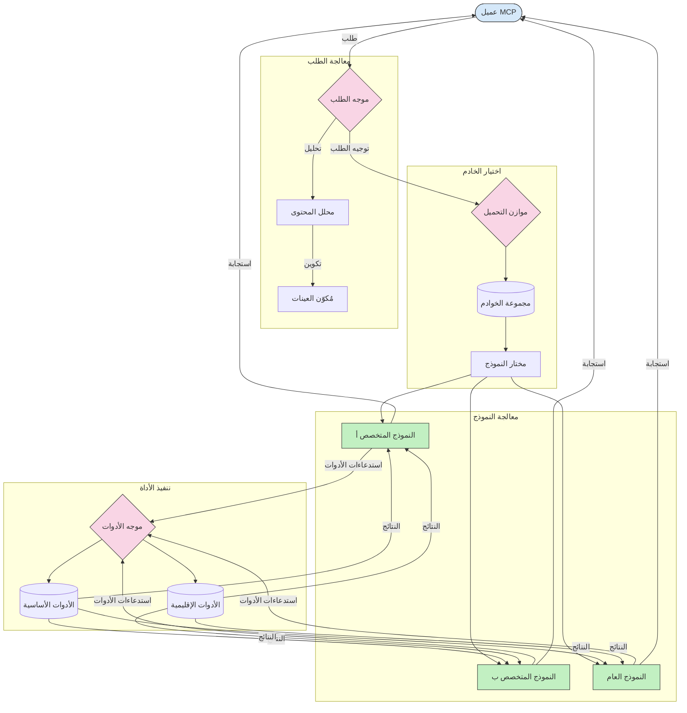

# التوجيه في بروتوكول سياق النموذج

يعد التوجيه ضروريًا لتوجيه الطلبات إلى النماذج أو الأدوات أو الخدمات المناسبة داخل نظام MCP.

## المقدمة

يتضمن التوجيه في بروتوكول سياق النموذج (MCP) توجيه الطلبات إلى النماذج أو الخدمات الأنسب بناءً على معايير مختلفة مثل نوع المحتوى، وسياق المستخدم، وحمل النظام. هذا يضمن معالجة فعالة واستغلال أمثل للموارد.

## أهداف التعلم

بحلول نهاية هذا الدرس، ستتمكن من:

- فهم مبادئ التوجيه في MCP.
- تنفيذ التوجيه القائم على المحتوى لتوجيه الطلبات إلى خدمات متخصصة.
- تطبيق استراتيجيات توزيع الحمل الذكية لتحسين استغلال الموارد.
- تنفيذ توجيه الأدوات الديناميكي بناءً على سياق الطلب.

## التوجيه القائم على المحتوى

يوجه التوجيه القائم على المحتوى الطلبات إلى خدمات متخصصة استنادًا إلى محتوى الطلب. على سبيل المثال، يمكن توجيه الطلبات المتعلقة بتوليد الشيفرة إلى نموذج شيفرة متخصص، بينما يتم إرسال طلبات الكتابة الإبداعية إلى نموذج كتابة إبداعية.

لنلق نظرة على مثال للتنفيذ في لغات برمجة مختلفة.

<details>
<summary>.NET</summary>

```csharp
// .NET Example: Content-based routing in MCP
public class ContentBasedRouter
{
    private readonly Dictionary<string, McpClient> _specializedClients;
    private readonly RoutingClassifier _classifier;
    
    public ContentBasedRouter()
    {
        // Initialize specialized clients for different domains
        _specializedClients = new Dictionary<string, McpClient>
        {
            ["code"] = new McpClient("https://code-specialized-mcp.com"),
            ["creative"] = new McpClient("https://creative-specialized-mcp.com"),
            ["scientific"] = new McpClient("https://scientific-specialized-mcp.com"),
            ["general"] = new McpClient("https://general-mcp.com")
        };
        
        // Initialize content classifier
        _classifier = new RoutingClassifier();
    }
    
    public async Task<McpResponse> RouteAndProcessAsync(string prompt, IDictionary<string, object> parameters = null)
    {
        // Classify the prompt to determine the best specialized service
        string category = await _classifier.ClassifyPromptAsync(prompt);
        
        // Get the appropriate client or fall back to general
        var client = _specializedClients.ContainsKey(category) 
            ? _specializedClients[category] 
            : _specializedClients["general"];
            
        Console.WriteLine($"Routing request to {category} specialized service");
        
        // Send request to the selected service
        return await client.SendPromptAsync(prompt, parameters);
    }
    
    // Simple classifier for routing decisions
    private class RoutingClassifier
    {
        public Task<string> ClassifyPromptAsync(string prompt)
        {
            prompt = prompt.ToLowerInvariant();
            
            if (prompt.Contains("code") || prompt.Contains("function") || 
                prompt.Contains("program") || prompt.Contains("algorithm"))
            {
                return Task.FromResult("code");
            }
            
            if (prompt.Contains("story") || prompt.Contains("creative") || 
                prompt.Contains("imagine") || prompt.Contains("design"))
            {
                return Task.FromResult("creative");
            }
            
            if (prompt.Contains("science") || prompt.Contains("research") || 
                prompt.Contains("analyze") || prompt.Contains("study"))
            {
                return Task.FromResult("scientific");
            }
            
            return Task.FromResult("general");
        }
    }
}
```

في الشيفرة السابقة، قمنا بما يلي:

- إنشاء فئة `ContentBasedRouter` التي توجه الطلبات بناءً على محتوى الطلب.
- تهيئة عملاء متخصصين لمجالات مختلفة (الشيفرة، الإبداع، العلمي، العام).
- تنفيذ مصنف بسيط يحدد فئة الطلب ويوجهها إلى الخدمة المتخصصة المناسبة.
- استخدام آلية بديلة لتوجيه الطلبات إلى خدمة عامة إذا لم تتوفر خدمة متخصصة.
- تنفيذ معالجة غير متزامنة للتعامل مع الطلبات بكفاءة.
- استخدام قاموس لربط فئات المحتوى بعملاء MCP المتخصصين.
- تنفيذ مصنف بسيط يحلل الطلب ويعيد الفئة المناسبة.
- استخدام العميل المتخصص لإرسال الطلب واستقبال الرد.
- التعامل مع الحالات التي لا يطابق فيها الطلب أي فئة متخصصة من خلال التوجيه إلى خدمة عامة.

</details>

## توزيع الحمل الذكي

توزيع الحمل يحسن استغلال الموارد ويضمن توافرًا عاليًا لخدمات MCP. هناك طرق مختلفة لتنفيذ توزيع الحمل، مثل التوزيع الدوراني، ووقت الاستجابة المرجح، أو الاستراتيجيات القائمة على المحتوى.

لنلق نظرة على المثال التالي الذي يستخدم الاستراتيجيات التالية:

- **التوزيع الدوراني**: يوزع الطلبات بالتساوي عبر الخوادم المتاحة.
- **وقت الاستجابة المرجح**: يوجه الطلبات إلى الخوادم بناءً على متوسط وقت الاستجابة.
- **القائم على المحتوى**: يوجه الطلبات إلى الخوادم المتخصصة بناءً على محتوى الطلب.

<details>
<summary>Java</summary>

```java
// مثال جافا: التوازن الذكي للحمل لخوادم MCP
public class McpLoadBalancer {
    private final List<McpServerNode> serverNodes;
    private final LoadBalancingStrategy strategy;
    
    public McpLoadBalancer(List<McpServerNode> nodes, LoadBalancingStrategy strategy) {
        this.serverNodes = new ArrayList<>(nodes);
        this.strategy = strategy;
    }
    
    public McpResponse processRequest(McpRequest request) {
        // اختيار أفضل خادم بناءً على الاستراتيجية
        McpServerNode selectedNode = strategy.selectNode(serverNodes, request);
        
        try {
            // توجيه الطلب إلى العقدة المختارة
            return selectedNode.processRequest(request);
        } catch (Exception e) {
            // التعامل مع الفشل - تنفيذ منطق إعادة المحاولة أو خطة بديلة
            System.err.println("Error processing request on node " + selectedNode.getId() + ": " + e.getMessage());
            
            // تمييز العقدة كمحتمل أن تكون غير صحية
            selectedNode.recordFailure();
            
            // تجربة العقدة الأفضل التالية كخطة بديلة
            List<McpServerNode> remainingNodes = new ArrayList<>(serverNodes);
            remainingNodes.remove(selectedNode);
            
            if (!remainingNodes.isEmpty()) {
                McpServerNode fallbackNode = strategy.selectNode(remainingNodes, request);
                return fallbackNode.processRequest(request);
            } else {
                throw new RuntimeException("All MCP server nodes failed to process the request");
            }
        }
    }
    
    // مهمة فحص صحة العقدة
    public void startHealthChecks(Duration interval) {
        ScheduledExecutorService scheduler = Executors.newScheduledThreadPool(1);
        scheduler.scheduleAtFixedRate(() -> {
            for (McpServerNode node : serverNodes) {
                try {
                    boolean isHealthy = node.checkHealth();
                    System.out.println("Node " + node.getId() + " health status: " + 
                                      (isHealthy ? "HEALTHY" : "UNHEALTHY"));
                } catch (Exception e) {
                    System.err.println("Health check failed for node " + node.getId());
                    node.setHealthy(false);
                }
            }
        }, 0, interval.toMillis(), TimeUnit.MILLISECONDS);
    }
    
    // واجهة لاستراتيجيات توازن الحمل
    public interface LoadBalancingStrategy {
        McpServerNode selectNode(List<McpServerNode> nodes, McpRequest request);
    }
    
    // استراتيجية الدوران بالتناوب
    public static class RoundRobinStrategy implements LoadBalancingStrategy {
        private AtomicInteger counter = new AtomicInteger(0);
        
        @Override
        public McpServerNode selectNode(List<McpServerNode> nodes, McpRequest request) {
            List<McpServerNode> healthyNodes = nodes.stream()
                .filter(McpServerNode::isHealthy)
                .collect(Collectors.toList());
            
            if (healthyNodes.isEmpty()) {
                throw new RuntimeException("No healthy nodes available");
            }
            
            int index = counter.getAndIncrement() % healthyNodes.size();
            return healthyNodes.get(index);
        }
    }
    
    // استراتيجية وقت الاستجابة الموزون
    public static class ResponseTimeStrategy implements LoadBalancingStrategy {
        @Override
        public McpServerNode selectNode(List<McpServerNode> nodes, McpRequest request) {
            return nodes.stream()
                .filter(McpServerNode::isHealthy)
                .min(Comparator.comparing(McpServerNode::getAverageResponseTime))
                .orElseThrow(() -> new RuntimeException("No healthy nodes available"));
        }
    }
    
    // استراتيجية الوعي بالمحتوى
    public static class ContentAwareStrategy implements LoadBalancingStrategy {
        @Override
        public McpServerNode selectNode(List<McpServerNode> nodes, McpRequest request) {
            // تحديد خصائص الطلب
            boolean isCodeRequest = request.getPrompt().contains("code") || 
                                   request.getAllowedTools().contains("codeInterpreter");
            
            boolean isCreativeRequest = request.getPrompt().contains("creative") || 
                                       request.getPrompt().contains("story");
            
            // العثور على العقد المتخصصة
            Optional<McpServerNode> specializedNode = nodes.stream()
                .filter(McpServerNode::isHealthy)
                .filter(node -> {
                    if (isCodeRequest && node.getSpecialization().equals("code")) {
                        return true;
                    }
                    if (isCreativeRequest && node.getSpecialization().equals("creative")) {
                        return true;
                    }
                    return false;
                })
                .findFirst();
            
            // إرجاع العقدة المتخصصة أو العقدة الأقل تحميلًا
            return specializedNode.orElse(
                nodes.stream()
                    .filter(McpServerNode::isHealthy)
                    .min(Comparator.comparing(McpServerNode::getCurrentLoad))
                    .orElseThrow(() -> new RuntimeException("No healthy nodes available"))
            );
        }
    }
}
```

في الشيفرة السابقة، قمنا بما يلي:

- إنشاء فئة `McpLoadBalancer` التي تدير قائمة من عقد خوادم MCP وتوجه الطلبات بناءً على استراتيجية توزيع الحمل المختارة.
- تنفيذ استراتيجيات توزيع حمل مختلفة: `RoundRobinStrategy`، و `ResponseTimeStrategy`، و `ContentAwareStrategy`.
- استخدام `ScheduledExecutorService` لفحص صحة عقد الخوادم دوريًا.
- تنفيذ آلية فحص الصحة التي تحدد حالة العقد كصحية أو غير صحية بناءً على استجابتها لفحوصات الصحة.
- التعامل مع معالجة الطلبات مع منطق التعامل مع الأخطاء والبدائل لضمان توافر عالي.
- استخدام فئة `McpServerNode` لتمثيل عقد خادم MCP الفردية، بما في ذلك حالة الصحة، ومتوسط وقت الاستجابة، والحمل الحالي.
- تنفيذ فئة `McpRequest` لتغليف تفاصيل الطلب مثل الطلب والأدوات المسموح بها.
- استخدام Java Streams لتصفية العقد واختيارها بناءً على حالة الصحة والتخصص.

</details>

## التوجيه الديناميكي للأدوات

يضمن توجيه الأدوات توجيه استدعاءات الأدوات إلى الخدمة الأنسب بناءً على السياق. على سبيل المثال، قد يحتاج استدعاء أداة الطقس إلى التوجيه إلى نقطة نهاية إقليمية بناءً على موقع المستخدم، أو قد تحتاج أداة الحاسبة إلى استخدام إصدار محدد من API.

لنلق نظرة على مثال تنفيذ يوضح التوجيه الديناميكي للأدوات بناءً على تحليل الطلب، ونقاط النهاية الإقليمية، ودعم الإصدارات.

<details>
<summary>Python</summary>

```python
# مثال بايثون: توجيه الأدوات ديناميكيًا بناءً على تحليل الطلب
class McpToolRouter:
    def __init__(self):
        # تسجيل نقاط نهاية الأدوات المتاحة
        self.tool_endpoints = {
            "weatherTool": "https://weather-service.example.com/api",
            "calculatorTool": "https://calculator-service.example.com/compute",
            "databaseTool": "https://database-service.example.com/query",
            "searchTool": "https://search-service.example.com/search"
        }
        
        # نقاط نهاية إقليمية للتوزيع العالمي
        self.regional_endpoints = {
            "us": {
                "weatherTool": "https://us-west.weather-service.example.com/api",
                "searchTool": "https://us.search-service.example.com/search"
            },
            "europe": {
                "weatherTool": "https://eu.weather-service.example.com/api",
                "searchTool": "https://eu.search-service.example.com/search"
            },
            "asia": {
                "weatherTool": "https://asia.weather-service.example.com/api",
                "searchTool": "https://asia.search-service.example.com/search"
            }
        }
        
        # دعم إصدار الأدوات
        self.tool_versions = {
            "weatherTool": {
                "default": "v2",
                "v1": "https://weather-service.example.com/api/v1",
                "v2": "https://weather-service.example.com/api/v2",
                "beta": "https://weather-service.example.com/api/beta"
            }
        }
    
    async def route_tool_request(self, tool_name, parameters, user_context=None):
        """Route a tool request to the appropriate endpoint based on context"""
        endpoint = self._select_endpoint(tool_name, parameters, user_context)
        
        if not endpoint:
            raise ValueError(f"No endpoint available for tool: {tool_name}")
        
        # تنفيذ الطلب الفعلي إلى نقطة النهاية المختارة
        return await self._execute_tool_request(endpoint, tool_name, parameters)
    
    def _select_endpoint(self, tool_name, parameters, user_context=None):
        """Select the most appropriate endpoint based on context"""
        # نقطة النهاية الأساسية من السجل
        if tool_name not in self.tool_endpoints:
            return None
            
        base_endpoint = self.tool_endpoints[tool_name]
        
        # التحقق مما إذا كنا بحاجة لاستخدام إصدار معين من الأداة
        if tool_name in self.tool_versions:
            version_info = self.tool_versions[tool_name]
            
            # استخدام الإصدار المحدد أو الافتراضي
            requested_version = parameters.get("_version", version_info["default"])
            if requested_version in version_info:
                base_endpoint = version_info[requested_version]
        
        # التحقق من التوجيه الإقليمي إذا كانت منطقة المستخدم معروفة
        if user_context and "region" in user_context:
            user_region = user_context["region"]
            
            if user_region in self.regional_endpoints:
                regional_tools = self.regional_endpoints[user_region]
                
                if tool_name in regional_tools:
                    # استخدام نقطة نهاية خاصة بالمنطقة
                    return regional_tools[tool_name]
        
        # التحقق من متطلبات إقامة البيانات
        if user_context and "data_residency" in user_context:
            # هذا سينفذ منطقًا لضمان بقاء البيانات في الاختصاص القضائي المحدد
            pass
        
        # التحقق من التوجيه القائم على الكمون
        if user_context and "latency_sensitive" in user_context and user_context["latency_sensitive"]:
            # هذا سينفذ منطقًا لاختيار نقطة النهاية ذات أقل كمون
            pass
            
        return base_endpoint
        
    async def _execute_tool_request(self, endpoint, tool_name, parameters):
        """Execute the actual tool request to the selected endpoint"""
        try:
            async with aiohttp.ClientSession() as session:
                async with session.post(
                    endpoint,
                    json={"toolName": tool_name, "parameters": parameters},
                    headers={"Content-Type": "application/json"}
                ) as response:
                    if response.status == 200:
                        result = await response.json()
                        return result
                    else:
                        error_text = await response.text()
                        raise Exception(f"Tool execution failed: {error_text}")
        except Exception as e:
            # تنفيذ منطق إعادة المحاولة أو استراتيجية التراجع
            print(f"Error executing tool {tool_name} at {endpoint}: {str(e)}")
            raise
```

في الشيفرة السابقة، قمنا بما يلي:

- إنشاء فئة `McpToolRouter` التي تدير توجيه الأدوات بناءً على تحليل الطلب، ونقاط النهاية الإقليمية، ودعم الإصدارات.
- تسجيل نقاط النهاية المتاحة للأدوات والنقاط الإقليمية للتوزيع العالمي.
- تنفيذ منطق التوجيه الديناميكي الذي يختار نقطة النهاية المناسبة بناءً على سياق المستخدم، مثل المنطقة ومتطلبات احتجاز البيانات.
- تنفيذ دعم الإصدارات للأدوات، مما يسمح للمستخدمين بتحديد الإصدار الذي يرغبون في استخدامه.
- استخدام طلبات HTTP غير متزامنة لتنفيذ استدعاءات الأدوات ومعالجة الردود.

</details>

## هندسة المعاينة والتوجيه في MCP

المعاينة هي مكون حاسم في بروتوكول سياق النموذج (MCP) الذي يسمح بمعالجة الطلبات وتوجيهها بكفاءة. تتضمن تحليل الطلبات الواردة لتحديد النموذج أو الخدمة الأنسب لمعالجتها، استنادًا إلى معايير مختلفة مثل نوع المحتوى، وسياق المستخدم، وحمل النظام.

يمكن دمج المعاينة والتوجيه لإنشاء هندسة موثوقة تحسّن استغلال الموارد وتضمن توافرًا عاليًا. يمكن استخدام عملية المعاينة لتصنيف الطلبات، في حين يقوم التوجيه بتوجيهها إلى النماذج أو الخدمات المناسبة.

يوضح الرسم البياني أدناه كيفية عمل المعاينة والتوجيه معًا في هندسة MCP شاملة:



## ما الخطوة التالية

- [5.6 المعاينة](../mcp-sampling/README.md)

---

<!-- CO-OP TRANSLATOR DISCLAIMER START -->
**تنويه**:
تمت ترجمة هذا المستند باستخدام خدمة الترجمة بالذكاء الاصطناعي [Co-op Translator](https://github.com/Azure/co-op-translator). بينما نسعى للدقة، يرجى العلم أن الترجمات الآلية قد تحتوي على أخطاء أو عدم دقة. يجب اعتبار المستند الأصلي بلغته الأصلية المصدر الرسمي والمعتمد. للمعلومات الهامة، يُنصح بالاستعانة بترجمة بشرية محترفة. نحن غير مسؤولين عن أي سوء فهم أو تفسير ناتج عن استخدام هذه الترجمة.
<!-- CO-OP TRANSLATOR DISCLAIMER END -->