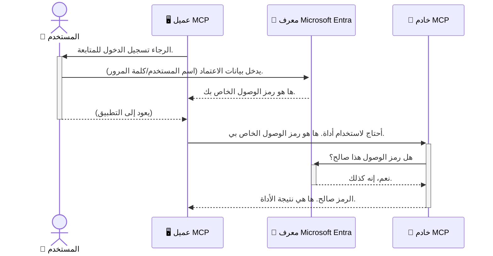

# تأمين سير عمل الذكاء الاصطناعي: مصادقة Entra ID لخوادم بروتوكول سياق النموذج

> [!NOTE]
> كود الخادم البعيد في هذا الدرس يحمي نقاط النهاية القديمة `/sse` و `/message`
> ويستهدف MCP `2025-11-25`. احتفظ بهويته وممارسات التحقق من صحة الرمز المميز،
> لكن استخدم قالب نقل HTTP Streamable المتوافق مع `2026-07-28`
> للتطبيقات الجديدة.

## مقدمة
تأمين خادم بروتوكول سياق النموذج (MCP) الخاص بك مهم مثل إغلاق باب منزلك الأمامي. ترك خادم MCP مفتوحًا يعرض أدواتك وبياناتك للوصول غير المصرح به، مما قد يؤدي إلى خروقات أمنية. توفر Microsoft Entra ID حلاً قويًا لإدارة الهوية والوصول قائمًا على السحابة، مما يساعد على ضمان أن المستخدمين والتطبيقات المخولين فقط هم من يتفاعلون مع خادم MCP الخاص بك. في هذا القسم، ستتعلم كيفية حماية سير عمل الذكاء الاصطناعي باستخدام مصادقة Entra ID.

## أهداف التعلم
بنهاية هذا القسم، ستكون قادرًا على:

- فهم أهمية تأمين خوادم MCP.
- شرح أساسيات Microsoft Entra ID والمصادقة باستخدام OAuth 2.0.
- التمييز بين العملاء العامين والعملاء السريين.
- تنفيذ مصادقة Entra ID في سيناريوهات خادم MCP المحلي (عميل عام) والبعيد (عميل سري).
- تطبيق أفضل الممارسات الأمنية عند تطوير سير عمل الذكاء الاصطناعي.

## الأمن وMCP

تمامًا كما لا تترك باب المنزل الأمامي مفتوحًا، لا ينبغي أن تترك خادم MCP مفتوحًا لأي شخص للوصول إليه. تأمين سير عمل الذكاء الاصطناعي الخاص بك ضروري لبناء تطبيقات قوية وموثوقة وآمنة. سيقدم لك هذا الفصل كيفية استخدام Microsoft Entra ID لتأمين خوادم MCP الخاصة بك، مما يضمن أن المستخدمين والتطبيقات المصرح لهم فقط يمكنهم التفاعل مع أدواتك وبياناتك.

## لماذا الأمن مهم لخوادم MCP

تخيل أن خادم MCP الخاص بك يحتوي على أداة يمكنها إرسال رسائل بريد إلكتروني أو الوصول إلى قاعدة بيانات العملاء. سيرفر غير مؤمن يعني أن أي شخص يمكنه استخدام تلك الأداة، مما يؤدي إلى وصول غير مصرح به للبيانات، أو رسائل غير مرغوب فيها، أو أنشطة خبيثة أخرى.

من خلال تنفيذ المصادقة، تضمن التحقق من كل طلب يتم إرساله إلى خادمك، مما يؤكد هوية المستخدم أو التطبيق الذي يقوم بالطلب. هذه هي الخطوة الأولى والأكثر أهمية في تأمين سير عمل الذكاء الاصطناعي الخاص بك.

## مقدمة إلى Microsoft Entra ID

[**Microsoft Entra ID**](https://adoption.microsoft.com/microsoft-security/entra/) هي خدمة إدارة الهوية والوصول قائمة على السحابة. فكر فيها كحارس أمني شامل لتطبيقاتك. تتولى العمليات المعقدة للتحقق من هوية المستخدمين (المصادقة) وتحديد ما يسمح لهم به (التفويض).

باستخدام Entra ID، يمكنك:

- تمكين تسجيل دخول آمن للمستخدمين.
- حماية واجهات برمجة التطبيقات والخدمات.
- إدارة سياسات الوصول من موقع مركزي.

بالنسبة لخوادم MCP، توفر Entra ID حلاً قويًا وموثوقًا لإدارة من يمكنه الوصول إلى قدرات الخادم الخاص بك.

---

## فهم السحر: كيف تعمل مصادقة Entra ID

تستخدم Entra ID معايير مفتوحة مثل **OAuth 2.0** للتعامل مع المصادقة. رغم أن التفاصيل قد تكون معقدة، إلا أن المفهوم الأساسي بسيط ويمكن فهمه بتشبيه.

### مقدمة بسيطة لـ OAuth 2.0: مفتاح الخدمة

فكر في OAuth 2.0 كخدمة صف سيارات لسيارتك. عند وصولك إلى مطعم، لا تعطي صف السيارات مفتاح سيارتك الرئيسي. بدلاً من ذلك، تعطيه **مفتاح الخدمة** الذي له أذونات محدودة– يمكنه تشغيل السيارة وقفل الأبواب، لكنه لا يمكنه فتح الصندوق الخلفي أو صندوق القفازات.

في هذا التشبيه:

- **أنت** هو **المستخدم**.
- **سيارتك** هي **خادم MCP** مع أدواته وبياناته القيمة.
- **خدمة صف السيارات** هي **Microsoft Entra ID**.
- **حارس مواقف السيارات** هو **عميل MCP** (التطبيق الذي يحاول الوصول إلى الخادم).
- **مفتاح الخدمة** هو **رمز الوصول**.

رمز الوصول هو سلسلة نصية آمنة يحصل عليها عميل MCP من Entra ID بعد تسجيل الدخول. ثم يعرض العميل هذا الرمز على خادم MCP مع كل طلب. يمكن للخادم التحقق من الرمز للتأكد من أن الطلب شرعي وأن العميل لديه الأذونات اللازمة، كل ذلك دون الحاجة للتعامل مع بيانات اعتمادك الفعلية (مثل كلمة المرور).

### تدفق المصادقة

هكذا يعمل العملية عمليًا:



### مقدمة إلى مكتبة المصادقة من مايكروسوفت (MSAL)

قبل الغوص في الكود، من المهم تقديم مكون رئيسي سترى في الأمثلة: **مكتبة المصادقة من مايكروسوفت (MSAL)**.

MSAL هي مكتبة طورتها مايكروسوفت تسهل كثيرًا على المطورين التعامل مع المصادقة. بدلاً من كتابة كل الكود المعقد لإدارة رموز الأمان، تسجيل الدخول، وتجديد الجلسات، تقوم MSAL بكل العمل الشاق.

من الموصى به بشدة استخدام مكتبة مثل MSAL لأنها:

- **آمنة:** تنفذ بروتوكولات ومعايير صناعية وأفضل ممارسات الأمان، مما يقلل من مخاطر الثغرات في كودك.
- **تبسط التطوير:** تزيل التعقيد المتعلق ببروتوكولات OAuth 2.0 وOpenID Connect، مما يسمح لك بإضافة مصادقة قوية لتطبيقك ببضع أسطر من الكود فقط.
- **مدعومة ومستعملة:** مايكروسوفت تقوم بصيانة وتحديث MSAL بشكل نشط لمعالجة التهديدات الأمنية الجديدة والتغييرات في المنصات.

تدعم MSAL مجموعة واسعة من اللغات وأطر التطبيقات، بما في ذلك .NET، جافا سكريبت/تايب سكريبت، بايثون، جافا، جو، ومنصات الهواتف المحمولة مثل iOS وAndroid. هذا يعني أنه يمكنك استخدام نفس نماذج المصادقة المتناسقة عبر جميع تقنياتك.

لمعرفة المزيد عن MSAL، يمكنك الاطلاع على الوثائق الرسمية لنظرة عامة [على MSAL](https://learn.microsoft.com/entra/identity-platform/msal-overview).

---

## تأمين خادم MCP الخاص بك باستخدام Entra ID: دليل خطوة بخطوة

الآن، دعنا نتعرف كيف تؤمن خادم MCP محلي (يتواصل عبر `stdio`) باستخدام Entra ID. يستخدم هذا المثال **عميلًا عامًا**، وهو مناسب للتطبيقات التي تعمل على جهاز المستخدم، مثل تطبيق سطح مكتب أو خادم تطوير محلي.

### السيناريو 1: تأمين خادم MCP محلي (بعميل عام)

في هذا السيناريو، سنتناول خادم MCP يعمل محليًا، يتواصل عبر `stdio`، ويستخدم Entra ID لمصادقة المستخدم قبل منح الوصول لأدواته. سيكون لدى الخادم أداة واحدة فقط تسترجع معلومات الملف الشخصي للمستخدم من Microsoft Graph API.

#### 1. إعداد التطبيق في Entra ID

قبل كتابة أي كود، تحتاج إلى تسجيل تطبيقك في Microsoft Entra ID. يخبر هذا Entra ID عن تطبيقك ويمنحه إذنًا لاستخدام خدمة المصادقة.

1. انتقل إلى **[بوابة Microsoft Entra](https://entra.microsoft.com/)**.
2. اذهب إلى **تسجيلات التطبيقات** وانقر على **تسجيل جديد**.
3. امنح تطبيقك اسمًا (مثل "خادم MCP المحلي الخاص بي").
4. لـ **أنواع الحسابات المدعومة**، اختر **الحسابات في هذا الدليل التنظيمي فقط**.
5. يمكنك ترك **URI إعادة التوجيه** فارغًا لهذا المثال.
6. انقر **تسجيل**.

بعد التسجيل، لاحظ **معرّف التطبيق (معرف العميل)** و **معرّف الدليل (المستأجر)**. ستحتاجهما في كودك.

#### 2. الكود: شرح تفصيلي

لنتعرف على الأجزاء الرئيسية من الكود التي تتعامل مع المصادقة. الكود الكامل لهذا المثال متاح في مجلد [Entra ID - Local - WAM](https://github.com/Azure-Samples/mcp-auth-servers/tree/main/src/entra-id-local-wam) من مستودع [mcp-auth-servers على GitHub](https://github.com/Azure-Samples/mcp-auth-servers).

**`AuthenticationService.cs`**

هذه الفئة مسؤولة عن التعامل مع التفاعل مع Entra ID.

- **`CreateAsync`**: هذه الطريقة تهيئ `PublicClientApplication` من MSAL (مكتبة المصادقة من Microsoft). يتم تكوينها باستخدام `clientId` و`tenantId` الخاص بتطبيقك.
- **`WithBroker`**: تتيح استخدام وكيل (مثل Windows Web Account Manager) الذي يوفر تجربة تسجيل دخول موحدة أكثر أمانًا وسلاسة.
- **`AcquireTokenAsync`**: هذه هي الطريقة الأساسية. تحاول أولًا الحصول على رمز وصول بهدوء (أي دون الحاجة لتسجيل دخول متكرر إذا كانت هناك جلسة صالحة بالفعل). إذا لم يكن بالإمكان الحصول على رمز صامت، فإنها تطلب من المستخدم تسجيل الدخول تفاعليًا.

```csharp
// Simplified for clarity
public static async Task<AuthenticationService> CreateAsync(ILogger<AuthenticationService> logger)
{
    var msalClient = PublicClientApplicationBuilder
        .Create(_clientId) // Your Application (client) ID
        .WithAuthority(AadAuthorityAudience.AzureAdMyOrg)
        .WithTenantId(_tenantId) // Your Directory (tenant) ID
        .WithBroker(new BrokerOptions(BrokerOptions.OperatingSystems.Windows))
        .Build();

    // ... cache registration ...

    return new AuthenticationService(logger, msalClient);
}

public async Task<string> AcquireTokenAsync()
{
    try
    {
        // Try silent authentication first
        var accounts = await _msalClient.GetAccountsAsync();
        var account = accounts.FirstOrDefault();

        AuthenticationResult? result = null;

        if (account != null)
        {
            result = await _msalClient.AcquireTokenSilent(_scopes, account).ExecuteAsync();
        }
        else
        {
            // If no account, or silent fails, go interactive
            result = await _msalClient.AcquireTokenInteractive(_scopes).ExecuteAsync();
        }

        return result.AccessToken;
    }
    catch (Exception ex)
    {
        _logger.LogError(ex, "An error occurred while acquiring the token.");
        throw; // Optionally rethrow the exception for higher-level handling
    }
}
```

**`Program.cs`**

هنا يتم إعداد خادم MCP ودمج خدمة المصادقة.

- **`AddSingleton<AuthenticationService>`**: يسجل خدمة `AuthenticationService` في حاوية حقن التبعيات، بحيث يمكن استخدامها من أجزاء أخرى من التطبيق (مثل الأداة الخاصة بنا).
- أداة **`GetUserDetailsFromGraph`**: تتطلب هذه الأداة نسخة من `AuthenticationService`. قبل القيام بأي شيء، تستدعي `authService.AcquireTokenAsync()` للحصول على رمز وصول صالح. إذا نجحت المصادقة، تستخدم الرمز لاستدعاء Microsoft Graph API وجلب تفاصيل المستخدم.

```csharp
// Simplified for clarity
[McpServerTool(Name = "GetUserDetailsFromGraph")]
public static async Task<string> GetUserDetailsFromGraph(
    AuthenticationService authService)
{
    try
    {
        // This will trigger the authentication flow
        var accessToken = await authService.AcquireTokenAsync();

        // Use the token to create a GraphServiceClient
        var graphClient = new GraphServiceClient(
            new BaseBearerTokenAuthenticationProvider(new TokenProvider(authService)));

        var user = await graphClient.Me.GetAsync();

        return System.Text.Json.JsonSerializer.Serialize(user);
    }
    catch (Exception ex)
    {
        return $"Error: {ex.Message}";
    }
}
```

#### 3. كيف يعمل كل شيء معًا

1. عندما يحاول عميل MCP استخدام أداة `GetUserDetailsFromGraph`، تستدعي الأداة أولاً `AcquireTokenAsync`.
2. تستدعي `AcquireTokenAsync` مكتبة MSAL للتحقق من وجود رمز وصول صالح.
3. إذا لم يُعثر على رمز، تقوم MSAL، عبر الوكيل، بطلب تسجيل دخول المستخدم باستخدام حساب Entra ID الخاص به.
4. بعد تسجيل الدخول، تصدر Entra ID رمز وصول.
5. تتلقى الأداة الرمز وتستخدمه لإجراء مكالمة آمنة إلى Microsoft Graph API.
6. تعاد تفاصيل المستخدم إلى عميل MCP.

تضمن هذه العملية أن المستخدمين المصادق عليهم فقط يمكنهم استخدام الأداة، مما يؤمن فعليًا خادم MCP المحلي الخاص بك.

### السيناريو 2: تأمين خادم MCP بعيد (بعميل سري)

عندما يعمل خادم MCP الخاص بك على جهاز بعيد (مثل خادم سحابي) ويتواصل عبر بروتوكول مثل HTTP Streaming، تختلف متطلبات الأمان. في هذه الحالة، يجب استخدام **عميل سري** و **تدفق رمز التفويض**. هذه طريقة أكثر أمانًا لأن أسرار التطبيق لا يتم كشفها أبدًا للمتصفح.

يستخدم هذا المثال خادم MCP مبني على TypeScript يستخدم Express.js لمعالجة طلبات HTTP.

#### 1. إعداد التطبيق في Entra ID

الإعداد في Entra ID مشابه للعميل العام، ولكن مع فرق رئيسي واحد: تحتاج إلى إنشاء **سر عميل**.

1. انتقل إلى **[بوابة Microsoft Entra](https://entra.microsoft.com/)**.
2. في تسجيل تطبيقك، اذهب إلى تبويب **الشهادات والأسرار**.
3. انقر **سر عميل جديد**، امنحه وصفًا، وانقر **إضافة**.
4. **مهم:** انسخ قيمة السر فورًا. لن تتمكن من رؤيته مرة أخرى.
5. تحتاج أيضًا إلى تكوين **URI إعادة التوجيه**. اذهب إلى تبويب **المصادقة**، انقر **إضافة منصة**، اختر **ويب**، وأدخل URI إعادة التوجيه الخاص بتطبيقك (مثل `http://localhost:3001/auth/callback`).

> **⚠️ ملاحظة أمان مهمة:** بالنسبة للتطبيقات الإنتاجية، توصي Microsoft بشدة باستخدام طرق **المصادقة بدون أسرار** مثل **الهوية المُدارة** أو **اتحاد هوية عبء العمل** بدلاً من أسرار العميل. أسرار العميل تشكل مخاطر أمنية لأنها قد تُكشَف أو تُخترق. توفر الهويات المُدارة نهجًا أكثر أمانًا عن طريق إزالة الحاجة إلى تخزين بيانات الاعتماد في كودك أو تكوينك.
>
> لمزيد من المعلومات عن الهويات المُدارة وكيفية تنفيذها، راجع [نظرة عامة على الهويات المُدارة لموارد Azure](https://learn.microsoft.com/entra/identity/managed-identities-azure-resources/overview).

#### 2. الكود: شرح تفصيلي

يستخدم هذا المثال نهجًا قائمًا على الجلسات. عندما يقوم المستخدم بالمصادقة، يخزن الخادم رمز الوصول ورمز التحديث في الجلسة ويعطي المستخدم رمز جلسة. يُستخدم رمز الجلسة هذا للطلبات اللاحقة. الكود الكامل لهذا المثال متاح في مجلد [Entra ID - Confidential client](https://github.com/Azure-Samples/mcp-auth-servers/tree/main/src/entra-id-cca-session) من مستودع [mcp-auth-servers على GitHub](https://github.com/Azure-Samples/mcp-auth-servers).

**`Server.ts`**

هذا الملف يقوم بإعداد خادم Express وطبقة نقل MCP.

- **`requireBearerAuth`**: هذا هو الوسيط الذي يحمي نقاط النهاية `/sse` و `/message`. يتحقق من وجود رمز حامل صالح في رأس `Authorization` للطلب.
- **`EntraIdServerAuthProvider`**: هذه فئة مخصصة تنفذ واجهة `McpServerAuthorizationProvider`. مسؤولة عن التعامل مع تدفق OAuth 2.0.
- **`/auth/callback`**: يعالج هذا نقطة النهاية إعادة التوجيه من Entra ID بعد أن يقوم المستخدم بالمصادقة. يستبدل رمز التفويض برمز وصول ورمز تحديث.

```typescript
// مبسطة للوضوح
const app = express();
const { server } = createServer();
const provider = new EntraIdServerAuthProvider();

// حماية نقطة نهاية SSE
app.get("/sse", requireBearerAuth({
  provider,
  requiredScopes: ["User.Read"]
}), async (req, res) => {
  // ... الاتصال بالناقل ...
});

// حماية نقطة نهاية الرسالة
app.post("/message", requireBearerAuth({
  provider,
  requiredScopes: ["User.Read"]
}), async (req, res) => {
  // ... معالجة الرسالة ...
});

// معالجة رد نداء OAuth 2.0
app.get("/auth/callback", (req, res) => {
  provider.handleCallback(req.query.code, req.query.state)
    .then(result => {
      // ... معالجة النجاح أو الفشل ...
    });
});
```

**`Tools.ts`**

هذا الملف يعرّف الأدوات التي يوفرها خادم MCP. أداة `getUserDetails` مشابهة لتلك في المثال السابق، لكنها تحصل على رمز الوصول من الجلسة.

```typescript
// مبسط للوضوح
server.setRequestHandler(CallToolRequestSchema, async (request) => {
  const { name } = request.params;
  const context = request.params?.context as { token?: string } | undefined;
  const sessionToken = context?.token;

  if (name === ToolName.GET_USER_DETAILS) {
    if (!sessionToken) {
      throw new AuthenticationError("Authentication token is missing or invalid. Ensure the token is provided in the request context.");
    }

    // الحصول على رمز تعريف Entra من مخزن الجلسة
    const tokenData = tokenStore.getToken(sessionToken);
    const entraIdToken = tokenData.accessToken;

    const graphClient = Client.init({
      authProvider: (done) => {
        done(null, entraIdToken);
      }
    });

    const user = await graphClient.api('/me').get();

    // ... إرجاع تفاصيل المستخدم ...
  }
});
```

**`auth/EntraIdServerAuthProvider.ts`**

هذه الفئة تتعامل مع المنطق الخاص بـ:

- إعادة توجيه المستخدم إلى صفحة تسجيل الدخول في Entra ID.
- استبدال رمز التفويض برمز وصول.
- تخزين الرموز في `tokenStore`.
- تحديث رمز الوصول عند انتهاء صلاحيته.


#### 3. كيف يعمل كل هذا معًا

1. عندما يحاول المستخدم لأول مرة الاتصال بخادم MCP، سيرى وسيط `requireBearerAuth` أنه لا يمتلك جلسة صالحة وسيعيد توجيهه إلى صفحة تسجيل الدخول في Entra ID.
2. يقوم المستخدم بتسجيل الدخول باستخدام حساب Entra ID الخاص به.
3. يقوم Entra ID بإعادة توجيه المستخدم إلى نقطة النهاية `/auth/callback` مع رمز تفويض.
4. يقوم الخادم بمبادلة الرمز مقابل رمز وصول ورمز تحديث، يخزنهما، وينشئ رمز جلسة يُرسل إلى العميل.
5. يمكن للعميل الآن استخدام رمز الجلسة هذا في رأس `Authorization` لجميع الطلبات المستقبلية إلى خادم MCP.
6. عند استدعاء أداة `getUserDetails`، تستخدم رمز الجلسة للبحث عن رمز وصول Entra ID ثم تستخدمه لاستدعاء Microsoft Graph API.

هذا التدفق أكثر تعقيدًا من تدفق العميل العام، لكنه مطلوب لنقاط النهاية المتاحة على الإنترنت. نظراً لأن خوادم MCP البعيدة متاحة عبر الإنترنت العام، فهي تحتاج إلى إجراءات أمان أقوى للحماية من الوصول غير المصرح به والهجمات المحتملة.


## أفضل ممارسات الأمان

- **استخدم HTTPS دائمًا**: قم بتشفير التواصل بين العميل والخادم لحماية الرموز من الاعتراض.
- **تنفيذ التحكم في الوصول المعتمد على الدور (RBAC)**: لا تكتفِ بالتحقق *إذا* كان المستخدم قد تم التحقق منه؛ تحقق *ماذا* يُسمح له بالقيام به. يمكنك تعريف الأدوار في Entra ID والتحقق منها في خادم MCP الخاص بك.
- **المراقبة والتدقيق**: سجّل جميع أحداث المصادقة لتتمكن من اكتشاف النشاط المشبوه والاستجابة له.
- **التعامل مع تحديد المعدل والتقييد**: تقوم Microsoft Graph وواجهات برمجة التطبيقات الأخرى بتطبيق تحديد المعدل لمنع الإساءة. نفذ تراجعًا أسيًا ومنطق إعادة المحاولة في خادم MCP الخاص بك للتعامل بسلاسة مع استجابات HTTP 429 (طلبات كثيرة جدًا). فكر في تخزين البيانات التي يتم الوصول إليها بشكل متكرر مؤقتًا لتقليل من عمليات استدعاء API.
- **تأمين تخزين الرموز**: احفظ رموز الوصول ورموز التحديث بشكل آمن. لتطبيقات سطح المكتب، استخدم آليات التخزين الآمن للنظام. لتطبيقات الخادم، فكر في استخدام التخزين المشفر أو خدمات إدارة المفاتيح الآمنة مثل Azure Key Vault.
- **معالجة انتهاء صلاحية الرموز**: رموز الوصول لها فترة صلاحية محدودة. نفذ تحديثًا تلقائيًا للرموز باستخدام رموز التحديث للحفاظ على تجربة مستخدم سلسة دون الحاجة إلى إعادة المصادقة.
- **فكر في استخدام Azure API Management**: بينما يمنحك تنفيذ الأمان مباشرة في خادم MCP تحكمًا دقيقًا، يمكن لـ API Gateways مثل Azure API Management التعامل مع العديد من هذه المخاوف الأمنية تلقائيًا، بما في ذلك المصادقة والتفويض وتحديد المعدل والمراقبة. توفر طبقة أمان مركزية تقع بين عملائك وخوادم MCP الخاصة بك. لمزيد من التفاصيل حول استخدام API Gateways مع MCP، راجع [Azure API Management Your Auth Gateway For MCP Servers](https://techcommunity.microsoft.com/blog/integrationsonazureblog/azure-api-management-your-auth-gateway-for-mcp-servers/4402690).


## النقاط الرئيسية

- تأمين خادم MCP الخاص بك أمر حيوي لحماية بياناتك وأدواتك.
- يوفر Microsoft Entra ID حلاً قويًا وقابلًا للتوسع للمصادقة والتفويض.
- استخدم **عميل عام** للتطبيقات المحلية و**عميل سري** للخوادم البعيدة.
- يعتبر **تدفق رمز التفويض** الخيار الأكثر أمانًا لتطبيقات الويب.


## التمرين

1. فكر في خادم MCP قد تبنيه. هل سيكون خادمًا محليًا أم بعيدًا؟
2. بناءً على إجابتك، هل ستستخدم عميلًا عامًا أم عميلًا سريًا؟
3. ما الإذن الذي سيطلبه خادم MCP الخاص بك لأداء الإجراءات ضد Microsoft Graph؟


## تمارين عملية

### التمرين 1: تسجيل تطبيق في Entra ID
انتقل إلى بوابة Microsoft Entra.
سجّل تطبيقًا جديدًا لخادم MCP الخاص بك.
سجل معرف التطبيق (العميل) ومعرف الدليل (المستأجر).

### التمرين 2: تأمين خادم MCP محلي (عميل عام)
- اتبع مثال الشيفرة لدمج MSAL (مكتبة مصادقة مايكروسوفت) لمصادقة المستخدم.
- اختبر تدفق المصادقة من خلال استدعاء أداة MCP التي تجلب تفاصيل المستخدم من Microsoft Graph.

### التمرين 3: تأمين خادم MCP بعيد (عميل سري)
- سجّل عميلًا سريًا في Entra ID وأنشئ سر عميل.
- قم بتكوين خادم MCP الخاص بك باستخدام Express.js لاستخدام تدفق رمز التفويض.
- اختبر نقاط النهاية المحمية وتأكد من الوصول باستخدام الرموز.

### التمرين 4: تطبيق أفضل ممارسات الأمان
- فعّل HTTPS لخادمك المحلي أو البعيد.
- نفّذ التحكم في الوصول المعتمد على الدور (RBAC) في منطق الخادم.
- أضف معالجة انتهاء صلاحية الرموز وتخزين الرموز بشكل آمن.

## الموارد

1. **توثيق نظرة عامة على MSAL**  
   تعلم كيف تتيح مكتبة مصادقة مايكروسوفت (MSAL) اكتساب الرموز بشكل آمن عبر المنصات:  
   [MSAL Overview on Microsoft Learn](https://learn.microsoft.com/en-gb/entra/msal/overview)

2. **مستودع GitHub الخاص بـ Azure-Samples/mcp-auth-servers**  
   تطبيقات مرجعية لخوادم MCP توضح تدفقات المصادقة:  
   [Azure-Samples/mcp-auth-servers on GitHub](https://github.com/Azure-Samples/mcp-auth-servers)

3. **نظرة عامة على الهويات المُدارة لموارد Azure**  
   فهم كيفية القضاء على الأسرار باستخدام الهويات المُدارة المعينة للنظام أو للمستخدم:  
   [Managed Identities Overview on Microsoft Learn](https://learn.microsoft.com/en-us/entra/identity/managed-identities-azure-resources/)

4. **إدارة API في Azure: بوابة المصادقة الخاصة بك لخوادم MCP**  
   نظرة عميقة على استخدام APIM كبوابة OAuth2 آمنة لخوادم MCP:  
   [Azure API Management Your Auth Gateway For MCP Servers](https://techcommunity.microsoft.com/blog/integrationsonazureblog/azure-api-management-your-auth-gateway-for-mcp-servers/4402690)

5. **مرجع أذونات Microsoft Graph**  
   قائمة شاملة بالأذونات التي يتم تفويضها والأذونات التطبيقية لـ Microsoft Graph:  
   [Microsoft Graph Permissions Reference](https://learn.microsoft.com/zh-tw/graph/permissions-reference)


## مخرجات التعلم
بعد إتمام هذا القسم، ستكون قادرًا على:

- التعبير عن سبب أهمية المصادقة لخوادم MCP وسير عمل الذكاء الاصطناعي.
- إعداد وتكوين مصادقة Entra ID لكل من سيناريوهات خادم MCP المحلي والبعيد.
- اختيار نوع العميل المناسب (عام أو سري) بناءً على نشر الخادم الخاص بك.
- تنفيذ ممارسات الترميز الآمن، بما في ذلك تخزين الرموز والتفويض المعتمد على الدور.
- حماية خادم MCP الخاص بك وأدواته بثقة من الوصول غير المصرح به.

## ما التالي

- [5.13 بروتوكول سياق النموذج (MCP) والتكامل مع Microsoft Foundry](../mcp-foundry-agent-integration/README.md)

---

<!-- CO-OP TRANSLATOR DISCLAIMER START -->
**تنويه**:
تمت ترجمة هذا المستند باستخدام خدمة الترجمة بالذكاء الاصطناعي [Co-op Translator](https://github.com/Azure/co-op-translator). بينما نسعى للدقة، يرجى العلم أن الترجمات الآلية قد تحتوي على أخطاء أو عدم دقة. يجب اعتبار المستند الأصلي بلغته الأصلية المصدر الرسمي والمعتمد. للمعلومات الهامة، يُنصح بالاستعانة بترجمة بشرية محترفة. نحن غير مسؤولين عن أي سوء فهم أو تفسير ناتج عن استخدام هذه الترجمة.
<!-- CO-OP TRANSLATOR DISCLAIMER END -->