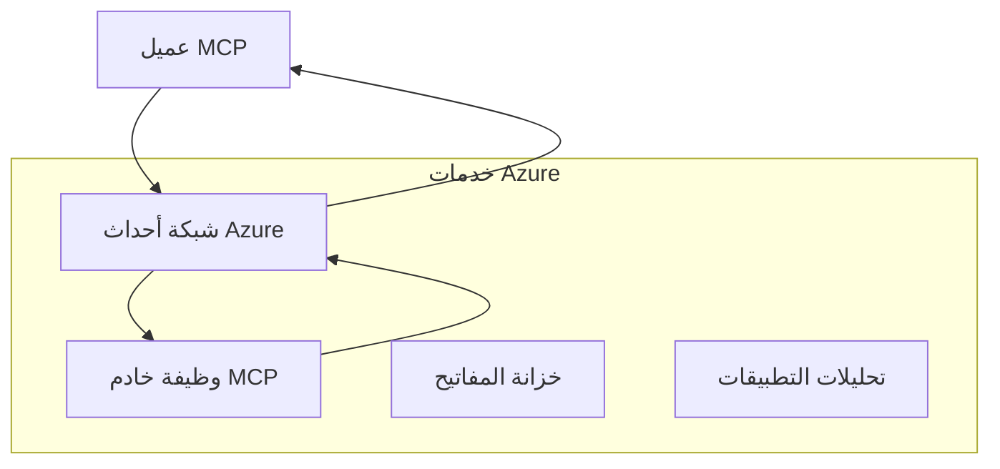
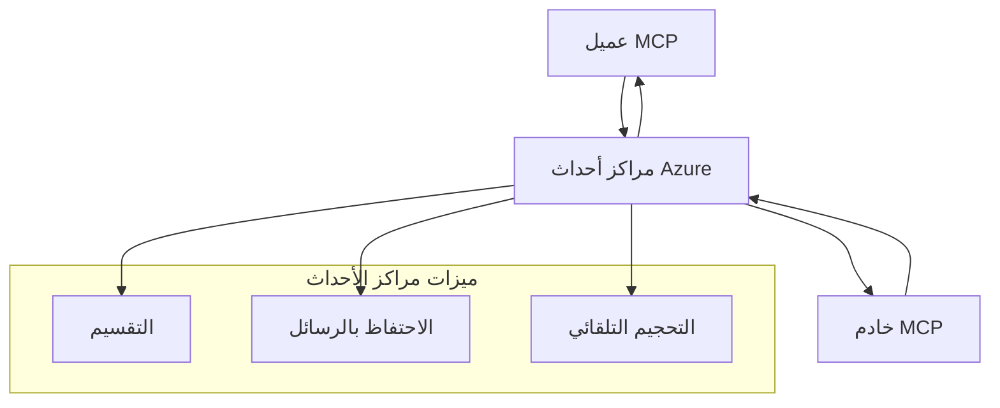

# MCP وسائل نقل مخصصة - دليل التنفيذ المتقدم

يسمح بروتوكول نموذج السياق (MCP) بتنفيذ وسائل نقل مخصصة للبيئات المتخصصة. يستعرض هذا الدليل المتقدم شبكة أحداث Azure و
مراكز أحداث Azure كنماذج معمارية. هذه ليست وسائل نقل MCP قياسية
وتتطلب اتفاقًا من كلا الطرفين على التعيين المخصص.


> لذا يجب ألا تعتمد وسائل النقل المخصصة على تقارب الجلسة أو
> الترتيب لكل جلسة. رؤوس `Mcp-Method` و `Mcp-Name` الشرطية
> هي متطلبات النقل القياسي HTTP القابل للبث؛
> تحتاج وسائل النقل غير HTTP إلى تعيين مكافئ، متفق عليه صراحة
> إذا كان يجب على الوسطاء التوجيه
> دون فك ترميز جسم JSON-RPC. انظر
> [ما الذي تغيّر في MCP: مواصفة 2026-07-28](../../01-CoreConcepts/mcp-2026-07-28.md).

## المقدمة

وسائل النقل القياسية في MCP هي stdio و Streamable HTTP. تستخدم بعض بيئات المؤسسات تعيينًا مخصصًا للتكامل مع
بنية الرسائل الحالية،
لكن ذلك قد يقلل من التوافقية مع مضيفي MCP و
SDKs التي تطبق فقط وسائل النقل القياسية.

تطبق هذه الدرس متطلبات البروتوكول stateless الخاصة بـ MCP Specification
`2026-07-28` على خدمات رسائل Azure وأنماط
التكامل المؤسسي المعتمدة.

### **معمارية نقل MCP**

**من مواصفة MCP `2026-07-28`:**

- **وسائل النقل القياسية**: stdio و Streamable HTTP
- **وسائل النقل المخصصة**: تعيينات اختيارية خاصة بالتنفيذ يتم الاتفاق عليها بين الطرفين

- **تنسيق الرسالة**: JSON-RPC 2.0 مع امتدادات خاصة بـ MCP
- **طلبات مكتفية ذاتيًا**: لا تتوفر جلسة بروتوكول أو مصافحة
    لنقل الحالة بين الطلبات

## أهداف التعلم

بنهاية هذا الدرس المتقدم، ستكون قادرًا على:

- **فهم متطلبات النقل المخصص**: تنفيذ بروتوكول MCP عبر أي طبقة نقل مع الحفاظ على الامتثال
- **بناء نقل شبكة أحداث Azure**: إنشاء خوادم MCP مدفوعة بالأحداث باستخدام Azure Event Grid للقابلية على التوسع بدون خوادم
- **تنفيذ نقل مراكز أحداث Azure**: تصميم حلول MCP عالية الإنتاجية باستخدام Azure Event Hubs للبث في الزمن الحقيقي
- **تطبيق أنماط المؤسسات**: دمج وسائل النقل المخصصة مع البنية التحتية والنماذج الأمنية لـ Azure
- **معالجة موثوقية النقل**: تنفيذ متانة الرسائل والترتيب والتعامل مع الأخطاء لسيناريوهات المؤسسات
- **تحسين الأداء**: تصميم حلول النقل لمتطلبات السعة والكمون ومعدل الإرسال

## **متطلبات النقل**

### **المتطلبات الأساسية لـ MCP `2026-07-28`**

```yaml
Message Protocol:
  format: "JSON-RPC 2.0 with MCP extensions"
    correlation: "Match responses to requests by JSON-RPC id"
    state: "Each request must be self-contained"
  
Transport Layer:
  reliability: "Transport MUST handle connection failures gracefully"
  security: "Transport MUST support secure communication"
    identification: "Carry protocol version, capabilities, and identity per request"
  
Custom Transport:
    compliance: "Map the selected MCP revision without adding session assumptions"
  extensibility: "MAY add transport-specific features"
    interoperability: "Both endpoints MUST agree on the custom mapping"
```

## **تنفيذ نقل شبكة أحداث Azure**

توفر شبكة أحداث Azure خدمة توجيه أحداث بدون خادم مثالية للعمليات المعتمدة على الأحداث في معماريات MCP. يوضح هذا التنفيذ كيفية بناء أنظمة MCP قابلة للتوسع ومصممة بشكل مرن.

### **نظرة عامة على المعمارية**



### **تنفيذ C# - نقل شبكة الأحداث**

```csharp
using Azure.Messaging.EventGrid;
using Microsoft.Extensions.Azure;
using System.Text.Json;

public class EventGridMcpTransport : IMcpTransport
{
    private readonly EventGridPublisherClient _publisher;
    private readonly string _topicEndpoint;
    private readonly string _clientId;
    
    public EventGridMcpTransport(string topicEndpoint, string accessKey, string clientId)
    {
        _publisher = new EventGridPublisherClient(
            new Uri(topicEndpoint), 
            new AzureKeyCredential(accessKey));
        _topicEndpoint = topicEndpoint;
        _clientId = clientId;
    }
    
    public async Task SendMessageAsync(McpMessage message)
    {
        var eventGridEvent = new EventGridEvent(
            subject: $"mcp/{_clientId}",
            eventType: "MCP.MessageReceived",
            dataVersion: "1.0",
            data: JsonSerializer.Serialize(message))
        {
            Id = Guid.NewGuid().ToString(),
            EventTime = DateTimeOffset.UtcNow
        };
        
        await _publisher.SendEventAsync(eventGridEvent);
    }
    
    public async Task<McpMessage> ReceiveMessageAsync(CancellationToken cancellationToken)
    {
        // Event Grid is push-based, so implement webhook receiver
        // This would typically be handled by Azure Functions trigger
        throw new NotImplementedException("Use EventGridTrigger in Azure Functions");
    }
}

// Azure Function for receiving Event Grid events
[FunctionName("McpEventGridReceiver")]
public async Task<IActionResult> HandleEventGridMessage(
    [EventGridTrigger] EventGridEvent eventGridEvent,
    ILogger log)
{
    try
    {
        var mcpMessage = JsonSerializer.Deserialize<McpMessage>(
            eventGridEvent.Data.ToString());
        
        // Process MCP message
        var response = await _mcpServer.ProcessMessageAsync(mcpMessage);
        
        // Send response back via Event Grid
        await _transport.SendMessageAsync(response);
        
        return new OkResult();
    }
    catch (Exception ex)
    {
        log.LogError(ex, "Error processing Event Grid MCP message");
        return new BadRequestResult();
    }
}
```

### **تنفيذ TypeScript - نقل شبكة الأحداث**

```typescript
import { EventGridPublisherClient, AzureKeyCredential } from "@azure/eventgrid";
import { McpTransport, McpMessage } from "./mcp-types";

export class EventGridMcpTransport implements McpTransport {
    private publisher: EventGridPublisherClient;
    private clientId: string;
    
    constructor(
        private topicEndpoint: string,
        private accessKey: string,
        clientId: string
    ) {
        this.publisher = new EventGridPublisherClient(
            topicEndpoint,
            new AzureKeyCredential(accessKey)
        );
        this.clientId = clientId;
    }
    
    async sendMessage(message: McpMessage): Promise<void> {
        const event = {
            id: crypto.randomUUID(),
            source: `mcp-client-${this.clientId}`,
            type: "MCP.MessageReceived",
            time: new Date(),
            data: message
        };
        
        await this.publisher.sendEvents([event]);
    }
    
    // استقبال معتمد على الحدث عبر وظائف Azure
    onMessage(handler: (message: McpMessage) => Promise<void>): void {
        // سيتم التنفيذ باستخدام مشغل شبكة أحداث وظائف Azure
        // هذا هو واجهة مفاهيمية لمستقبل الويب هوك
    }
}

// تنفيذ وظائف Azure
import { app, InvocationContext, EventGridEvent } from "@azure/functions";

app.eventGrid("mcpEventGridHandler", {
    handler: async (event: EventGridEvent, context: InvocationContext) => {
        try {
            const mcpMessage = event.data as McpMessage;
            
            // معالجة رسالة MCP
            const response = await mcpServer.processMessage(mcpMessage);
            
            // إرسال الرد عبر شبكة الأحداث
            await transport.sendMessage(response);
            
        } catch (error) {
            context.error("Error processing MCP message:", error);
            throw error;
        }
    }
});
```

### **تنفيذ Python - نقل شبكة الأحداث**

```python
from azure.eventgrid import EventGridPublisherClient, EventGridEvent
from azure.core.credentials import AzureKeyCredential
import asyncio
import json
from typing import Callable, Optional
import uuid
from datetime import datetime

class EventGridMcpTransport:
    def __init__(self, topic_endpoint: str, access_key: str, client_id: str):
        self.client = EventGridPublisherClient(
            topic_endpoint, 
            AzureKeyCredential(access_key)
        )
        self.client_id = client_id
        self.message_handler: Optional[Callable] = None
    
    async def send_message(self, message: dict) -> None:
        """Send MCP message via Event Grid"""
        event = EventGridEvent(
            data=message,
            subject=f"mcp/{self.client_id}",
            event_type="MCP.MessageReceived",
            data_version="1.0"
        )
        
        await self.client.send(event)
    
    def on_message(self, handler: Callable[[dict], None]) -> None:
        """Register message handler for incoming events"""
        self.message_handler = handler

# تنفيذ وظائف أزور
import azure.functions as func
import logging

def main(event: func.EventGridEvent) -> None:
    """Azure Functions Event Grid trigger for MCP messages"""
    try:
        # تحليل رسالة MCP من حدث Event Grid
        mcp_message = json.loads(event.get_body().decode('utf-8'))
        
        # معالجة رسالة MCP
        response = process_mcp_message(mcp_message)
        
        # إرسال الاستجابة مرة أخرى عبر Event Grid
        # (سيؤدي التنفيذ إلى إنشاء عميل Event Grid جديد)
        
    except Exception as e:
        logging.error(f"Error processing MCP Event Grid message: {e}")
        raise
```

## **تنفيذ نقل مراكز أحداث Azure**

توفر مراكز أحداث Azure قدرات بث في الوقت الحقيقي وعالية الإنتاجية لسيناريوهات MCP التي تتطلب زمن استجابة منخفض وحجم رسائل مرتفع.

### **نظرة عامة على المعمارية**



### **تنفيذ C# - نقل مراكز الأحداث**

```csharp
using Azure.Messaging.EventHubs;
using Azure.Messaging.EventHubs.Producer;
using Azure.Messaging.EventHubs.Consumer;
using System.Text;

public class EventHubsMcpTransport : IMcpTransport, IDisposable
{
    private readonly EventHubProducerClient _producer;
    private readonly EventHubConsumerClient _consumer;
    private readonly string _consumerGroup;
    private readonly CancellationTokenSource _cancellationTokenSource;
    
    public EventHubsMcpTransport(
        string connectionString, 
        string eventHubName,
        string consumerGroup = "$Default")
    {
        _producer = new EventHubProducerClient(connectionString, eventHubName);
        _consumer = new EventHubConsumerClient(
            consumerGroup, 
            connectionString, 
            eventHubName);
        _consumerGroup = consumerGroup;
        _cancellationTokenSource = new CancellationTokenSource();
    }
    
    public async Task SendMessageAsync(McpMessage message)
    {
        var messageBody = JsonSerializer.Serialize(message);
        var eventData = new EventData(Encoding.UTF8.GetBytes(messageBody));
        
        // Add MCP-specific properties
        eventData.Properties.Add("MessageType", message.Method ?? "response");
        eventData.Properties.Add("MessageId", message.Id);
        eventData.Properties.Add("Timestamp", DateTimeOffset.UtcNow);
        
        await _producer.SendAsync(new[] { eventData });
    }
    
    public async Task StartReceivingAsync(
        Func<McpMessage, Task> messageHandler)
    {
        await foreach (PartitionEvent partitionEvent in _consumer.ReadEventsAsync(
            _cancellationTokenSource.Token))
        {
            try
            {
                var messageBody = Encoding.UTF8.GetString(
                    partitionEvent.Data.EventBody.ToArray());
                var mcpMessage = JsonSerializer.Deserialize<McpMessage>(messageBody);
                
                await messageHandler(mcpMessage);
            }
            catch (Exception ex)
            {
                // Handle deserialization or processing errors
                Console.WriteLine($"Error processing message: {ex.Message}");
            }
        }
    }
    
    public void Dispose()
    {
        _cancellationTokenSource?.Cancel();
        _producer?.DisposeAsync().AsTask().Wait();
        _consumer?.DisposeAsync().AsTask().Wait();
        _cancellationTokenSource?.Dispose();
    }
}
```

### **تنفيذ TypeScript - نقل مراكز الأحداث**

```typescript
import { 
    EventHubProducerClient, 
    EventHubConsumerClient, 
    EventData 
} from "@azure/event-hubs";

export class EventHubsMcpTransport implements McpTransport {
    private producer: EventHubProducerClient;
    private consumer: EventHubConsumerClient;
    private isReceiving = false;
    
    constructor(
        private connectionString: string,
        private eventHubName: string,
        private consumerGroup: string = "$Default"
    ) {
        this.producer = new EventHubProducerClient(
            connectionString, 
            eventHubName
        );
        this.consumer = new EventHubConsumerClient(
            consumerGroup,
            connectionString,
            eventHubName
        );
    }
    
    async sendMessage(message: McpMessage): Promise<void> {
        const eventData: EventData = {
            body: JSON.stringify(message),
            properties: {
                messageType: message.method || "response",
                messageId: message.id,
                timestamp: new Date().toISOString()
            }
        };
        
        await this.producer.sendBatch([eventData]);
    }
    
    async startReceiving(
        messageHandler: (message: McpMessage) => Promise<void>
    ): Promise<void> {
        if (this.isReceiving) return;
        
        this.isReceiving = true;
        
        const subscription = this.consumer.subscribe({
            processEvents: async (events, context) => {
                for (const event of events) {
                    try {
                        const messageBody = event.body as string;
                        const mcpMessage: McpMessage = JSON.parse(messageBody);
                        
                        await messageHandler(mcpMessage);
                        
                        // تحديث نقطة التحقق للتسليم مرة واحدة على الأقل
                        await context.updateCheckpoint(event);
                    } catch (error) {
                        console.error("Error processing Event Hubs message:", error);
                    }
                }
            },
            processError: async (err, context) => {
                console.error("Event Hubs error:", err);
            }
        });
    }
    
    async close(): Promise<void> {
        this.isReceiving = false;
        await this.producer.close();
        await this.consumer.close();
    }
}
```

### **تنفيذ Python - نقل مراكز الأحداث**

```python
from azure.eventhub import EventHubProducerClient, EventHubConsumerClient
from azure.eventhub import EventData
import json
import asyncio
from typing import Callable, Dict, Any
import logging

class EventHubsMcpTransport:
    def __init__(
        self, 
        connection_string: str, 
        eventhub_name: str,
        consumer_group: str = "$Default"
    ):
        self.producer = EventHubProducerClient.from_connection_string(
            connection_string, 
            eventhub_name=eventhub_name
        )
        self.consumer = EventHubConsumerClient.from_connection_string(
            connection_string,
            consumer_group=consumer_group,
            eventhub_name=eventhub_name
        )
        self.is_receiving = False
    
    async def send_message(self, message: Dict[str, Any]) -> None:
        """Send MCP message via Event Hubs"""
        event_data = EventData(json.dumps(message))
        
        # إضافة خصائص خاصة بـ MCP
        event_data.properties = {
            "messageType": message.get("method", "response"),
            "messageId": message.get("id"),
            "timestamp": "2025-01-14T10:30:00Z"  # استخدام الطابع الزمني الفعلي
        }
        
        async with self.producer:
            event_data_batch = await self.producer.create_batch()
            event_data_batch.add(event_data)
            await self.producer.send_batch(event_data_batch)
    
    async def start_receiving(
        self, 
        message_handler: Callable[[Dict[str, Any]], None]
    ) -> None:
        """Start receiving MCP messages from Event Hubs"""
        if self.is_receiving:
            return
        
        self.is_receiving = True
        
        async with self.consumer:
            await self.consumer.receive(
                on_event=self._on_event_received(message_handler),
                starting_position="-1"  # البدء من البداية
            )
    
    def _on_event_received(self, handler: Callable):
        """Internal event handler wrapper"""
        async def handle_event(partition_context, event):
            try:
                # تحليل رسالة MCP من حدث Event Hubs
                message_body = event.body_as_str(encoding='UTF-8')
                mcp_message = json.loads(message_body)
                
                # معالجة رسالة MCP
                await handler(mcp_message)
                
                # تحديث نقطة التفتيش لتسليم مرة واحدة على الأقل
                await partition_context.update_checkpoint(event)
                
            except Exception as e:
                logging.error(f"Error processing Event Hubs message: {e}")
        
        return handle_event
    
    async def close(self) -> None:
        """Clean up transport resources"""
        self.is_receiving = False
        await self.producer.close()
        await self.consumer.close()
```

## **أنماط نقل متقدمة**

### **متانة الرسائل وموثوقية النقل**

```csharp
// Implementing message durability with retry logic
public class ReliableTransportWrapper : IMcpTransport
{
    private readonly IMcpTransport _innerTransport;
    private readonly RetryPolicy _retryPolicy;
    
    public async Task SendMessageAsync(McpMessage message)
    {
        await _retryPolicy.ExecuteAsync(async () =>
        {
            try
            {
                await _innerTransport.SendMessageAsync(message);
            }
            catch (TransportException ex) when (ex.IsRetryable)
            {
                // Log and retry
                throw;
            }
        });
    }
}
```

### **دمج أمان النقل**

```csharp
// Integrating Azure Key Vault for transport security
public class SecureTransportFactory
{
    private readonly SecretClient _keyVaultClient;
    
    public async Task<IMcpTransport> CreateEventGridTransportAsync()
    {
        var accessKey = await _keyVaultClient.GetSecretAsync("EventGridAccessKey");
        var topicEndpoint = await _keyVaultClient.GetSecretAsync("EventGridTopic");
        
        return new EventGridMcpTransport(
            topicEndpoint.Value.Value,
            accessKey.Value.Value,
            Environment.MachineName
        );
    }
}
```

### **مراقبة النقل وقابلية الرصد**

```csharp
// Adding telemetry to custom transports
public class ObservableTransport : IMcpTransport
{
    private readonly IMcpTransport _transport;
    private readonly ILogger _logger;
    private readonly TelemetryClient _telemetryClient;
    
    public async Task SendMessageAsync(McpMessage message)
    {
        using var activity = Activity.StartActivity("MCP.Transport.Send");
        activity?.SetTag("transport.type", "EventGrid");
        activity?.SetTag("message.method", message.Method);
        
        var stopwatch = Stopwatch.StartNew();
        
        try
        {
            await _transport.SendMessageAsync(message);
            
            _telemetryClient.TrackDependency(
                "EventGrid",
                "SendMessage",
                DateTime.UtcNow.Subtract(stopwatch.Elapsed),
                stopwatch.Elapsed,
                true
            );
        }
        catch (Exception ex)
        {
            _telemetryClient.TrackException(ex);
            throw;
        }
    }
}
```

## **سيناريوهات التكامل المؤسسي**

### **السيناريو 1: معالجة MCP موزعة**

استخدام Azure Event Grid لتوزيع طلبات MCP عبر عدة عقد معالجة:

```yaml
Architecture:
  - MCP Client sends requests to Event Grid topic
  - Multiple Azure Functions subscribe to process different tool types
  - Results aggregated and returned via separate response topic
  
Benefits:
  - Horizontal scaling based on message volume
  - Fault tolerance through redundant processors
  - Cost optimization with serverless compute
```

### **السيناريو 2: البث في الزمن الحقيقي لـ MCP**

استخدام Azure Event Hubs لتفاعلات MCP عالية التردد:

```yaml
Architecture:
  - MCP Client streams continuous requests via Event Hubs
  - Stream Analytics processes and routes messages
  - Multiple consumers handle different aspect of processing
  
Benefits:
  - Low latency for real-time scenarios
  - High throughput for batch processing
  - Built-in partitioning for parallel processing
```

### **السيناريو 3: معمارية نقل هجينة**

دمج عدة وسائل نقل لحالات استخدام مختلفة:

```csharp
public class HybridMcpTransport : IMcpTransport
{
    private readonly IMcpTransport _realtimeTransport; // Event Hubs
    private readonly IMcpTransport _batchTransport;    // Event Grid
    private readonly IMcpTransport _fallbackTransport; // HTTP Streaming
    
    public async Task SendMessageAsync(McpMessage message)
    {
        // Route based on message characteristics
        var transport = message.Method switch
        {
            "tools/call" when IsRealtime(message) => _realtimeTransport,
            "resources/read" when IsBatch(message) => _batchTransport,
            _ => _fallbackTransport
        };
        
        await transport.SendMessageAsync(message);
    }
}
```

## **تحسين الأداء**

### **تجميع الرسائل لشبكة الأحداث**

```csharp
public class BatchingEventGridTransport : IMcpTransport
{
    private readonly List<McpMessage> _messageBuffer = new();
    private readonly Timer _flushTimer;
    private const int MaxBatchSize = 100;
    
    public async Task SendMessageAsync(McpMessage message)
    {
        lock (_messageBuffer)
        {
            _messageBuffer.Add(message);
            
            if (_messageBuffer.Count >= MaxBatchSize)
            {
                _ = Task.Run(FlushMessages);
            }
        }
    }
    
    private async Task FlushMessages()
    {
        List<McpMessage> toSend;
        lock (_messageBuffer)
        {
            toSend = new List<McpMessage>(_messageBuffer);
            _messageBuffer.Clear();
        }
        
        if (toSend.Any())
        {
            var events = toSend.Select(CreateEventGridEvent);
            await _publisher.SendEventsAsync(events);
        }
    }
}
```

### **استراتيجية التجزئة لمراكز الأحداث**

```csharp
public class PartitionedEventHubsTransport : IMcpTransport
{
    public async Task SendMessageAsync(McpMessage message)
    {
        // Partition by client ID for session affinity
        var partitionKey = ExtractClientId(message);
        
        var eventData = new EventData(JsonSerializer.SerializeToUtf8Bytes(message))
        {
            PartitionKey = partitionKey
        };
        
        await _producer.SendAsync(new[] { eventData });
    }
}
```

## **اختبار وسائل النقل المخصصة**

### **اختبار الوحدة باستخدام مضاعفات الاختبار**

```csharp
[Test]
public async Task EventGridTransport_SendMessage_PublishesCorrectEvent()
{
    // Arrange
    var mockPublisher = new Mock<EventGridPublisherClient>();
    var transport = new EventGridMcpTransport(mockPublisher.Object);
    var message = new McpMessage { Method = "tools/list", Id = "test-123" };
    
    // Act
    await transport.SendMessageAsync(message);
    
    // Assert
    mockPublisher.Verify(
        x => x.SendEventAsync(
            It.Is<EventGridEvent>(e => 
                e.EventType == "MCP.MessageReceived" &&
                e.Subject == "mcp/test-client"
            )
        ),
        Times.Once
    );
}
```

### **اختبار التكامل باستخدام حاويات اختبار Azure**

```csharp
[Test]
public async Task EventHubsTransport_IntegrationTest()
{
    // Using Testcontainers for integration testing
    var eventHubsContainer = new EventHubsContainer()
        .WithEventHub("test-hub");
    
    await eventHubsContainer.StartAsync();
    
    var transport = new EventHubsMcpTransport(
        eventHubsContainer.GetConnectionString(),
        "test-hub"
    );
    
    // Test message round-trip
    var sentMessage = new McpMessage { Method = "test", Id = "123" };
    McpMessage receivedMessage = null;
    
    await transport.StartReceivingAsync(msg => {
        receivedMessage = msg;
        return Task.CompletedTask;
    });
    
    await transport.SendMessageAsync(sentMessage);
    await Task.Delay(1000); // Allow for message processing
    
    Assert.That(receivedMessage?.Id, Is.EqualTo("123"));
}
```

## **أفضل الممارسات والإرشادات**

### **مبادئ تصميم النقل**

1. **التكرارية**: ضمان معالجة الرسائل بطريقة تكرارية للتعامل مع التكرارات
2. **معالجة الأخطاء**: تنفيذ معالجة شاملة للأخطاء وقوائم الرسائل الميتة
3. **المراقبة**: إضافة قياسات تفصيلية وفحوصات الصحة
4. **الأمان**: استخدام الهويات المُدارة وأقل صلاحيات ضرورية
5. **الأداء**: التصميم وفق متطلبات الكمون ومعدل الإرسال المحددة

### **توصيات خاصة بـ Azure**

1. **استخدام الهوية المُدارة**: تجنب سلاسل الاتصال في الإنتاج
2. **تنفيذ قواطع الدائرة**: الحماية من انقطاعات خدمات Azure
3. **مراقبة التكاليف**: تتبع حجم الرسائل وتكاليف المعالجة
4. **التخطيط للتوسع**: تصميم استراتيجيات التجزئة والتوسع مبكرًا
5. **الاختبار الشامل**: استخدام Azure DevTest Labs لاختبارات كاملة

## **الخلاصة**

تتيح وسائل نقل MCP المخصصة سيناريوهات مؤسسية قوية باستخدام خدمات رسائل Azure. من خلال تنفيذ نقل شبكة الأحداث أو مراكز الأحداث، يمكنك بناء حلول MCP قابلة للتوسع وموثوقة تتكامل بسلاسة مع البنية الحالية لـ Azure.

توضح الأمثلة المقدمة أنماطًا جاهزة للإنتاج لتنفيذ وسائل نقل مخصصة مع الحفاظ على الامتثال لبروتوكول MCP وأفضل ممارسات Azure.

## **مصادر إضافية**

- [مواصفة MCP 2026-07-28](https://modelcontextprotocol.io/specification/2026-07-28/)
- [توثيق شبكة أحداث Azure](https://docs.microsoft.com/azure/event-grid/)
- [توثيق مراكز أحداث Azure](https://docs.microsoft.com/azure/event-hubs/)
- [مشغل شبكة أحداث Azure Functions](https://docs.microsoft.com/azure/azure-functions/functions-bindings-event-grid)
- [Azure SDK لـ .NET](https://github.com/Azure/azure-sdk-for-net)
- [Azure SDK لـ TypeScript](https://github.com/Azure/azure-sdk-for-js)
- [Azure SDK لـ Python](https://github.com/Azure/azure-sdk-for-python)

---

> *يركز هذا الدليل على أنماط المعمارية المخصصة. تحقق من صحة البروتوكول

> السلوك وفقًا لـ [مواصفة MCP 2026-07-28](https://modelcontextprotocol.io/specification/2026-07-28/)،
> والتحقق من استخدام Azure مقابل متطلباتك وحدود الخدمة الخاصة بك.*


## ما التالي
- [6. مساهمات المجتمع](../../06-CommunityContributions/README.md)

---

<!-- CO-OP TRANSLATOR DISCLAIMER START -->
**تنويه**:
تمت ترجمة هذا المستند باستخدام خدمة الترجمة بالذكاء الاصطناعي [Co-op Translator](https://github.com/Azure/co-op-translator). بينما نسعى للدقة، يرجى العلم أن الترجمات الآلية قد تحتوي على أخطاء أو عدم دقة. يجب اعتبار المستند الأصلي بلغته الأصلية المصدر الرسمي والمعتمد. للمعلومات الهامة، يُنصح بالاستعانة بترجمة بشرية محترفة. نحن غير مسؤولين عن أي سوء فهم أو تفسير ناتج عن استخدام هذه الترجمة.
<!-- CO-OP TRANSLATOR DISCLAIMER END -->