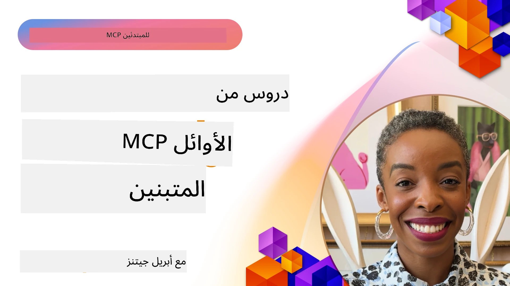

# 🌟 دروس من المتبنين الأوائل

[](https://youtu.be/jds7dSmNptE)

_(انقر على الصورة أعلاه لمشاهدة فيديو هذا الدرس)_

## 🎯 ما يغطيه هذا الوحدة

تستكشف هذه الوحدة كيف تستفيد المؤسسات والمطورون الحقيقيون من بروتوكول سياق النموذج (MCP) لحل التحديات الفعلية ودفع الابتكار. من خلال دراسات حالة مفصلة، ومشاريع عملية، وأمثلة تطبيقية، ستكتشف كيف يمكن لـ MCP تمكين تكامل AI آمن وقابل للتوسع يربط نماذج اللغة، والأدوات، وبيانات المؤسسات.

### 📚 شاهد MCP في العمل

هل تريد رؤية هذه المبادئ مطبقة على أدوات جاهزة للإنتاج؟ ألق نظرة على [**10 خوادم MCP من مايكروسوفت التي تحوّل إنتاجية المطورين**](microsoft-mcp-servers.md)، والتي تعرض خوادم MCP حقيقية من مايكروسوفت يمكنك استخدامها اليوم.

## نظرة عامة

تستكشف هذه الدرس كيف استثمر المتبنون الأوائل بروتوكول سياق النموذج (MCP) لحل التحديات في العالم الواقعي ودفع الابتكار عبر الصناعات. من خلال دراسات حالة مفصلة ومشاريع عملية، سترى كيف يتيح MCP تكامل AI موحد، آمن، وقابل للتوسع — يربط نماذج اللغة الكبيرة، والأدوات، وبيانات المؤسسات في إطار موحد. ستحصل على خبرة عملية في تصميم وبناء حلول قائمة على MCP، وتتعلّم من أنماط تنفيذ مجربة، وتكتشف أفضل الممارسات لنشر MCP في بيئات الإنتاج. كما يبرز الدرس الاتجاهات الناشئة، التوجهات المستقبلية، والموارد مفتوحة المصدر لمساعدتك على البقاء في طليعة تقنية MCP ونظامها البيئي المتطور.

## أهداف التعلم

- تحليل تطبيقات MCP الواقعية عبر صناعات مختلفة
- تصميم وبناء تطبيقات كاملة تعتمد على MCP
- استكشاف الاتجاهات الناشئة والتوجهات المستقبلية في تكنولوجيا MCP
- تطبيق أفضل الممارسات في سيناريوهات تطوير فعلية

## تطبيقات MCP في العالم الواقعي

### دراسة حالة 1: أتمتة دعم العملاء للمؤسسات

نفذت شركة متعددة الجنسيات حلاً قائمًا على MCP لتوحيد التفاعلات الذكية عبر أنظمة دعم العملاء الخاصة بهم. مكنّهم ذلك من:

- إنشاء واجهة موحدة لمزودي نماذج اللغة الكبيرة المتعددة
- الحفاظ على إدارة موحدة للتوجيهات عبر الأقسام
- تنفيذ ضوابط أمنية وامتثال قوية
- التبديل بسهولة بين نماذج الذكاء الاصطناعي المختلفة حسب الاحتياجات المحددة

**التنفيذ التقني:**

```python
# تنفيذ خادم MCP بلغة بايثون لدعم العملاء
import logging
import asyncio
from modelcontextprotocol import create_server, ServerConfig
from modelcontextprotocol.server import MCPServer
from modelcontextprotocol.transports import create_http_transport
from modelcontextprotocol.resources import ResourceDefinition
from modelcontextprotocol.prompts import PromptDefinition
from modelcontextprotocol.tool import ToolDefinition

# تكوين تسجيل الدخول
logging.basicConfig(level=logging.INFO)

async def main():
    # إنشاء تكوين الخادم
    config = ServerConfig(
        name="Enterprise Customer Support Server",
        version="1.0.0",
        description="MCP server for handling customer support inquiries"
    )
    
    # تهيئة خادم MCP
    server = create_server(config)
    
    # تسجيل موارد قاعدة المعرفة
    server.resources.register(
        ResourceDefinition(
            name="customer_kb",
            description="Customer knowledge base documentation"
        ),
        lambda params: get_customer_documentation(params)
    )
    
    # تسجيل قوالب المطالبات
    server.prompts.register(
        PromptDefinition(
            name="support_template",
            description="Templates for customer support responses"
        ),
        lambda params: get_support_templates(params)
    )
    
    # تسجيل أدوات الدعم
    server.tools.register(
        ToolDefinition(
            name="ticketing",
            description="Create and update support tickets"
        ),
        handle_ticketing_operations
    )
    
    # بدء الخادم باستخدام بروتوكول HTTP للنقل
    transport = create_http_transport(port=8080)
    await server.run(transport)

if __name__ == "__main__":
    asyncio.run(main())
```

**النتائج:** انخفاض بنسبة 30% في تكاليف النماذج، وتحسين بنسبة 45% في اتساق الاستجابات، وتعزيز الامتثال عبر العمليات العالمية.

### دراسة حالة 2: مساعد تشخيص في الرعاية الصحية

طوّر مقدم رعاية صحية بنية MCP لدمج نماذج AI طبية متخصصة متعددة مع ضمان حماية بيانات المرضى الحساسة:

- تبديل سلس بين النماذج الطبية العامة والمتخصصة
- ضوابط خصوصية صارمة ومسارات تدقيق
- تكامل مع أنظمة السجلات الصحية الإلكترونية (EHR) القائمة
- هندسة توجيهات متسقة للمصطلحات الطبية

**التنفيذ التقني:**

```csharp
// C# MCP host application implementation in healthcare application
using Microsoft.Extensions.DependencyInjection;
using ModelContextProtocol.SDK.Client;
using ModelContextProtocol.SDK.Security;
using ModelContextProtocol.SDK.Resources;

public class DiagnosticAssistant
{
    private readonly MCPHostClient _mcpClient;
    private readonly PatientContext _patientContext;
    
    public DiagnosticAssistant(PatientContext patientContext)
    {
        _patientContext = patientContext;
        
        // Configure MCP client with healthcare-specific settings
        var clientOptions = new ClientOptions
        {
            Name = "Healthcare Diagnostic Assistant",
            Version = "1.0.0",
            Security = new SecurityOptions
            {
                Encryption = EncryptionLevel.Medical,
                AuditEnabled = true
            }
        };
        
        _mcpClient = new MCPHostClientBuilder()
            .WithOptions(clientOptions)
            .WithTransport(new HttpTransport("https://healthcare-mcp.example.org"))
            .WithAuthentication(new HIPAACompliantAuthProvider())
            .Build();
    }
    
    public async Task<DiagnosticSuggestion> GetDiagnosticAssistance(
        string symptoms, string patientHistory)
    {
        // Create request with appropriate resources and tool access
        var resourceRequest = new ResourceRequest
        {
            Name = "patient_records",
            Parameters = new Dictionary<string, object>
            {
                ["patientId"] = _patientContext.PatientId,
                ["requestingProvider"] = _patientContext.ProviderId
            }
        };
        
        // Request diagnostic assistance using appropriate prompt
        var response = await _mcpClient.SendPromptRequestAsync(
            promptName: "diagnostic_assistance",
            parameters: new Dictionary<string, object>
            {
                ["symptoms"] = symptoms,
                patientHistory = patientHistory,
                relevantGuidelines = _patientContext.GetRelevantGuidelines()
            });
            
        return DiagnosticSuggestion.FromMCPResponse(response);
    }
}
```

**النتائج:** تحسين اقتراحات التشخيص للأطباء مع الالتزام الكامل بـ HIPAA وتقليل كبير في تبديل السياق بين الأنظمة.

### دراسة حالة 3: تحليل المخاطر في الخدمات المالية

نفذت مؤسسة مالية MCP لتوحيد عمليات تحليل المخاطر عبر الأقسام المختلفة:

- إنشاء واجهة موحدة لنماذج مخاطر الائتمان، وكشف الاحتيال، ومخاطر الاستثمار
- تنفيذ ضوابط وصول صارمة وإدارة نسخ للنماذج
- ضمان إمكانية تدقيق جميع توصيات الذكاء الاصطناعي
- الحفاظ على تنسيق بيانات متسق عبر أنظمة متنوعة

**التنفيذ التقني:**

```java
// خادم MCP بلغة جافا لتقييم المخاطر المالية
import org.mcp.server.*;
import org.mcp.security.*;

public class FinancialRiskMCPServer {
    public static void main(String[] args) {
        // إنشاء خادم MCP بميزات الامتثال المالي
        MCPServer server = new MCPServerBuilder()
            .withModelProviders(
                new ModelProvider("risk-assessment-primary", new AzureOpenAIProvider()),
                new ModelProvider("risk-assessment-audit", new LocalLlamaProvider())
            )
            .withPromptTemplateDirectory("./compliance/templates")
            .withAccessControls(new SOCCompliantAccessControl())
            .withDataEncryption(EncryptionStandard.FINANCIAL_GRADE)
            .withVersionControl(true)
            .withAuditLogging(new DatabaseAuditLogger())
            .build();
            
        server.addRequestValidator(new FinancialDataValidator());
        server.addResponseFilter(new PII_RedactionFilter());
        
        server.start(9000);
        
        System.out.println("Financial Risk MCP Server running on port 9000");
    }
}
```

**النتائج:** تعزيز الامتثال التنظيمي، تسريع دورات نشر النماذج بنسبة 40%، وتحسين اتساق تقييم المخاطر عبر الأقسام.

### دراسة حالة 4: خادم Playwright MCP من مايكروسوفت لأتمتة المتصفح

طورت مايكروسوفت [خادم Playwright MCP](https://github.com/microsoft/playwright-mcp) لتمكين أتمتة المتصفح الآمنة والموحدة عبر بروتوكول سياق النموذج. يتيح هذا الخادم الجاهز للإنتاج لوكلاء الذكاء الاصطناعي ونماذج اللغة الكبيرة التفاعل مع متصفحات الويب بطريقة خاضعة للرقابة، وقابلة للتدقيق، وقابلة للتمديد — مما يمكن استخدامات مثل اختبار الويب الآلي، استخراج البيانات، وسير العمل من البداية للنهاية.

> **🎯 أداة جاهزة للإنتاج**
> 
> تعرض هذه الدراسة حالة خادم MCP حقيقي يمكنك استخدامه اليوم! تعرف أكثر على خادم Playwright MCP و9 خوادم MCP أخرى جاهزة للإنتاج من مايكروسوفت في دليلنا [**Microsoft MCP Servers Guide**](microsoft-mcp-servers.md#8--playwright-mcp-server).

**الميزات الرئيسية:**
- يعرض قدرات أتمتة المتصفح (التنقل، ملء النموذج، التقاط الصور، إلخ) كأدوات MCP
- ينفذ ضوابط وصول صارمة وعزل بيئة لمنع الأفعال غير المصرح بها
- يوفر سجلات تدقيق مفصلة لجميع تفاعلات المتصفح
- يدعم التكامل مع Azure OpenAI وغيرها من مقدمي نماذج LLM لأتمتة مدفوعة بالوكيل
- يدعم وكيل ترميز GitHub Copilot بقدرات تصفح الويب

**التنفيذ التقني:**

```typescript
// TypeScript: تسجيل أدوات تشغيل متصفح Playwright في خادم MCP
import { createServer, ToolDefinition } from 'modelcontextprotocol';
import { launch } from 'playwright';

const server = createServer({
  name: 'Playwright MCP Server',
  version: '1.0.0',
  description: 'MCP server for browser automation using Playwright'
});

// تسجيل أداة للتنقل إلى عنوان URL والتقاط لقطة شاشة
server.tools.register(
  new ToolDefinition({
    name: 'navigate_and_screenshot',
    description: 'Navigate to a URL and capture a screenshot',
    parameters: {
      url: { type: 'string', description: 'The URL to visit' }
    }
  }),
  async ({ url }) => {
    const browser = await launch();
    const page = await browser.newPage();
    await page.goto(url);
    const screenshot = await page.screenshot();
    await browser.close();
    return { screenshot };
  }
);

// بدء خادم MCP
server.listen(8080);
```

**النتائج:**

- تمكين أتمتة المتصفح المبرمجة الآمنة لوكلاء الذكاء الاصطناعي ونماذج اللغة الكبيرة
- تقليل الجهد اليدوي في الاختبار وتحسين تغطية اختبار تطبيقات الويب
- توفير إطار قابل لإعادة الاستخدام وقابل للتمديد لتكامل أدوات المتصفح في بيئات المؤسسات
- يدعم قدرات تصفح الويب لوكيل GitHub Copilot

**المراجع:**

- [مستودع GitHub خادم Playwright MCP](https://github.com/microsoft/playwright-mcp)
- [حلول مايكروسوفت للذكاء الاصطناعي والأتمتة](https://azure.microsoft.com/en-us/products/ai-services/)

### دراسة حالة 5: Azure MCP – بروتوكول سياق النموذج بدرجة مؤسسية كخدمة

خادم Azure MCP ([https://aka.ms/azmcp](https://aka.ms/azmcp)) هو تطبيق مايكروسوفت المدار وبدرجة مؤسسية لبروتوكول سياق النموذج، صمم لتوفير قدرات خادم MCP آمنة، قابلة للتوسع ومتوافقة كخدمة سحابية. يتيح Azure MCP للمؤسسات النشر السريع، الإدارة، وتكامل خوادم MCP مع خدمات AI، البيانات، والأمان في Azure، مما يقلل العناء التشغيلي ويُسرّع تبني تقنيات AI.

> **🎯 أداة جاهزة للإنتاج**
> 
> هذا خادم MCP حقيقي يمكنك استخدامه اليوم! تعرف أكثر على خادم Microsoft Foundry MCP في دليلنا [**Microsoft MCP Servers Guide**](microsoft-mcp-servers.md).


- استضافة خادم MCP مدارة بالكامل مع توسيع، مراقبة، وأمان مدمجة
- تكامل أصلي مع Azure OpenAI، Azure AI Search، وخدمات Azure الأخرى
- مصادقة وتفويض مؤسسي عبر Microsoft Entra ID
- دعم الأدوات المخصصة، قوالب التوجيه، وموصلات الموارد
- الامتثال لمتطلبات أمان وتنظيم المؤسسات

**التنفيذ التقني:**

```yaml
# Example: Azure MCP server deployment configuration (YAML)
apiVersion: mcp.microsoft.com/v1
kind: McpServer
metadata:
  name: enterprise-mcp-server
spec:
  modelProviders:
    - name: azure-openai
      type: AzureOpenAI
      endpoint: https://<your-openai-resource>.openai.azure.com/
      apiKeySecret: <your-azure-keyvault-secret>
  tools:
    - name: document_search
      type: AzureAISearch
      endpoint: https://<your-search-resource>.search.windows.net/
      apiKeySecret: <your-azure-keyvault-secret>
  authentication:
    type: EntraID
    tenantId: <your-tenant-id>
  monitoring:
    enabled: true
    logAnalyticsWorkspace: <your-log-analytics-id>
```

**النتائج:**  
- تقليل زمن الوصول للقيمة لمشاريع AI المؤسسية من خلال توفير منصة خادم MCP جاهزة للاستخدام ومتوافقة
- تبسيط تكامل نماذج اللغة الكبيرة، الأدوات، ومصادر بيانات المؤسسات
- تعزيز الأمان، الرصد، والكفاءة التشغيلية لأعباء MCP
- تحسين جودة الكود مع أفضل ممارسات Azure SDK وأنماط المصادقة الحديثة

**المراجع:**  
- [توثيق Azure MCP](https://aka.ms/azmcp)
- [مستودع GitHub خادم Azure MCP](https://github.com/Azure/azure-mcp)
- [خدمات Azure AI](https://azure.microsoft.com/en-us/products/ai-services/)
- [مركز Microsoft MCP](https://mcp.azure.com)

## دراسة حالة 6: NLWeb 
MCP (بروتوكول سياق النموذج) هو بروتوكول ناشئ للدردشة والأشخاص المساعدين الذكاء الاصطناعي للتفاعل مع الأدوات. كل نسخة من NLWeb هي أيضًا خادم MCP، يدعم طريقة أساسية واحدة، ask، تستخدم لطرح سؤال لموقع ويب بلغة طبيعية. يستفيد الرد المُعاد من schema.org، وهي مفردات مستخدمة على نطاق واسع لوصف بيانات الويب. بشكل مبسط، MCP هو NLWeb بالنسبة إلى Http كما HTML. يجمع NLWeb بين البروتوكولات، صيغ Schema.org، وكود العينة لمساعدة المواقع على إنشاء هذه النقاط النهائية بسرعة، مما يفيد البشر من خلال واجهات المحادثة والآلات من خلال التفاعل الطبيعي بين الوكلاء.

هناك مكونان متميزان لـ NLWeb.
- بروتوكول بسيط للغاية للبدء به، للتواصل مع الموقع بلغة طبيعية وصيغة تعتمد على json و schema.org للإجابة المُعادة. راجع التوثيق عن REST API لمزيد من التفاصيل.
- تنفيذ مباشر لـ (1) يستفيد من العلامات الحالية، للمواقع التي يمكن تجريدها على أنها قوائم من العناصر (منتجات، وصفات، معالم، مراجعات، إلخ). مع مجموعة من أدوات واجهة المستخدم، يمكن للمواقع توفير واجهات محادثة لمحتواها بسهولة. راجع التوثيق عن Life of a chat query لمزيد من التفاصيل حول كيفية عمل هذا.
 
**المراجع:**  
- [توثيق Azure MCP](https://aka.ms/azmcp)
- [NLWeb](https://github.com/microsoft/NlWeb)

### دراسة حالة 7: خادم Microsoft Foundry MCP – دمج وكلاء AI المؤسسيين

توضح خوادم Microsoft Foundry MCP كيف يمكن استخدام MCP لتنظيم وإدارة وكلاء AI وسير العمل في بيئات المؤسسات. من خلال دمج MCP مع Microsoft Foundry، يمكن للمؤسسات توحيد تفاعلات الوكلاء، الاستفادة من إدارة سير العمل في Foundry، وضمان نشرات آمنة وقابلة للتوسع.

> **🎯 أداة جاهزة للإنتاج**
> 
> هذا خادم MCP حقيقي يمكنك استخدامه اليوم! تعرف أكثر على خادم Microsoft Foundry MCP في دليلنا [**Microsoft MCP Servers Guide**](microsoft-mcp-servers.md#9--microsoft-foundry-mcp-server).

**الميزات الرئيسية:**
- وصول شامل إلى نظام AI في Azure، بما في ذلك كتالوج النماذج وإدارة النشر
- فهرسة المعرفة مع Azure AI Search لتطبيقات RAG
- أدوات تقييم أداء نموذج AI وضمان الجودة
- تكامل مع Microsoft Foundry Catalog و Labs للنماذج البحثية المتطورة
- قدرات إدارة وتقييم الوكلاء للسيناريوهات الإنتاجية

**النتائج:**
- تصميم سريع ونمذجة مراقبة قوية لسير عمل وكلاء AI
- تكامل سلس مع خدمات Azure AI للسيناريوهات المتقدمة
- واجهة موحدة لبناء، نشر، ومراقبة خطوط سير الوكلاء
- تحسين الأمان، الامتثال، والكفاءة التشغيلية للمؤسسات
- تسريع تبني AI مع الحفاظ على التحكم في العمليات المعقدة المدفوعة بالوكلاء

**المراجع:**
- [مستودع GitHub خادم Microsoft Foundry MCP](https://github.com/azure-ai-foundry/mcp-foundry)
- [دمج وكلاء Azure AI مع MCP (مدونة Microsoft Foundry)](https://devblogs.microsoft.com/foundry/integrating-azure-ai-agents-mcp/)

### دراسة حالة 8: ملعب Foundry MCP – التجارب والنمذجة

يقدم ملعب Foundry MCP بيئة جاهزة للاستخدام للتجريب مع خوادم MCP وتكاملات Microsoft Foundry. يمكن للمطورين بسرعة تصميم نماذج أولية، اختبار، وتقييم نماذج AI وسير عمل الوكلاء باستخدام موارد من Microsoft Foundry Catalog وLabs. يسهل الملعب الإعداد، يوفر مشاريع نموذجية، ويدعم التطوير التعاوني، مما يجعل من السهل استكشاف أفضل الممارسات والسيناريوهات الجديدة بأقل عبء. هو مفيد بشكل خاص للفرق التي ترغب في التحقق من الأفكار، مشاركة التجارب، وتسريع التعلم دون الحاجة إلى بنية تحتية معقدة. من خلال تخفيض عتبة الدخول، يساعد الملعب على تعزيز الابتكار والمساهمات المجتمعية في نظام MCP و Microsoft Foundry البيئي.

**المراجع:**

- [مستودع GitHub ملعب Foundry MCP](https://github.com/azure-ai-foundry/foundry-mcp-playground)

### دراسة حالة 9: خادم Microsoft Learn Docs MCP – الوصول إلى التوثيق بدعم ذكاء اصطناعي

خادم Microsoft Learn Docs MCP هو خدمة مستضافة على السحابة توفر مساعدين ذكاء اصطناعي إمكانية الوصول في الوقت الحقيقي إلى توثيق مايكروسوفت الرسمي عبر بروتوكول سياق النموذج. يربط هذا الخادم الجاهز للإنتاج بمنظومة Microsoft Learn الشاملة ويمكّن البحث الدلالي عبر جميع المصادر الرسمية لمايكروسوفت.

> **🎯 أداة جاهزة للإنتاج**
> 
> هذا خادم MCP حقيقي يمكنك استخدامه اليوم! تعرف أكثر على خادم Microsoft Learn Docs MCP في دليلنا [**Microsoft MCP Servers Guide**](microsoft-mcp-servers.md#1--microsoft-learn-docs-mcp-server).

**الميزات الرئيسية:**
- وصول في الوقت الحقيقي إلى التوثيق الرسمي لمايكروسوفت، توثيق Azure، وتوثيق Microsoft 365
- قدرات بحث دلالي متقدمة تفهم السياق والنوايا
- معلومات محدثة دائمًا مع نشر محتوى Microsoft Learn
- تغطية شاملة عبر Microsoft Learn، توثيق Azure، ومصادر Microsoft 365
- يعيد ما يصل إلى 10 أجزاء محتوى عالية الجودة مع عناوين المقالات وروابط URL

**لماذا هو مهم:**
- يحل مشكلة "المعرفة القديمة للذكاء الاصطناعي" لتقنيات مايكروسوفت
- يضمن وصول مساعدين الذكاء الاصطناعي لأحدث ميزات .NET، C#، Azure، وMicrosoft 365
- يوفر معلومات رسمية وموثوقة لتوليد رمز دقيق
- ضروري للمطورين العاملين مع تقنيات مايكروسوفت سريعة التطور

**النتائج:**
- تحسن كبير في دقة الكود المولد بواسطة AI لتقنيات مايكروسوفت
- تقليل الوقت المستغرق في البحث عن التوثيق الحالي وأفضل الممارسات
- زيادة إنتاجية المطورين مع استرجاع التوثيق بمعرفة السياق
- تكامل سلس مع سير عمل التطوير دون مغادرة بيئة التطوير المتكاملة (IDE)

**المراجع:**
- [مستودع GitHub خادم Microsoft Learn Docs MCP](https://github.com/MicrosoftDocs/mcp)
- [توثيق Microsoft Learn](https://learn.microsoft.com/)

## مشاريع عملية

### المشروع 1: بناء خادم MCP متعدد المزودين

**الهدف:** إنشاء خادم MCP يمكنه توجيه الطلبات إلى عدة مزودي نماذج AI بناءً على معايير محددة.

**المتطلبات:**

- دعم ما لا يقل عن ثلاثة مزودين مختلفين للنماذج (مثل OpenAI، Anthropic، النماذج المحلية)
- تنفيذ آلية توجيه بناءً على بيانات ميتا الطلب
- إنشاء نظام تكوين لإدارة أوراق اعتماد المزودين
- إضافة تخزين مؤقت لتحسين الأداء وتقليل التكاليف
- بناء لوحة تحكم بسيطة لمراقبة الاستخدام

**خطوات التنفيذ:**

1. إعداد بنية تحتية أساسية لخادم MCP
2. تنفيذ موصلين للمزودين لكل خدمة نموذج AI
3. إنشاء منطق التوجيه بناءً على سمات الطلب
4. إضافة آليات التخزين المؤقت للطلبات المتكررة
5. تطوير لوحة المراقبة
6. اختبار مع أنماط طلب مختلفة

**التقنيات:** اختر من Python (.NET/Java/Python حسب تفضيلك)، Redis للتخزين المؤقت، وإطار ويب بسيط للوحة التحكم.

### المشروع 2: نظام إدارة التوجيهات المؤسسية

**الهدف:** تطوير نظام قائم على MCP لإدارة، إصدار، ونشر قوالب التوجيه عبر منظمة.

**المتطلبات:**


- إنشاء مستودع مركزي لنماذج المطالبات
- تنفيذ نظام إدارة الإصدارات وسير العمل للموافقات
- بناء قدرات اختبار النماذج باستخدام مدخلات عينة
- تطوير ضوابط وصول قائمة على الأدوار
- إنشاء واجهة برمجة تطبيقات لاسترجاع النماذج ونشرها

**خطوات التنفيذ:**

1. تصميم مخطط قاعدة البيانات لتخزين النماذج
2. إنشاء واجهة برمجة التطبيقات الأساسية لعمليات CRUD على النماذج
3. تنفيذ نظام إدارة الإصدارات
4. بناء سير عمل الموافقات
5. تطوير إطار الاختبار
6. إنشاء واجهة ويب بسيطة للإدارة
7. التكامل مع خادم MCP

**التقنيات:** اختياركم لإطار العمل الخلفي، قاعدة بيانات SQL أو NoSQL، وإطار عمل الواجهة الأمامية لواجهة الإدارة.

### المشروع 3: منصة إنشاء محتوى قائمة على MCP

**الهدف:** بناء منصة لإنشاء المحتوى تستفيد من MCP لتوفير نتائج متسقة عبر أنواع محتوى مختلفة.

**المتطلبات:**

- دعم تنسيقات محتوى متعددة (مقالات المدونة، وسائل التواصل الاجتماعي، نصوص تسويقية)
- تنفيذ التوليد القائم على النماذج مع خيارات التخصيص
- إنشاء نظام مراجعة المحتوى وتغذية راجعة
- تتبع مؤشرات أداء المحتوى
- دعم إدارة إصدارات المحتوى وتكراره

**خطوات التنفيذ:**

1. إعداد بنية عميل MCP
2. إنشاء نماذج لأنواع المحتوى المختلفة
3. بناء خط إنتاج إنشاء المحتوى
4. تنفيذ نظام المراجعة
5. تطوير نظام تتبع المؤشرات
6. إنشاء واجهة مستخدم لإدارة النماذج وإنشاء المحتوى

**التقنيات:** لغة البرمجة المفضلة، إطار العمل للويب، ونظام قاعدة البيانات.

## الاتجاهات المستقبلية لتقنية MCP

### الاتجاهات الناشئة

1. **MCP متعدد الوسائط**
   - توسيع MCP لتوحيد التفاعل مع نماذج الصور، الصوت، والفيديو
   - تطوير قدرات التفكير العابر للوسائط
   - تنسيقات مطلوبة موحدة للوضعيات المختلفة

2. **بنية تحتية MCP موزعة**
   - شبكات MCP موزعة يمكنها مشاركة الموارد عبر المؤسسات
   - بروتوكولات موحدة لمشاركة النماذج بشكل آمن
   - تقنيات الحوسبة التي تحافظ على خصوصية البيانات

3. **أسواق MCP**
   - أنظمة بيئية لمشاركة و تحقيق الربح من قوالب ومكونات MCP
   - عمليات ضمان الجودة وشهادات الاعتماد
   - تكامل مع أسواق النماذج

4. **MCP للحوسبة الحافة**
   - تكييف معايير MCP لأجهزة الحافة ذات الموارد المحدودة
   - بروتوكولات محسنة للبيئات منخفضة عرض النطاق الترددي
   - تنفيذات MCP متخصصة لأنظمة إنترنت الأشياء

5. **الأطر التنظيمية**
   - تطوير امتدادات MCP للامتثال التنظيمي
   - مسارات تدقيق موحدة وواجهات للشرح
   - التكامل مع أطر الحوكمة الناشئة للذكاء الاصطناعي

### حلول MCP من مايكروسوفت

طورت مايكروسوفت وأزور عدداً من مستودعات المصدر المفتوح لمساعدة المطورين على تنفيذ MCP في سيناريوهات مختلفة:

#### منظمة Microsoft

1. [playwright-mcp](https://github.com/microsoft/playwright-mcp) - خادم MCP باستخدام Playwright لأتمتة المتصفح والاختبار
2. [files-mcp-server](https://github.com/microsoft/files-mcp-server) - تنفيذ خادم MCP لـ OneDrive للاختبار المحلي والمساهمة المجتمعية
3. [NLWeb](https://github.com/microsoft/NlWeb) - مجموعة من البروتوكولات المفتوحة والأدوات المفتوحة المصدر المرتبطة بها تركز على إنشاء طبقة أساسية للويب الذكي

#### منظمة Azure-Samples

1. [mcp](https://github.com/Azure-Samples/mcp) - روابط إلى عينات وأدوات وموارد لبناء ودمج خوادم MCP على Azure باستخدام لغات متعددة
2. [mcp-auth-servers](https://github.com/Azure-Samples/mcp-auth-servers) - خوادم MCP مرجعية توضح المصادقة باستخدام مواصفة Model Context Protocol الحالية
3. [remote-mcp-functions](https://github.com/Azure-Samples/remote-mcp-functions) - صفحة دخول لتنفيذات خوادم MCP البعيدة في Azure Functions مع روابط إلى مستودعات خاصة بكل لغة
4. [remote-mcp-functions-python](https://github.com/Azure-Samples/remote-mcp-functions-python) - قالب بدء سريع لبناء ونشر خوادم MCP البعيدة المخصصة باستخدام Azure Functions وPython
5. [remote-mcp-functions-dotnet](https://github.com/Azure-Samples/remote-mcp-functions-dotnet) - قالب بدء سريع لبناء ونشر خوادم MCP البعيدة المخصصة باستخدام Azure Functions و.NET/C#
6. [remote-mcp-functions-typescript](https://github.com/Azure-Samples/remote-mcp-functions-typescript) - قالب بدء سريع لبناء ونشر خوادم MCP البعيدة المخصصة باستخدام Azure Functions وTypeScript
7. [remote-mcp-apim-functions-python](https://github.com/Azure-Samples/remote-mcp-apim-functions-python) - إدارة API في Azure كبوابة ذكاء اصطناعي لخوادم MCP البعيدة باستخدام Python
8. [AI-Gateway](https://github.com/Azure-Samples/AI-Gateway) - تجارب APIM وذكاء اصطناعي تشمل قدرات MCP، متكاملة مع Azure OpenAI وAI Foundry

توفر هذه المستودعات تطبيقات متنوعة، وقوالب، وموارد للعمل مع بروتوكول سياق النموذج عبر لغات برمجة مختلفة وخدمات Azure. تغطي مجموعة من حالات الاستخدام من تنفيذات خوادم بسيطة إلى المصادقة، النشر السحابي، وسيناريوهات التكامل المؤسسي.

#### دليل موارد MCP

يوفر [دليل موارد MCP](https://github.com/microsoft/mcp/tree/main/Resources) في المستودع الرسمي لشركة مايكروسوفت مجموعة من الموارد النموذجية، قوالب المطالبات، وتعريفات الأدوات للاستخدام مع خوادم بروتوكول سياق النموذج. يهدف هذا الدليل لمساعدة المطورين على البدء سريعًا مع MCP من خلال توفير لبنات بناء قابلة لإعادة الاستخدام وأمثلة على أفضل الممارسات لـ:

- **نماذج المطالبات:** نماذج جاهزة للاستخدام لمهام وسيناريوهات الذكاء الاصطناعي الشائعة، يمكن تخصيصها لتنفيذات خادم MCP الخاصة بك.
- **تعريفات الأدوات:** مخططات وأمثلة بيانات وصفية للأدوات لتوحيد دمج الأدوات واستدعائها عبر خوادم MCP المختلفة.
- **عينات الموارد:** تعريفات موارد نموذجية للاتصال بمصادر بيانات، APIs، وخدمات خارجية ضمن إطار MCP.
- **تنفيذات مرجعية:** عينات عملية تظهر كيفية تنظيم وبنية الموارد، المطالبات، والأدوات في مشاريع MCP الواقعية.

تسرع هذه الموارد التطوير، وتعزز التوحيد القياسي، وتساعد على ضمان أفضل الممارسات عند بناء ونشر حلول قائمة على MCP.

#### دليل موارد MCP

- [موارد MCP (نماذج مطالبات، أدوات، وتعريفات موارد)](https://github.com/microsoft/mcp/tree/main/Resources)

### فرص البحث

- تقنيات تحسين المطالبات بكفاءة ضمن أُطر MCP
- نماذج أمان لنشر MCP متعدد المستأجرين
- تقييم الأداء عبر تنفيذات MCP المختلفة
- طرق التحقق الرسمية لخوادم MCP

## الخلاصة

يعد بروتوكول سياق النموذج (MCP) قوة محركة نحو مستقبل التكامل الموحد، الآمن، والقابل للتشغيل البيني للذكاء الاصطناعي عبر الصناعات. من خلال دراسات الحالة والمشاريع العملية في هذا الدرس، رأيتم كيف يستفيد المبكرون - من ضمنهم مايكروسوفت وأزور - من MCP لحل تحديات العالم الحقيقي، وتسريع تبني الذكاء الاصطناعي، وضمان الامتثال، الأمان، وقابلية التوسع. يتيح النهج المعياري لـ MCP للمؤسسات ربط النماذج اللغوية الكبيرة، الأدوات، وبيانات المؤسسة في إطار موحد وقابل للتدقيق. مع استمرار تطور MCP، فإن المشاركة المجتمعية، استكشاف الموارد مفتوحة المصدر، وتطبيق أفضل الممارسات ستكون مفتاح بناء حلول ذكاء اصطناعي متينة وجاهزة للمستقبل.

## موارد إضافية

- [مستودع MCP Foundry على GitHub](https://github.com/azure-ai-foundry/mcp-foundry)
- [ميدان MCP الخاص بـ Foundry](https://github.com/azure-ai-foundry/foundry-mcp-playground)
- [دمج وكلاء Azure AI مع MCP (مدونة Microsoft Foundry)](https://devblogs.microsoft.com/foundry/integrating-azure-ai-agents-mcp/)
- [مستودع MCP على GitHub (Microsoft)](https://github.com/microsoft/mcp)
- [دليل موارد MCP (نماذج مطالبات، أدوات، وتعريفات موارد)](https://github.com/microsoft/mcp/tree/main/Resources)
- [مجتمع MCP والوثائق](https://modelcontextprotocol.io/introduction)
- [مواصفة MCP (2026-07-28)](https://modelcontextprotocol.io/specification/2026-07-28/)
- [وثائق Azure MCP](https://aka.ms/azmcp)
- [أفضل 10 ممارسات أمان MCP حسب OWASP](https://microsoft.github.io/mcp-azure-security-guide/mcp/) - أفضل ممارسات الأمان
- [مستودع خادم Playwright MCP على GitHub](https://github.com/microsoft/playwright-mcp)
- [خادم الملفات MCP (OneDrive)](https://github.com/microsoft/files-mcp-server)
- [Azure-Samples MCP](https://github.com/Azure-Samples/mcp)
- [خوادم مصادقة MCP (Azure-Samples)](https://github.com/Azure-Samples/mcp-auth-servers)
- [وظائف MCP البعيدة (Azure-Samples)](https://github.com/Azure-Samples/remote-mcp-functions)
- [وظائف MCP البعيدة Python (Azure-Samples)](https://github.com/Azure-Samples/remote-mcp-functions-python)
- [وظائف MCP البعيدة.NET (Azure-Samples)](https://github.com/Azure-Samples/remote-mcp-functions-dotnet)
- [وظائف MCP البعيدة TypeScript (Azure-Samples)](https://github.com/Azure-Samples/remote-mcp-functions-typescript)
- [وظائف MCP APIM البعيدة Python (Azure-Samples)](https://github.com/Azure-Samples/remote-mcp-apim-functions-python)
- [بوابة الذكاء الاصطناعي (Azure-Samples)](https://github.com/Azure-Samples/AI-Gateway)
- [حلول الذكاء الاصطناعي والأتمتة من Microsoft](https://azure.microsoft.com/en-us/products/ai-services/)

## تمارين

1. تحليل إحدى دراسات الحالة واقتراح طريقة تنفيذ بديلة.
2. اختيار أحد أفكار المشاريع وإنشاء مواصفات فنية مفصلة له.
3. البحث في صناعة غير مغطاة في دراسات الحالة ورسم كيف يمكن لـ MCP معالجة تحدياتها الخاصة.
4. استكشاف أحد الاتجاهات المستقبلية وابتكار مفهوم لامتداد MCP جديد لدعمه.

## ماذا بعد

استكشف المزيد: [خوادم Microsoft MCP](./microsoft-mcp-servers.md)

تابع إلى: [الوحدة 8: أفضل الممارسات](../08-BestPractices/README.md)

---

<!-- CO-OP TRANSLATOR DISCLAIMER START -->
**تنويه**:
تمت ترجمة هذا المستند باستخدام خدمة الترجمة بالذكاء الاصطناعي [Co-op Translator](https://github.com/Azure/co-op-translator). بينما نسعى للدقة، يرجى العلم أن الترجمات الآلية قد تحتوي على أخطاء أو عدم دقة. يجب اعتبار المستند الأصلي بلغته الأصلية المصدر الرسمي والمعتمد. للمعلومات الهامة، يُنصح بالاستعانة بترجمة بشرية محترفة. نحن غير مسؤولين عن أي سوء فهم أو تفسير ناتج عن استخدام هذه الترجمة.
<!-- CO-OP TRANSLATOR DISCLAIMER END -->