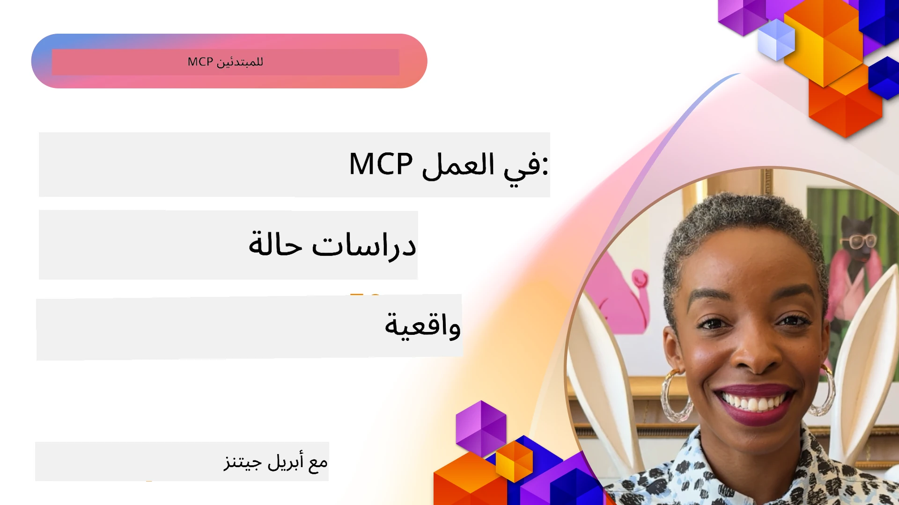

# MCP في العمل: دراسات حالة من العالم الحقيقي

_(انقر على الصورة أعلاه لمشاهدة فيديو هذا الدرس)_

يقوم بروتوكول سياق النموذج (MCP) بتحويل طريقة تفاعل تطبيقات الذكاء الاصطناعي مع البيانات والأدوات والخدمات. يقدم هذا القسم دراسات حالة من العالم الحقيقي توضح التطبيقات العملية لـ MCP في سيناريوهات مؤسساتية متنوعة.

## نظرة عامة

يعرض هذا القسم أمثلة ملموسة لتطبيقات MCP، مع إبراز كيف تستفيد المؤسسات من هذا البروتوكول لحل تحديات الأعمال المعقدة. من خلال دراسة هذه الحالات، ستكتسب رؤى حول المرونة وقابلية التوسع والفوائد العملية لـ MCP في سيناريوهات العالم الحقيقي.

## الأهداف التعليمية الرئيسية

من خلال استكشاف هذه الدراسات، ستتمكن من:

- فهم كيفية تطبيق MCP لحل مشكلات أعمال محددة
- التعرف على أنماط التكامل المختلفة والأساليب المعمارية
- التعرف على أفضل الممارسات لتطبيق MCP في بيئات المؤسسات
- اكتساب رؤى حول التحديات والحلول التي واجهت في تطبيقات العالم الحقيقي
- تحديد الفرص لتطبيق أنماط مماثلة في مشاريعك الخاصة

## دراسات الحالة المميزة

### 1. [وكلاء السفر بالذكاء الاصطناعي في Azure – تطبيق مرجعي](./travelagentsample.md)

تفحص دراسة الحالة هذه الحل المرجعي الشامل لشركة مايكروسوفت الذي يوضح كيفية بناء تطبيق تخطيط سفر متعدد الوكلاء مدعوم بالذكاء الاصطناعي باستخدام MCP وAzure OpenAI وAzure AI Search. يعرض المشروع:

- تنسيق الوكلاء المتعددين من خلال MCP
- تكامل بيانات المؤسسات باستخدام Azure AI Search
- بنية مؤمنة وقابلة للتوسع باستخدام خدمات Azure
- أدوات قابلة للتوسعة مع مكونات MCP قابلة لإعادة الاستخدام
- تجربة مستخدم محادثية مدعومة بـ Azure OpenAI

توفر تفاصيل البنية والتنفيذ رؤى قيمة لبناء أنظمة معقدة متعدد الوكلاء باستخدام MCP كطبقة تنسيق.

### 2. [تحديث عناصر Azure DevOps من بيانات YouTube](./UpdateADOItemsFromYT.md)

توضح دراسة الحالة هذه تطبيقًا عمليًا لـ MCP لأتمتة عمليات سير العمل. توضح كيف يمكن استخدام أدوات MCP لـ:

- استخراج البيانات من منصات الإنترنت (YouTube)
- تحديث عناصر العمل في أنظمة Azure DevOps
- إنشاء تدفقات عمل أتمتة قابلة للتكرار
- دمج البيانات عبر أنظمة متفرقة

يوضح هذا المثال كيف يمكن لتطبيقات MCP البسيطة نسبيًا تحقيق كفاءة كبيرة من خلال أتمتة المهام الروتينية وتحسين تناسق البيانات عبر الأنظمة.

### 3. [استرجاع التوثيق في الوقت الحقيقي باستخدام MCP](./docs-mcp/README.md)

ترشدك دراسة الحالة هذه خلال ربط عميل وحدة تحكم Python بخادم بروتوكول سياق النموذج (MCP) لاسترجاع وتسجيل توثيق مايكروسوفت السياقي والآني. ستتعلم كيفية:

- الاتصال بخادم MCP باستخدام عميل Python وSDK الرسمي لـ MCP
- استخدام عملاء HTTP تدفقية لاسترجاع بيانات فعال وآني
- استدعاء أدوات التوثيق على الخادم وتسجيل الردود مباشرة على وحدة التحكم
- دمج توثيق مايكروسوفت المحدث في سير عملك دون مغادرة الطرفية

يتضمن الفصل مهمة تطبيقية ونموذجًا بسيطًا للشفرة وروابط لموارد إضافية للتعلم العميق. راجع الشرح الكامل والشفرة المرتبطة لفهم كيف يمكن لـ MCP تحويل الوصول إلى التوثيق وإنتاجية المطور في بيئات الطرفية.

### 4. [تطبيق ويب مولد خطة دراسية تفاعلية باستخدام MCP](./docs-mcp/README.md)

توضح دراسة الحالة هذه كيفية بناء تطبيق ويب تفاعلي باستخدام Chainlit وبروتوكول سياق النموذج (MCP) لتوليد خطط دراسية مخصصة لأي موضوع. يمكن للمستخدمين تحديد موضوع (مثل "شهادة AI-900") ومدة الدراسة (مثلاً 8 أسابيع)، وسيقدم التطبيق تصنيفًا أسبوعيًا للمحتوى الموصى به. يتيح Chainlit واجهة دردشة محادثية، مما يجعل التجربة جذابة ومتفاعلة.

- تطبيق ويب محادثي يعمل بواسطة Chainlit
- مطالبات مستندة إلى المستخدم للموضوع والمدة
- توصيات محتوى أسبوعية باستخدام MCP
- ردود آنيّة ومتكيّفة في واجهة الدردشة

يوضح المشروع كيف يمكن دمج الذكاء الاصطناعي المحادثي وMCP لإنشاء أدوات تعليمية ديناميكية مستندة إلى المستخدم في بيئة ويب حديثة.

### 5. [توثيق داخل المحرر مع خادم MCP في VS Code](./docs-mcp/README.md)

توضح دراسة الحالة هذه كيفية جلب توثيقات Microsoft Learn مباشرة إلى بيئة VS Code الخاصة بك باستخدام خادم MCP—لا حاجة لتبديل علامات التبويب في المتصفح! سترى كيف:

- تبحث وتقرأ التوثيقات فورًا داخل VS Code باستخدام لوحة MCP أو لوحة الأوامر
- تشير إلى التوثيقات وتدرج الروابط مباشرة في ملفات README أو ملفات المقررات الدراسية Markdown
- تستخدم GitHub Copilot وMCP معًا لسير عمل توثيقي وبرمجي مدعوم بالذكاء الاصطناعي بدون انقطاع
- تتحقق وتُحسّن توثيقاتك بتعليقات فورية ودقة مصدرها مايكروسوفت
- تدمج MCP مع تدفقات عمل GitHub للتحقق المستمر من التوثيق

تشمل التنفيذات:

- مثال على تكوين `.vscode/mcp.json` لإعداد سهل
- شروحات شاشة لتجربة المحرر الداخلية
- نصائح لدمج Copilot وMCP لتحقيق أقصى إنتاجية

هذا السيناريو مثالي لمؤلفي الدورات، كُتاب التوثيق، والمطورين الذين يرغبون في التركيز داخل محررهم أثناء العمل مع التوثيقات، Copilot، وأدوات التحقق—كلها مدعومة بواسطة MCP.

### 6. [إنشاء خادم MCP باستخدام APIM](./apimsample.md)

توفر دراسة الحالة هذه دليلاً خطوة بخطوة حول كيفية إنشاء خادم MCP باستخدام إدارة واجهة برمجة تطبيقات Azure (APIM). تغطي:

- إعداد خادم MCP في Azure API Management
- عرض عمليات API كأدوات MCP
- تكوين السياسات لتحديد المعدل والأمان
- اختبار خادم MCP باستخدام Visual Studio Code وGitHub Copilot

يوضح هذا المثال كيف يمكن الاستفادة من قدرات Azure لإنشاء خادم MCP قوي يمكن استخدامه في تطبيقات متعددة، مع تعزيز تكامل أنظمة الذكاء الاصطناعي مع واجهات برمجة التطبيقات المؤسسية.

### 7. [سجل MCP الخاص بـ GitHub — تسريع التكامل الوكلي](https://github.com/mcp)

تفحص دراسة الحالة هذه كيف يعالج سجل MCP الخاص بـ GitHub، الذي تم إطلاقه في سبتمبر 2025، تحديًا حرجًا في نظام الذكاء الاصطناعي: التشتت في اكتشاف ونشر خوادم بروتوكول سياق النموذج (MCP).

#### نظرة عامة
يحل **سجل MCP** ألم النمو المتزايد لخوادم MCP المنتشرة عبر المستودعات والسجلات، مما كان يبطئ التكامل ويجعله عرضة للأخطاء. تمكّن هذه الخوادم وكلاء الذكاء الاصطناعي من التفاعل مع أنظمة خارجية مثل واجهات API وقواعد البيانات ومصادر التوثيق.

#### بيان المشكلة
واجه المطورون الذين يبنون سير عمل وكلي عدة تحديات:
- **قابلية اكتشاف ضعيفة** لخوادم MCP عبر منصات مختلفة
- **أسئلة إعداد متكررة** منتشرة عبر المنتديات والتوثيقات
- **مخاطر أمان** من مصادر غير موثوقة وغير معتمدة
- **نقص في التوحيد القياسي** في جودة الخادم ومتوافقيةه

#### بنية الحل
يركز سجل MCP الخاص بـ GitHub على تجميع خوادم MCP الموثوقة مع ميزات رئيسية:
- **تثبيت بنقرة واحدة** عبر VS Code لإعداد مبسط
- **فرز الإشارات مقابل الضوضاء** بالنجوم، النشاط، وتحقق المجتمع
- **تكامل مباشر** مع GitHub Copilot وأدوات MCP الأخرى المتوافقة
- **نموذج مساهمة مفتوح** يتيح للمجتمع وشركاء المؤسسات الإسهام

#### التأثير التجاري
قدم السجل تحسينات قابلة للقياس:
- **تسريع انضمام المطورين** باستخدام أدوات مثل Microsoft Learn MCP Server، الذي يبث التوثيقات الرسمية مباشرة إلى الوكلاء
- **زيادة الإنتاجية** عبر خوادم متخصصة مثل `github-mcp-server`، التي تمكّن التشغيل الآلي بلغة طبيعية لـ GitHub (إنشاء طلبات سحب، إعادة تشغيل CI، فحص الشفرة)
- **ثقة أكبر في النظام البيئي** عبر قوائم مختارة ومعايير إعداد شفافة

#### القيمة الاستراتيجية
لممارسي إدارة دورة حياة الوكيل وسير العمل القابل لإعادة الإنتاج، يوفر سجل MCP:
- **قدرات نشر وكيل معيارية** مع مكونات موحدة
- **خطوط تقييم مدعومة بالسجل** للاختبار والتحقق المتسق
- **توافقية عبر الأدوات** لتمكين التكامل السلس بين مختلف منصات الذكاء الاصطناعي

توضح دراسة الحالة هذه أن سجل MCP هو أكثر من مجرد دليل—إنه منصة أساسية للتكامل القابل للتوسع في العالم الحقيقي ونشر أنظمة الوكلاء.

### 8. [النشر إلى الشبكات الاجتماعية من وكيل](./publora-social-publishing.md)

يستعرض هذا المثال دراسة حالة لخادم MCP عن بعد قادر على الكتابة — أي أن أدواته تتخذ إجراءات لا رجعة فيها نيابة عن المستخدم — باستخدام النشر الاجتماعي كمثال عملي. يقوم وكيل بكتابة منشور، ويوافق عليه إنسان، ثم يحدده الخادم للنشر عبر الشبكات.

الجزء المثير للاهتمام هو قيود التصميم التي يفرضها النشر، والتي تنطبق على أي خادم يكتب بدلاً من القراءة:

- **اكتشاف مفتوح، تنفيذ مصدق** — يتم الرد على `tools/list` بدون بيانات اعتماد بحيث يمكن للسجلات والعملاء الاطلاع، بينما يتطلب كل استدعاء `tools/call` رمزًا مميزًا وإلا يعيد `401` مع رأس `WWW-Authenticate`
- **تسجيل OAuth بدون خطوة خارج النطاق** — التسجيل الديناميكي للعميل اليوم، مع مستندات بيانات تعريف معرف العميل كالاتجاه الذي يشير إليه مواصفة `2026-07-28`
- **تعليقات الأدوات** (`readOnlyHint`, `destructiveHint`, `idempotentHint`) التي يستخدمها العملاء لاتخاذ قرار التأكيد — تعليقات إرشادية وليس تنفيذية، وشيء متوقع الآن في مراجعات أدلة الموصلات
- **معرفات لا يمكن اختراعها**، بحيث يفشل القيمة المختلقة بصوت مرتفع بدلاً من التصرف على واحدة تبدو منطقية
- **مفاتيح التكافؤ على أدوات إنشاء النشر**، بحيث لا يتحول إعادة المحاولة في وقت تشغيل الوكيل إلى نشر مكرر
- **هدف لا يقوم بشيء موصوف في مخطط الأداة** يمارس مسار الكتابة الكامل ولا ينشر شيئًا، للمراجعين وCI

يُختتم الفصل بقائمة تحقق قصيرة يمكنك تطبيقها على الخادم الذي تبنيه.

## الخلاصة

توضح هذه الدراسات الثمانية الشاملة المرونة اللافتة والتطبيقات العملية لبروتوكول سياق النموذج عبر مجموعة متنوعة من السيناريوهات الواقعية. من أنظمة تخطيط السفر المعقدة متعددة الوكلاء وإدارة API للمؤسسات إلى سير العمل المبسط للتوثيق وسجل MCP الثوري الخاص بـ GitHub، تعرض هذه الأمثلة كيف يوفر MCP طريقة موحدة وقابلة للتوسع لربط أنظمة الذكاء الاصطناعي بالأدوات والبيانات والخدمات التي تحتاجها لتقديم قيمة استثنائية.

تغطي دراسات الحالة أبعادًا متعددة لتطبيق MCP:
- **تكامل المؤسسات**: إدارة واجهات برمجة تطبيقات Azure وأتمتة Azure DevOps
- **تنسيق الوكلاء المتعددين**: تخطيط السفر مع وكلاء ذكاء اصطناعي منسقين
- **إنتاجية المطور**: تكامل VS Code والوصول إلى التوثيق في الوقت الحقيقي
- **تطوير النظام البيئي**: سجل MCP الخاص بـ GitHub كمنصة أساسية
- **تطبيقات تعليمية**: مولدات خطط دراسية تفاعلية وواجهات محادثة

من دراسة هذه التطبيقات، تكتسب رؤى حاسمة حول:
- **أنماط معمارية** لمقاييس وحالات استخدام مختلفة
- **استراتيجيات التنفيذ** التي توفق بين الوظائف وقابلية الصيانة
- اعتبارات **الأمان وقابلية التوسع** للنشر الإنتاجي
- **أفضل الممارسات** لتطوير خادم MCP وتكامل العملاء
- تفكير **النظام البيئي** لبناء حلول مدعومة بالذكاء الاصطناعي مترابطة

تُظهر هذه الأمثلة مجتمعة أن MCP ليس مجرد إطار نظري؛ بل هو بروتوكول ناضج وجاهز للإنتاج يتيح حلولًا عملية للتحديات التجارية المعقدة. سواء كنت تبني أدوات أتمتة بسيطة أو أنظمة متعددة وكلاء متطورة، توفر الأنماط والأساليب الموضحة هنا أساسًا متينًا لمشاريع MCP الخاصة بك.

## الموارد الإضافية

- [مستودع GitHub لوكلاء السفر بالذكاء الاصطناعي في Azure](https://github.com/Azure-Samples/azure-ai-travel-agents)
- [أداة MCP لأتمتة Azure DevOps](https://github.com/microsoft/azure-devops-mcp)
- [أداة MCP لـ Playwright](https://github.com/microsoft/playwright-mcp)
- [خادم MCP لتوثيقات Microsoft](https://github.com/MicrosoftDocs/mcp)
- [سجل MCP الخاص بـ GitHub — تسريع التكامل الوكلي](https://github.com/mcp)
- [أمثلة مجتمع MCP](https://github.com/microsoft/mcp)

## ما التالي

- السابق: [الوحدة 8: أفضل الممارسات](../08-BestPractices/README.md)
- التالي: [الوحدة 10: تبسيط سير عمل الذكاء الاصطناعي: بناء خادم MCP مع مجموعة أدوات AI](../10-StreamliningAIWorkflowsBuildingAnMCPServerWithAIToolkit/README.md)

---

<!-- CO-OP TRANSLATOR DISCLAIMER START -->
**تنويه**:
تمت ترجمة هذا المستند باستخدام خدمة الترجمة بالذكاء الاصطناعي [Co-op Translator](https://github.com/Azure/co-op-translator). بينما نسعى للدقة، يرجى العلم أن الترجمات الآلية قد تحتوي على أخطاء أو عدم دقة. يجب اعتبار المستند الأصلي بلغته الأصلية المصدر الرسمي والمعتمد. للمعلومات الهامة، يُنصح بالاستعانة بترجمة بشرية محترفة. نحن غير مسؤولين عن أي سوء فهم أو تفسير ناتج عن استخدام هذه الترجمة.
<!-- CO-OP TRANSLATOR DISCLAIMER END -->