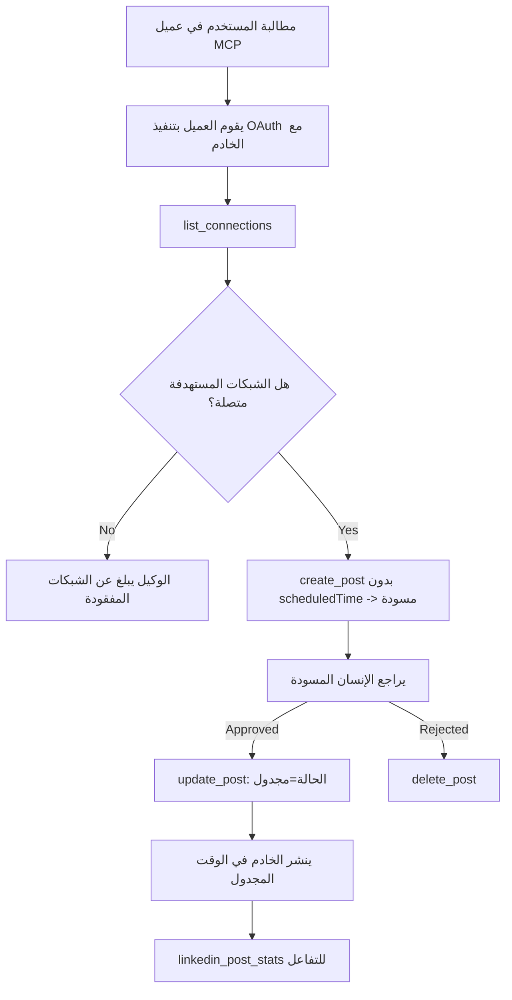

# دراسة حالة: النشر إلى الشبكات الاجتماعية من وكيل مع خادم MCP بعيد

> **إخلاء مسؤولية:** يمكن للعديد من الخدمات والمشروعات مفتوحة المصدر النشر إلى الشبكات الاجتماعية، ويمكن لفريق أيضًا دمج واجهة برمجة التطبيقات لكل شبكة مباشرة. السيناريو أدناه مقدم كمثال عملي لكيفية تصميم واستهلاك **خادم MCP بعيد قادر على الكتابة**. Publora هي خدمة تجارية مع طبقة مجانية؛ الأنماط الموضحة هنا تنطبق على أي خادم MCP يقوم بأفعال لا رجعة فيها نيابة عن المستخدم.

## نظرة عامة

الوكلاء جيدون في صياغة المحتوى وضعيفون في تسليمه. يمكن للنموذج كتابة إعلان إصدار في ثوانٍ، ثم يتوقف العمل: النشر يعني واجهة برمجة تطبيقات لكل شبكة، وتطبيق OAuth لكل شبكة، ومجموعة مختلفة من قواعد الوسائط لكل منها. تحل معظم الفرق هذه المشكلة بنسخ النص يدويًا إلى المتصفح.

تُظهر دراسة الحالة هذه كيف يتم إغلاق تلك الخطوة الأخيرة بخادم MCP بعيد واحد، — وأكثر فائدة لأي شخص يبني واحدًا — القرارات التصميمية التي يجب أن يطبقها خادم **قادر على الكتابة** بشكل صحيح. قراءة البيانات تسامحية. النشر ليس كذلك: استدعاء أداة خاطئ مرئي للجمهور ولا يمكن التراجع عنه.

## السيناريو

فريق صغير للعلاقات مع المطورين يصيغ المنشورات داخل وكيل (كلود، VS كود، كورسر — لا يهم العميل). يريدون أن:

- يروا أي حسابات اجتماعية متصلة بالفريق،
- يصيغوا منشورًا ويحتفظوا به كمسودة للموافقة البشرية،
- إرفاق صورة،
- جدولته لعدة شبكات في وقت مختار،
- والإبلاغ لاحقًا عن أدائه.

والأهم، يريدون أن يكون الوكيل *غير قادر* على النشر عن طريق الخطأ بينما هم لا يزالون يجربون.

## الأدوات المستخدمة

- [خادم MCP من Publora](https://github.com/publora/mcp-server) — خادم MCP بعيد (`streamable-http`) يقدم أدوات النشر، الجدولة، الوسائط وتحليلات LinkedIn. مسجل في سجل MCP الرسمي كـ `com.publora/mcp-server`.

## سير العمل خطوة بخطوة

1. **الاتصال بالخادم.** العملاء الذين يستخدمون OAuth يكملون تدفق رمز التفويض مع PKCE عبر شاشة موافقة الخادم؛ العملاء الذين لا يستخدمونه، مثل CLI بدون رأس، يستخدمون مفتاح API من Publora في رأس الطلب. كلا الطريقتين مدعومتان، والطريقة المستخدمة تعتمد على العميل وليس على الخادم.
2. **قائمة الاتصالات.** يستدعي الوكيل `list_connections` ويتلقى الحسابات المتصلة مع معرفاتها.
3. **صياغة.** يستدعي الوكيل `create_post` *بدون* وقت مجدول. يتم تخزين المنشور كمسودة — لا يُنشر شيء.
4. **إرفاق الوسائط.** تم تمرير روابط الصور العامة في نفس الاستدعاء؛ يقوم الخادم بتنزيلها والتحقق منها.
5. **الجدولة.** بعد موافقة بشرية، يتم استدعاء `update_post` لتعيين الحالة إلى مجدولة مع وقت بتنسيق ISO 8601.
6. **القياس.** بالنسبة لـ LinkedIn، يُرجع `linkedin_post_stats` التفاعل بمجرد أن يكون المنشور مباشرًا.

## مثال على الموجه

```text
Which social accounts do I have connected?
Draft a post announcing our new changelog page, attach the screenshot at
https://example.com/changelog.png, and keep it as a draft — do not publish it.
Once I approve, schedule it to LinkedIn and Bluesky for tomorrow at 09:00 UTC.
```

## مخطط Mermaid الانسيابي



## التنفيذ الفني

الدروس أدناه هي الجزء القابل للنقل من دراسة الحالة هذه.

### كشف مفتوح، تنفيذ مصدق

`tools/list` يقدم بدون بيانات اعتماد؛ كل `tools/call` يتطلب رمزًا وإلا يعيد `401` مع رأس `WWW-Authenticate` يشير إلى بيانات المورد المحمي. (الخادم يجيب أيضًا على `initialize` غير مصدق، والذي يهم فقط للعملاء على إصدارات البروتوكول قبل `2026-07-28`؛ هذا التعديل أزال المصافحة بالكامل.)

هذا الانقسام مهم في التطبيق العملي. يمكن للسجلات، الكتالوجات والعملاء استكشاف سطح الأداة — الأسماء، المخططات، التعليقات — بدون سر، بينما لا يمكن *تنفيذ* أي شيء بشكل مجهول. الخادم الذي يطلب رمزًا لـ `initialize` يكون فعليًا غير مرئي للأدوات؛ الخادم الذي يسمح باستدعاء أدوات مجهولة هو مسؤولية.

### التسجيل: التسجيل الديناميكي للعميل وما يحل محله

يعلن الخادم عن `/.well-known/oauth-protected-resource` و`/.well-known/oauth-authorization-server`، ويدعم تدفق رمز التفويض مع PKCE (`S256`)، رموز التحديث، و**التسجيل الديناميكي للعميل**.

التسجيل الديناميكي يلغي الخطوة اليدوية: بدونها يحتاج كل عميل إلى `client_id` مسبق الإصدار، ما يعني طلبًا خارجيًا للبائع لكل عميل جديد.

اعتبر هذا كسلوك توافق بدلاً من تصميم يُنسخ. مراجعة `2026-07-28` للمواصفة تستبعد التسجيل الديناميكي للعميل لصالح مستندات تعريف معرف العميل، حيث يستضيف العميل مستند تعريف على عنوان URL HTTPS مستقر وهذا العنوان *هو* `client_id`. يستمر DCR بالعمل حاليًا، لكن يجب على خادم يُبنى اليوم التخطيط لـ CIMD والحفاظ على DCR فقط للعملاء القدامى.

### التعليقات التوضيحية للأدوات ليست للزينة

كل أداة تحمل `title` والتلميحات المطبقة: `readOnlyHint`، `destructiveHint`، `idempotentHint`، `openWorldHint`.

سببان للاستثمار فيها. أولاً، يستخدم العملاء التلميحات لتقرير ما يجب تأكيده مع المستخدم — يمكن للعميل تشغيل بحث للقراءة فقط تلقائيًا والتوقف للموافقة قبل الحذف. المواصفة صريحة أن التعليقات التوضيحية هي تلميحات غير موثوقة، وليست آلية تفويض: تشكل ما يعرضه العميل للقيام به، ولا توقف أي شيء على الخادم، ويجب على الخادم تنفيذ قواعده الخاصة. ثانيًا، تطلب أدلة المربوطين الكبرى الآن *وجودها* للمراجعة؛ سيرفض الخادم الذي تفتقر أدواته لعناوين وتلميحات بغض النظر عن جودة عمله.

### اجعل المعرفات غير قابلة للاختراع

معرفات المنصة هي سلاسل غير شفافة تعاد بواسطة `list_connections` ووصف المخطط ينص صراحةً أنه يجب نسخها حرفيًا وعدم تخمينها أبدًا. يرفض الخادم أي شيء آخر.

النماذج متقنة في التخمين. يجب على أي خادم قادر على الكتابة أن يفترض أن معرفًا ما قد يُختلق في النهاية ويجعل هذا المسار يفشل بصوت عال ومبكر، بدلاً من التصرف بناءً على قيمة تبدو معقولة.

### الفشل قبل النشر، مع رسالة قابلة للإجراء

ترفض بعض الشبكات المنشورات التي تحتوي فقط على نص وتتطلب صورة أو فيديو. يتحقق ذلك عند جدولته، وتسمي الخطأ المنصة والمتطلب المفقود.

يمكن للوكيل التعافي من "إنستغرام يتطلب وسائط — أرفق صورة أو فيديو" بدون جولة إضافية. لا يمكنه التعافي من `400` عام.

### اجعل المحاولات الآمنة

الأداتان اللتان تنشئان المحتوى، `create_post` و`update_post`، تقبلان مفتاح التكرار: إعادة استخدامه مع طلب مطابق يعيد الاستجابة الأصلية بدلاً من إنشاء منشور ثاني. بيئات تشغيل الوكيل تحاول مرة أخرى عند انتهاء المهلة؛ بدون التكرار، يصبح رد بطيء نشرًا مكررًا. الأدوات الكتابية الأخرى — الحذف، خطوات الوسائط، ردود فعل وتعليقات LinkedIn — لا تأخذ المفتاح، لذلك إعادة المحاولة هناك ليست آمنة تلقائيًا. من المفيد معرفة أي من تحولاتك محمية وأيها ليست كذلك.

### توفير طريقة لاختبار لا تنشر شيئًا

يقبل الخادم هدفًا محجوزًا، `publora-playground`، يتم التحقق منه والاعتراف به كما لو كان وجهة حقيقية ثم يتم تجاهله — لا يصل شيء إلى حساب حي. موضوع في مخطط الأداة نفسه، الذي يمكن لأي عميل قراءته بدون بيانات اعتماد: حقل `platforms` في `create_post` يوثقه كـ "هدف اختبار الاتصال لا يتطلب اتصالاً حقيقياً — يُعترف بالمنشور ويتجاهل، لا يُنشر شيء". يدعى بتمريره كالإدخال الوحيد: `platforms: ["publora-playground"]`.

بدا هذا واحدًا من أكثر التفاصيل مفيدة في سطح الأداة بالكامل. يمكن لمراجعي أدلة المربوطين، المساهمين، وCI ممارسة مسار الكتابة الكامل من البداية للنهاية دون مخاطر على جمهور حقيقي. أي خادم MCP بأفعال لا رجعة فيها يستفيد من هدف توثيق لا عملية.

## النتائج والتأثير

- انتقلت خطوة النشر من المتصفح إلى نفس المحادثة التي يُكتب فيها المحتوى، وعادة المسودة أولاً يحافظ على وجود إنسان في الحلقة. كن دقيقًا بما هو ذلك: المسودة هي عرف، ليست حدًا. نفس بيانات الاعتماد يمكنها الجدولة أو النشر، لذا من يحتاج إلى بوابة موافقة حقيقية يجب أن يفرضها خارج سطح الأداة — بيانات اعتماد منفصلة، أو طبقة سياسة أمام الخادم.
- تُعالج اختلافات كل شبكة — متطلبات الوسائط، التتابع، أدوات الرد — مرة واحدة في الخادم بدلًا من كل وكيل يتحدث معه.
- نفس الخادم يدعم عدة عملاء MCP بدون عمل لكل عميل، لأن الاكتشاف مفتوح والتسجيل ديناميكي.
- القيود التصميمية أعلاه تشكلت بواسطة مراجعات أدلة المربوطين بقدر ما شكلها المستخدمون: التعليقات، OAuth وهدف اختبار آمن كلها مطلوبة على الأقل من قبل واحد منهم.

## المراجع

- [خادم MCP من Publora (المصدر)](https://github.com/publora/mcp-server)
- [وثائق API وMCP من Publora](https://docs.publora.com)
- [إدخال سجل MCP: `com.publora/mcp-server`](https://registry.modelcontextprotocol.io/v0/servers?search=com.publora/mcp-server)
- [مواصفة MCP — التفويض](https://modelcontextprotocol.io/specification/draft/basic/authorization)
- [مواصفة MCP — تعليقات الأدوات](https://modelcontextprotocol.io/docs/concepts/tools)

## ما التالي

- خذ خادم MCP تبنيه وتحقق من أرخص الثلاثة فوائد هنا: تعليقات على كل أداة، مفتاح التكرار على كل كتابة، وهدف لا عملية موثق.
- جرب انقسام الاكتشاف المفتوح: استدع `tools/list` ضد خادم بعيد عام بدون بيانات اعتماد، ثم استدع أداة وتفحص تحدي `401`.
- فكر فيما يعنيه "التراجع" لمجالك. النشر به مسودات وحذف؛ إذا لم تكن هناك مكافئات لأفعالك، فالتأكيد ينتمي إلى تصميم الأداة، وليس الموجه.

---

<!-- CO-OP TRANSLATOR DISCLAIMER START -->
**تنويه**:
تمت ترجمة هذا المستند باستخدام خدمة الترجمة بالذكاء الاصطناعي [Co-op Translator](https://github.com/Azure/co-op-translator). بينما نسعى للدقة، يرجى العلم أن الترجمات الآلية قد تحتوي على أخطاء أو عدم دقة. يجب اعتبار المستند الأصلي بلغته الأصلية المصدر الرسمي والمعتمد. للمعلومات الهامة، يُنصح بالاستعانة بترجمة بشرية محترفة. نحن غير مسؤولين عن أي سوء فهم أو تفسير ناتج عن استخدام هذه الترجمة.
<!-- CO-OP TRANSLATOR DISCLAIMER END -->