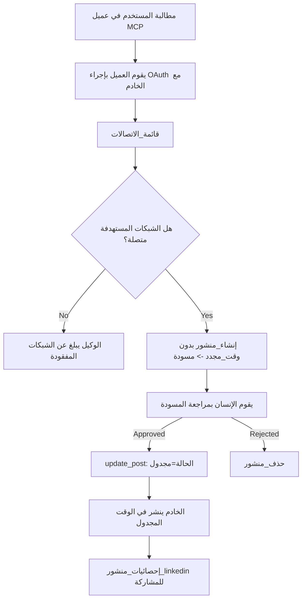

# دراسة حالة: النشر إلى الشبكات الاجتماعية من وكيل بخادم MCP عن بُعد

> **إخلاء مسؤولية:** يمكن للعديد من الخدمات والمشاريع مفتوحة المصدر النشر إلى الشبكات الاجتماعية، ويمكن لفريق أيضًا دمج API الخاص بكل شبكة مباشرة. السيناريو أدناه مقدم كمثال عملي واحد لكيفية تصميم واستهلاك **خادم MCP عن بُعد قادر على الكتابة**. Publora هي خدمة تجارية مع مستوى مجاني؛ الأنماط الموضحة هنا تنطبق على أي خادم MCP يقوم بإجراءات لا يمكن التراجع عنها نيابة عن المستخدم.

## نظرة عامة

الوكلاء جيدون في صياغة المحتوى وضعفاء في تسليمه. يمكن للنموذج كتابة إعلان إصدار في ثوانٍ، ثم يتوقف العمل: النشر يعني API لكل شبكة، وتطبيق OAuth لكل شبكة، ومجموعة مختلفة من قواعد الوسائط لكل منها. تحل معظم الفرق هذه المشكلة عن طريق نسخ النص يدويًا إلى المتصفح.

تدرس هذه الدراسة حالة كيف يتم إغلاق تلك الخطوة الأخيرة بخادم MCP عن بُعد واحد، وأكثر فائدة لأي شخص يبني واحدًا — في قرارات التصميم التي يجب على الخادم **القادر على الكتابة** اتخاذها بشكل صحيح. قراءة البيانات مسامحة. النشر ليس كذلك: استدعاء أداة خاطئ يكون مرئيًا لجمهور ولا يمكن التراجع عنه.

## السيناريو

فريق صغير لعلاقات المطورين يصيغ المنشورات داخل وكيل (Claude, VS Code, Cursor — العميل لا يهم). يريدون من الوكيل:

- رؤية أي حسابات اجتماعية ربطها الفريق،
- صياغة منشور والاحتفاظ به كمسودة للموافقة البشرية،
- إرفاق صورة،
- جدولته لعدة شبكات في وقت مختار،
- والإبلاغ لاحقًا عن أدائه.

الأمر الحاسم هو أنهم يريدون أن يكون الوكيل *غير قادر* على النشر عن طريق الخطأ أثناء التجربة.

## الأدوات المستخدمة

- [خادم Publora MCP](https://github.com/publora/mcp-server) — خادم MCP عن بُعد (`streamable-http`) يعرض أدوات النشر، الجدولة، الوسائط والتحليلات على LinkedIn. مسجل في السجل الرسمي MCP كـ `com.publora/mcp-server`.

## سير العمل خطوة بخطوة

1. **اتصل بالخادم.** العملاء الذين يستخدمون OAuth يكملون تدفق رمز التفويض مع PKCE مقابل شاشة موافقة الخادم؛ العملاء الذين لا يستخدمونه، مثل CLI بدون رأس، يستخدمون مفتاح API من Publora في رأس. كلا المسارين مدعوم، والمسار الذي تحصل عليه يعتمد على العميل، وليس على الخادم.
2. **سرد الاتصالات.** ينادي الوكيل `list_connections` ويتلقى الحسابات المتصلة مع معرفاتها.
3. **الصياغة.** ينادي الوكيل `create_post` *بدون* وقت مجدول. يتم تخزين المنشور كمسودة — لا يتم النشر.
4. **إرفاق الوسائط.** تُمرر روابط الصور العامة في نفس الاستدعاء؛ يقوم الخادم بتنزيلها والتحقق منها.
5. **الجدولة.** بعد الموافقة البشرية، يعين `update_post` الحالة إلى مجدولة مع وقت بصيغة ISO 8601.
6. **القياس.** بالنسبة لـ LinkedIn، يعيد `linkedin_post_stats` التفاعل بمجرد أن يكون المنشور مباشرًا.

## مثال على الموجه

```text
Which social accounts do I have connected?
Draft a post announcing our new changelog page, attach the screenshot at
https://example.com/changelog.png, and keep it as a draft — do not publish it.
Once I approve, schedule it to LinkedIn and Bluesky for tomorrow at 09:00 UTC.
```

## مخطط تدفق Mermaid



## التنفيذ الفني

الدروس أدناه هي الجزء القابل للنقل من هذه الدراسة الحالة.

### اكتشاف مفتوح، تنفيذ مصادق عليه

`tools/list` يُقدّم بدون بيانات اعتماد؛ كل `tools/call` يتطلب رمز وصول
ويرجع `401` مع رأس `WWW-Authenticate` يشير إلى
بيانات تعريف المورد المحمي. نقطة النهاية القديمة للخادم ترد أيضًا على
استدعاء `initialize` غير مصادق للعملاء على إصدارات البروتوكول قبل
`2026-07-28`؛ العملاء الحاليون لا يستخدمون ذلك المصافحة.

يسمح هذا التقسيم الخاص بالخادم للسجلات، الكتالوجات والعملاء بتفقد أسماء الأدوات،
المخططات والتعليقات التوضيحية دون سرّ بينما يمنع التنفيذ المجهول.
الاكتشاف المفتوح هو خيار للنشر، وليس متطلباً في MCP؛
نشر محمي قد يتطلب أيضًا تفويضًا لـ `tools/list`.

### التسجيل: التسجيل الديناميكي للعملاء، وما يحل محله

يعلن الخادم عن `/.well-known/oauth-protected-resource` و `/.well-known/oauth-authorization-server`، ويدعم تدفق رمز التفويض مع PKCE (`S256`)، رموز التحديث، و**التسجيل الديناميكي للعميل**.

أزال التسجيل الديناميكي الخطوة اليدوية للعملاء القدامى: بدونها،
كل عميل كان يحتاج إلى `client_id` مُصدر مسبقًا من البائع.

اعتبر هذا سلوك توافق أكثر من كونه تصميمًا يجب نسخه. تنص مراجعة المواصفات بتاريخ `2026-07-28` على إيقاف التسجيل الديناميكي للعميل لصالح مستندات بيانات تعريف معرّف العميل Client ID Metadata Documents، حيث يستضيف العميل مستند بيانات تعريف على عنوان HTTPS ثابت ويكون ذلك العنوان *هو* `client_id`. يظل DCR يعمل حاليًا، لكن خادمًا يُبنى اليوم يجب أن يخطط لـ CIMD مع الحفاظ على DCR فقط للعملاء الأقدم.

### التعليقات التوضيحية للأدوات ليست تزيينًا

تحمل كل أداة `title` والتلميحات المعمول بها: `readOnlyHint`, `destructiveHint`, `idempotentHint`, `openWorldHint`.

سببان للاستثمار فيها. أولاً، يستخدم العملاء التلميحات لتقرير ما يجب تأكيده مع المستخدم — يمكن للعميل تشغيل بحث للقراءة فقط تلقائيًا والتوقف للموافقة قبل الحذف. المواصفة توضح أن التعليقات التوضيحية هي تلميحات غير موثوقة، وليست آلية تفويض: تشكل ما يعرض العميل القيام به، لكنها لا توقف أي شيء على الخادم، ويجب على الخادم فرض قواعده الخاصة. ثانيًا، تتطلب أدلة المتصلين الرئيسية الآن *وجودها* للمراجعة؛ خادم أدواته تفتقر للعناوين والتلميحات سيرد إليه بغض النظر عن مدى جودة عمله.

### اجعل المعرفات غير قابلة للاختلاق

معرفات المنصات هي سلاسل غير شفافة تُعاد عبر `list_connections` ويقول وصف المخطط صراحةً أنه يجب نسخها حرفيًا ولا يجب التخمين بها أبدًا. يرفض الخادم أي شيء آخر.

النماذج موهوبة بالتخمين. يجب على أي خادم قادر على الكتابة أن يفترض أن المعرف قد يُختلق في النهاية وأن يجعل هذا المسار يفشل بصوت عالٍ وفي وقت مبكر، بدلاً من التصرف على قيمة تبدو معقولة.

### افشل قبل النشر، مع رسالة قابلة للعمل

ترفض بعض الشبكات المنشورات النصية فقط وتتطلب وسائط أو فيديو. يتم التحقق من ذلك عند الجدولة، ويسمي الخطأ النظام الأساسي والمتطلب المفقود.

يمكن للوكيل التعافي من "إنستغرام يتطلب وسائط — أرفق صورة أو فيديو" دون جولة أخرى. لا يمكنه التعافي من `400` عام.

### اجعل الإعادات آمنة

الأداتان اللتان تنشئان المحتوى، `create_post` و `update_post`، تقبلان مفتاح الاستدامة idempotency key: إعادة استخدامه مع طلب مطابق تعيد الاستجابة الأصلية بدلًا من إنشاء منشور ثاني. بيئات تشغيل الوكلاء تعيد المحاولة عند انتهاء المهلة؛ بدون الاستدامة، استجابة بطيئة تصبح نشراً مكررًا. الأدوات الكتابية الأخرى — الحذف، خطوات الوسائط، تفاعلات وتعليقات LinkedIn — لا تأخذ مفتاحًا، فالإعادة هناك ليست آمنة تلقائيًا. من المفيد معرفة أي من تعديلاتك محمية وأيها ليست كذلك.

### قدّم طريقة للاختبار دون نشر شيء

يقبل الخادم هدفًا محجوزًا، `publora-playground`، يتم التحقق منه والاعتراف به كوجهة حقيقية ثم يتم تجاهله — لا يصل شيء إلى حساب حي. يوصف ذلك في مخطط الأداة نفسه، والذي يمكن لأي عميل قراءته بدون بيانات اعتماد: توثق حقل `platforms` في `create_post` ذلك كـ "هدف اختبار اتصال لا يتطلب اتصالًا حقيقيًا — يتم الاعتراف بالمنشور والتخلص منه، لا يُنشر شيء". استدعِه بتمريره كإدخال وحيد: `platforms: ["publora-playground"]`.

ثبت أن هذه من أكثر التفاصيل فائدة على السطح كله. يمكن لمراجعي أدلة المتصلين، المساهمين، وأنظمة التكامل المستمر ممارسة مسار الكتابة الكامل من البداية للنهاية دون مخاطرة لجمهور حقيقي. يستفيد أي خادم MCP يقوم بإجراءات لا يمكن التراجع عنها من هدف موثق لا يفعل شيئًا.

## النتائج والتأثير

- انتقل خطوة النشر من المتصفح إلى نفس المحادثة حيث يُكتب المحتوى، وعادة المسودة-أولاً تبقي الإنسان في الحلقة. كن دقيقًا فيما يعنيه ذلك: المسودة اتفاقية، ليست حدًا. نفس بيانات الاعتماد يمكنها الجدولة أو النشر، لذلك من يحتاج إلى بوابة موافقة حقيقية عليه فرض ذلك خارج السطح — بيانات اعتماد منفصلة، أو طبقة سياسية أمام الخادم.
- تُعالج الاختلافات بين الشبكات — متطلبات الوسائط، التسلسل، ضوابط الرد — مرة واحدة على الخادم بدلاً من كل وكيل يتحدث إليه.
- نفس الخادم يدعم عدة عملاء MCP بدون بيانات اعتماد صادرة مسبقًا.
    يمكن للعملاء الحاليين استخدام مستندات بيانات تعريف معرّف العميل؛ ويبقى DCR خيارًا احتياطيًا
    للعملاء الأقدم.
- قيود التصميم أعلاه قد شكلتها مراجعات أدلة المتصلين بقدر ما شكّلها المستخدمون: التعليقات التوضيحية، OAuth وهدف الاختبار الآمن كانت كلها مطلوبة من قبل واحد على الأقل منهم.

## المراجع

- [خادم Publora MCP (المصدر)](https://github.com/publora/mcp-server)
- [توثيق API و MCP في Publora](https://docs.publora.com)
- [إدخال سجل MCP: `com.publora/mcp-server`](https://registry.modelcontextprotocol.io/v0/servers?search=com.publora/mcp-server)
- [مواصفة MCP — التفويض](https://modelcontextprotocol.io/specification/2026-07-28/basic/authorization)
- [مواصفة MCP — تعليقات الأدوات التوضيحية](https://modelcontextprotocol.io/docs/concepts/tools)

## ما هو التالي

- خذ خادم MCP تقوم ببنائه وافحص ثلاث مكاسب رخيصة هنا: التعليقات على كل أداة، مفتاح الاستدامة على كل كتابة، وهدف مفعّل لا فعل عليه موثق.
- جرب التقسيم المفتوح للاكتشاف: نادِ `tools/list` على خادم بعيد عام بدون بيانات اعتماد، ثم نادِ أداة وافحص تحدي `401`.
- فكر فيما يعنيه "التراجع" بالنسبة لنطاق عملك. للنشر مسودات وحذف؛ إذا لم يكن لإجراءاتك ما يعادل ذلك، فتأكيد الخطوات ينتمي إلى تصميم الأداة، وليس إلى الموجه.

---

<!-- CO-OP TRANSLATOR DISCLAIMER START -->
**تنويه**:
تمت ترجمة هذا المستند باستخدام خدمة الترجمة بالذكاء الاصطناعي [Co-op Translator](https://github.com/Azure/co-op-translator). بينما نسعى للدقة، يرجى العلم أن الترجمات الآلية قد تحتوي على أخطاء أو عدم دقة. يجب اعتبار المستند الأصلي بلغته الأصلية المصدر الرسمي والمعتمد. للمعلومات الهامة، يُنصح بالاستعانة بترجمة بشرية محترفة. نحن غير مسؤولين عن أي سوء فهم أو تفسير ناتج عن استخدام هذه الترجمة.
<!-- CO-OP TRANSLATOR DISCLAIMER END -->