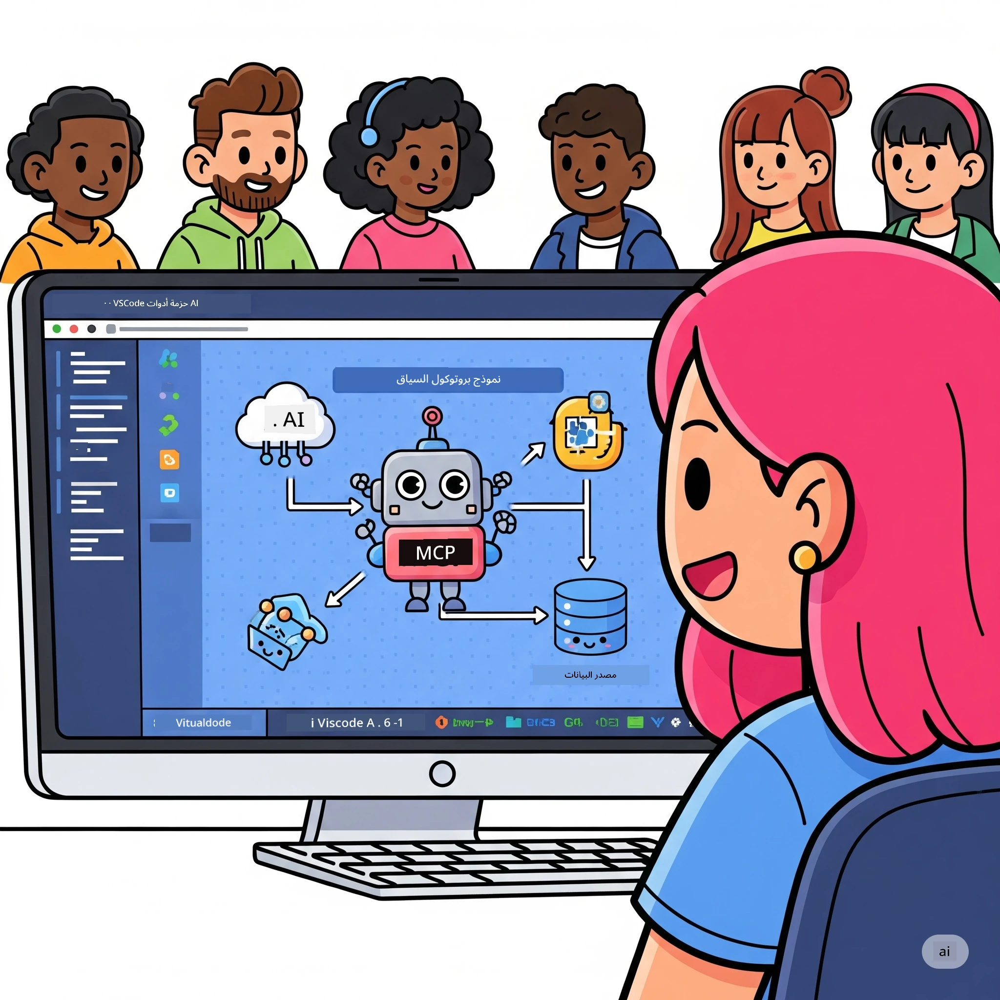
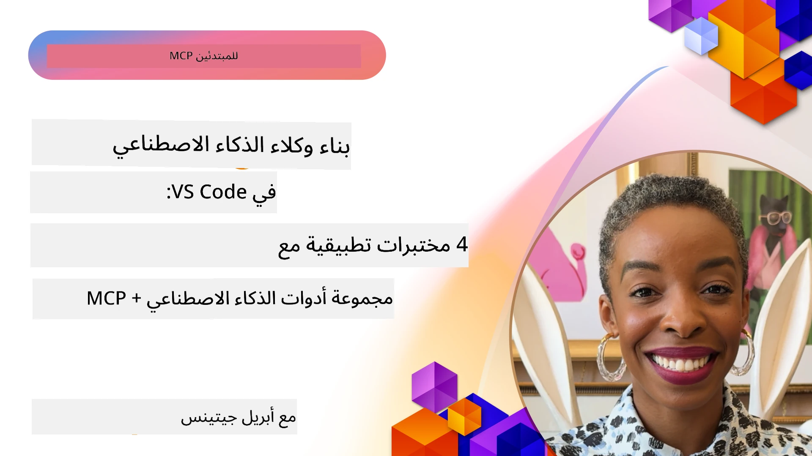

# تبسيط سير عمل الذكاء الاصطناعي: بناء خادم MCP باستخدام أدوات Microsoft Foundry

## 🎯 نظرة عامة

_(انقر على الصورة أعلاه لمشاهدة فيديو هذا الدرس)_

مرحباً بكم في **ورشة عمل بروتوكول سياق النموذج (MCP)**! تجمع هذه الورشة العملية الشاملة بين تقنيتين متطورتين لإحداث ثورة في تطوير تطبيقات الذكاء الاصطناعي:

> **ملاحظة التوافق:** تم بناء واختبار كود الورشة باستخدام MCP
> `2025-11-25`، كما هو موضح في الشارة أعلاه. استخدم
> [مواصفة `2026-07-28` الحالية](https://modelcontextprotocol.io/specification/2026-07-28/)
> لتنفيذ البروتوكول الجديد ومراجعة ملاحظات إصدار SDK قبل
> ترحيل المختبرات.

- **🔗 بروتوكول سياق النموذج (MCP)**: معيار مفتوح للتكامل السلس لأدوات الذكاء الاصطناعي
- **🛠️ امتداد أدوات Microsoft Foundry لـ VS Code**: امتداد تطوير الذكاء الاصطناعي القوي من مايكروسوفت

### 🎓 ما ستتعلمه

بحلول نهاية هذه الورشة، ستتمكن من بناء تطبيقات ذكية تربط نماذج الذكاء الاصطناعي بالأدوات والخدمات الحقيقية. من الاختبار الآلي إلى تكامل واجهات برمجة التطبيقات المخصصة، ستحصل على مهارات عملية لحل تحديات الأعمال المعقدة.

## 🏗️ تقنيات البناء

### 🔌 بروتوكول سياق النموذج (MCP)

MCP هو **"يو إس بي-سي للذكاء الاصطناعي"** - معيار عالمي يربط نماذج الذكاء الاصطناعي بالأدوات الخارجية ومصادر البيانات.

**✨ الميزات الرئيسية:**

- 🔄 **تكامل موحد**: واجهة شاملة لاتصالات أدوات الذكاء الاصطناعي
- 🏛️ **هيكل معماري مرن**: خوادم محلية وبعيدة عبر نقل stdio/SSE
- 🧰 **نظام بيئي غني**: أدوات، مطالبات، وموارد في بروتوكول واحد
- 🔒 **جاهز للمؤسسات**: أمان وموثوقية مدمجة

**🎯 لماذا MCP مهم:**
تماماً كما قضى USB-C على فوضى الكابلات، يقضي MCP على تعقيدات تكاملات الذكاء الاصطناعي. بروتوكول واحد، إمكانيات لا نهائية.

### 🤖 امتداد أدوات Microsoft Foundry لـ VS Code

امتداد مايكروسوفت الرائد لتطوير الذكاء الاصطناعي يحول VS Code إلى منصة ذكاء اصطناعي قوية.

**🚀 القدرات الأساسية:**

- 📦 **كتالوج النماذج**: الوصول إلى نماذج من Azure AI و GitHub و Hugging Face و Ollama
- ⚡ **الاستدلال المحلي**: تنفيذ محسن للمعالجات CPU/GPU/NPU باستخدام ONNX
- 🏗️ **منشئ الوكلاء**: تطوير وكلاء الذكاء الاصطناعي بصريًا مع تكامل MCP
- 🎭 **متعدد الوسائط**: دعم النصوص والرؤية والإخراج المهيكل

**💡 فوائد التطوير:**

- نشر النماذج بدون إعدادات مسبقة
- هندسة مطالبات بصرية
- ملعب اختبار فوري
- تكامل سلس مع خادم MCP

## 📚 مسار التعلم

### [🚀 الوحدة 1: أساسيات أدوات Microsoft Foundry](./lab1/README.md)

**المدة**: 15 دقيقة

- 🛠️ تثبيت وتكوين أدوات Microsoft Foundry لـ VS Code
- 🗂️ استكشاف كتالوج النماذج (أكثر من 100 نموذج من GitHub و ONNX و OpenAI و Anthropic و Google)
- 🎮 إتقان ملعب التفاعل للاختبار الفوري للنماذج
- 🤖 بناء وكيل الذكاء الاصطناعي الأول باستخدام منشئ الوكلاء
- 📊 تقييم أداء النماذج بمقاييس مدمجة (F1، الصلة، التشابه، الاتساق)
- ⚡ تعلم معالجة الدُفعات ودعم متعدد الوسائط

**🎯 النتاج التعليمي**: إنشاء وكيل ذكاء اصطناعي وظيفي بفهم شامل لقدرات أدوات Microsoft Foundry

### [🌐 الوحدة 2: MCP مع أساسيات أدوات Microsoft Foundry](./lab2/README.md)

**المدة**: 20 دقيقة

- 🧠 إتقان هندسة ومفاهيم بروتوكول سياق النموذج (MCP)
- 🌐 استكشاف نظام خوادم MCP الخاص بمايكروسوفت
- 🤖 بناء وكيل أتمتة المتصفح باستخدام Playwright MCP server
- 🔧 دمج خوادم MCP مع منشئ وكلاء أدوات Microsoft Foundry
- 📊 تكوين واختبار أدوات MCP ضمن وكلائك
- 🚀 تصدير ونشر وكلاء مدعومين بـ MCP للاستخدام في الإنتاج

**🎯 النتاج التعليمي**: نشر وكيل ذكاء اصطناعي معزز بالأدوات الخارجية عبر MCP

### [🔧 الوحدة 3: تطوير MCP المتقدم مع أدوات Microsoft Foundry](./lab3/README.md)

**المدة**: 20 دقيقة

- 💻 إنشاء خوادم MCP مخصصة باستخدام أدوات Microsoft Foundry
- 🐍 تكوين واستخدام أحدث إصدار من MCP Python SDK (الإصدار 1.9.3)
- 🔍 إعداد واستخدام MCP Inspector لأغراض التصحيح
- 🛠️ بناء خادم MCP للطقس مع سير عمل تصحيح احترافي
- 🧪 تصحيح خوادم MCP في بيئات منشئ الوكلاء وInspector

**🎯 النتاج التعليمي**: تطوير وتصحيح خوادم MCP مخصصة باستخدام أدوات حديثة

### [🐙 الوحدة 4: تطوير عملي MCP - خادم استنساخ GitHub مخصص](./lab4/README.md)

**المدة**: 30 دقيقة

- 🏗️ بناء خادم MCP لاستنساخ GitHub بالعالم الحقيقي لسير عمل التطوير
- 🔄 تنفيذ استنساخ مستودعات ذكي مع التحقق من الصحة ومعالجة الأخطاء
- 📁 إنشاء إدارة ذكية للدليل وتكامل مع VS Code
- 🤖 استخدام وضع وكيل GitHub Copilot مع أدوات MCP مخصصة
- 🛡️ تطبيق موثوقية جاهزة للإنتاج وتوافق عبر الأنظمة

**🎯 النتاج التعليمي**: نشر خادم MCP جاهز للإنتاج يبسط سير عمل التطوير الفعلي

## 💡 التطبيقات العملية والتأثير

### 🏢 حالات استخدام المؤسسات

#### 🔄 أتمتة DevOps

حول سير عمل التطوير الخاص بك مع الأتمتة الذكية:

- **إدارة مستودعات ذكية**: مراجعة الكود واتخاذ قرارات الدمج باستخدام الذكاء الاصطناعي
- **CI/CD ذكي**: تحسين الأنبوب الآلي بناءً على تغييرات الكود
- **تصنيف المشكلات**: تصنيف وتعيين الأخطاء تلقائياً

#### 🧪 ثورة ضمان الجودة

حسّن الاختبارات بالأتمتة المعززة بالذكاء الاصطناعي:

- **توليد اختبارات ذكي**: إنشاء مجموعات اختبار شاملة تلقائياً
- **اختبار الانحدار البصري**: اكتشاف تغييرات واجهة المستخدم بالذكاء الاصطناعي
- **مراقبة الأداء**: تحديد المشكلات وحلها بشكل استباقي

#### 📊 ذكاء أنابيب البيانات

أنشئ سير عمل لمعالجة البيانات أكثر ذكاءً:

- **عمليات ETL تكيفية**: تحولات بيانات ذاتية التحسين
- **كشف الشذوذ**: مراقبة جودة البيانات في الوقت الحقيقي
- **توجيه ذكي**: إدارة ذكية لتدفق البيانات

#### 🎧 تعزيز تجربة العملاء

ابتكر تفاعلات استثنائية مع العملاء:

- **دعم واعٍ بالسياق**: وكلاء ذكاء اصطناعي لديهم وصول إلى تاريخ العميل
- **حل المشكلات بشكل استباقي**: خدمة عملاء تنبؤية
- **تكامل متعدد القنوات**: تجربة ذكاء اصطناعي موحدة عبر المنصات

## 🛠️ المتطلبات والإعداد

### 💻 متطلبات النظام

| المكون | المتطلب | ملاحظات |
|-----------|-------------|-------|
| **نظام التشغيل** | Windows 10+، macOS 10.15+، Linux | أي نظام تشغيل حديث |
| **Visual Studio Code** | أحدث إصدار مستقر | مطلوب لأدوات Microsoft Foundry |
| **Node.js** | الإصدار v18.0+ و npm | لتطوير خادم MCP |
| **بايثون** | 3.10+ | اختياري لخوادم MCP بلغة بايثون |
| **الذاكرة** | 8GB RAM كحد أدنى | 16GB موصى بها للنماذج المحلية |

### 🔧 بيئة التطوير

#### امتدادات VS Code الموصى بها

- **Microsoft Foundry Toolkit** (ms-windows-ai-studio.windows-ai-studio)
- **بايثون** (ms-python.python)
- **مصحح بايثون** (ms-python.debugpy)
- **GitHub Copilot** (GitHub.copilot) - اختياري لكنه مفيد

#### أدوات اختيارية

- **uv**: مدير الحزم الحديث للبايثون
- **MCP Inspector**: أداة تصحيح بصرية لخوادم MCP
- **Playwright**: لأمثلة أتمتة الويب

## 🎖️ نواتج التعلم ومسار الشهادة

### 🏆 قائمة إتقان المهارات

بإكمالك لهذه الورشة، ستحقق إتقان في:

#### 🎯 الكفاءات الأساسية

- [ ] **إتقان بروتوكول MCP**: فهم عميق للهندسة وأنماط التنفيذ
- [ ] **مهارة أدوات Microsoft Foundry**: استخدام احترافي لأدوات Microsoft Foundry للتطوير السريع
- [ ] **تطوير خادم مخصص**: بناء ونشر وصيانة خوادم MCP في بيئة الإنتاج
- [ ] **تميز تكامل الأدوات**: ربط سلس للذكاء الاصطناعي مع سير عمل التطوير الحالي
- [ ] **تطبيق مهارات حل المشكلات**: تطبيق المهارات التي تعلمتها على تحديات الأعمال الحقيقية

#### 🔧 مهارات تقنية

- [ ] إعداد وتكوين أدوات Microsoft Foundry في VS Code
- [ ] تصميم وتنفيذ خوادم MCP مخصصة
- [ ] دمج نماذج GitHub مع هندسة MCP
- [ ] بناء سير عمل اختبار آلي باستخدام Playwright
- [ ] نشر وكلاء الذكاء الاصطناعي للاستخدام في الإنتاج
- [ ] تصحيح وتحسين أداء خوادم MCP

#### 🚀 القدرات المتقدمة

- [ ] تصميم تكاملات ذكاء اصطناعي على نطاق المؤسسات
- [ ] تنفيذ ممارسات الأمان المثلى لتطبيقات الذكاء الاصطناعي
- [ ] تصميم هياكل خوادم MCP قابلة للتوسع
- [ ] إنشاء سلاسل أدوات مخصصة لمجالات محددة
- [ ] توجيه الآخرين في تطوير الذكاء الاصطناعي الأصلي

## 📖 موارد إضافية

- [مواصفات MCP (2026-07-28)](https://modelcontextprotocol.io/specification/2026-07-28/)
- [مستودع أدوات Microsoft Foundry على GitHub](https://github.com/microsoft/vscode-ai-toolkit)
- [مجموعة خوادم MCP النموذجية](https://github.com/modelcontextprotocol/servers)
- [دليل الممارسات الأفضل](https://modelcontextprotocol.io/docs/best-practices)
- [أفضل 10 MCP حسب OWASP](https://microsoft.github.io/mcp-azure-security-guide/mcp/) - ممارسات الأمان المثلى

---

**🚀 هل أنت مستعد لثورة في سير عمل تطوير الذكاء الاصطناعي الخاص بك؟**

دعنا نبني مستقبل التطبيقات الذكية معاً باستخدام MCP وأدوات Microsoft Foundry!

## ما التالي

تابع إلى: [الوحدة 11: مختبرات عملية لخادم MCP](../11-MCPServerHandsOnLabs/README.md)

---

<!-- CO-OP TRANSLATOR DISCLAIMER START -->
**تنويه**:
تمت ترجمة هذا المستند باستخدام خدمة الترجمة بالذكاء الاصطناعي [Co-op Translator](https://github.com/Azure/co-op-translator). بينما نسعى للدقة، يرجى العلم أن الترجمات الآلية قد تحتوي على أخطاء أو عدم دقة. يجب اعتبار المستند الأصلي بلغته الأصلية المصدر الرسمي والمعتمد. للمعلومات الهامة، يُنصح بالاستعانة بترجمة بشرية محترفة. نحن غير مسؤولين عن أي سوء فهم أو تفسير ناتج عن استخدام هذه الترجمة.
<!-- CO-OP TRANSLATOR DISCLAIMER END -->