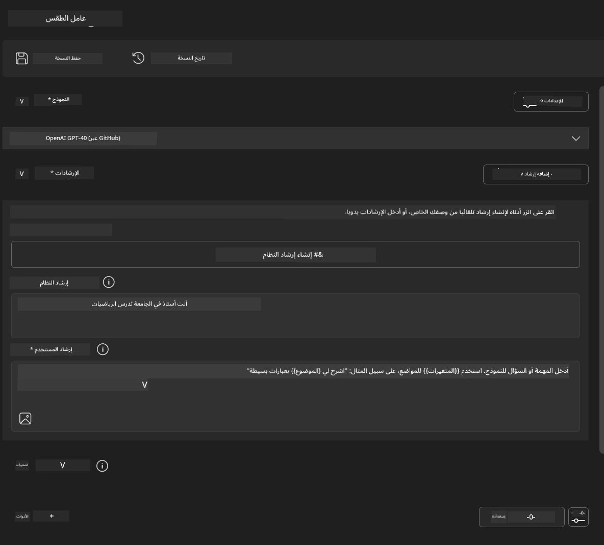
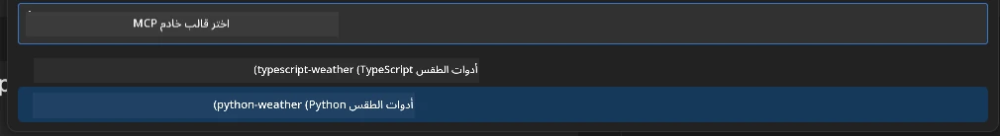
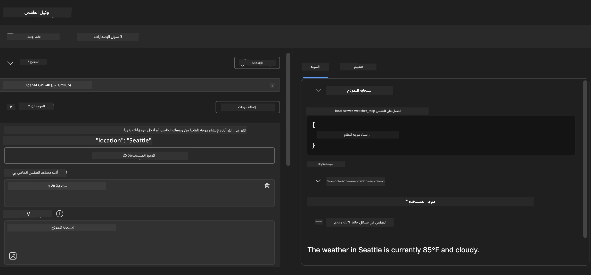
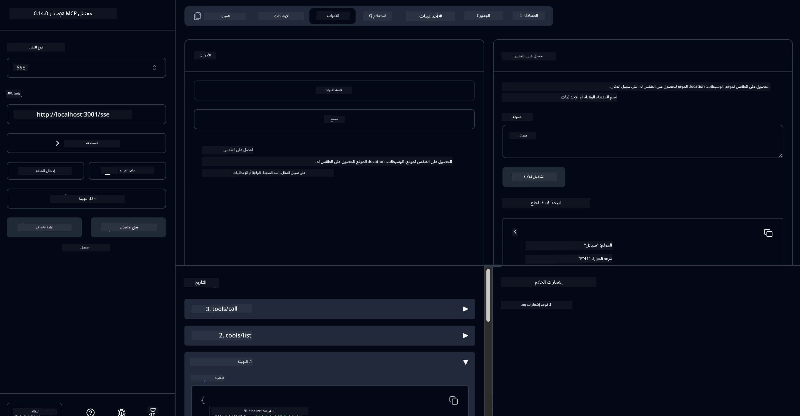

# 🔧 الوحدة 3: تطوير MCP المتقدم باستخدام Microsoft Foundry Toolkit

> [!NOTE]
> تستخدم عناوين URL الخاصة بالمفتش في هذا المختبر نقطة النهاية القديمة `/sse` وتستهدف
> تبعيات MCP SDK المثبتة `1.9.3` و Inspector `0.14.0`. هذه ليست أمثلة HTTP Streamable الحالية بتاريخ `2026-07-28`.


## 🎯 أهداف التعلم

بنهاية هذا المختبر، ستكون قادرًا على:

- ✅ إنشاء خوادم MCP مخصصة باستخدام Microsoft Foundry Toolkit
- ✅ تكوين واستخدام أحدث MCP Python SDK (الإصدار 1.9.3)
- ✅ إعداد واستخدام MCP Inspector لأغراض التصحيح
- ✅ تصحيح خوادم MCP في كل من بيئات Agent Builder و Inspector
- ✅ فهم سير عمل تطوير خوادم MCP المتقدمة

## 📋 المتطلبات الأساسية

- إكمال المختبر 2 (أساسيات MCP)
- تثبيت امتداد Microsoft Foundry Toolkit في VS Code
- بيئة Python 3.10+
- Node.js و npm لإعداد Inspector

## 🏗️ ما ستبنيه

في هذا المختبر، ستنشئ **خادم MCP للطقس** يُظهر:
- تنفيذ خادم MCP مخصص
- التكامل مع Microsoft Foundry Toolkit Agent Builder
- سير عمل تصحيح احترافي
- أنماط استخدام حديثة لـ MCP SDK

---

## 🔧 نظرة عامة على المكونات الأساسية

### 🐍 MCP Python SDK
يوفر نموذج بروتوكول السياق Python SDK الأساس لبناء خوادم MCP مخصصة. ستستخدم الإصدار 1.9.3 مع إمكانيات تصحيح محسنة.

### 🔍 MCP Inspector
أداة تصحيح قوية تقدم:
- مراقبة الخادم في الوقت الحقيقي
- تصور تنفيذ الأدوات
- فحص طلبات واستجابات الشبكة
- بيئة اختبار تفاعلية

---

## 📖 التنفيذ خطوة بخطوة

### الخطوة 1: إنشاء WeatherAgent في Agent Builder

1. **ابدأ Agent Builder** في VS Code من خلال امتداد Microsoft Foundry Toolkit
2. **أنشئ وكيلًا جديدًا** بالتكوين التالي:
   - اسم الوكيل: `WeatherAgent`



### الخطوة 2: تهيئة مشروع خادم MCP

1. **انتقل إلى Tools** → **Add Tool** في Agent Builder
2. **اختر "MCP Server"** من الخيارات المتاحة
3. **اختر "Create A new MCP Server"**
4. **اختر قالب `python-weather`**
5. **قم بتسمية الخادم:** `weather_mcp`



### الخطوة 3: افتح وراجع المشروع

1. **افتح المشروع المُنشأ** في VS Code
2. **راجع هيكل المشروع:**
   ```
   weather_mcp/
   ├── src/
   │   ├── __init__.py
   │   └── server.py
   ├── inspector/
   │   ├── package.json
   │   └── package-lock.json
   ├── .vscode/
   │   ├── launch.json
   │   └── tasks.json
   ├── pyproject.toml
   └── README.md
   ```

### الخطوة 4: الترقية إلى أحدث MCP SDK

> **🔍 لماذا الترقية؟** نريد استخدام أحدث إصدار MCP SDK (الإصدار 1.9.3) وخدمة المفتش (0.14.0) لتحسين الميزات وقدرات التصحيح.

#### 4أ. تحديث تبعيات Python

**حرر `pyproject.toml`:** تحديث [./code/weather_mcp/pyproject.toml](../../../../10-StreamliningAIWorkflowsBuildingAnMCPServerWithAIToolkit/lab3/code/weather_mcp/pyproject.toml)


#### 4ب. تحديث تكوين المفتش

**حرر `inspector/package.json`:** تحديث [./code/weather_mcp/inspector/package.json](../../../../10-StreamliningAIWorkflowsBuildingAnMCPServerWithAIToolkit/lab3/code/weather_mcp/inspector/package.json)

#### 4ج. تحديث تبعيات المفتش

**حرر `inspector/package-lock.json`:** تحديث [./code/weather_mcp/inspector/package-lock.json](../../../../10-StreamliningAIWorkflowsBuildingAnMCPServerWithAIToolkit/lab3/code/weather_mcp/inspector/package-lock.json)

> **📝 ملاحظة:** يحتوي هذا الملف على تعريفات واسعة النطاق للتبعيات. أدناه الهيكل الأساسي - المحتوى الكامل يضمن حل التبعيات بشكل صحيح.


> **⚡ قفل الحزمة الكامل:** يحتوي ملف package-lock.json الكامل على حوالي 3000 سطر من تعريفات التبعيات. أعلاه الهيكل الرئيسي - استخدم الملف المقدم لحل التبعيات بالكامل.

### الخطوة 5: تكوين تصحيح VS Code

*ملاحظة: يرجى نسخ الملف إلى المسار المحدد لاستبدال الملف المحلي المقابل*

#### 5أ. تحديث تكوين الإطلاق

**حرر `.vscode/launch.json`:**

```json
{
  "version": "0.2.0",
  "configurations": [
    {
      "name": "Attach to Local MCP",
      "type": "debugpy",
      "request": "attach",
      "connect": {
        "host": "localhost",
        "port": 5678
      },
      "presentation": {
        "hidden": true
      },
      "internalConsoleOptions": "neverOpen",
      "postDebugTask": "Terminate All Tasks"
    },
    {
      "name": "Launch Inspector (Edge)",
      "type": "msedge",
      "request": "launch",
      "url": "http://localhost:6274?timeout=60000&serverUrl=http://localhost:3001/sse#tools",
      "cascadeTerminateToConfigurations": [
        "Attach to Local MCP"
      ],
      "presentation": {
        "hidden": true
      },
      "internalConsoleOptions": "neverOpen"
    },
    {
      "name": "Launch Inspector (Chrome)",
      "type": "chrome",
      "request": "launch",
      "url": "http://localhost:6274?timeout=60000&serverUrl=http://localhost:3001/sse#tools",
      "cascadeTerminateToConfigurations": [
        "Attach to Local MCP"
      ],
      "presentation": {
        "hidden": true
      },
      "internalConsoleOptions": "neverOpen"
    }
  ],
  "compounds": [
    {
      "name": "Debug in Agent Builder",
      "configurations": [
        "Attach to Local MCP"
      ],
      "preLaunchTask": "Open Agent Builder",
    },
    {
      "name": "Debug in Inspector (Edge)",
      "configurations": [
        "Launch Inspector (Edge)",
        "Attach to Local MCP"
      ],
      "preLaunchTask": "Start MCP Inspector",
      "stopAll": true
    },
    {
      "name": "Debug in Inspector (Chrome)",
      "configurations": [
        "Launch Inspector (Chrome)",
        "Attach to Local MCP"
      ],
      "preLaunchTask": "Start MCP Inspector",
      "stopAll": true
    }
  ]
}
```

**حرر `.vscode/tasks.json`:**

```
{
  "version": "2.0.0",
  "tasks": [
    {
      "label": "Start MCP Server",
      "type": "shell",
      "command": "python -m debugpy --listen 127.0.0.1:5678 src/__init__.py sse",
      "isBackground": true,
      "options": {
        "cwd": "${workspaceFolder}",
        "env": {
          "PORT": "3001"
        }
      },
      "problemMatcher": {
        "pattern": [
          {
            "regexp": "^.*$",
            "file": 0,
            "location": 1,
            "message": 2
          }
        ],
        "background": {
          "activeOnStart": true,
          "beginsPattern": ".*",
          "endsPattern": "Application startup complete|running"
        }
      }
    },
    {
      "label": "Start MCP Inspector",
      "type": "shell",
      "command": "npm run dev:inspector",
      "isBackground": true,
      "options": {
        "cwd": "${workspaceFolder}/inspector",
        "env": {
          "CLIENT_PORT": "6274",
          "SERVER_PORT": "6277",
        }
      },
      "problemMatcher": {
        "pattern": [
          {
            "regexp": "^.*$",
            "file": 0,
            "location": 1,
            "message": 2
          }
        ],
        "background": {
          "activeOnStart": true,
          "beginsPattern": "Starting MCP inspector",
          "endsPattern": "Proxy server listening on port"
        }
      },
      "dependsOn": [
        "Start MCP Server"
      ]
    },
    {
      "label": "Open Agent Builder",
      "type": "shell",
      "command": "echo ${input:openAgentBuilder}",
      "presentation": {
        "reveal": "never"
      },
      "dependsOn": [
        "Start MCP Server"
      ],
    },
    {
      "label": "Terminate All Tasks",
      "command": "echo ${input:terminate}",
      "type": "shell",
      "problemMatcher": []
    }
  ],
  "inputs": [
    {
      "id": "openAgentBuilder",
      "type": "command",
      "command": "ai-mlstudio.agentBuilder",
      "args": {
        "initialMCPs": [ "local-server-weather_mcp" ],
        "triggeredFrom": "vsc-tasks"
      }
    },
    {
      "id": "terminate",
      "type": "command",
      "command": "workbench.action.tasks.terminate",
      "args": "terminateAll"
    }
  ]
}
```


---

## 🚀 تشغيل واختبار خادم MCP الخاص بك

### الخطوة 6: تثبيت التبعيات

بعد إجراء التغييرات في التكوين، شغّل الأوامر التالية:

**تثبيت تبعيات Python:**
```bash
uv sync
```

**تثبيت تبعيات Inspector:**
```bash
cd inspector
npm install
```

### الخطوة 7: التصحيح باستخدام Agent Builder

1. **اضغط F5** أو استخدم تكوين **"Debug in Agent Builder"**
2. **اختر التكوين المركب** من لوحة التصحيح
3. **انتظر بدء تشغيل الخادم** وفتح Agent Builder
4. **اختبر خادم MCP للطقس الخاص بك** باستخدام استعلامات اللغة الطبيعية

أدخل الموجه مثل هذا

SYSTEM_PROMPT

```
You are my weather assistant
```

USER_PROMPT

```
How's the weather like in Seattle
```



### الخطوة 8: التصحيح باستخدام MCP Inspector

1. **استخدم تكوين "Debug in Inspector"** (Edge أو Chrome)
2. **افتح واجهة Inspector** على `http://localhost:6274`
3. **استكشف بيئة الاختبار التفاعلية:**
   - عرض الأدوات المتاحة
   - اختبار تنفيذ الأدوات
   - مراقبة طلبات الشبكة
   - تصحيح استجابات الخادم



---

## 🎯 النتائج الرئيسية للتعلم

من خلال إكمال هذا المختبر، لقد قمت بـ:

- [x] **إنشاء خادم MCP مخصص** باستخدام قوالب Microsoft Foundry Toolkit
- [x] **الترقية إلى أحدث MCP SDK** (الإصدار 1.9.3) لوظائف محسنة
- [x] **تكوين سير عمل تصحيح احترافي** لكل من Agent Builder و Inspector
- [x] **إعداد MCP Inspector** لاختبار الخادم التفاعلي
- [x] **إتقان تكوينات تصحيح VS Code** لتطوير MCP

## 🔧 الميزات المتقدمة المستكشفة

| الميزة | الوصف | حالة الاستخدام |
|---------|-------------|----------|
| **MCP Python SDK v1.9.3** | أحدث تنفيذ للبروتوكول | تطوير خادم حديث |
| **MCP Inspector 0.14.0** | أداة تصحيح تفاعلية | اختبار الخادم في الوقت الفعلي |
| **تصحيح VS Code** | بيئة تطوير متكاملة | سير عمل تصحيح احترافي |
| **تكامل Agent Builder** | اتصال مباشر بـ Microsoft Foundry Toolkit | اختبار الوكلاء من البداية للنهاية |

## 📚 موارد إضافية

- [توثيق MCP Python SDK](https://modelcontextprotocol.io/docs/sdk/python)
- [دليل امتداد Microsoft Foundry Toolkit](https://code.visualstudio.com/docs/ai/ai-toolkit)
- [توثيق تصحيح VS Code](https://code.visualstudio.com/docs/editor/debugging)
- [مواصفة نموذج بروتوكول السياق](https://modelcontextprotocol.io/docs/concepts/architecture)

---

**🎉 تهانينا!** لقد أكملت بنجاح المختبر 3 ويمكنك الآن إنشاء وتصحيح ونشر خوادم MCP مخصصة باستخدام سير عمل تطوير احترافي.

### 🔜 تابع إلى الوحدة التالية

هل أنت مستعد لتطبيق مهارات MCP في سير عمل تطوير واقعي؟ تابع إلى **[الوحدة 4: تطوير MCP العملي - خادم استنساخ GitHub مخصص](../lab4/README.md)** حيث ستقوم بـ:
- بناء خادم MCP جاهز للإنتاج يقوم بأتمتة عمليات مستودع GitHub
- تنفيذ وظيفة استنساخ مستودعات GitHub عبر MCP
- دمج خوادم MCP المخصصة مع VS Code ووضع GitHub Copilot Agent
- اختبار ونشر خوادم MCP المخصصة في بيئات الإنتاج
- تعلم أتمتة سير العمل العملي للمطورين

---

<!-- CO-OP TRANSLATOR DISCLAIMER START -->
**تنويه**:
تمت ترجمة هذا المستند باستخدام خدمة الترجمة بالذكاء الاصطناعي [Co-op Translator](https://github.com/Azure/co-op-translator). بينما نسعى للدقة، يرجى العلم أن الترجمات الآلية قد تحتوي على أخطاء أو عدم دقة. يجب اعتبار المستند الأصلي بلغته الأصلية المصدر الرسمي والمعتمد. للمعلومات الهامة، يُنصح بالاستعانة بترجمة بشرية محترفة. نحن غير مسؤولين عن أي سوء فهم أو تفسير ناتج عن استخدام هذه الترجمة.
<!-- CO-OP TRANSLATOR DISCLAIMER END -->