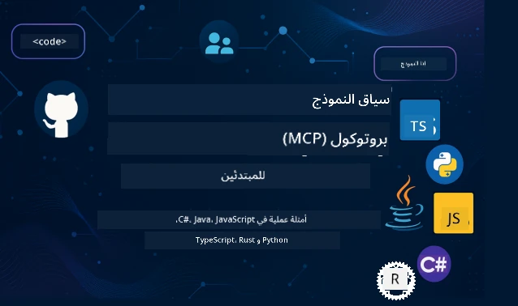

 

[](https://GitHub.com/microsoft/mcp-for-beginners/graphs/contributors)
[](https://GitHub.com/microsoft/mcp-for-beginners/issues)
[](https://GitHub.com/microsoft/mcp-for-beginners/pulls)
[](http://makeapullrequest.com)

[](https://GitHub.com/microsoft/mcp-for-beginners/watchers)
[](https://GitHub.com/microsoft/mcp-for-beginners/fork)
[](https://GitHub.com/microsoft/mcp-for-beginners/stargazers)


[](https://discord.gg/nTYy5BXMWG)

اتبع هذه الخطوات للبدء باستخدام هذه الموارد:
1. **افتح الاشتقاق (Fork) للمستودع**: انقر على [](https://GitHub.com/microsoft/mcp-for-beginners/fork)
2. **انسخ المستودع (Clone)**:  `git clone https://github.com/microsoft/mcp-for-beginners.git`
3. **انضم إلى** [](https://discord.gg/nTYy5BXMWG)


### 🌐 دعم متعدد اللغات

#### مدعوم عبر GitHub Action (آلي ودائم التحديث)

<!-- CO-OP TRANSLATOR LANGUAGES TABLE START -->
[Arabic](./README.md) | [Bengali](../bn/README.md) | [Bulgarian](../bg/README.md) | [Burmese (Myanmar)](../my/README.md) | [Chinese (Simplified)](../zh-CN/README.md) | [Chinese (Traditional, Hong Kong)](../zh-HK/README.md) | [Chinese (Traditional, Macau)](../zh-MO/README.md) | [Chinese (Traditional, Taiwan)](../zh-TW/README.md) | [Croatian](../hr/README.md) | [Czech](../cs/README.md) | [Danish](../da/README.md) | [Dutch](../nl/README.md) | [Estonian](../et/README.md) | [Finnish](../fi/README.md) | [French](../fr/README.md) | [German](../de/README.md) | [Greek](../el/README.md) | [Hebrew](../he/README.md) | [Hindi](../hi/README.md) | [Hungarian](../hu/README.md) | [Indonesian](../id/README.md) | [Italian](../it/README.md) | [Japanese](../ja/README.md) | [Kannada](../kn/README.md) | [Korean](../ko/README.md) | [Lithuanian](../lt/README.md) | [Malay](../ms/README.md) | [Malayalam](../ml/README.md) | [Marathi](../mr/README.md) | [Nepali](../ne/README.md) | [Nigerian Pidgin](../pcm/README.md) | [Norwegian](../no/README.md) | [Persian (Farsi)](../fa/README.md) | [Polish](../pl/README.md) | [Portuguese (Brazil)](../pt-BR/README.md) | [Portuguese (Portugal)](../pt-PT/README.md) | [Punjabi (Gurmukhi)](../pa/README.md) | [Romanian](../ro/README.md) | [Russian](../ru/README.md) | [Serbian (Cyrillic)](../sr/README.md) | [Slovak](../sk/README.md) | [Slovenian](../sl/README.md) | [Spanish](../es/README.md) | [Swahili](../sw/README.md) | [Swedish](../sv/README.md) | [Tagalog (Filipino)](../tl/README.md) | [Tamil](../ta/README.md) | [Telugu](../te/README.md) | [Thai](../th/README.md) | [Turkish](../tr/README.md) | [Ukrainian](../uk/README.md) | [Urdu](../ur/README.md) | [Vietnamese](../vi/README.md)

> **هل تفضل النسخ المحلي؟**
>
> يحتوي هذا المستودع على أكثر من 50 ترجمة لغة مما يزيد بشكل كبير من حجم التنزيل. لنسخ المستودع بدون الترجمات، استخدم اختيار متفرق (sparse checkout):
>
> **Bash / macOS / Linux:**
> ```bash
> git clone --filter=blob:none --sparse https://github.com/microsoft/mcp-for-beginners.git
> cd mcp-for-beginners
> git sparse-checkout set --no-cone '/*' '!translations' '!translated_images'
> ```
>
> **CMD (Windows):**
> ```cmd
> git clone --filter=blob:none --sparse https://github.com/microsoft/mcp-for-beginners.git
> cd mcp-for-beginners
> git sparse-checkout set --no-cone "/*" "!translations" "!translated_images"
> ```
>
> هذا يضمن حصولك على كل ما تحتاجه لإكمال الدورة بسرعة تنزيل أكبر.
<!-- CO-OP TRANSLATOR LANGUAGES TABLE END -->

# 🚀 منهج بروتوكول سياق النموذج (MCP) للمبتدئين

## **تعلم MCP من خلال أمثلة عملية على الأكواد في C#، Java، JavaScript، Rust، Python، و TypeScript**

## 🧠 نظرة عامة على منهج بروتوكول سياق النموذج
مرحبًا بك في رحلتك مع بروتوكول سياق النموذج! إذا تساءلت يومًا كيف تتواصل تطبيقات الذكاء الاصطناعي مع الأدوات والخدمات المختلفة، فأنت على وشك اكتشاف الحل الأنيق الذي يغير كيف يبني المطورون أنظمة ذكية.

فكر في MCP كمترجم عالمي لتطبيقات الذكاء الاصطناعي - تمامًا كما تتيح لك منافذ USB توصيل أي جهاز بجهاز الكمبيوتر، يتيح MCP لنماذج الذكاء الاصطناعي الاتصال بأي أداة أو خدمة بطريقة موحدة. سواء كنت تبني أول دردشة ذكية لك أو تعمل على سير عمل معقد للذكاء الاصطناعي، فإن فهم MCP يمنحك قدرة أكبر ومرونة في بناء التطبيقات.

تم تصميم هذا المنهج بصبر وعناية لمسيرة تعلمك. سنبدأ بمفاهيم بسيطة تعرفها مسبقًا ونتدرج في بناء خبرتك من خلال تدريب عملي على لغتك البرمجية المفضلة. كل خطوة تشمل تفسيرات واضحة وأمثلة عملية وتشجيعًا مستمرًا.

عندما تنهي هذه الرحلة، ستكون واثقًا في بناء خوادم MCP الخاصة بك، ودمجها مع منصات ذكاء اصطناعي شهيرة، وفهم كيف يعيد هذا التكنولوجيا تشكيل مستقبل تطوير الذكاء الاصطناعي. هيا نبدأ هذه المغامرة المشوقة معًا!

### الوثائق والمواصفات الرسمية

هذا المنهج يتماشى مع **مواصفة MCP 2025-11-25** (الإصدار المستقر الأخير). يستخدم MCP نظام ترقيم يعتمد على التاريخ (صيغة YYYY-MM-DD) لضمان تتبع واضح لإصدارات البروتوكول.

تزداد قيمة هذه الموارد مع زيادة فهمك، ولكن لا تشعر بالضغط لقراءة كل شيء فورًا. ابدأ بالمجالات التي تثير اهتمامك أكثر!
- 📘 [توثيق MCP](https://modelcontextprotocol.io/) – هذا هو موردك الأساسي للدروس خطوة بخطوة وأدلة الاستخدام. تم كتابة الوثائق مع مراعاة المبتدئين، موفرة أمثلة واضحة يمكنك متابعتها بوتيرتك الخاصة.
- 📜 [مواصفة MCP](https://modelcontextprotocol.io/specification/2025-11-25) – اعتبرها دليل مرجعي شامل. خلال متابعة المنهج، ستعود هنا للبحث عن تفاصيل محددة واستكشاف ميزات متقدمة.
- 📜 [ترقيم إصدارات MCP](https://modelcontextprotocol.io/specification/versioning) – يحتوي على معلومات عن تاريخ إصدارات البروتوكول وكيفية استخدام MCP لنظام ترقيم يعتمد على التاريخ (YYYY-MM-DD).
- 🧑‍💻 [مستودع MCP على GitHub](https://github.com/modelcontextprotocol) – هنا ستجد مجموعات تطوير البرمجيات (SDKs) والأدوات وعينات الأكواد بلغات برمجة متعددة. إنه كنز من الأمثلة العملية والمكونات الجاهزة للاستخدام.
- 🌐 [مجتمع MCP](https://github.com/orgs/modelcontextprotocol/discussions) – انضم إلى المتعلمين والمطورين ذوي الخبرة في نقاشات حول MCP. إنها مجتمع داعم حيث الأسئلة مرحب بها والمعرفة تُنقل بحرية.
  
## أهداف التعلم

بنهاية هذا المنهج، ستكون واثقًا ومتحمسًا لقدراتك الجديدة. إليك ما ستحصل عليه:

• **فهم أساسيات MCP**: ستفهم ما هو بروتوكول سياق النموذج ولماذا يحدث ثورة في كيفية تعاون تطبيقات الذكاء الاصطناعي، باستخدام تشبيهات وأمثلة واضحة.

• **بناء أول خادم MCP خاص بك**: ستنشئ خادم MCP يعمل بلغة البرمجة التي تفضلها، بدءًا من أمثلة بسيطة وتنمو مهاراتك خطوة بخطوة.

• **ربط نماذج الذكاء الاصطناعي بالأدوات الحقيقية**: ستتعلم كيف تسد الفجوة بين نماذج الذكاء الاصطناعي والخدمات الحقيقية، مما يمنح تطبيقاتك قدرات جديدة قوية.

• **تنفيذ أفضل ممارسات الأمان**: ستفهم كيف تحافظ على أمن تطبيقات MCP الخاصة بك، وحماية تطبيقاتك ومستخدميك.

• **النشر بثقة**: ستعرف كيفية نقل مشاريع MCP من مرحلة التطوير إلى الإنتاج باستراتيجيات نشر عملية تعمل في العالم الحقيقي.

• **انضم إلى مجتمع MCP**: ستصبح جزءًا من مجتمع متنامٍ من المطورين الذين يشكلون مستقبل تطوير تطبيقات الذكاء الاصطناعي.

## خلفية أساسية مهمة

قبل أن نغوص في تفاصيل MCP، دعنا نتأكد من أنك مرتاح مع بعض المفاهيم الأساسية. لا تقلق إذا لم تكن خبيرًا في هذه المجالات - سنشرح لك كل ما تحتاج لمعرفته أثناء التقدم!

### فهم البروتوكولات (الأساس)

فكر في البروتوكول كقواعد المحادثة. عندما تتصل بصديق، تعرفان أن تضيفا "مرحبا" عند الرد، وتأخذان دور الكلام، وتقولان "وداعًا" عند الانتهاء. تحتاج البرامج الحاسوبية إلى قواعد مماثلة للتواصل بفعالية.

MCP هو بروتوكول – مجموعة من القواعد المتفق عليها التي تساعد نماذج وتطبيقات الذكاء الاصطناعي على إجراء "محادثات" إنتاجية مع الأدوات والخدمات. مثل وجود قواعد المحادثة يجعل الاتصال البشري أكثر سلاسة، يجعل MCP اتصال تطبيقات الذكاء الاصطناعي أكثر موثوقية وقوة.

### علاقات العميل-الخادم (كيف تعمل البرامج معًا)

أنت تستخدم علاقات العميل-الخادم يوميًا! عندما تستخدم متصفح الويب (العميل) لزيارة موقع، تتصل بخادم ويب يرسل محتوى الصفحة. يعرف المتصفح كيف يطلب المعلومات، والخادم يعرف كيف يجيب.

في MCP، لدينا علاقة مشابهة: نماذج الذكاء الاصطناعي تعمل كعملاء يطلبون معلومات أو إجراءات، في حين تقدم خوادم MCP هذه القدرات. إنه مثل وجود مساعد يساعد الذكاء الاصطناعي في أداء مهام محددة.

### لماذا التوحيد القياسي مهم (جعل الأشياء تعمل معًا)

تخيل أن كل مصنع سيارات يستخدم شكل مختلف لضخ البنزين - ستحتاج إلى محول مختلف لكل سيارة! التوحيد القياسي يعني الاتفاق على أساليب مشتركة لتعمل الأمور معًا بسلاسة.

يوفر MCP هذا التوحيد القياسي لتطبيقات الذكاء الاصطناعي. بدلاً من حاجة كل نموذج ذكاء اصطناعي إلى كود مخصص للعمل مع كل أداة، يخلق MCP طريقة عالمية للتواصل. هذا يعني أن المطورين يمكنهم بناء الأدوات مرة واحدة وجعلها تعمل مع أنظمة ذكاء اصطناعي مختلفة.

## 🧭 نظرة عامة على مسار تعلمك

تم تنظيم رحلتك مع MCP بعناية لبناء ثقتك ومهاراتك تدريجيًا. كل مرحلة تقدم مفاهيم جديدة مع تعزيز ما تعلمته مسبقًا.

### 🌱 مرحلة الأساس: فهم المبادئ الأساسية (الوحدات 0-2)

هنا تبدأ مغامرتك! سنقدم لك مفاهيم MCP باستخدام تشبيهات مألوفة وأمثلة بسيطة. ستفهم ما هو MCP، ولماذا وُجد، وكيف يتناسب مع عالم تطوير الذكاء الاصطناعي الأكبر.

• **الوحدة 0 - مقدمة في MCP**: سنبدأ باستكشاف ما هو MCP ولماذا هو مهم لتطبيقات الذكاء الاصطناعي الحديثة. سترى أمثلة حقيقية لـ MCP قيد العمل وتفهم كيف يحل مشاكل شائعة يواجهها المطورون.

• **الوحدة 1 - شرح المفاهيم الأساسية**: هنا ستتعلم اللبنات الأساسية الهامة لـ MCP. سنستخدم الكثير من التشبيهات والأمثلة المرئية لضمان أن تكون هذه المفاهيم طبيعية وسهلة الفهم.

• **الوحدة 2 - الأمان في MCP**: قد يبدو الأمان مخيفًا، لكن سنوضح كيف يتضمن MCP ميزات أمان مدمجة ونعلمك أفضل الممارسات التي تحمي تطبيقاتك من البداية.

### 🔨 مرحلة البناء: إنشاء أول تطبيقاتك (الوحدة 3)

الآن يبدأ المرح الحقيقي! ستخوض تجربة عملية في بناء خوادم وعمليات عمل MCP فعلية. لا تقلق - سنبدأ ببساطة ونرشدك في كل خطوة.
تتضمن هذه الوحدة عدة أدلة تطبيقية تتيح لك الممارسة بلغتك البرمجية المفضلة. ستقوم بإنشاء خادمك الأول، وبناء عميل للاتصال به، وحتى التكامل مع أدوات التطوير الشهيرة مثل VS Code.

تتضمن كل دليل أمثلة كود كاملة، نصائح لحل المشكلات، وشرحًا لأسباب اتخاذنا خيارات تصميم محددة. بنهاية هذه المرحلة، سيكون لديك تطبيقات MCP تعمل بنجاح يمكنك أن تفخر بها!

### 🚀 مرحلة النمو: المفاهيم المتقدمة والتطبيقات العملية (الوحدات 4-5)

بعد تمكين الأساسيات، أنت جاهز لاستكشاف ميزات MCP الأكثر تطورًا. سنغطي استراتيجيات التنفيذ العملية، تقنيات تصحيح الأخطاء، ومواضيع متقدمة مثل التكامل متعدد النماذج للذكاء الاصطناعي.

ستتعلم أيضًا كيفية توسيع تطبيقات MCP للاستخدام في الإنتاج والتكامل مع منصات السحب مثل Azure. تعدك هذه الوحدات لبناء حلول MCP قادرة على التعامل مع متطلبات العالم الحقيقي.

### 🌟 مرحلة الإتقان: المجتمع والتخصص (الوحدات 6-11)

المرحلة النهائية تركز على الانضمام إلى مجتمع MCP والتخصص في الجوانب التي تهمك أكثر. ستتعلم كيفية المساهمة في مشاريع MCP مفتوحة المصدر، تنفيذ أنماط مصادقة متقدمة، وبناء حلول متكاملة مع قواعد البيانات.

تستحق الوحدة 11 الذكر الخاص - إنها مسار تعلم تطبيقي كامل مكون من 13 مختبرًا يعلمك بناء خوادم MCP جاهزة للإنتاج مع تكامل PostgreSQL. إنه مشروع ختامي يجمع كل ما تعلمته معًا!

### 📚 هيكل المنهج الدراسي الكامل

| الوحدة | الموضوع | الوصف | الرابط |
|--------|---------|--------|---------|
| **الوحدات 0-3: الأساسيات** | | | |
| 00 | مقدمة إلى MCP | نظرة عامة على بروتوكول سياق النموذج وأهميته في خطوط أنابيب الذكاء الاصطناعي | [اقرأ أكثر](./00-Introduction/README.md) |
| 01 | شرح المفاهيم الأساسية | استكشاف معمق لمفاهيم MCP الأساسية | [اقرأ أكثر](./01-CoreConcepts/README.md) |
| 02 | الأمان في MCP | التهديدات الأمنية وأفضل الممارسات | [اقرأ أكثر](./02-Security/README.md) |
| 03 | البدء مع MCP | إعداد البيئة، الخوادم/العملاء الأساسية، التكامل | [اقرأ أكثر](./03-GettingStarted/README.md) |
| **الوحدة 3: بناء الخادم والعميل الأول** | | | |
| 3.1 | الخادم الأول | إنشاء خادم MCP الأول | [دليل](./03-GettingStarted/01-first-server/README.md) |
| 3.2 | العميل الأول | تطوير عميل MCP أساسي | [دليل](./03-GettingStarted/02-client/README.md) |
| 3.3 | العميل مع LLM | دمج نماذج اللغة الكبيرة | [دليل](./03-GettingStarted/03-llm-client/README.md) |
| 3.4 | تكامل VS Code | استخدام خوادم MCP في VS Code | [دليل](./03-GettingStarted/04-vscode/README.md) |
| 3.5 | خادم stdio | إنشاء خوادم باستخدام نقل stdio | [دليل](./03-GettingStarted/05-stdio-server/README.md) |
| 3.6 | البث عبر HTTP | تنفيذ البث عبر HTTP في MCP | [دليل](./03-GettingStarted/06-http-streaming/README.md) |
| 3.7 | مجموعة أدوات الذكاء الاصطناعي | استخدام مجموعة أدوات AI مع MCP | [دليل](./03-GettingStarted/07-aitk/README.md) |
| 3.8 | الاختبار | اختبار تطبيق خادم MCP الخاص بك | [دليل](./03-GettingStarted/08-testing/README.md) |
| 3.9 | النشر | نشر خوادم MCP للإنتاج | [دليل](./03-GettingStarted/09-deployment/README.md) |
| 3.10 | استخدام الخادم المتقدم | استخدام خوادم متقدمة لميزات متقدمة وتحسين الهيكلية | [دليل](./03-GettingStarted/10-advanced/README.md) |
| 3.11 | المصادقة البسيطة | فصل يوضح المصادقة من البداية وRBAC | [دليل](./03-GettingStarted/11-simple-auth/README.md) |
| 3.12 | مضيفي MCP | تكوين Claude Desktop وCursor وCline ومضيفين MCP آخرين | [دليل](./03-GettingStarted/12-mcp-hosts/README.md) |
| 3.13 | مفتش MCP | تصحيح واختبار خوادم MCP باستخدام أداة المفتش | [دليل](./03-GettingStarted/13-mcp-inspector/README.md) |
| 3.14 | العينات | استخدام أخذ العينات للتعاون مع العميل | [دليل](./03-GettingStarted/14-sampling/README.md) |
| 3.15 | تطبيقات MCP | بناء تطبيقات MCP | [دليل](./03-GettingStarted/15-mcp-apps/README.md) |

| **الوحدات 4-5: العملي والمتقدم** | | | |
| 04 | التنفيذ العملي | SDK، تصحيح الأخطاء، الاختبار، قوالب الطلبات القابلة لإعادة الاستخدام | [اقرأ أكثر](./04-PracticalImplementation/README.md) |
| 4.1 | الترقيم الصفحي | التعامل مع مجموعات نتائج كبيرة باستخدام الترقيم الصفحي المعتمد على المؤشر | [دليل](./04-PracticalImplementation/pagination/README.md) |
| 05 | مواضيع متقدمة في MCP | الذكاء الاصطناعي متعدد الوسائط، التوسع، الاستخدام المؤسسي | [اقرأ أكثر](./05-AdvancedTopics/README.md) |
| 5.1 | تكامل Azure | تكامل MCP مع Azure | [دليل](./05-AdvancedTopics/mcp-integration/README.md) |
| 5.2 | التعددية النمطية | العمل مع وسائط متعددة | [دليل](./05-AdvancedTopics/mcp-multi-modality/README.md) |
| 5.3 | عرض OAuth2 | تنفيذ مصادقة OAuth2 | [دليل](./05-AdvancedTopics/mcp-oauth2-demo/README.md) |
| 5.4 | السياقات الجذرية | فهم وتنفيذ السياقات الجذرية | [دليل](./05-AdvancedTopics/mcp-root-contexts/README.md) |
| 5.5 | التوجيه | استراتيجيات التوجيه في MCP | [دليل](./05-AdvancedTopics/mcp-routing/README.md) |
| 5.6 | أخذ العينات | تقنيات أخذ العينات في MCP | [دليل](./05-AdvancedTopics/mcp-sampling/README.md) |
| 5.7 | التوسع | توسيع تطبيقات MCP | [دليل](./05-AdvancedTopics/mcp-scaling/README.md) |
| 5.8 | الأمان | اعتبارات أمان متقدمة | [دليل](./05-AdvancedTopics/mcp-security/README.md) |
| 5.9 | البحث على الويب | تنفيذ قدرات البحث على الويب | [دليل](./05-AdvancedTopics/web-search-mcp/README.md) |
| 5.10 | البث المباشر | بناء وظيفة البث الحي | [دليل](./05-AdvancedTopics/mcp-realtimestreaming/README.md) |
| 5.11 | البحث الحي | تنفيذ البحث في الوقت الفعلي | [دليل](./05-AdvancedTopics/mcp-realtimesearch/README.md) |
| 5.12 | مصادقة Entra ID | المصادقة باستخدام Microsoft Entra ID | [دليل](./05-AdvancedTopics/mcp-security-entra/README.md) |
| 5.13 | تكامل Foundry | التكامل مع Azure AI Foundry | [دليل](./05-AdvancedTopics/mcp-foundry-agent-integration/README.md) |
| 5.14 | هندسة السياق | تقنيات لهندسة السياق الفعالة | [دليل](./05-AdvancedTopics/mcp-contextengineering/README.md) |
| 5.15 | نقل مخصص في MCP | تطبيقات النقل المخصصة | [دليل](./05-AdvancedTopics/mcp-transport/README.md) |
| 5.16 | ميزات البروتوكول | إشعارات التقدم، الإلغاء، قوالب الموارد | [دليل](./05-AdvancedTopics/mcp-protocol-features/README.md) |
| **الوحدات 6-10: المجتمع وأفضل الممارسات** | | | |
| 06 | مساهمات المجتمع | كيفية المساهمة في نظام MCP البيئي | [دليل](./06-CommunityContributions/README.md) |
| 07 | رؤى من التبني المبكر | قصص تطبيقية من الواقع | [دليل](./07-LessonsfromEarlyAdoption/README.md) |
| 08 | أفضل الممارسات في MCP | الأداء، تحمل الأخطاء، المرونة | [دليل](./08-BestPractices/README.md) |
| 09 | دراسات حالات MCP | أمثلة تطبيقية | [دليل](./09-CaseStudy/README.md) |
| 10 | ورشة عمل تطبيقية | بناء خادم MCP مع مجموعة أدوات AI | [مختبر](./10-StreamliningAIWorkflowsBuildingAnMCPServerWithAIToolkit/README.md) |
| **الوحدة 11: مختبر عملي لخادم MCP** | | | |
| 11 | تكامل قاعدة بيانات MCP Server | مسار تعلم تطبيقي شامل من 13 مختبرًا لتكامل PostgreSQL | [مختبرات](./11-MCPServerHandsOnLabs/README.md) |
| 11.1 | مقدمة | نظرة عامة على MCP مع تكامل قاعدة البيانات وحالة استخدام تحليلات التجزئة | [مختبر 00](./11-MCPServerHandsOnLabs/00-Introduction/README.md) |
| 11.2 | الهندسة المعمارية الأساسية | فهم هندسة خادم MCP، طبقات قاعدة البيانات، وأنماط الأمان | [مختبر 01](./11-MCPServerHandsOnLabs/01-Architecture/README.md) |
| 11.3 | الأمان والتعددية المستأجرة | أمان على مستوى الصف، المصادقة، والوصول متعدد المستأجرين إلى البيانات | [مختبر 02](./11-MCPServerHandsOnLabs/02-Security/README.md) |
| 11.4 | إعداد البيئة | إعداد بيئة التطوير، Docker، موارد Azure | [مختبر 03](./11-MCPServerHandsOnLabs/03-Setup/README.md) |
| 11.5 | تصميم قاعدة البيانات | إعداد PostgreSQL، تصميم نموذج التجزئة، وعينات بيانات | [مختبر 04](./11-MCPServerHandsOnLabs/04-Database/README.md) |
| 11.6 | تنفيذ خادم MCP | بناء خادم FastMCP مع تكامل قاعدة البيانات | [مختبر 05](./11-MCPServerHandsOnLabs/05-MCP-Server/README.md) |
| 11.7 | تطوير الأدوات | إنشاء أدوات استعلام قاعدة البيانات والتدقيق في النموذج | [مختبر 06](./11-MCPServerHandsOnLabs/06-Tools/README.md) |
| 11.8 | البحث الدلالي | تنفيذ تضمينات المتجهات مع Azure OpenAI وpgvector | [مختبر 07](./11-MCPServerHandsOnLabs/07-Semantic-Search/README.md) |
| 11.9 | الاختبار وتصحيح الأخطاء | استراتيجيات الاختبار، أدوات التصحيح، ونهج التحقق | [مختبر 08](./11-MCPServerHandsOnLabs/08-Testing/README.md) |
| 11.10 | تكامل VS Code | تكوين تكامل MCP في VS Code واستخدام دردشة الذكاء الاصطناعي | [مختبر 09](./11-MCPServerHandsOnLabs/09-VS-Code/README.md) |
| 11.11 | استراتيجيات النشر | نشر Docker، تطبيقات الحاويات في Azure، واعتبارات التوسع | [مختبر 10](./11-MCPServerHandsOnLabs/10-Deployment/README.md) |
| 11.12 | المراقبة | Application Insights، تسجيل الدخول، مراقبة الأداء | [مختبر 11](./11-MCPServerHandsOnLabs/11-Monitoring/README.md) |
| 11.13 | أفضل الممارسات | تحسين الأداء، تقوية الأمان، ونصائح الإنتاج | [مختبر 12](./11-MCPServerHandsOnLabs/12-Best-Practices/README.md) |

### 💻 مشاريع كود نموذجية

واحدة من أكثر الأجزاء إثارة في تعلم MCP هي رؤية مهاراتك البرمجية تتطور تدريجيًا. لقد صممنا أمثلة الكود الخاصة بنا لتبدأ ببساطة وتنمو أكثر تعقيدًا مع تعمق فهمك. إليك كيف نقدم المفاهيم - بكود سهل الفهم لكنه يوضح مبادئ MCP الحقيقية، ستفهم ليس فقط ما يفعله هذا الكود، بل لماذا تم هيكلته بهذه الطريقة وكيف يتناسب مع تطبيقات MCP الأكبر.

#### عينات حاسبة MCP الأساسية

| اللغة | الوصف | الرابط |
|--------|--------|---------|
| C# | مثال خادم MCP | [عرض الكود](./03-GettingStarted/samples/csharp/README.md) |
| Java | حاسبة MCP | [عرض الكود](./03-GettingStarted/samples/java/calculator/README.md) |
| JavaScript | عرض MCP | [عرض الكود](./03-GettingStarted/samples/javascript/README.md) |
| Python | خادم MCP | [عرض الكود](../../03-GettingStarted/samples/python/mcp_calculator_server.py) |
| TypeScript | مثال MCP | [عرض الكود](./03-GettingStarted/samples/typescript/README.md) |
| Rust | مثال MCP | [عرض الكود](./03-GettingStarted/samples/rust/README.md) |

#### تطبيقات MCP المتقدمة

| اللغة | الوصف | الرابط |
|--------|--------|---------|
| C# | عينة متقدمة | [عرض الكود](./04-PracticalImplementation/samples/csharp/README.md) |
| Java مع Spring | مثال تطبيق الحاوية | [عرض الكود](./04-PracticalImplementation/samples/java/containerapp/README.md) |
| JavaScript | عينة متقدمة | [عرض الكود](./04-PracticalImplementation/samples/javascript/README.md) |
| Python | تطبيق معقد | [عرض الكود](./04-PracticalImplementation/samples/python/README.md) |
| TypeScript | عينة الحاوية | [عرض الكود](./04-PracticalImplementation/samples/typescript/README.md) |


## 🎯 المتطلبات الأساسية لتعلم MCP

للحصول على أقصى استفادة من هذا المنهج، يجب أن يكون لديك:
- معرفة أساسية بالبرمجة في لغة واحدة على الأقل من اللغات التالية: C#، Java، JavaScript، Python، أو TypeScript  
- فهم نموذج العميل-الخادم وواجهات برمجة التطبيقات (APIs)  
- إلمام بمفاهيم REST وHTTP  
- (اختياري) خلفية في مفاهيم الذكاء الاصطناعي وتعلم الآلة (AI/ML)  

- الانضمام إلى مناقشات مجتمعنا للدعم  

## 📚 دليل الدراسة والموارد  

يحتوي هذا المستودع على عدة موارد لمساعدتك على التنقل والتعلم بفعالية:  

### دليل الدراسة  

يتوفر [دليل الدراسة](./study_guide.md) الشامل لمساعدتك على التنقل داخل هذا المستودع بفعالية. يوضح هذا الخريطة المنهجية البصرية كيف ترتبط جميع المواضيع ويوفر إرشادات حول كيفية استخدام مشاريع العينة بفعالية. وهو مفيد بشكل خاص إذا كنت متعلمًا بصريًا يفضل رؤية الصورة الكبيرة.  

يتضمن الدليل:  
- خريطة منهجية بصرية توضح جميع المواضيع المغطاة  
- تحليل مفصل لكل قسم من المستودع  
- إرشادات حول كيفية استخدام مشاريع العينة  
- مسارات تعلم موصى بها لمستويات مهارة مختلفة  
- موارد إضافية لإثراء رحلة تعلمك  

### سجل التغييرات  

نحافظ على [سجل تغييرات](./changelog.md) مفصل يتبع جميع التحديثات المهمة لمواد المنهج، بحيث تبقى محدثًا بأحدث التحسينات والإضافات.  
- إضافات محتوى جديدة  
- تغييرات هيكلية  
- تحسينات في الميزات  
- تحديثات التوثيق  

## 🛠️ كيفية استخدام هذا المنهج بفعالية  

كل درس في هذا الدليل يشمل:  

1. شروحات واضحة لمفاهيم MCP  
2. أمثلة حية للبرمجة بلغات متعددة  
3. تمارين لبناء تطبيقات MCP حقيقية  
4. موارد إضافية للمتعلمين المتقدمين  

### دعونا نتعلم MCP مع C# - سلسلة دروس  
دعونا نتعرف على بروتوكول سياق النموذج (MCP)، وهو إطار حديث مصمم لتوحيد التفاعلات بين نماذج الذكاء الاصطناعي وتطبيقات العميل. من خلال هذه الجلسة للمبتدئين، سنقدم لك MCP ونرشدك لإنشاء أول خادم MCP خاص بك.  
#### C#: [https://aka.ms/letslearnmcp-csharp](https://aka.ms/letslearnmcp-csharp)  
#### Java: [https://aka.ms/letslearnmcp-java](https://aka.ms/letslearnmcp-java)  
#### JavaScript: [https://aka.ms/letslearnmcp-javascript](https://aka.ms/letslearnmcp-javascript)  
#### Python: [https://aka.ms/letslearnmcp-python](https://aka.ms/letslearnmcp-python)  

## 🎓 رحلتك في MCP تبدأ الآن  

تهانينا! لقد اتخذت للتو الخطوة الأولى في رحلة مثيرة ستوسع قدراتك البرمجية وتربطك بأحدث تقنيات تطوير الذكاء الاصطناعي.  

### ما أنجزته بالفعل  

بقراءتك لهذه المقدمة، بدأت بالفعل في بناء أساس معرفتك بـ MCP. أنت تفهم ما هو MCP، ولماذا هو مهم، وكيف سيدعمك هذا المنهج في رحلة تعلمك. هذا إنجاز مهم وبداية خبرتك في هذه التكنولوجيا المهمة.  

### المغامرة المقبلة  

مع تقدمك في الموديولات، تذكر أن كل خبير كان مبتدئًا يومًا ما. المفاهيم التي قد تبدو معقدة الآن ستصبح طبيعية لك مع الممارسة والتطبيق. كل خطوة صغيرة تبني قدرات قوية ستفيدك طيلة مسيرتك في التطوير.  

### شبكة الدعم الخاصة بك  

أنت تنضم إلى مجتمع من المتعلمين والخبراء المتحمسين لـ MCP والمستعدين لمساعدة الآخرين على النجاح. سواء واجهت تحدي برمجي أو كنت متحمسًا لمشاركة اكتشاف جديد، المجتمع هنا لدعم رحلتك.  

إذا واجهت أي صعوبة أو كان لديك أسئلة حول بناء تطبيقات الذكاء الاصطناعي، انضم إلى المتعلمين والمطورين ذوي الخبرة في مناقشات MCP. إنها مجتمع داعم حيث الأسئلة مرحب بها والمعرفة تُشارك بحرية.  

[](https://discord.gg/nTYy5BXMWG)  

إذا كان لديك ملاحظات على المنتج أو أخطاء أثناء البناء، قم بزيارة:  

[](https://aka.ms/foundry/forum)  

### مستعد للبدء؟  

تبدأ مغامرتك مع MCP الآن! ابدأ بالموديول 0 لتغوص في تجارب MCP العملية الأولى، أو استكشف مشاريع العينة لترى ما ستبنيه. تذكر - كل خبير بدأ تمامًا من حيث أنت الآن، ومع الصبر والممارسة ستندهش مما يمكنك تحقيقه.  

مرحبًا بك في عالم تطوير بروتوكول سياق النموذج. دعونا نبني شيئًا رائعًا معًا!  

## 🤝 المساهمة في مجتمع التعلم  

هذا المنهج يُصبح أقوى بمساهمات المتعلمين مثلك! سواء كنت تصلح خطأ مطبعي، تقترح شرحًا أوضح، أو تضيف مثالاً جديدًا، تساهم مساهماتك في نجاح المبتدئين الآخرين.  

شكر خاص للخبير المحترم من مايكروسوفت [شيفام جويل](https://www.linkedin.com/in/shivam2003/) لمساهمته بأمثلة الكود.  

تم تصميم عملية المساهمة لتكون مرحبة وداعمة. معظم المساهمات تتطلب اتفاقية ترخيص مساهم (CLA)، ولكن الأدوات الآلية سترشدك خلال العملية بسلاسة.  

## 📜 التعلم المفتوح المصدر  

هذا المنهج بأكمله متاح بموجب رخصة MIT [LICENSE](../../LICENSE)، مما يعني أنه يمكنك استخدامه وتعديله ومشاركته بحرية. هذا يدعم مهمتنا في جعل معرفة MCP متاحة للمطورين في كل مكان.  
## 🤝 إرشادات المساهمة  

يرحب هذا المشروع بالمساهمات والاقتراحات. معظم المساهمات تتطلب موافقتك على  
اتفاقية ترخيص المساهم (CLA) التي توضح أنك تمتلك الحق وأنك فعليًا تمنحنا  
حقوق استخدام مساهمتك. للتفاصيل، زر <https://cla.opensource.microsoft.com>.  

عند تقديم طلب سحب، سيحدد روبوت CLA تلقائيًا ما إذا كنت بحاجة إلى تقديم  
اتفاقية ترخيص المساهم ويزيّن طلب السحب وفقًا لذلك (مثل التحقق من الحالة، التعليق). فقط اتبع التعليمات  
التي يوفرها الروبوت. ستحتاج إلى القيام بذلك مرة واحدة فقط لكل المستودعات التي تستخدم CLA الخاص بنا.  

هذا المشروع اعتمد [مدونة قواعد السلوك لمصدر مايكروسوفت المفتوح](https://opensource.microsoft.com/codeofconduct/).  
للمزيد من المعلومات، راجع [أسئلة قواعد السلوك](https://opensource.microsoft.com/codeofconduct/faq/) أو  
اتصل بـ [opencode@microsoft.com](mailto:opencode@microsoft.com) لأي أسئلة أو تعليقات إضافية.  

---

*هل أنت مستعد لتبدأ رحلتك مع MCP؟ ابدأ بـ [Module 00 - Introduction to MCP](./00-Introduction/README.md) واتخذ خطواتك الأولى إلى عالم تطوير بروتوكول سياق النموذج!*  

## 🎒 دورات أخرى  
يقوم فريقنا بإنتاج دورات أخرى! تحقق من:  

<!-- CO-OP TRANSLATOR OTHER COURSES START -->  
### LangChain  
[](https://aka.ms/langchain4j-for-beginners)  
[](https://aka.ms/langchainjs-for-beginners?WT.mc_id=m365-94501-dwahlin)  
[](https://github.com/microsoft/langchain-for-beginners?WT.mc_id=m365-94501-dwahlin)  
---  

### Azure / Edge / MCP / Agents  
[](https://github.com/microsoft/AZD-for-beginners?WT.mc_id=academic-105485-koreyst)  
[](https://github.com/microsoft/edgeai-for-beginners?WT.mc_id=academic-105485-koreyst)  
[](https://github.com/microsoft/mcp-for-beginners?WT.mc_id=academic-105485-koreyst)  
[](https://github.com/microsoft/ai-agents-for-beginners?WT.mc_id=academic-105485-koreyst)  

---  

### سلسلة الذكاء الاصطناعي التوليدي  
[](https://github.com/microsoft/generative-ai-for-beginners?WT.mc_id=academic-105485-koreyst)  
[-9333EA?style=for-the-badge&labelColor=E5E7EB&color=9333EA)](https://github.com/microsoft/Generative-AI-for-beginners-dotnet?WT.mc_id=academic-105485-koreyst)  
[-C084FC?style=for-the-badge&labelColor=E5E7EB&color=C084FC)](https://github.com/microsoft/generative-ai-for-beginners-java?WT.mc_id=academic-105485-koreyst)  
[-E879F9?style=for-the-badge&labelColor=E5E7EB&color=E879F9)](https://github.com/microsoft/generative-ai-with-javascript?WT.mc_id=academic-105485-koreyst)  

---  

### التعلم الأساسي  
[](https://aka.ms/ml-beginners?WT.mc_id=academic-105485-koreyst)  
[](https://aka.ms/datascience-beginners?WT.mc_id=academic-105485-koreyst)  
[](https://aka.ms/ai-beginners?WT.mc_id=academic-105485-koreyst)  
[](https://github.com/microsoft/Security-101?WT.mc_id=academic-96948-sayoung)  
[](https://aka.ms/webdev-beginners?WT.mc_id=academic-105485-koreyst)  
[](https://aka.ms/iot-beginners?WT.mc_id=academic-105485-koreyst)  
[](https://github.com/microsoft/xr-development-for-beginners?WT.mc_id=academic-105485-koreyst)  

---  

### سلسلة المساعد الذكي (Copilot)  

[](https://aka.ms/GitHubCopilotAI?WT.mc_id=academic-105485-koreyst)
[](https://github.com/microsoft/mastering-github-copilot-for-dotnet-csharp-developers?WT.mc_id=academic-105485-koreyst)
[](https://github.com/microsoft/CopilotAdventures?WT.mc_id=academic-105485-koreyst)
<!-- CO-OP TRANSLATOR OTHER COURSES END -->

---

<!-- CO-OP TRANSLATOR DISCLAIMER START -->
**تنويه**:  
تمت ترجمة هذا المستند باستخدام خدمة الترجمة الآلية [Co-op Translator](https://github.com/Azure/co-op-translator). بينما نسعى جاهدين لتحقيق الدقة، يرجى العلم أن الترجمات الآلية قد تحتوي على أخطاء أو عدم دقة. يجب اعتبار النسخة الأصلية للمستند بلغته الأصلية المصدر الرسمي والمعتمد. للمعلومات الحساسة أو الهامة، يُنصح بالاعتماد على الترجمة البشرية المهنية. نحن غير مسؤولين عن أي سوء فهم أو تفسير ناتج عن استخدام هذه الترجمة.
<!-- CO-OP TRANSLATOR DISCLAIMER END -->