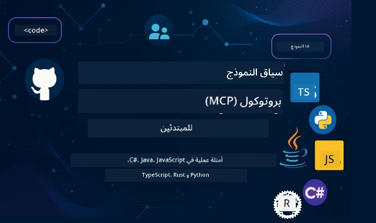

 

[](https://GitHub.com/microsoft/mcp-for-beginners/graphs/contributors)
[](https://GitHub.com/microsoft/mcp-for-beginners/issues)
[](https://GitHub.com/microsoft/mcp-for-beginners/pulls)
[](http://makeapullrequest.com)
[](https://mcptoplist.com/server/mcp.so%2Fmcp-for-beginners%2Fmicrosoft)

[](https://GitHub.com/microsoft/mcp-for-beginners/watchers)
[](https://GitHub.com/microsoft/mcp-for-beginners/fork)
[](https://GitHub.com/microsoft/mcp-for-beginners/stargazers)


[](https://discord.gg/nTYy5BXMWG)

اتبع هذه الخطوات للبدء في استخدام هذه الموارد:
1. **إنشاء نسخة من المستودع Fork**: انقر على [](https://GitHub.com/microsoft/mcp-for-beginners/fork)
2. **استنساخ المستودع Clone**:   `git clone https://github.com/microsoft/mcp-for-beginners.git`
3. **الانضمام إلى** [](https://discord.gg/nTYy5BXMWG)


### 🌐 دعم متعدد اللغات

#### مدعوم عبر GitHub Action (مؤتمت وعلى الدوام مُحدث)

<!-- CO-OP TRANSLATOR LANGUAGES TABLE START -->
[Arabic](./README.md) | [Bengali](../bn/README.md) | [Bulgarian](../bg/README.md) | [Burmese (Myanmar)](../my/README.md) | [Chinese (Simplified)](../zh-CN/README.md) | [Chinese (Traditional, Hong Kong)](../zh-HK/README.md) | [Chinese (Traditional, Macau)](../zh-MO/README.md) | [Chinese (Traditional, Taiwan)](../zh-TW/README.md) | [Croatian](../hr/README.md) | [Czech](../cs/README.md) | [Danish](../da/README.md) | [Dutch](../nl/README.md) | [Estonian](../et/README.md) | [Finnish](../fi/README.md) | [French](../fr/README.md) | [German](../de/README.md) | [Greek](../el/README.md) | [Hebrew](../he/README.md) | [Hindi](../hi/README.md) | [Hungarian](../hu/README.md) | [Indonesian](../id/README.md) | [Italian](../it/README.md) | [Japanese](../ja/README.md) | [Kannada](../kn/README.md) | [Khmer](../km/README.md) | [Korean](../ko/README.md) | [Lithuanian](../lt/README.md) | [Malay](../ms/README.md) | [Malayalam](../ml/README.md) | [Marathi](../mr/README.md) | [Nepali](../ne/README.md) | [Nigerian Pidgin](../pcm/README.md) | [Norwegian](../no/README.md) | [Persian (Farsi)](../fa/README.md) | [Polish](../pl/README.md) | [Portuguese (Brazil)](../pt-BR/README.md) | [Portuguese (Portugal)](../pt-PT/README.md) | [Punjabi (Gurmukhi)](../pa/README.md) | [Romanian](../ro/README.md) | [Russian](../ru/README.md) | [Serbian (Cyrillic)](../sr/README.md) | [Slovak](../sk/README.md) | [Slovenian](../sl/README.md) | [Spanish](../es/README.md) | [Swahili](../sw/README.md) | [Swedish](../sv/README.md) | [Tagalog (Filipino)](../tl/README.md) | [Tamil](../ta/README.md) | [Telugu](../te/README.md) | [Thai](../th/README.md) | [Turkish](../tr/README.md) | [Ukrainian](../uk/README.md) | [Urdu](../ur/README.md) | [Vietnamese](../vi/README.md)

> **تفضل الاستنساخ محلياً؟**
>
> يحتوي هذا المستودع على أكثر من 50 ترجمة للغات تزيد من حجم التنزيل بشكل كبير. لاستنساخ بدون الترجمات، استخدم السحب الانتقائي:
>
> **Bash / macOS / Linux:**
> ```bash
> git clone --filter=blob:none --sparse https://github.com/microsoft/mcp-for-beginners.git
> cd mcp-for-beginners
> git sparse-checkout set --no-cone '/*' '!translations' '!translated_images'
> ```
>
> **CMD (Windows):**
> ```cmd
> git clone --filter=blob:none --sparse https://github.com/microsoft/mcp-for-beginners.git
> cd mcp-for-beginners
> git sparse-checkout set --no-cone "/*" "!translations" "!translated_images"
> ```
>
> هذا يمنحك كل ما تحتاجه لإكمال الدورة بتنزيل أسرع بكثير.
<!-- CO-OP TRANSLATOR LANGUAGES TABLE END -->

# 🚀 منهج بروتوكول سياق النموذج (MCP) للمبتدئين

## **تعلم MCP من خلال أمثلة عملية بالرموز بلغة C#، Java، JavaScript، Rust، Python، و TypeScript**

## 🧠 نظرة عامة على منهج بروتوكول سياق النموذج
مرحبًا بك في رحلتك مع بروتوكول سياق النموذج! إذا تسائلت يومًا كيف تتواصل تطبيقات الذكاء الاصطناعي مع الأدوات والخدمات المختلفة، فأنت على وشك اكتشاف الحل الأنيق الذي يغير كيفية بناء المطورين للأنظمة الذكية.

فكر في MCP كمترجم عالمي لتطبيقات الذكاء الاصطناعي - تمامًا كما تسمح منافذ USB لك بتوصيل أي جهاز إلى حاسوبك، يسمح MCP لنماذج الذكاء الاصطناعي بالاتصال بأي أداة أو خدمة بطريقة موحدة. سواء كنت تبني أول روبوت دردشة لك أو تعمل على تدفقات عمل ذكاء اصطناعي معقدة، فإن فهم MCP يمنحك القدرة على إنشاء تطبيقات أكثر قدرة ومرونة.

لقد صُمم هذا المنهج بصبر وعناية لرحلة تعلمك. سنبدأ بمفاهيم بسيطة تفهمها بالفعل ونبني خبرتك تدريجيًا من خلال ممارسة عملية بلغة البرمجة المفضلة لديك. كل خطوة تتضمن شروحات واضحة، وأمثلة عملية، وتشجيعًا مستمرًا.

بحلول الوقت الذي تكمل فيه هذه الرحلة، ستكون واثقًا من بناء خوادم MCP الخاصة بك، ودمجها مع منصات الذكاء الاصطناعي الشعبية، وفهم كيفية إعادة تشكيل هذه التكنولوجيا لمستقبل تطوير الذكاء الاصطناعي. لنبدأ هذه المغامرة المثيرة معًا!

### الوثائق والمواصفات الرسمية

هذا المنهج متوافق مع **مواصفة MCP بتاريخ 2025-11-25** (أحدث إصدار مستقر). تستخدم مواصفة MCP ترقيمًا يعتمد على التواريخ (بتنسيق YYYY-MM-DD) لضمان تتبع واضح لإصدارات البروتوكول.

> **نظرة مستقبلية:** من المقرر إصدار نسخة مرشحة للإصدار التالي من المواصفة، **2026-07-28**، في 28 يوليو 2026. ستجعل البروتوكول بدون حالة على طبقة النقل، وتؤسس إطار عمل للامتدادات (تطبيقات MCP، المهام)، وتقوي التفويض، وتوقف استخدام الجذور، والتمثيل النمطي، والتسجيل. اطلع على [التغييرات في MCP: النسخة المرشحة يوم 2026-07-28](./01-CoreConcepts/mcp-2026-07-28-release-candidate.md) للحصول على تفاصيل كاملة.

تصبح هذه الموارد أكثر قيمة مع نمو فهمك، لكن لا تشعر بالضغط لقراءة كل شيء على الفور. ابدأ بالمجالات التي تهمك أكثر!
- 📘 [توثيق MCP](https://modelcontextprotocol.io/) – هذا هو موردك الأساسي للدروس والإرشادات خطوة بخطوة. الوثائق مكتوبة للمبتدئين، وتقدم أمثلة واضحة يمكنك متابعتها بوتيرتك الخاصة.
- 📜 [مواصفة MCP](https://modelcontextprotocol.io/specification/2025-11-25) – اعتبرها دليل المرجع الشامل الخاص بك. أثناء تقدمك في المنهج، ستعود إليها للبحث عن تفاصيل معينة واستكشاف ميزات متقدمة.
- 📜 [تتبع إصدارات مواصفة MCP](https://modelcontextprotocol.io/specification/versioning) – تحتوي على معلومات عن تاريخ إصدارات البروتوكول وكيف يستخدم MCP ترقيمًا معتمدًا على التاريخ (بتنسيق YYYY-MM-DD).
- 🧑‍💻 [مستودع MCP على GitHub](https://github.com/modelcontextprotocol) – هنا ستجد مجموعات تطوير البرامج، الأدوات، وأمثلة الكود بعدة لغات برمجة. إنه مثل كنز من الأمثلة العملية والمكونات الجاهزة للاستخدام.
- 🌐 [مجتمع MCP](https://github.com/orgs/modelcontextprotocol/discussions) – انضم إلى متعلمين ومطورين ذوي خبرة في نقاشات حول MCP. إنه مجتمع داعم حيث الأسئلة مرحب بها والمعرفة تُشارك بحرية.
  
## أهداف التعلم

بنهاية هذا المنهج، ستشعر بالثقة والحماس تجاه مهاراتك الجديدة. إليك ما ستحققه:

• **فهم أساسيات MCP**: ستفهم ما هو بروتوكول سياق النموذج ولماذا يغير كيفية تفاعل تطبيقات الذكاء الاصطناعي مع بعضها، باستخدام تشبيهات وأمثلة تسهل الفهم.

• **بناء خادم MCP الأول لك**: ستنشئ خادم MCP عامِل بلغة البرمجة التي تختارها، بدءًا من أمثلة بسيطة وتنمو مهاراتك خطوة بخطوة.

• **ربط نماذج الذكاء الاصطناعي بأدوات حقيقية**: ستتعلم كيفية سد الفجوة بين نماذج الذكاء الاصطناعي والخدمات الفعلية، مما يمنح تطبيقاتك قدرات جديدة قوية.

• **تطبيق أفضل ممارسات الأمان**: ستفهم كيفية الحفاظ على أمان تطبيقات MCP الخاصة بك، وحماية كل من تطبيقاتك ومستخدميك.

• **النشر بثقة**: ستعرف كيفية نقل مشاريع MCP من التطوير إلى الإنتاج، مع استراتيجيات نشر عملية تعمل في العالم الحقيقي.

• **الانضمام إلى مجتمع MCP**: ستصبح جزءًا من مجتمع متنامٍ من المطورين الذين يشكلون مستقبل تطوير تطبيقات الذكاء الاصطناعي.

## الخلفية الأساسية الضرورية

قبل أن نغوص في تفاصيل MCP، دعنا نتأكد من شعورك بالراحة مع بعض المفاهيم الأساسية. لا تقلق إذا لم تكن خبيرًا في هذه المجالات - سنشرح كل ما تحتاج معرفته أثناء تقدمنا!

### فهم البروتوكولات (الأساس)

فكر في البروتوكول مثل قواعد المحادثة. عندما تتصل بصديق، كلاكما يعرف أن تقول "مرحبًا" عند الرد، وتتناوب على الكلام، وتقول "وداعًا" عند الانتهاء. برامج الحاسوب تحتاج إلى قواعد مماثلة للتواصل بشكل فعال.

MCP هو بروتوكول - مجموعة من القواعد المتفق عليها التي تساعد نماذج الذكاء الاصطناعي والتطبيقات على إجراء "محادثات" مثمرة مع الأدوات والخدمات. تمامًا كما تجعل قواعد المحادثة تواصل البشر أكثر سلاسة، يجعل MCP تواصل تطبيقات الذكاء الاصطناعي أكثر موثوقية وقوة.

### علاقات العميل-الخادم (كيف تعمل البرامج معًا)

أنت تستخدم علاقات العميل-الخادم يوميًا! عندما تستخدم متصفح ويب (العميل) لزيارة موقع، أنت تتصل بخادم ويب يرسل لك محتوى الصفحة. المتصفح يعرف كيف يطلب المعلومات، والخادم يعرف كيف يرد.

في MCP، لدينا علاقة مشابهة: نماذج الذكاء الاصطناعي تعمل كعملاء يطلبون المعلومات أو الإجراءات، في حين توفر خوادم MCP هذه القدرات. كأن لديك مساعدًا مفيدًا (الخادم) يمكن للذكاء الاصطناعي طلب القيام بمهام محددة منه.

### لماذا التوحيد القياسي مهم (جعل الأشياء تعمل معًا)

تخيل لو أن كل مصنع سيارات يستخدم مضخات وقود بأشكال مختلفة - ستحتاج إلى محول مختلف لكل سيارة! التوحيد القياسي يعني الاتفاق على طرق مشتركة لجعل الأشياء تعمل معًا بسلاسة.

يوفر MCP هذا التوحيد القياسي لتطبيقات الذكاء الاصطناعي. بدلاً من أن يحتاج كل نموذج ذكاء اصطناعي إلى رمز مخصص للعمل مع كل أداة، يخلق MCP طريقة عالمية لتواصلها. هذا يعني أن المطورين يمكنهم بناء الأدوات مرة واحدة وجعلها تعمل مع أنظمة ذكاء اصطناعي متعددة.

## 🧭 نظرة عامة على مسار تعلمك

تم تنظيم رحلتك مع MCP بعناية لبناء ثقتك ومهاراتك تدريجيًا. كل مرحلة تقدم مفاهيم جديدة مع تعزيز ما تعلمته سابقًا.

### 🌱 مرحلة الأساس: فهم الأساسيات (الوحدات 0-2)

هنا تبدأ مغامرتك! سنقدم لك مفاهيم MCP باستخدام تشبيهات مألوفة وأمثلة بسيطة. ستفهم ما هو MCP، ولماذا وُجد، وكيف يتناسب مع عالم تطوير الذكاء الاصطناعي الأوسع.


• **الوحدة 0 - مقدمة في MCP**: سنبدأ باستكشاف ما هو MCP ولماذا هو مهم جدًا لتطبيقات الذكاء الاصطناعي الحديثة. سترى أمثلة واقعية لـ MCP أثناء العمل وستفهم كيف يحل المشكلات الشائعة التي يواجهها المطورون.

• **الوحدة 1 - شرح المفاهيم الأساسية**: هنا ستتعلم اللبنات الأساسية الضرورية لـ MCP. سنستخدم العديد من التشبيهات والأمثلة البصرية لضمان أن تبدو هذه المفاهيم طبيعية ومفهومة.

• **الوحدة 2 - الأمن في MCP**: قد يبدو الأمن مخيفًا، لكننا سنوضح لك كيف يتضمن MCP ميزات أمان مدمجة ونعلمك أفضل الممارسات التي تحمي تطبيقاتك من البداية.

### 🔨 مرحلة البناء: إنشاء أولى تطبيقاتك (الوحدة 3)

الآن يبدأ المرح الحقيقي! ستحصل على تجربة عملية في بناء خوادم وعملاء MCP فعليين. لا تقلق - سنبدأ ببساطة ونرشدك خلال كل خطوة.

تتضمن هذه الوحدة عدة أدلة عملية تتيح لك الممارسة بلغة البرمجة التي تفضلها. ستنشئ خادمك الأول، تبني عميلًا للاتصال به، وحتى تدمج مع أدوات تطوير شهيرة مثل VS Code.

يحتوي كل دليل على أمثلة كاملة للكود، ونصائح لحل المشاكل، وشرح للأسباب التي تجعلنا نتخذ اختيارات تصميم معينة. بحلول نهاية هذه المرحلة، سيكون لديك تطبيقات MCP تعمل يمكنك أن تفخر بها!

### 🚀 مرحلة النمو: المفاهيم المتقدمة والتطبيقات الواقعية (الوحدات 4-5)

بعد إتقان الأساسيات، أنت جاهز لاستكشاف ميزات MCP الأكثر تطورًا. سنغطي استراتيجيات التنفيذ العملية، وتقنيات تصحيح الأخطاء، وموضوعات متقدمة مثل دمج الذكاء الاصطناعي متعدد الوسائط.

ستتعلم أيضًا كيفية توسيع تطبيقات MCP للاستخدام الإنتاجي ودمجها مع منصات السحابة مثل Azure. تعدك هذه الوحدات لبناء حلول MCP قادرة على التعامل مع متطلبات العالم الحقيقي.

### 🌟 مرحلة الإتقان: المجتمع والتخصص (الوحدات 6-11)

تركز المرحلة النهائية على الانضمام إلى مجتمع MCP والتخصص في المجالات التي تهمك أكثر. ستتعلم كيفية المساهمة في مشاريع MCP مفتوحة المصدر، وتنفيذ أنماط المصادقة المتقدمة، وبناء حلول متكاملة مع قواعد البيانات.

تستحق الوحدة 11 ذكرًا خاصًا - فهي مسار تعليمي عملي مكوّن من 13 مختبرًا يعلمك بناء خوادم MCP جاهزة للإنتاج مع دمج PostgreSQL. إنها مثل مشروع تخرج يجمع كل ما تعلمته!

### 📚 هيكل المنهج الكامل

| الوحدة | الموضوع | الوصف | الرابط |
|--------|-------|-------------|------|
| **الوحدات 0-3: الأساسيات** | | | |
| 00 | مقدمة في MCP | نظرة عامة على بروتوكول سياق النموذج وأهميته في خطوط أنابيب الذكاء الاصطناعي | [اقرأ المزيد](./00-Introduction/README.md) |
| 01 | شرح المفاهيم الأساسية | استكشاف معمق لمفاهيم MCP الأساسية | [اقرأ المزيد](./01-CoreConcepts/README.md) |
| 1.1 | ما الذي يتغير في MCP (نسخة 2026-07-28 RC) | بروتوكول عديم الحالة، إطار الإضافات، وإيقاف الميزات القادمة في نسخة المواصفة التالية | [الدليل](./01-CoreConcepts/mcp-2026-07-28-release-candidate.md) |
| 02 | الأمن في MCP | التهديدات الأمنية وأفضل الممارسات | [اقرأ المزيد](./02-Security/README.md) |
| 03 | بدء العمل مع MCP | إعداد البيئة، الخوادم/العملاء الأساسيين، الدمج | [اقرأ المزيد](./03-GettingStarted/README.md) |
| **الوحدة 3: بناء خادمك وعميلك الأول** | | | |
| 3.1 | الخادم الأول | أنشئ خادم MCP الأول لك | [الدليل](./03-GettingStarted/01-first-server/README.md) |
| 3.2 | العميل الأول | تطوير عميل MCP بسيط | [الدليل](./03-GettingStarted/02-client/README.md) |
| 3.3 | عميل مع LLM | دمج نماذج اللغة الكبيرة | [الدليل](./03-GettingStarted/03-llm-client/README.md) |
| 3.4 | دمج VS Code | استخدام خوادم MCP في VS Code | [الدليل](./03-GettingStarted/04-vscode/README.md) |
| 3.5 | خادم stdio | إنشاء خوادم باستخدام ناقل stdio | [الدليل](./03-GettingStarted/05-stdio-server/README.md) |
| 3.6 | البث عبر HTTP | تنفيذ البث عبر HTTP في MCP | [الدليل](./03-GettingStarted/06-http-streaming/README.md) |
| 3.7 | مجموعة أدوات Microsoft Foundry | استخدام مجموعة أدوات Microsoft Foundry مع MCP | [الدليل](./03-GettingStarted/07-aitk/README.md) |
| 3.8 | الاختبار | اختبار تنفيذ خادم MCP الخاص بك | [الدليل](./03-GettingStarted/08-testing/README.md) |
| 3.9 | النشر | نشر خوادم MCP للإنتاج | [الدليل](./03-GettingStarted/09-deployment/README.md) |
| 3.10 | استخدام الخادم المتقدم | استخدام خوادم متقدمة للميزات المتقدمة وتحسين البنية | [الدليل](./03-GettingStarted/10-advanced/README.md) |
| 3.11 | المصادقة البسيطة | فصل يوضح المصادقة من البداية و RBAC | [الدليل](./03-GettingStarted/11-simple-auth/README.md) |
| 3.12 | مضيفو MCP | تكوين Claude Desktop، Cursor، Cline، ومضيفين MCP آخرين | [الدليل](./03-GettingStarted/12-mcp-hosts/README.md) |
| 3.13 | مفتش MCP | تصحيح واختبار خوادم MCP باستخدام أداة المفتش | [الدليل](./03-GettingStarted/13-mcp-inspector/README.md) |
| 3.14 | أخذ العينات | استخدام أخذ العينات للتعاون مع العميل | [الدليل](./03-GettingStarted/14-sampling/README.md) |
| 3.15 | تطبيقات MCP | بناء تطبيقات MCP | [الدليل](./03-GettingStarted/15-mcp-apps/README.md) |
| **الوحدات 4-5: عملي ومتقدم** | | | |
| 04 | التنفيذ العملي | SDKs، تصحيح الأخطاء، الاختبار، قوالب التعليمات البرمجية القابلة لإعادة الاستخدام | [اقرأ المزيد](./04-PracticalImplementation/README.md) |
| 4.1 | الترحيل | التعامل مع مجموعات نتائج كبيرة باستخدام ترحيل مؤشرات الأسهم | [الدليل](./04-PracticalImplementation/pagination/README.md) |
| 05 | موضوعات متقدمة في MCP | الذكاء الاصطناعي متعدد الوسائط، التوسع، استخدام الشركات | [اقرأ المزيد](./05-AdvancedTopics/README.md) |
| 5.1 | دمج Azure | دمج MCP مع Azure | [الدليل](./05-AdvancedTopics/mcp-integration/README.md) |
| 5.2 | التعددية | العمل مع وسائط متعددة | [الدليل](./05-AdvancedTopics/mcp-multi-modality/README.md) |
| 5.3 | عرض OAuth2 | تنفيذ مصادقة OAuth2 | [الدليل](./05-AdvancedTopics/mcp-oauth2-demo/README.md) |
| 5.4 | سياقات الجذر | فهم وتنفيذ سياقات الجذر | [الدليل](./05-AdvancedTopics/mcp-root-contexts/README.md) |
| 5.5 | التوجيه | استراتيجيات توجيه MCP | [الدليل](./05-AdvancedTopics/mcp-routing/README.md) |
| 5.6 | أخذ العينات | تقنيات أخذ العينات في MCP | [الدليل](./05-AdvancedTopics/mcp-sampling/README.md) |
| 5.7 | التوسيع | توسيع تطبيقات MCP | [الدليل](./05-AdvancedTopics/mcp-scaling/README.md) |
| 5.8 | الأمان | اعتبارات الأمان المتقدمة | [الدليل](./05-AdvancedTopics/mcp-security/README.md) |
| 5.9 | بحث الويب | تنفيذ قدرات بحث الويب | [الدليل](./05-AdvancedTopics/web-search-mcp/README.md) |
| 5.10 | البث في الوقت الحقيقي | بناء وظيفة البث في الوقت الحقيقي | [الدليل](./05-AdvancedTopics/mcp-realtimestreaming/README.md) |
| 5.11 | البحث في الوقت الحقيقي | تنفيذ البحث في الوقت الحقيقي | [الدليل](./05-AdvancedTopics/mcp-realtimesearch/README.md) |
| 5.12 | مصادقة Entra ID | المصادقة مع Microsoft Entra ID | [الدليل](./05-AdvancedTopics/mcp-security-entra/README.md) |
| 5.13 | دمج Foundry | دمج مع Microsoft Foundry | [الدليل](./05-AdvancedTopics/mcp-foundry-agent-integration/README.md) |
| 5.14 | هندسة السياق | تقنيات لهندسة سياق فعالة | [الدليل](./05-AdvancedTopics/mcp-contextengineering/README.md) |
| 5.15 | ناقل MCP مخصص | تنفيذات ناقل مخصصة | [الدليل](./05-AdvancedTopics/mcp-transport/README.md) |
| 5.16 | ميزات البروتوكول | إشعارات التقدم، الإلغاء، قوالب الموارد | [الدليل](./05-AdvancedTopics/mcp-protocol-features/README.md) |
| 5.17 | التفكير التخاصمي متعدد الوكلاء | وكلاء اثنان يجادلان الجوانب المعاكسة باستخدام أدوات MCP المشتركة، يتم تقييمهم بواسطة وكيل حكم | [الدليل](./05-AdvancedTopics/mcp-adversarial-agents/README.md) |
| **الوحدات 6-10: المجتمع وأفضل الممارسات** | | | |
| 06 | مساهمات المجتمع | كيف تساهم في نظام MCP البيئي | [الدليل](./06-CommunityContributions/README.md) |
| 07 | رؤى من التبني المبكر | قصص التنفيذ في العالم الواقعي | [الدليل](./07-LessonsfromEarlyAdoption/README.md) |
| 08 | أفضل الممارسات لـ MCP | الأداء، مقاومة الأخطاء، المرونة | [الدليل](./08-BestPractices/README.md) |
| 09 | دراسات حالة MCP | أمثلة على التنفيذ العملي | [الدليل](./09-CaseStudy/README.md) |
| 10 | ورشة عمل عملية | بناء خادم MCP باستخدام Microsoft Foundry Toolkit | [مختبر](./10-StreamliningAIWorkflowsBuildingAnMCPServerWithAIToolkit/README.md) |
| **الوحدة 11: مختبر عملي لخادم MCP** | | | |
| 11 | دمج قاعدة بيانات خادم MCP | مسار تعليمي عملي مكون من 13 مختبرًا لدمج PostgreSQL | [المختبرات](./11-MCPServerHandsOnLabs/README.md) |
| 11.1 | مقدمة | نظرة عامة على MCP مع دمج قاعدة البيانات وحالة استخدام تحليلات التجزئة | [مختبر 00](./11-MCPServerHandsOnLabs/00-Introduction/README.md) |
| 11.2 | العمارة الأساسية | فهم معمارية خادم MCP، طبقات قاعدة البيانات، وأنماط الأمان | [مختبر 01](./11-MCPServerHandsOnLabs/01-Architecture/README.md) |
| 11.3 | الأمان وتعدد المستأجرين | أمان مستوى الصف، المصادقة، والوصول متعدد المستأجرين | [مختبر 02](./11-MCPServerHandsOnLabs/02-Security/README.md) |
| 11.4 | إعداد البيئة | إعداد بيئة التطوير، Docker، موارد Azure | [مختبر 03](./11-MCPServerHandsOnLabs/03-Setup/README.md) |
| 11.5 | تصميم قاعدة البيانات | إعداد PostgreSQL، تصميم مخطط التجزئة، وبيانات نموذجية | [مختبر 04](./11-MCPServerHandsOnLabs/04-Database/README.md) |
| 11.6 | تنفيذ خادم MCP | بناء خادم FastMCP مع دمج قاعدة البيانات | [مختبر 05](./11-MCPServerHandsOnLabs/05-MCP-Server/README.md) |
| 11.7 | تطوير الأدوات | إنشاء أدوات استعلام قاعدة البيانات وفحص المخطط | [مختبر 06](./11-MCPServerHandsOnLabs/06-Tools/README.md) |
| 11.8 | البحث الدلالي | تنفيذ تضمينات المتجهات مع Azure OpenAI و pgvector | [مختبر 07](./11-MCPServerHandsOnLabs/07-Semantic-Search/README.md) |
| 11.9 | الاختبار وتصحيح الأخطاء | استراتيجيات الاختبار، أدوات تصحيح الأخطاء، ونهج التحقق | [مختبر 08](./11-MCPServerHandsOnLabs/08-Testing/README.md) |
| 11.10 | دمج VS Code | تكوين دمج MCP في VS Code واستخدام AI Chat | [مختبر 09](./11-MCPServerHandsOnLabs/09-VS-Code/README.md) |
| 11.11 | استراتيجيات النشر | نشر Docker، تطبيقات الحاويات Azure، واعتبارات التوسع | [مختبر 10](./11-MCPServerHandsOnLabs/10-Deployment/README.md) |
| 11.12 | المراقبة | Application Insights، التسجيل، مراقبة الأداء | [مختبر 11](./11-MCPServerHandsOnLabs/11-Monitoring/README.md) |
| 11.13 | أفضل الممارسات | تحسين الأداء، تقوية الأمان، ونصائح الإنتاج | [مختبر 12](./11-MCPServerHandsOnLabs/12-Best-Practices/README.md) |
| **الوحدة 12: أدوات MCP** | | | |
| 12.1 | الأدوات | استخدام MCP في تطبيق Copilot | [ الدليل ](./12-tooling/README.md) |

### 💻 مشاريع كود نموذجية

واحدة من أكثر الأجزاء إثارة في تعلم MCP هي رؤية مهاراتك في البرمجة تتطور تدريجيًا. لقد صممنا أمثلةنا البرمجية لتبدأ ببساطة وتنمو لتصبح أكثر تعقيدًا كلما تعمقت في الفهم. هكذا نقدم المفاهيم - مع كود سهل الفهم ولكنه يوضح مبادئ MCP الحقيقية، ستفهم ليس فقط ما يفعله هذا الكود، بل لماذا هو مصنوع بهذه الطريقة وكيف يتناسب مع تطبيقات MCP الأكبر.

#### عينات حاسبة MCP الأساسية

| اللغة | الوصف | الرابط |
|----------|-------------|------|

| C# | مثال لخادم MCP | [عرض الكود](./03-GettingStarted/samples/csharp/README.md) |
| Java | آلة حاسبة MCP | [عرض الكود](./03-GettingStarted/samples/java/calculator/README.md) |
| JavaScript | عرض MCP | [عرض الكود](./03-GettingStarted/samples/javascript/README.md) |
| Python | خادم MCP | [عرض الكود](../../03-GettingStarted/samples/python/mcp_calculator_server.py) |
| TypeScript | مثال MCP | [عرض الكود](./03-GettingStarted/samples/typescript/README.md) |
| Rust | مثال MCP | [عرض الكود](./03-GettingStarted/samples/rust/README.md) |

#### تطبيقات MCP المتقدمة

| اللغة | الوصف | الرابط |
|----------|-------------|------|
| C# | مثال متقدم | [عرض الكود](./04-PracticalImplementation/samples/csharp/README.md) |
| Java مع Spring | مثال تطبيق الحاوية | [عرض الكود](./04-PracticalImplementation/samples/java/containerapp/README.md) |
| JavaScript | مثال متقدم | [عرض الكود](./04-PracticalImplementation/samples/javascript/README.md) |
| Python | تنفيذ معقد | [عرض الكود](./04-PracticalImplementation/samples/python/README.md) |
| TypeScript | مثال الحاوية | [عرض الكود](./04-PracticalImplementation/samples/typescript/README.md) |


## 🎯 المتطلبات المسبقة لتعلم MCP

للحصول على أقصى استفادة من هذا المنهج، يجب أن يكون لديك:

- معرفة أساسية في البرمجة على الأقل بإحدى اللغات التالية: C#، Java، JavaScript، Python، أو TypeScript
- فهم نموذج العميل-الخادم وواجهات برمجة التطبيقات (APIs)
- إلمام بمفاهيم REST وHTTP
- (اختياري) خلفية في مفاهيم الذكاء الاصطناعي/تعلم الآلة

- المشاركة في مناقشات مجتمعنا للحصول على الدعم

## 📚 دليل الدراسة والموارد

يتضمن هذا المستودع عدة موارد لمساعدتك في التنقل والتعلم بفعالية:

### دليل الدراسة

يوجد [دليل دراسة شامل](./study_guide.md) لمساعدتك على التنقل في هذا المستودع بفعالية. يوضح هذا الخريطة التعليمية البصرية كيفية ترابط جميع المواضيع ويقدم إرشادات لكيفية استخدام المشاريع النموذجية بفعالية. وهو مفيد بشكل خاص إذا كنت متعلمًا بصريًا يحب رؤية الصورة الكبيرة.

يشمل الدليل:
- خريطة منهجية بصرية تظهر كل المواضيع المشمولة
- تفصيل دقيق لكل قسم من أقسام المستودع
- إرشادات حول كيفية استخدام مشاريع العينة
- مسارات تعلم موصى بها لمستويات مهارة مختلفة
- موارد إضافية لاستكمال رحلة تعلمك

### سجل التغييرات

نحن نحافظ على [سجل تغييرات](./changelog.md) مفصل يتتبع كل التحديثات الهامة لمواد المنهج، حتى تتمكن من متابعة أحدث التحسينات والإضافات.
- إضافات محتوى جديدة
- تغييرات هيكلية
- تحسينات في الميزات
- تحديثات الوثائق

## 🛠️ كيفية استخدام هذا المنهج بفعالية

تتضمن كل درس في هذا الدليل:

1. شروحات واضحة لمفاهيم MCP  
2. أمثلة حية للرمز بلغات متعددة  
3. تمارين لبناء تطبيقات MCP حقيقية  
4. موارد إضافية للمتعلمين المتقدمين

### لنبدأ تعلم MCP باستخدام C# - سلسلة دروس
دعونا نتعرف على بروتوكول سياق النموذج (MCP)، وهو إطار عمل متقدم يهدف إلى توحيد التفاعلات بين نماذج الذكاء الاصطناعي وتطبيقات العميل. من خلال هذه الجلسة المناسبة للمبتدئين، سنقدم لك MCP ونرشدك خلال إنشاء أول خادم MCP خاص بك.
#### C#: [https://aka.ms/letslearnmcp-csharp](https://aka.ms/letslearnmcp-csharp)
#### Java: [https://aka.ms/letslearnmcp-java](https://aka.ms/letslearnmcp-java)
#### JavaScript: [https://aka.ms/letslearnmcp-javascript](https://aka.ms/letslearnmcp-javascript)
#### Python: [https://aka.ms/letslearnmcp-python](https://aka.ms/letslearnmcp-python)

## 🎓 بداية رحلتك مع MCP

تهانينا! لقد قطعت للتو الخطوة الأولى في رحلة مثيرة ستوسع قدراتك في البرمجة وتربطك بأحدث تقنيات تطوير الذكاء الاصطناعي.

### ما أنجزته بالفعل

من خلال قراءة هذا المقدمة، بدأت بالفعل في بناء أساس معرفتك بـ MCP. أنت تفهم ما هو MCP، ولماذا هو مهم، وكيف سيدعمك هذا المنهج في رحلتك التعليمية. هذا إنجاز كبير وبداية خبرتك في هذه التكنولوجيا المهمة.

### المغامرة القادمة

أثناء تقدمك في الوحدات، تذكر أن كل خبير كان يومًا ما مبتدئًا. ستكون المفاهيم التي قد تبدو معقدة الآن طبيعية مع الممارسة والتطبيق. كل خطوة صغيرة تبني نحو قدرات قوية ستخدمك طوال مسيرتك في التطوير.

### شبكة الدعم الخاصة بك

أنت تنضم إلى مجتمع من المتعلمين والخبراء المتحمسين لـ MCP والمتحمسين لمساعدة الآخرين على النجاح. سواء كنت تواجه تحديًا في البرمجة أو متحمسًا لمشاركة اكتشاف جديد، المجتمع هنا لدعم رحلتك.

إذا واجهت أي عقبات أو لديك أسئلة حول بناء تطبيقات الذكاء الاصطناعي، انضم إلى المتعلمين والمطورين ذوي الخبرة في مناقشات MCP. إنها بيئة داعمة حيث تُرحب الأسئلة ويُشارك المعرفة بحرية.

[](https://discord.gg/nTYy5BXMWG)

إذا كان لديك ملاحظات على المنتج أو أخطاء أثناء البناء، قم بزيارة:

[](https://aka.ms/foundry/forum)

### هل أنت مستعد للبدء؟

تبدأ مغامرتك مع MCP الآن! ابدأ مع الوحدة 0 لتغوص في أول تجارب MCP العملية، أو استعرض مشاريع العينة لترى ما ستبنيه. تذكر - كل خبير بدأ من حيث أنت الآن، ومع الصبر والممارسة، ستندهش مما يمكنك تحقيقه.

مرحبًا بك في عالم تطوير بروتوكول سياق النموذج. دعونا نبني شيئًا رائعًا معًا!

## 🤝 المساهمة في مجتمع التعلم

ينمو هذا المنهج بشكل أقوى بمساهمات من متعلمين مثلك! سواء كنت تصحح خطأ مطبعي، أو تقترح شرحًا أوضح، أو تضيف مثالًا جديدًا، فإن مساهماتك تساعد المبتدئين الآخرين على النجاح.

شكر خاص للمحترف الموقر لدى مايكروسوفت [Shivam Goyal](https://www.linkedin.com/in/shivam2003/) على مساهمته بأمثلة الرموز.

عملية المساهمة مصممة لتكون مرحبة وداعمة. معظم المساهمات تتطلب اتفاقية ترخيص مساهم (CLA)، لكن الأدوات الآلية سترشدك خلال العملية بسلاسة.

## 📜 التعلم مفتوح المصدر

هذا المنهج بأكمله متاح بموجب رخصة MIT [LICENSE](../../LICENSE)، مما يعني أنه يمكنك استخدامه وتعديله ومشاركته بحرية. هذا يدعم مهمتنا في جعل معرفة MCP متاحة للمطورين في كل مكان.
## 🤝 إرشادات المساهمة

يرحب هذا المشروع بالمساهمات والاقتراحات. معظم المساهمات تتطلب منك الموافقة على
اتفاقية ترخيص المساهمة (CLA) التي تعلن أنك تمتلك الحق، وأنك فعلاً تمنحنا
الحقوق لاستخدام مساهمتك. للمزيد، زر <https://cla.opensource.microsoft.com>.

عند تقديم طلب سحب، سيقوم روبوت CLA تلقائيًا بتحديد ما إذا كنت بحاجة إلى تقديم
اتفاقية CLA وتزيين طلب السحب بشكل مناسب (مثل: فحص الحالة، تعليق). اتبع ببساطة التعليمات
المقدمة من الروبوت. ستحتاج للقيام بذلك مرة واحدة فقط عبر جميع المستودعات التي تستخدم CLA الخاص بنا.

هذا المشروع اعتمد [مدونة قواعد السلوك مفتوحة المصدر من مايكروسوفت](https://opensource.microsoft.com/codeofconduct/).
للمزيد من المعلومات راجع [أسئلة متكررة حول مدونة قواعد السلوك](https://opensource.microsoft.com/codeofconduct/faq/) أو
اتصل بـ [opencode@microsoft.com](mailto:opencode@microsoft.com) لأي أسئلة أو تعليقات إضافية.

---

*هل أنت مستعد لبدء رحلتك مع MCP؟ ابدأ مع [الوحدة 00 - مقدمة إلى MCP](./00-Introduction/README.md) وخط خطواتك الأولى في عالم تطوير بروتوكول سياق النموذج!*


## 🎒 دورات أخرى
فريقنا يقدم دورات أخرى! تحقق من:

<!-- CO-OP TRANSLATOR OTHER COURSES START -->
### LangChain
[](https://aka.ms/langchain4j-for-beginners)
[](https://aka.ms/langchainjs-for-beginners?WT.mc_id=m365-94501-dwahlin)
[](https://github.com/microsoft/langchain-for-beginners?WT.mc_id=m365-94501-dwahlin)
---

### Azure / Edge / MCP / Agents
[](https://github.com/microsoft/AZD-for-beginners?WT.mc_id=academic-105485-koreyst)
[](https://github.com/microsoft/edgeai-for-beginners?WT.mc_id=academic-105485-koreyst)
[](https://github.com/microsoft/mcp-for-beginners?WT.mc_id=academic-105485-koreyst)
[](https://github.com/microsoft/ai-agents-for-beginners?WT.mc_id=academic-105485-koreyst)

---
 
### سلسلة الذكاء الاصطناعي التوليدي
[](https://github.com/microsoft/generative-ai-for-beginners?WT.mc_id=academic-105485-koreyst)
[-9333EA?style=for-the-badge&labelColor=E5E7EB&color=9333EA)](https://github.com/microsoft/Generative-AI-for-beginners-dotnet?WT.mc_id=academic-105485-koreyst)
[-C084FC?style=for-the-badge&labelColor=E5E7EB&color=C084FC)](https://github.com/microsoft/generative-ai-for-beginners-java?WT.mc_id=academic-105485-koreyst)
[-E879F9?style=for-the-badge&labelColor=E5E7EB&color=E879F9)](https://github.com/microsoft/generative-ai-with-javascript?WT.mc_id=academic-105485-koreyst)

---
 
### التعلم الأساسي
[](https://aka.ms/ml-beginners?WT.mc_id=academic-105485-koreyst)
[](https://aka.ms/datascience-beginners?WT.mc_id=academic-105485-koreyst)
[](https://aka.ms/ai-beginners?WT.mc_id=academic-105485-koreyst)

[](https://github.com/microsoft/Security-101?WT.mc_id=academic-96948-sayoung)
[](https://aka.ms/webdev-beginners?WT.mc_id=academic-105485-koreyst)
[](https://aka.ms/iot-beginners?WT.mc_id=academic-105485-koreyst)
[](https://github.com/microsoft/xr-development-for-beginners?WT.mc_id=academic-105485-koreyst)

---
 
### سلسلة الكوبيلوت
[](https://aka.ms/GitHubCopilotAI?WT.mc_id=academic-105485-koreyst)
[](https://github.com/microsoft/mastering-github-copilot-for-dotnet-csharp-developers?WT.mc_id=academic-105485-koreyst)
[](https://github.com/microsoft/CopilotAdventures?WT.mc_id=academic-105485-koreyst)
<!-- CO-OP TRANSLATOR OTHER COURSES END -->

---

<!-- CO-OP TRANSLATOR DISCLAIMER START -->
**تنويه**:
تمت ترجمة هذا المستند باستخدام خدمة الترجمة بالذكاء الاصطناعي [Co-op Translator](https://github.com/Azure/co-op-translator). بينما نسعى للدقة، يرجى العلم أن الترجمات الآلية قد تحتوي على أخطاء أو عدم دقة. يجب اعتبار المستند الأصلي بلغته الأصلية المصدر الرسمي والمعتمد. للمعلومات الهامة، يُنصح بالاستعانة بترجمة بشرية محترفة. نحن غير مسؤولين عن أي سوء فهم أو تفسير ناتج عن استخدام هذه الترجمة.
<!-- CO-OP TRANSLATOR DISCLAIMER END -->