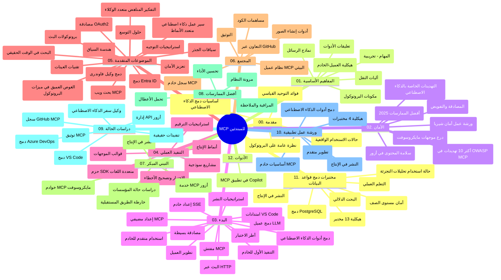

# بروتوكول نموذج السياق (MCP) للمبتدئين - دليل الدراسة

يقدم هذا الدليل الدراسي نظرة عامة على هيكل المستودع ومحتواه لمنهج "بروتوكول نموذج السياق (MCP) للمبتدئين". استخدم هذا الدليل للتنقل في المستودع بكفاءة والاستفادة القصوى من الموارد المتاحة.

## نظرة عامة على المستودع

بروتوكول نموذج السياق (MCP) هو إطار معياري للتفاعلات بين نماذج الذكاء الاصطناعي وتطبيقات العملاء. تم إنشاؤه في البداية بواسطة Anthropic، ويُدار MCP الآن بواسطة مجتمع MCP الأوسع من خلال المنظمة الرسمية على GitHub. يوفر هذا المستودع منهجًا شاملاً مع أمثلة تطبيقية شفرة عملية في C# وJava وJavaScript وPython وTypeScript، مصممًا لمطوري الذكاء الاصطناعي، ومهندسي الأنظمة، ومهندسي البرمجيات.

## خريطة المنهج المرئية

## هيكل المستودع

يُنظم المستودع في اثني عشر قسمًا رئيسيًا، يركز كل منها على جوانب مختلفة من MCP:

1. **المقدمة (00-Introduction/)**
   - نظرة عامة على بروتوكول نموذج السياق
   - لماذا تهم المعايير في سلاسل الذكاء الاصطناعي
   - حالات الاستخدام العملية والفوائد

2. **المفاهيم الأساسية (01-CoreConcepts/)**
   - بنية العميل-الخادم
   - المكونات الرئيسية للبروتوكول
   - أنماط المراسلة في MCP
   - نظرة مستقبلية: [ما الذي يتغير في MCP: إصدار المرشح 2026-07-28](./01-CoreConcepts/mcp-2026-07-28-release-candidate.md) — جوهر البروتوكول بدون حالة، إطار الإضافات، وإلغاء دعم الجذور/العينات/التسجيل المتوقع في النسخة القادمة من المواصفة

3. **الأمان (02-Security/)**
   - تهديدات الأمان في أنظمة تعتمد على MCP
   - أفضل الممارسات لتأمين التطبيقات
   - استراتيجيات المصادقة والتفويض
   - **توثيق أمان شامل**:
     - أفضل ممارسات أمان MCP 2025
     - دليل تنفيذ أمان محتوى Azure
     - ضوابط وتقنيات أمان MCP
     - مرجع سريع لأفضل ممارسات MCP
   - **مواضيع أمان رئيسية**:
     - هجمات حقن المطالبات وتسمم الأدوات
     - اختطاف الجلسة ومشكلات المسؤول المشتبه فيه
     - نقاط ضعف تمرير الرموز
     - الأذونات المفرطة والتحكم في الوصول
     - أمان سلسلة التوريد لمكونات الذكاء الاصطناعي
     - اندماج دروع المطالبات من Microsoft

4. **البداية (03-GettingStarted/)**
   - إعداد البيئة والتكوين
   - إنشاء خوادم وعمائل MCP الأساسية
   - التكامل مع التطبيقات الموجودة
   - يشمل أقسامًا لـ:
     - تنفيذ أول خادم
     - تطوير العميل
     - دمج عميل LLM
     - دمج VS Code
     - خادم أحداث مرسلة (SSE)
     - استخدام متقدم للخادم
     - البث عبر HTTP
     - دمج أدوات AI Toolkit
     - استراتيجيات الاختبار
     - إرشادات النشر

5. **التنفيذ العملي (04-PracticalImplementation/)**
   - استخدام SDKs عبر لغات برمجة مختلفة
   - تقنيات التصحيح، والاختبار، والتحقق
   - صياغة قوالب مطالبات قابلة لإعادة الاستخدام وسير العمل
   - مشاريع نموذجية مع أمثلة تطبيقية

6. **المواضيع المتقدمة (05-AdvancedTopics/)**
   - تقنيات هندسة السياق
   - دمج وكيل Foundry
   - سير عمل الذكاء الاصطناعي متعدد الوسائط
   - عروض المصادقة OAuth2
   - إمكانيات البحث في الوقت الحقيقي
   - البث في الوقت الحقيقي
   - تنفيذ سياقات الجذر
   - استراتيجيات التوجيه
   - تقنيات العينة
   - أساليب التوسع
   - اعتبارات الأمان
   - دمج أمان Entra ID
   - دمج البحث على الويب
   - المنطق العدائي متعدد الوكلاء (أنماط المناظرة)

7. **مساهمات المجتمع (06-CommunityContributions/)**
   - كيفية المساهمة بالشفرة والتوثيق
   - التعاون عبر GitHub
   - تحسينات المجتمع وردود الفعل
   - استخدام عملاء MCP المتنوعين (Claude Desktop, Cline, VSCode)
   - العمل مع خوادم MCP الشهيرة بما في ذلك توليد الصور

8. **دروس من الاعتماد المبكر (07-LessonsfromEarlyAdoption/)**
   - تطبيقات العالم الحقيقي وقصص النجاح
   - بناء ونشر حلول تعتمد على MCP
   - الاتجاهات وخارطة الطريق المستقبلية
   - **دليل خوادم MCP من Microsoft**: دليل شامل لـ 10 خوادم MCP جاهزة للإنتاج من Microsoft تشمل:
     - خادم Microsoft Learn Docs MCP
     - خادم Azure MCP (أكثر من 15 موصلًا متخصصًا)
     - خادم GitHub MCP
     - خادم Azure DevOps MCP
     - خادم MarkItDown MCP
     - خادم SQL Server MCP
     - خادم Playwright MCP
     - خادم Dev Box MCP
     - خادم Microsoft Foundry MCP
     - خادم مجموعة أدوات وكلاء Microsoft 365 MCP

9. **أفضل الممارسات (08-BestPractices/)**
   - ضبط الأداء والتحسين
   - تصميم أنظمة MCP متسامحة مع الأخطاء
   - استراتيجيات الاختبار والمرونة

10. **دراسات الحالة (09-CaseStudy/)**
    - **سبع دراسات حالة شاملة** توضح تعددية MCP عبر سيناريوهات متنوعة:
    - **وكلاء السفر عبر Azure AI**: تنظيم متعدد الوكلاء مع Azure OpenAI و AI Search
    - **تكامل Azure DevOps**: أتمتة عمليات سير العمل باعتماد بيانات YouTube
    - **استرجاع الوثائق في الوقت الحقيقي**: عميل وحدة تحكم بايثون مع بث HTTP
    - **مولد خطة دراسية تفاعلية**: تطبيق ويب Chainlit مع ذكاء اصطناعي محادثي
    - **توثيق داخل المحرر**: دمج VS Code مع سير عمل GitHub Copilot
    - **إدارة API عبر Azure**: دمج API مؤسسي مع إنشاء خادم MCP
    - **سجل MCP على GitHub**: تطوير النظام البيئي ومنصة التكامل الوكيلية
    - أمثلة تنفيذ تشمل تكامل المؤسسات، إنتاجية المطور، وتطوير النظام البيئي

11. **ورشة العمل العملية (10-StreamliningAIWorkflowsBuildingAnMCPServerWithAIToolkit/)**
    - ورشة عمل شاملة تجمع MCP مع AI Toolkit
    - بناء تطبيقات ذكية تربط نماذج الذكاء الاصطناعي بالأدوات الواقعية
    - وحدات عملية تغطي الأساسيات، تطوير الخادم المخصص، واستراتيجيات النشر
    - **هيكل المختبر**:
      - المختبر 1: أساسيات خادم MCP
      - المختبر 2: تطوير متقدم لخادم MCP
      - المختبر 3: دمج AI Toolkit
      - المختبر 4: نشر الإنتاج والتوسع
    - نهج التعلم القائم على المختبرات مع تعليمات خطوة بخطوة

12. **مختبرات دمج قواعد بيانات خادم MCP (11-MCPServerHandsOnLabs/)**
    - **مسار تعلم شامل يحتوي على 13 مختبر** لبناء خوادم MCP جاهزة للإنتاج مع تكامل PostgreSQL
    - **تنفيذ تحليلات البيع بالتجزئة في العالم الحقيقي** باستخدام حالة استخدام Zava Retail
    - **أنماط المؤسسة** تشمل أمان مستوى الصف (RLS) والبحث الدلالي والوصول متعدد المستأجرين للبيانات
    - **هيكل المختبر الكامل**:
      - **المختبرات 00-03: الأساسيات** - المقدمة، الهندسة، الأمان، إعداد البيئة
      - **المختبرات 04-06: بناء خادم MCP** - تصميم قواعد البيانات، تنفيذ الخادم، تطوير الأدوات
      - **المختبرات 07-09: الميزات المتقدمة** - البحث الدلالي، الاختبار والتصحيح، دمج VS Code
      - **المختبرات 10-12: الإنتاج وأفضل الممارسات** - النشر، المراقبة، التحسين
    - **التقنيات المغطاة**: إطار FastMCP، PostgreSQL، Azure OpenAI، تطبيقات Azure Container، Application Insights
    - **نتائج التعلم**: خوادم MCP جاهزة للإنتاج، أنماط تكامل قاعدة البيانات، تحليلات مدعومة بالذكاء الاصطناعي، أمان مؤسسة

13. **الأدوات (12-tooling/)**
    - تعلّم كيفية استخدام MCP في تطبيق Copilot والأدوات الأخرى

## موارد إضافية

يحتوي المستودع على موارد داعمة:

- **مجلد الصور**: يحتوي على مخططات ورسوم توضيحية مستخدمة طوال المنهج
- **الترجمات**: دعم متعدد اللغات مع ترجمات أوتوماتيكية للتوثيق
- **الموارد الرسمية لـ MCP**:
  - [توثيق MCP](https://modelcontextprotocol.io/)
  - [مواصفة MCP](https://spec.modelcontextprotocol.io/)
  - [مستودع MCP على GitHub](https://github.com/modelcontextprotocol)

## كيف تستخدم هذا المستودع

1. **التعلم المتسلسل**: اتبع الفصول بالترتيب (من 00 حتى 11) لتجربة تعلم منظمة.
2. **التركيز على لغة معينة**: إذا كنت مهتمًا بلغة برمجة محددة، استكشف أدلة العينات لتنفيذات بلغتك المختارة.
3. **التنفيذ العملي**: ابدأ بقسم "البداية" لإعداد بيئتك وإنشاء أول خادم وعميل MCP.
4. **الاستكشاف المتقدم**: بمجرد أن تتقن الأساسيات، اغمر نفسك في المواضيع المتقدمة لتوسيع معرفتك.
5. **المشاركة المجتمعية**: انضم إلى مجتمع MCP عبر مناقشات GitHub وقنوات Discord للتواصل مع الخبراء والمطورين الآخرين.

## عملاء وأدوات MCP

يغطي المنهج عملاء وأدوات MCP المتنوعة:

1. **العملاء الرسميون**:
   - Visual Studio Code
   - MCP في Visual Studio Code
   - Claude Desktop
   - Claude في VSCode
   - Claude API

2. **عملاء المجتمع**:
   - Cline (مبني على الطرفية)
   - Cursor (محرر الشيفرة)
   - ChatMCP
   - Windsurf

3. **أدوات إدارة MCP**:
   - MCP CLI
   - MCP Manager
   - MCP Linker
   - MCP Router

## خوادم MCP الشهيرة

يقدم المستودع خوادم متعددة لـ MCP، بما في ذلك:

1. **خوادم MCP الرسمية من Microsoft**:
   - خادم Microsoft Learn Docs MCP
   - خادم Azure MCP (أكثر من 15 موصلًا متخصصًا)
   - خادم GitHub MCP
   - خادم Azure DevOps MCP
   - خادم MarkItDown MCP
   - خادم SQL Server MCP
   - خادم Playwright MCP
   - خادم Dev Box MCP
   - خادم Microsoft Foundry MCP
   - خادم مجموعة أدوات وكلاء Microsoft 365 MCP

2. **خوادم مرجعية رسمية**:
   - نظام الملفات
   - Fetch
   - Memory
   - التفكير التسلسلي

3. **توليد الصور**:
   - Azure OpenAI DALL-E 3
   - Stable Diffusion WebUI
   - Replicate

4. **أدوات التطوير**:
   - Git MCP
   - Terminal Control
   - Code Assistant

5. **خوادم متخصصة**:
   - Salesforce
   - Microsoft Teams
   - Jira & Confluence

## المساهمة

يرحب هذا المستودع بالمساهمات من المجتمع. اطلع على قسم مساهمات المجتمع للحصول على إرشادات حول كيفية المساهمة بفعالية في نظام MCP البيئي.

----

*تم تحديث دليل الدراسة هذا آخر مرة في 5 فبراير 2026، مع الأخذ في الاعتبار أحدث مواصفة MCP 2025-11-25، ويقدم نظرة عامة على المستودع حتى ذلك التاريخ. قد يتم تحديث محتوى المستودع بعد هذا التاريخ.*

*ملحق (2 يوليو 2026): تمت إضافة درس حول `2026-07-28` إصدار المرشح لمواصفة MCP تحت [01-CoreConcepts](./01-CoreConcepts/mcp-2026-07-28-release-candidate.md)؛ لا يزال خط الأساس للمنهج هو 2025-11-25 حتى صدور المواصفة الجديدة.*

---

<!-- CO-OP TRANSLATOR DISCLAIMER START -->
**تنويه**:
تمت ترجمة هذا المستند باستخدام خدمة الترجمة بالذكاء الاصطناعي [Co-op Translator](https://github.com/Azure/co-op-translator). بينما نسعى للدقة، يرجى العلم أن الترجمات الآلية قد تحتوي على أخطاء أو عدم دقة. يجب اعتبار المستند الأصلي بلغته الأصلية المصدر الرسمي والمعتمد. للمعلومات الهامة، يُنصح بالاستعانة بترجمة بشرية محترفة. نحن غير مسؤولين عن أي سوء فهم أو تفسير ناتج عن استخدام هذه الترجمة.
<!-- CO-OP TRANSLATOR DISCLAIMER END -->