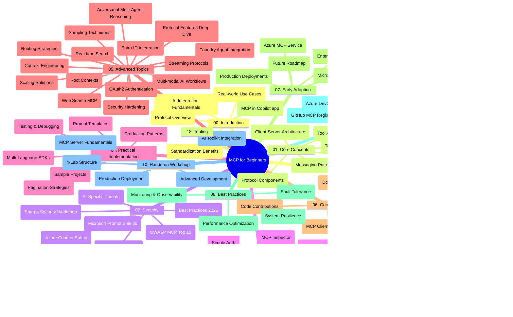

# بروتوكول سياق النموذج (MCP) للمبتدئين - دليل الدراسة

يقدم هذا الدليل الدراسي نظرة عامة على هيكل المستودع ومحتوياته لمنهج "بروتوكول سياق النموذج (MCP) للمبتدئين". استخدم هذا الدليل للتنقل في المستودع بكفاءة والاستفادة القصوى من الموارد المتاحة.

## نظرة عامة على المستودع

بروتوكول سياق النموذج (MCP) هو إطار موحد للتفاعلات بين نماذج الذكاء الصناعي وتطبيقات العميل. تم إنشاؤه مبدئياً بواسطة Anthropic، MCP الآن تتم صيانته من قبل مجتمع MCP الأوسع عبر منظمة GitHub الرسمية. يوفر هذا المستودع منهجاً شاملاً مع أمثلة عملية للشفرة بلغات C# وJava وJavaScript وPython وTypeScript، مصمّم للمطورين في الذكاء الصناعي، مهندسي النظم، ومهندسي البرمجيات.

## خريطة المنهج البصرية

## هيكل المستودع

ينقسم المستودع إلى اثني عشر قسمًا رئيسيًا، يركّز كل منها على جوانب مختلفة من MCP:

1. **المقدمة (00-Introduction/)**
   - نظرة عامة على بروتوكول سياق النموذج
   - أهمية التوحيد في خطوط أنابيب الذكاء الصناعي
   - حالات الاستخدام العملية والفوائد

2. **المفاهيم الأساسية (01-CoreConcepts/)**
   - بنية العميل-الخادم
   - المكونات الأساسية للبروتوكول
   - أنماط المراسلة في MCP
   - المواصفة الحالية: [التغييرات في MCP: مواصفة 2026-07-28](./01-CoreConcepts/mcp-2026-07-28.md) — النواة غير الحالة للبروتوكول، إطار التوسعات، وإبطال الجذور/العينات/التسجيل

3. **الأمن (02-Security/)**
   - التهديدات الأمنية في أنظمة MCP
   - أفضل الممارسات لتأمين التطبيقات
   - استراتيجيات المصادقة والتفويض
   - تطبيق عملي على [مصادقة CIMD وDCR](./02-Security/samples/cimd-dcr-auth/README.md)
   - **وثائق أمان شاملة**:
     - أفضل ممارسات أمان MCP
     - دليل تنفيذ أمان محتوى Azure
     - ضوابط وتقنيات أمان MCP
     - مرجع سريع لأفضل ممارسات MCP
   - **مواضيع أمنية رئيسية**:
     - هجمات حقن المطالبات وتسميم الأدوات
     - اختطاف الجلسة ومشاكل الوكيل المشوش
     - ثغرات في تمرير الرموز
     - الأذونات المفرطة والتحكم بالوصول
     - أمان سلسلة التوريد لمكونات الذكاء الصناعي
     - تكامل دروع Microsoft Prompt

4. **البدء (03-GettingStarted/)**
   - إعداد البيئة والتكوين
   - إنشاء خوادم وعملاء MCP الأساسية
   - التكامل مع التطبيقات القائمة
   - يشمل أقسامًا ل:
     - أول تنفيذ للخادم
     - تطوير العميل
     - تكامل عميل LLM
     - تكامل VS Code
     - خادم أحداث مرسلة من الخادم (SSE)
     - استخدام متقدم للخادم
     - البث عبر HTTP
     - تكامل مجموعة أدوات الذكاء الصناعي
     - استراتيجيات الاختبار
     - إرشادات النشر

5. **التنفيذ العملي (04-PracticalImplementation/)**
   - استخدام SDKs عبر لغات برمجة مختلفة
   - تقنيات التصحيح، الاختبار، والتحقق
   - صياغة قوالب مطالبات وإجراءات عمل قابلة لإعادة الاستخدام
   - مشاريع نموذجية مع أمثلة تنفيذ

6. **الموضوعات المتقدمة (05-AdvancedTopics/)**
   - تقنيات هندسة السياق
   - تكامل وكيل Foundry
   - سير عمل ذكاء صناعي متعدد الوسائط
   - عروض مصادقة OAuth2
   - قدرات البحث في الوقت الحقيقي
   - البث في الوقت الحقيقي
   - تنفيذ سياقات الجذر
   - استراتيجيات التوجيه
   - تقنيات أخذ العينات
   - أساليب التوسع
   - اعتبارات أمنية
   - تكامل أمان Entra ID
   - تكامل البحث على الويب
   - التفكير المتعدد الوكلاء العدائي (أنماط النقاش)

7. **مساهمات المجتمع (06-CommunityContributions/)**
   - كيفية المساهمة بالشفرات والوثائق
   - التعاون عبر GitHub
   - التحسينات والتعليقات بقيادة المجتمع
   - استخدام عملاء MCP المتنوعين (Claude Desktop، Cline، VSCode)
   - العمل مع خوادم MCP الشهيرة بما في ذلك توليد الصور

8. **دروس من التبني المبكر (07-LessonsfromEarlyAdoption/)**
   - تطبيقات واقعية وقصص نجاح
   - بناء ونشر حلول تعتمد على MCP
   - الاتجاهات وخارطة الطريق المستقبلية
   - **دليل خوادم MCP من Microsoft**: دليل شامل لعشرة خوادم MCP جاهزة للإنتاج من Microsoft تشمل:
     - خادم MCP لوثائق Microsoft Learn
     - خادم MCP لـ Azure (أكثر من 15 موصل تخصصي)
     - خادم MCP لـ GitHub
     - خادم MCP لـ Azure DevOps
     - خادم MCP لـ MarkItDown
     - خادم MCP لـ SQL Server
     - خادم MCP لـ Playwright
     - خادم MCP لـ Dev Box
     - خادم MCP لـ Microsoft Foundry
     - خادم MCP لـ Microsoft 365 Agents Toolkit

9. **أفضل الممارسات (08-BestPractices/)**
   - ضبط الأداء والتحسين
   - تصميم أنظمة MCP مقاومة للأخطاء
   - استراتيجيات الاختبار والمرونة

10. **دراسات حالة (09-CaseStudy/)**
    - **سبع دراسات حالة شاملة** توضح التعددية في استخدام MCP عبر سيناريوهات متنوعة:
    - **وكلاء السفر الذكيين عبر Azure AI**: تنظيم متعدد الوكلاء مع Azure OpenAI و AI Search
    - **تكامل Azure DevOps**: أتمتة عمليات سير العمل بتحديثات بيانات YouTube
    - **استرجاع الوثائق في الوقت الحقيقي**: عميل كونسول Python مع بث HTTP
    - **مولد خطط الدراسة التفاعلية**: تطبيق ويب Chainlit مع ذكاء اصطناعي محادثي
    - **توثيق داخل المحرر**: تكامل VS Code مع سير عمل GitHub Copilot
    - **إدارة واجهات برمجة التطبيقات Azure**: تكامل API المؤسساتي مع إنشاء خادم MCP
    - **سجل MCP في GitHub**: تطوير النظام البيئي ومنصة التكامل الوكالية
    - أمثلة تنفيذية تغطي التكامل المؤسساتي، إنتاجية المطور، وتطوير النظام البيئي

11. **ورشة عمل تطبيقية (10-StreamliningAIWorkflowsBuildingAnMCPServerWithAIToolkit/)**
    - ورشة عمل تطبيقية شاملة تجمع بين MCP وأداة AI Toolkit
    - بناء تطبيقات ذكية تربط بين نماذج الذكاء الصناعي والأدوات الحقيقية
    - وحدات عملية تغطي الأساسيات، تطوير الخادم المخصص، واستراتيجيات النشر للإنتاج
    - **هيكل المختبر**:
      - المختبر 1: أساسيات خادم MCP
      - المختبر 2: تطوير خادم MCP متقدم
      - المختبر 3: تكامل AI Toolkit
      - المختبر 4: النشر والتوسع في الإنتاج
    - منهج تعليمي قائم على المختبرات مع تعليمات خطوة بخطوة

12. **مختبرات تكامل قاعدة بيانات خادم MCP (11-MCPServerHandsOnLabs/)**
    - **مسار تعليمي شامل مكون من 13 مختبراً** لبناء خوادم MCP جاهزة للإنتاج مع تكامل PostgreSQL
    - **تطبيق تحليلات البيع بالتجزئة في العالم الحقيقي** باستخدام حالة استخدام Zava Retail
    - **أنماط مؤسسية** تشمل أمان مستوى الصف (RLS)، البحث الدلالي، والوصول متعدد المستأجرين للبيانات
    - **هيكل المختبر الكامل**:
      - **المختبرات 00-03: الأساسيات** - المقدمة، الهيكل، الأمان، إعداد البيئة
      - **المختبرات 04-06: بناء خادم MCP** - تصميم قاعدة البيانات، تنفيذ خادم MCP، تطوير الأدوات

      - **المختبرات 07-09: الميزات المتقدمة** - البحث الدلالي، الاختبار وتصحيح الأخطاء، دمج VS Code  
      - **المختبرات 10-12: الإنتاج وأفضل الممارسات** - النشر، المراقبة، التحسين  
    - **التقنيات المغطاة**: إطار FastMCP، PostgreSQL، Azure OpenAI، Azure Container Apps، Application Insights  
    - **نتائج التعلم**: خوادم MCP جاهزة للإنتاج، أنماط دمج قاعدة البيانات، تحليلات مدعومة بالذكاء الاصطناعي، أمان المؤسسات  

13. **الأدوات (12-tooling/)**  
    - تعلم كيفية استخدام MCP في تطبيق Copilot وأدوات أخرى  

## موارد إضافية  

يحتوي المستودع على موارد داعمة:  

- **مجلد الصور**: يحتوي على مخططات ورسوم توضيحية مستخدمة طوال المنهج  
- **الترجمات**: دعم متعدد اللغات مع ترجمات تلقائية للوثائق  
- **الموارد الرسمية لـ MCP**:  
  - [وثائق MCP](https://modelcontextprotocol.io/)  
  - [مواصفة MCP](https://modelcontextprotocol.io/specification/2026-07-28/)  
  - [مستودع MCP في GitHub](https://github.com/modelcontextprotocol)  

## كيفية استخدام هذا المستودع  

1. **التعلم المتسلسل**: اتبع الفصول بالترتيب (00 حتى 11) لتجربة تعلم منظمة.  
2. **تركيز حسب اللغة**: إذا كنت مهتمًا بلغة برمجة معينة، استكشف مجلدات العينات لتنفيذات بلغتك المفضلة.  
3. **التنفيذ العملي**: ابدأ بقسم "البدء" لإعداد بيئتك وإنشاء أول خادم وعميل MCP.  
4. **الاستكشاف المتقدم**: بمجرد إتقان الأساسيات، تعمق في المواضيع المتقدمة لتوسيع معرفتك.  
5. **التفاعل المجتمعي**: انضم إلى مجتمع MCP من خلال مناقشات GitHub وقنوات Discord للتواصل مع الخبراء والمطورين.  

## عملاء وأدوات MCP  

يغطي المنهج العديد من عملاء وأدوات MCP:  

1. **العملاء الرسميون**:  
   - Visual Studio Code  
   - MCP في Visual Studio Code  
   - Claude Desktop  
   - Claude في VSCode  
   - Claude API  

2. **العملاء المجتمعيون**:  
   - Cline (مبني على الطرفية)  
   - Cursor (محرر أكواد)  
   - ChatMCP  
   - Windsurf  

3. **أدوات إدارة MCP**:  
   - MCP CLI  
   - MCP Manager  
   - MCP Linker  
   - MCP Router  

## خوادم MCP الشهيرة  

يقدم المستودع خوادم MCP متنوعة، منها:  

1. **خوادم MCP الرسمية من مايكروسوفت**:  
   - خادم Microsoft Learn Docs MCP  
   - خادم Azure MCP (أكثر من 15 موصل متخصص)  
   - خادم GitHub MCP  
   - خادم Azure DevOps MCP  
   - خادم MarkItDown MCP  
   - خادم SQL Server MCP  
   - خادم Playwright MCP  
   - خادم Dev Box MCP  
   - خادم Microsoft Foundry MCP  
   - خادم مجموعة أدوات Microsoft 365 Agents MCP  

2. **خوادم المرجع الرسمية**:  
   - نظام الملفات  
   - Fetch  
   - الذاكرة  
   - التفكير المتسلسل  

3. **توليد الصور**:  
   - Azure OpenAI DALL-E 3  
   - Stable Diffusion WebUI  
   - Replicate  

4. **أدوات التطوير**:  
   - Git MCP  
   - التحكم في الطرفية  
   - مساعد الأكواد  

5. **الخوادم المتخصصة**:  
   - Salesforce  
   - Microsoft Teams  
   - Jira و Confluence  

## المساهمة  

يرحب هذا المستودع بالمساهمات من المجتمع. راجع قسم مساهمات المجتمع للحصول على إرشادات حول كيفية المساهمة بفعالية في نظام MCP البيئي.  

----  

*تم تحديث دليل الدراسة هذا آخر مرة في 9 سبتمبر 2026. يعكس مواصفة MCP  
`2026-07-28`، وهو تنقيح البروتوكول الحالي. بعض الأمثلة العملية  
تبقى مرقمة صراحة لإصدار `2025-11-25` بينما تعتمد مجموعات التطوير والأدوات  
واجهات برمجة التطبيقات للبروتوكول بلا حالة.*  

---

<!-- CO-OP TRANSLATOR DISCLAIMER START -->
**تنويه**:
تمت ترجمة هذا المستند باستخدام خدمة الترجمة بالذكاء الاصطناعي [Co-op Translator](https://github.com/Azure/co-op-translator). بينما نسعى للدقة، يرجى العلم أن الترجمات الآلية قد تحتوي على أخطاء أو عدم دقة. يجب اعتبار المستند الأصلي بلغته الأصلية المصدر الرسمي والمعتمد. للمعلومات الهامة، يُنصح بالاستعانة بترجمة بشرية محترفة. نحن غير مسؤولين عن أي سوء فهم أو تفسير ناتج عن استخدام هذه الترجمة.
<!-- CO-OP TRANSLATOR DISCLAIMER END -->