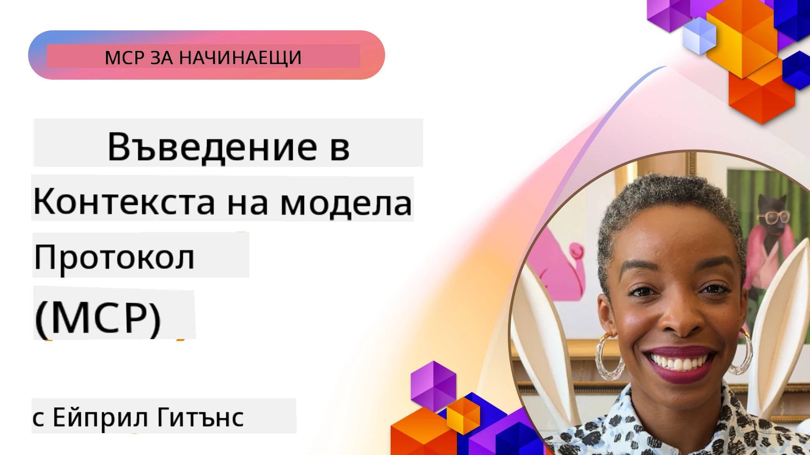
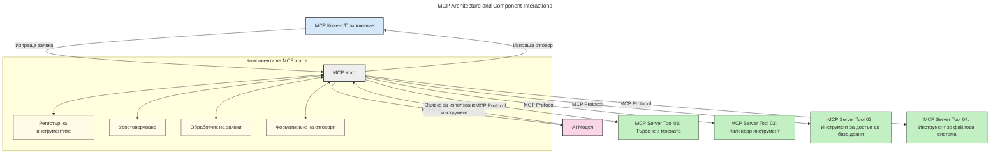
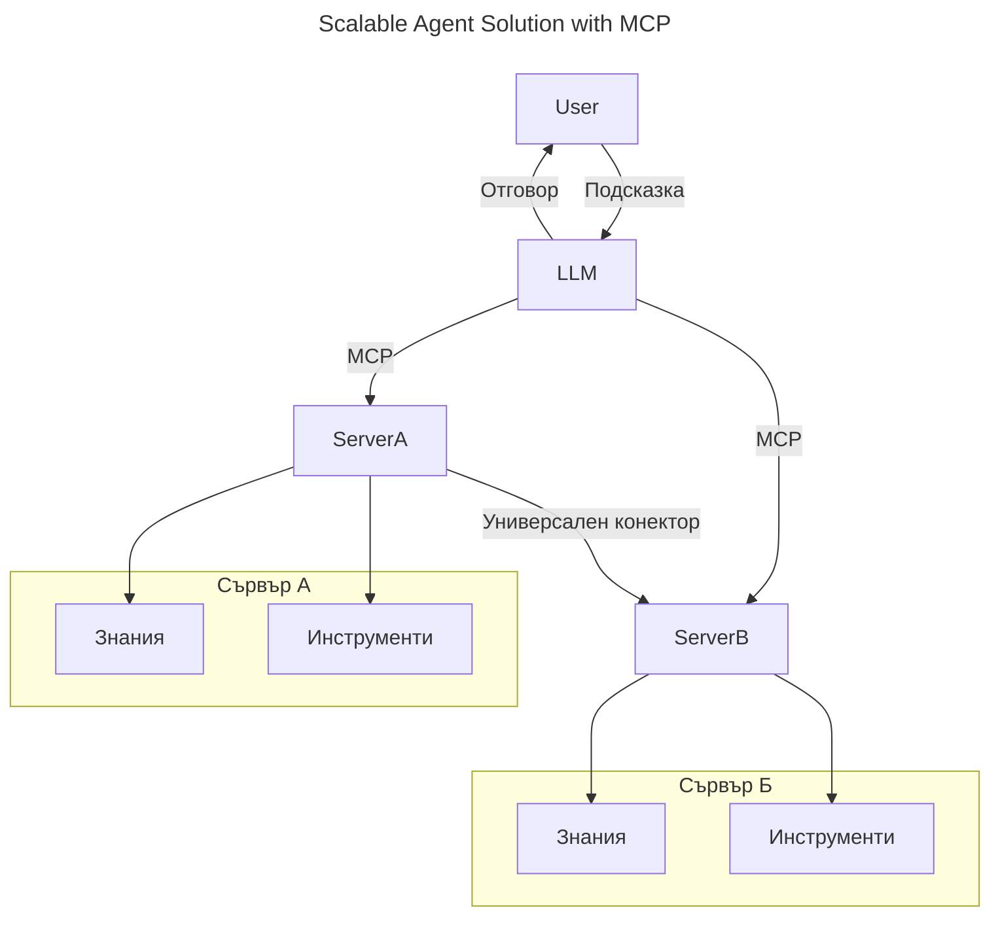
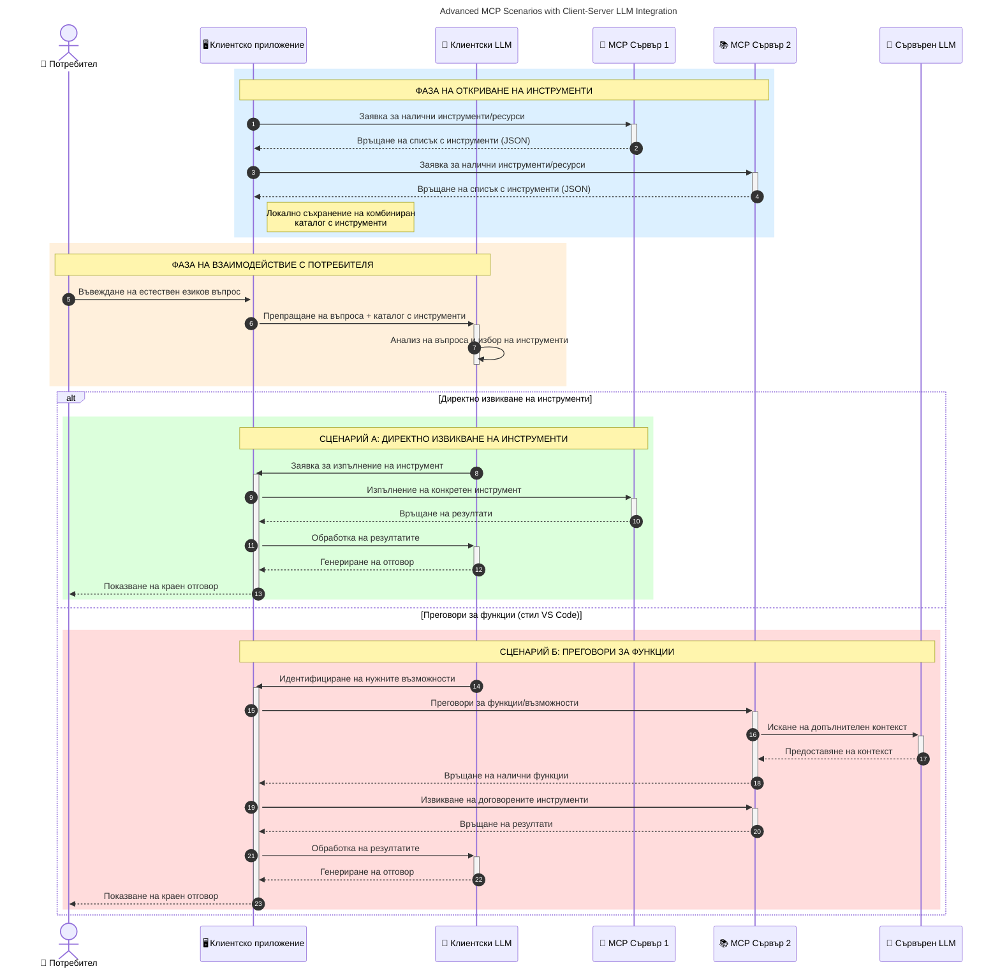

# Въведение в протокола Model Context (MCP): Защо е важен за мащабируеми AI приложения

_(Кликнете върху изображението по-горе, за да гледате видеото на този урок)_

Приложенията на генеративния AI са голяма крачка напред, тъй като често позволяват на потребителя да взаимодейства с приложението чрез естествени езикови подсказки. Въпреки това, с нарастването на времето и ресурсите, инвестирани в такива приложения, искате да сте сигурни, че можете лесно да интегрирате функционалности и ресурси по начин, който е лесен за разширяване, че приложението ви може да обслужва повече от един модел и да обработва различни особености на моделите. С две думи, създаването на приложения с генеративен AI е лесно в началото, но с растежа и усложняването им трябва да започнете да дефинирате архитектура и вероятно ще трябва да разчитате на стандарт, за да гарантирате, че приложенията ви са изградени последователно. Тук идва MCP, за да организира нещата и да предостави стандарт.

---

## **🔍 Какво е протоколът Model Context (MCP)?**

Протоколът **Model Context (MCP)** е **отворен, стандартизиран интерфейс**, който позволява на големи езикови модели (LLM) да взаимодействат безпроблемно с външни инструменти, API и източници на данни. Той осигурява последователна архитектура за подобряване на функционалността на AI моделите извън техните тренировъчни данни, като позволява по-умни, мащабируеми и по-отзивчиви AI системи.

---

## **🎯 Защо стандартизацията в AI е важна**

С нарастването на сложността на приложенията с генеративен AI, е от съществено значение да се приемат стандарти, които осигуряват **мащабируемост, разширяемост, поддръжка** и **предотвратяване на зависимост от доставчик**. MCP адресира тези нужди чрез:

- Унифициране на интеграциите между модел и инструмент
- Намаляване на крехки, еднократни потребителски решения
- Позволяване на множество модели от различни доставчици да съществуват в една екосистема

**Забележка:** Въпреки че MCP се представя като отворен стандарт, няма планове да бъде стандартизиран чрез съществуващи стандартизиращи организации като IEEE, IETF, W3C, ISO или други.

---

## **📚 Учебни цели**

Към края на тази статия ще можете:

- Да дефинирате **Model Context Protocol (MCP)** и неговите случаи на употреба
- Да разберете как MCP стандартизира комуникацията между модел и инструмент
- Да идентифицирате основните компоненти на архитектурата на MCP
- Да разгледате реални приложения на MCP в корпоративни и развойни контексти

---

## **💡 Защо протоколът Model Context (MCP) е революционен**

### **🔗 MCP решава фрагментацията в AI взаимодействията**

Преди MCP, интегрирането на модели с инструменти изискваше:

- Персонализиран код за всяка двойка инструмент-модел
- Нестандартизирани API за всеки доставчик
- Чести прекъсвания заради актуализации
- Лоша мащабируемост с нарастване на броя инструменти

### **✅ Ползи от стандартизацията на MCP**

| **Полза**                | **Описание**                                                                    |
|--------------------------|---------------------------------------------------------------------------------|
| Взаимодействие           | LLM работят безпроблемно с инструменти от различни доставчици                   |
| Последователност         | Еднородно поведение между платформи и инструменти                              |
| Преизползваемост         | Инструментите, създадени веднъж, могат да се използват в различни проекти и системи |
| Ускорено разработване    | Намалява времето за разработка чрез използване на стандартизирани, plug-and-play интерфейси |

---

## **🧱 Общ преглед на архитектурата на MCP**

MCP следва **клиент-сървър модел**, където:

- **MCP Host** изпълнява AI моделите
- **MCP Client** инициира заявки
- **MCP Servers** предоставят контекст, инструменти и възможности

### **Основни компоненти:**

- **Ресурси** – Статични или динамични данни за моделите  
- **Подсказки** – Предварително дефинирани работни потоци за насочена генерация  
- **Инструменти** – Изпълними функции като търсене, изчисления  
- **Семплиране** – Агентно поведение чрез рекурсивни взаимодействия (отказано в
    MCP `2026-07-28`; нови реализации трябва да се интегрират директно с доставчик на LLM)

- **Извличане** – Заявки, инициирани от сървъра за въвеждане от потребителя
- **Root локации** – Информационни файлови системи, релевантни за сървъра
    (отказано в MCP `2026-07-28`; предпочитат се параметри на инструмента, URI на ресурси или конфигурация на сървъра)

### **Архитектура на протокола:**

MCP използва двуслойна архитектура:
- **Слой данни**: JSON-RPC 2.0 съобщения, метаданни на заявка, откриване и протоколните примитиви
- **Транспортен слой**: stdio за локални подпроцеси и Streamable HTTP за отдалечени сървъри. Streamable HTTP може да използва SSE рамкиране за стрийминг отговори, но по-старият транспорт HTTP+SSE е отказан.

---

## Как работят MCP сървърите

MCP сървърите функционират по следния начин:

- **Поток на заявките**:
    1. Заявка се инициира от краен потребител или софтуер, действащ от негово име.
    2. **MCP Клиент** изпраща заявката до **MCP Host**, който управлява изпълнението на AI модела.
    3. **AI Моделът** получава потребителската подсказка и може да поиска достъп до външни инструменти или данни чрез една или повече инструментални заявки.
    4. **MCP Host** — а не директно моделът — комуникира с подходящите **MCP сървъри** чрез стандартизирания протокол.
- **Функционалност на MCP Host**:
    - **Регистър на инструменти**: Поддържа каталог на наличните инструменти и техните възможности.
    - **Автентикация**: Проверява разрешенията за достъп до инструменти.
    - **Обработчик на заявки**: Обработва постъпващите инструментални заявки от модела.
    - **Форматиране на отговори**: Структурира изхода на инструментите в разбираем за модела формат.
- **Изпълнение на MCP сървъра**:
    - **MCP Host** насочва повикванията към един или повече **MCP сървъри**, всеки от които предлага специализирани функции (напр. търсене, изчисления, заявки към бази данни).
    - **MCP Сървърите** извършват съответните операции и връщат резултати към **MCP Host** в последователен формат.
    - **MCP Host** форматира и препраща тези резултати към **AI Модела**.
- **Завършване на отговора**:
    - **AI Моделът** включва изхода на инструментите в окончателния отговор.
    - **MCP Host** изпраща този отговор обратно към **MCP Клиента**, който го доставя на крайния потребител или извикващия софтуер.
    

## 👨‍💻 Как да създадете MCP сървър (с примери)

MCP сървърите ви позволяват да разширите възможностите на LLM, като предоставяте данни и функционалност. 

Готови ли сте да опитате? Ето SDK-та за различни езици и стекове с примери за създаване на прости MCP сървъри на различни езици/стекове:

- **Python SDK**: https://github.com/modelcontextprotocol/python-sdk

- **TypeScript SDK**: https://github.com/modelcontextprotocol/typescript-sdk

- **Java SDK**: https://github.com/modelcontextprotocol/java-sdk

- **C#/.NET SDK**: https://github.com/modelcontextprotocol/csharp-sdk

## 🌍 Реални случаи на използване на MCP

MCP позволява широк спектър от приложения чрез разширяване на AI възможностите:

| **Приложение**              | **Описание**                                                                    |
|------------------------------|---------------------------------------------------------------------------------|
| Корпоративна интеграция на данни | Свързване на LLM с бази данни, CRM или вътрешни инструменти                    |
| Агентни AI системи             | Позволява автономни агенти с достъп до инструменти и работни потоци за вземане на решения |
| Мултимодални приложения        | Комбиниране на текстови, визуални и аудио инструменти в едно унифицирано AI приложение |
| Интеграция на данни в реално време | Внасяне на живи данни в AI взаимодействия за по-точни, актуални отговори        |

### 🧠 MCP = Универсален стандарт за AI взаимодействия

Протоколът Model Context (MCP) действа като универсален стандарт за AI взаимодействия, подобно на това как USB-C стандартизира физическите връзки за устройства. В света на AI MCP осигурява последователен интерфейс, позволяващ моделите (клиентите) да се интегрират безпроблемно с външни инструменти и доставчици на данни (сървъри). Това премахва нуждата от разнообразни, персонализирани протоколи за всеки API или източник на данни.

Според MCP, инструмент съвместим с MCP (наричан MCP сървър) следва единен стандарт. Тези сървъри могат да изброяват инструментите или действията, които предлагат, и да изпълняват тези действия при заявка от AI агент. Платформи за AI агенти, които поддържат MCP, са в състояние да откриват наличните инструменти от сървърите и да ги извикват чрез този стандартен протокол.

### 💡 Улеснява достъпа до знание

Освен предоставянето на инструменти, MCP улеснява и достъпа до знания. Той позволява на приложенията да предоставят контекст на големите езикови модели (LLM) чрез свързването им с различни източници на данни. Например MCP сървър може да представлява хранилище на документи на компания, позволявайки на агентите да извличат релевантна информация при поискване. Друг сървър може да обработва специфични действия като изпращане на имейли или актуализиране на записи. От гледна точка на агента, това са просто инструменти, които може да използва — някои инструменти връщат данни (контекст на знанието), докато други изпълняват действия. MCP ефективно управлява и двете.

Агент, свързан с MCP сървър, автоматично научава за наличните възможности и достъпните данни на сървъра чрез стандартен формат. Тази стандартизация позволява динамична наличност на инструментите. Например добавянето на нов MCP сървър към системата на агента прави функциите му веднага използваеми без допълнителна персонализация на инструкциите на агента.

Тази рационализирана интеграция съответства на потока, илюстриран в следната схема, където сървърите предоставят както инструменти, така и знания, осигурявайки безпрепятствено сътрудничество между системите.

### 👉 Пример: Мащабируемо агентно решение

Универсалният конектор позволява на MCP сървърите да комуникират и споделят възможности помежду си, като позволява на ServerA да делегира задачи на ServerB или да използва неговите инструменти и знания. Това федерализира инструментите и данните между сървърите, поддържайки мащабируеми и модулни агентни архитектури. Тъй като MCP стандартизира показването на инструменти, агентите могат динамично да откриват и насочват заявки между сървърите без твърдо кодирани интеграции.

Федерация на инструменти и знания: Инструментите и данните могат да се достъпват през сървърите, позволявайки по-мащабируема и модулна агентна архитектура.

### 🔄 Разширени MCP сценарии с интеграция на LLM от страна на клиента

Освен основната архитектура на MCP, има разширени сценарии, при които както клиентът, така и сървърът съдържат LLM, позволяващи по-сложни взаимодействия. В следващата схема, **Клиентското приложение** може да бъде IDE с набор от MCP инструменти на разположение за потребителя на LLM:

## 🔐 Практически ползи от MCP

Ето практическите ползи от използването на MCP:

- **Актуалност**: Моделите могат да достъпват актуална информация извън техните тренировъчни данни
- **Разширение на възможностите**: Моделите могат да използват специализирани инструменти за задачи, за които не са били обучени
- **Намалени халюцинации**: Външните източници на данни осигуряват фактическа основа
- **Поверителност**: Чувствителните данни могат да останат в защитени среди, вместо да са вградени в подсказките

## 📌 Ключови изводи

Следното са ключови изводи за използването на MCP:

- **MCP** стандартизира начина, по който AI моделите взаимодействат с инструменти и данни
- Насърчава **разширяемост, последователност и съвместимост**
- MCP помага **да се намали времето за разработка, да се подобри надеждността и да се разширят възможностите на модела**
- Клиент-сървър архитектурата **позволява гъвкави, разширяеми AI приложения**

## 🧠 Упражнение

Помислете за AI приложение, което ви интересува да създадете.

- Кои **външни инструменти или данни** биха могли да разширят неговите възможности?
- Как MCP би направил интеграцията **по-проста и по-надеждна?**

## Допълнителни ресурси

- [MCP GitHub хранилище](https://github.com/modelcontextprotocol)

## Какво следва

Следва: [Глава 1: Основни концепции](../01-CoreConcepts/README.md)

---

<!-- CO-OP TRANSLATOR DISCLAIMER START -->
**Отказ от отговорност**:
Този документ е преведен с помощта на AI преводачески услуга [Co-op Translator](https://github.com/Azure/co-op-translator). Въпреки че се стремим към точност, моля имайте предвид, че автоматизираните преводи могат да съдържат грешки или неточности. Оригиналният документ на неговия роден език трябва да се счита за авторитетен източник. За критична информация се препоръчва професионален човешки превод. Ние не носим отговорност за каквито и да е недоразумения или неправилни тълкувания, произтичащи от използването на този превод.
<!-- CO-OP TRANSLATOR DISCLAIMER END -->