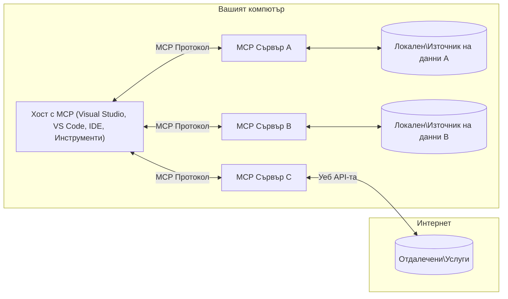

# Основни концепции на MCP: Овладяване на протокола за контекст на модела за интеграция на ИИ

[](https://youtu.be/earDzWGtE84)

_(Кликнете върху изображението по-горе, за да гледате видеото на този урок)_

[Протоколът за контекст на модела (MCP)](https://github.com/modelcontextprotocol) е мощна, стандартизирана рамка, която оптимизира комуникацията между големи езикови модели (LLM) и външни инструменти, приложения и източници на данни.  
Това ръководство ще ви преведе през основните концепции на MCP. Ще научите за клиент-сървърната му архитектура, основните компоненти, механиката на комуникация и най-добрите практики за внедряване.

- **Явно съгласие на потребителя**: Всички достъпи до данни и операции изискват явно одобрение от потребителя преди изпълнение. Потребителите трябва ясно да разбират какви данни ще бъдат достъпвани и какви действия ще се извършват, с детайлен контрол върху разрешенията и упълномощаването.

- **Защита на поверителността на данните**: Данните на потребителя се разкриват само с явно съгласие и трябва да бъдат защитени с надеждни контролни механизми за достъп през целия жизнен цикъл на взаимодействието. Внедряванията трябва да предотвратяват неоторизирано предаване на данни и да поддържат строги граници на поверителност.

- **Безопасност при изпълнение на инструменти**: Всяко извикване на инструмент изисква явно съгласие на потребителя с ясно разбиране за функционалността, параметрите и потенциалното въздействие на инструмента. Надеждни граници за сигурност трябва да предотвратяват нежелано, опасно или злонамерено изпълнение на инструменти.

- **Сигурност на транспортния слой**: Всички комуникационни канали трябва да използват подходящи механизми за криптиране и удостоверяване. Отдалечените връзки трябва да прилагат сигурни транспортни протоколи и правилно управление на идентификационните данни.

#### Насоки за внедряване:

- **Управление на разрешенията**: Внедрете системи за фино управление на разрешения, които позволяват на потребителите да контролират кои сървъри, инструменти и ресурси са достъпни  
- **Удостоверяване и упълномощаване**: Използвайте сигурни методи за удостоверяване (OAuth, API ключове) с правилно управление на токени и срокове на валидност  
- **Валидация на входните данни**: Валидирайте всички параметри и входни данни според дефинирани схеми, за да предотвратите инжекционни атаки  
- **Аудитно регистриране**: Поддържайте пълни логове на всички операции за мониторинг на сигурността и съответствие

## Преглед

Този урок разглежда основната архитектура и компоненти, които съставляват екосистемата на Протокола за контекст на модела (MCP). Ще научите за клиент-сървърната архитектура, ключовите компоненти и комуникационните механизми, които захранват взаимодействията в MCP.

## Основни учебни цели

Към края на този урок ще:

- Разберете клиент-сървърната архитектура на MCP.  
- Идентифицирате ролите и отговорностите на Хостове, Клиенти и Сървъри.  
- Анализирате основните характеристики, които правят MCP гъвкав слой за интеграция.  
- Научите как тече информацията в екосистемата на MCP.  
- Придобиете практически познания чрез кодови примери в .NET, Java, Python и JavaScript.

## Архитектура на MCP: По-задълбочен поглед

Екосистемата на MCP е изградена върху клиент-сървърен модел. Тази модулна структура позволява на AI приложенията ефективно да взаимодействат с инструменти, бази данни, API и контекстуални ресурси. Нека разгледаме тази архитектура по съставните ѝ части.

В основата си MCP следва клиент-сървърна архитектура, при която хост приложението може да се свърже с множество сървъри:


- **MCP хостове**: Програми като VSCode, Claude Desktop, IDE или AI инструменти, които искат да достъпват данни чрез MCP  
- **MCP клиенти**: Протоколни клиенти, които поддържат 1:1 връзки със сървъри  
- **MCP сървъри**: Лекотоварни програми, които предоставят специфични възможности чрез стандартизирания Протокол за контекст на модела  
- **Локални източници на данни**: Файлове, бази данни и услуги на вашия компютър, до които MCP сървърите могат да имат сигурен достъп  
- **Отдалечени услуги**: Външни системи, достъпни през интернет, към които MCP сървърите могат да се свързват чрез API.

Протоколът MCP е развиващ се стандарт, използващ версиониране по дата (формат ГГГГ-ММ-ДД). Текущата версия на протокола е **2025-11-25**. Можете да видите последните актуализации на [спецификацията на протокола](https://modelcontextprotocol.io/specification/2025-11-25/)

### 1. Хостове

В Протокола за контекст на модела (MCP), **хостовете** са AI приложения, които служат като основен интерфейс, чрез който потребителите взаимодействат с протокола. Хостовете координират и управляват връзките с множество MCP сървъри, като създават отделни MCP клиенти за всяка сървърна връзка. Примери за хостове включват:

- **AI приложения**: Claude Desktop, Visual Studio Code, Claude Code  
- **Среда за разработка**: IDE и редактори на код с интеграция на MCP  
- **Персонализирани приложения**: Специално създадени AI агенти и инструменти

**Хостовете** са приложения, които координират взаимодействията с AI моделите. Те:

- **Оркестрират AI модели**: Изпълняват или взаимодействат с LLM за генериране на отговори и координиране на AI работни потоци  
- **Управляват клиентските връзки**: Създават и поддържат по един MCP клиент за всяка сървърна връзка  
- **Контролират потребителския интерфейс**: Управляват потока на разговор, взаимодействията с потребителя и представянето на отговорите  
- **Прилагат сигурност**: Контролират разрешения, ограничения за сигурност и удостоверяване  
- **Обработват съгласието на потребителя**: Управляват одобрението на потребителя за споделяне на данни и изпълнение на инструменти

### 2. Клиенти

**Клиентите** са основни компоненти, които поддържат посветени връзки един към един между хостовете и MCP сървърите. Всеки MCP клиент се създава от хоста, за да се свърже с конкретен MCP сървър, осигурявайки организирани и сигурни комуникационни канали. Множество клиенти позволяват на хостовете да се свързват с няколко сървъра едновременно.

**Клиентите** са свързващи компоненти в хост приложението. Те:

- **Комуникация по протокола**: Изпращат JSON-RPC 2.0 заявки към сървърите с подканящи съобщения и инструкции  
- **Договаряне на възможности**: Договарят поддържаните функции и версии на протокола със сървърите при инициализация  
- **Изпълнение на инструменти**: Управляват заявки за изпълнение на инструменти от моделите и обработват отговорите  
- **Актуализации в реално време**: Обработват известия и актуализации в реално време от сървърите  
- **Обработка на отговори**: Обработват и форматират отговорите на сървърите за показване на потребителите

### 3. Сървъри

**Сървърите** са програми, които предоставят контекст, инструменти и възможности на MCP клиентите. Те могат да се изпълняват локално (на същата машина като хоста) или отдалечено (на външни платформи) и са отговорни за обработка на клиентските заявки и предоставяне на структурирани отговори. Сървърите предоставят специфична функционалност чрез стандартизирания Протокол за контекст на модела.

**Сървърите** са услуги, които предоставят контекст и възможности. Те:

- **Регистрация на функции**: Регистрират и предоставят наличните примитиви (ресурси, подканящи съобщения, инструменти) на клиентите  
- **Обработка на заявки**: Получават и изпълняват повиквания на инструменти, заявки за ресурси и подканящи съобщения от клиентите  
- **Осигуряване на контекст**: Предоставят контекстуална информация и данни за подобряване на отговорите на модела  
- **Управление на състоянието**: Поддържат състоянието на сесията и обработват състояниеви взаимодействия при необходимост  
- **Известия в реално време**: Изпращат известия за промени във възможностите и актуализации към свързаните клиенти

Сървърите могат да бъдат разработвани от всеки за разширяване на възможностите на модела със специализирана функционалност и поддържат както локални, така и отдалечени сценарии на внедряване.

### 4. Примитиви на сървъра

Сървърите в Протокола за контекст на модела (MCP) предоставят три основни **примитива**, които дефинират фундаменталните градивни елементи за богати взаимодействия между клиенти, хостове и езикови модели. Тези примитиви специфицират типовете контекстуална информация и действия, достъпни чрез протокола.

MCP сървърите могат да предоставят всяка комбинация от следните три основни примитива:

#### Ресурси

**Ресурсите** са източници на данни, които предоставят контекстуална информация на AI приложенията. Те представляват статично или динамично съдържание, което може да подобри разбирането и вземането на решения от модела:

- **Контекстуални данни**: Структурирана информация и контекст за консумация от AI модела  
- **Бази знания**: Репозитории с документи, статии, ръководства и научни трудове  
- **Локални източници на данни**: Файлове, бази данни и информация от локалната система  
- **Външни данни**: Отговори от API, уеб услуги и данни от отдалечени системи  
- **Динамично съдържание**: Данни в реално време, които се обновяват според външни условия

Ресурсите се идентифицират чрез URI и поддържат откриване чрез методите `resources/list` и извличане чрез `resources/read`:

```text
file://documents/project-spec.md
database://production/users/schema
api://weather/current
```

#### Подканящи съобщения

**Подканящите съобщения** са многократно използваеми шаблони, които помагат за структуриране на взаимодействията с езиковите модели. Те предоставят стандартизирани модели на взаимодействие и шаблонирани работни потоци:

- **Взаимодействия на базата на шаблони**: Предварително структурирани съобщения и начални фрази за разговор  
- **Шаблони на работни потоци**: Стандартизирани последователности за често срещани задачи и взаимодействия  
- **Примери с малко примери**: Шаблони, базирани на примери за инструкции към модела  
- **Системни подканящи съобщения**: Основни подканящи съобщения, които дефинират поведението и контекста на модела  
- **Динамични шаблони**: Параметризирани подканящи съобщения, които се адаптират към конкретни контексти

Подканящите съобщения поддържат заместване на променливи и могат да бъдат откривани чрез `prompts/list` и извличани с `prompts/get`:

```markdown
Generate a {{task_type}} for {{product}} targeting {{audience}} with the following requirements: {{requirements}}
```

#### Инструменти

**Инструментите** са изпълними функции, които AI моделите могат да извикват, за да извършват конкретни действия. Те представляват "глаголите" в екосистемата на MCP, позволявайки на моделите да взаимодействат с външни системи:

- **Изпълними функции**: Дискретни операции, които моделите могат да извикват с конкретни параметри  
- **Интеграция с външни системи**: API повиквания, заявки към бази данни, операции с файлове, изчисления  
- **Уникална идентичност**: Всеки инструмент има уникално име, описание и схема на параметрите  
- **Структурирани вход/изход**: Инструментите приемат валидирани параметри и връщат структурирани, типизирани отговори  
- **Възможности за действия**: Позволяват на моделите да извършват реални действия и да извличат актуални данни

Инструментите се дефинират с JSON Schema за валидация на параметрите и се откриват чрез `tools/list` и се изпълняват чрез `tools/call`:

```typescript
server.tool(
  "search_products", 
  {
    query: z.string().describe("Search query for products"),
    category: z.string().optional().describe("Product category filter"),
    max_results: z.number().default(10).describe("Maximum results to return")
  }, 
  async (params) => {
    // Изпълнете търсене и върнете структурирани резултати
    return await productService.search(params);
  }
);
```

## Клиентски примитиви

В Протокола за контекст на модела (MCP), **клиентите** могат да предоставят примитиви, които позволяват на сървърите да изискват допълнителни възможности от хост приложението. Тези клиентски примитиви позволяват по-богати, по-интерактивни реализации на сървъри, които могат да имат достъп до възможностите на AI модела и взаимодействията с потребителя.

### Извличане на проби (Sampling)

**Извличането на проби** позволява на сървърите да изискват завършвания от езиковия модел чрез AI приложението на клиента. Този примитив дава възможност на сървърите да използват възможностите на LLM без да вграждат свои собствени зависимости от модел:

- **Независим достъп до модел**: Сървърите могат да изискват завършвания без да включват SDK за LLM или да управляват достъпа до модел  
- **AI, иницииран от сървъра**: Позволява на сървърите автономно да генерират съдържание, използвайки AI модела на клиента  
- **Рекурсивни взаимодействия с LLM**: Поддържа сложни сценарии, при които сървърите се нуждаят от AI помощ за обработка  
- **Динамично генериране на съдържание**: Позволява на сървърите да създават контекстуални отговори, използвайки модела на хоста

Извличането на проби се инициира чрез метода `sampling/complete`, където сървърите изпращат заявки за завършване към клиентите.

### Извличане на информация (Elicitation)

**Извличането на информация** позволява на сървърите да изискват допълнителна информация или потвърждение от потребителите чрез интерфейса на клиента:

- **Заявки за потребителски вход**: Сървърите могат да искат допълнителна информация, когато е необходима за изпълнение на инструмент  
- **Диалози за потвърждение**: Искане на одобрение от потребителя за чувствителни или въздействащи операции  
- **Интерактивни работни потоци**: Позволяват на сървърите да създават стъпка по стъпка взаимодействия с потребителя  
- **Динамично събиране на параметри**: Събират липсващи или опционални параметри по време на изпълнение на инструменти

Заявките за извличане се правят чрез метода `elicitation/request` за събиране на потребителски вход чрез интерфейса на клиента.

### Логване (Logging)

**Логването** позволява на сървърите да изпращат структурирани лог съобщения към клиентите за отстраняване на грешки, мониторинг и оперативна видимост:

- **Поддръжка на отстраняване на грешки**: Позволява на сървърите да предоставят подробни логове за изпълнение за диагностика  
- **Оперативен мониторинг**: Изпраща статусни актуализации и показатели за производителност към клиентите  
- **Отчитане на грешки**: Предоставя подробен контекст и диагностична информация за грешки  
- **Аудитни следи**: Създава пълни логове на операциите и решенията на сървъра

Лог съобщенията се изпращат към клиентите, за да осигурят прозрачност на операциите на сървъра и да улеснят отстраняването на грешки.

## Поток на информация в MCP

Протоколът за контекст на модела (MCP) дефинира структуриран поток на информация между хостове, клиенти, сървъри и модели. Разбирането на този поток помага да се изясни как се обработват потребителските заявки и как външните инструменти и данни се интегрират в отговорите на модела.

- **Хостът инициира връзка**  
  Хост приложението (като IDE или чат интерфейс) установява връзка със MCP сървър, обикновено чрез STDIO, WebSocket или друг поддържан транспорт.

- **Договаряне на възможности**  
  Клиентът (вграден в хоста) и сървърът обменят информация за поддържаните функции, инструменти, ресурси и версии на протокола. Това гарантира, че и двете страни разбират какви възможности са налични за сесията.

- **Потребителска заявка**  
  Потребителят взаимодейства с хоста (например въвежда подканящо съобщение или команда). Хостът събира този вход и го предава на клиента за обработка.

- **Използване на ресурс или инструмент**  
  - Клиентът може да поиска допълнителен контекст или ресурси от сървъра (като файлове, записи в база данни или статии от база знания), за да обогати разбирането на модела.  
  - Ако моделът определи, че е необходим инструмент (например за извличане на данни, извършване на изчисление или повикване на API), клиентът изпраща заявка за извикване на инструмент към сървъра, посочвайки името на инструмента и параметрите.

- **Изпълнение от сървъра**  
  Сървърът получава заявката за ресурс или инструмент, изпълнява необходимите операции (като стартиране на функция, заявка към база данни или извличане на файл) и връща резултатите на клиента в структурирана форма.

- **Генериране на отговор**  
  Клиентът интегрира отговорите на сървъра (данни от ресурси, изходи от инструменти и др.) в текущото взаимодействие с модела. Моделът използва тази информация, за да генерира изчерпателен и контекстуално релевантен отговор.

- **Представяне на резултата**  
  Хостът получава крайния изход от клиента и го представя на потребителя, често включващ както генерирания от модела текст, така и резултатите от изпълнението на инструменти или търсения в ресурси.

Този поток позволява на MCP да поддържа усъвършенствани, интерактивни и контекстно осъзнати AI приложения чрез безпроблемно свързване на модели с външни инструменти и източници на данни.

## Архитектура и слоеве на протокола

MCP се състои от два отделни архитектурни слоя, които работят заедно, за да предоставят пълна комуникационна рамка:

### Слой за данни

**Слойът за данни** реализира основния MCP протокол, използвайки **JSON-RPC 2.0** като основа. Този слой дефинира структурата на съобщенията, семантиката и моделите на взаимодействие:

#### Основни компоненти:

- **Протокол JSON-RPC 2.0**: Цялата комуникация използва стандартизиран формат на съобщения JSON-RPC 2.0 за повиквания на методи, отговори и известия
- **Управление на жизнения цикъл**: Обработва инициализация на връзката, договаряне на възможности и прекратяване на сесията между клиенти и сървъри
- **Примитиви на сървъра**: Позволява на сървърите да предоставят основна функционалност чрез инструменти, ресурси и подсказки
- **Примитиви на клиента**: Позволява на сървърите да изискват семплиране от LLM, да извличат потребителски вход и да изпращат лог съобщения
- **Известия в реално време**: Поддържа асинхронни известия за динамични актуализации без полинг

#### Основни характеристики:

- **Договаряне на версия на протокола**: Използва версиониране на база дата (ГГГГ-ММ-ДД) за осигуряване на съвместимост
- **Откриване на възможности**: Клиенти и сървъри обменят информация за поддържани функции по време на инициализация
- **Сесии със състояние**: Поддържа състоянието на връзката през множество взаимодействия за контекстна непрекъснатост

### Транспортен слой

**Транспортният слой** управлява комуникационните канали, рамкирането на съобщения и удостоверяването между участниците в MCP:

#### Поддържани транспортни механизми:

1. **STDIO транспорт**:
   - Използва стандартни входно/изходни потоци за директна комуникация между процеси
   - Оптимален за локални процеси на една и съща машина без мрежови разходи
   - Често използван за локални реализации на MCP сървъри

2. **Streamable HTTP транспорт**:
   - Използва HTTP POST за съобщения от клиент към сървър  
   - Опционални Server-Sent Events (SSE) за стрийминг от сървър към клиент
   - Позволява комуникация с отдалечени сървъри през мрежи
   - Поддържа стандартно HTTP удостоверяване (bearer токени, API ключове, персонализирани заглавки)
   - MCP препоръчва OAuth за сигурно удостоверяване с токени

#### Абстракция на транспорта:

Транспортният слой абстрахира детайлите на комуникацията от слоя с данни, позволявайки същия формат на съобщения JSON-RPC 2.0 през всички транспортни механизми. Тази абстракция позволява на приложенията безпроблемно да превключват между локални и отдалечени сървъри.

### Съображения за сигурност

Реализациите на MCP трябва да спазват няколко критични принципа за сигурност, за да осигурят безопасни, надеждни и защитени взаимодействия във всички операции на протокола:

- **Съгласие и контрол от потребителя**: Потребителите трябва да дадат изрично съгласие преди достъп до данни или извършване на операции. Те трябва да имат ясен контрол върху това какви данни се споделят и кои действия са разрешени, подкрепено от интуитивни потребителски интерфейси за преглед и одобрение на дейности.

- **Поверителност на данните**: Данните на потребителя трябва да се разкриват само с изрично съгласие и да бъдат защитени с подходящи контролни механизми за достъп. Реализациите на MCP трябва да предпазват от неоторизирано предаване на данни и да гарантират, че поверителността се поддържа във всички взаимодействия.

- **Безопасност на инструментите**: Преди извикване на който и да е инструмент е необходимо изрично съгласие от потребителя. Потребителите трябва да имат ясно разбиране за функционалността на всеки инструмент, а трябва да се налагат здрави граници за сигурност, за да се предотврати нежелано или несигурно изпълнение на инструменти.

Следвайки тези принципи за сигурност, MCP гарантира доверието, поверителността и безопасността на потребителите във всички взаимодействия по протокола, като същевременно позволява мощни AI интеграции.

## Примери с код: Ключови компоненти

По-долу са дадени примери с код на няколко популярни програмни езика, които илюстрират как да се реализират ключови компоненти и инструменти на MCP сървър.

### Пример за .NET: Създаване на прост MCP сървър с инструменти

Ето един практичен пример на .NET, който демонстрира как да се реализира прост MCP сървър с персонализирани инструменти. Този пример показва как да се дефинират и регистрират инструменти, да се обработват заявки и да се свърже сървърът чрез Model Context Protocol.

```csharp
using System;
using System.Threading.Tasks;
using ModelContextProtocol.Server;
using ModelContextProtocol.Server.Transport;
using ModelContextProtocol.Server.Tools;

public class WeatherServer
{
    public static async Task Main(string[] args)
    {
        // Create an MCP server
        var server = new McpServer(
            name: "Weather MCP Server",
            version: "1.0.0"
        );
        
        // Register our custom weather tool
        server.AddTool<string, WeatherData>("weatherTool", 
            description: "Gets current weather for a location",
            execute: async (location) => {
                // Call weather API (simplified)
                var weatherData = await GetWeatherDataAsync(location);
                return weatherData;
            });
        
        // Connect the server using stdio transport
        var transport = new StdioServerTransport();
        await server.ConnectAsync(transport);
        
        Console.WriteLine("Weather MCP Server started");
        
        // Keep the server running until process is terminated
        await Task.Delay(-1);
    }
    
    private static async Task<WeatherData> GetWeatherDataAsync(string location)
    {
        // This would normally call a weather API
        // Simplified for demonstration
        await Task.Delay(100); // Simulate API call
        return new WeatherData { 
            Temperature = 72.5,
            Conditions = "Sunny",
            Location = location
        };
    }
}

public class WeatherData
{
    public double Temperature { get; set; }
    public string Conditions { get; set; }
    public string Location { get; set; }
}
```

### Пример за Java: Компоненти на MCP сървър

Този пример демонстрира същия MCP сървър и регистрация на инструменти като горния .NET пример, но реализиран на Java.

```java
import io.modelcontextprotocol.server.McpServer;
import io.modelcontextprotocol.server.McpToolDefinition;
import io.modelcontextprotocol.server.transport.StdioServerTransport;
import io.modelcontextprotocol.server.tool.ToolExecutionContext;
import io.modelcontextprotocol.server.tool.ToolResponse;

public class WeatherMcpServer {
    public static void main(String[] args) throws Exception {
        // Създайте MCP сървър
        McpServer server = McpServer.builder()
            .name("Weather MCP Server")
            .version("1.0.0")
            .build();
            
        // Регистрирайте инструмент за времето
        server.registerTool(McpToolDefinition.builder("weatherTool")
            .description("Gets current weather for a location")
            .parameter("location", String.class)
            .execute((ToolExecutionContext ctx) -> {
                String location = ctx.getParameter("location", String.class);
                
                // Вземете данни за времето (опростено)
                WeatherData data = getWeatherData(location);
                
                // Върнете форматиран отговор
                return ToolResponse.content(
                    String.format("Temperature: %.1f°F, Conditions: %s, Location: %s", 
                    data.getTemperature(), 
                    data.getConditions(), 
                    data.getLocation())
                );
            })
            .build());
        
        // Свържете сървъра чрез stdio транспорт
        try (StdioServerTransport transport = new StdioServerTransport()) {
            server.connect(transport);
            System.out.println("Weather MCP Server started");
            // Поддържайте сървъра работещ, докато процесът не бъде прекратен
            Thread.currentThread().join();
        }
    }
    
    private static WeatherData getWeatherData(String location) {
        // Имплементацията би извикала API за времето
        // Опростено за примерни цели
        return new WeatherData(72.5, "Sunny", location);
    }
}

class WeatherData {
    private double temperature;
    private String conditions;
    private String location;
    
    public WeatherData(double temperature, String conditions, String location) {
        this.temperature = temperature;
        this.conditions = conditions;
        this.location = location;
    }
    
    public double getTemperature() {
        return temperature;
    }
    
    public String getConditions() {
        return conditions;
    }
    
    public String getLocation() {
        return location;
    }
}
```

### Пример за Python: Създаване на MCP сървър

Този пример използва fastmcp, затова моля първо го инсталирайте:

```python
pip install fastmcp
```
Примерен код:

```python
#!/usr/bin/env python3
import asyncio
from fastmcp import FastMCP
from fastmcp.transports.stdio import serve_stdio

# Създаване на FastMCP сървър
mcp = FastMCP(
    name="Weather MCP Server",
    version="1.0.0"
)

@mcp.tool()
def get_weather(location: str) -> dict:
    """Gets current weather for a location."""
    return {
        "temperature": 72.5,
        "conditions": "Sunny",
        "location": location
    }

# Алтернативен подход с използване на клас
class WeatherTools:
    @mcp.tool()
    def forecast(self, location: str, days: int = 1) -> dict:
        """Gets weather forecast for a location for the specified number of days."""
        return {
            "location": location,
            "forecast": [
                {"day": i+1, "temperature": 70 + i, "conditions": "Partly Cloudy"}
                for i in range(days)
            ]
        }

# Регистриране на клас инструменти
weather_tools = WeatherTools()

# Стартиране на сървъра
if __name__ == "__main__":
    asyncio.run(serve_stdio(mcp))
```

### Пример за JavaScript: Създаване на MCP сървър

Този пример показва създаване на MCP сървър на JavaScript и как да се регистрират два инструмента, свързани с времето.

```javascript
// Използване на официалния SDK за Model Context Protocol
import { McpServer } from "@modelcontextprotocol/sdk/server/mcp.js";
import { StdioServerTransport } from "@modelcontextprotocol/sdk/server/stdio.js";
import { z } from "zod"; // За валидиране на параметри

// Създаване на MCP сървър
const server = new McpServer({
  name: "Weather MCP Server",
  version: "1.0.0"
});

// Дефиниране на инструмент за времето
server.tool(
  "weatherTool",
  {
    location: z.string().describe("The location to get weather for")
  },
  async ({ location }) => {
    // Обикновено това би извикало API за времето
    // Оптимизирано за демонстрация
    const weatherData = await getWeatherData(location);
    
    return {
      content: [
        { 
          type: "text", 
          text: `Temperature: ${weatherData.temperature}°F, Conditions: ${weatherData.conditions}, Location: ${weatherData.location}` 
        }
      ]
    };
  }
);

// Дефиниране на инструмент за прогноза
server.tool(
  "forecastTool",
  {
    location: z.string(),
    days: z.number().default(3).describe("Number of days for forecast")
  },
  async ({ location, days }) => {
    // Обикновено това би извикало API за времето
    // Оптимизирано за демонстрация
    const forecast = await getForecastData(location, days);
    
    return {
      content: [
        { 
          type: "text", 
          text: `${days}-day forecast for ${location}: ${JSON.stringify(forecast)}` 
        }
      ]
    };
  }
);

// Помощни функции
async function getWeatherData(location) {
  // Симулиране на API повикване
  return {
    temperature: 72.5,
    conditions: "Sunny",
    location: location
  };
}

async function getForecastData(location, days) {
  // Симулиране на API повикване
  return Array.from({ length: days }, (_, i) => ({
    day: i + 1,
    temperature: 70 + Math.floor(Math.random() * 10),
    conditions: i % 2 === 0 ? "Sunny" : "Partly Cloudy"
  }));
}

// Свързване на сървъра чрез stdio транспорт
const transport = new StdioServerTransport();
server.connect(transport).catch(console.error);

console.log("Weather MCP Server started");
```

Този JavaScript пример демонстрира как да се създаде MCP клиент, който се свързва със сървър, изпраща подсказка и обработва отговора, включително всички извиквания на инструменти, които са направени.

## Сигурност и упълномощаване

MCP включва няколко вградени концепции и механизми за управление на сигурността и упълномощаването през целия протокол:

1. **Контрол на разрешения за инструменти**:  
  Клиентите могат да посочват кои инструменти моделът може да използва по време на сесия. Това гарантира, че достъпни са само изрично разрешените инструменти, намалявайки риска от нежелани или несигурни операции. Разрешенията могат да се конфигурират динамично според предпочитанията на потребителя, организационните политики или контекста на взаимодействието.

2. **Удостоверяване**:  
  Сървърите могат да изискват удостоверяване преди да предоставят достъп до инструменти, ресурси или чувствителни операции. Това може да включва API ключове, OAuth токени или други схеми за удостоверяване. Правилното удостоверяване гарантира, че само доверени клиенти и потребители могат да извикват възможностите на сървъра.

3. **Валидация**:  
  Извършва се валидация на параметрите за всички извиквания на инструменти. Всеки инструмент дефинира очакваните типове, формати и ограничения за своите параметри, а сървърът валидира входящите заявки съответно. Това предотвратява подаването на неправилни или злонамерени данни към реализациите на инструментите и помага за поддържане на целостта на операциите.

4. **Ограничаване на честотата**:  
  За да се предотврати злоупотреба и да се осигури справедливо използване на ресурсите на сървъра, MCP сървърите могат да прилагат ограничаване на честотата за извиквания на инструменти и достъп до ресурси. Ограниченията могат да се прилагат на потребител, на сесия или глобално и помагат за защита срещу атаки тип отказ от услуга или прекомерна консумация на ресурси.

Комбинирайки тези механизми, MCP осигурява сигурна основа за интегриране на езикови модели с външни инструменти и източници на данни, като същевременно дава на потребителите и разработчиците прецизен контрол върху достъпа и използването.

## Съобщения по протокола и поток на комуникация

Комуникацията в MCP използва структурирани съобщения **JSON-RPC 2.0**, за да улесни ясни и надеждни взаимодействия между хостове, клиенти и сървъри. Протоколът дефинира специфични модели на съобщения за различни типове операции:

### Основни типове съобщения:

#### **Съобщения за инициализация**
- **`initialize` заявка**: Установява връзка и договаря версия на протокола и възможности
- **`initialize` отговор**: Потвърждава поддържаните функции и информация за сървъра  
- **`notifications/initialized`**: Сигнализира, че инициализацията е завършена и сесията е готова

#### **Съобщения за откриване**
- **`tools/list` заявка**: Открива наличните инструменти от сървъра
- **`resources/list` заявка**: Изброява наличните ресурси (източници на данни)
- **`prompts/list` заявка**: Извлича наличните шаблони за подсказки

#### **Съобщения за изпълнение**  
- **`tools/call` заявка**: Изпълнява конкретен инструмент с предоставени параметри
- **`resources/read` заявка**: Извлича съдържание от конкретен ресурс
- **`prompts/get` заявка**: Взема шаблон за подсказка с опционални параметри

#### **Съобщения от страна на клиента**
- **`sampling/complete` заявка**: Сървърът изисква завършване от LLM от клиента
- **`elicitation/request`**: Сървърът изисква потребителски вход чрез клиентския интерфейс
- **Логиращи съобщения**: Сървърът изпраща структурирани лог съобщения към клиента

#### **Известия**
- **`notifications/tools/list_changed`**: Сървърът уведомява клиента за промени в инструментите
- **`notifications/resources/list_changed`**: Сървърът уведомява клиента за промени в ресурсите  
- **`notifications/prompts/list_changed`**: Сървърът уведомява клиента за промени в подсказките

### Структура на съобщенията:

Всички MCP съобщения следват формата JSON-RPC 2.0 с:
- **Заявки**: Включват `id`, `method` и опционални `params`
- **Отговори**: Включват `id` и или `result`, или `error`  
- **Известия**: Включват `method` и опционални `params` (без `id` и без очакван отговор)

Тази структурирана комуникация осигурява надеждни, проследими и разширяеми взаимодействия, поддържащи напреднали сценарии като актуализации в реално време, свързване на инструменти и стабилна обработка на грешки.

## Основни изводи

- **Архитектура**: MCP използва клиент-сървър архитектура, където хостове управляват множество клиентски връзки към сървъри
- **Участници**: Екосистемата включва хостове (AI приложения), клиенти (протоколни конектори) и сървъри (доставчици на възможности)
- **Транспортни механизми**: Комуникацията поддържа STDIO (локален) и Streamable HTTP с опционален SSE (отдалечен)
- **Основни примитиви**: Сървърите излагат инструменти (изпълними функции), ресурси (източници на данни) и подсказки (шаблони)
- **Примитиви на клиента**: Сървърите могат да изискват семплиране (LLM завършвания), извличане (потребителски вход) и логиране от клиентите
- **Основи на протокола**: Изграден върху JSON-RPC 2.0 с версиониране на база дата (текуща: 2025-11-25)
- **Възможности в реално време**: Поддържа известия за динамични актуализации и синхронизация в реално време
- **Сигурност на първо място**: Изрично съгласие на потребителя, защита на поверителността и сигурен транспорт са основни изисквания

## Упражнение

Проектирайте прост MCP инструмент, който би бил полезен във вашата област. Определете:
1. Как ще се казва инструментът
2. Какви параметри ще приема
3. Какъв изход ще връща
4. Как моделът може да използва този инструмент за решаване на потребителски проблеми


---

## Какво следва

Следва: [Глава 2: Сигурност](../02-Security/README.md)

---

<!-- CO-OP TRANSLATOR DISCLAIMER START -->
**Отказ от отговорност**:
Този документ е преведен с помощта на AI преводаческа услуга [Co-op Translator](https://github.com/Azure/co-op-translator). Въпреки че се стремим към точност, моля, имайте предвид, че автоматизираните преводи могат да съдържат грешки или неточности. Оригиналният документ на неговия роден език трябва да се счита за авторитетен източник. За критична информация се препоръчва професионален човешки превод. Ние не носим отговорност за каквито и да е недоразумения или неправилни тълкувания, произтичащи от използването на този превод.
<!-- CO-OP TRANSLATOR DISCLAIMER END -->