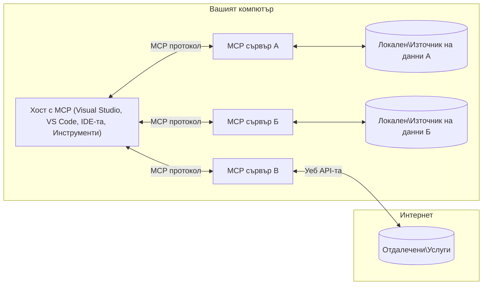

# Основни концепции на MCP: Майсторство на Model Context Protocol за интеграция на изкуствен интелект

[](https://youtu.be/earDzWGtE84)

_(Кликнете на изображението по-горе, за да гледате видеото на този урок)_

[Model Context Protocol (MCP)](https://github.com/modelcontextprotocol) е мощна, стандартизирана рамка, която оптимизира комуникацията между големи езикови модели (LLMs) и външни инструменти, приложения и източници на данни.
Този наръчник ще ви преведе през основните концепции на MCP. Ще научите за архитектурата клиент-сървър, основните компоненти, механиката на комуникация и най-добрите практики за имплементация.

- **Контрол и съгласие на потребителя**: Хостовете трябва ясно да показват какви данни и инструменти един сървър предоставя, да позволяват на потребителите да отказват операции и да получават изрично потвърждение за чувствителни или значими действия. MCP не изисква диалог за потвърждение преди всяко повикване на инструмент.


- **Защита на поверителността на данните**: Потребителските данни се предоставят само с изрично съгласие и трябва да бъдат защитени чрез здрави контролни механизми за достъп през целия жизнен цикъл на взаимодействието. Имплементациите трябва да предотвратяват неоторизирана трансмисия на данни и да спазват строги граници за поверителност.

- **Безопасност при изпълнение на инструменти**: Хостовете трябва да правят повикванията на инструменти видими и да дават възможност на човека да ги откаже. Чувствителните операции трябва да показват входните данни към инструмента и влиянието преди изпълнението, с мерки за сигурност, които предотвратяват нежелани или злонамерени действия.


- **Транспортна сигурност**: Отдалечените връзки трябва да използват HTTPS и модела за удостоверяване на MCP. Локалните stdio сървъри разчитат на изолация на процеси, доверена конфигурация и сигурно боравене с наследени идентификационни данни.


#### Насоки за имплементация:

- **Управление на разрешенията**: Имплементирайте детайлни системи за разрешения, които позволяват на потребителите да контролират кои сървъри, инструменти и ресурси са достъпни
- **Удостоверяване и авторизация**: Използвайте сигурни методи за удостоверяване (OAuth, API ключове) с правилно управление и изтичане на токени
- **Валидация на входни данни**: Валидирайте всички параметри и входни данни според дефинирани схеми, за да предотвратите инжекционни атаки
- **Регистриране на действията (логване)**: Поддържайте изчерпателни записи на всички операции за мониторинг на сигурността и съответствие

## Обзор

Този урок разглежда основната архитектура и компоненти, които съставляват екосистемата на Model Context Protocol (MCP). Ще научите за клиент-сървър архитектурата, ключовите компоненти и комуникационните механизми, които задвижват взаимодействията с MCP.

## Ключови учебни цели

Към края на този урок ще:

- Разберете архитектурата клиент-сървър на MCP.
- Идентифицирате ролите и отговорностите на Хостове, Клиенти и Сървъри.
- Анализирате основните функции, които правят MCP гъвкав слой за интеграция.
- Научите как се движи информацията в екосистемата на MCP.
- Получите практични знания чрез примери с код на .NET, Java, Python и JavaScript.

## Архитектурата на MCP: По-задълбочен поглед

Екосистемата на MCP е изградена на модел клиент-сървър. Тази модулна структура позволява на AI приложенията ефективно да взаимодействат с инструменти, бази данни, API-та и контекстуални ресурси. Нека разгледаме тази архитектура чрез основните ѝ компоненти.

В своята същност MCP следва архитектура клиент-сървър, където хост приложението може да се свързва с множество сървъри:


```mermaid
flowchart LR
    subgraph "Вашият компютър"
        Host["Хост с MCP (Visual Studio, VS Code, IDE-та, Инструменти)"]
        S1["MCP сървър А"]
        S2["MCP сървър Б"]
        S3["MCP сървър В"]
        Host <-->|"MCP протокол"| S1
        Host <-->|"MCP протокол"| S2
        Host <-->|"MCP протокол"| S3
        S1 <--> D1[("Локален\Източник на данни А")]
        S2 <--> D2[("Локален\Източник на данни Б")]
    end
    subgraph "Интернет"
        S3 <-->|"Уеб API-та"| D3[("Отдалечени\Услуги")]
    end
```

- **MCP хостове**: Програми като VSCode, Claude Desktop, IDE-та или AI инструменти, които искат достъп до данни чрез MCP
- **MCP клиенти**: Компоненти на протокола, които поддържат една логическа връзка със сървър; заявките MCP `2026-07-28` не зависят от една постоянна връзка или сесия

  сесия

- **MCP сървъри**: Леки програми, които всяка излагат специфични възможности чрез стандартизирания Model Context Protocol
- **Локални източници на данни**: Файловете, базите данни и услугите на вашия компютър, до които MCP сървърите могат да имат сигурен достъп
- **Отдалечени услуги**: Външни системи, достъпни през интернет, към които MCP сървърите могат да се свържат чрез API-та.

Протоколът MCP е развиващ се стандарт, използващ версии, базирани на дати
(формат ГГГГ-ММ-ДД). Текущата версия на протокола е **2026-07-28**. Вижте
[спецификацията на протокола 2026-07-28](https://modelcontextprotocol.io/specification/2026-07-28/).

> **Текущо издание:** MCP `2026-07-28` прави протокола безсъстояниев на
> транспортния слой като премахва ръкостискането `initialize` и сесионните ID-та на протокола.
> Той също формализира рамка за разширения и отпада
> Roots, Sampling и Logging в полза на по-нови модели. Вижте
> [Какво се промени в MCP: спецификация 2026-07-28](./mcp-2026-07-28.md)
> за пълно обяснение и указания за миграция. Примерите, които изрично са насочени
> към `2025-11-25`, се запазват като уроци за съвместимост с наследство.

### 1. Хостове

В Model Context Protocol (MCP), **Хостовете** са AI приложения, които служат като основен интерфейс, чрез който потребителите взаимодействат с протокола. Хостовете координират и управляват връзки с множество MCP сървъри чрез създаване на специализирани MCP клиенти за всяка сървърна връзка. Примери за хостове включват:

- **AI приложения**: Claude Desktop, Visual Studio Code, Claude Code
- **Среда за разработка**: IDE и редактори на код с MCP интеграция  
- **Персонализирани приложения**: Специално изградени AI агенти и инструменти

**Хостовете** са приложения, които координират взаимодействия с AI модели. Те:

- **Оркестрират AI модели**: Изпълняват или взаимодействат с LLM, за да генерират отговори и да координират AI работни потоци
- **Управляват клиентски отношения**: Създават и управляват един MCP клиент за всеки MCP
  сървър, който хостът използва
- **Контролират потребителския интерфейс**: Управляват поток на разговор, взаимодействия с потребителя и представяне на отговори  
- **Прилагат сигурност**: Контролират разрешения, ограничения за сигурност и удостоверяване
- **Обработват съгласие от потребителя**: Управляват одобрението от потребителя за споделяне на данни и изпълнение на инструменти


### 2. Клиенти

**Клиентите** са компоненти на протокола, създадени от хост за конкретни MCP
сървъри. Това е логическо съотношение едно към едно, а не изискване за
постоянна мрежова връзка. В MCP `2026-07-28` всяка заявка е
самостоятелна и може да бъде обработена от всяка сървърна инстанция.

**Клиентите** са свързващи компоненти вътре в хост приложението. Те:

- **Комуникация по протокола**: Изпращат JSON-RPC 2.0 заявки към сървъри с подсказки и инструкции
- **Откриване на възможности**: Използват `server/discover` за да научат за поддържаните версии на протокола, възможности и разширения на сървъра

- **Изпълнение на инструменти**: Управляват заявки за изпълнение на инструменти от модели и обработват отговорите
- **Актуализации в реално време**: Обработват уведомления и актуализации в реално време от сървърите
- **Обработка на отговори**: Обработват и форматират отговорите на сървъра за показване на потребителите

### 3. Сървъри


**Сървърите** са програми, които предоставят контекст, инструменти и възможности на MCP клиентите. Те могат да се изпълняват локално (на същата машина като Хоста) или дистанционно (на външни платформи) и отговарят за обработката на заявките на клиентите и предоставянето на структурирани отговори. Сървърите излагат специфична функционалност чрез стандартизирания Протокол за Моделен Контекст.

**Сървърите** са услуги, които предоставят контекст и възможности. Те:


- **Регистрация на функции**: Регистрирайте и предоставяйте наличните примитиви (ресурси, подсказки, инструменти) на клиентите
- **Обработка на заявки**: Получавайте и изпълнявайте повиквания на инструменти, заявки за ресурси и заявки за подсказки от клиентите
- **Предоставяне на контекст**: Осигурете контекстуална информация и данни за подобряване на отговорите на модела
- **Управление на състоянието**: Поддържайте състоянието на приложението с явни дескриптори, предавани
  в заявките при необходимост; MCP `2026-07-28` няма сесии на ниво протокол
- **Известия в реално време**: Изпращайте известия за промени и актуализации на възможностите към свързаните клиенти

Сървърите могат да бъдат разработвани от всеки за разширяване на възможностите на модела със специализирана функционалност и поддържат както локални, така и отдалечени сценарии на внедряване.

### 4. Примитиви на сървъра

Сървърите в Протокола за контекст на модела (MCP) предоставят три основни **примитива**, които дефинират фундаментални градивни блокове за богати взаимодействия между клиенти, хостове и езикови модели. Тези примитиви уточняват типовете контекстуална информация и действия, налични чрез протокола.

MCP сървърите могат да предоставят всяка комбинация от следните три основни примитива:

#### Ресурси

**Ресурсите** са източници на данни, които предоставят контекстуална информация за AI приложенията. Те представляват статично или динамично съдържание, което може да подобри разбирането и вземането на решения от моделите:

- **Контекстуални данни**: Структурирана информация и контекст за използване от AI моделите
- **Бази знания**: Репозитории с документи, статии, ръководства и научни трудове
- **Локални източници на данни**: Файлове, бази данни и информация от локалната система
- **Външни данни**: Отговори от API, уеб услуги и отдалечени системни данни
- **Динамично съдържание**: Данни в реално време, които се обновяват според външни условия

Ресурсите се идентифицират чрез URI и поддържат откриване чрез методите `resources/list` и извличане чрез `resources/read`:

```text
file://documents/project-spec.md
database://production/users/schema
api://weather/current
```

#### Подсказки

**Подсказките** са многократно използваеми шаблони, които помагат за структуриране на взаимодействията с езиковите модели. Те предоставят стандартизирани модели на взаимодействие и шаблонни работни потоци:

- **Взаимодействия базирани на шаблони**: Предварително структурираните съобщения и начални реплики в разговор
- **Шаблони за работни потоци**: Стандартизирани последователности за често срещани задачи и взаимодействия
- **Примери с малко данни**: Шаблони базирани на примери за инструкции към модела
- **Системни подсказки**: Основни подсказки, които дефинират поведението и контекста на модела
- **Динамични шаблони**: Параметризирани подсказки, адаптиращи се към конкретни контексти

Подсказките поддържат заместване на променливи и могат да бъдат откривани чрез `prompts/list` и извличани с `prompts/get`:

```markdown
Generate a {{task_type}} for {{product}} targeting {{audience}} with the following requirements: {{requirements}}
```

#### Инструменти

**Инструментите** са изпълними функции, които AI моделите могат да извикват, за да изпълняват конкретни действия. Те представляват "глаголите" в екосистемата на MCP, позволявайки на моделите да взаимодействат с външни системи:

- **Изпълними функции**: Отделни операции, които моделите могат да извикват с конкретни параметри
- **Интеграция с външни системи**: Повиквания към API, заявки към бази данни, файлови операции, изчисления
- **Уникална идентичност**: Всеки инструмент има уникално име, описание и схема на параметрите
- **Структурирана входно/изходна информация**: Инструментите приемат валидирани параметри и връщат структурирани, типизирани отговори
- **Възможности за действие**: Позволяват на моделите да изпълняват реални действия и да получават актуални данни

Инструментите се дефинират с JSON Schema за валидиране на параметри и се откриват чрез `tools/list`, а се изпълняват чрез `tools/call`. Инструментите могат също така да включват **икони** като допълнителни метаданни за по-добро представяне в потребителския интерфейс.

**Анотации на инструментите**: Инструментите поддържат анотации на поведението (напр. `readOnlyHint`, `destructiveHint`), които описват дали инструментът е само за четене или е разрушителен, помагайки на клиентите да вземат информирани решения за изпълнението на инструмента.

Примерна дефиниция на инструмент:

```typescript
server.tool(
  "search_products", 
  {
    query: z.string().describe("Search query for products"),
    category: z.string().optional().describe("Product category filter"),
    max_results: z.number().default(10).describe("Maximum results to return")
  }, 
  async (params) => {
    // Изпълнете търсене и върнете структурирани резултати
    return await productService.search(params);
  }
);
```

## Клиентски примитиви

В Протокола за контекст на модела (MCP), **клиентите** могат да предоставят примитиви, които позволяват на сървърите да искат допълнителни възможности от хост приложението. Тези клиентски примитиви позволяват по-богати, по-интерактивни реализации на сървъри, които могат да достъпват възможностите на AI модела и взаимодействията с потребителите.

### Семплиране

> **Остаряло в MCP `2026-07-28`:** Семплирането остава налично за
> съвместимост, но новите реализации трябва да се интегрират директно с API на доставчик на LLM.
> Подлежи на премахване в първата ревизия на спецификацията,
> издадена на или след 28 юли 2027. Вижте
> [Какво се промени в MCP: Спецификацията от 2026-07-28](./mcp-2026-07-28.md).

**Семплирането** позволява на сървърите да искат завършвания от езиковия модел на AI приложението на клиента. Този примитив дава възможност на сървърите да достъпват възможностите на LLM без да вграждат собствени зависимости към моделите:

- **Независим достъп до модел**: Сървърите могат да искат завършвания без да включват SDK-та на LLM или да управляват достъп до модел
- **AI, иницииран от сървъра**: Позволява на сървърите автономно да генерират съдържание, използвайки AI модела на клиента
- **Рекурсивни LLM взаимодействия**: Поддържа сложни сценарии, при които сървърите се нуждаят от AI помощ за обработка
- **Динамично генериране на съдържание**: Позволява на сървърите да създават контекстуални отговори с използване на модела на хоста
- **Поддръжка за извикване на инструменти**: Сървърите могат да включват параметри `tools` и `toolChoice`, за да позволят на модела на клиента да извиква инструменти по време на семплиране

Семплирането използва метода `sampling/createMessage`, при който сървърите искат
завършване от клиентите.

### Корени

> **Остаряло в MCP `2026-07-28`:** Корените остават налични за
> съвместимост, но новите реализации трябва да предават директории или файлове чрез
> параметри на инструменти, URI-та на ресурси или конфигурация на сървъра. Корените подлежат
> на премахване в първата ревизия на спецификацията, издадена на или след 28
> юли 2027. Вижте
> [Какво се промени в MCP: Спецификацията от 2026-07-28](./mcp-2026-07-28.md).

**Корените** предоставят стандартизиран начин за клиентите да идентифицират файлови системи,
които са релевантни за сървърите:

- **Подсказки от файловата система**: Идентифицират директории и файлове, релевантни за заявката
- **Отделна авторизация**: Не предоставят достъп или не налагат защитна граница
- **Възможност на заявка**: Клиентите рекламират поддръжката на Корени в метаданните на заявката
- **Идентификация базирана на URI**: Корените използват URI-та `file://` за идентифициране на достъпни директории и файлове

В MCP `2026-07-28`, сървърът прави заявка `roots/list` чрез
резултат `InputRequiredResult`, докато обработва поддържана клиентска заявка. Клиентът
връща корените при повторно изпращане на оригиналната заявка.

### Извличане на информация

**Извличането** позволява на сървърите да искат допълнителна информация или потвърждение от потребителите чрез клиентския интерфейс:

- **Заявки за потребителски вход**: Сървърите могат да поискат допълнителна информация, когато е необходима за изпълнение на инструмент
- **Диалози за потвърждение**: Искане за одобрение от потребителя при чувствителни или значими операции
- **Интерактивни работни потоци**: Позволява на сървърите да създават стъпка по стъпка взаимодействия с потребителя
- **Динамично събиране на параметри**: Събиране на липсващи или опционални параметри по време на изпълнение на инструмент

Извличането използва метода `elicitation/create` в рамките на
резултата `InputRequiredResult` за събиране на потребителски вход чрез интерфейса на клиента.


**Елициране на URL режим**: Сървърите могат също да изискват взаимодействие с потребители чрез URL, позволявайки на сървърите да насочват потребителите към външни уеб страници за удостоверяване, потвърждение или въвеждане на данни.

### Водене на журнали

> **Отменено в MCP `2026-07-28`:** Воденето на журнали остава налично за
> съвместимост, но новите реализации трябва да използват `stderr` със stdio и
> OpenTelemetry за структурирана наблюдаемост. Воденето на журнали подлежи на премахване
> при първия преглед на спецификацията, издаден на или след 28 юли 2027 г. Вижте
> [Какво се промени в MCP: Спецификацията от 2026-07-28](./mcp-2026-07-28.md).

**Воденето на журнали** позволява на сървърите да изпращат структурирани лог съобщения към клиентите за отстраняване на грешки, наблюдение и оперативна видимост:

- **Поддръжка за отстраняване на грешки**: Позволява на сървърите да предоставят подробни журнали на изпълнението за диагностика
- **Оперативен мониторинг**: Изпращане на актуализации на състоянието и показатели за представяне към клиентите
- **Докладване на грешки**: Предоставяне на подробен контекст за грешки и диагностична информация
- **Следи за одит**: Създаване на изчерпателни журнали за операциите и решенията на сървъра

Лог съобщенията се изпращат към клиентите, за да предоставят прозрачност за операциите на сървъра и да улеснят отстраняването на грешки.

## Поток на информация в MCP

Протоколът Model Context (MCP) определя структуриран поток на информация между хостове, клиенти, сървъри и модели. Разбирането на този поток помага да се изясни как се обработват потребителските заявки и как външни инструменти и данни се интегрират в отговорите на модела.

- **Хостът инициира връзката**  
  Хост приложението (например IDE или чат интерфейс) установява връзка със MCP сървър, обикновено чрез STDIO, WebSocket или друг поддържан транспорт.

- **Договаряне на възможности**  
  Клиентът (вграден в хоста) и сървърът обменят информация за поддържаните функции, инструменти, ресурси и версии на протокола. Това гарантира, че и двете страни разбират наличните възможности за сесията.

- **Потребителска заявка**  
  Потребителят взаимодейства с хоста (например въвежда подсказка или команда). Хостът събира този вход и го предава на клиента за обработка.

- **Използване на ресурс или инструмент**  
  - Клиентът може да поиска допълнителен контекст или ресурси от сървъра (като файлове, записи в база данни или статии от база знание) с цел обогатяване на разбирането на модела.
  - Ако моделът определи, че е необходим инструмент (напр. за извличане на данни, извършване на изчисление или извикване на API), клиентът изпраща заявка за използване на инструмента към сървъра, като уточнява името и параметрите на инструмента.

- **Изпълнение от сървъра**  
  Сървърът получава заявката за ресурс или инструмент, изпълнява необходимите операции (като стартиране на функция, заявка към база данни или извличане на файл) и връща резултатите към клиента в структурирана форма.

- **Генериране на отговор**  
  Клиентът интегрира отговорите на сървъра (данни от ресурси, резултати от инструменти и др.) в текущото взаимодействие с модела. Моделът използва тази информация, за да генерира изчерпателен и контекстуално уместен отговор.

- **Представяне на резултатите**  
  Хостът получава крайния резултат от клиента и го представя на потребителя, често включващ както генерирания текст от модела, така и резултати от изпълнението на инструменти или търсене на ресурси.

Този поток позволява на MCP да поддържа усъвършенствани, интерактивни и осведомени за контекст AI приложения чрез плавно свързване на модели с външни инструменти и източници на данни.

## Архитектура и слоеве на протокола

MCP се състои от два отделни архитектурни слоя, които работят заедно, за да осигурят пълна комуникационна рамка:

### Слой за данни

**Слойът за данни** реализира основния MCP протокол, използвайки **JSON-RPC 2.0** като основа. Този слой дефинира структурата на съобщенията, семантиката и моделите на взаимодействие:

#### Основни компоненти:

- **Протокол JSON-RPC 2.0**: Цялата комуникация използва стандартизиран формат на JSON-RPC 2.0 за извиквания на методи, отговори и уведомления
- **Управление на жизнения цикъл**: Обработва инициализация на връзка, договаряне на възможности и прекратяване на сесия между клиенти и сървъри
- **Примитиви на сървъра**: Позволява на сървърите да предоставят основна функционалност чрез инструменти, ресурси и подсказки
- **Примитиви на клиента**: Позволява на сървърите да заявяват семплиране от LLM, да извличат вход от потребителя и да изпращат лог съобщения
- **Незабавни уведомления**: Поддържа асинхронни уведомления за динамични актуализации без обхождане

#### Основни характеристики:

- **Договаряне на версията на протокола**: Използва версии на база дата (ГГГГ-ММ-ДД) за осигуряване на съвместимост
- **Откриване на възможности**: Клиенти и сървъри обменят информация за поддържани функции при инициализация
- **Сесии със състояние**: Поддържа състояние на връзката през множество взаимодействия за контекстуална непрекъснатост

### Транспортен слой

**Транспортният слой** управлява комуникационните канали, рамкиращи съобщенията и удостоверяването между участниците в MCP:

#### Поддържани транспортни механизми:

1. **STDIO транспорт**:
   - Използва стандартни входни/изходни потоци за директна комуникация между процеси
   - Оптимален за локални процеси на една и съща машина без мрежови натоварвания
   - Често използван за локални MCP сървърни реализации

2. **HTTP транспорт с поточно предаване**:
   - Използва HTTP POST за съобщения от клиент към сървър  
   - Опционални Server-Sent Events (SSE) за поточно предаване от сървър към клиент
   - Позволява отдалечена комуникация със сървъри през мрежи
   - Поддържа стандартно HTTP удостоверяване (Bearer токени, API ключове, персонализирани заглавки)
   - MCP препоръчва OAuth за сигурно удостоверяване с токени

#### Абстракция на транспорта:

Транспортният слой абстрахира детайлите на комуникацията от слоя за данни, позволявайки използването на един и същ JSON-RPC 2.0 формат на съобщенията през всички транспортни механизми. Тази абстракция позволява на приложенията безпроблемно да превключват между локални и отдалечени сървъри.

### Съображения за сигурност

Реализациите на MCP трябва да спазват няколко критични принципи за сигурност, за да осигурят безопасно, надеждно и защитено взаимодействие през всички операции на протокола:

- **Съгласие и контрол на потребителя**: Потребителите трябва да дават изрично съгласие преди да бъде осъществен достъп до данни или извършени операции. Те трябва ясно да контролират какви данни се споделят и кои действия се разрешават, подпомогнати от интуитивен интерфейс за преглед и одобрение на дейности.

- **Поверителност на данните**: Данните на потребителя трябва да бъдат достъпни само с изрично съгласие и трябва да бъдат защитени чрез подходящ контрол на достъпа. Реализациите на MCP трябва да предпазват от неоторизирана трансмисия на данни и да гарантират, че поверителността се поддържа във всички взаимодействия.

- **Безопасност на инструментите**: Преди използване на какъвто и да е инструмент е необходимо изрично съгласие на потребителя. Потребителите трябва ясно да разбират функционалността на всеки инструмент, а здравите граници за сигурност трябва да се налагат, за да се предотврати непреднамерено или несигурно изпълнение.

Следвайки тези принципи на сигурност, MCP осигурява поддържане на доверие, поверителност и безопасност на потребителите през всички взаимодействия с протокола, като същевременно позволява мощни AI интеграции.

## Примери с код: ключови компоненти

По-долу са дадени примери за код на няколко популярни програмни езика, които илюстрират как да се реализират ключови сървърни компоненти и инструменти на MCP.

### Пример .NET: Създаване на прост MCP сървър с инструменти

Ето практически пример с код на .NET, показващ как да се реализира прост MCP сървър с потребителски инструменти. Този пример демонстрира как да се дефинират и регистрират инструменти, обработват заявки и се свързва сървърът чрез Model Context Protocol.

```csharp
using System;
using System.Threading.Tasks;
using ModelContextProtocol.Server;
using ModelContextProtocol.Server.Transport;
using ModelContextProtocol.Server.Tools;

public class WeatherServer
{
    public static async Task Main(string[] args)
    {
        // Create an MCP server
        var server = new McpServer(
            name: "Weather MCP Server",
            version: "1.0.0"
        );
        
        // Register our custom weather tool
        server.AddTool<string, WeatherData>("weatherTool", 
            description: "Gets current weather for a location",
            execute: async (location) => {
                // Call weather API (simplified)
                var weatherData = await GetWeatherDataAsync(location);
                return weatherData;
            });
        
        // Connect the server using stdio transport
        var transport = new StdioServerTransport();
        await server.ConnectAsync(transport);
        
        Console.WriteLine("Weather MCP Server started");
        
        // Keep the server running until process is terminated
        await Task.Delay(-1);
    }
    
    private static async Task<WeatherData> GetWeatherDataAsync(string location)
    {
        // This would normally call a weather API
        // Simplified for demonstration
        await Task.Delay(100); // Simulate API call
        return new WeatherData { 
            Temperature = 72.5,
            Conditions = "Sunny",
            Location = location
        };
    }
}

public class WeatherData
{
    public double Temperature { get; set; }
    public string Conditions { get; set; }
    public string Location { get; set; }
}
```

### Пример Java: MCP сървърни компоненти


Този пример демонстрира същия MCP сървър и регистрация на инструменти като .NET примера по-горе, но реализиран на Java.

```java
import io.modelcontextprotocol.server.McpServer;
import io.modelcontextprotocol.server.McpToolDefinition;
import io.modelcontextprotocol.server.transport.StdioServerTransport;
import io.modelcontextprotocol.server.tool.ToolExecutionContext;
import io.modelcontextprotocol.server.tool.ToolResponse;

public class WeatherMcpServer {
    public static void main(String[] args) throws Exception {
        // Създайте MCP сървър
        McpServer server = McpServer.builder()
            .name("Weather MCP Server")
            .version("1.0.0")
            .build();
            
        // Регистрирайте метеорологичен инструмент
        server.registerTool(McpToolDefinition.builder("weatherTool")
            .description("Gets current weather for a location")
            .parameter("location", String.class)
            .execute((ToolExecutionContext ctx) -> {
                String location = ctx.getParameter("location", String.class);
                
                // Получаване на метеорологични данни (опростено)
                WeatherData data = getWeatherData(location);
                
                // Връщане на форматиран отговор
                return ToolResponse.content(
                    String.format("Temperature: %.1f°F, Conditions: %s, Location: %s", 
                    data.getTemperature(), 
                    data.getConditions(), 
                    data.getLocation())
                );
            })
            .build());
        
        // Свържете сървъра чрез stdio транспорт
        try (StdioServerTransport transport = new StdioServerTransport()) {
            server.connect(transport);
            System.out.println("Weather MCP Server started");
            // Поддържайте сървъра работещ, докато процесът не бъде прекратен
            Thread.currentThread().join();
        }
    }
    
    private static WeatherData getWeatherData(String location) {
        // Имплементацията би извикала метеорологичен API
        // Опростено за примерни цели
        return new WeatherData(72.5, "Sunny", location);
    }
}

class WeatherData {
    private double temperature;
    private String conditions;
    private String location;
    
    public WeatherData(double temperature, String conditions, String location) {
        this.temperature = temperature;
        this.conditions = conditions;
        this.location = location;
    }
    
    public double getTemperature() {
        return temperature;
    }
    
    public String getConditions() {
        return conditions;
    }
    
    public String getLocation() {
        return location;
    }
}
```

### Пример на Python: Създаване на MCP сървър

Този пример използва fastmcp, затова моля уверете се, че сте го инсталирали първо:

```python
pip install fastmcp
```
Примерен код:

```python
#!/usr/bin/env python3
import asyncio
from fastmcp import FastMCP
from fastmcp.transports.stdio import serve_stdio

# Създаване на FastMCP сървър
mcp = FastMCP(
    name="Weather MCP Server",
    version="1.0.0"
)

@mcp.tool()
def get_weather(location: str) -> dict:
    """Gets current weather for a location."""
    return {
        "temperature": 72.5,
        "conditions": "Sunny",
        "location": location
    }

# Алтернативен подход с използване на клас
class WeatherTools:
    @mcp.tool()
    def forecast(self, location: str, days: int = 1) -> dict:
        """Gets weather forecast for a location for the specified number of days."""
        return {
            "location": location,
            "forecast": [
                {"day": i+1, "temperature": 70 + i, "conditions": "Partly Cloudy"}
                for i in range(days)
            ]
        }

# Регистриране на клас инструменти
weather_tools = WeatherTools()

# Стартиране на сървъра
if __name__ == "__main__":
    asyncio.run(serve_stdio(mcp))
```

### Пример на JavaScript: Създаване на MCP сървър

Този пример показва създаването на MCP сървър на JavaScript и как да се регистрират два инструмента, свързани с времето.

```javascript
// Използване на официалния SDK за Model Context Protocol
import { McpServer } from "@modelcontextprotocol/sdk/server/mcp.js";
import { StdioServerTransport } from "@modelcontextprotocol/sdk/server/stdio.js";
import { z } from "zod"; // За валидиране на параметри

// Създаване на MCP сървър
const server = new McpServer({
  name: "Weather MCP Server",
  version: "1.0.0"
});

// Дефиниране на инструмент за прогнозиране на времето
server.tool(
  "weatherTool",
  {
    location: z.string().describe("The location to get weather for")
  },
  async ({ location }) => {
    // Обикновено би извикал API за времето
    // Оптимизиран за демонстрация
    const weatherData = await getWeatherData(location);
    
    return {
      content: [
        { 
          type: "text", 
          text: `Temperature: ${weatherData.temperature}°F, Conditions: ${weatherData.conditions}, Location: ${weatherData.location}` 
        }
      ]
    };
  }
);

// Дефиниране на инструмент за прогноза
server.tool(
  "forecastTool",
  {
    location: z.string(),
    days: z.number().default(3).describe("Number of days for forecast")
  },
  async ({ location, days }) => {
    // Обикновено би извикал API за времето
    // Оптимизиран за демонстрация
    const forecast = await getForecastData(location, days);
    
    return {
      content: [
        { 
          type: "text", 
          text: `${days}-day forecast for ${location}: ${JSON.stringify(forecast)}` 
        }
      ]
    };
  }
);

// Помощни функции
async function getWeatherData(location) {
  // Симулиране на повикване към API
  return {
    temperature: 72.5,
    conditions: "Sunny",
    location: location
  };
}

async function getForecastData(location, days) {
  // Симулиране на повикване към API
  return Array.from({ length: days }, (_, i) => ({
    day: i + 1,
    temperature: 70 + Math.floor(Math.random() * 10),
    conditions: i % 2 === 0 ? "Sunny" : "Partly Cloudy"
  }));
}

// Свързване на сървъра чрез stdio трансорт
const transport = new StdioServerTransport();
server.connect(transport).catch(console.error);

console.log("Weather MCP Server started");
```

Този пример на JavaScript демонстрира как да се създаде MCP сървър, използвайки Model Context Protocol SDK. Показва как да се регистрират два инструмента на име `weatherTool` и `forecastTool` и те да станат достъпни за MCP клиенти чрез `StdioServerTransport`.

## Сигурност и Авторизация

MCP включва няколко вградени концепции и механизми за управление на сигурността и авторизацията през целия протокол:

1. **Контрол на разрешения за инструменти**:  
  Клиентите могат да посочват кои инструменти моделът може да използва за всяка заявка или работен поток.
  Това гарантира, че само изрично упълномощени инструменти са достъпни, намалявайки
  риска от нежелани или несигурни операции.

2. **Автентикация**:  
  Сървърите могат да изискват автентикация преди да предоставят достъп до инструменти, ресурси или чувствителни операции. Това може да включва API ключове, OAuth токени или други схеми за автентикация. Правилната автентикация гарантира, че само доверени клиенти и потребители могат да използват възможностите на сървъра.

3. **Валидация**:  
  Валидация на параметрите се прилага за всички повиквания на инструменти. Всеки инструмент дефинира очакваните типове, формати и ограничения за своите параметри, а сървърът валидира входящите заявки съответно. Това предотвратява неправилни или злонамерени входни данни и помага да се поддържа цялостта на операциите.

4. **Ограничаване на честотата (Rate Limiting)**:  
  За да се предотврати злоупотреба и да се осигури справедливо използване на ресурсите на сървъра, MCP сървърите могат
  да прилагат ограничаване на честотата за повиквания на инструменти и достъп до ресурси. Ограниченията могат да
  се прилагат по потребител, удостоверение, операция или глобално.

Комбинирайки тези механизми, MCP осигурява сигурна основа за интегриране на езикови модели с външни инструменти и източници на данни, като същевременно дава на потребителите и разработчиците прецизен контрол върху достъпа и използването.

## Съобщения на протокола и поток на комуникация

Комуникацията в MCP използва структурирани **JSON-RPC 2.0** съобщения за осигуряване на ясни и надеждни взаимодействия между хостове, клиенти и сървъри. Протоколът дефинира специфични модели на съобщения за различни типове операции:

### Основни типове съобщения

#### **Метаданни на заявката и откриване**

- **Метаданни за всяка заявка**: Всяка заявка `2026-07-28` е самостоятелна и
  носи версията на протокола, идентичност на клиента и възможностите на клиента в `_meta`.
- **Заявка `server/discover`**: Извлича поддържаните версии на протокола, идентичността на сървъра,
  възможностите и разширенията, когато клиентът се нуждае от тях.
- **HTTP заглавки за стрийминг**: HTTP заявките включват `MCP-Protocol-Version` и
  `Mcp-Method`; методи, които адресират именован инструмент или ресурс, също включват
  `Mcp-Name`.

"Ръкостискането" `initialize`/`initialized` и идентификаторите на сесията на ниво протокол принадлежат
към по-ранни ревизии на протокола и не са част от MCP `2026-07-28`.

#### **Съобщения за откриване**
- **Заявка `tools/list`**: Открива наличните инструменти от сървъра
- **Заявка `resources/list`**: Списък на наличните ресурси (източници на данни)
- **Заявка `prompts/list`**: Извлича наличните шаблони за подкани

#### **Изпълнителни съобщения**  
- **Заявка `tools/call`**: Изпълнява конкретен инструмент с предоставени параметри
- **Заявка `resources/read`**: Извлича съдържание от конкретен ресурс
- **Заявка `prompts/get`**: Вземане на шаблон за подканване с опционални параметри

#### **Заявки за вход от страна на клиента**

- **`elicitation/create`**: Сървърът иска вход от потребителя чрез клиентския
  интерфейс по време на обработка на клиентска заявка.
- **`sampling/createMessage`**: Заявка на сървъра, която е остаряла, за попълване на LLM.
- **`roots/list`**: Заявка на сървъра, която е остаряла, за корени на файловата система на клиента.

Под `2026-07-28` входните заявки от сървър към клиент използват модела с няколко рунда пътуване `InputRequiredResult` вместо да разчитат на постоянна сесия.


#### **Известителни съобщения**
- **`notifications/tools/list_changed`**: Сървърът уведомява клиента за промени в инструментите
- **`notifications/resources/list_changed`**: Сървърът уведомява клиента за промени в ресурсите  
- **`notifications/prompts/list_changed`**: Сървърът уведомява клиента за промени в подкани

### Структура на съобщението:

Всички MCP съобщения следват формата JSON-RPC 2.0 с:
- **Заявителни съобщения**: Включват `id`, `method` и опционални `params`
- **Отговорни съобщения**: Включват `id` и или `result`, или `error`  
- **Известителни съобщения**: Включват `method` и опционални `params` (няма `id` и не се очаква отговор)

Тази структурирана комуникация осигурява надеждни, проследими и разширими взаимодействия, поддържащи усъвършенствани сценарии като актуализации в реално време, свързване на инструменти и стабилна обработка на грешки.

### Разширение за задачи

В MCP `2026-07-28` задачите са официално разширение, а не експериментална
основна функция. Използва преработен жизнен цикъл: `tasks/get`, `tasks/update` и
`tasks/cancel`; `tasks/list` е премахнат. Експерименталният
API от `2025-11-25` не е обратно съвместим с това разширение. Вижте
[Какво се промени в MCP: Спецификацията от 2026-07-28](./mcp-2026-07-28.md).

**Задачите** предоставят издръжливи обвивки за изпълнение за отложено извличане на резултати и
проследяване на състоянието:

- **Дълготрайни операции**: Проследяване на ресурсоемки изчисления, автоматизация на работни потоци и пакетна обработка
- **Отложени резултати**: Проверка на състоянието на задачите и извличане на резултатите, когато операциите завършат
- **Проследяване на статуса**: Мониторинг на напредъка на задача през дефинирани житейски етапи
- **Многостъпкови операции**: Поддръжка на сложни работни потоци, обхващащи множество взаимодействия

Задачите обвиват стандартните MCP заявки, за да осигурят асинхронни модели на изпълнение за операции, които не могат да завършат незабавно.

## Основни изводи

- **Архитектура**: MCP използва клиент-сървър архитектура, където хостове управляват множество клиентски връзки към сървъри
- **Участници**: Екосистемата включва хостове (AI приложения), клиенти (конектори за протоколи) и сървъри (доставчици на възможности)
- **Транспортни механизми**: Комуникацията поддържа stdio (локален) и Streamable
  HTTP (отдалечен); `2026-07-28` премахва самостоятелния GET event stream
- **Основни примитиви**: Сървърите предоставят инструменти (изпълними функции), ресурси (източници на данни) и подкани (шаблони)
- **Клиентски примитиви**: Elicitation поддържа потребителски вход, докато Sampling и
  Roots са запазени само като остарели функции за съвместимост
- **Разширения**: Официалното разширение Tasks предоставя издръжливи обвивки за изпълнение
  на дълготрайни операции

- **Основи на протокола**: Изграден върху JSON-RPC 2.0 с версиониране на база дата
  (текущ: `2026-07-28`)

- **Възможности в реално време**: Поддържа известия за динамични актуализации и синхронизация в реално време
- **Сигурността на първо място**: Изрично съгласие от потребителя, защита на личните данни и сигурен трансфер са основни изисквания

## Упражнение

Проектирайте прост MCP инструмент, който би бил полезен във вашата област. Определете:
1. Как ще се казва инструментът
2. Какви параметри ще приема
3. Какъв резултат ще връща
4. Как модел би могъл да използва този инструмент за решаване на потребителски проблеми


---

## Какво следва

Следва: [Глава 2: Сигурност](../02-Security/README.md)

Прочетете [Какво се промени в MCP: Спецификацията от 2026-07-28](./mcp-2026-07-28.md)
за насоки при миграция от `2025-11-25`.

---

<!-- CO-OP TRANSLATOR DISCLAIMER START -->
**Отказ от отговорност**:
Този документ е преведен с помощта на AI преводачески услуга [Co-op Translator](https://github.com/Azure/co-op-translator). Въпреки че се стремим към точност, моля имайте предвид, че автоматизираните преводи могат да съдържат грешки или неточности. Оригиналният документ на неговия роден език трябва да се счита за авторитетен източник. За критична информация се препоръчва професионален човешки превод. Ние не носим отговорност за каквито и да е недоразумения или неправилни тълкувания, произтичащи от използването на този превод.
<!-- CO-OP TRANSLATOR DISCLAIMER END -->