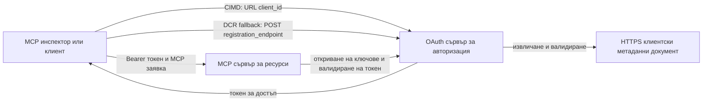

# Пример за упълномощаване с CIMD и DCR

Този пример на TypeScript сравнява два начина, по които OAuth клиент може да получи идентичност
преди да има достъп до защитен MCP сървър:

- **Документи с метаданни за клиентски идентификатор (CIMD)** използват стабилен HTTPS URL като
  `client_id`. Това е предпочитаният механизъм за клиенти и сървъри за упълномощаване,
  които нямат предварително установена връзка.
- **Динамична регистрация на клиент (DCR)** иска от сървъра за упълномощаване да издаде
  непрозрачен клиентски идентификатор по време на изпълнение. MCP `2026-07-28` запазва DCR само за обратна
  съвместимост.

Примерът използва стабилното MCP TypeScript SDK v2 и безсървърния
MCP `2026-07-28` модел на заявка. Той работи с външен OAuth 2.1/OpenID
Connect сървър за упълномощаване като Auth0. MCP сървърът е ресурсен
сървър: валидира токени за достъп, но не удостоверява потребители и не издава
токени.

## Цели на обучението

След изпълнението на този пример ще можете да:

- Обясните защо CIMD е предпочитан пред DCR за нови MCP клиенти.
- Публикувате валиден CIMD документ за публичен native клиент.
- Конфигурирате MCP ресурсен сървър за OAuth откриване и валидиране на JWT.
- Използвате CIMD и DCR с един и същ MCP сървър и сървър за упълномощаване.
- Налагате OAuth обхват в MCP инструмент.
- Идентифицирате кои отговорности принадлежат на клиента, ресурсния сървър и
  сървъра за упълномощаване.

## Архитектура



Сървърът за упълномощаване избира и валидира механизма за регистрация.
MCP сървърът вижда само получения проверен `client_id` претенция. HTTPS URL
с път идентифицира CIMD. Непрозрачен ID не е достатъчен, за да докаже DCR, защото
предварително регистриран клиент може също да използва непрозрачен ID; опционалната
настройка `DCR_CLIENT_ID_PREFIX` предоставя конкретен демонстрационен подсказка от доставчика.

## Приоритет на регистрацията

MCP клиентите, които поддържат всички механизми, трябва да използват този ред:

1. Използвайте предварително регистрирана клиентска информация, когато е налична.
2. Използвайте CIMD, когато сървърът за упълномощаване рекламира
   `client_id_metadata_document_supported: true`.
3. Използвайте DCR само като резервен вариант, когато сървърът рекламира
   `registration_endpoint`.
4. Попитайте потребителя за предварително регистрирана клиентска информация, ако никой от горните е
   наличен.

## Структура на проекта

```text
src/
  config.ts          Environment validation
  dcr.ts             DCR compatibility request
  mcp.ts             MCP tools and scope checks
  oauth.ts           Authorization metadata and JWT verification
  register-dcr.ts    DCR command-line helper
  registration.ts    CIMD document and mechanism classification
  server.ts          Express, OAuth discovery, and MCP endpoint
test/
  dcr.test.ts
  oauth.test.ts
  registration.test.ts
  server.test.ts
```

## Предпоставки

- Node.js 20.6 или по-нова версия. Скриптовете използват `--env-file` и `--import`.
- Сървър за упълномощаване OAuth 2.1/OpenID Connect, който поддържа:
  - Поток с код за упълномощаване със S256 PKCE.
  - OAuth Protected Resource Metadata и Resource Indicators.
  - JWT токени за достъп и JWKS крайна точка.
  - CIMD, плюс DCR ако искате да сравните наследствения резервен механизъм.
- MCP Inspector или друг MCP клиент `2026-07-28`.
- Публичен HTTPS URL за CIMD документа. Развойният тунел е подходящ
  за лаборатория; използвайте стабилен домейн в продукция.

## Инсталиране и тест

```bash
npm install
npm run build
npm test
```

Дванадесетте теста използват локални ключове и симулирани HTTP крайни точки. Те не изискват
акаунт в сървър за упълномощаване. Те проверяват:

- Формата на CIMD документа и ограниченията за URL.
- Коректно класифициране на URL и непрозрачни клиентски идентификатори.
- Обработката на заявки и отговори на DCR.
- Отхвърляне на несигурни неконтролирани DCR крайни точки.

- Проверка на JWT подпис, издател, аудитория, срок на валидност, клиентски ID и обхват.
- Извикване в процеса на MCP `2026-07-28` към `registration-info`.

## Конфигурирайте сървъра за упълномощаване

Точните имена на контрола варират според доставчика. Конфигурирайте тези функции:

1. Създайте API или ресурсен сървър, чиито идентификатор точно съвпада с вашия MCP
   URL, включително `/mcp`, например `http://127.0.0.1:3001/mcp`.
2. Използвайте RS256 токени за достъп и включете `client_id` или `azp` претенция.
3. Добавете разрешението или обхвата `tool:greet`.
4. Активирайте flow за код за упълномощаване с S256 PKCE за публични нативни клиенти.
5. Активирайте документи за клиентска метаданни.
6. Само за сравнение, активирайте Динамична регистрация на клиент.
7. Уверете се, че метаданните на сървъра за упълномощаване рекламират:
   - `issuer`
   - `authorization_endpoint`
   - `token_endpoint`
   - `jwks_uri`
   - `client_id_metadata_document_supported: true`
   - `registration_endpoint`, когато е активиран DCR

### Пример с Auth0

За Auth0 активирайте регистрация на документи за клиентска метаданни, динамична
регистрация на приложения OIDC и съвместимост с параметър Resource. Създайте API
с идентификатор точно на MCP URL и добавете разрешението `tool:greet`.
Позволете на тестови потребители и клиенти на трети страни да поискат това разрешение.

Таблата за управление на доставчика и наличността на функции се променят с течение на времето. Проверете
документацията на доставчика, преди да използвате тези настройки извън тази лаборатория.

## Конфигурирайте примера

Създайте `.env` от примера:

```powershell
Copy-Item .env.example .env
```

В shell с поддръжка на bash:

```bash
cp .env.example .env
```

Задайте тези стойности:

```dotenv
MCP_SERVER_URL=http://127.0.0.1:3001/mcp
AUTHORIZATION_SERVER_ISSUER=https://your-tenant.example.com/
AUTHORIZATION_SERVER_METADATA_URL=https://your-tenant.example.com/.well-known/openid-configuration
CLIENT_METADATA_URL=https://your-public-host.example.com/client-metadata.json
OAUTH_REDIRECT_URIS=http://127.0.0.1:6274/oauth/callback
DCR_CLIENT_ID_PREFIX=tpc_
```

Важни детайли:

- `AUTHORIZATION_SERVER_ISSUER` трябва точно да съвпада с `issuer` в откритите
  метаданни на сървъра за упълномощаване, включително евентуален завършващ наклонен знак.
- `MCP_SERVER_URL` трябва да съвпада с аудиторията на токена за достъп.
- `CLIENT_METADATA_URL` трябва да използва HTTPS, да съдържа непразен път и да бъде
  публичният URL, който обслужва маршрута за метаданни. Query низове и фрагменти са
  отхвърлени, за да останат пътят и `client_id` идентични.
- `OAUTH_REDIRECT_URIS` е списък с позволени URI, разделени със запетая. По подразбиране е MCP
  Inspector loopback callback.
- `DCR_CLIENT_ID_PREFIX` е незадължителен и специфичен за доставчика. Оставете го празен, ако
  вашият доставчик няма надежден DCR префикс.

## Публикувайте CIMD документа

Стартирайте тунел, който препраща публичния си HTTPS произход към `127.0.0.1:3001`.
Задайте `CLIENT_METADATA_URL` на този произход плюс `/client-metadata.json`, след което изпълнете:

```bash
npm run build
npm start
```

Проверете и двата документа за откриване:

```bash
curl http://127.0.0.1:3001/health
curl http://127.0.0.1:3001/client-metadata.json
curl http://127.0.0.1:3001/.well-known/oauth-protected-resource/mcp
```

`client_id`, върнат от публичния HTTPS URL за метаданни, трябва да бъде абсолютно
идентичен с този URL байт за байт. Сървърът за упълномощаване трябва да валидира документа и
неговия URI за пренасочване преди издаване на токен.

> [!NOTE]
> Примерът хоства клиентския документ и MCP ресурсния сървър в един процес
> за да поддържа лабораторията малка. В продукция MCP клиентът държи и хоства своя CIMD
> документ независимо от ресурсния сървър.

## Сравнение между CIMD и DCR

Стартирайте MCP Inspector:

```bash
npx @modelcontextprotocol/inspector
```

Използвайте Streamable HTTP и се свържете с `http://127.0.0.1:3001/mcp`.


### CIMD (Предпочитано)


1. Въведете публичния `CLIENT_METADATA_URL` като OAuth Client ID.
2. Заявете `tool:greet` плюс всички идентификационни обхвати, необходими от вашия доставчик.
3. Завършете влизането и съгласието.
4. Извикайте `registration-info`. То докладва `mechanism: "cimd"`.
5. Извикайте `greet`, за да проверите прилагането на обхвата.

### DCR (Съвместимост при връщане назад)

1. Изчистете запазеното OAuth състояние на Inspector.
2. Оставете OAuth Client ID празно, за да може Inspector да използва рекламирания
   `registration_endpoint`.
3. Завършете влизането и съгласието.
4. Извикайте `registration-info`.
5. Ако `DCR_CLIENT_ID_PREFIX` съвпада с генерираните от доставчика идентификатори, инструментът
   докладва `mechanism: "dcr"`; в противен случай правилно докладва
   `opaque-client-id`.

Можете също да демонстрирате директно заявката за регистрация:

```bash
npm run build
npm run register:dcr
```

Помощникът отпечатва върнатия клиентски идентификатор, но никога не отпечатва клиентски таен ключ.
Третирайте всеки върнат таен ключ като чувствителен и го съхранявайте в подходящо хранилище за тайни.

## Инструменти

| Инструмент | Изискван обхват | Цел |
| --- | --- | --- |
| `registration-info` | Проверен клиент | Докладва типа клиентски идентификатор |
| `greet` | `tool:greet` | Демонстрира одобрение за всеки инструмент |

## Забележки за сигурността

- Валидирайте JWT подписите чрез JWKS крайна точка на сървъра за удостоверяване.
- Изисквайте точно съвпадение на издателя и аудиторията.
- Изисквайте срок на годност и твърдения за клиентски идентификатор.
- Никога не приемайте токен, издаден за друг ресурс.
- Никога не препращайте MCP токена към долен API.
- Дръжте DCR креденциалите обвързани с издателя, който ги създава.
- Валидирайте CIMD пренасочващи URI-та с точно съвпадение.
- Прилагайте контроли срещу SSRF, когато сървърът за удостоверяване извлича CIMD URL-та.
- Използвайте HTTPS за крайни точки за удостоверяване и метаданни извън
  разработката в loopback.
- Не правете извод за DCR от непрозрачен клиентски идентификатор, освен ако доставчикът не документира
  надеждна конвенция за идентифициране.

## Референции

- [Спецификация на MCP авторизация](https://modelcontextprotocol.io/specification/2026-07-28/basic/authorization)
- [MCP клиентска регистрация](https://modelcontextprotocol.io/specification/2026-07-28/basic/authorization/client-registration)
- [MCP най-добри практики за сигурност](https://modelcontextprotocol.io/specification/2026-07-28/basic/security_best_practices)
- [MCP TypeScript SDK v2 ръководство за авторизация](https://ts.sdk.modelcontextprotocol.io/v2/serving/authorization)
- [OAuth Dynamic Client Registration (RFC 7591)](https://datatracker.ietf.org/doc/html/rfc7591)
- [OAuth Client ID Metadata Document чернова](https://datatracker.ietf.org/doc/html/draft-ietf-oauth-client-id-metadata-document-00)

## Благодарности

Методът на обучение страница до страница бе вдъхновен от
[Sambego/auth0-xmcp-cimd](https://github.com/Sambego/auth0-xmcp-cimd). Това
пример е оригинална, доставчик-неутрална реализация, създадена с официалния
MCP TypeScript SDK v2 за тази учебна програма.

---

<!-- CO-OP TRANSLATOR DISCLAIMER START -->
**Отказ от отговорност**:
Този документ е преведен с помощта на AI преводачески услуга [Co-op Translator](https://github.com/Azure/co-op-translator). Въпреки че се стремим към точност, моля имайте предвид, че автоматизираните преводи могат да съдържат грешки или неточности. Оригиналният документ на неговия роден език трябва да се счита за авторитетен източник. За критична информация се препоръчва професионален човешки превод. Ние не носим отговорност за каквито и да е недоразумения или неправилни тълкувания, произтичащи от използването на този превод.
<!-- CO-OP TRANSLATOR DISCLAIMER END -->