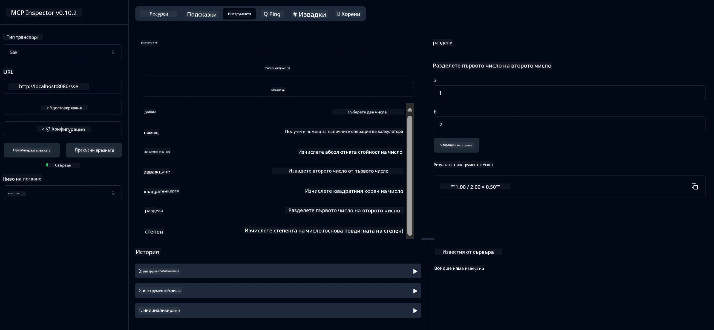

# Основна услуга на калкулатор MCP

> [!NOTE]
> Това Java решение използва наследения транспорт HTTP+SSE и е предназначено за SDK
> съвместим с MCP `2025-11-25`. То се запазва за съвпадение с учебния код;
> новите отдалечени сървъри трябва да използват поддръжка на Streamable HTTP `2026-07-28`.

Тази услуга предоставя основни операции на калкулатор чрез Протокола за контекст на модела (MCP) с използване на Spring Boot с WebFlux транспорт. Тя е проектирана като прост пример за начинаещи, които се учат на имплементации на MCP.

За повече информация, вижте справочната документация за [MCP Server Boot Starter](https://docs.spring.io/spring-ai/reference/api/mcp/mcp-server-boot-starter-docs.html).


## Използване на услугата

Услугата предлага следните API крайни точки чрез протокола MCP:

- `add(a, b)`: Събира две числа
- `subtract(a, b)`: Изважда второто число от първото
- `multiply(a, b)`: Умножава две числа
- `divide(a, b)`: Деление на първото число на второто (с проверка за нула)
- `power(base, exponent)`: Изчислява степен на число
- `squareRoot(number)`: Изчислява квадратен корен (с проверка за отрицателно число)
- `modulus(a, b)`: Изчислява остатък при деление
- `absolute(number)`: Изчислява абсолютната стойност

## Зависимости

Проектът изисква следните основни зависимости:

```xml
<dependency>
    <groupId>org.springframework.ai</groupId>
    <artifactId>spring-ai-starter-mcp-server-webflux</artifactId>
</dependency>
```

## Компилиране на проекта

Компилирайте проекта с помощта на Maven:
```bash
./mvnw clean install -DskipTests
```

## Стартиране на сървъра

### Използване на Java

```bash
java -jar target/calculator-server-0.0.1-SNAPSHOT.jar
```

### Използване на MCP Inspector

MCP Inspector е полезен инструмент за взаимодействие с MCP услуги. За да го използвате с тази калкулаторна услуга:

1. **Инсталирайте и стартирайте MCP Inspector** в нов терминален прозорец:
   ```bash
   npx @modelcontextprotocol/inspector
   ```

2. **Достъпете уеб интерфейса** като кликнете върху URL адреса показан от приложението (обикновено http://localhost:6274)

3. **Конфигурирайте връзката**:
   - Изберете типа транспорт "SSE"
   - Задайте URL адреса към работещия SSE край на вашия сървър: `http://localhost:8080/sse`
   - Кликнете "Connect"

4. **Използвайте инструментите**:
   - Кликнете "List Tools", за да видите наличните калкулаторни операции
   - Изберете инструмент и кликнете "Run Tool", за да изпълните операция



---

<!-- CO-OP TRANSLATOR DISCLAIMER START -->
**Отказ от отговорност**:
Този документ е преведен с помощта на AI преводачески услуга [Co-op Translator](https://github.com/Azure/co-op-translator). Въпреки че се стремим към точност, моля имайте предвид, че автоматизираните преводи могат да съдържат грешки или неточности. Оригиналният документ на неговия роден език трябва да се счита за авторитетен източник. За критична информация се препоръчва професионален човешки превод. Ние не носим отговорност за каквито и да е недоразумения или неправилни тълкувания, произтичащи от използването на този превод.
<!-- CO-OP TRANSLATOR DISCLAIMER END -->