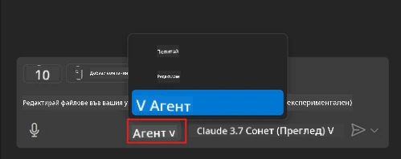
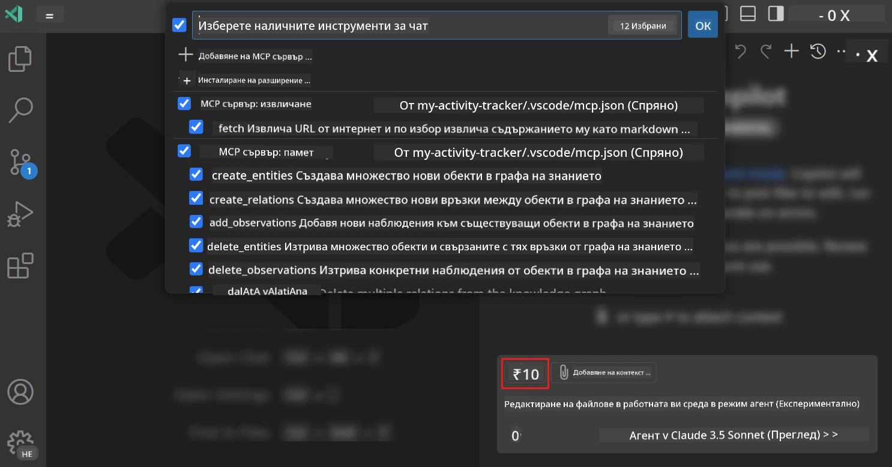
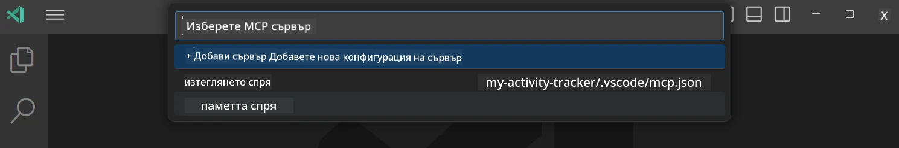
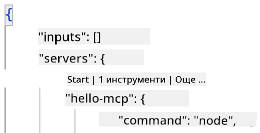
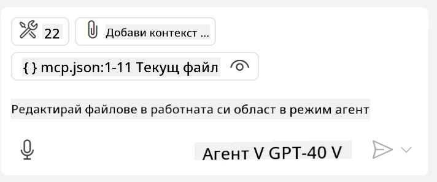
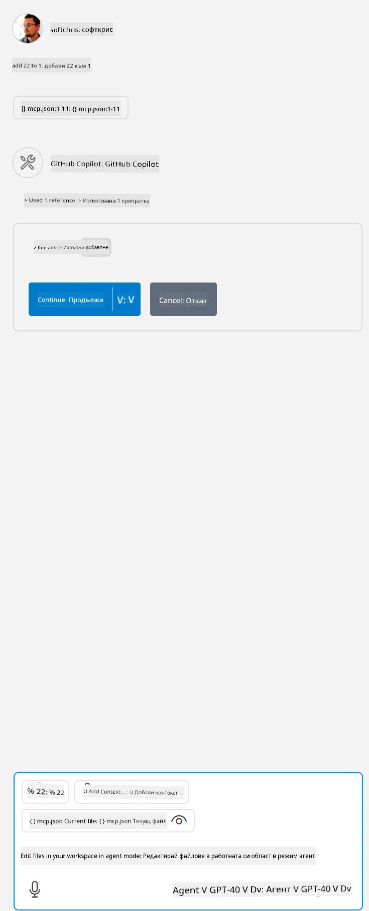

# Използване на сървър от режим GitHub Copilot Agent

Visual Studio Code и GitHub Copilot могат да действат като клиент и да използват MCP сървър. Защо бихте искали да направите това, може да попитате? Е, това означава, че каквито и функции да има MCP сървърът, те вече могат да се използват от вашето IDE. Представете си, че добавяте например MCP сървъра на GitHub, това би позволило контролиране на GitHub чрез подсказки, вместо да пишете конкретни команди в терминала. Или си представете каквото и да е, което би подобрило вашето разработващо преживяване, контролирано чрез естествен език. Сега започвате да виждате предимството, нали?

## Преглед

Този урок обхваща как да използвате Visual Studio Code и режима Agent на GitHub Copilot като клиент за вашия MCP сървър.

## Обучителни цели

В края на този урок ще можете да:

- Използвате MCP сървър чрез Visual Studio Code.
- Стартирате функции като инструменти чрез GitHub Copilot.
- Конфигурирате Visual Studio Code да намери и управлява вашия MCP сървър.

## Използване

Можете да управлявате вашия MCP сървър по два начина:

- Потребителски интерфейс, ще видите как става това по-късно в тази глава.
- Терминал, възможно е да управлявате неща от терминала чрез изпълнимия файл `code`:

  За да добавите MCP сървър към вашия потребителски профил, използвайте командния ред опция --add-mcp и подайте JSON конфигурацията на сървъра във вида {\"name\":\"server-name\",\"command\":...}.

  ```
  code --add-mcp "{\"name\":\"my-server\",\"command\": \"uvx\",\"args\": [\"mcp-server-fetch\"]}"
  ```

### Скриншотове





Нека да поговорим повече за използването на визуалния интерфейс в следващите секции.

## Подход

Ето как трябва да подходите на високо ниво:

- Конфигурирайте файл, за да намерите вашия MCP сървър.
- Стартирайте/Свържете се с този сървър, за да получите списък с неговите възможности.
- Използвайте тези възможности чрез интерфейса на GitHub Copilot Chat.

Отлично, сега след като разбираме потока, нека опитаме да използваме MCP сървър чрез Visual Studio Code чрез упражнение.

## Упражнение: Използване на сървър

В това упражнение ще конфигурираме Visual Studio Code да намери вашия MCP сървър, така че да може да се използва от интерфейса на GitHub Copilot Chat.

### -0- Предварителна стъпка, активиране на откриване на MCP сървър

Може да се наложи да активирате откриването на MCP сървъри.

1. Отидете на `File -> Preferences -> Settings` във Visual Studio Code.

1. Потърсете "MCP" и активирайте `chat.mcp.discovery.enabled` във файла settings.json.

### -1- Създаване на конфигурационен файл

Започнете с това да създадете конфигурационен файл в корена на вашия проект. Ще ви трябва файл на име MCP.json, който да поставите в папка с име .vscode. Той трябва да изглежда така:

```text
.vscode
|-- mcp.json
```

След това нека видим как можем да добавим запис за сървър.

### -2- Конфигуриране на сървър

Добавете следното съдържание в *mcp.json*:

```json
{
    "inputs": [],
    "servers": {
       "hello-mcp": {
           "command": "node",
           "args": [
               "build/index.js"
           ]
       }
    }
}
```

По-горе е прост пример как да стартирате сървър написан на Node.js, за други среди посочете правилната команда за стартиране чрез `command` и `args`.

### -3- Стартиране на сървъра

Сега, след като добавихте запис, нека стартираме сървъра:

1. Намерете своя запис в *mcp.json* и се уверете, че виждате иконата "плей":

    

1. Щракнете върху иконата "плей", трябва да видите иконата за инструменти в GitHub Copilot Chat да се увеличава с броя на наличните инструменти. Ако кликнете върху тази икона, ще видите списък с регистрираните инструменти. Можете да отметнете или махнете отметката на всеки инструмент в зависимост дали искате GitHub Copilot да ги използва като контекст:

  

1. За да изпълните инструмент, въведете подсказка, която знаете, че ще съвпадне с описанието на някой от вашите инструменти, например подсказка като "add 22 to 1":

  

  Трябва да видите отговор със стойност 23.

## Задача

Опитайте да добавите запис за сървър във вашия *mcp.json* файл и се уверете, че можете да стартирате и спирате сървъра. Също така се уверете, че можете да комуникирате с инструментите на вашия сървър чрез интерфейса на GitHub Copilot Chat.

## Решение

[Решение](./solution/README.md)

## Основни изводи

Основните изводи от тази глава са следните:

- Visual Studio Code е отличен клиент, който ви позволява да използвате няколко MCP сървъра и техните инструменти.
- Интерфейсът на GitHub Copilot Chat е как взаимодействате със сървърите.
- Можете да искате въвеждане от потребителя на данни като API ключове, които се предават на MCP сървъра при конфигуриране на записа в *mcp.json* файла.

## Примери

- [Java Calculator](../samples/java/calculator/README.md)
- [.Net Calculator](../../../../03-GettingStarted/samples/csharp)
- [JavaScript Calculator](../samples/javascript/README.md)
- [TypeScript Calculator](../samples/typescript/README.md)
- [Python Calculator](../../../../03-GettingStarted/samples/python)

## Допълнителни ресурси

- [Документи на Visual Studio](https://code.visualstudio.com/docs/copilot/chat/mcp-servers)

## Какво следва

- Следваща стъпка: [Създаване на stdio сървър](../05-stdio-server/README.md)

---

<!-- CO-OP TRANSLATOR DISCLAIMER START -->
**Отказ от отговорност**:
Този документ е преведен с помощта на AI преводачески услуга [Co-op Translator](https://github.com/Azure/co-op-translator). Въпреки че се стремим към точност, моля имайте предвид, че автоматизираните преводи могат да съдържат грешки или неточности. Оригиналният документ на неговия роден език трябва да се счита за авторитетен източник. За критична информация се препоръчва професионален човешки превод. Ние не носим отговорност за каквито и да е недоразумения или неправилни тълкувания, произтичащи от използването на този превод.
<!-- CO-OP TRANSLATOR DISCLAIMER END -->