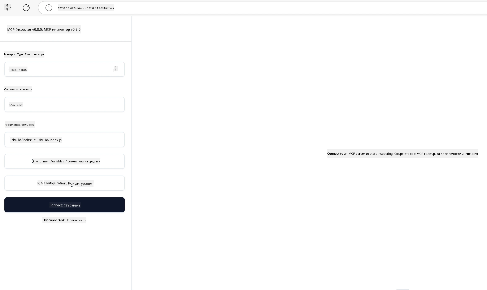

## Тестване и Отстраняване на грешки

Преди да започнете тестване на вашия MCP сървър, е важно да разберете наличните инструменти и най-добрите практики за отстраняване на грешки. Ефективното тестване гарантира, че вашият сървър се държи според очакванията и ви помага бързо да идентифицирате и разрешите проблеми. Следващата секция очертава препоръчителни подходи за валидиране на вашата MCP реализация.

## Преглед

Този урок обхваща как да изберете правилния подход за тестване и най-ефективния инструмент за тестване.

## Учебни цели

Към края на този урок ще можете да:

- Описвате различни подходи за тестване.
- Използвате различни инструменти за ефективно тестване на вашия код.


## Тестване на MCP сървъри

MCP предоставя инструменти, които да ви помогнат да тествате и отстранявате грешки на вашите сървъри:

- **MCP Inspector**: Команден инструмент, който може да се използва както като CLI инструмент, така и като визуален инструмент.
- **Ръчно тестване**: Можете да използвате инструмент като curl за изпълнение на уеб заявки, но който и да е инструмент, способен да изпълнява HTTP, ще свърши работа.
- **Unit тестване**: Възможно е да използвате предпочитаната от вас рамка за тестване, за да тествате функциите както на сървъра, така и на клиента.

### Използване на MCP Inspector

Описали сме използването на този инструмент в предишни уроци, но нека поговорим за него накратко на високо ниво. Това е инструмент, изграден на Node.js и можете да го използвате, като извикате изпълнимия файл `npx`, който ще изтегли и инсталира инструмента временно и ще го почисти след като приключи изпълнението на вашата заявка.

[MCP Inspector](https://github.com/modelcontextprotocol/inspector) ви помага да:

- **Откриване на възможностите на сървъра**: Автоматично разпознава наличните ресурси, инструменти и подканващи команди
- **Тестване на изпълнението на инструменти**: Опитвате различни параметри и виждате отговорите в реално време
- **Преглед на метаданни на сървъра**: Преглеждате информацията за сървъра, схеми и конфигурации

Типичното стартиране на инструмента изглежда така:

```bash
npx @modelcontextprotocol/inspector node build/index.js
```

Горната команда стартира MCP и неговия визуален интерфейс и отваря локален уеб интерфейс в браузъра ви. Можете да очаквате да видите табло с регистрираните MCP сървъри, техните налични инструменти, ресурси и подканващи команди. Интерфейсът ви позволява интерактивно да тествате изпълнението на инструменти, да преглеждате метаданни на сървъра и да разглеждате отговори в реално време, което улеснява валидирането и отстраняването на грешки при реализациите на вашия MCP сървър.

Ето как може да изглежда: 

Можете също да стартирате този инструмент в CLI режим, като добавите атрибут `--cli`. Ето пример за стартиране на инструмента в "CLI" режим, който изброява всички инструменти на сървъра:

```sh
npx @modelcontextprotocol/inspector --cli node build/index.js --method tools/list
```

### Ръчно тестване

Освен да стартирате инструмента inspector, за да тествате възможностите на сървъра, друг подобен подход е да стартирате клиент, способен да използва HTTP, например curl.

С curl можете директно да тествате MCP сървъри чрез HTTP заявки:

```bash
# Пример: Метаданни за тестов сървър
curl http://localhost:3000/v1/metadata

# Пример: Изпълни инструмент
curl -X POST http://localhost:3000/v1/tools/execute \
  -H "Content-Type: application/json" \
  -d '{"name": "calculator", "parameters": {"expression": "2+2"}}'
```

Както виждате от примера с curl, използвате POST заявка за извикване на инструмент, използвайки полезен товар (payload), съдържащ името на инструмента и неговите параметри. Изберете подхода, който ви пасва най-добре. CLI инструментите обикновено са по-бързи за използване и подлежат на скриптоверане, което може да е полезно в CI/CD среда.

### Unit тестване

Създайте unit тестове за вашите инструменти и ресурси, за да сте сигурни, че работят както се очаква. Ето примерен код за тестване.

```python
import pytest

from mcp.server.fastmcp import FastMCP
from mcp.shared.memory import (
    create_connected_server_and_client_session as create_session,
)

# Маркирайте целия модул за асинхронни тестове
pytestmark = pytest.mark.anyio


async def test_list_tools_cursor_parameter():
    """Test that the cursor parameter is accepted for list_tools.

    Note: FastMCP doesn't currently implement pagination, so this test
    only verifies that the cursor parameter is accepted by the client.
    """

 server = FastMCP("test")

    # Създайте няколко инструменти за тестове
    @server.tool(name="test_tool_1")
    async def test_tool_1() -> str:
        """First test tool"""
        return "Result 1"

    @server.tool(name="test_tool_2")
    async def test_tool_2() -> str:
        """Second test tool"""
        return "Result 2"

    async with create_session(server._mcp_server) as client_session:
        # Тествайте без параметър курсор (пропуснат)
        result1 = await client_session.list_tools()
        assert len(result1.tools) == 2

        # Тествайте с cursor=None
        result2 = await client_session.list_tools(cursor=None)
        assert len(result2.tools) == 2

        # Тествайте с cursor като низ
        result3 = await client_session.list_tools(cursor="some_cursor_value")
        assert len(result3.tools) == 2

        # Тествайте с празен низ за курсор
        result4 = await client_session.list_tools(cursor="")
        assert len(result4.tools) == 2
    
```

Предходният код прави следното:

- Използва pytest рамката, която ви позволява да създавате тестове като функции и да използвате assert изрази.
- Създава MCP сървър с два различни инструмента.
- Използва assert израз, за да провери дали определени условия са изпълнени.

Вижте [пълния файл тук](https://github.com/modelcontextprotocol/python-sdk/blob/main/tests/client/test_list_methods_cursor.py)

С помощта на горния файл можете да тествате собствения си сървър, за да сте сигурни, че възможностите са създадени както трябва.

Всички основни SDK имат подобни секции за тестване, така че можете да ги адаптирате към избраната от вас среда за изпълнение.

## Примери

- [Java Калкулатор](../samples/java/calculator/README.md)
- [.Net Калкулатор](../../../../03-GettingStarted/samples/csharp)
- [JavaScript Калкулатор](../samples/javascript/README.md)
- [TypeScript Калкулатор](../samples/typescript/README.md)
- [Python Калкулатор](../../../../03-GettingStarted/samples/python)

## Допълнителни ресурси

- [Python SDK](https://github.com/modelcontextprotocol/python-sdk)

## Какво следва

- Следва: [Деплоймент](../09-deployment/README.md)

---

<!-- CO-OP TRANSLATOR DISCLAIMER START -->
**Отказ от отговорност**:
Този документ е преведен с помощта на AI преводачески услуга [Co-op Translator](https://github.com/Azure/co-op-translator). Въпреки че се стремим към точност, моля имайте предвид, че автоматизираните преводи могат да съдържат грешки или неточности. Оригиналният документ на неговия роден език трябва да се счита за авторитетен източник. За критична информация се препоръчва професионален човешки превод. Ние не носим отговорност за каквито и да е недоразумения или неправилни тълкувания, произтичащи от използването на този превод.
<!-- CO-OP TRANSLATOR DISCLAIMER END -->