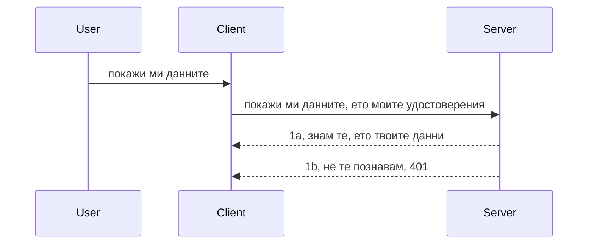

# Прост автентикейшън

MCP SDK поддържат използването на OAuth 2.1, което честно казано е доста сложен процес, включващ концепции като сървър за удостоверяване, сървър за ресурс, изпращане на идентификационни данни, получаване на код, разменяне на кода за носещ токен, докато най-накрая можете да получите данните от ресурсите. Ако не сте свикнали с OAuth, което е страхотно нещо за имплементиране, е добра идея да започнете с някакво базово ниво на удостоверяване и да надграждате към все по-добра и по-добра сигурност. Ето защо съществува тази глава – за да ви подготви за по-напреднало удостоверяване.

## Удостоверяване, какво имаме предвид?

Auth е съкращение от authentication ( удостоверяване) и authorization (авторизация). Идеята е, че трябва да направим две неща:

- **Удостоверяване**, което е процесът на установяване дали позволяваме на даден човек да влезе в нашия дом, че има правото да бъде „тук“, т.е. да има достъп до нашия сървър за ресурси, където се намират функциите на нашия MCP Server.
- **Авторизация**, е процесът на установяване дали даден потребител трябва да има достъп до конкретните ресурси, които иска, например тези поръчки или тези продукти, или дали може да чете съдържанието, но не и да го изтрива като друг пример.

## Идентификационни данни: как казваме на системата кой сме ние

Повечето уеб разработчици започват да мислят в термини на предоставяне на идентификационни данни на сървъра, обикновено това е таен ключ, който казва дали им е разрешено да бъдат тук - „Authentication“. Тези идентификационни данни обикновено са base64 кодирана версия на потребителско име и парола или API ключ, който уникално идентифицира конкретен потребител.

Това включва изпращането му чрез заглавката „Authorization“ по следния начин:

```json
{ "Authorization": "secret123" }
```

Това обикновено се нарича базово удостоверяване. Как работи цялостният поток, е по следния начин:


След като разберем как работи от гледна точка на поток, как да го реализираме? Повечето уеб сървъри имат концепция, наречена middleware – парче код, което се изпълнява като част от заявката и може да валидира идентификационните данни и, ако са валидни, да позволи заявката да премине. Ако заявката няма валидни идентификационни данни, получавате грешка за удостоверяване. Нека видим как може това да се реализира:

**Python**

```python
class AuthMiddleware(BaseHTTPMiddleware):
    async def dispatch(self, request, call_next):

        has_header = request.headers.get("Authorization")
        if not has_header:
            print("-> Missing Authorization header!")
            return Response(status_code=401, content="Unauthorized")

        if not valid_token(has_header):
            print("-> Invalid token!")
            return Response(status_code=403, content="Forbidden")

        print("Valid token, proceeding...")
       
        response = await call_next(request)
        # добавете всякакви потребителски заглавки или променете по някакъв начин отговора
        return response


starlette_app.add_middleware(CustomHeaderMiddleware)
```

Тук имаме:

- Създаден middleware, наречен `AuthMiddleware`, чийто метод `dispatch` се извиква от уеб сървъра.
- Добавен middleware към уеб сървъра:

    ```python
    starlette_app.add_middleware(AuthMiddleware)
    ```

- Написана логика за валидиране, която проверява дали header Authorization е наличен и дали подаденият таен ключ е валиден:

    ```python
    has_header = request.headers.get("Authorization")
    if not has_header:
        print("-> Missing Authorization header!")
        return Response(status_code=401, content="Unauthorized")

    if not valid_token(has_header):
        print("-> Invalid token!")
        return Response(status_code=403, content="Forbidden")
    ```

  ако таен ключ е наличен и валиден, позволяваме заявката да премине, като извикваме `call_next` и връщаме отговора.

    ```python
    response = await call_next(request)
    # добавете произволни заглавки за клиента или променете по някакъв начин отговора
    return response
    ```

Как работи – ако се направи уеб заявка към сървъра, middleware ще бъде извикан и според имплементацията си ще позволи заявката да премине или ще върне грешка, която показва, че клиентът няма право да продължи.

**TypeScript**

Тук създаваме middleware с популярния framework Express и прихващаме заявката преди да достигне MCP Server. Ето кода за това:

```typescript
function isValid(secret) {
    return secret === "secret123";
}

app.use((req, res, next) => {
    // 1. Присъства ли заглавката Authorization?
    if(!req.headers["Authorization"]) {
        res.status(401).send('Unauthorized');
    }
    
    let token = req.headers["Authorization"];

    // 2. Провери валидността.
    if(!isValid(token)) {
        res.status(403).send('Forbidden');
    }

   
    console.log('Middleware executed');
    // 3. Предава заявката към следващата стъпка в обработката на заявката.
    next();
});
```

В този код ние:

1. Проверяваме дали header Authorization е наличен. Ако не, изпращаме грешка 401.
2. Проверяваме дали идентификационните данни/токенът са валидни. Ако не, изпращаме грешка 403.
3. Накрая пропускаме заявката по пътя ѝ и връщаме поисканите ресурси.

## Упражнение: Имплементирайте удостоверяване

Нека приложим нашите знания. Ето плана:

Сървър

- Създаване на уеб сървър и MCP инстанция.
- Имплементиране на middleware за сървъра.

Клиент

- Изпращане на уеб заявка с идентификационни данни чрез header.

### -1- Създаване на уеб сървър и MCP инстанция

В първата стъпка трябва да създадем инстанция на уеб сървър и MCP Server.

**Python**

Тук създаваме инстанция на MCP Server, създаваме starlette уеб приложение и го хостваме с uvicorn.

```python
# създаване на MCP сървър

app = FastMCP(
    name="MCP Resource Server",
    instructions="Resource Server that validates tokens via Authorization Server introspection",
    host=settings["host"],
    port=settings["port"],
    debug=True
)

# създаване на starlette уеб приложение
starlette_app = app.streamable_http_app()

# обслужване на приложението чрез uvicorn
async def run(starlette_app):
    import uvicorn
    config = uvicorn.Config(
            starlette_app,
            host=app.settings.host,
            port=app.settings.port,
            log_level=app.settings.log_level.lower(),
        )
    server = uvicorn.Server(config)
    await server.serve()

run(starlette_app)
```

В този код ние:

- Създаваме MCP Server.
- Създаваме starlette уеб приложение от MCP Server, `app.streamable_http_app()`.
- Хостваме и обслужваме уеб приложението с uvicorn `server.serve()`.

**TypeScript**

Тук създаваме инстанция на MCP Server.

```typescript
const server = new McpServer({
      name: "example-server",
      version: "1.0.0"
    });

    // ... настройте сървърни ресурси, инструменти и подканващи съобщения ...
```

Създаването на MCP Server трябва да се случи в дефиницията на нашия POST /mcp рут, така че нека вземем горния код и го преместим така:

```typescript
import express from "express";
import { randomUUID } from "node:crypto";
import { McpServer } from "@modelcontextprotocol/sdk/server/mcp.js";
import { StreamableHTTPServerTransport } from "@modelcontextprotocol/sdk/server/streamableHttp.js";
import { isInitializeRequest } from "@modelcontextprotocol/sdk/types.js"

const app = express();
app.use(express.json());

// Карта за съхранение на трансфери по ID на сесия
const transports: { [sessionId: string]: StreamableHTTPServerTransport } = {};

// Обработка на POST заявки за комуникация клиент към сървър
app.post('/mcp', async (req, res) => {
  // Проверка за съществуващо ID на сесия
  const sessionId = req.headers['mcp-session-id'] as string | undefined;
  let transport: StreamableHTTPServerTransport;

  if (sessionId && transports[sessionId]) {
    // Повторна употреба на съществуващ трансфер
    transport = transports[sessionId];
  } else if (!sessionId && isInitializeRequest(req.body)) {
    // Ново инициализационно запитване
    transport = new StreamableHTTPServerTransport({
      sessionIdGenerator: () => randomUUID(),
      onsessioninitialized: (sessionId) => {
        // Съхраняване на трансфера по ID на сесия
        transports[sessionId] = transport;
      },
      // Защитата срещу DNS rebinding е изключена по подразбиране за обратно съвместимост. Ако стартирате този сървър
      // локално, уверете се, че сте задали:
      // enableDnsRebindingProtection: true,
      // allowedHosts: ['127.0.0.1'],
    });

    // Почистване на трансфера при затваряне
    transport.onclose = () => {
      if (transport.sessionId) {
        delete transports[transport.sessionId];
      }
    };
    const server = new McpServer({
      name: "example-server",
      version: "1.0.0"
    });

    // ... настройка на сървърни ресурси, инструменти и подкани ...

    // Свързване със сървъра MCP
    await server.connect(transport);
  } else {
    // Невалидна заявка
    res.status(400).json({
      jsonrpc: '2.0',
      error: {
        code: -32000,
        message: 'Bad Request: No valid session ID provided',
      },
      id: null,
    });
    return;
  }

  // Обработване на заявката
  await transport.handleRequest(req, res, req.body);
});

// Преизползваем обработчик за GET и DELETE заявки
const handleSessionRequest = async (req: express.Request, res: express.Response) => {
  const sessionId = req.headers['mcp-session-id'] as string | undefined;
  if (!sessionId || !transports[sessionId]) {
    res.status(400).send('Invalid or missing session ID');
    return;
  }
  
  const transport = transports[sessionId];
  await transport.handleRequest(req, res);
};

// Обработка на GET заявки за сървър към клиент уведомления чрез SSE
app.get('/mcp', handleSessionRequest);

// Обработка на DELETE заявки за прекратяване на сесията
app.delete('/mcp', handleSessionRequest);

app.listen(3000);
```

Сега виждате как създаването на MCP Server е преместено вътре в `app.post("/mcp")`.

Нека преминем към следващата стъпка – създаване на middleware за валидиране на постъпващите идентификационни данни.

### -2- Имплементиране на middleware за сървъра

Следва middleware частта. Тук ще създадем middleware, който търси идентификационни данни в header Authorization и ги валидира. Ако са приемливи, заявката продължава да прави това, което трябва (например изброяване на инструменти, четене на ресурс или каквато и да е функционалност на MCP, поискана от клиента).

**Python**

За създаването на middleware трябва да създадем клас, наследяващ `BaseHTTPMiddleware`. Има два интересни компонента:

- Заявката `request`, от която четем заглавките.
- `call_next` – callback, който трябва да извикаме ако клиентът е предоставил приемливо удостоверение.

Първо трябва да обработим случая, когато липсва header Authorization:

```python
has_header = request.headers.get("Authorization")

# няма присъстващ хедър, неуспех с 401, иначе продължи.
if not has_header:
    print("-> Missing Authorization header!")
    return Response(status_code=401, content="Unauthorized")
```

Тук изпращаме съобщение 401 unauthorized, тъй като клиентът не минава удостоверяването.

После, ако е подадено удостоверение, трябва да проверим валидността му така:

```python
 if not valid_token(has_header):
    print("-> Invalid token!")
    return Response(status_code=403, content="Forbidden")
```

Забележете, че тук изпращаме 403 forbidden съобщение. Ето пълния middleware с имплементацията на всичко споменато по-горе:

```python
class AuthMiddleware(BaseHTTPMiddleware):
    async def dispatch(self, request, call_next):

        has_header = request.headers.get("Authorization")
        if not has_header:
            print("-> Missing Authorization header!")
            return Response(status_code=401, content="Unauthorized")

        if not valid_token(has_header):
            print("-> Invalid token!")
            return Response(status_code=403, content="Forbidden")

        print("Valid token, proceeding...")
        print(f"-> Received {request.method} {request.url}")
        response = await call_next(request)
        response.headers['Custom'] = 'Example'
        return response

```

Добре, а функцията `valid_token`? Ето я по-долу:

```python
# НЕ използвайте за продукция - подобрете го !!
def valid_token(token: str) -> bool:
    # премахнете префикса "Bearer "
    if token.startswith("Bearer "):
        token = token[7:]
        return token == "secret-token"
    return False
```

Разбира се, това трябва да се подобри.

ВАЖНО: Никога не бива да имате тайни като тези в кода. Идеалният сценарий е да се взема стойността за сравнение от източник на данни или от IDP (identity service provider) или още по-добре, IDP да извършва валидацията.

**TypeScript**

За да го направим с Express, трябва да извикаме метода `use`, който приема middleware функции.

Трябва да:

- Взаимодейства с променливата request, за да провери подаденото удостоверение в свойството Authorization.
- Валидира удостоверението и ако е успешно, да позволи заявката да продължи и клиентът да получи ресурсите, които иска (например изброяване на инструменти, четене на ресурс или друго свързано с MCP).

Тук проверяваме дали header Authorization е наличен, а ако не, спираме заявката:

```typescript
if(!req.headers["authorization"]) {
    res.status(401).send('Unauthorized');
    return;
}
```

Ако header липсва, получавате 401 грешка.

После проверяваме дали удостоверението е валидно; ако не е, пак спираме заявката, но с различно съобщение:

```typescript
if(!isValid(token)) {
    res.status(403).send('Forbidden');
    return;
} 
```

Забележете, че тук се връща 403 грешка.

Ето пълния код:

```typescript
app.use((req, res, next) => {
    console.log('Request received:', req.method, req.url, req.headers);
    console.log('Headers:', req.headers["authorization"]);
    if(!req.headers["authorization"]) {
        res.status(401).send('Unauthorized');
        return;
    }
    
    let token = req.headers["authorization"];

    if(!isValid(token)) {
        res.status(403).send('Forbidden');
        return;
    }  

    console.log('Middleware executed');
    next();
});
```

Настроили сме уеб сървъра да приема middleware за проверка на идентификационните данни, които клиентът се надява да изпрати. А какво да кажем за самия клиент?

### -3- Изпращане на уеб заявка с идентификационни данни чрез header

Трябва да се уверим, че клиентът подава удостоверението чрез header. Като ще използваме MCP клиент за целта, трябва да разберем как се прави това.

**Python**

За клиента трябва да подадем header с удостоверението си по следния начин:

```python
# НЕ вграждайте стойността, най-малкото я пазете в променлива на средата или в по-сигурно хранилище
token = "secret-token"

async with streamablehttp_client(
        url = f"http://localhost:{port}/mcp",
        headers = {"Authorization": f"Bearer {token}"}
    ) as (
        read_stream,
        write_stream,
        session_callback,
    ):
        async with ClientSession(
            read_stream,
            write_stream
        ) as session:
            await session.initialize()
      
            # ЗАДАЧА, какво искате да се направи в клиента, напр. изброяване на инструменти, повикване на инструменти и т.н.
```

Забележете как попълваме свойството `headers` така: `headers = {"Authorization": f"Bearer {token}"}`.

**TypeScript**

Това може да стане на две стъпки:

1. Попълваме обект с конфигурация с удостоверението.
2. Предаваме конфигурационния обект на транспорта.

```typescript

// НЕ твърдо кодирате стойността както е показано тук. Минимум я задайте като променлива на средата и използвайте нещо като dotenv (в режим на разработка).
let token = "secret123"

// дефинирайте обект с опции за клиентски транспорт
let options: StreamableHTTPClientTransportOptions = {
  sessionId: sessionId,
  requestInit: {
    headers: {
      "Authorization": "secret123"
    }
  }
};

// предайте обекта с опции на транспорта
async function main() {
   const transport = new StreamableHTTPClientTransport(
      new URL(serverUrl),
      options
   );
```

Тук виждате как създадохме обект `options` и поставяме header-ите в свойството `requestInit`.

ВАЖНО: Как можем да подобрим нещата оттук нататък? Текущата имплементация има някои проблеми. Първо, подаването на идентификационни данни така е рисковано, ако поне нямате HTTPS. Дори и тогава може да бъде откраднато удостоверението, затова е нужна система, която да позволява лесно отнемане на токена и допълнителни проверки, като откъде по света идва заявката, дали не се случва прекалено често (поведение като бот) – накратко, има много въпроси за сигурността.

Все пак, за много прости API-та, където не искате никой да ползва API-то без удостоверяване, това е добър старт.

Сега нека се опитаме да втвърдим сигурността малко, като използваме стандартизиран формат като JSON Web Token, известен още като JWT или „JOT“ токени.

## JSON Web Токени, JWT

Опитваме да подобрим нещата, които изпращаме като идентификационни данни. Какви са непосредствените ползи от приемането на JWT?

- **Подобрения в сигурността**. При базовото удостоверяване изпращате потребителско име и парола като base64 токен (или API ключ) отново и отново, което увеличава риска. С JWT изпращате потребителското име и парола и получавате токен в отговор, а той е времево ограничен, т.е. изтича. JWT ви позволява лесно да използвате фини нива на достъп чрез роли, обхвати и разрешения.
- **Безсървърност и мащабируемост**. JWT са самостоятелни, съдържат цялата информация за потребителя, елиминирайки нуждата от съхранение на сесии на сървъра. Токенът може да бъде валидиран локално.
- **Интероперативност и федерация**. JWT е в центъра на Open ID Connect и се използва с известни доставчици на идентичност като Entra ID, Google Identity и Auth0. Те също така позволяват single sign on и много други, правейки ги корпоративно клас.
- **Модуларност и гъвкавост**. JWT могат да се ползват с API Gateway-та като Azure API Management, NGINX и др. Поддържат use authentication сценарии и комуникация сървър-сървър, включително имперсонация и делегация.
- **Производителност и кеширане**. JWT могат да бъдат кеширани след декодиране, намалявайки нуждата от повторен парсинг. Това помага особено при приложения с голям трафик, тъй като увеличава пропускателната способност и намалява натоварването върху инфраструктурата.
- **Разширени възможности**. Поддържат интроспекция (проверка на валидност на сървъра) и отнемане (правене на токена невалиден).

С всички тези ползи нека видим как можем да изведем имплементацията си на следващото ниво.

## Превръщане на базовото удостоверяване в JWT

Промените, които трябва да направим на голямо ниво, са:

- **Да се научим да конструираме JWT токен** и да го подготвим за изпращане от клиента към сървъра.
- **Да валидираме JWT токен** и ако е валиден, да позволим на клиента достъп до ресурсите.
- **Сигурно съхранение на токените** – как съхраняваме токена.
- **Защита на маршрутите** – трябва да защитим маршрути, в нашия случай конкретни MCP функции.
- **Добавяне на refresh токени** – да създаваме токени с кратък живот и refresh токени с дълъг живот, които могат да се ползват за нови токени при изтичане. Също да има refresh endpoint и стратегия за ротация.

### -1- Конструиране на JWT токен

Първо, JWT токенът има следните части:

- **header** – алгоритъм и тип токен.
- **payload** – твърдения, като sub (потребителят или субектът, когото токена представя; при удостоверяване обикновено userid), exp (когато изтича), role (ролята).
- **signature** – подписан с таен ключ или частен ключ.

За това трябва да конструираме header, payload и кодиран токен.

**Python**

```python

import jwt
import jwt
from jwt.exceptions import ExpiredSignatureError, InvalidTokenError
import datetime

# Секретен ключ, използван за подписване на JWT
secret_key = 'your-secret-key'

header = {
    "alg": "HS256",
    "typ": "JWT"
}

# информацията за потребителя и неговите претенции и време на изтичане
payload = {
    "sub": "1234567890",               # Тема (ID на потребителя)
    "name": "User Userson",                # Персонализирано твърдение
    "admin": True,                     # Персонализирано твърдение
    "iat": datetime.datetime.utcnow(),# Издадено на
    "exp": datetime.datetime.utcnow() + datetime.timedelta(hours=1)  # Изтичане
}

# кодирай го
encoded_jwt = jwt.encode(payload, secret_key, algorithm="HS256", headers=header)
```

В горния код сме:

- Дефинирали header с алгоритъм HS256 и тип JWT.
- Конструирали payload, който съдържа субект или потребителско ID, потребителско име, роля, кога е издаден и кога ще изтече, реализирайки времевото ограничение, което споменахме по-рано.

**TypeScript**

Тук ще имаме нужда от зависимости, които ще ни помогнат да конструираме JWT токена.

Зависимости

```sh

npm install jsonwebtoken
npm install --save-dev @types/jsonwebtoken
```

След като имаме това, нека създадем header, payload и през тях кодиран токен.

```typescript
import jwt from 'jsonwebtoken';

const secretKey = 'your-secret-key'; // Използвайте променливи на околната среда в продукция

// Дефинирайте полезния товар
const payload = {
  sub: '1234567890',
  name: 'User usersson',
  admin: true,
  iat: Math.floor(Date.now() / 1000), // Издаден на
  exp: Math.floor(Date.now() / 1000) + 60 * 60 // Изтича за 1 час
};

// Дефинирайте заглавката (по избор, jsonwebtoken задава стойности по подразбиране)
const header = {
  alg: 'HS256',
  typ: 'JWT'
};

// Създайте токена
const token = jwt.sign(payload, secretKey, {
  algorithm: 'HS256',
  header: header
});

console.log('JWT:', token);
```

Този токен:

Подписан с HS256  
Валиден за 1 час  
Съдържа твърдения като sub, name, admin, iat и exp.

### -2- Валидация на токен

Ще трябва и да валидираме токен, което трябва да се прави на сървъра, за да сме сигурни, че това, което клиентът изпраща, е валидно. Има много проверки – структура, валидност. Препоръчва се да добавите проверки дали потребителят е в системата ни и др.

За валидиране трябва да го декодираме, за да го прочетем и после да проверим валидността:

**Python**

```python

# Декодирайте и проверете JWT
try:
    decoded = jwt.decode(token, secret_key, algorithms=["HS256"])
    print("✅ Token is valid.")
    print("Decoded claims:")
    for key, value in decoded.items():
        print(f"  {key}: {value}")
except ExpiredSignatureError:
    print("❌ Token has expired.")
except InvalidTokenError as e:
    print(f"❌ Invalid token: {e}")

```

В този код извикваме `jwt.decode`, като даваме токена, таен ключ и избрания алгоритъм. Забележете, че използваме try-catch, тъй като неуспешната валидация води до изключение.

**TypeScript**

Тук трябва да извикаме `jwt.verify`, за да получим декодирана версия на токена, която да анализираме. Ако извикването се провали, значи структурата е неправилна или токенът не е валиден.

```typescript

try {
  const decoded = jwt.verify(token, secretKey);
  console.log('Decoded Payload:', decoded);
} catch (err) {
  console.error('Token verification failed:', err);
}
```

ЗАБЕЛЕЖКА: както споменахме, трябва да направите допълнителни проверки дали този токен сочи към потребител в системата ни и дали потребителят има заявените права.

Накрая нека разгледаме контрол на достъпа, основан на роли, известен като RBAC.
## Добавяне на контрол на достъпа базиран на роли

Идеята е да изразим, че различните роли имат различни права. Например, приемаме, че администраторът може да прави всичко, че нормалните потребители могат да четат/писат, а гостът може само да чете. Затова ето някои възможни нива на права:

- Admin.Write 
- User.Read
- Guest.Read

Нека разгледаме как можем да реализираме такъв контрол чрез middleware. Middlewares могат да се добавят на ниво маршрут, както и за всички маршрути.

**Python**

```python
from starlette.middleware.base import BaseHTTPMiddleware
from starlette.responses import JSONResponse
import jwt

# НЕ дръж тайната в кода, това е само за демонстрационни цели. Чети я от безопасно място.
SECRET_KEY = "your-secret-key" # постави това в променлива на средата
REQUIRED_PERMISSION = "User.Read"

class JWTPermissionMiddleware(BaseHTTPMiddleware):
    async def dispatch(self, request, call_next):
        auth_header = request.headers.get("Authorization")
        if not auth_header or not auth_header.startswith("Bearer "):
            return JSONResponse({"error": "Missing or invalid Authorization header"}, status_code=401)

        token = auth_header.split(" ")[1]
        try:
            decoded = jwt.decode(token, SECRET_KEY, algorithms=["HS256"])
        except jwt.ExpiredSignatureError:
            return JSONResponse({"error": "Token expired"}, status_code=401)
        except jwt.InvalidTokenError:
            return JSONResponse({"error": "Invalid token"}, status_code=401)

        permissions = decoded.get("permissions", [])
        if REQUIRED_PERMISSION not in permissions:
            return JSONResponse({"error": "Permission denied"}, status_code=403)

        request.state.user = decoded
        return await call_next(request)


```

Има няколко различни начина да добавим middleware, като по-долу:

```python

# Вариант 1: добавяне на middleware при създаване на starlette приложение
middleware = [
    Middleware(JWTPermissionMiddleware)
]

app = Starlette(routes=routes, middleware=middleware)

# Вариант 2: добавяне на middleware след като starlette приложението вече е създадено
starlette_app.add_middleware(JWTPermissionMiddleware)

# Вариант 3: добавяне на middleware за всеки маршрут
routes = [
    Route(
        "/mcp",
        endpoint=..., # обработващ функция
        middleware=[Middleware(JWTPermissionMiddleware)]
    )
]
```

**TypeScript**

Можем да използваме `app.use` и middleware, който ще се изпълнява за всички заявки.

```typescript
app.use((req, res, next) => {
    console.log('Request received:', req.method, req.url, req.headers);
    console.log('Headers:', req.headers["authorization"]);

    // 1. Проверете дали е изпратен хедър за авторизация

    if(!req.headers["authorization"]) {
        res.status(401).send('Unauthorized');
        return;
    }
    
    let token = req.headers["authorization"];

    // 2. Проверете дали токенът е валиден
    if(!isValid(token)) {
        res.status(403).send('Forbidden');
        return;
    }  

    // 3. Проверете дали потребителят на токена съществува в нашата система
    if(!isExistingUser(token)) {
        res.status(403).send('Forbidden');
        console.log("User does not exist");
        return;
    }
    console.log("User exists");

    // 4. Потвърдете, че токенът има правилните разрешения
    if(!hasScopes(token, ["User.Read"])){
        res.status(403).send('Forbidden - insufficient scopes');
    }

    console.log("User has required scopes");

    console.log('Middleware executed');
    next();
});

```

Има доста неща, които можем и ТРЯБВА да позволим на нашия middleware, а именно:

1. Проверка дали Authorization хедърът е наличен
2. Проверка дали токенът е валиден, извикваме `isValid` — метод, който сме написали и който проверява целостта и валидността на JWT токена.
3. Проверка дали потребителят съществува в нашата система, това трябва да се провери.

   ```typescript
    // потребители в базата данни
   const users = [
     "user1",
     "User usersson",
   ]

   function isExistingUser(token) {
     let decodedToken = verifyToken(token);

     // TODO, провери дали потребителят съществува в базата данни
     return users.includes(decodedToken?.name || "");
   }
   ```

   По-горе създадохме много прост списък `users`, който очевидно трябва да бъде в база данни.

4. Освен това трябва да се провери дали токенът има правилните разрешения.

   ```typescript
   if(!hasScopes(token, ["User.Read"])){
        res.status(403).send('Forbidden - insufficient scopes');
   }
   ```

   В горния код от middleware проверяваме, че токенът съдържа разрешението User.Read, ако не, изпращаме грешка 403. По-долу е методът помощник `hasScopes`.

   ```typescript
   function hasScopes(scope: string, requiredScopes: string[]) {
     let decodedToken = verifyToken(scope);
    return requiredScopes.every(scope => decodedToken?.scopes.includes(scope));
  }
   ```

Have a think which additional checks you should be doing, but these are the absolute minimum of checks you should be doing.

Using Express as a web framework is a common choice. There are helpers library when you use JWT so you can write less code.

- `express-jwt`, helper library that provides a middleware that helps decode your token.
- `express-jwt-permissions`, this provides a middleware `guard` that helps check if a certain permission is on the token.

Here's what these libraries can look like when used:

```typescript
const express = require('express');
const jwt = require('express-jwt');
const guard = require('express-jwt-permissions')();

const app = express();
const secretKey = 'your-secret-key'; // put this in env variable

// Decode JWT and attach to req.user
app.use(jwt({ secret: secretKey, algorithms: ['HS256'] }));

// Check for User.Read permission
app.use(guard.check('User.Read'));

// multiple permissions
// app.use(guard.check(['User.Read', 'Admin.Access']));

app.get('/protected', (req, res) => {
  res.json({ message: `Welcome ${req.user.name}` });
});

// Error handler
app.use((err, req, res, next) => {
  if (err.code === 'permission_denied') {
    return res.status(403).send('Forbidden');
  }
  next(err);
});

```

Вече видяхте как middleware може да се използва както за удостоверяване, така и за авторизация, но какво става с MCP, променя ли начина, по който правим удостоверяването? Нека разберем в следващия раздел.

### -3- Добавяне на RBAC към MCP

Досега видяхте как да добавите RBAC чрез middleware, но за MCP няма лесен начин да добавите RBAC за всяка функция в MCP, какво правим тогава? Просто трябва да добавим код като този, който проверява дали клиентът има права да извиква конкретен инструмент:

Имаме няколко различни варианта как да постигнем RBAC за всяка функция, ето някои от тях:

- Добавяне на проверка за всеки инструмент, ресурс, заявка, където трябва да проверите нивото на разрешение.

   **python**

   ```python
   @tool()
   def delete_product(id: int):
      try:
          check_permissions(role="Admin.Write", request)
      catch:
        pass # клиентът не премина успешно авторизацията, повдигнете грешка за авторизация
   ```

   **typescript**

   ```typescript
   server.registerTool(
    "delete-product",
    {
      title: Delete a product",
      description: "Deletes a product",
      inputSchema: { id: z.number() }
    },
    async ({ id }) => {
      
      try {
        checkPermissions("Admin.Write", request);
        // за вършене, изпратете id към productService и remote entry
      } catch(Exception e) {
        console.log("Authorization error, you're not allowed");  
      }

      return {
        content: [{ type: "text", text: `Deletected product with id ${id}` }]
      };
    }
   );
   ```


- Използване на по-напреднал подход на сървър и обработващи заявките, за да минимизирате колко места трябва да правите проверката.

   **Python**

   ```python
   
   tool_permission = {
      "create_product": ["User.Write", "Admin.Write"],
      "delete_product": ["Admin.Write"]
   }

   def has_permission(user_permissions, required_permissions) -> bool:
      # user_permissions: списък с разрешения, които потребителят има
      # required_permissions: списък с разрешения, необходими за инструмента
      return any(perm in user_permissions for perm in required_permissions)

   @server.call_tool()
   async def handle_call_tool(
     name: str, arguments: dict[str, str] | None
   ) -> list[types.TextContent]:
    # Предполага се, че request.user.permissions е списък с разрешения за потребителя
     user_permissions = request.user.permissions
     required_permissions = tool_permission.get(name, [])
     if not has_permission(user_permissions, required_permissions):
        # Вдигни грешка "Нямате разрешение да извикате инструмента {name}"
        raise Exception(f"You don't have permission to call tool {name}")
     # продължи и извикай инструмента
     # ...
   ```   
   

   **TypeScript**

   ```typescript
   function hasPermission(userPermissions: string[], requiredPermissions: string[]): boolean {
       if (!Array.isArray(userPermissions) || !Array.isArray(requiredPermissions)) return false;
       // Върни true, ако потребителят има поне едно от необходимите разрешения
       
       return requiredPermissions.some(perm => userPermissions.includes(perm));
   }
  
   server.setRequestHandler(CallToolRequestSchema, async (request) => {
      const { params: { name } } = request;
  
      let permissions = request.user.permissions;
  
      if (!hasPermission(permissions, toolPermissions[name])) {
         return new Error(`You don't have permission to call ${name}`);
      }
  
      // продължавай..
   });
   ```

   Забележка: Трябва да осигурите вашият middleware да присвоява декодиран токен към `user` свойството на заявката, за да улесните горния код.

### Обобщение

Сега, когато обсъдихме как да добавим поддръжка на RBAC като цяло и за MCP по-специално, време е да опитате да реализирате сигурност сами, за да се уверите, че сте разбрали представените концепции.

## Задание 1: Създайте MCP сървър и MCP клиент с основна автентикация

Тук ще използвате наученото за изпращане на идентификационни данни чрез хедъри.

## Решение 1

[Solution 1](./code/basic/README.md)

## Задание 2: Актуализирайте решението от Задание 1 да използва JWT

Вземете първото решение, но този път нека го подобрим.

Вместо да използваме Basic Auth, нека използваме JWT.

## Решение 2

[Solution 2](./solution/jwt-solution/README.md)

## Предизвикателство

Добавете RBAC за всеки инструмент, както описахме в секция „Добавяне на RBAC към MCP“.

## Резюме

Надяваме се, че сте научили много в тази глава — от никаква сигурност, през базова сигурност, до JWT и как той може да се добави към MCP.

Изградихме солидна основа с персонализирани JWT, но с разрастването си се насочваме към стандартен модел за идентичност. Използването на IdP като Entra или Keycloak ни позволява да прехвърлим издаването, валидирането и управлението на токените на надеждна платформа — освобождавайки ни да се фокусираме върху логиката на приложението и потребителското преживяване.

За това имаме по- [напреднала глава за Entra](../../05-AdvancedTopics/mcp-security-entra/README.md)

## Какво следва

- Следва: [Настройване на MCP хостове](../12-mcp-hosts/README.md)

---

<!-- CO-OP TRANSLATOR DISCLAIMER START -->
**Отказ от отговорност**:
Този документ е преведен с помощта на AI преводаческа услуга [Co-op Translator](https://github.com/Azure/co-op-translator). Въпреки че се стремим към точност, моля, имайте предвид, че автоматизираните преводи могат да съдържат грешки или неточности. Оригиналният документ на неговия оригинален език трябва да се счита за авторитетен източник. За критична информация се препоръчва професионален човешки превод. Ние не носим отговорност за каквито и да е недоразумения или неправилни интерпретации, произтичащи от използването на този превод.
<!-- CO-OP TRANSLATOR DISCLAIMER END -->